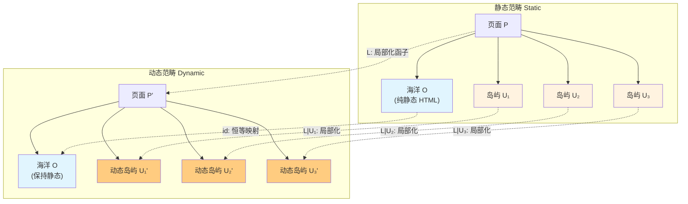
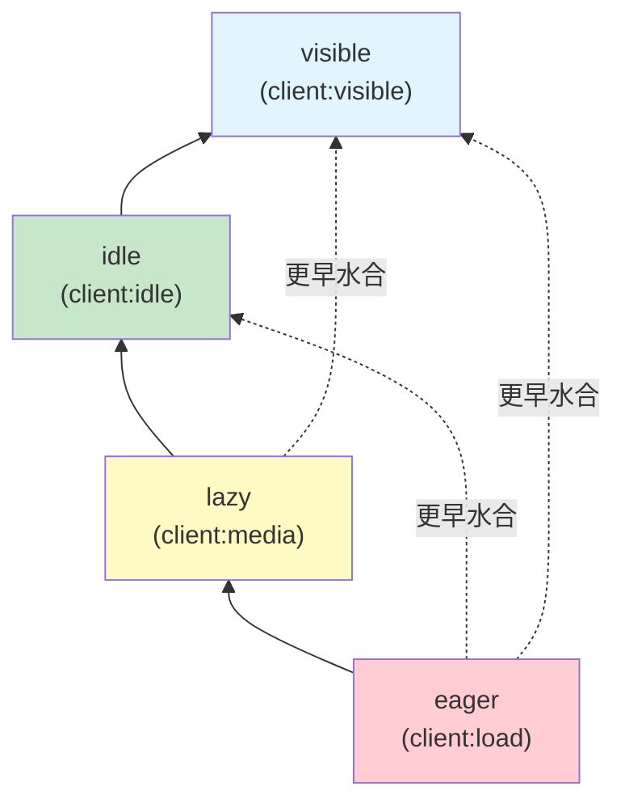
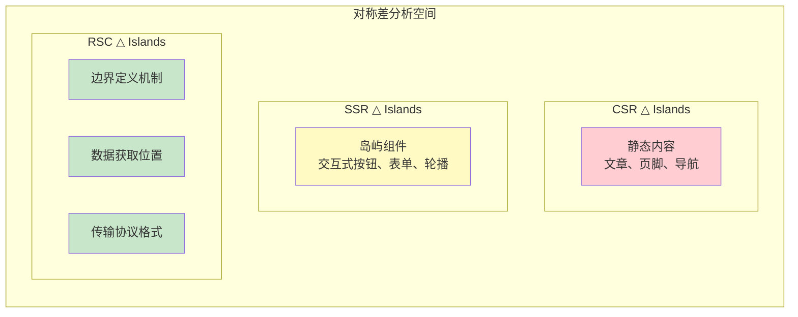

# Islands 架构的范畴论语义

## 引言

Islands 架构（Islands Architecture）由 Astro 团队在 2021 年提出并率先实现，代表了前端渲染策略的一次深刻范式转移。
与传统的服务端渲染（SSR）和客户端渲染（CSR）二元对立不同，Islands 架构引入了一种"选择性水合"（selective hydration）的中间道路：页面主体保持为静态 HTML 的"海洋"，而交互式组件则作为孤立的"岛屿"嵌入其中，仅在必要时才被激活为动态实体。
这一架构不仅带来了显著的性能提升——通过减少客户端 JavaScript 的下载、解析和执行量——而且在概念层面揭示了一个深刻的事实：**现代 Web 应用的渲染策略空间并非离散的选项集合，而是一个具有丰富代数结构的连续谱系**。

从范畴论的视角审视，Islands 架构的诸多工程概念可以被精确地形式化。
静态页面与动态岛屿之间的边界可以被理解为两个范畴之间的自然变换（natural transformation）；
不同的 hydration 策略构成了从"惰性范畴"到"活性范畴"的函子（functor）族；
这些策略之间存在的优先关系则形成了一个偏序集（poset）；
而 Astro 的编译过程本身，则可以被建模为从源代码范畴到优化后输出范畴的一个结构保持映射。
本文旨在构建这一形式化框架，为前端工程的实践提供坚实的数学基础，同时借助数学的精确性来澄清日常讨论中常见的概念混淆。

形式化方法的价值不在于取代工程实践，而在于为实践提供概念罗盘。
当开发者面对"何时使用 Islands"、"如何选择 hydration 策略"、"Islands 与 React Server Components 有何本质区别"等问题时，范畴论语义能够提供超越具体框架实现的一般性原理。
正如类型系统为程序提供了静态保证，范畴论语义为架构决策提供了结构保证。

## 理论严格表述

### Islands 作为范畴局部化

在范畴论中，一个**范畴** $\mathbf{C}$ 由对象（objects）集合 $\text{Ob}(\mathbf{C})$ 和态射（morphisms）集合 $\text{Hom}(\mathbf{C})$ 组成，配备有满足结合律的单位态射。对于前端开发者而言，可以将对象理解为不同的"状态空间"——例如页面状态、组件状态、全局存储状态——而态射则是状态之间的变换函数。

**局部化**（localization）是范畴论中的一个基本操作。给定范畴 $\mathbf{C}$ 和一个态射类 $S \subseteq \text{Mor}(\mathbf{C})$，$S$-局部化范畴 $S^{-1}\mathbf{C}$ 是通过形式地为 $S$ 中的每个态射添加逆态射而构造的新范畴。具体而言，局部化满足如下泛性质：存在典范函子 $L: \mathbf{C} \to S^{-1}\mathbf{C}$，使得对所有 $s \in S$，$L(s)$ 都是同构（isomorphism）；并且任何将 $S$ 中态射变为同构的函子 $F: \mathbf{C} \to \mathbf{D}$ 都唯一地通过 $L$ 分解。

在 Web 渲染的语境下，我们可以定义两个基本范畴：

**定义（静态范畴 $\mathbf{Static}$）**：对象是纯 HTML 文档（无 JavaScript 交互能力），态射是服务器端的文档到文档的转换，例如模板渲染、Markdown 编译、静态站点生成（SSG）中的页面路由跳转。

**定义（动态范畴 $\mathbf{Dynamic}$）**：对象是具备完整交互能力的 DOM 树（附带事件监听器、状态、生命周期），态射是客户端的状态更新函数，包括 React 的 `setState`、事件处理函数、副作用执行等。

Islands 架构的核心洞察在于：**并非整个页面都需要从静态范畴局部化到动态范畴**。在传统 CSR 中，整个页面是一个需要从 $\mathbf{Static}$ 完全局部化到 $\mathbf{Dynamic}$ 的对象；在纯 SSR/SSG 中，页面则完全停留在 $\mathbf{Static}$ 中。Islands 架构采取了一种选择性策略：只有特定的子对象——即"岛屿"——需要进行局部化。

形式地，设页面 $P$ 是 $\mathbf{Static}$ 中的一个对象。在 Islands 架构下，$P$ 被分解为互不相交的子对象族：

$$
P = \left(\bigcup_{i \in I} U_i\right) \cup O
$$

其中 $U_i$ 是第 $i$ 个交互式岛屿，$O$ 是包围它们的静态"海洋"。每个岛屿 $U_i$ 都关联一个局部化态射类 $S_i$，该态射类捕获了使 $U_i$ 从静态转变为动态所需的所有变换（事件绑定、状态初始化、组件挂载）。Islands 架构的编译器和运行时系统所做的，正是构造一个**局部化函子**：

$$
\mathcal{L}_{\text{islands}}: \mathbf{Static}_{/P} \longrightarrow \mathbf{Dynamic}_{/P}
$$

其中 $\mathbf{Static}_{/P}$ 表示 $\mathbf{Static}$ 中位于 $P$ 之下的切片范畴（slice category），该函子仅在岛屿对象 $U_i$ 上非平凡地作用，而在海洋对象 $O$ 上保持恒等（identity）。这一构造精确地捕捉了 Islands 架构"部分水合"的本质：**局部化是有选择性的，而非全局性的**。

从计算的角度理解，范畴的局部化对应于**可逆计算的受控引入**。在静态范畴中，所有态射都是"单向的"——服务器生成 HTML 并发送给客户端，这一过程在客户端没有回退机制。动态范畴则允许双向的态射：状态可以更新，UI 可以响应用户输入。Hydration 就是在特定的 DOM 子树上引入这种可逆性。然而，可逆性是有成本的：每个动态岛屿都需要下载对应的 JavaScript 代码、解析和编译、执行 hydration 逻辑、维持运行时的响应系统。Islands 架构通过局部化极大地限制了这些成本的适用范围。如果一个页面的交互区域仅占页面总内容的 10%，那么 Islands 架构理论上可以将客户端 JavaScript 成本降低近 90%。这正是范畴局部化在前端工程中的计算解释：**只在需要可逆性的地方引入可逆性**。

### 岛屿边界作为自然变换

范畴论中的**自然变换**（natural transformation）是两个函子之间的一种"兼容的映射族"。给定两个函子 $F, G: \mathbf{C} \to \mathbf{D}$，自然变换 $\alpha: F \Rightarrow G$ 为 $\mathbf{C}$ 中的每个对象 $X$ 指派一个 $\mathbf{D}$ 中的态射 $\alpha_X: F(X) \to G(X)$，使得对于 $\mathbf{C}$ 中的任意态射 $f: X \to Y$，自然性条件（naturality condition）成立：无论我们是先转换后映射，还是先映射后转换，结果必须一致。

在 Islands 架构中，"岛屿边界"（island boundary）正是这样一个自然变换。考虑两个函子：

- $F_{\text{static}}: \mathbf{Page} \to \mathbf{Static}$：将页面组件树映射为其服务器端渲染的纯 HTML 表示。
- $F_{\text{dynamic}}: \mathbf{Page} \to \mathbf{Dynamic}$：将页面组件树映射为其完全客户端激活后的动态表示。

这里 $\mathbf{Page}$ 是页面源码范畴，其对象是 Astro 组件、React 组件、Vue 组件等构成的树结构，态射是组件的嵌套和组合关系。岛屿边界自然变换 $\beta: F_{\text{static}} \Rightarrow F_{\text{dynamic}}$ 的每个分量 $\beta_p$ 对应于页面 $p$ 上的 hydration 映射。然而，这个自然变换并非在所有对象上都有非平凡的分量——它只在那些被标记为"岛屿"的组件处"激活"。这导致了一个有趣的结构：$\beta$ 是一个**部分定义的**（partially defined）或**带支持集的**（supported）自然变换，其支持集（support）恰好是页面中所有岛屿的集合。

形式地，设 $\iota: \mathbf{Island} \hookrightarrow \mathbf{Page}$ 是岛屿子范畴的包含函子。则实际的 hydration 过程可以描述为：存在一个自然变换 $\beta \circ \iota: F_{\text{static}} \circ \iota \Rightarrow F_{\text{dynamic}} \circ \iota$，使得对于任何非岛屿组件 $c \in \mathbf{Page} \setminus \mathbf{Island}$，对应的态射 $\beta_c$ 是恒等映射（因为纯静态内容无需转换）。

Astro 编译器在构建时必须识别哪些组件是岛屿。从范畴论的角度看，这相当于确定自然变换 $\beta$ 的支持集。Astro 使用明确的指令（directive）来标记岛屿边界，例如 `client:load`、`client:visible` 等。这些指令可以被视为对函子 $F_{\text{dynamic}}$ 的"调用约束"，规定了从 $F_{\text{static}}$ 到 $F_{\text{dynamic}}$ 的转换在何时、以何种方式发生。

边界检测的正确性条件可以用自然性来表述。设 $f: A \to B$ 是页面范畴中的一个组件嵌套态射（即组件 $A$ 嵌套在组件 $B$ 内）。如果 $A$ 和 $B$ 都是岛屿，则它们各自有 hydration 映射 $\alpha_A$ 和 $\alpha_B$。自然性条件要求：

$$
\alpha_B \circ F_{\text{static}}(f) = F_{\text{dynamic}}(f) \circ \alpha_A
$$

在工程实现中，这意味着子岛屿的 hydration 必须与其在父组件中的静态表示兼容。例如，如果父岛屿已经水合，子岛屿的水合不应破坏父岛屿已经建立的事件监听或状态。Astro 的运行时通过维护一个全局的岛屿注册表（island registry）来确保这一自然性条件的实现：每个岛屿在激活时向注册表报告，注册表确保激活顺序符合组件树的层次结构。

在更高级的形式化中，我们可以将静态范畴和动态范畴视为一个 2-范畴 $\mathbf{WebRender}$ 中的对象，函子 $F_{\text{static}}$ 和 $F_{\text{dynamic}}$ 视为 1-胞腔（1-cells），而岛屿边界自然变换 $\beta$ 则是这两者之间的 2-胞腔（2-cell）。这种观点的好处在于，它允许我们讨论"变换之间的变换"——例如，从一个 hydration 策略切换到另一个策略，这对应于 2-范畴中的 2-胞腔之间的复合。

### Hydration 策略的函子语义与偏序结构

Hydration 策略是 Islands 架构的核心机制，决定了动态岛屿从静态 HTML 到交互式组件的转换时机。在范畴论语义中，每种策略都对应一个从"触发条件范畴"到"水合结果范畴"的函子。

定义**触发条件范畴** $\mathbf{Trigger}$：其对象为可观察的浏览器事件或状态，例如 `DOMContentLoaded`、`requestIdleCallback` fired、`IntersectionObserver` triggered、user interaction 等；态射为触发条件之间的蕴含关系（implication）。定义**水合结果范畴** $\mathbf{Hydrate}$：其对象为水合后的组件状态（如 `'hydrated'`, `'active'`, `'destroyed'`），态射为状态之间的合法转换。每种 hydration 策略 $S$ 确定一个函子 $H_S: \mathbf{Trigger} \to \mathbf{Hydrate}$。

- **Eager hydration**（`client:load`）：对应于一个与触发条件几乎无关的函子 $H_{\text{eager}}$，将几乎所有触发条件映射到同一个水合态射 $\text{static} \to \text{hydrated}$。
- **Lazy hydration**（`client:media`）：对应于由特定媒体查询或路由条件触发的函子 $H_{\text{lazy}}$，在子范畴上为 eager，在外部为 skip。
- **Idle hydration**（`client:idle`）：对应于将时间资源纳入考虑的函子 $H_{\text{idle}}: \mathbf{Trigger} \times \mathbf{Time} \to \mathbf{Hydrate}$。
- **Visible hydration**（`client:visible`）：对应于基于可观察性的函子 $H_{\text{visible}}$，定义在纤维积范畴上。

在 Astro 的工程实践中，开发者凭直觉知道 eager hydration "更强"或"更早"于 visible hydration。这种直觉可以被精确地形式化为 hydration 策略范畴上的一个偏序关系（partial order）。**定义（策略支配）**：设 $S_1$ 和 $S_2$ 是两个 hydration 策略。我们说 $S_1$ **支配** $S_2$，记作 $S_1 \succeq S_2$，如果对于所有页面 $p$ 和所有岛屿 $i$，在策略 $S_1$ 下 $i$ 的水合时刻不晚于在策略 $S_2$ 下的水合时刻（以概率 1 意义下）。

Hydration 策略在支配关系下形成一个**偏序集**（poset），主要的策略满足如下序关系：

$$
\text{eager} \succeq \text{lazy} \succeq \text{idle} \succeq \text{visible}
$$

这一偏序集本身可以被视为一个范畴：对象是策略，当且仅当 $S_1 \succeq S_2$ 时存在唯一的态射 $S_1 \to S_2$。范畴论中，这种从偏序集构造的范畴被称为**偏序范畴**（posetal category）。从函子的角度理解，偏序 $S_1 \succeq S_2$ 意味着存在一个**自然变换**（实际上是唯一的）从 $H_{S_1}$ 到 $H_{S_2}$。

### Islands 与 SSR/CSR/RSC 的形式对称差

为了精确理解 Islands 架构在渲染策略谱系中的位置，我们需要将其与 SSR（Server-Side Rendering）、CSR（Client-Side Rendering）和 RSC（React Server Components）进行形式化的比较。这四种策略可以被统一地理解为从**源码范畴** $\mathbf{Source}$ 到**渲染结果范畴** $\mathbf{Render}$ 的不同函子路径。

- **CSR**：$R_{\text{CSR}}$ 将源码完全映射到客户端 JavaScript，服务器仅发送最小 HTML 外壳。静态生成与动态激活之间没有区分——整个页面是一个单一的动态对象。
- **SSR**：$R_{\text{SSR}}$ 首先在服务器上映射源码为 HTML（静态态射），然后将该 HTML 发送到客户端，最后在客户端执行全局水合（动态态射）。形式上，$R_{\text{SSR}} = H_{\text{global}} \circ S$，其中 $S$ 是服务端渲染函子，$H_{\text{global}}$ 是全局 hydration 函子。
- **RSC**：$R_{\text{RSC}}$ 将组件分为 Server Components 和 Client Components 两类，只有后者需要 hydration。形式上，$R_{\text{RSC}}$ 是一个**余积函子**（coproduct functor）。
- **Islands**：$R_{\text{Islands}}$ 将页面映射为静态海洋与动态岛屿的**极限**（limit）构造。形式上，$R_{\text{Islands}}(P) = \lim\left( \{R_{\text{static}}(O)\} \cup \{R_{\text{dynamic}}(U_i)\}_{i \in I} \right)$，其中极限在页面布局的切片范畴上取。

集合论中的**对称差**（symmetric difference）$A \triangle B = (A \setminus B) \cup (B \setminus A)$ 度量了两个集合之间的差异。将其推广到范畴：定义策略 $S_1$ 和 $S_2$ 的**对称差**为所有那些在不同策略下产生不同渲染结果的源码对象。

CSR 与 Islands 的对称差在于**静态内容的处理**。在 CSR 中，即使是纯静态内容（如文章正文、页脚版权信息）也必须通过 JavaScript 生成，因为整个应用是一个单一的客户端框架实例。在 Islands 中，这些内容直接作为服务器渲染的 HTML 输出，无需任何客户端 JavaScript。形式地，设 $\mathbf{StaticContent} \subset \mathbf{Source}$ 是纯静态内容组件的子范畴，则 $\text{CSR} \triangle \text{Islands} = \mathbf{StaticContent}$。这一对称差精确量化了 Islands 相对于 CSR 的性能优势：**所有静态内容都是对称差的元素，都是性能节省的来源**。

纯 SSR（无 hydration）与 Islands 的对称差在于**交互内容的处理**。在纯 SSR 中，所有内容都是静态 HTML，没有任何客户端激活；在 Islands 中，被标记为岛屿的组件会进行 hydration。形式地，$\text{SSR} \triangle \text{Islands} = \mathbf{Island} \subset \mathbf{Source}$。即对称差恰好是页面中被标记为岛屿的组件集合。这一对称差虽然看起来简单，但它揭示了一个深刻的权衡：Islands 在纯 SSR 的基础上增加了交互能力，但代价是对称差中每个元素对应的 JavaScript 执行成本。

Islands 与 React Server Components 的比较可以从多个维度分析：**边界定义方式**（显式指令 vs 模块系统级区分）、**数据获取模型**（Astro 顶层 await vs 组件内 async/await）、**打包与传输**（标准 HTML + script 标签 vs RSC Payload 流式传输）。

## 工程实践映射

### Astro 编译器作为函子

Astro 的编译过程可以被形式化为一个函子 $C_{\text{Astro}}: \mathbf{Source} \to \mathbf{Output}$。其中 $\mathbf{Source}$ 是 Astro 源码范畴，对象是 `.astro` 文件、`.md` 文件、`.mdx` 文件和 islands（React/Vue/Svelte/Preact/Solid/Lit 组件），态射是 `import` 关系、组件嵌套和 frontmatter 依赖。$\mathbf{Output}$ 是构建产物范畴，对象是生成的 HTML 文件、JavaScript chunks、CSS assets、和 SSR 函数，态射是 HTML 中的 `<script>` 引用、CSS `@import`、和动态导入（dynamic imports）。

函子 $C_{\text{Astro}}$ 必须保持结构：如果源码中组件 $A$ 导入组件 $B$，则输出中 $A$ 的渲染结果必须能够访问 $B$ 的对应资源。这对应于范畴论语义中的**函子保持复合**（functor preserves composition）。Astro 编译器的核心操作之一是**岛屿分离**（island separation）：它必须扫描所有 `.astro` 文件，识别其中使用的 UI 框架组件，并根据其指令将它们标记为不同 hydration 策略的岛屿。在范畴论语义中，这对应于函子 $C_{\text{Astro}}$ 的一个特殊性质——它不仅仅是映射对象和态射，而且要进行**分解**（decomposition）。

具体而言，$C_{\text{Astro}}$ 将源码对象 $p$（一个 `.astro` 页面）映射为一个**余积**（coproduct）输出：

$$
C_{\text{Astro}}(p) = \text{HTML}_p \sqcup \left(\bigsqcup_{i \in I} \text{JS}_i\right) \sqcup \text{CSS}_p
$$

其中 $\text{HTML}_p$ 是服务器渲染的静态 HTML（包含海洋和岛屿占位符），$\text{JS}_i$ 是第 $i$ 个岛屿对应的客户端 JavaScript chunk，$\text{CSS}_p$ 是提取的样式。这一余积结构是 Astro 构建产物最显著的特征：与 Next.js 的 CSR/SSR 输出通常是一个大体积的 JavaScript bundle 不同，Astro 的输出天然地是离散的、按需加载的 chunk 集合。

Astro 编译器不仅执行基本的源码到产物映射，还执行大量优化：tree-shaking 未使用的 islands、hoisting 静态内容、inlining 关键 CSS 等。这些优化可以被理解为从"朴素编译函子" $C_{\text{naive}}$ 到"优化编译函子" $C_{\text{opt}}$ 之间的**自然变换** $\eta: C_{\text{naive}} \Rightarrow C_{\text{opt}}$。自然性条件保证了优化的正确性：对于任何源码态射 $f: A \to B$（例如页面 $A$ 导入组件 $B$），先编译再优化与先优化再编译的结果必须一致。这是 Astro 构建系统可靠性的数学基础。

### 交互岛屿的范畴论：子范畴结构与通信

从范畴论的内部视角看，每个交互岛屿本身都可以被理解为一个**子范畴**（subcategory）。设页面范畴为 $\mathbf{Page}$，一个岛屿 $U$ 对应于 $\mathbf{Page}$ 的一个满子范畴 $\mathbf{U} \subseteq \mathbf{Page}$，其对象是构成该岛屿的所有组件和状态节点，态射是它们之间的数据流和事件传递。这一视角的价值在于，它允许我们将复杂的页面分解为多个独立的、可分析的子结构。在传统 CSR 中，整个页面是一个巨大的范畴，其中的态射纠缠不清——任何组件都可能通过全局状态、事件总线或上下文（context）与任何其他组件交互。在 Islands 架构中，页面范畴被分解为以静态海洋为背景的离散子范畴族，每个子范畴内部的态射是局部的，而子范畴之间的态射则是受控的。

当两个岛屿需要通信时（例如，一个岛屿中的按钮触发另一个岛屿中的状态更新），这种跨岛通信在范畴论中可以被形式化为**跨度**（span）或**余跨度**（cospan）。一个跨度是由两个共享域的态射组成的结构：$A \leftarrow C \rightarrow B$。在 Islands 架构中，如果岛屿 $U_1$ 需要向岛屿 $U_2$ 发送消息，通常的做法是通过一个共享的**海洋级**（ocean-level）机制：Custom Events、全局状态存储、或 URL 查询参数。这对应于一个跨度，其中 $C$ 是通信媒介（事件总线或存储），左态射 $C \to U_1$ 是事件监听，右态射 $C \to U_2$ 是事件分发。

多个岛屿可以被视为一个**图表**（diagram）$D: \mathbf{I} \to \mathbf{Page}$，其中 $\mathbf{I}$ 是索引范畴。该图表的**极限**（limit）对应于所有岛屿的共享状态或公共接口——即所有岛屿必须一致同意的信息。例如，页面的主题（dark/light mode）可以被视为岛屿图表的极限，因为所有岛屿都需要观察和响应这一全局状态。对偶地，图表的**余极限**（colimit）对应于所有岛屿的"并集"或综合效果。例如，一个多步骤表单分布在多个岛屿中，整个表单的提交状态可以被视为这些岛屿的余极限。

### 决策框架与工程最佳实践

基于前述的范畴论语义，我们可以建立一个系统性的决策框架，用于判断何时采用 Islands 架构、何时采用其他渲染策略。决策的核心是分析**内容范畴** $\mathbf{Content}$ 和**交互范畴** $\mathbf{Interaction}$ 在目标页面中的相对比例和结构。

设页面 $P$ 的内容-交互分解为 $P = O \sqcup \left(\bigsqcup_{i} U_i\right)$，其中 $O$ 是静态海洋，$U_i$ 是交互岛屿。定义页面的**交互密度**（interaction density）为：

$$
\rho_{\text{int}}(P) = \frac{\sum_i |U_i|}{|O| + \sum_i |U_i|}
$$

**命题（Islands 适用性）**：Islands 架构在页面 $P$ 上的性能优势正比于 $(1 - \rho_{\text{int}}(P)) \cdot C_{\text{static}}$，其中 $C_{\text{static}}$ 是纯静态渲染的单位成本节省。因此，Islands 架构最适合交互密度 $\rho_{\text{int}}$ 较低（通常 $< 0.3$）的页面。

| 场景特征 | 推荐策略 | 范畴论语义 | 理由 |
|----------|----------|------------|------|
| 首屏核心 UI，必须立即可交互 | `client:load` (eager) | 偏序最大元 $\top$ | 用户体验优先，接受初始 CPU 成本 |
| 首屏但非阻塞 UI，如侧边工具栏 | `client:idle` | 偏序中间元 | 平衡响应性与主线程压力 |
| 首屏下方内容，如评论、推荐 | `client:visible` | 偏序最小元 $\bot$ | 最小化初始加载，按需激活 |
| 响应式组件，仅特定断点需要 | `client:media` | 条件子范畴 | 避免不必要的移动端代码加载 |
| 重度交互应用，无 SEO 需求 | `client:only` | 跳过静态函子 | 完全放弃 SSR，最小化双重渲染成本 |
| 纯静态内容，无交互 | 无指令 | 恒等函子 id | 保持纯静态，零 JS 开销 |

一个典型的营销着陆页包含：导航栏（交互）、Hero 区域（静态图文）、特性列表（静态）、演示视频（轻度交互）、客户评价（静态）、CTA 按钮（交互）、页脚（静态）。交互密度 $\rho_{\text{int}} \approx 0.15$。使用 Islands 架构，导航栏和 CTA 作为 eager 岛屿，演示视频播放器作为 idle 岛屿，其余保持静态。这实现了几乎纯静态页面的加载速度，同时保留了关键交互。反之，一个数据可视化 Dashboard 包含：实时图表（20+ 交互组件）、过滤器面板（重度交互）、数据表格（虚拟滚动 + 排序 + 筛选）、拖拽布局系统。交互密度 $\rho_{\text{int}} \approx 0.85$。如果强行使用 Islands 架构，几乎所有内容都是岛屿，静态海洋仅占极少部分。此时 Islands 架构的收益微乎其微，而编译复杂性和运行时岛屿管理开销反而成为负担。这种情况下，传统的 SPA（Next.js App Router、Remix、或纯 Vite + React）是更合适的选择。

## Mermaid 图表

### 局部化函子示意图

### Hydration 策略偏序结构

### 渲染策略对称差分析

## 理论要点总结

本文从范畴论的角度对 Islands 架构进行了系统的形式化分析，核心贡献可归纳为以下六个方面：

1. **局部化解释**：将 Islands 架构的核心机制——选择性水合——形式化为范畴的局部化操作，明确了"静态海洋 + 动态岛屿"结构的数学内涵。局部化函子 $\mathcal{L}_{\text{islands}}$ 仅在岛屿对象上非平凡地作用，而在海洋对象上保持恒等，这一构造精确捕捉了 Islands 架构"部分水合"的本质。

2. **自然变换语义**：将岛屿边界形式化为静态函子与动态函子之间的自然变换，自然性条件对应于工程实践中 hydration 时序的正确性约束。子岛屿的 hydration 必须与其在父组件中的静态表示兼容，Astro 运行时的岛屿注册表正是这一自然性条件的工程实现。

3. **函子化策略**：将四种主要 hydration 策略（eager、lazy、idle、visible）分别建模为具有不同定义域和触发语义的结构保持映射。Eager 对应恒等函子，lazy 对应子范畴选择函子，idle 对应乘积范畴上的不可分解函子，visible 对应空间-时间纤维积上的可观察函子。

4. **偏序决策空间**：揭示了 hydration 策略之间的支配偏序 eager $\succeq$ lazy $\succeq$ idle $\succeq$ visible，为策略选择提供了数学依据。这一偏序结构保证了混合使用多种策略时的时序一致性，并指导了策略细化的方向。

5. **对称差分析**：通过形式化的对称差概念，精确量化了 Islands 与 CSR、SSR、RSC 之间的本质差异。CSR 与 Islands 的对称差是静态内容，SSR 与 Islands 的对称差是岛屿组件，RSC 与 Islands 的对称差则涉及边界定义、数据获取和传输格式三个维度。

6. **编译器函子**：将 Astro 的编译过程理解为从源码范畴到构建产物范畴的结构保持映射，岛屿分离对应于余积构造。编译优化被建模为从朴素编译函子到优化编译函子之间的自然变换，自然性条件保证了优化的正确性。

这些形式化结果不仅具有理论价值，也为工程实践提供了概念工具。当开发者在 Astro 项目中标记一个 `client:visible` 指令时，他们实际上是在选择一个特定的函子来局部化一个子范畴；当他们在父组件和子组件上使用不同策略时，他们实际上是在维护一个自然变换的自然性条件。范畴论语义为这些日常操作赋予了更深层的结构理解。

未来的研究方向包括：将 Islands 架构的形式语义扩展到**流式传输**（streaming）场景，其中局部化不再是离散的"静态→动态"跳转，而是一个随时间演化的连续过程；探索 Islands 与**线性类型系统**（linear type systems）的联系，因为岛屿的"一次性水合"特性与线性逻辑中的资源消耗有深刻的相似性；以及建立 Islands 架构的**操作语义**（operational semantics），使其能够进行形式化验证和模型检测。

## 参考资源

1. Astro Team. *Astro Islands Architecture*. Astro Documentation, 2021. <https://docs.astro.build/en/concepts/islands/>

2. Mac Lane, S. *Categories for the Working Mathematician* (2nd ed.). Springer, 1998.（范畴论标准参考，局部化构造见 Chapter V）

3. Leinster, T. *Basic Category Theory*. Cambridge University Press, 2014.（自然变换、函子、极限的初等介绍）

4. React Team. *React Server Components*. RFC, 2020. <https://github.com/reactjs/rfcs/blob/main/text/0188-server-components.md>

5. Wadler, P. "Propositions as Types". *Communications of the ACM*, 58(12), 2015.（类型理论与范畴论的 Curry-Howard-Lambek 对应）
