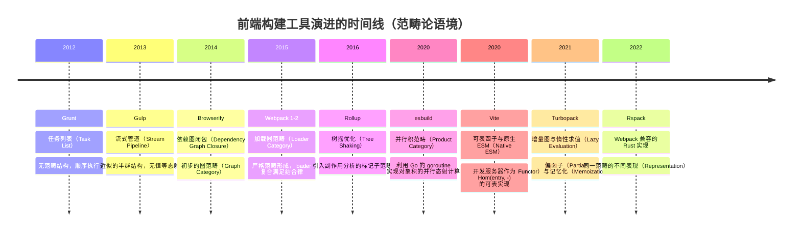
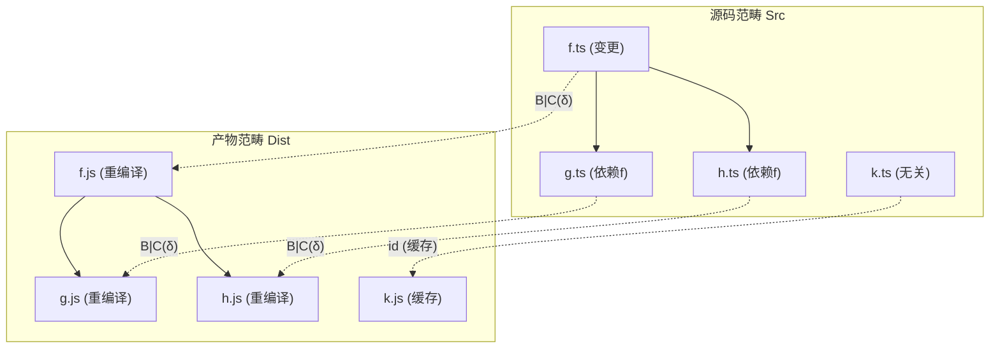
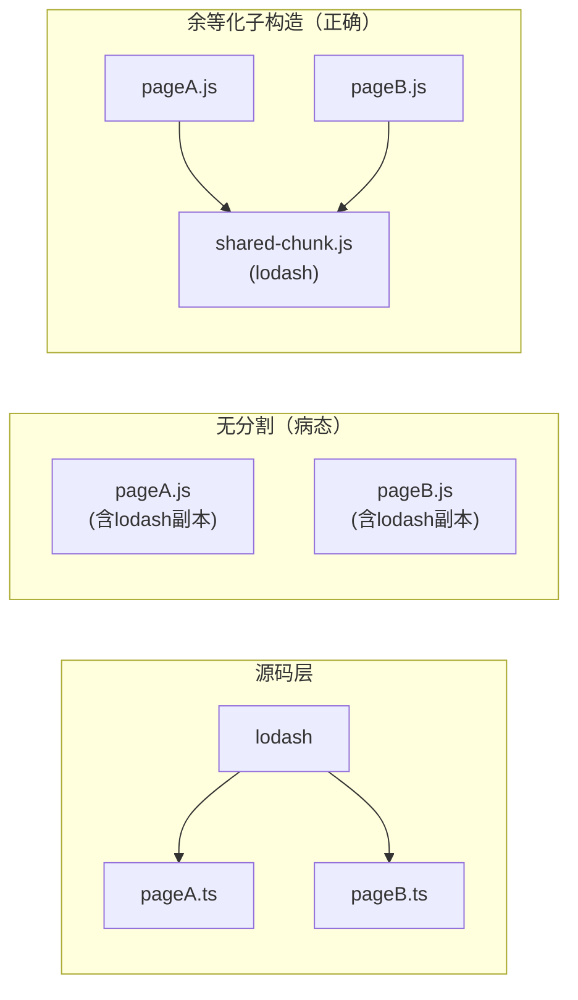

# 构建工具理论的范畴论模型

## 引言

现代前端构建工具的全部行为——依赖解析、转换管道、增量编译、代码分割、模块联邦——均可在范畴论（Category Theory）中找到严格的数学对应。从 2012 年的 Grunt 到 2024 年的 Rolldown，前端构建系统经历了从任务列表到数学封闭结构的深刻演进。本文建立从源码范畴到产物范畴的连续数学谱系，证明构建系统本质上是一个**从源码范畴到产物范畴的协变函子** $F: \mathbf{Src} \to \mathbf{Dist}$，其局部性质由可表函子（Representable Functor）刻画，全局性质由余极限（Colimit）与余等化子（Coequalizer）刻画。

范畴论为构建工具的研究提供了统一的语言。对象对应源文件、模块、产物、配置对象等静态实体；态射对应转换、导入关系、编译步骤、优化 pass 等动态映射；复合运算满足结合律，对应转换的管道化串联。函子对应构建命令，自然变换对应配置升级与模式切换，余极限对应代码分割与公共 chunk 提取，可表函子对应 Vite dev server 的按需预构建。通过这一框架，工具选择不再是纯粹的经验判断，而可以转化为范畴论问题的求解。

形式化方法在构建工具领域的价值尤为突出。当开发者面对"选择 Webpack 还是 Vite"、"如何配置代码分割"、"模块联邦的共享依赖为何报错"等问题时，范畴论语义能够提供超越具体工具版本的一般性原理。正如类型系统为程序提供了静态保证，范畴论语义为构建配置提供了结构保证——任何违反泛性质（universal property）的配置（如重复 chunk、冲突 shared 模块）必然导致运行时错误。

## 理论严格表述

### 构建工具作为范畴：对象 = 源文件，态射 = 转换

一个**范畴** $\mathbf{C}$ 由三元组 $(\mathrm{Obj}(\mathbf{C}), \mathrm{Hom}(\mathbf{C}), \circ)$ 构成。在构建语境下，对象集对应源文件、模块、产物、配置对象等静态实体；态射集对应转换、导入关系、编译步骤、优化 pass 等动态映射；复合运算满足结合律，对应转换的管道化串联。对任意对象 $A \in \mathrm{Obj}(\mathbf{C})$，存在恒等态射 $\mathrm{id}_A: A \to A$，对应空转换（no-op transform）或自引用模块。

定义**源码范畴** $\mathbf{Src}$ 如下：对象为项目中的所有文件实体，记为 $f_i = (p_i, c_i, t_i, h_i)$，其中 $p_i$ 为绝对路径，$c_i$ 为文件内容（字节序列），$t_i \in \{ \text{ts}, \text{js}, \text{css}, \text{vue}, \text{svelte}, \dots \}$ 为类型标签，$h_i = \mathrm{hash}(c_i)$ 为内容哈希。态射 $\alpha: f_i \to f_j$ 当且仅当文件 $f_j$ 的生成逻辑直接依赖于 $f_i$ 的内容。复合由传递闭包给出，结合律由函数复合的天然性质保证。

定义**产物范畴** $\mathbf{Dist}$，其对象为构建输出（`dist/` 目录下的文件），态射为输出之间的引用关系（如 chunk 间的 `import()` 动态加载边）。**构建函子** $B: \mathbf{Src} \to \mathbf{Dist}$ 满足：对象映射 $B(f_i) = d_i$；态射映射保持依赖方向；恒等保持 $B(\mathrm{id}_{f_i}) = \mathrm{id}_{B(f_i)}$；复合保持 $B(\beta \circ \alpha) = B(\beta) \circ B(\alpha)$。

在范畴论中，**初始对象** $\mathbf{0}$ 满足对任意对象 $A$，存在唯一的态射 $\mathbf{0} \to A$；**终止对象** $\mathbf{1}$ 满足对任意对象 $A$，存在唯一的态射 $A \to \mathbf{1}$。Entry 模块（如 `src/main.ts`）是事实上的初始对象——所有其他模块最终通过 import 链从它可达。`dist/index.html` 作为最终产物，所有 chunk 都 converges 到它，是终止对象的工程实现。

| 范畴论语义 | 构建工具实例 | 直觉图景 |
|---|---|---|
| 对象（Object） | `src/index.ts`、`dist/bundle.js`、`vite.config.ts` | 构建图中的节点，携带类型、路径、哈希等元数据 |
| 态射（Morphism） | Babel 转译、Sass 编译、Tree Shaking、Code Splitting | 有向边，标注转换器与代价 |
| 恒等态射（Identity） | Passthrough loader、Raw loader | "什么都不做"的合法转换 |
| 复合（Composition） | Webpack loader pipeline：`sass-loader` $\circ$ `css-loader` $\circ$ `style-loader` | 三个连续阶段坍缩为一个语义整体 |
| 函子（Functor） | Vite 的 `build` 命令、esbuild 的 `transform` API | 保持结构的跨范畴映射 |
| 自然变换（Natural Transformation） | Webpack 4 到 Webpack 5 的插件迁移、Vite 2 到 Vite 5 的兼容性层 | 两种构建语义之间的"光滑过渡" |
| 余极限（Colimit） | 代码分割（Code Splitting）、公共 chunk 提取 | 将多个模块"粘合"为一个整体 |
| 可表函子（Representable Functor） | Vite dev server 的 `/node_modules/.vite/deps/` 按需预构建 | $F \cong \mathrm{Hom}(H, -)$，由单个对象 $H$ "代表" |

### 依赖图作为范畴：模块为对象，导入为态射

设项目模块集合为 $\mathcal{M} = \{M_1, M_2, \dots, M_n\}$。定义**模块范畴** $\mathbf{Mod}$：对象为模块 $M_i$；态射 $M_i \to M_j$ 当且仅当 $M_i$ 的源码文本中存在 `import ... from './path/to/Mj'` 或 `import('./path/to/Mj')`；复合由传递闭包给出。在此范畴中，$\mathrm{Hom}(\text{main.ts}, \text{Button.vue})$ 可能包含多条路径，这些路径在构建语义下是否交换（commute）取决于具体工具——Webpack 的副作用标记决定图是否交换，Vite 利用原生 ESM 使范畴在运行时的语义天然交换。

循环依赖 $M_i \leftrightarrow M_j$ 在范畴论中对应一对互逆态射。若 $f: M_i \to M_j$ 与 $g: M_j \to M_i$ 满足 $g \circ f = \mathrm{id}_{M_i}$ 且 $f \circ g = \mathrm{id}_{M_j}$，则 $M_i \cong M_j$（同构）。真正的循环同构极少见，多数循环依赖是"病态"的——$f$ 与 $g$ 并非严格互逆，而是运行时通过 hoisting 或 lazy initialization 勉强共存。范畴论提示我们：**任何循环依赖都意味着对象之间存在非平凡的同构或自态射（endomorphism）**，而自态射 $M_i \to M_i$ 在构建图中对应模块的自引用（self-import），这在数学上增加了态射空间的维度，在工程上增加了死锁风险。

### 增量编译作为函子复合

设构建函子为 $B: \mathbf{Src} \to \mathbf{Dist}$。对源码对象的修改 $\Delta f_i$（记为 $\delta_i: f_i \to f_i'$）诱导产物修改 $B(\delta_i): B(f_i) \to B(f_i')$。**增量编译的核心公理**：构建函子 $B$ 是**局部确定的（locally determined）**，即对任意 $f_i$，$B(f_i)$ 仅依赖于 $f_i$ 的**闭邻域** $N(f_i) = \{f_i\} \cup \mathrm{deps}(f_i)$。

现代构建工具将 $B$ 分解为子函子的复合：

$$B = B_n \circ B_{n-1} \circ \cdots \circ B_1$$

其中每个 $B_k$ 对应一个编译阶段：$B_1$ 为词法/语法分析，$B_2$ 为语义分析，$B_3$ 为转换（Babel、TypeScript 编译、CSS 预处理），$B_4$ 为优化（Tree Shaking、Minification、DCE），$B_5$ 为代码生成。若变更仅影响第 $k$ 层，则对 $j < k$ 的层 $B_j$ 可**记忆化（memoize）**。

Turbopack 的核心创新正是将每一层 $B_k$ 实现为**偏函子（partial functor）**——仅对变更闭包 $C(\delta_i) = \{ f_j \mid f_j \text{ transitively depends on } f_i \}$ 求值，其余对象使用缓存的恒等态射。定义**记忆化范畴** $\mathbf{Memo}$，其对象为 $(f_i, h_i, d_i)$ 三元组（文件、哈希、产物），态射为哈希变更触发的重新构建。存在**遗忘函子** $U: \mathbf{Memo} \to \mathbf{Src}$，投影到文件对象；以及**缓存函子** $C: \mathbf{Src} \to \mathbf{Memo}$，计算哈希并查询缓存。增量构建的交换图交换当且仅当缓存命中时 $B_{\mathrm{memo}} \circ C = B$，即缓存不改变构建语义。

### 束分割作为余等化子与余极限

在范畴论中，**余极限（Colimit）**是将多个对象"粘合"为一个整体的操作。**余等化子（Coequalizer）**则是将两个并行态射的像"等同化"的商构造。代码分割（Code Splitting）与公共 chunk 提取（Common Chunk Extraction）正是这两种构造的工程对应。

设模块 $M_a$ 与 $M_b$ 都导入了公共库 $M_l$（如 `lodash` 或 `react`）。在产物范畴中，存在两个并行态射：

$$e_a: M_l \to \mathrm{chunk}_a, \quad e_b: M_l \to \mathrm{chunk}_b$$

分别将 $M_l$ 内联到两个 chunk 中。这两个态射的**余等化子** $\mathrm{coeq}(e_a, e_b)$ 是一个对象 $C$（公共 chunk）与态射 $q: \mathrm{chunk}_a \to C$（抽象地），使得 $q \circ e_a = q \circ e_b$，且 $C$ 是满足此性质的**泛对象（universal object）**。工程上，这正是 `SplitChunksPlugin` 或 Vite 的 `manualChunks` 所做的——将公共依赖从多个入口中提取到共享 chunk，消除重复。

对于 $n$ 个路由页面 $\{P_1, P_2, \dots, P_n\}$，每个页面导入各自的组件集合。定义**图（diagram）** $D: \mathbf{J} \to \mathbf{Dist}$，其中索引范畴 $\mathbf{J}$ 编码了页面之间的公共依赖关系。**产物范畴中的代码分割对象** $S$ 是图 $D$ 的**余极限** $\varinjlim D$，满足泛性质：对每个页面 $P_i$，存在典范态射 $\iota_i: D(i) \to S$；对任意其他对象 $X$ 与相容的态射族 $f_i: D(i) \to X$，存在唯一的 $u: S \to X$ 使得 $f_i = u \circ \iota_i$。在 Webpack 中，$S$ 对应 `runtime~main.js` + `vendor.js` + `page~*.js` 的全部分割结果；$\iota_i$ 对应各 chunk 间的 `__webpack_require__.e` 动态加载边。

### 模块联邦作为模块范畴中的余积

在范畴 $\mathbf{C}$ 中，对象 $A$ 与 $B$ 的**余积** $A \sqcup B$ 是一个对象配备两个内射（injection）态射 $i_A: A \to A \sqcup B$ 与 $i_B: B \to A \sqcup B$，满足泛性质：对任意对象 $X$ 与态射 $f: A \to X, g: B \to X$，存在唯一的 $[f, g]: A \sqcup B \to X$ 使得 $[f, g] \circ i_A = f$ 且 $[f, g] \circ i_B = g$。

Webpack Module Federation 允许应用 $A$（host）与应用 $B$（remote）在运行时共享模块。在范畴论语境下：应用 $A$ 的模块构成范畴 $\mathbf{Mod}_A$；应用 $B$ 的模块构成范畴 $\mathbf{Mod}_B$；**联邦范畴** $\mathbf{Mod}_{A+B}$ 是 $\mathbf{Mod}_A$ 与 $\mathbf{Mod}_B$ 的**余积范畴**（coproduct category），其对象为 $\mathrm{Obj}(\mathbf{Mod}_A) \sqcup \mathrm{Obj}(\mathbf{Mod}_B)$，态射保持原范畴内部结构，跨应用态射由联邦运行时（runtime）在加载后动态建立。

**余积的泛性质**精确解释了模块联邦的架构约束：内射 $i_A, i_B$ 对应 `ModuleFederationPlugin` 的 `exposes` 配置，将本地模块暴露到联邦命名空间；唯一映射 $[f, g]$ 对应 host 应用通过 `remotes` 配置消费 remote 模块后，webpack runtime 构造的统一模块解析函数。

当 $A$ 与 $B$ 都依赖 `react@18` 时，联邦运行时通过 `shared` 配置确保两者使用**同一单例（singleton）**。范畴论上，这是在余积范畴上施加一个**等化子（equalizer）**：

$$E \xrightarrow{e} \text{react}_A \sqcup \text{react}_B \xrightarrow[f]{g} \text{react}_{\text{instance}}$$

其中 $f$ 与 $g$ 分别将两副本映射到运行时加载的单一实例。等化子 $E$ 正是共享 `react` 的"规范版本"，确保 hooks 的闭包在跨应用边界时保持一致。正确配置 `shared: { react: { singleton: true, requiredVersion: '^18.0.0' } }` 使得 $\text{react}_A$ 与 $\text{react}_B$ 在联邦范畴中等化，避免了 "Invalid Hook Call" 错误。

### Vite 开发服务器作为可表函子

函子 $F: \mathbf{C}^{\mathrm{op}} \to \mathbf{Set}$ 是**可表的（representable）**，若存在对象 $H \in \mathbf{C}$ 使得 $F \cong \mathrm{Hom}(-, H)$。对象 $H$ 称为 $F$ 的**表示对象（representing object）**。

Vite 的开发服务器（dev server）在数学上是一个**可表函子**：

$$F_{\text{vite}}: \mathbf{Src}^{\mathrm{op}} \to \mathbf{Set}$$

对任意模块 $M$，$F_{\text{vite}}(M)$ 是 $M$ 的**所有合法开发状态集合**——包括经转换后的 ESM 源码文本、Source map、HMR（热更新）边界标记、依赖优化缓存元数据。**核心定理**：$F_{\text{vite}}$ 由 **entry 模块** $E$（通常是 `index.html` 或 `src/main.ts`）可表，即 $F_{\text{vite}}(M) \cong \mathrm{Hom}(M, E)$。这里的 $\mathrm{Hom}(M, E)$ 在 $\mathbf{Src}^{\mathrm{op}}$ 中对应从 $E$ 到 $M$ 的依赖路径——因为 Vite 的 dev server 按需编译（on-demand compilation），只有当浏览器请求到达时，Vite 才沿着 `import` 链从 entry 反向遍历到目标模块 $M$，执行必要的转换。

**Yoneda 引理**断言：对任意函子 $F: \mathbf{C}^{\mathrm{op}} \to \mathbf{Set}$ 与对象 $A \in \mathbf{C}$，有 $\mathrm{Nat}(\mathrm{Hom}(-, A), F) \cong F(A)$。Vite 的 `importAnalysis` 插件正是 Yoneda 引理的具身化：当浏览器请求 `/src/App.vue` 时，Vite 需要知道如何处理这个请求——即求值 $F_{\text{vite}}(\text{App.vue})$；根据可表性，这等价于求值 $\mathrm{Hom}(\text{App.vue}, E)$，即从 entry 到 App.vue 的依赖路径；路径上的每个中间模块都触发了 Yoneda 嵌入的自然变换，将模块的"局部信息"转化为"全局响应"。

### Webpack 的 Loader Pipeline 与 Turbopack 的惰性求值

Webpack 的 loader 系统构成一个**内范畴（enriched category）**。给定文件类型 $\tau$，定义 **loader 范畴** $\mathbf{Loader}_{\tau}$：对象为类型为 $\tau$ 的源码模块；态射为 loader 链 $[l_1, l_2, \dots, l_n]$；复合为数组拼接。每个 loader 可以视为一个自函子 $L_i: \mathbf{Mod} \to \mathbf{Mod}$，整个 loader pipeline 是 $n$ 个自函子的复合 $L_{\text{pipeline}} = L_1 \circ L_2 \circ \cdots \circ L_n$。loader 不是任意自函子，而是**幺半群（monoid）** $(\mathbf{End}(\mathbf{Mod}), \circ, \mathrm{id})$ 中的元素。

在计算理论中，**惰性求值（Lazy Evaluation）**对应**偏函数（partial function）**或**延迟态射（deferred morphism）**。范畴论中，这可以通过**Kleisli 范畴**建模。对构建工具，定义**延迟函子** $T: \mathbf{Set} \to \mathbf{Set}$，$T(X) = X \cup \{\bot\}$，其中 $\bot$ 表示"未计算"。构建图中的节点初始为 $\bot$，仅在首次请求或变更传播时求值为实际产物。

Turbopack 将构建图维护为一个**有向无环图（DAG）**，其中每个节点是一个**偏函子** $f_i: \mathrm{Inputs}_i \rightharpoonup \mathrm{Output}_i$。当输入变更 $\delta$ 发生时，Turbopack 仅重新求值受影响节点闭包 $C(\delta)$ 中的偏函子，其余节点保持记忆化结果。形式上，Turbopack 的构建函子 $B_{\text{turbo}}$ 是**逐点定义的（pointwise defined）**：

$$B_{\text{turbo}}(M) = \begin{cases} B_{\text{cache}}(M) & \text{if } M \notin C(\delta) \\ T_M(\mathrm{inputs}) & \text{if } M \in C(\delta) \end{cases}$$

Rspack 的设计目标是与 Webpack 的**对象范畴**保持兼容，同时用 Rust 重写态射的实现。范畴论上，这对应一个**忠实函子（faithful functor）** $F: \mathbf{Rspack} \to \mathbf{Webpack}$：$F$ 在对象上是满射（Webpack 配置 ≈ Rspack 配置）；$F$ 在态射上是单射（Rspack 的编译结果行为是 Webpack 编译结果的子集——更准确、更快，但语义一致）。

esbuild 用 Go 的 goroutine 实现并行编译。范畴论上，这对应于将模块集合划分为 $k$ 个批次，定义**并行编译函子** $P: \mathbf{Src}^k \to \mathbf{Dist}^k$，其中 $\mathbf{Src}^k = \mathbf{Src} \times \cdots \times \mathbf{Src}$（$k$ 次积）。$P$ 是**积函子（product functor）**，在每个分量上独立施加构建函子 $B$：

$$P(M_1, M_2, \dots, M_k) = (B(M_1), B(M_2), \dots, B(M_k))$$

## 工程实践映射

### 五维对比矩阵与对称差分析

| 维度 | Vite | Webpack | Turbopack | Rspack | esbuild |
|---|---|---|---|---|---|
| **核心范畴** | 开发：可表函子；生产：Rollup | Loader 内范畴 + 插件外范畴 | 增量 DAG 偏函子范畴 | Webpack 兼容函子（Rust 表现） | Go 并行积范畴 |
| **对象定义** | `*.html` 入口 + ESM 裸导入 | `entry` + `resolve.alias` | Next.js 页面 + 增量节点 | Webpack 配置对象 | 入口文件列表 |
| **态射单位** | Plugin（transform / load / resolveId） | Loader + Plugin | Turbo 任务（函数级缓存） | Loader + Plugin（Webpack API 兼容） | onResolve + onLoad 钩子 |
| **恒等态射** | `?raw` import、内置裸模块解析 | `raw-loader`、`asset/source` | 记忆化恒等任务 | Webpack 兼容恒等 loader | 透传 loader |
| **复合结构** | Plugin 数组 + Rollup 插件复合 | Loader pipeline（右结合）+ Tapable 钩子图 | DAG 任务依赖复合 | Webpack 相同的 Tapable 复合 | 插件数组 + Go 协程 barrier |
| **函子性质** | 开发：可表、忠实、不完全满；生产：等价于 Rollup | 忠实、满 | 局部：偏函子；全局：满函子 | 忠实函子 | 忠实、局部满 |
| **增量/缓存** | 依赖预构建缓存 + browser 原生 ESM 缓存 | 持久化文件系统缓存 | Rust 内存增量图 + 持久化 SQLite | 内存缓存 + 实验性持久缓存 | 无内置增量 |
| **并行模型** | 浏览器并行加载；Rollup 串行 | 单线程 + 有限 worker 并行 | Rust Tokio 异步任务图 | Rust 并行（多线程） | Go goroutine 并行积范畴 |
| **产物范畴** | 原生 ESM（dev）/ 优化 ESM+IIFE（build） | 高度可配置：IIFE、UMD、ESM、CJS | Next.js 优化产物 | Webpack 兼容产物 | ESM、CJS、IIFE |
| **HMR 语义** | 原生 ESM 热替换（精确到模块） | `module.hot.accept` 运行时 API | Turbopack HMR（毫秒级） | Webpack 兼容 HMR | 无 HMR |

**Vite vs Webpack 的对称差**：Vite 开发服务器作为可表函子 $\mathrm{Hom}(-, E)$，按需编译；Webpack dev server 作为全量预构建函子，启动即编译全部模块。Vite 利用浏览器原生 ESM 解析 import 图，将"图遍历"外包给浏览器引擎；Webpack 在构建时完整展开依赖图，产物为扁平的自执行包。Webpack 的 loader pipeline 允许细粒度的内范畴态射复合；Vite 的 plugin transform 更接近自然变换，在 Rollup 的钩子阶段操作。

**Turbopack vs Webpack 的对称差**：Turbopack 的构建函子是偏函子，未变更模块保持 $\bot$（惰性未求值）；Webpack 的构建函子是全函子，每次构建必须遍历全部对象。Turbopack 的记忆化发生在函数级；Webpack 的缓存发生在模块级。Webpack 的 loader 与 plugin 生态允许任意副作用，这些副作用破坏了偏函子的局部确定性；Turbopack 要求任务函数纯函数化，以维持缓存的正确性。

**esbuild 的对称差**：esbuild 独有的语义包括积范畴并行模型（利用 Go goroutine 将构建图划分为独立积分量并行求值）和极致的恒等态射实现。esbuild 缺失的语义包括无 HMR 函子（构建函子是离散版本，one-shot）、有限的分割余极限（仅支持 ESM 输出与简单的入口 chunking）、无模块联邦支持（没有 coproduct 范畴的 runtime 实现）。

### 工程正例与反例

**正例**：Webpack 的 `splitChunks` 作为余等化子。`cacheGroups: { vendor: { test: /[\\/]node_modules[\\/]/, name: 'vendors', chunks: 'all' } }` 正确实现了公共第三方库的余等化子，将 `node_modules` 中所有模块的并行态射归入单一 chunk `vendors`。

**反例**：Vite 中错误地排除预构建。`optimizeDeps: { exclude: ['lodash-es'] }` 是严重错误，`lodash-es` 导出数百个 ES 模块，排除预构建意味着浏览器将发起数百个独立 HTTP 请求，Vite 的可表函子必须在每个请求上单独求值，开发服务器性能崩溃。修正方式为 `optimizeDeps: { include: ['lodash-es'] }`。

**反例**：Turbopack 中不纯的 transform。在 transform 函数中执行 `fs.writeFileSync` 等副作用破坏了偏函子的纯函数性，导致 Turbopack 的缓存机制误判——即使输入未变，任务被标记为 dirty。修正方式：所有 transform 必须是纯函数，副作用移至显式的生命周期钩子或单独的构建后脚本。

## Mermaid 图表

### 前端构建工具演进的时间线

### 增量编译的函子复合结构

### 代码分割的余等化子构造

## 理论要点总结

本文建立了现代前端构建工具的**范畴论统一框架**。核心结论可归纳为三条定理：

**定理 1（构建函子定理）**：任何构建工具 $T$ 均定义一个从源码范畴到产物范畴的协变函子 $B_T: \mathbf{Src} \to \mathbf{Dist}$，其对象映射将源文件翻译为产物，其态射映射将导入关系翻译为 chunk 间的加载/内联边。这一函子保持恒等和复合，是构建系统可靠性的数学基础。

**定理 2（开发可表性定理）**：Vite 等基于原生 ESM 的开发服务器，其按需编译语义等价于一个由入口模块 $E$ 表示的可表函子 $F \cong \mathrm{Hom}(-, E)$。Yoneda 引理保证了局部模块信息足以推导全局响应，浏览器请求触发的 import 链遍历正是 Yoneda 嵌入的自然变换在工程中的具身化。

**定理 3（优化余极限定理）**：代码分割、公共 chunk 提取、模块联邦等优化操作，在数学上对应产物范畴中的余极限（colimit）、余等化子（coequalizer）与余积（coproduct）构造。这些泛性质（universal properties）为工程配置提供了数学判据——任何违反泛唯一性的配置（如重复 chunk、冲突 shared）必然导致运行时错误。

在这一框架下，工具选择可以转化为范畴论问题的求解：若项目需要**最大程度的开发态射灵活性**，选择 Webpack（内范畴丰富）；若项目追求**开发时函子的最小延迟**，选择 Vite（可表函子）；若项目需要**大规模增量偏函子求值**，选择 Turbopack（记忆化 DAG）；若项目要求**Webpack 语义的 Rust 加速表现**，选择 Rspack（等价表现函子）；若项目追求**一次性构建的速度极值**，选择 esbuild（并行积范畴）。

前端构建工具的"Rust 化"浪潮（Turbopack、Rspack、Rolldown）在范畴论语义下并非引入新的数学结构，而是对**同一范畴寻求更低时间复杂度的表现**。若 $B_{\mathrm{JS}}: \mathbf{Src} \to \mathbf{Dist}$ 是 JavaScript 实现的构建函子，$B_{\mathrm{Rust}}: \mathbf{Src} \to \mathbf{Dist}$ 是 Rust 实现，则存在一个**自然同构** $\alpha: B_{\mathrm{JS}} \cong B_{\mathrm{Rust}}$，使得对任意模块 $M$，$B_{\mathrm{JS}}(M)$ 与 $B_{\mathrm{Rust}}(M)$ 的语义等价。Rust 的优势在于零成本抽象使得态射复合无额外开销，所有权模型消除了 GC 暂停，SIMD 与内存布局控制加速了 AST 遍历与哈希计算。

随着浏览器原生 ESM 能力的增强与 Rust 工具链的成熟，前端构建的终极形态可能趋近于一个**几乎恒等的函子**——源码在开发与生产之间保持最大同构，仅在部署时施加必要的优化余极限。Import Maps 标准化裸导入解析，TypeScript 原生支持使浏览器直接消费 `.ts` 文件，HTTP/2 + HTTP/3 多路复用消除请求数过多的性能瓶颈，Module Blocks Proposal 将模块本身作为一等值传递。这些技术共同推动"无打包器（bundler-less）"开发模式，对应于将产物范畴 $\mathbf{Dist}$ **离散化**——对象保持独立，不通过 chunk 粘合（colimit），打包操作在数学上成为冗余（idempotent）。范畴论为此愿景提供了精确的数学预言。

## 参考资源

1. Mac Lane, S. *Categories for the Working Mathematician* (2nd ed.). Springer, 1998.（范畴论标准参考，函子与自然变换的权威定义）

2. Leinster, T. *Basic Category Theory*. Cambridge University Press, 2014.（余极限、可表函子、Yoneda 引理的初等介绍）

3. Webpack Documentation. *Module Federation*. <https://webpack.js.org/concepts/module-federation/>（模块联邦的工程实现与配置指南）

4. Vite Documentation. *How Vite Works*. <https://vitejs.dev/guide/why.html>（原生 ESM 与按需编译的工程原理）

5. Turbopack Documentation. *Incremental Computation*. <https://turbo.build/pack/docs>（增量图与偏函子的工程实践）
