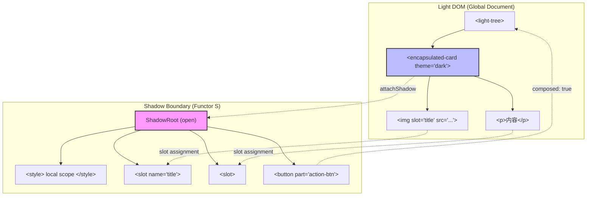
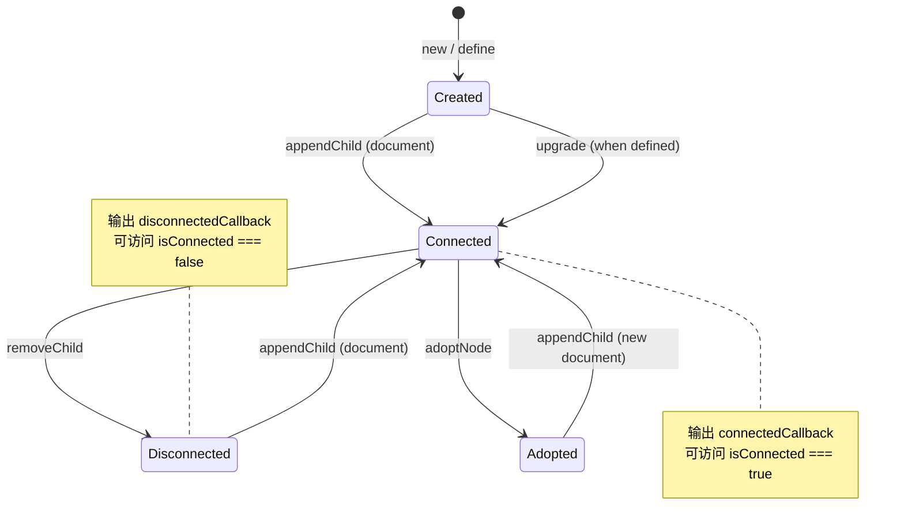
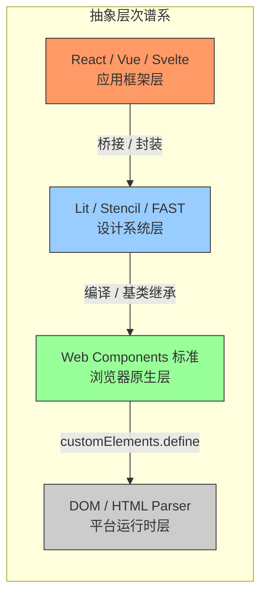

# Web Components 的形式语义与范畴论分析

## 引言

Web Components 并非仅仅是又一套 UI 框架，而是 W3C 标准化的**原生组件化原语**（native component primitives）。
自 2011 年 Alex Russell 首次提出概念以来，这条技术演进线经历了从草案到标准的漫长历程：2013 年 `document.registerElement` 进入 Chrome 实验通道；
2016 年 Custom Elements v1 与 Shadow DOM v1 成为正式标准；
2020 年 Declarative Shadow DOM 提案启动；
2023 年 Form-associated Custom Elements 在 Safari 中落地；
2025 年 Declarative Shadow DOM 获得跨浏览器一致性支持。
这一时间线揭示了一个核心事实：Web Components 的演化是**浏览器平台层语义**的扩展，而非应用层框架的迭代。

从形式语义学的视角审视，Web Components 提供了三个基本构造子（constructors）：

1. **Custom Elements** —— 定义新的 HTML 标签，引入用户扩展的节点类型；
2. **Shadow DOM** —— 建立封装边界，实现作用域隔离的文档子树；
3. **HTML Templates** —— 提供惰性实例化的文档片段模板。

这三者恰好对应范畴论与代数语义中的三个核心概念：**初始代数（initial algebra）**、**分离函子（separation functor）** 与 **余积/克隆操作（coproduct / cloning）**。
本文系统性地建立这一对应关系，并在此基础上分析 Web Components 与 React、Vue、Svelte 等框架组件之间的**形式对偶性（formal duality）**，探讨互操作性（interoperability）的范畴论解释，以及 Declarative Shadow DOM、流式 SSR、表单关联等前沿特性的形式化模型。

将 Web Components 理解为数学中的**局部坐标卡（local chart）**是极为精确的直觉类比。
在微分几何中，全局流形无法被单一坐标系覆盖，因此需要一族局部坐标卡，每张卡映射流形的一个开子集到欧氏空间。
Web Components 正是浏览器文档对象模型（DOM）这一 "流形" 上的局部坐标卡：每个自定义元素定义了一个局部语义空间（Shadow DOM），通过生命周期回调（坐标变换）与全局文档（流形）交互，而 HTML Templates 则是坐标卡的模板化复用机制。

工程实践中，Web Components 的文档往往聚焦于 API 使用与性能优化，缺乏对其**组合性质（compositionality）**的严格刻画。
形式语义的价值在于：通过代数规则验证组件嵌套、插槽分发、事件冒泡的行为是否满足预期；
精确界定 Web Components 与框架组件之间的语义映射，避免边界处的行为失配；
当标准新增 Declarative Shadow DOM 或表单关联能力时，形式模型能够预测其与现有语义的交互效应。

## 理论严格表述

### Custom Elements 的初始代数语义

在范畴论中，给定一个**内函子（endofunctor）** $F: \mathcal{C} \to \mathcal{C}$，一个 **$F$-代数（F-algebra）** 是一个二元组 $(A, \alpha)$，其中 $A$ 是范畴 $\mathcal{C}$ 的对象（载体对象），$\alpha: F(A) \to A$ 是结构映射（structure map）。$F$-代数之间的同态 $f: (A, \alpha) \to (B, \beta)$ 满足交换图条件。**初始代数（initial algebra）** 是 $F$-代数范畴中的初始对象，记为 $(\mu F, \mathsf{in})$。Lambek 定理指出，初始代数的结构映射 $\mathsf{in}: F(\mu F) \to \mu F$ 是一个同构，即 $\mu F \cong F(\mu F)$。这一性质使得初始代数成为**递归数据类型**的典范模型：自然数列表、二叉树、抽象语法树等均可表示为恰当函子的初始代数。

Custom Elements 的引入相当于将 HTML 元素类型的签名函子扩展。定义 HTML 元素类型的签名函子 $E: \mathbf{Set} \to \mathbf{Set}$：

$$
E(X) = \underbrace{\mathsf{LocalName} \times \mathsf{Attributes}}_{\text{基本节点}} + \underbrace{\mathsf{LocalName} \times \mathsf{Attributes} \times X^*}_{\text{父节点}} + \underbrace{\mathsf{VoidTag} \times \mathsf{Attributes}}_{\text{空元素}}
$$

其中 $X^*$ 表示 $X$ 的有限列表（Kleene 星），对应子元素序列；$+$ 表示集合的**不交并（disjoint union）**，即范畴论中的**余积（coproduct）**。标准 HTML 元素类型 $\mathsf{HTMLElement}$ 可视为函子 $E$ 的**不动点（fixed point）**，严格来说是 $E$ 的**最终余代数（final coalgebra）**在良基（well-founded）子集上的限制。

Custom Elements 的引入相当于将签名函子扩展为 $E_{\mathsf{ce}}$：

$$
E_{\mathsf{ce}}(X) = E(X) + \underbrace{\mathsf{CustomName} \times \mathsf{Prototype} \times \mathsf{Lifecycle} \times \mathsf{Attributes} \times X^*}_{\text{自定义元素}}
$$

其中 $\mathsf{CustomName} \subset \mathsf{LocalName}$ 且满足包含连字符（hyphen）的约束；$\mathsf{Prototype}$ 是 JavaScript 原型对象，继承链终止于 `HTMLElement.prototype`；$\mathsf{Lifecycle}$ 是生命周期回调函数的元组 $(\mathsf{connected}, \mathsf{disconnected}, \mathsf{adopted}, \mathsf{attributeChanged})$。

`customElements.define(name, constructor, options)` 操作本质上是在 $E$-代数的范畴中构造一个从 $(\mu E, \mathsf{in})$ 到 $(\mu E_{\mathsf{ce}}, \mathsf{in}')$ 的**代数同态（algebra homomorphism）**。浏览器内核负责维护这一同态的交换性：当解析器遇到自定义标签名时，通过结构映射将 $E_{\mathsf{ce}}$ 的构造子翻译为具体的 DOM 节点实例化。

若将初始代数视为 "构造" 的抽象，则**余代数（coalgebra）** 对应 "观察与消解"的抽象。给定函子 $F$，一个 $F$-余代数是二元组 $(C, \gamma)$，其中 $\gamma: C \to F(C)$。定义生命周期函子 $L: \mathbf{Set} \to \mathbf{Set}$：

$$
L(X) = \mathsf{1} + \mathsf{1} + \mathsf{1} + (\mathsf{AttrName} \times \mathsf{AttrValue} \times \mathsf{AttrValue})
$$

三个 $\mathsf{1}$ 分别对应 `connectedCallback`、`disconnectedCallback`、`adoptedCallback` 的单元事件；最后一项对应 `attributeChangedCallback(name, oldValue, newValue)`。一个自定义元素实例 $e$ 的生命周期行为是一个 $L$-余代数 $(e, \gamma_e)$，其中 $\gamma_e$ 在浏览器调度事件时被触发。这种代数-余代数的对偶视角（algebra-coalgebra duality）具有深刻的工程意义：**初始代数刻画了 "元素如何被构造"，而余代数刻画了 "元素如何响应环境变化"**。二者的交互构成了 Custom Elements 的完整语义。

### Shadow DOM 的分离函子语义

Shadow DOM 的核心机制是在 DOM 树中创建一个**封装子树（encapsulated subtree）**，其内部节点的选择器、事件目标、CSS 作用域与外部文档隔离。从范畴论的角度，这一机制可建模为一个**分离函子（separation functor）**。

设 $\mathbf{DOM}$ 为文档对象模型的范畴：对象为 DOM 子树，态射为节点插入、删除、属性修改等操作。Shadow DOM 的附加操作定义了一个**内函子** $S: \mathbf{DOM} \to \mathbf{DOM}$：

$$
S(T) = T \;\text{with a shadow root attached to some element in}\; T
$$

更精确地，给定一个宿主元素 $h \in T$，Shadow DOM 构造产生一个新的对象 $T'$，其中 $h$ 关联了一个 shadow root $r$，且 $r$ 的子树满足以下公理：

1. **作用域封闭性（Scoped Closure）**：CSS 选择器在 $r$ 的子树内的匹配不泄露到 $T \setminus \{r\}$；
2. **事件重定向（Event Retargeting）**：从 $r$ 内部冒泡的事件其 `target` 属性在越过边界时被重写为 $h$；
3. **节点访问控制（Node Access Control）**：`slot.assignedNodes()` 是访问 $r$ 内部与 $T$ 外部交界的唯一规范通道。

这三条公理共同定义了 $S$ 的**泛性质（universal property）**：$S(T)$ 是 $T$ 的"最小扩展"，使得 $r$ 内部的局部操作（局部态射）在边界处被"遗忘"（forgetful），仅通过 slot 机制保留受控的交互。

范畴论中存在一个从 "带 Shadow DOM 的 DOM 树" 到 "普通 DOM 树" 的**遗忘函子（forgetful functor）** $U: \mathbf{DOM}_S \to \mathbf{DOM}$，它忽略 shadow root 的存在，仅保留宿主树结构。Shadow DOM 的附加操作 `attachShadow` 则是 $U$ 的**左伴随（left adjoint）** $F: \mathbf{DOM} \to \mathbf{DOM}_S$：

$$
\hom_{\mathbf{DOM}_S}(F(T), T') \cong \hom_{\mathbf{DOM}}(T, U(T'))
$$

伴随关系的直觉解释是：给定普通 DOM 树 $T$，将其 "自由提升" 为带 Shadow DOM 的版本 $F(T)$，使得任何从 $T$ 到另一个带 Shadow DOM 树 $T'$ 的普通 DOM 映射，都唯一对应于从 $F(T)$ 到 $T'$ 的 Shadow DOM 保持映射。

Shadow DOM 的封装边界类似于**拓扑学中的边界操作（boundary operator）** $\partial$。在代数拓扑中，一个带边流形 $M$ 的边界 $\partial M$ 是 $M$ 与外部环境交互的唯一合法通道。Shadow DOM 的 slot 机制正是宿主元素 $h$ 的 "边界"，所有跨边界的信息流（子节点分发、CSS 变量继承、自定义事件）都必须通过这一边界。与拓扑不同的是，Shadow DOM 的边界具有**方向性**：slot 是 "流入" 通道，而 CSS 自定义属性（`::part`、`::slotted`）和自定义事件则是 "流出" 通道。

事件在 DOM 中的传播可建模为一个**计算效应（computational effect）**，而 Shadow DOM 的事件重定向则是对这一效应的**代数操作**。定义事件态射范畴 $\mathbf{Evt}$，事件冒泡构成一个**余单子（comonad）** $\Box: \mathbf{Evt} \to \mathbf{Evt}$。Shadow DOM 的事件重定向定义了一个自然变换 $\eta: \Box \circ S \Rightarrow \Box$，它在事件穿越 shadow boundary 时重写 `target`。这一自然变换满足余单子的余单位律（counit law），确保重定向不会破坏事件处理的组合性：

$$
\varepsilon_{S(T)} \circ \eta_T = \varepsilon_T
$$

### HTML Templates 的余积与克隆语义

HTML `<template>` 元素在 DOM 中表现为一个惰性节点：其内容被解析为 `DocumentFragment`，但不渲染、不加载资源、不执行脚本。从范畴论语义看，模板是**余积（coproduct）**的**惰性求值（lazy evaluation）**形式。

给定一族组件变体 $V_1, V_2, \ldots, V_n$，直接地在 DOM 中实例化所有变体对应于构造有限余积 $\bigoplus_{i=1}^n V_i$。然而，这种 eager 构造在性能上是不可接受的。`<template>` 提供了一种**suspended coproduct**：将余积的载体对象存储为潜在（potential）状态，仅在 `cloneNode(true)` 或 `importNode` 时才进行具体的余积项选择（coproduct injection）。

形式化地，定义模板函子 $T: \mathbf{Set} \to \mathbf{Set}$：

$$
T(X) = \mathsf{DocumentFragment} \times \mathsf{Boolean}
$$

其中 Boolean 标记惰性/活跃状态。`cloneNode(true)` 操作对应于从 $T(X)$ 到 $X$ 的求值映射（evaluation map），而模板定义对应于从 $X$ 到 $T(X)$ 的挂起映射（suspension map）。二者满足求值-挂起律：

$$
\mathsf{eval} \circ \mathsf{susp} = \mathsf{id}_X
$$

这恰好是**余单子（comonad）**的余单位律（counit law），其中 `DocumentFragment` 的惰性存储是存储余单子（store comonad）的一种实例。

Web Components 中的 slot 机制允许宿主将 Light DOM 的子节点分发到 Shadow DOM 的指定插槽中。这一操作在范畴论中对应于**分配律（distributive law）**。设 $P$ 为 "父节点包含子节点列表" 的构造（product-like），$S$ 为 Shadow DOM 分离函子。slot 分发定义了从 $P \circ S$ 到 $S \circ P$ 的自然变换 $\lambda$：

$$
\lambda: P(S(X)) \to S(P(X))
$$

交换图的直觉是：先分离再组合（先 attachShadow，再分发子节点到 slot）等价于先组合再分离（先将子节点视为整体，再在 shadow boundary 内重新排列）。分配律 $\lambda$ 的存在保证了 slot 机制与 DOM 树结构操作的**交换性（commutativity）**，这是 Shadow DOM 与标准 DOM 操作能够无缝互操作的形式基础。

### 生命周期回调作为状态机转换

Custom Elements 的生命周期回调可以严格地建模为一个**确定型有限状态机（deterministic finite state machine, DFSM）**，或者更精确地说，一个**Mealy 机（Mealy machine）**，因为输出（回调副作用）依赖于当前状态和输入事件。

定义状态集合 $Q$、输入字母表 $\Sigma$ 和输出字母表 $\Lambda$：

$$
\begin{aligned}
Q &= \{ \mathsf{created}, \mathsf{connected}, \mathsf{disconnected}, \mathsf{adopted} \} \\
\Sigma &= \{ \mathsf{append}, \mathsf{remove}, \mathsf{adopt}, \mathsf{attrChange}, \mathsf{upgrade} \} \\
\Lambda &= \{ \mathsf{connectedCb}, \mathsf{disconnectedCb}, \mathsf{adoptedCb}, \mathsf{attrChangedCb} \}
\end{aligned}
$$

状态转换函数 $\delta: Q \times \Sigma \to Q$ 和输出函数 $\lambda: Q \times \Sigma \to \Lambda$ 定义了 Mealy 机的语义。Mealy 机可视为**函子** $M: \mathbf{Set} \to \mathbf{Set}$，其中 $M(X) = \Lambda \times X^\Sigma$，而生命周期状态机是该函子的**余代数** $(Q, \langle \lambda, \delta \rangle)$。

从同伦类型论（HoTT）的视角，生命周期状态空间可被赋予**路径类型（path type）**：$\mathsf{connected} =_Q \mathsf{connected}$ 是平凡路径，而 $\mathsf{connected} =_Q \mathsf{disconnected}$ 仅当存在输入 $\mathsf{remove}$ 时才有见证（witness）。这意味着生命周期状态机的 "可达性" 是一个可判定问题：给定初始状态和输入序列，可以通过路径归纳（path induction）验证某个目标状态是否可达。

生命周期状态机与初始代数语义并非割裂。事实上，它们通过 **hylomorphism（hylo-态射）** 统一。Hylomorphism 是 anamorphism（余代数展开）与 catamorphism（代数折叠）的组合：

$$
\mathsf{hylo}: A \xrightarrow{\text{unfold}} F(\mu F) \xrightarrow{\text{fold}} B
$$

对于 Custom Elements，anamorphism 对应于浏览器解析 HTML 并逐步构建 DOM 树的过程（余代数展开），而 catamorphism 对应于 `connectedCallback` 中对子树的遍历与初始化（代数折叠）。生命周期回调正是在 hylomorphism 的特定阶段被触发：**`connectedCallback` 在 fold 阶段开始时触发，`disconnectedCallback` 在 unfold 的逆过程中触发**。

### Web Components 与框架组件的形式对偶

对称差分析是集合论中的操作 $A \Delta B = (A \setminus B) \cup (B \setminus A)$，用于严格区分两种技术方案的非重叠特征。将其应用于 Web Components（WC）与 React/Vue/Svelte 框架组件（FC），可得到清晰的语义分界。

定义评价维度集合 $D = \{d_1, d_2, \ldots, d_{10}\}$，涵盖宿主环境、组合原语、状态管理、封装边界、生命周期控制、更新粒度、互操作层、序列化能力、类型系统、生态系统耦合。在每个维度上，Web Components 与框架组件展现出不同的特征。

在范畴论语义中，Web Components 与框架组件呈现出深刻的**对偶性（duality）**。

**Web Components 的语义**倾向于 **coinductive / coalgebraic**：

- 强调观察（observation）而非构造（construction）：通过 `attributeChangedCallback` 观测属性变化；
- 状态是潜在无限的（DOM 树可任意扩展），通过余代数展开逐步揭示；
- 封装边界是向外阻止观测（Shadow DOM 隐藏内部），即 "observation coinduction"。

**React/Vue/Svelte 的语义**倾向于 **inductive / algebraic**：

- 强调构造而非观察：JSX / 模板是语法树的初始代数，组件函数是构造子；
- 状态是有限的（props + state 的闭包），通过代数折叠（render）生成 DOM；
- 组件组合是向内的构造（函数复合），即 "construction induction"。

这一对偶可形式化为两个范畴之间的**对偶等价（duality equivalence）**：

$$
\mathbf{WC}^{\mathsf{op}} \simeq \mathbf{FC}
$$

其中 $\mathbf{WC}$ 是 Web Components 的范畴（对象 = 自定义元素，态射 = slot 分发与事件冒泡），$\mathbf{FC}$ 是框架组件的范畴（对象 = 组件函数，态射 = props 传递与回调组合）。上标 $\mathsf{op}$ 表示对偶范畴，即所有箭头方向反转。对偶等价意味着：Web Components 中 "子元素通过 slot 向上影响父元素" 的模式，对偶于框架中 "父组件通过 props 向下影响子组件" 的模式；Shadow DOM 的事件重定向（目标重写）对偶于 React 的事件委托（监听器汇聚）。

Web Components 与框架组件的关系类似于**汇编语言与高级语言的对比**。Web Components 是浏览器这一 "硬件" 的原生指令集，直接操作 DOM 的寄存器与总线（Shadow DOM 边界、事件传播路径）；React/Vue/Svelte 则是编译到这一指令集的高级语言，引入了虚拟寄存器（VDOM）、优化调度器（Reconciler）和自动内存管理（响应式垃圾回收）。正如高级语言程序员可以通过内联汇编访问底层，框架开发者也可以通过 Web Components 桥接原生层。

### 互操作性：React 与 Web Components 的范畴桥接

互操作性（interoperability）在范畴论中对应于**伴随函子（adjoint functors）**或**等价（equivalence）**的建立。设 $\mathbf{React}$ 为 React 组件范畴，$\mathbf{WC}$ 为 Web Components 范畴。双向互操作要求建立如下的一对函子：

$$
\mathbf{React} \xrightarrow{F_{R \to W}} \mathbf{WC} \quad \text{和} \quad \mathbf{WC} \xrightarrow{F_{W \to R}} \mathbf{React}
$$

使得在适当的自然同构意义下：

$$
F_{W \to R} \circ F_{R \to W} \cong \mathsf{Id}_{\mathbf{React}}, \quad F_{R \to W} \circ F_{W \to R} \cong \mathsf{Id}_{\mathbf{WC}}
$$

在实际工程中，由于语义差异（coinductive vs inductive），严格的等价难以实现，通常退化为**丰满忠实函子（fully faithful functor）**或**嵌入（embedding）**。

将 React 组件封装为 Web Component，本质上是将一个**声明式函数**（初始代数语义）嵌入到一个**命令式类**（余代数语义）中。这需要引入一个**调度层（scheduler layer）**，充当从 inductive 到 coinductive 的**逆变伴随（contravariant adjunction）**。Lit 框架的 `@lit/react` 包正是这一伴随的工程实现：它创建了一个高阶函数 `createComponent`，将 React 的 props 映射到 Lit 元素的 properties / attributes，并将 Lit 的自定义事件映射回 React 的回调 props。

将 Web Component 嵌入 React，则需要处理一个根本性的张力：Web Components 的 `connectedCallback` 在浏览器插入节点后异步触发，而 React 的 `useEffect` 在提交（commit）阶段同步触发。如果二者时序不匹配，会导致**观测间隙（observation gap）**：React 期望在 `useLayoutEffect` 中测量 DOM 尺寸，但 WC 的渲染可能尚未完成。解决方案是引入**Promise 化生命周期（promisified lifecycle）**：在 WC 的 `connectedCallback` 末尾 dispatch 一个 `'wc-ready'` 事件，React 侧通过 `await` 该事件建立同步屏障（synchronization barrier）。这在范畴论中对应于将异步余代数 $(Q, \gamma)$ **Kleisli 提升**到 Promise 单子（Promise monad）的范畴中。

## 工程实践映射

### 声明式 Shadow DOM 与流式 SSR

传统 Imperative Shadow DOM 通过 `attachShadow()` 在运行时建立封装边界，这导致服务端渲染（SSR）面临根本困难：HTML 字节流无法在解析时表达 shadow root 的存在。Declarative Shadow DOM（DSD）通过引入 `<template shadowrootmode="open">` 标签，将 Shadow DOM 的构造从**运行时余代数**（runtime coalgebra）翻译为**解析时代数**（parse-time algebra）。

形式化地，设 $\mathsf{Parser}: \mathsf{Stream} \to \mathsf{DOM}$ 为 HTML 解析器，传统 Shadow DOM 要求：

$$
\mathsf{DOM}' = \mathsf{Parser}(\mathsf{Stream}) \;\text{然后}\; \forall h \in H, \; h.\mathsf{attachShadow}()
$$

而 DSD 将构造子直接编码到流中：

$$
\mathsf{DOM}' = \mathsf{Parser}(\mathsf{Stream} \;\mathsf{with}\; \texttt{\textless{}template shadowrootmode\textgreater{}})
$$

这一变迁的代数意义在于：它将分离函子 $S$ 的求值从**后处理阶段**提前到**构造阶段**。由于 $\mathsf{Parser}$ 本身可视为一个 catamorphism（在 HTML token 流上的 fold），DSD 相当于扩展了 fold 的代数结构，使得 $S$ 成为 fold 的一个合法构造子。

流式 SSR（Streaming Server-Side Rendering）中，服务端逐步输出 HTML 字节流，客户端在接收到足够前缀后即可开始解析和注水（hydration）。这一过程可建模为**共递归（corecursion）**或**守护余代数（guarded coalgebra）**。定义输出流为最终余代数 $\nu F$，其中 $F(X) = \mathsf{Byte} \times X$（字节与延续的乘积）。服务端生成流的过程是一个 anamorphism。DSD 与流式 SSR 的结合点在于：**shadow root 的声明式标记可以作为流中的守护构造子（guard）**。当解析器遇到 `<template shadowrootmode="open">` 时，它知道后续字节属于一个局部作用域，直到匹配的 `</template>` 结束。这允许浏览器在流式接收过程中并行构建多个 Shadow DOM 子树，而无需等待完整的文档。

### 表单关联自定义元素与可访问性

表单关联自定义元素（Form-Associated Custom Elements, FACE）通过 `attachInternals()` 方法暴露 `ElementInternals` 接口，使得自定义元素能够参与 HTML 表单的**数据生命周期**：值收集、验证、提交与重置。从形式语义看，这是将自定义元素函子 $E_{\mathsf{ce}}$ 进一步扩展为 $E_{\mathsf{form}}$：

$$
E_{\mathsf{form}}(X) = E_{\mathsf{ce}}(X) + \underbrace{\mathsf{FormValue} \times \mathsf{ValidityState} \times \mathsf{FormAssociation}}_{\text{表单关联扩展}}
$$

`ElementInternals` 提供了三个核心代数运算：`setFormValue(value, state)` 将元素状态映射到表单提交值，对应 $F$-代数中的赋值构造子；`setValidity(flags, message, anchor)` 设置约束验证状态，对应错误处理的余积注入；`reportValidity()` 触发验证报告，对应从内部状态到外部门户（UI）的观测映射。

表单的提交与重置操作可建模为**状态单子（state monad）** $S(A) = S_0 \to (A \times S_0)$，其中 $S_0$ 是表单字段的映射表。FACE 的引入相当于允许自定义元素定义自己的**单子变换（monad transformer）** $T_M(S)$，将元素的内部状态 $M$ 嵌入到全局表单状态 $S$ 中：

$$
T_M(S)(A) = M \to S(A \times M)
$$

可访问性（Accessibility）要求自定义元素向辅助技术（屏幕阅读器等）暴露正确的语义角色、状态与属性。在范畴论语义中，这是建立从 **DOM 树范畴**到 **ARIA 语义范畴**的**忠实函子（faithful functor）**：

$$
\mathsf{ARIA}: \mathbf{DOM} \to \mathbf{AccessibilityTree}
$$

对于标准 HTML 元素，$\mathsf{ARIA}$ 是隐式定义的（`button` 自动映射到 `role="button"`）。对于 Custom Elements，开发者必须显式构造这一映射。一个常见的反模式是在 Shadow DOM 内部直接放置 `<input>` 并期望外部表单自动关联。然而，由于 Shadow DOM 的封装边界，外部表单无法穿透边界观测到内部的 `<input>`。FACE 的正确使用要求通过 `attachInternals()` 显式建立桥接。

### 设计系统中的范畴不变量

现代 Web Components 工程很少直接手写 `customElements.define` 和 `attachShadow`，而是借助**设计系统框架**（Design System Frameworks）提升开发效率。从范畴论的视角，这些框架是在 Web Components 原生语义之上建立的**层（layer）**或**切片范畴（slice category）**。

- **Lit**：通过 `ReactiveElement` 基类引入**响应式原语（reactive primitives）**。其 `property` 装饰器建立了从 JavaScript 类属性到 observed attributes 的**伴随映射**：`@property` 是遗忘函子 $U: \mathbf{Reactive} \to \mathbf{WC}$ 的左伴随单元，自动处理 attribute 与 property 的双向同步。
- **Stencil**：采用**编译时转换（compile-time transformation）**策略，将装饰器语法和 JSX 编译为标准的 Custom Elements。其范畴论语义是一个**语法函子（syntax functor）** $S: \mathbf{TSX} \to \mathbf{WC}$，将高阶抽象编译为低阶初始代数。
- **FAST**：微软的 FAST 框架强调**设计令牌（design tokens）**与**组合模式（composition patterns）**。其核心创新 `FoundationElement` 定义了一个**参数化泛型（parametric polymorphism）**的组件工厂，将样式、模板与行为解耦为三个独立的范畴，再通过**极限（limit）**构造组合为最终组件。

无论选择 Lit、Stencil 还是 FAST，优秀的设计系统都应当保持以下**范畴不变量（categorical invariants）**：

1. **封装不变量**：Shadow DOM 的边界不因框架层而泄漏。Lit 的 `css` 模板标签、Stencil 的 `shadow: true` 选项、FAST 的 `shadowOptions` 均保证样式隔离函子 $S$ 的语义完整性。
2. **组合不变量**：Slot 机制是跨框架组合的唯一规范通道。设计系统不应引入与 slot 冲突的替代组合机制。
3. **互操作不变量**：向下层（原生 WC）的投影必须是**满射（epimorphism）**。即，任何由框架生成的组件，在被剥离框架运行时后，仍应当是一个合法的 Custom Element。Stencil 的 "无运行时"（runtime-free）编译策略是这一不变量的典范实现。

## Mermaid 图表

### Shadow DOM 的封装边界

### 生命周期状态机

### 设计系统抽象层次谱系

## 理论要点总结

本文从**初始代数语义**、**范畴论**与**状态机理论**三个维度，建立了 Web Components 技术的形式化分析框架。核心结论如下：

1. **Custom Elements 是 HTML 元素签名函子的保守扩展**。定义元素类型函子 $E: \mathbf{Set} \to \mathbf{Set}$，标准 HTML 元素类型 $\mathsf{HTMLElement}$ 可视为 $E$ 的初始代数 $\mu E$。Custom Elements 的引入将签名扩展为 $E_{\mathsf{ce}}$，其语义可通过初始代数的构造子与余代数的观测对偶严格刻画。`customElements.define` 操作本质上是在 $E$-代数的范畴中构造代数同态，浏览器内核负责维护这一同态的交换性。

2. **Shadow DOM 是 DOM 范畴上的分离函子**。设 $\mathbf{DOM}$ 为文档对象模型的范畴，Shadow DOM 的附加操作定义了内函子 $S: \mathbf{DOM} \to \mathbf{DOM}$。存在遗忘函子 $U: \mathbf{DOM}_S \to \mathbf{DOM}$，而 `attachShadow` 是 $U$ 的左伴随 $F$。伴随关系保证了自由提升的唯一性。事件重定向定义了自然变换 $\eta: \Box \circ S \Rightarrow \Box$，满足余单子的余单位律，确保跨边界事件处理的组合性。

3. **HTML Templates 实现了惰性余积**。模板函子 $T(X) = \mathsf{DocumentFragment} \times \mathsf{Boolean}$ 将余积的载体对象存储为潜在状态，`cloneNode(true)` 对应求值映射，`template` 定义对应挂起映射，二者满足求值-挂起律 $\mathsf{eval} \circ \mathsf{susp} = \mathsf{id}_X$。Slot 分发则是组合构造子 $P$ 与分离函子 $S$ 之间的分配律 $\lambda: P(S(X)) \to S(P(X))$。

4. **Web Components 与 React/Vue/Svelte 框架组件之间存在深刻的形式对偶**。Web Components 的语义倾向于 coinductive / coalgebraic（强调观察、潜在无限状态、向外阻止观测），而框架组件的语义倾向于 inductive / algebraic（强调构造、有限状态、向内函数复合）。对偶等价 $\mathbf{WC}^{\mathsf{op}} \simeq \mathbf{FC}$ 表明：Web Components 中 "子元素通过 slot 向上影响父元素" 对偶于框架中 "父组件通过 props 向下影响子组件"；Shadow DOM 的事件重定向对偶于 React 的事件委托。

5. **Declarative Shadow DOM 与 Form-Associated Custom Elements 是标准演进中从运行时余代数向解析时代数的语义提升**。DSD 将分离函子 $S$ 的求值从后处理阶段提前到构造阶段，使 $\mathsf{Parser}$ 的 catamorphism 直接处理 shadow root 构造。FACE 将自定义元素函子扩展为 $E_{\mathsf{form}}$，通过 `ElementInternals` 实现表单状态的单子变换嵌入。

这一形式框架不仅具有理论价值，更可直接指导工程实践：通过生命周期状态机的显式建模避免非法转换，通过伴随函子的桥接设计实现框架互操作，通过分离函子的不变量保持封装完整性。在浏览器平台持续扩展原生组件能力的趋势下，形式语义将成为设计系统架构师与标准制定者不可或缺的思维工具。

未来的研究方向包括：将 Web Components 的形式语义扩展到**影子树的可计算性**分析，探讨 Shadow DOM 边界对程序切片和数据流分析的影响；建立 Web Components 与**线性逻辑**的联系，因为 Shadow DOM 的封装边界具有资源隔离的特征；以及开发针对 Custom Elements 生命周期的**模型检测工具**，基于 Mealy 机的形式化验证非法状态转换的不可达性。

## 参考资源

1. W3C. *HTML Living Standard — Custom Elements*. <https://html.spec.whatwg.org/multipage/custom-elements.html>

2. W3C. *DOM Standard — Shadow Trees*. <https://dom.spec.whatwg.org/#shadow-trees>

3. W3C. *Declarative Shadow DOM*. <https://github.com/mfreed7/declarative-shadow-dom>

4. Jacobs, B. (2016). *Introduction to Coalgebra: Towards Mathematics of States and Observation*. Cambridge University Press.（余代数与状态观测的权威参考）

5. Meijer, E., Fokkinga, M., & Paterson, R. (1991). *Functional Programming with Bananas, Lenses, Envelopes and Barbed Wire*. JFP.（Hylomorphism 与递归模式的形式化基础）
