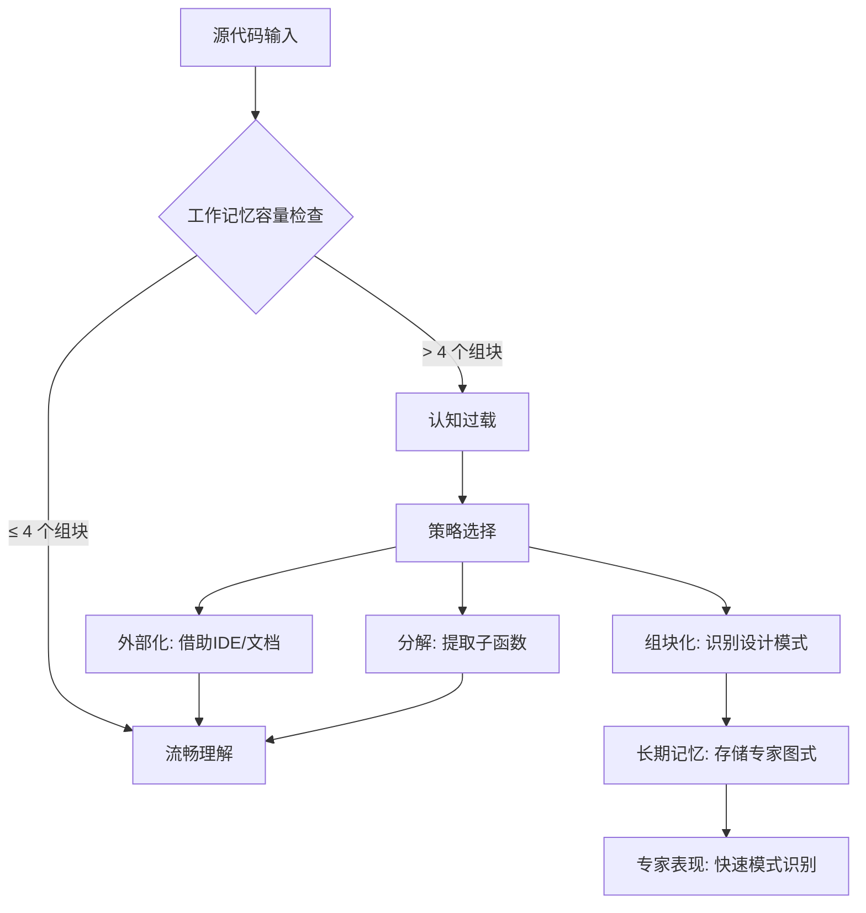
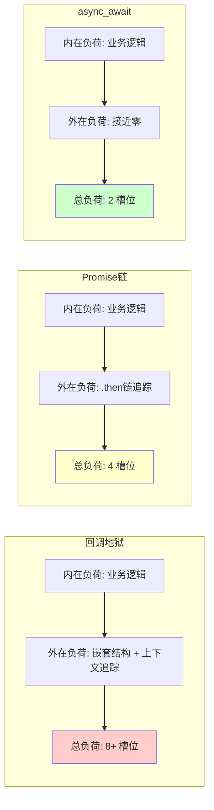
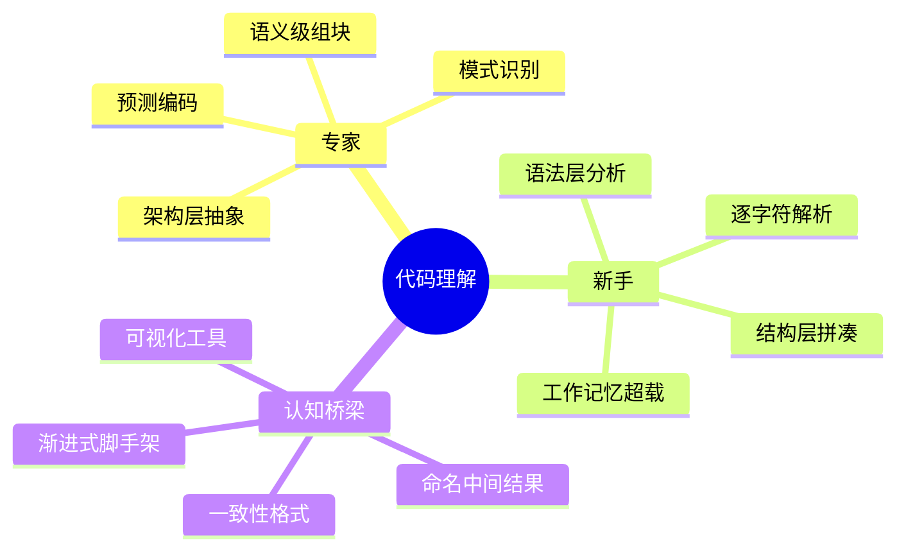

# 开发者认知科学基础

> **理论深度**: 跨学科入门 | **目标读者**: 所有开发者、技术管理者、编程教育者
> **核心命题**: 代码的设计应当匹配人类认知系统的限制与优势，而非相反

---

## 引言

想象两位开发者在阅读同一段代码：

```typescript
const result = data.filter(x => x.active)
  .map(x => ({ ...x, score: x.value * x.multiplier }))
  .sort((a, b) => b.score - a.score)
  .slice(0, 10)
  .reduce((sum, x) => sum + x.score, 0);
```

新手开发者需要逐个理解 `filter`、`map`、`sort`、`slice`、`reduce` 的语义，同时记住每个步骤的中间结果类型——工作记忆瞬间超载。专家开发者则将整段代码识别为一个**模式**："过滤活跃项，计算得分，取前10名，求总分"——一个组块（chunk），仅占用一个工作记忆槽位。

这就是认知科学对编程的直接启示：**代码的设计应该匹配人类认知系统的限制和优势**。本文从工作记忆、长期记忆、认知负荷理论、心智模型、注意力与具身认知六大维度，系统阐述理解编程所需的认知科学基础，并建立从理论到工程实践的完整映射框架。

---

## 理论严格表述

### 1. 工作记忆：代码理解的第一瓶颈

#### 1.1 从 7±2 到 4±1：容量的真相

1956年，George Miller 发表《神奇的数字 7 ± 2》，发现人类短期记忆能同时保持约 7 个信息单元。但 Cowan (2001) 通过更严格的实验设计发现：**实际容量更接近 4 ± 1 个"组块"**。

**精确类比：工作记忆像 CPU 寄存器**

| 特性 | CPU 寄存器 | 工作记忆 |
|------|-----------|---------|
| 容量 | 8-32 个 | 4±1 个组块 |
| 访问速度 | 1 个时钟周期 | ~100 毫秒 |
| 内容丢失 | 上下文切换时 | 分心或超载时 |
| 扩容方式 | 无法扩容 | 通过组块化 |

类比边界：工作记忆的内容是"语义化的"而非二进制的；像寄存器一样，超载会导致"溢出"（理解中断）。

#### 1.2 Baddeley 的四成分模型

Baddeley (2007) 提出工作记忆的四个子系统：

| 子系统 | 功能 | 编程对应 | 容量 |
|--------|------|---------|------|
| **语音环路** | 存储语言信息 | 变量名、API 名称、注释 | ~2 秒语音 |
| **视觉空间画板** | 存储视觉信息 | 代码结构、缩进层次、括号匹配 | ~4 个对象 |
| **情景缓冲器** | 整合多模态信息 | 代码与文档的关联、调试时的变量状态 | ~4 个组块 |
| **中央执行** | 注意力控制和协调 | 理解复杂逻辑、在不同抽象层切换 | 有限注意力 |

#### 1.3 长期记忆：专家与新手的分水岭

长期记忆分为**陈述性记忆**（概念、事实，如 `Array.prototype.map` 的签名）与**程序性记忆**（技能和习惯，如打字、代码模式识别）。专家与新手的差异主要在程序性记忆和语义记忆的组块化程度。

**组块（Chunking）**是将多个小信息单元组合成大单元的过程。新手阅读 `arr.map(x => x * 2)` 时需要分解为 4 个独立步骤；专家则将其识别为"数组翻倍操作"——一个组块。

### 2. 认知负荷理论（CLT）

Sweller (2011) 提出了认知负荷的三种类型：

| 类型 | 定义 | 编程示例 | 优化方向 |
|------|------|---------|---------|
| **内在负荷** | 任务本身的复杂度 | 理解递归树遍历 | 由问题决定，难以减少 |
| **外在负荷** | 信息呈现方式带来的负担 | 混乱的代码格式、不一致命名 | **应尽量减少** |
| **相关负荷** | 促进学习的认知投入 | 类型推断帮助理解数据流 | **应尽量增加** |

**关键洞察**：优秀的代码设计将认知负荷从"外在"转移到"相关"——不是降低总负荷，而是让负荷产生价值。

### 3. 心智模型（Mental Models）

Johnson-Laird (1983) 定义心智模型为**类比于现实世界的结构化心理表征**，用于推理和预测。

**示例：变量的心智模型**

```typescript
let x = 5;
x = 10;
```

- **新手心智模型**："x 是一个盒子，先装了 5，然后换成 10"
- **专家心智模型**："x 是一个名称，绑定到值 5，然后重新绑定到值 10。内存中可能有两个值，x 指向其中一个"

新手模型在某些场景下正确（值类型），但在引用类型赋值时会误导。

### 4. 注意力与专注力

Kahneman (2011) 的双系统理论：

| | 系统 1（快思考）| 系统 2（慢思考）|
|--|----------------|----------------|
| 速度 | 自动、快速 | 努力、缓慢 |
| 意识 | 无意识 | 有意识 |
| 容量 | 大 | 小（受工作记忆限制）|
| 编程场景 | 模式识别、打字、语法高亮 | 调试复杂逻辑、设计架构 |

**流状态**（Csikszentmihalyi, 1990）的进入条件：挑战与技能平衡、清晰目标、即时反馈、无干扰。

**上下文切换代价**：Mark et al. (2008) 发现平均需要 **23 分钟**才能回到中断前的专注状态；多任务处理时错误率增加 40%，效率降低 50%。

### 5. 具身认知（Embodied Cognition）

Lakoff & Johnson (1999) 提出：抽象概念通过**隐喻**建立在身体经验之上。

| 隐喻 | 身体经验 | 编程表达 | 自然性 |
|------|---------|---------|--------|
| "向上" = 更抽象 | 站立时视野更广 | "高层 API" | 高 |
| "向下" = 更具体 | 俯视看到细节 | "底层实现" | 高 |
| "向前" = 执行 | 向前走是推进 | "推进任务" | 高 |
| "向后" = 撤销 | 向后退是返回 | "回滚更改" | 高 |

命令式和面向对象范式的低学习曲线部分源于它们与日常身体经验的直接对应。函数式和声明式范式需要额外的抽象层，因此学习曲线更陡——但一旦掌握，认知负荷反而更低。

---

## 工程实践映射

### 映射 1：工作记忆容量 → 函数设计

```typescript
// 高工作记忆负荷：7 个独立信息块
function process(a: number, b: number, c: number, d: number, e: number, f: number, g: number) {
  return ((a + b) * c - d) / (e + f - g);
}

// 低工作记忆负荷：2 个组块
function process(config: { a: number; b: number; c: number },
                 params: { d: number; e: number; f: number; g: number }) {
  const numerator = (config.a + config.b) * config.c - params.d;
  const denominator = params.e + params.f - params.g;
  return numerator / denominator;
}
```

**工程原则**：将 7 个独立变量压缩成 2 个"配置对象"组块，工作记忆从 7 个槽位降到 2 个。保持函数圈复杂度 ≤ 4，以确保在工作记忆的舒适区内。

### 映射 2：认知负荷类型 → 异步代码演进

```typescript
// 高外在负荷：回调地狱
 doA(a => doB(a, b => doC(b, c => doD(c, d => {
  console.log(d);
}))));

// 中等外在负荷：Promise 链
doA()
  .then(a => doB(a))
  .then(b => doC(b))
  .then(c => doD(c))
  .then(d => console.log(d));

// 低外在负荷：async/await（利用已有的"顺序执行"心智模型）
const a = await doA();
const b = await doB(a);
const c = await doC(b);
const d = await doD(c);
console.log(d);
```

**工程原则**：优秀的代码设计将认知负荷从"外在"转移到"相关"——`async/await` 几乎无外在负荷，相关负荷仅在于一次性学习 `await` 的语义。

### 映射 3：心智模型匹配 → 命名与注释

```typescript
// 高语音负荷：变量名难以"发音"
const x1 = fetchData();
const x2 = transform(x1);
const x3 = filter(x2);
const r = render(x3);

// 低语音负荷：变量名可"读"
const users = fetchUsers();
const enrichedUsers = addMetadata(users);
const activeUsers = filterActive(enrichedUsers);
const userCards = renderUserCards(activeUsers);
```

```typescript
// 注释的认知定位原则
// ❌ 复述代码（噪音）
// 将 x 加 1
x = x + 1;

// ✅ 解释"为什么"（代码无法自我表达的信息）
// 故意使用 == 而非 ===：允许字符串数字和数字类型混用
// 因为历史 API 返回字符串，但新 API 返回数字
if (value == target) { /* ... */ }
```

**工程原则**：命名中间结果减少工作记忆负担；注释回答"为什么"而非"做什么"；类型系统承担"外部记忆"功能。

### 映射 4：具身认知 → API 设计

```typescript
// 违反空间隐喻的命名（"感觉"不对）
function descendToHigherAbstraction() { /* ... */ }

// 符合空间隐喻的命名
function raiseAbstraction() { /* ... */ }
```

**工程原则**：使用自然的方向性和动作隐喻。"向上"= 更抽象，"向下"= 更具体，"向前"= 执行，"向后"= 撤销。

---

## Mermaid 图表

### 图表 1：工作记忆与代码理解的交互模型



### 图表 2：认知负荷在异步代码中的分布



### 图表 3：专家与新手的心智模型差异



---

## 理论要点总结

1. **工作记忆容量约为 4±1 个组块**（Cowan, 2001），这是代码理解不可逾越的硬限制。当函数参数超过 4 个、嵌套深度超过 2 层、同时追踪的变量超过 4 个时，理解错误率急剧上升。

2. **认知负荷分为内在、外在、相关三类**（Sweller, 2011）。工程优化的核心不是降低总负荷，而是将外在负荷转化为相关负荷——让开发者的认知投入产生长期价值。

3. **心智模型是推理和预测的心理表征**（Johnson-Laird, 1983）。教学时应先建立近似正确的新手模型，再逐步修正为专家模型。直接教授专家模型往往会超出认知负荷。

4. **Kahneman 双系统理论**揭示：System 1 处理模式识别（专家快速阅读代码），System 2 处理复杂逻辑（调试、架构设计）。优秀的工具设计应让 System 1 处理尽可能多的任务。

5. **具身认知表明抽象概念通过身体隐喻建立**（Lakoff & Johnson, 1999）。命令式和面向对象范式学习曲线平缓，因为它们直接映射到日常身体经验；函数式范式学习曲线陡峭，但长期认知负荷更低。

6. **代码可读性的认知维度**包括：命名的认知效率（变量名作为记忆线索）、布局的视觉认知（邻近性、对称性）、注释的外部记忆功能（回答"为什么"）。

### 映射 5：认知脚手架在编程教育中的应用

专家拥有的**隐性知识**（tacit knowledge）难以直接传授。编程教育需要**认知脚手架**——临时支持结构，帮助学习者逐步建立专家级心智模型。

**示例：教授闭包的认知脚手架**

```typescript
// 第 1 步：具体实例（无抽象）
function makeCounter() {
  let count = 0;
  return function() {
    count++;
    return count;
  };
}
const counter = makeCounter();
console.log(counter()); // 1
console.log(counter()); // 2

// 第 2 步：引入"环境"概念
// makeCounter 创建了一个"环境"，包含变量 count
// 返回的函数"记住"了这个环境

// 第 3 步：可视化环境（脚手架）
// counter 的环境: { count: 2 }
// 每次调用 counter，它访问并修改这个环境中的 count

// 第 4 步：移除脚手架，建立专家模型
// "闭包是捕获了定义时环境的函数"
```

**认知脚手架的拆除时机**：

| 阶段 | 脚手架类型 | 拆除信号 |
|------|-----------|---------|
| 新手 | 具体示例、可视化工具 | 能独立解释新示例 |
| 进阶 | 命名模式、模板 | 能识别并应用模式 |
| 专家 | 无脚手架 | 能创造新模式 |

### 映射 6：AI 辅助编程的认知影响

随着 AI 辅助编程的兴起，认知科学在工具设计中的作用更加关键。

**传统编程 vs AI 辅助编程**：

```typescript
// 传统编程：完全依赖工作记忆
const result = data
  .filter(x => x.active)
  .map(x => ({ ...x, score: x.value * 2 }))
  .sort((a, b) => b.score - a.score)
  .slice(0, 10);

// AI 辅助编程：AI 承担部分认知负荷
// 开发者只需描述意图："获取前10名活跃用户的得分"
// AI 生成实现代码
```

**潜在风险**：

1. **技能退化**：过度依赖 AI 可能导致工作记忆容量下降（如计算器对心算能力的影响）
2. **理解幻觉**：开发者可能"感觉"理解了 AI 生成的代码，但实际上没有
3. **注意力分散**：AI 的实时建议可能打断流状态

**设计原则**：

| 原则 | 具体措施 |
|------|---------|
| 渐进增强 | AI 建议应分层展示（概要 → 细节 → 实现）|
| 可解释性 | AI 应解释其建议的理由 |
| 可控性 | 开发者应能选择接受、修改或拒绝 AI 建议 |
| 学习性 | AI 工具应帮助开发者学习，而非替代思考 |

**精确直觉类比：AI 辅助编程像 GPS 导航**

| 方面 | GPS 导航 | AI 辅助编程 |
|------|---------|------------|
| 功能 | 提供路线建议 | 提供代码建议 |
| 认知减负 | 不需要记忆地图 | 不需要记忆 API 细节 |
| 风险 | 可能失去方向感 | 可能失去底层理解 |
| 最佳用法 | 结合地图阅读 | 结合手动编码 |

### 映射 7：上下文切换的工程代价

**研究数据**：Mark et al. (2008) 发现平均需要 **23 分钟**才能回到中断前的专注状态；多任务处理时错误率增加 40%，效率降低 50%。

**编程中的上下文切换源**：

| 来源 | 频率 | 建议 |
|------|------|------|
| 即时消息 | 极高 | 批量处理（每 2 小时一次）|
| 邮件 | 高 | 定时检查（每天 3 次）|
| 会议 | 中 | 集中在一天中的特定时段 |
| 代码审查请求 | 中 | 每天固定时间段处理 |
| 编译/测试等待 | 高 | 利用等待时间做低认知负荷任务 |

**工程实践**：番茄工作法（25 分钟专注 + 5 分钟休息）、关闭通知、在开始复杂任务前清理工作记忆（写下待办事项）。

---

## 参考资源

1. Cowan, N. (2001). "The Magical Number 4 in Short-Term Memory: A Reconsideration of Mental Storage Capacity." *Behavioral and Brain Sciences*, 24(1), 87-114.

2. Sweller, J. (2011). "Cognitive Load Theory." *Psychology of Learning and Motivation*, 55, 37-76.

3. Baddeley, A. (2007). *Working Memory, Thought, and Action*. Oxford University Press.

4. Kahneman, D. (2011). *Thinking, Fast and Slow*. Farrar, Straus and Giroux.

5. Johnson-Laird, P. N. (1983). *Mental Models*. Harvard University Press.

6. Lakoff, G., & Johnson, M. (1999). *Philosophy in the Flesh: The Embodied Mind and Its Challenge to Western Thought*. Basic Books.
