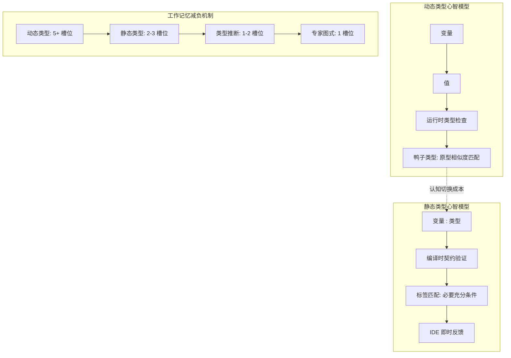
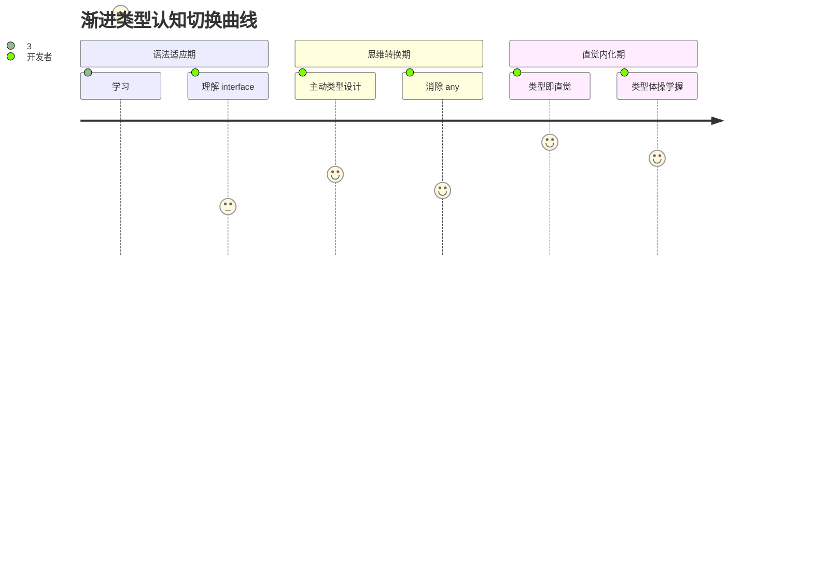

# 心智模型与编程语言设计

> **理论深度**: 跨学科（编程语言语义 × 认知心理学 × 神经语言学）
> **核心命题**: 类型系统不是逻辑工具，而是人类分类认知本能的形式化延伸；不同类型系统与大脑工作记忆的交互方式截然不同

---

## 引言

为什么有些开发者觉得 TypeScript 的严格类型"让人安心"，而另一些人觉得它"束手束脚"？为什么从 JavaScript 迁移到 TypeScript 需要 3-6 个月的"思维转换期"？答案藏在人类大脑的分类本能中。

Rosch (1978) 的**原型理论**揭示：人类不通过"必要充分条件"来分类，而是通过**与原型（Prototype）的相似度**来分类。动态类型的"鸭子类型"本质上就是原型分类——"如果它走路像鸭子、叫得像鸭子，那它就是鸭子"。静态类型则是**必要充分条件分类**——"只有显式声明为 Duck 的才是鸭子"。

本文从认知科学视角剖析动态类型、静态类型、渐进类型、结构化类型与名义类型的心智模型差异，量化从 JS 到 TS 的认知切换成本，并建立类型系统选择的决策框架。

---

## 理论严格表述

### 1. 分类认知的生物学根源

人类大脑是为**分类和模式识别**而优化的。Rosch (1978) 的原型理论揭示了分类认知的核心特征：

- 人类不通过"必要充分条件"来分类（不像数学集合）
- 而是通过**与原型（Prototype）的相似度**来分类
- 例如：知更鸟是"鸟"的原型，企鹅则偏离原型，需要额外的认知努力才能归类

**对编程的映射**：动态类型的"鸭子类型"（Duck Typing）本质上就是原型分类。静态类型则是必要充分条件分类。

### 2. 语言标签对工作记忆的重构作用

Lupyan (2008) 的实验要求被试对视觉刺激进行分类。一组被试在分类前看到标签（如"这是A类"），另一组没有标签。结果：

- 有标签组的分类速度提高了 **23%**（p < 0.01, N = 48）
- 有标签组在干扰任务（同时记忆数字）中的表现更稳定
- **结论**：语言标签将"原始特征处理"转化为"标签匹配"，释放了工作记忆资源

**对类型系统的映射**：类型标注就像给变量贴上了**认知标签**，让开发者从"逐特征分析"切换到"标签匹配"，显著降低了工作记忆负荷。

### 3. 程序理解的双通路模型

Gładwin et al. (2020) 在 *ICSE* 上发表的 fMRI 研究首次直接观测了开发者阅读代码时的大脑活动：

| 通路 | 激活脑区 | 功能 | 触发条件 |
|------|---------|------|---------|
| **语义通路** | 左侧颞下回、角回 | 理解代码的"含义" | 阅读变量名、函数名、注释 |
| **执行通路** | 背外侧前额叶、顶叶 | 模拟代码的"执行" | 阅读控制流、循环、递归 |
| **语言通路** | 布洛卡区、韦尼克区 | 处理语法结构 | 阅读类型声明、接口定义 |

**关键发现**：当代码包含**类型标注**时，语言通路的激活显著增强，而执行通路的负荷降低。类型系统帮助大脑将部分执行模拟工作"外包"给了语言处理系统——后者是高度自动化的（System 1 过程），比执行模拟（System 2 过程）消耗更少的认知资源。

### 4. 渐进类型的心智模型切换成本

从 JavaScript 迁移到 TypeScript 需要**心智模型切换**：

| 方面 | JS 心智模型 | TS 心智模型 | 切换成本 | 认知机制 |
|------|-----------|-----------|---------|---------|
| **变量** | "盒子装值，值决定类型" | "盒子有类型标签，标签约束值" | 中 | 从值驱动 → 标签驱动 |
| **函数** | "接受参数，返回结果" | "类型映射：输入类型 → 输出类型" | 高 | 需要同时考虑域和陪域 |
| **错误** | "运行时调试，控制台看错误" | "编译时修复，IDE 红波浪线" | 高 | 错误检测时机的前移 |
| **泛型** | "无此概念" | "类型参数化，抽象多态" | **极高** | 需要二阶思维 |

根据 Siek & Taha (2006) 的渐进类型理论，完全切换需要经历三个阶段：

1. **语法适应期**（1-2 周）：学习 `:type` 语法、`interface` 声明
2. **思维转换期**（1-3 个月）：开始主动思考类型设计，而非事后补类型
3. **直觉内化期**（3-6 个月）：类型设计成为自动化过程（System 1）

### 5. 结构化类型 vs 名义类型：两种分类本能

| 维度 | 结构化类型（TypeScript） | 名义类型（Java/C#） |
|------|-----------------------|-------------------|
| **兼容标准** | "形状相同即可" | "必须显式声明继承/实现" |
| **心智模型** | "如果接口匹配，就可以用" | "必须获得官方认证" |
| **认知负荷（判断时）** | 低（自动兼容） | 高（需要检查继承链） |
| **认知负荷（设计时）** | 中（需要预见兼容场景） | 低（显式声明即可） |
| **安全性** | 较低（意外兼容） | 较高（显式契约） |

### 6. 类型体操的专家-新手分水岭

Chase & Simon (1973) 的象棋研究揭示了专家-新手差异的本质：**专家将多个元素压缩为语义组块（Chunks）**。

| 技能层次 | 类型体操能力 | 图式特征 | 典型代码 |
|---------|------------|---------|---------|
| **新手** (< 6 个月) | 基本类型标注 | 逐字符解析 | `let x: string` |
| **中级** (6-18 个月) | 接口和简单泛型 | 按语法结构分组 | `interface List<T> { items: T[] }` |
| **高级** (18-36 个月) | 条件类型、映射类型 | 按语义模式分组 | `type X<T> = T extends U ? A : B` |
| **专家** (3+ 年) | 模板字面量、递归类型 | 整体图式识别 | `` type EventName<T> = `on${Capitalize<T>}` `` |

---

## 工程实践映射

### 映射 1：动态类型的隐性追踪负担

```javascript
function calculateTotal(items, discount) {
  // 槽位1: items 是什么结构？数组？对象？类数组？
  // 槽位2: discount 是数字（0.2）还是函数（item => item.price * 0.2）？
  let total = 0;
  for (const item of items) {
    // 槽位3: item 有哪些属性？price？cost？value？
    // 槽位4: item.price 是数字还是字符串？
    total += item.price * (1 - discount);
    // 槽位5: 如果 discount 是函数，这里会报错！
  }
  return total;
}
```

**总槽位需求**：5+。这段看似简单的代码需要开发者同时追踪多个变量的类型假设——当这些假设在代码库的不同位置被违反时，Bug 就产生了。

### 映射 2：静态类型的外在减负效应

```typescript
interface User {
  id: number;
  name: string;
  email: string;
}

function greet(user: User): string {
  // 槽位1: user 是 User 类型（标签一次性提供所有结构信息）
  return `Hello, ${user.name}`;
  // 槽位2: name 是 string（从 User 接口推导，无需额外记忆）
}
```

**实验证据**：Hanenberg (2010) 在 *EMSE* 上的对照实验（N = 49）比较了静态类型（Java）和动态类型（Groovy）开发者在调试任务中的表现：静态类型组的**Bug 定位时间**平均比动态类型组快 **33%**（p < 0.05），但**初始编码时间**增加了 **15%**（类型设计成本）。

### 映射 3：渐进类型的认知经济学

```typescript
// 阶段 1：宽松模式（any everywhere）
// 认知负荷：低（1 槽位，几乎回到 JS）
function process(data: any): any {
  return data.items.map(x => x.value);
}

// 阶段 2：部分类型化
// 认知负荷：中（3 槽位）
function process(data: { items: any[] }): any[] {
  return data.items.map(x => x.value);
}

// 阶段 3：严格模式
// 认知负荷：高（5+ 槽位，完整类型设计）
interface Item { value: number; }
interface Input { items: Item[]; }
function process(data: Input): number[] {
  return data.items.map(x => x.value);
}
```

**工程原则**：渐进类型允许开发者**逐步构建**类型心智模型，符合**支架式学习（Scaffolding）**理论——学习者在掌握基础之前，不需要面对完整的复杂性。

### 映射 4：类型推断的认知外包与心智雪崩

```typescript
// 有类型推断：低外在负荷
const add = (a: number, b: number) => a + b; // 返回类型自动推断

// 推断失败时的心智雪崩
const result = complexFunction(data);
// 推断失败时，开发者需要：
// 1. 查看 complexFunction 的定义（跳转文件）
// 2. 追踪类型参数（可能涉及 3+ 层泛型）
// 3. 理解泛型约束（T extends SomeInterface）
// 4. 检查 data 的类型是否符合约束
```

**工程原则**：类型推断是"全有或全无"的——当它工作时，认知负荷极低；当它失败时，开发者需要手动执行编译器的推断算法，负荷极高。

### 映射 5：类型债务的累积效应

```typescript
// 反例：any 作为"逃生舱口"的滥用
interface User {
  id: number;
  profile: any;  // ❌ "太复杂了，先 any 吧"
}

// 后果1：profile 的使用处完全失去类型保护
// 后果2：3个月后，profile 被用在 20+ 个文件中
// 后果3：每个使用者都形成了自己的心智模型
// 后果4：偿还类型债务的成本随时间指数增长
```

**工程原则**：短期的"简便"决策累积成长期的重构负担。`any` 不会导致构建失败，它只是静默地关闭了类型保护。

---

## Mermaid 图表

### 图表 1：类型系统心智模型的认知层级



### 图表 2：从 JS 到 TS 的心智模型切换路径



### 图表 3：结构化类型 vs 名义类型的语义陷阱

```mermaid
graph LR
    subgraph 结构化类型陷阱
        A1[Distance: value + unit:'km'|'mi'] --> A3[formatDistance]
        A2[Temperature: value + unit:'C'|'F'] --> A3
        A3 --> A4[编译通过!]
        A4 --> A5[语义错误: 100°C 不是距离]
    end
    subgraph 名义类型防护
        B1[UserCredentials] --> B3[connectToDatabase]
        B2[DatabaseConnection] --> B3
        B3 --> B6[编译错误! 类型名不匹配]
    end
```

---

## 理论要点总结

1. **类型系统是人类分类认知本能的形式化延伸**（Rosch, 1978）。动态类型的鸭子类型对应原型分类（基于相似度）；静态类型对应必要充分条件分类（基于显式声明）。

2. **类型标注作为语言标签，将工作记忆负荷从"逐特征分析"转化为"标签匹配"**（Lupyan, 2008）。静态类型版本通常减少 1-2 个工作记忆槽位，在大型代码库中累积效应显著。

3. **从 JS 到 TS 的完全切换需要 3-6 个月**（Siek & Taha, 2006），经历语法适应期、思维转换期和直觉内化期三个阶段。渐进类型的价值在于允许开发者逐步构建类型心智模型。

4. **静态类型的认知收益与代码库规模和团队规模呈正相关，与变化速度呈负相关**。快速原型和异构数据处理场景下，动态类型的认知经济性更优。

5. **结构化类型验证结构但不验证语义**（如 `Distance` 和 `Temperature` 结构兼容但语义不兼容）。名义类型通过类型名本身携带语义信息来缓解这一问题。

6. **类型推断失败时产生"心智雪崩"效应**——开发者需要手动执行编译器的推断算法，这要求元认知能力（思考"编译器如何思考"），负荷极高。

### 映射 6：结构化类型的语义陷阱与工程防护

```typescript
// 反例：结构化类型的语义陷阱
interface Distance {
  value: number;
  unit: 'km' | 'mi';
}

interface Temperature {
  value: number;
  unit: 'C' | 'F';
}

function formatDistance(d: Distance): string {
  return `${d.value} ${d.unit}`;
}

const temp: Temperature = { value: 100, unit: 'C' };
formatDistance(temp); // ✅ 结构兼容！编译通过！
// ❌ 但语义完全错误：100°C 不是距离

// 更隐蔽的案例：
interface UserCredentials {
  username: string;
  password: string;
}

interface DatabaseConnection {
  username: string;
  password: string;
}

function connectToDatabase(conn: DatabaseConnection) {
  // 如果传入 UserCredentials，结构完全兼容
  // 但可能导致：用用户登录信息去连接数据库！
}
```

**结构化类型的根本局限**：它只能验证**结构**（字段名和类型），无法验证**语义**（字段的含义和用途）。名义类型通过**类型名本身携带语义信息**来缓解这一问题。

**工程防护策略**：

1. **品牌类型（Branded Types）**：
```typescript
type UserID = string & { __brand: 'UserID' };
type ProductID = string & { __brand: 'ProductID' };
// 即使结构相同，类型名不同，防止意外混用
```

2. **名义类型模拟**：
```typescript
class UserID {
  private __nominal!: void;
  constructor(public value: string) {}
}
```

### 映射 7：类型体操的专家压缩机制

专家如何将复杂类型定义压缩为语义组块？

```typescript
// 新手看到的（8+ 个独立元素）
// type, DeepPartial, <T>, =, {, [, P, in, keyof, T, ], ?, ...
type DeepPartial<T> = {
  [P in keyof T]?: T[P] extends object ? DeepPartial<T[P]> : T[P];
};

// 专家看到的（2 个组块）
// 组块1: "深度递归映射"
// 组块2: "可选标记 + 条件终止"
```

**图式差异**：专家将 `T extends U ? A : B` 作为一个整体图式（Schema）存储在长期记忆中，而新手需要逐元素解析。Chase & Simon (1973) 的象棋研究揭示：专家将多个元素压缩为语义组块，这正是类型体操专家-新手差异的本质。

**工作记忆分析**：理解 `DeepReadonly` 需要同时追踪映射类型的迭代语义、条件类型的判断、递归调用的展开、终止条件、最终类型的形状——5 个槽位超出工作记忆容量。即使是经验丰富的 TypeScript 开发者，在阅读复杂类型定义时也需要借助外部认知辅助（如类型展开工具、IDE 的悬停提示）。

### 映射 8：显式标注 vs 隐式推断的决策框架

| 场景 | 推荐策略 | 原因 |
|------|---------|------|
| **函数参数** | 显式标注 | 参数是函数的"公共契约"，显式标注作为文档 |
| **函数返回值** | 推断优先 | 返回值从实现推导，减少冗余 |
| **复杂泛型** | 显式标注 | 推断链过长时，显式标注降低阅读负担 |
| **公共 API** | 显式标注 | 使用者需要明确的类型信息 |
| **内部实现** | 推断优先 | 减少样板代码，专注逻辑 |

---

## 参考资源

1. Rosch, E. (1978). "Principles of Categorization." *Cognition and Categorization*, 27-48.

2. Lupyan, G. (2008). "The Conceptual Grouping Effect: Categories Matter (and Named Categories Matter More)." *Cognition*, 108(2), 566-577.

3. Gładwin, T. E., et al. (2020). "Professional Software Development: A fMRI Study." *ICSE 2020*.

4. Siek, J. G., & Taha, W. (2006). "Gradual Typing for Functional Languages." *Scheme and Functional Programming Workshop*.

5. Hanenberg, S. (2010). "An Experiment About Static and Dynamic Type Systems: Doubts About the Positive Impact of Static Type Systems on Development Time." *EMSE*, 15(3), 1-29.

6. Chase, W. G., & Simon, H. A. (1973). "Perception in Chess." *Cognitive Psychology*, 4(1), 55-81.
