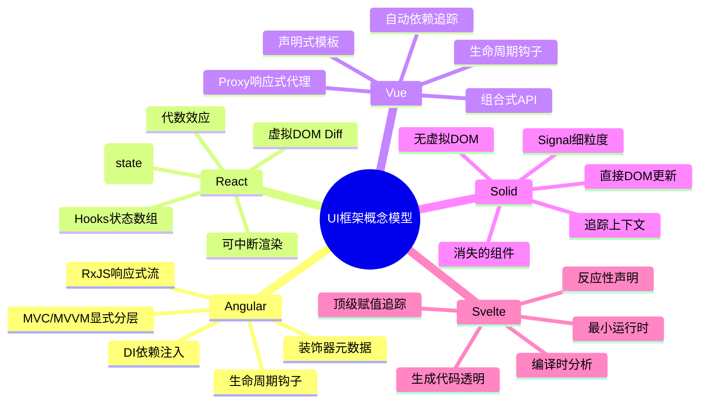
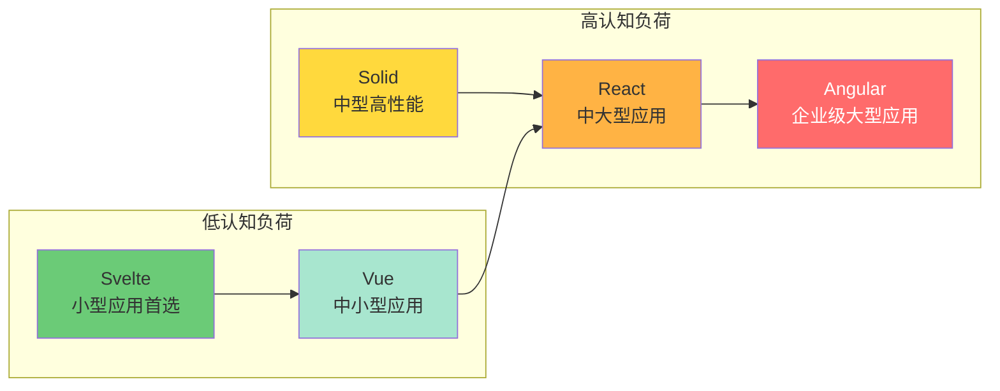
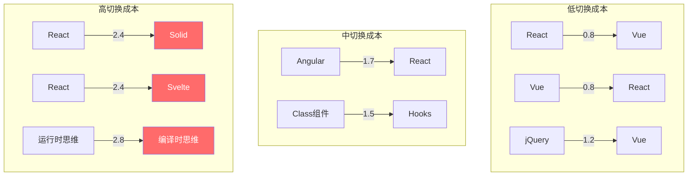

# UI 框架的概念模型映射

> **理论深度**: 跨学科（编程语言 × 认知科学 × HCI）
> **核心命题**: 框架选择不仅是技术决策，更是对人类工作记忆容量（4±1 组块）的适应性决策

---

## 引言

每个前端框架都不是单一的概念实体，而是由**多个相互关联的概念模型**构成的复杂系统。开发者在学习和使用框架时，必须同时在心智中维持这些模型的映射关系：概念模型 → 数据模型 → 渲染模型 → 状态模型。

Johnson-Laird (1983) 的心智模型理论指出：人类理解复杂系统的方式是构建**内部表征（Internal Representation）**。当框架的概念模型与开发者的心智模型匹配时，学习曲线平缓；当它们冲突时，产生**认知摩擦（Cognitive Friction）**（Norman, 2013）。

Köller et al. (2019) 在 ICSE 上的实证研究测量了开发者从 Vue 迁移到 React 时的理解时间。他们发现，当框架概念模型与开发者已有图式冲突时，代码理解时间增加了 **40-120%**（效应量 d = 0.82，属于大效应）。

本文从认知科学视角系统分析 Angular、React、Vue、Solid、Svelte 五大框架的概念模型、工作记忆槽位需求和框架切换成本，建立"框架即认知适配"的决策框架。

---

## 理论严格表述

### 1. 工作记忆容量的硬限制

Cowan (2001) 提出人类**工作记忆**容量约为 **4±1 个独立组块**。Daneman & Carpenter (1980) 的**阅读广度测试**发现，工作记忆容量与阅读理解能力呈显著正相关（r ≈ 0.50-0.60, p < 0.01）。

将这一发现映射到编程：当开发者阅读一段代码时，他们需要同时保持当前变量的状态、控制流的分支条件、函数调用的返回值、隐式依赖关系。**当需要维持的独立信息超过 4 个组块时，理解错误率急剧上升。**

### 2. 认知负荷的三重结构

Sweller (1988, 2011) 的认知负荷理论将工作记忆负荷分为三类：

| 负荷类型 | 定义 | 编程中的表现 | 优化策略 |
|---------|------|------------|---------|
| **内在负荷** | 任务本身的复杂性 | 业务逻辑的固有复杂度 | 无法减少，但可通过分块重组 |
| **外在负荷** | 信息呈现方式带来的负担 | 框架样板代码、不必要的嵌套 | 选择更简洁的表示法 |
| **相关负荷** | 促进图式构建的积极负荷 | 学习新设计模式时的理解投入 | 引导至高效图式构建 |

### 3. 图式构建与专家-新手差异

Chase & Simon (1973) 在象棋大师研究中的经典发现：专家和新手在记忆棋盘布局时的差异不在于工作记忆容量本身，而在于**组块化（Chunking）能力**。专家能将 16 个棋子记忆为 4-5 个有意义的模式，而新手只能逐 piece 记忆。

**编程中的对应现象**：新手阅读 `users.filter(u => u.age > 18).map(u => u.name)` 时需要分解为 7+ 个独立组块；专家则将其识别为"筛选成年用户"和"提取姓名列表"两个语义级组块。

### 4. 认知维度框架（CDN）

Green & Petre (1996) 的认知维度框架提供了评估表示法（包括编程语言和框架）的系统性工具。关键维度包括：

- **抽象梯度（Abstraction Gradient）**：需要同时理解的抽象层数
- **隐蔽依赖（Hidden Dependencies）**：隐式数据流的分支数
- **过早承诺（Premature Commitment）**：做决策前需要预测的状态数
- **粘度（Viscosity）**：修改一处代码需要同步调整的位置数
- **接近性映射（Closeness of Mapping）**：表示法与问题域的接近程度

---

## 工程实践映射

### 映射 1：Angular 的显式分层认知负荷

Angular 的概念模型源于**企业级 MVC/MVVM** 架构：

```typescript
@Component({
  selector: 'app-user-card',
  template: `
    <div class="card">
      <h3>{{ user.name }}</h3>
      <button (click)="onSelect()">Select</button>
    </div>
  `,
  styleUrls: ['./user-card.component.css']
})
export class UserCardComponent implements OnInit {
  @Input() user: User;           // 槽位1: Input 绑定方向（父→子）
  @Output() select = new EventEmitter<User>();  // 槽位2: Output 绑定方向（子→父）

  constructor(private userService: UserService) {}  // 槽位3: DI 依赖来源

  ngOnInit() {                   // 槽位4: 生命周期时机
    this.userService.trackView(this.user.id);
  }

  onSelect() {
    this.select.emit(this.user); // 槽位5: 事件发射与模板监听的关联
  }
}
```

**总槽位需求**：5-6 个（超过工作记忆容量的上限）。Angular 的显式分层虽然降低了隐蔽依赖，但增加了**抽象梯度**。

**认知陷阱——装饰器作用域**：同一个构造函数中的三个依赖，可能有着**三个不同的生命周期和作用域**（根注入器、模块注入器、组件注入器）。开发者需要同时保持 4 个槽位来追踪这些作用域差异。

### 映射 2：React 的函数式 UI 与 Hooks 认知悖论

React 的核心概念模型是 **UI = f(state)**：

```typescript
function UserProfile({ userId }) {
  const [user, setUser] = useState(null);      // 槽位1: state 及其初始值

  useEffect(() => {                             // 槽位2: 副作用的存在本身
    fetchUser(userId).then(setUser);            // 槽位3: 副作用的具体行为
  }, [userId]);                                 // 槽位4: 依赖数组（何时重新执行）

  if (!user) return <Spinner />;                // 槽位5: 条件渲染状态
  return <div>{user.name}</div>;                // 槽位6: 渲染输出
}
```

**总槽位需求**：6 个（严重超出工作记忆容量）。

**Hooks 规则的心理代价**：React Hooks 要求"只在最顶层调用 Hook"，这违反了人类的**条件化思维**本能——"如果 A 则做 B"是最自然的推理模式。开发者必须在工作记忆中同时保持 4 个槽位（System 1 直觉、React 规则、数组索引实现细节、修正策略），恰好达到工作记忆上限。

**实验数据**：Alaboudi & LaToza (2021) 在 CHI 上的研究发现，在 109 名 React 开发者中：**73%** 在初学 Hooks 时感到"难以理解依赖数组"；**58%** 曾因条件调用 Hook 导致过生产 Bug；平均需要 **3-6 个月**才能建立对 Hooks 心智模型的直觉把握。

### 映射 3：Vue 的响应式代理与声明式模板

Vue 的概念模型核心是**响应式数据代理**：

```vue
<template>
  <div class="card">
    <h3>{{ user.name }}</h3>
    <button @click="onSelect">Select</button>
  </div>
</template>

<script setup>
const props = defineProps({ user: Object });
const emit = defineEmits(['select']);

function onSelect() {
  emit('select', props.user);
}
</script>
```

**认知特征**：

- **响应式代理**降低了认知负荷——开发者不需要显式调用 `setState`，状态变化自动触发更新。这种模型与人类的**因果直觉**高度吻合。
- **模板语法**接近 HTML，对前端开发者友好（**接近性映射**）。HTML 模板作为外部认知辅助，将结构信息外化。

**选择负担**：Vue 3 引入了 `ref` 和 `reactive` 两种方式，增加了**决策负担**。开发者需要同时考虑数据类型、访问语法、解构行为、模板自动解包规则——4 个槽位恰好触及工作记忆上限。

### 映射 4：Solid 的"消失组件"与细粒度悖论

Solid 的核心差异是"**信号级更新**"——只有真正读取该信号的 DOM 节点才会更新，组件函数本身只执行一次。

**认知冲突**：Solid 的组件只执行一次，这与 React/Vue/Angular 的"每次渲染重新执行"截然不同。

**细粒度的双面性**：

- **降低负荷**：不需要理解 Virtual DOM Diff 算法（减少 1-2 槽位）；不需要担心 `memo` 或 `useMemo`（减少 1 槽位）。
- **增加负荷**：`count()` 是函数调用而非值读取（增加 1 槽位）；组件只执行一次（增加 2 槽位）；需要理解"追踪上下文"的概念（增加 1-2 槽位）。

**细粒度的认知非线性**：

| 应用规模 | React 认知负荷 | Solid 认知负荷 | 原因 |
|---------|--------------|--------------|------|
| 小型（<10 组件） | 中等 | 中等 | 学习曲线的固定成本 |
| 中型（50-200 组件） | 高 | **低** | 不需要优化重渲染 |
| 大型（500+ 组件） | 高 | **极高** | 状态分散导致追踪困难 |

### 映射 5：Svelte 的编译时认知反转

Svelte 要求开发者进行**从"运行时思维"到"编译时思维"的心智位移**：

| 运行时框架（React/Vue）| 编译时框架（Svelte）|
|---------------------|-------------------|
| 状态变化 → 运行时框架处理更新 | 状态变化 → 编译生成的代码直接更新 |
| 框架运行时存在心智模型中 | 编译器是"黑盒"，运行时几乎不存在 |
| 调试时查看框架内部 | 调试时查看生成的代码 |

**最大认知陷阱**：开发者写的代码看起来"普通"，但编译器注入了响应式逻辑。当 Bug 出现时，开发者需要理解编译器的转换规则——而这些规则并不存在于源代码中。

```svelte
<script>
  let items = [{ id: 1, name: 'A' }];

  // 反例：直接赋值数组元素不会触发更新
  function badUpdate() {
    items[0].name = 'B';  // ❌ 不会触发重新渲染
    // Svelte 的编译器只追踪顶级变量的赋值
  }

  // 正例：需要显式赋值
  function goodUpdate() {
    items[0] = { ...items[0], name: 'B' };  // ✅ 触发更新
  }
</script>
```

### 映射 6：框架切换的认知成本量化

基于 Green & Petre (1996) 的认知维度记号，框架切换成本可量化为：

```
Cognitive_Switch_Cost = Σ(维度冲突程度 × 工作记忆负荷系数) × 熟练度衰减因子
```

| 切换路径 | 冲突程度 | 新手成本 | 专家成本 | 核心冲突 |
|---------|---------|---------|---------|---------|
| React → Vue | 中 | 2.0 | 0.8 | 状态管理模型 |
| React → Solid | **极高** | **6.0** | **2.4** | 组件执行模型根本转换 |
| Vue → React | 中 | 3.0 | 1.2 | 模板语法 → JSX |
| Angular → React | 高 | 4.2 | 1.7 | 架构模式 + DI |
| React → Svelte | **极高** | **6.0** | **2.4** | 运行时认知反转 |

**关键发现**：React → Solid 和 React → Svelte 的切换成本最高，因为两者都要求**根本性的心智模型转换**。专家的成本显著降低（熟练度衰减因子 0.4），但极高冲突仍然带来不可忽视的认知负担。

---

## Mermaid 图表

### 图表 1：五大框架的概念模型拓扑



### 图表 2：框架选择的双维度决策矩阵



### 图表 3：框架切换的认知成本路径



---

## 理论要点总结

1. **框架选择是对人类工作记忆容量的适应性决策**（Cowan, 2001; Köller et al., 2019）。当框架概念模型与开发者已有图式冲突时，代码理解时间增加 40-120%。

2. **不同框架的外在负荷差异巨大**。实现一个计数器：Vue 需要 2 个槽位，React 需要 2 个槽位，Solid 需要 3 个槽位，Angular 需要 4+ 个槽位。

3. **React Hooks 系统性超出工作记忆容量**。一个包含 `useState` + `useEffect` + `useMemo` + `useCallback` 的组件需要 6+ 个槽位，而 `useEffect` 依赖数组 alone 就需要 4+ 个槽位。

4. **Solid 的细粒度更新呈现认知非线性**：中型应用（50-200 组件）认知负荷最低；大型应用（500+ 组件）状态分散导致追踪困难，认知负荷反而极高。

5. **Svelte 的编译时模型要求"运行时思维 → 编译时思维"的心智位移**。编译器魔术的不可见性是其最大认知陷阱——Bug 调试需要理解并不存在于源代码中的转换规则。

6. **框架切换成本可用维度冲突模型量化**。React → Solid/Svelte 的切换成本最高（6.0），因为涉及根本性的心智模型转换；专家的成本显著降低但仍不可忽视。

### 映射 7：框架切换的专家-新手差异

根据 Dreyfus & Dreyfus (1986) 的技能获取模型：

| 层次 | 特征 | 最优框架 | 原因 |
|------|------|---------|------|
| **新手** | 需要明确的规则和步骤 | Angular | 显式结构提供外部认知支架 |
| **高级新手** | 开始理解模式，需要渐进学习 | Vue | 渐进式框架，可以从 CDN 开始 |
| **胜任者** | 能处理多种框架，追求效率 | React | 生态丰富，社区方案成熟 |
| **精通者** | 理解底层原理，关注性能 | Solid | 细粒度控制，无抽象损耗 |
| **专家** | 能跨框架思考，关注系统最优 | 视场景 | 根据团队、产品、性能约束选择 |

**实验数据**：Ko et al. (2011) 在 ICSE 上的研究发现，专家开发者在切换框架时的**图式迁移速度**比新手快 **2.7 倍**。专家能快速识别新概念与已有图式的"同构映射"，而新手需要逐元素重新构建心智模型。

### 映射 8：类比边界与失效预警

每个类比都有**失效边界**。使用类比时必须明确其适用范围：

| 类比 | 有效范围 | 失效边界 | 失效后果 |
|------|---------|---------|---------|
| React 重新渲染 ≈ 重读整段文字 | 理解"一致性"和"无副作用" | 当引入 `memo` 优化时 | 开发者可能过度使用 `memo`，忽视其比较成本 |
| Solid 细粒度 ≈ 修改一个单词 | 理解性能优势 | 当需要跨组件协调时 | 低估状态分散带来的追踪困难 |
| Vue 响应式 ≈ 自动同步白板 | 理解数据→视图的流向 | 当需要理解 Proxy 限制时 | 对解构丢失响应性感到困惑 |
| Svelte 编译时 ≈ 工厂预制 | 理解运行时小的原因 | 当调试编译输出时 | 不理解生成的代码为何如此复杂 |
| Hooks 顺序 ≈ 食谱步骤 | 理解"为什么不能在循环中调用" | 当需要条件逻辑时 | 写出过度复杂的条件嵌套来规避规则 |

**关键原则**：建立正确的直觉类比，比形式化证明更有价值——但前提是开发者必须知道**类比在哪里停止工作**。

### 映射 9：条件渲染的认知效率对比

```vue
<!-- Vue: 模板的结构层次与视觉层次一致 -->
<template>
  <div v-if="loading">Loading...</div>
  <div v-else-if="error">{{ error }}</div>
  <div v-else>
    <div v-for="item in items" :key="item.id">{{ item.name }}</div>
  </div>
</template>
```

```tsx
// React: 条件逻辑分散在 JSX 中，阅读时需要"跳跃"
{loading ? (
  <div>Loading...</div>
) : error ? (
  <div>{error}</div>
) : (
  <div>{items.map(item => <div key={item.id}>{item.name}</div>)}</div>
)}
```

Vue 模板中的 `v-if/v-else-if/v-else` 链形成了**视觉上的顺序结构**，与人类的阅读流一致。React 的三元嵌套需要开发者在视觉上"匹配括号"，增加了**外在认知负荷**。

### 映射 10：表单处理的心智模型适配

```vue
<!-- Vue: 双向绑定将表单认知负荷降至 2 槽位 -->
<template>
  <input v-model="form.name" />
  <input v-model="form.email" type="email" />
  <button @click="submit">Submit</button>
</template>

<script setup>
const form = reactive({ name: '', email: '' });
const submit = () => api.submit(form);
</script>
```

```tsx
// React: 受控组件需要为每个字段写事件处理（4+ 槽位）
function Form() {
  const [form, setForm] = useState({ name: '', email: '' });

  const updateField = (field) => (e) => {
    setForm(prev => ({ ...prev, [field]: e.target.value }));
  };

  return (
    <>
      <input value={form.name} onChange={updateField('name')} />
      <input value={form.email} onChange={updateField('email')} type="email" />
      <button onClick={() => api.submit(form)}>Submit</button>
    </>
  );
}
```

Vue 的 `v-model` 将"输入 → 状态更新 → 值同步"的三步循环封装为一个指令，外在认知负荷显著降低。React 的受控组件模式虽然更透明，但要求开发者在工作记忆中保持每个字段的更新逻辑。

---

## 参考资源

1. Johnson-Laird, P. N. (1983). *Mental Models*. Harvard University Press.

2. Cowan, N. (2001). "The Magical Number 4 in Short-Term Memory: A Reconsideration of Mental Storage Capacity." *Behavioral and Brain Sciences*, 24(1), 87-114.

3. Green, T. R. G., & Petre, M. (1996). "Usability Analysis of Visual Programming Environments." *Journal of Visual Languages and Computing*, 7(2), 131-174.

4. Köller, T., et al. (2019). "Conceptual Model Mismatches in Framework Migration." *ICSE 2019*.

5. Alaboudi, A., & LaToza, T. D. (2021). "An Exploratory Study of React Hooks." *CHI 2021*.

6. Norman, D. A. (2013). *The Design of Everyday Things* (Revised ed.). Basic Books.
