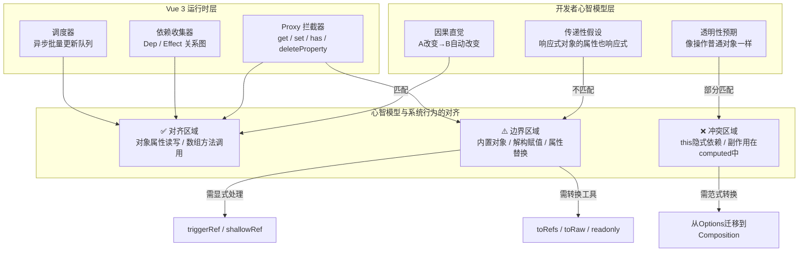
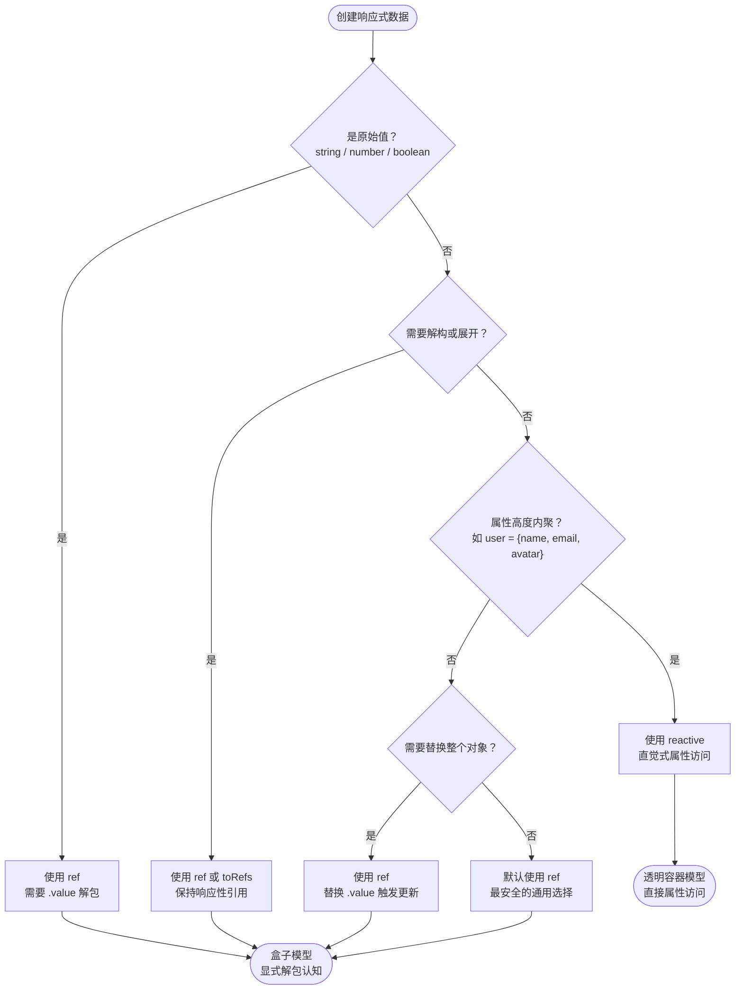
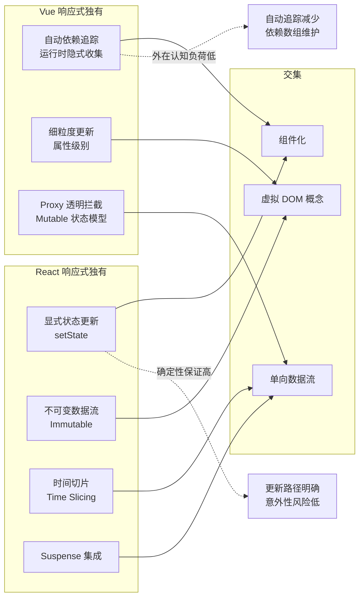

# Vue响应式系统的认知模型

> **核心命题**：Vue 3 的响应式系统在追求"透明性"的同时，也在开发者心智中埋下了边界陷阱。理解这些设计决策背后的认知科学原理，是写出低认知负荷代码的前提。

---

## 引言

2020年，某中型电商团队将核心交易平台从 Vue 2 迁移到 Vue 3。团队负责人预估需要 3 周完成核心模块迁移。实际执行中，第一个障碍出现在第 3 天：一名资深开发者编写了这样的代码——

```typescript
import { reactive } from 'vue';

const state = reactive({ count: 0, name: 'Alice' });

function useStateLogic() {
  const { count, name } = state;
  const increment = () => {
    count++;  // 视图没有更新！
  };
  return { count, name, increment };
}
```

这段代码在 Vue 2 中曾是"危险但可行"的，但在 Vue 3 中，解构出的 `count` 只是一个普通数字。这个 bug 花了团队 4 小时才定位。根本原因在于：开发者的心智模型停留在"数据修改自动更新"的抽象层面，没有理解 Proxy 与 `Object.defineProperty` 在引用语义上的本质差异。

类似的问题在接下来的两周内不断出现：开发者在 `computed` 中调用 `fetch`，困惑于为什么 API 请求没有按预期触发；团队试图用 `reactive` 包装整个应用状态树，发现深层嵌套对象的替换行为与直觉不符；习惯于 Options API 的开发者面对 `setup` 函数时，感到"代码组织失去了方向感"。

这类问题的共同特征是：它们不是语法错误，而是**心智模型与系统实际行为之间的错位**。Vue 3 的响应式系统在设计上追求"透明性"——让开发者感觉自己在直接操作普通 JavaScript 对象——但这种透明性是有边界、有代价的。当开发者的心智模型忽略了这些边界时，就会遇到认知冲突。

本章的目标不是罗列 Vue 3 响应式 API 的使用手册，而是从认知科学的角度分析：这个系统如何与人类的心智模型交互？透明性在哪些场景下是优势，在哪些场景下是陷阱？Ref 与 Reactive 两种 API 分别激活了什么样的心智表征？Composition API 与 Options API 的认知负荷差异在哪里？

---

## 理论严格表述

### 认知负荷理论的三重划分

认知心理学家 John Sweller 的**认知负荷理论**区分了三种负荷：

1. **内在负荷**（Intrinsic Load）：任务本身的复杂度。响应式数据流的内在复杂度不会因为框架选择而消失——状态之间的依赖关系、异步更新的时序、副作用的管理，这些都是任何 UI 框架都需要面对的问题。

2. **外在负荷**（Extraneous Load）：信息呈现方式带来的额外负担。Vue 的 Proxy 透明性大幅降低了外在负荷——你不需要写 `setState`、`dispatch`、`subscribe`。开发者可以像操作普通对象一样操作响应式数据，框架在后台自动追踪依赖。

3. **相关负荷**（Germane Load）：建立心智模型和图式所需的投入。`.value` 的解包、响应式对象的引用语义、Proxy 的拦截边界，都属于相关负荷。Vue 3 的设计权衡是：用中等的相关负荷换取低外在负荷和低内在负荷。

**精确类比：自动驾驶汽车**

| 概念 | 自动驾驶 | Vue Proxy |
|------|---------|-----------|
| 开发者操作 | 转动方向盘 | 修改数据 |
| 系统自动处理 | 引擎控制、刹车、转向 | 依赖追踪、更新调度、DOM 操作 |
| 感知 | "我在直接控制车" | "我在直接修改数据" |
| 实际 | 系统在后台做大量工作 | Proxy 在后台拦截读写 |

类比的边界：像自动驾驶一样，透明性降低了操作复杂度。但不像自动驾驶，Proxy 的"透明性"在某些场景下会静默失效——代码看起来在运行，但响应性已经丢失，开发者可能在很长时间内都不会察觉。

### 心智化理论与因果直觉

发展心理学家 Alison Gopnik 的研究表明，儿童在 3 岁左右就能建立"如果 A 改变，B 应该随之改变"的因果模型。这种直觉在成人阶段发展为**心智化理论**（Theory of Mind）——我们倾向于给对象赋予内在状态，并预期状态变化会产生可预测的行为。

Vue 的响应式系统恰好映射了这种直觉：

```typescript
const cart = reactive({
  items: [] as { price: number; quantity: number }[],
  discount: 0.1
});

const total = computed(() => {
  const subtotal = cart.items.reduce(
    (sum, item) => sum + item.price * item.quantity, 0
  );
  return subtotal * (1 - cart.discount);
});
```

开发者不需要在心智中维护一个"哪些视图依赖于哪些数据"的显式列表。Proxy 在后台构建的依赖图，替代了人类工作记忆本需要承担的部分负荷。这个映射的精确性体现在：当 `items` 变化时，`total` "应该"自动更新——这与人类根深蒂固的因果直觉完全一致。

### 传递性直觉的陷阱

人类心智倾向于**传递性直觉**——如果 A 是响应式的，A 的组成部分也应该是响应式的。但这种直觉在 JavaScript 的引用语义中不成立。`reactive` 返回的 Proxy 对象本身是响应式的，但解构出的属性值只是原始值的快照。

这正是解构丢失响应性的**深层认知根源**：ES6 解构是 JavaScript 的核心语法，开发者本能地使用它，但解构创建的是普通变量的引用，而非 Proxy 的引用。新手在这个陷阱上的认知负荷很高——不理解为什么解构会丢失响应性；专家则已建立"解构 = 复制"的心智模型，认知负荷低。

---

## 工程实践映射

### Proxy 透明性的正确利用与边界

**正例：利用 Proxy 透明性构建清晰的依赖链**

```typescript
function useUserSearch(users: Ref<User[]>) {
  const searchQuery = ref('');

  // 依赖自动追踪：filteredUsers 隐式依赖于 searchQuery 和 users
  const filteredUsers = computed(() => {
    const query = searchQuery.value.toLowerCase();
    if (!query) return users.value;
    return users.value.filter(user =>
      user.name.toLowerCase().includes(query)
    );
  });

  const resultCount = computed(() => filteredUsers.value.length);

  watch(resultCount, (newCount, oldCount) => {
    console.log(`Results changed from ${oldCount} to ${newCount}`);
  });

  return { searchQuery, filteredUsers, resultCount };
}
```

这个正例展示了 Proxy 透明性的最佳实践场景：数据依赖链清晰（searchQuery → filteredUsers → resultCount），没有手动订阅/取消订阅的负担，TypeScript 类型标注完整，每个 computed 都是纯函数，符合透明性的认知预期。

**反例：透明性的边界与陷阱**

```typescript
// Date 对象无法被 Proxy 完全拦截
const date = reactive(new Date());
date.setFullYear(2026);  // 不会触发依赖更新！

// 超出数组长度的索引赋值可能不触发更新
state.items[5] = 6;  // 可能静默失效

// Map/Set 的某些操作在边界情况下有限制
const map = reactive(new Map<string, number>());
map.set('key', 1);  // Vue 3.0+ 支持，但需理解其内部实现
```

Proxy 只能拦截**已知的属性访问模式**。`Date.prototype.setFullYear` 等方法不会触发 Proxy 的 `set` trap，因为它们是调用内部槽（internal slots）而非属性赋值。认知陷阱在于：开发者可能假设"所有操作都是透明的"，但实际上 Proxy 的失效是静默的。

**修正方案：当透明性失效时**

```typescript
// 对无法被 Proxy 拦截的对象，使用 ref + 替换
function useDate() {
  const date = ref(new Date());
  const setYear = (year: number) => {
    const newDate = new Date(date.value);
    newDate.setFullYear(year);
    date.value = newDate;  // 替换整个对象，触发响应
  };
  return { date, setYear };
}

// 使用 triggerRef 强制通知更新
import { triggerRef } from 'vue';
const items = ref(new Set<string>());
items.value.add('item');
triggerRef(items);  // 强制通知依赖更新

// 使用 shallowRef 明确控制深度
const shallowState = shallowRef({ deep: { nested: 'value' } });
// 只有 .value 的替换会触发更新，内部属性修改不会
```

关键认知转变：从"所有操作都透明"转向"默认透明，边界显式"。这类似于驾驶汽车时的认知模式——自动驾驶在高速公路有效，但在停车场你需要手动接管。

### Ref vs Reactive 的心智模型冲突

Vue 3 提供了两种创建响应式数据的方式，反映了**两种不同的心智模型**：

- **ref** = "盒子里的值"（需要打开盒子才能看到）
- **reactive** = "透明的容器"（直接看到内容）

**精确类比：银行保险箱 vs 玻璃展示柜**

| 概念 | 银行保险箱（Ref） | 玻璃展示柜（Reactive） |
|------|----------------|---------------------|
| 访问方式 | 需要钥匙（`.value`） | 直接看到内容（`.property`） |
| 适用对象 | 单个贵重物品（原始值） | 成套藏品（对象） |
| 替换成本 | 换一把保险箱即可（替换 `.value`） | 需要重新布置整个展柜（替换对象引用丢失响应性） |
| 认知负担 | 高：每次访问都需要"开锁" | 低：直觉式访问 |

| 场景 | 推荐 | 理由 | 反例风险 |
|------|------|------|---------|
| 原始值（string, number, boolean）| ref | reactive 只能用于对象 | 用 reactive 包装原始值导致类型错误 |
| 需要解构 | ref + toRefs | 避免丢失响应性 | 直接解构 reactive 对象丢失响应性 |
| 复杂对象（多个相关属性）| reactive | 更符合"对象"的心智模型 | 替换整个对象会失去响应性 |
| 需要替换整个对象 | ref | reactive 替换对象会失去响应性 | 直接赋值给 reactive 变量创建新引用 |
| 跨组件传递状态 | ref | 引用语义清晰 | reactive 对象在传递中可能被解构 |
| 需要 readonly 暴露 | ref + readonly | 可以精确控制粒度 | reactive 的 readonly 转换更复杂 |

**正例：使用 toRefs 和 readonly 建立安全边界**

```typescript
import { reactive, toRefs, readonly } from 'vue';

function useAppState() {
  const state = reactive({
    user: { name: 'Alice', id: 1 },
    settings: { theme: 'light' as 'light' | 'dark' }
  });

  const refs = toRefs(state);
  const readonlySettings = readonly(refs.settings);

  const updateTheme = (theme: 'light' | 'dark') => {
    state.settings.theme = theme;
  };

  return {
    user: refs.user,
    settings: readonlySettings,
    updateTheme
  };
}
```

这个正例展示了如何建立**防御性响应式边界**：`toRefs` 解决了解构丢失响应性的问题，`readonly` 防止了外部对状态的随意修改，通过函数接口暴露受控的修改操作。

### Computed 的缓存语义与预期一致性

`computed` 的核心认知优势在于**惰性求值**和**缓存**——符合"只在需要时计算"和"结果不变时直接返回缓存"的直觉。

**精确类比：图书馆的索引卡片系统**

想象一个图书馆，每本书有作者、标题、出版年份。读者经常问"这本书的作者是谁"。没有 computed 时，每次有人询问，图书管理员都要走到书架前查找（重复计算）。有 computed 时，管理员第一次查找后，把结果写在索引卡片上。之后只要书没有更换（依赖没变），就直接读卡片（缓存）。

边界标注：索引卡片减少了重复劳动，但如果有人在卡片上写笔记（副作用），其他读者会看到（意外共享）。索引卡片只记录"查询结果"，不应该触发其他动作。

**反例：副作用导致的预期违背**

```typescript
const counter = computed(() => {
  console.log('Counter computed');           // 副作用 1
  fetch('/api/log').catch(() => {});         // 副作用 2：网络请求！
  return items.value.length;
});
```

computed 的缓存语义意味着副作用不会按预期执行。如果 `items.value.length` 没有变化，`fetch` 不会被调用。这违背了开发者的直觉——"每次我读取这个值，日志都应该打印"。

开发者将 computed 理解为"带缓存的函数"，但 Vue 的 computed 实际上是"带缓存的纯派生关系"。函数可以包含副作用；派生关系不行。

**职责矩阵**：

| 工具 | 职责 | 返回值 | 副作用 | 缓存 |
|------|------|--------|--------|------|
| computed | 纯派生 | 有 | 禁止 | 缓存 |
| watch | 监听 + 副作用 | 无 | 适合 | N/A |
| watchEffect | 自动追踪 + 副作用 | 无 | 适合 | N/A |
| ref + watch | 可变派生状态 | 有 | 可接受 | 手动管理 |

### Composition API vs Options API 的认知维度对比

使用 Green & Petre 的认知维度框架（Cognitive Dimensions Framework）分析两种 API：

| 认知维度 | Options API | Composition API | 影响 |
|---------|-------------|-----------------|------|
| **抽象梯度** | 固定（data, methods, computed）| 自由（按功能组合）| Composition 更灵活但门槛更高 |
| **隐藏依赖** | 高（`this` 隐式依赖）| 低（显式导入和调用）| Composition 更易追踪 |
| **渐进评估** | 中 | 高 | Composition 支持增量开发 |
| **粘度** | 高（逻辑分散在选项中）| 低（逻辑内聚）| Composition 更易重构 |
| **一致性** | 高（固定结构）| 中（自由组合）| Options 更易上手 |
| **错误倾向性** | 中（this 指向问题）| 低（显式依赖）| Composition 更类型安全 |
| **可见性** | 中（相关逻辑分散在不同选项）| 高（相关逻辑集中）| Composition 更易理解上下文 |
| **硬心理操作** | 中（需要在选项间跳转理解逻辑）| 低（线性阅读即可）| Composition 降低阅读负担 |

Options API 的最大认知陷阱是 `this`。在 Options API 中，`this.count` 可能来自 `data`、`computed`、`props` 或 Vuex store。开发者需要在多个选项块之间跳转，才能确定 `count` 的来源。Composition API 通过显式导入消除了这种歧义。

**对称差分析**：

```
Options API 独有 = {
  "this 的隐式上下文",
  "固定选项结构带来的一致性",
  "对 Vue 2 开发者的熟悉感"
}

Composition API 独有 = {
  "逻辑复用（Composables）",
  "更好的 TypeScript 类型推断",
  "按功能组织代码",
  "更细粒度的逻辑拆分"
}
```

**迁移的认知成本与增量策略**：

从 Options API 迁移到 Composition API 的认知成本被严重低估：

1. **解构旧心智模型**：放弃 "data/methods/computed" 的固定结构（1-2 周）
2. **建立新心智模型**：学习 "按功能组合" 的组织方式（2-3 周）
3. **重新认识生命周期**：从 `mounted()` 到 `onMounted()`（1 周）
4. **处理 this 的消失**：从隐式上下文到显式变量（2-3 周）

估计迁移时间：熟练 Vue 2 开发者需要 4-6 周完全适应 Composition API；新手开发者直接学习 Composition API 反而更快（无需解构旧习惯）。

---

## Mermaid 图表

### Vue 响应式系统认知架构图



### Ref vs Reactive 决策认知流



### Vue vs React 响应式对称差认知映射



---

## 理论要点总结

1. **透明性是双刃剑**：Vue 3 Proxy 的透明性降低了外在认知负荷（无需手动声明依赖），但制造了"所有操作都透明"的幻觉。当透明性在边界处失效时（Date、解构、数组越界索引），开发者往往在长时间内无法察觉，导致静默 bug。关键认知转变是从"所有操作都透明"转向"默认透明，边界显式"。

2. **两种心智模型的强制选择**：Ref 的"盒子模型"和 Reactive 的"透明容器模型"不能混用。团队应建立统一的决策规范，否则每个开发者都会根据自己的直觉选择 API，导致代码库中存在两种不兼容的认知模式。决策流程：原始值 → ref；需要解构 → ref / toRefs；对象且属性高度内聚 → reactive；需要替换整个对象 → ref；不确定 → ref（默认更安全）。

3. **Computed 是纯派生关系，不是函数**：开发者最常见的错误是将 computed 当作"带缓存的函数"来使用，在其中放置副作用。正确的理解是：computed 描述的是**数据之间的数学关系**，这种关系必须是纯的、可逆推的。图书馆索引卡片的类比精确地表达了这一点：卡片记录查询结果，不应触发其他动作。

4. **Composition API 的认知优势在于可见性**：Green & Petre 的认知维度分析表明，Composition API 在"隐藏依赖"和"硬心理操作"两个维度上显著优于 Options API。`this` 的隐式上下文是 Options API 最大的认知陷阱——`this.count` 可能来自 `data`、`computed`、`props` 或 Vuex store，开发者需要在多个选项块之间跳转才能确定来源。

5. **迁移的认知成本被严重低估**：从 Options API 迁移到 Composition API 不仅是语法转换，更是心智模型的重构。熟练 Vue 2 开发者需要 4-6 周才能完全适应，而新手直接学习 Composition API 反而更快——因为没有旧习惯需要解构。增量迁移策略：新功能用 Composition API，旧代码保持 Options；提取可复用逻辑为 Composables；逐步重写为 `script setup`。

6. **与 React useState 的认知对比**：Vue 强调"数据是响应式的"，React 强调"状态是显式管理的"。Vue 的响应式像自动门——你走向它，门自动打开；React 的 useState 像手动门——你需要按下按钮，门才会打开。两种哲学没有绝对的优劣，但匹配不同开发者的心智模型。

---

## 参考资源

1. Sweller, J. (1988). "Cognitive Load During Problem Solving: Effects on Learning." *Cognitive Science*, 12(2), 257-285. —— 认知负荷理论的经典文献，为分析 API 设计的心智成本提供了理论基础。Sweller 区分了内在负荷、外在负荷和相关负荷，这三种负荷的权衡是评估任何编程接口可用性的核心框架。

2. Green, T. R. G., & Petre, M. (1996). "Usability Analysis of Visual Programming Environments." *Journal of Visual Languages and Computing*, 7(2), 131-174. —— 认知维度框架（Cognitive Dimensions Framework）的原始论文，被广泛用于评估编程语言和设计系统的可用性。本文使用此框架对比了 Options API 与 Composition API 在"隐藏依赖"、"粘度"、"可见性"等维度上的差异。

3. Vue Team. "Reactivity in Depth." *Vue Documentation*. —— Vue 官方文档对响应式系统的深度解释，包含 Proxy 实现细节和边界情况说明。是理解 Vue 3 响应式系统技术实现的首要权威来源。

4. Norman, D. A. (2013). *The Design of Everyday Things* (Revised ed.). Basic Books. —— Don Norman 关于心智模型、示能和映射的经典著作，适用于分析框架设计与开发者心智模型的匹配度。Norman 提出的"概念模型"与"系统映像"的区分，直接解释了为什么 Proxy 透明性在边界处失效时会造成困惑。

5. Gopnik, A., & Meltzoff, A. N. (1997). *Words, Thoughts, and Theories*. MIT Press. —— 发展心理学中关于因果推理和心智化理论的研究，解释了为什么响应式系统"感觉自然"。儿童在 3 岁就能建立"如果 A 改变，B 应该随之改变"的因果模型，这种直觉正是 Vue 响应式系统所映射的心智模型。
