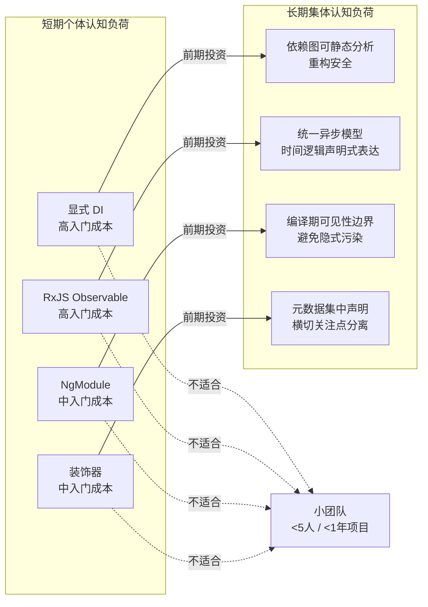
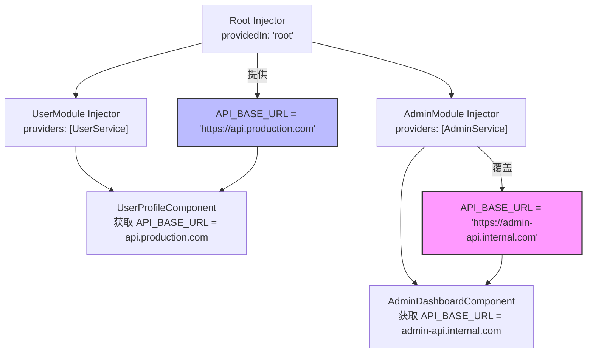
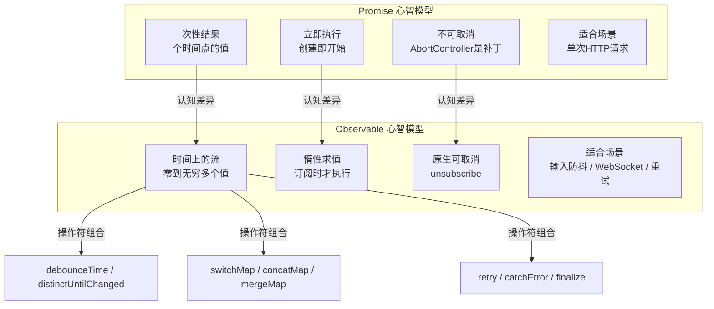

# Angular架构的认知负荷分析

> **核心命题**：Angular 的每一个"复杂"设计都不是为了炫技，而是为了在多人协作、长期维护的约束下，降低系统的总体认知负荷。理解这些设计决策背后的认知科学原理，是做出正确技术选型的前提。

---

## 引言

React 的入门只需要理解三个概念：组件、Props、State。Vue 的入门只需要理解：模板语法、响应式数据、组件。而 Angular 的入门却需要同时掌握 DI（依赖注入）、RxJS（响应式编程）、NgModule（模块系统）、装饰器（元编程）——四件完全不同领域的东西。

这不是设计失误，而是**工程意图的显式表达**。Angular 的设计哲学根植于一个核心信念：**企业级应用的长周期维护成本，远高于初期学习成本。**

企业级应用通常具有以下特征：生命周期长达 5-10 年；团队规模数十人甚至上百人同时贡献代码；需求不断变化，业务逻辑持续演化；金融、医疗、政务等场景不容许低级错误。

在这种背景下，Angular 的每一个"复杂"设计都不是为了炫技，而是为了**在多人协作、长期维护的约束下，降低系统的总体认知负荷**。以依赖注入为例：在小型项目中，全局变量或手动 `new Service()` 完全够用。但当项目规模扩大到 50 个模块、200 个服务时，谁来创建这些服务？谁负责它们的生命周期？如何在不破坏现有代码的前提下替换一个实现？Angular 的 DI 系统本质上是一个**认知负荷的转移机制**：它在初期要求开发者学习一套规则，但在长期运行中，这套规则自动解决了大量本该由人脑记住的依赖关系。

再以 RxJS 为例：在简单场景下，`fetch().then()` 比 `http.get().subscribe()` 直观得多。但当应用需要处理防抖、节流、重试、取消、多流合并时，Promise 的语义表达能力就不够了。Angular 选择把 Observable 设为默认，是在说："我知道这增加了入门门槛，但我更不愿意看到你在 6 个月后用回调地狱毁掉整个项目。"

理解这一点至关重要。接下来的所有分析，都不能脱离这个工程背景：Angular 的每个设计决策，都是在**短期个体认知负荷**和**长期集体认知负荷**之间做的权衡。

---

## 理论严格表述

### 认知负荷的短期与长期权衡

认知心理学家 John Sweller 的**认知负荷理论**区分了三种负荷：内在负荷（任务本身的复杂度）、外在负荷（信息呈现方式带来的额外负担）、相关负荷（建立心智模型和图式所需的投入）。Angular 的设计决策可以用这个框架重新解读：

| 子系统 | 入门负荷 | 长期维护负荷 | 核心认知价值 |
|--------|---------|-------------|-------------|
| 显式 DI | 高 | 低 | 依赖关系静态可见，重构安全 |
| RxJS Observable | 高 | 中 | 统一异步模型，时间逻辑声明式表达 |
| NgModule | 中 | 中 | 编译期可见性边界，避免隐式污染 |
| 装饰器 | 中 | 低 | 元数据集中声明，横切关注点分离 |

这种"入门高、维护低"的模式，本质上是一种**认知投资**：前期投入相关负荷建立正确的心智模型，后期享受外在负荷降低的收益。

### 不确定性削减理论

显式 DI 解决的问题是**不确定性削减（Uncertainty Reduction）**。人类大脑在处理不确定信息时消耗的认知资源，远高于处理确定信息。当开发者看到 `constructor(private http: HttpClient)` 时，他立即知道：这是一个由框架管理的外部依赖，它的生命周期、配置方式、替换规则都由 DI 容器统一处理。

与之对比的是隐式依赖：`private http = new HttpClient()`。从哪里来？如何配置？能 mock 吗？这些问题每一个都会占用工作记忆的槽位。

### 时间维度上的状态管理

Promise 表示一个将在未来完成的一次性操作。Observable 表示一个可能产生零个或多个值的随时间变化的流。在实际工程中，"一次性操作"的假设往往不成立：用户输入框的实时搜索需要防抖和取消前次请求；WebSocket 消息流是持续的；页面可见性变化需要暂停和恢复；路由参数变化要求同一组件响应新参数。

Promise 模型对这些场景的表达能力很弱。你可以用 `Promise.race` 做取消，用额外的状态变量追踪最新请求，但这些方案本质上是**用命令式代码填补声明式模型的缺口**。Angular 选择 Observable，是因为它在**统一不同类型的时间行为**方面具有认知优势。当所有异步操作都是 Observable 时，开发者只需要学习一套组合子，就可以处理任何时间模式。

---

## 工程实践映射

### 显式依赖注入的认知权衡

**正例：利用层级注入器实现环境隔离**

```typescript
// app.config.ts - 根级别提供全局配置
export const appConfig: ApplicationConfig = {
  providers: [
    { provide: API_BASE_URL, useValue: 'https://api.production.com' }
  ]
};

// feature/admin/admin.config.ts - 子模块覆盖
export const adminConfig: ApplicationConfig = {
  providers: [
    { provide: API_BASE_URL, useValue: 'https://admin-api.internal.com' }
  ]
};

@Component({...})
export class DataComponent {
  // 根据组件所在的模块层级，自动拿到正确的 URL
  constructor(@Inject(API_BASE_URL) private apiUrl: string) {}
}
```

这个设计的认知优势在于：**同一段代码，在不同上下文中自动获得不同行为，而代码本身不需要改变。** 开发者不需要写 `if (isAdmin) { url = ... } else { url = ... }`，这种条件分支的消除直接降低了工作记忆负荷。

**反例：在错误层级提供服务导致的单例陷阱**

```typescript
@Component({
  selector: 'app-user-list',
  providers: [UserService] // 每个组件实例都会得到一个新的 UserService！
})
export class UserListComponent {
  constructor(private userService: UserService) {}
}
```

开发者可能期望 `UserService` 是全局状态，但因为把它放在了组件的 `providers` 中，每个 `<app-user-list>` 实例都会创建一个独立的 `UserService`。这会导致状态不共享、重复请求、内存泄漏。这个反例揭示了 Angular DI 的一个核心认知陷阱：**提供位置和声明位置是分离的。**

**对称差分析：显式 DI vs 隐式 DI vs Service Locator**

| 维度 | Angular 显式 DI | 隐式 DI | Service Locator |
|------|----------------|---------|-----------------|
| 依赖声明位置 | 构造函数签名 | 无显式声明，按命名/类型自动装配 | 手动从全局容器中查找 |
| 编译期检查 | TypeScript 类型系统可在编译时发现缺失依赖 | 运行时才发现，错误延迟暴露 | 通常是 `locator.get('UserService')`，返回 `any` |
| 心智模型 | "我声明我需要什么" | "框架知道我需要什么" | "服务容器在哪里、怎么查" |
| 大规模维护 | 依赖图可静态分析，重构安全 | 依赖关系隐藏于约定中，重构风险高 | 全局状态在测试中如同定时炸弹 |
| 认知确定性 | 高：签名即契约 | 低：依赖关系散落在命名约定中 | 低："依赖是什么"和"怎么找到依赖"耦合在一起 |

### RxJS 强制使用的认知门槛

**正例：用 switchMap 处理输入框防抖**

```typescript
@Component({...})
export class SearchComponent {
  private searchText = new Subject<string>();

  results$ = this.searchText.pipe(
    debounceTime(300),           // 等用户停止输入 300ms
    distinctUntilChanged(),      // 内容没变就不发请求
    switchMap(term =>            // 取消前次未完成的请求
      this.http.get(`/api/search?q=${term}`)
    )
  );

  onInput(value: string) {
    this.searchText.next(value);
  }
}
```

这个例子的认知优势在于：**时间上的复杂逻辑被压缩成了声明式的操作符组合。** 开发者不需要手动管理 `setTimeout`、不需要追踪当前请求以便取消、不需要比较新旧值。这些原本需要多个状态变量和条件判断的逻辑，被操作符的语义精确描述。

如果用 Promise 实现，需要 4 个手动管理的状态变量，取消逻辑散落在多个地方，防抖和去重的实现细节暴露无遗，还有内存泄漏风险。

**反例：忘记取消订阅导致的内存泄漏**

```typescript
@Component({...})
export class UserComponent {
  users: User[] = [];

  constructor(private userService: UserService) {
    // 每次创建组件都新增一个订阅，永远不会取消！
    this.userService.getUsers().subscribe(users => {
      this.users = users;
    });
  }
}
```

在路由切换频繁的 SPA 中，这个组件会被反复创建和销毁。但 subscribe 返回的订阅不会随组件销毁而自动取消，导致内存泄漏、竞态条件和不必要的网络请求。

**修正方案**：

```typescript
// 方法1：使用 async 管道，让模板自动管理订阅
@Component({
  template: `
    <div *ngFor="let user of users$ | async">
      {{ user.name }}
    </div>
  `
})
export class UserComponent {
  users$ = this.userService.getUsers(); // 不需要 subscribe！
}

// 方法2：使用 takeUntilDestroyed（Angular 16+）
@Component({...})
export class UserComponent {
  users: User[] = [];
  constructor(private userService: UserService) {
    this.userService.getUsers()
      .pipe(takeUntilDestroyed())
      .subscribe(users => this.users = users);
  }
}
```

### 模块系统（NgModule）的层级复杂度

**为什么需要 NgModule？** 既然已经有了 ES Module（`import`/`export`），为什么还要 NgModule？答案在于**编译期元数据的需求**。ES Module 只解决了运行时加载的问题，但它不解决编译期编译的问题——这个组件的模板中可以使用哪些其他组件、指令、管道。

NgModule 本质上是一个**编译期可见性声明**：

```typescript
@NgModule({
  declarations: [HeaderComponent], // 这个模块拥有这些组件
  imports: [RouterModule],          // 这个模块的模板可以使用这些模块导出的东西
  exports: [HeaderComponent]        // 其他导入此模块的模块可以使用这些
})
export class SharedModule {}
```

**对称差分析：NgModule vs ES Module vs 独立组件**

| 维度 | NgModule | ES Module | Standalone Components |
|------|----------|-----------|----------------------|
| 解决的问题 | 编译期模板可见性 + 运行时 DI provider 作用域 | 运行时文件依赖和加载 | 组件自身声明依赖 |
| 作用域 | 组件/指令/管道的可见性是模块级别的 | 导入即可见 | 组件级别 |
| 树摇优化 | 需要理解模块边界，优化较保守 | 静态分析更精确 | 静态分析精确 |
| 学习成本 | 高（declarations vs imports vs exports） | 低 | 中 |
| 认知焦点 | "我在哪个模块里？这个模块导入了什么？" | "代码单元 + 依赖关系" | "这个组件需要哪些东西？" |

Angular 14 引入的 Standalone Components 把模块级别的集中式配置拆成了组件级别的分散式配置。这在认知上的影响是：你不再需要为了理解一个组件能用什么，去追踪它所属的模块和该模块的导入链；你只需要看这个组件自身的 `imports` 数组。

### 装饰器的元编程认知负荷

Angular 大量使用装饰器：`@Component`、`@Injectable`、`@NgModule`、`@Input`、`@Output`、`@HostListener`... 装饰器在语法上看起来像是"注解"，但在语义上它们实际上是**函数调用**。`@Component({...})` 等价于一个函数，它接收一个类，返回一个被修改/增强的类。

**对称差分析：装饰器 vs 工厂函数 vs 纯函数组合**

| 维度 | 装饰器 | 工厂函数 | 纯函数组合 |
|------|--------|---------|-----------|
| 语法位置 | 紧挨着类定义，视觉上"属于"类 | 独立调用，显式传入参数 | 数据和行为分离 |
| 运行时修改 | 可以修改类的原型、构造函数 | 创建新对象，不修改原有类 | 无副作用 |
| 可测试性 | 较低——装饰器逻辑与类耦合 | 较高——工厂可独立测试 | 高——组合顺序可明确推导 |
| 心智模型 | "这个类有这些属性" | "这个函数创建了什么东西" | "数据变换流水线" |

核心差异：装饰器把"类的创建"和"类的增强"合并为单一语法单元。工厂函数则把它们分开：你先定义一个类/对象，再用函数去增强它。在 Angular 中，这种合并的代价是**调试的困难**——当你在一个 Angular 组件中设置断点时，你看到的不是原始类，而是被装饰器处理过的版本。

---

## Mermaid 图表

### Angular 四大子系统认知负荷权衡图



### Angular DI 层级注入器认知模型



### RxJS Observable vs Promise 认知维度映射



---

## 理论要点总结

1. **Angular 的复杂度是工程意图的显式表达**：每个"复杂"设计都是为了在多人协作、长期维护的约束下降低系统的总体认知负荷。DI 系统转移了依赖管理的认知负担；RxJS 统一了异步模型；NgModule 建立了编译期可见性边界；装饰器实现了横切关注点分离。

2. **显式 DI 的核心价值是不确定性削减**：`constructor(private http: HttpClient)` 把依赖声明从隐式的约定变成了显式的契约。约定在团队规模小时是效率利器，在团队规模大时是认知灾难。Service Locator 把"依赖是什么"和"怎么找到依赖"两个问题耦合在了一起，而显式 DI 通过构造函数签名分离了这两个问题。

3. **RxJS 的学习曲线是时间维度表达能力的代价**：Promise 是**点**（一个时间点的结果），Observable 是**线**（一条时间轴上的事件序列）。点是容易把握的，线则需要持续追踪。但当应用需要处理防抖、节流、重试、取消时，Promise 的语义表达能力不足，用命令式代码填补声明式模型的缺口反而增加了长期认知负荷。

4. **装饰器是元编程的"善意谎言"**：装饰器在语法上看起来像"注解"，在语义上是函数调用。这种语法糖带来了两个层面的认知影响——初学者难以理解装饰器在运行时修改了类；元编程的强大与危险并存。装饰器参数应最小化，复杂逻辑应移到服务中。

5. **短期个体认知负荷 vs 长期集体认知负荷的权衡**：如果团队规模小（<5 人）且项目生命周期短（<1 年），考虑 React/Vue 以降低入门成本。如果团队规模大或项目需要长期维护，Angular 的前期投资会在 6 个月后回收。新团队策略、RxJS 渐进式采用、模块粒度控制、装饰器参数最小化是四条核心工程建议。

---

## 参考资源

1. Sweller, J. (1988). "Cognitive Load During Problem Solving: Effects on Learning." *Cognitive Science*, 12(2), 257-285. —— 认知负荷理论的经典文献，为分析 Angular 各子系统的入门成本与长期收益提供了核心理论框架。

2. Kalyuga, S. (2009). "Knowledge Elaboration and Cognitive Load Theory." *Learning and Instruction*, 19(5), 402-410. —— 知识精细加工与认知负荷理论的研究，解释了为什么 Angular 的"高入门成本"在长期维护中会被摊薄为"低认知负荷"。

3. Fowler, M. (2004). "Inversion of Control Containers and the Dependency Injection Pattern." *martinfowler.com*. —— Martin Fowler 关于依赖注入的经典文章，Angular 的 DI 系统设计直接继承自此文阐述的原则。

4. Meijer, E. (2012). "Your Mouse is a Database." *Communications of the ACM*, 55(5), 66-73. —— Erik Meijer 关于响应式编程的开创性文章，为理解 RxJS 将一切建模为"流"的哲学提供了理论基础。

5. Gamma, E., Helm, R., Johnson, R., & Vlissides, J. (1994). *Design Patterns: Elements of Reusable Object-Oriented Software*. Addison-Wesley. —— "四人帮"设计模式经典著作，Angular 的 DI、观察者模式、中介者模式等设计都直接源于此书。
