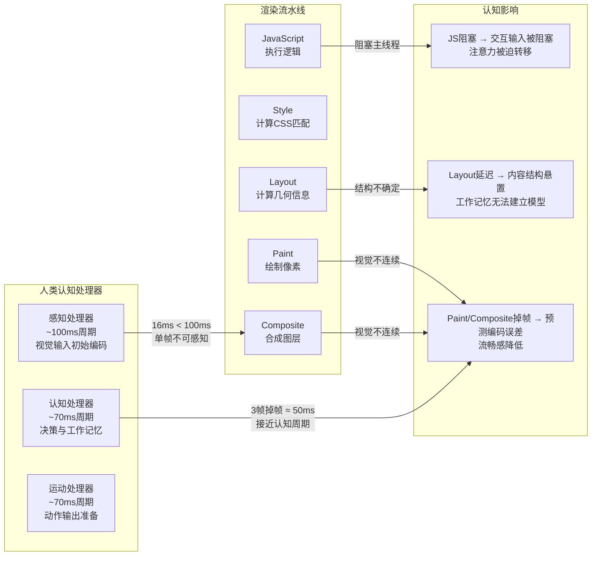
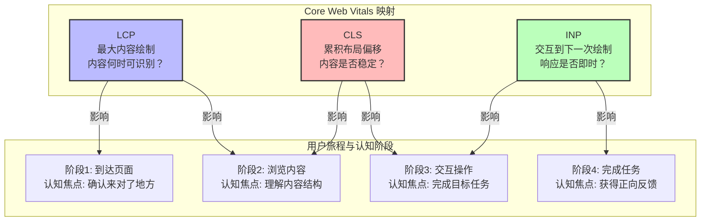
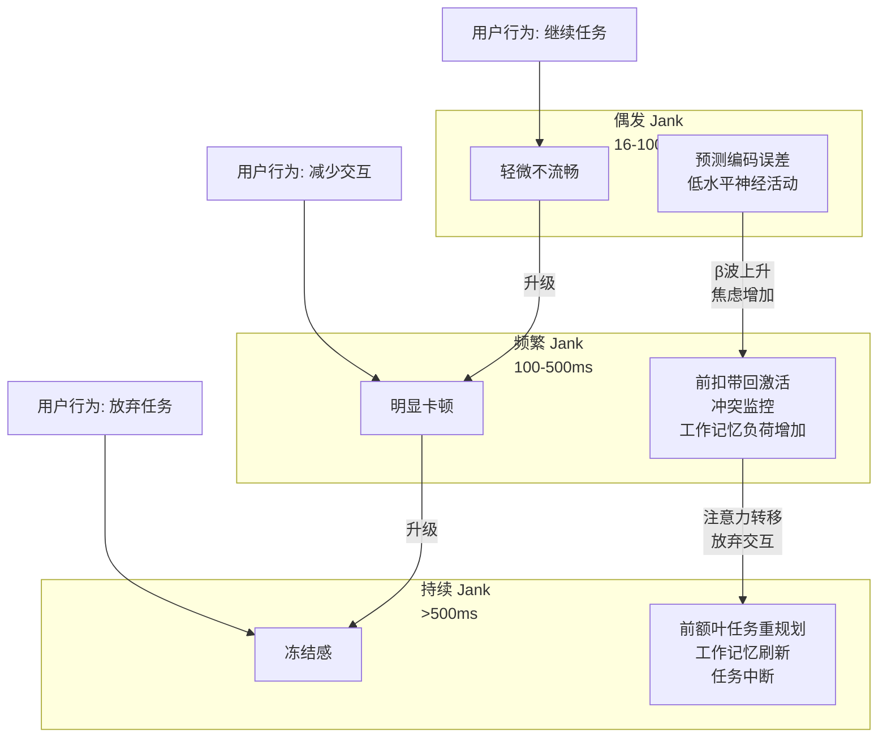

# 渲染引擎与认知感知

> **核心命题**：每一毫秒的渲染延迟都不是技术数字，而是对人类注意力系统、前庭系统和时间感知神经机制的干预。理解渲染流水线与认知感知的映射关系，是构建真正"流畅"用户体验的科学基础。

---

## 引言

当用户打开一个网页时，发生了什么？从技术的视角看：浏览器下载 HTML、解析 CSS、执行 JavaScript、构建 DOM 和 CSSOM、计算布局、绘制像素、合成图层。这是一套精确的工程流程。

但从认知科学的视角看：用户的视网膜接收光信号，背侧通路追踪空间位置，腹侧通路识别内容含义，前额叶皮层评估等待时间，前庭系统维持空间定向预期。当这些神经过程与渲染流水线发生错位时，用户感受到的不是"加载慢"，而是**焦虑、困惑、挫败**。

本章的核心命题是：**渲染性能优化不是技术 vanity metrics 的追求，而是对人类认知系统的精确配合。** 我们将从神经科学、认知心理学和人机交互三个学科出发，建立浏览器渲染行为与人类感知之间的严格映射，并为工程实践提供可操作的决策框架。

---

## 理论严格表述

### 视觉信息处理的双通路模型

人类视觉系统并非单一的"摄像头"，而是由两条功能分离的神经通路组成（Goodale & Milner, 1992；Ungerleider & Mishkin, 1982）：

| 通路 | 名称 | 功能 | 对渲染的启示 |
|------|------|------|------------|
| **背侧通路** | "Where/How" 通路 | 空间定位、运动追踪、手眼协调 | 布局偏移（CLS）直接影响此通路 |
| **腹侧通路** | "What" 通路 | 物体识别、颜色、细节识别 | LCP 影响内容"可读性"的启动时间 |

**实验证据**：Goodale et al. (1991) 的患者 D.F. 研究（因一氧化碳中毒导致腹侧通路损伤）表明，D.F. 无法识别物体的形状（"这是什么？"），但仍能准确地将信件投入邮筒的狭缝（"如何操作？"）。这证明空间运动处理与物体识别是**分离的神经系统**。

**对前端开发的启示**：当页面发生布局偏移（CLS）时，干扰的是背侧通路的空间稳定预期。即使内容已经识别（腹侧通路完成工作），空间位置的变化仍然会触发认知失调。当 LCP 延迟时，腹侧通路无法开始内容识别，用户处于"看到页面但无法处理内容"的悬置状态。

### 时间感知的前额叶机制

人类对时间的感知不是客观的，而是由**前额叶皮层（Prefrontal Cortex）**和**基底神经节（Basal Ganglia）**共同建构的（Wittmann, 2013）。关键发现包括：

- **时间知觉的可塑性**：当注意力高度集中时，主观时间流逝变慢（"时间膨胀"效应）；当无聊或焦虑时，主观时间流逝加速。
- **预期违背效应**：当预期事件未按时发生时，前额叶会触发**错误相关负波（Error-Related Negativity, ERN）**，这是一种与焦虑和注意力转移相关的脑电信号（Gehring et al., 1993）。

**实验数据**：Wahlstrom et al. (2012) 使用 EEG 测量了被试在等待网页加载时的脑电活动。他们发现，当加载时间超过 **1.5 秒**时，被试的额叶 α 波（与放松相关）显著下降，β 波（与焦虑和警觉相关）显著上升（p < 0.01, N = 24）。**这意味着 1.5 秒是用户从"放松等待"切换到"焦虑警觉"的临界点。**

### 注意力资源的有限容量

根据 Card, Moran & Newell (1983) 的 **Model Human Processor**，人类的注意力资源是有限的：

| 处理器 | 周期 | 功能 | 渲染映射 |
|--------|------|------|---------|
| **感知处理器**（Perceptual Processor） | ~100ms | 视觉输入的初始编码 | 单帧图像的捕获 |
| **认知处理器**（Cognitive Processor） | ~70ms | 决策、推理、工作记忆操作 | 理解页面结构 |
| **运动处理器**（Motor Processor） | ~70ms | 动作输出准备 | 鼠标点击的意图形成 |

**关键洞见**：这三个处理器的周期（70-100ms）与 **60fps（16.67ms/帧）** 之间存在数量级差异。这意味着：人类无法感知单帧级别的差异（16ms < 100ms 感知周期），但人类能感知**连续多帧的异常模式**（如 3 帧连续掉帧 = 50ms，接近认知处理器周期）。当交互延迟超过 **100ms**（感知处理器周期）时，用户开始感知到"响应存在延迟"。

### 流畅感（Fluency）的认知心理学

Reber et al. (2004) 的经典研究表明：**处理流畅性**（Processing Fluency）影响用户对内容的**信任度**和**美观度**评价。当信息处理顺畅时，用户产生**积极情绪反应**（通过眶额皮层激活测量）；当处理受阻时（如卡顿），用户产生**负面评价迁移**——不仅认为"系统慢"，还可能认为"内容质量低"。

实验设计细节：N = 64 名被试观看不同呈现流畅度的图片。结果表明，高流畅度图片被评定为"更美观"（M = 5.8 vs M = 4.2, t(63) = 4.32, p < 0.001），且被试更愿意相信图片内容的真实性（效应量 d = 0.54，中等效应）。

---

## 工程实践映射

### 人类视觉系统的帧率感知

人类视觉系统存在一个基本的生理限制——**视觉暂留**（Persistence of Vision）。当光刺激视网膜后，视觉印象会持续约 **80-100 毫秒**（Wade, 2014）。**闪烁融合阈值**（Flicker Fusion Threshold, FFF）是指人类无法感知离散帧闪烁的最高频率：

| 条件 | 闪烁融合阈值 | 应用 |
|------|-------------|------|
| 中心视野（明适应，2°视角）| ~60 Hz | 传统显示器刷新率标准 |
| 周边视野（暗适应）| ~90 Hz | VR 设备要求高刷新率 |
| 高亮度环境（>100 cd/m²）| ~100+ Hz | 高端游戏显示器 |

**对前端开发的启示**：60fps（16.67ms/帧）是传统 Web 应用的目标，但这只是"不感知闪烁"的最低标准。120fps 在高端设备中越来越普遍，它主要减少了**平滑追踪眼动**时的抖动感知。低于 30fps（33.3ms/帧）会产生明显的卡顿感。

### 浏览器渲染流水线与注意力分配

现代浏览器的渲染流水线包含五个阶段：

```
JavaScript -> Style -> Layout -> Paint -> Composite
```

| 阶段 | 典型时间预算 | 认知影响 | 优化策略 |
|------|------------|---------|---------|
| **JavaScript** | 可变（通常 < 10ms） | 执行逻辑，阻塞主线程 | Web Workers, 代码分割 |
| **Style** | ~1-5ms | 计算 CSS 属性匹配 | 减少选择器复杂度 |
| **Layout** | ~5-20ms | 计算几何信息（Reflow）| 避免强制同步布局 |
| **Paint** | ~5-30ms | 绘制像素（Repaint）| 使用 CSS 合成属性 |
| **Composite** | ~1-3ms | 合成图层到屏幕 | 使用 transform/opacity |

**认知抢占模型**：当渲染流水线中的任一阶段超过其时间预算，会**抢占用户的认知资源**。用户的注意力是有限的——当浏览器忙于渲染时，用户的交互输入被阻塞，注意力被迫从"任务目标"转移到"等待系统响应"。超过 2.5s 的延迟会导致工作记忆中的任务上下文开始衰减（Baddeley, 2000）。

**反例：强制同步布局（FSL）的认知代价**

```javascript
// 反例：读取后立即修改，强制浏览器重新计算布局
function measureAndMutate() {
  const height = element.offsetHeight;  // 读取布局（触发 Layout）
  element.style.height = `${height * 2}px`;  // 立即修改（强制重新 Layout）
  // 认知代价：浏览器被强制中断当前流水线，重新计算布局
  // 用户感知：如果此时尝试交互，输入被阻塞
}

// 正例：批量读写分离
function batchMeasureAndMutate() {
  // 阶段1：批量读取（所有读取在一次 Layout 中完成）
  const heights = elements.map(el => el.offsetHeight);

  // 阶段2：批量写入（使用 requestAnimationFrame 批量应用）
  requestAnimationFrame(() => {
    elements.forEach((el, i) => {
      el.style.height = `${heights[i] * 2}px`;
    });
  });
}
```

### 卡顿（Jank）的认知影响

**Jank** 是指渲染帧率低于目标帧率（通常为 60fps）导致的视觉卡顿。其数学定义为：

```
Jank = { frame | frame_duration > 16.67ms }
Jank_Score = Σ(max(0, frame_duration - 16.67ms)) / total_duration
```

**Jank 的认知影响层级**：

| Jank 严重程度 | 帧时间 | 感知 | 认知影响 | 用户行为 |
|-------------|--------|------|---------|---------|
| 偶发 (< 100ms) | 16-100ms | 轻微不流畅 | 注意力的轻微转移 | 继续任务 |
| 频繁 (100-500ms) | 100-500ms | 明显卡顿 | 工作记忆负荷增加，焦虑 | 减少交互 |
| 持续 (> 500ms) | 500ms+ | "冻结"感 | 任务中断，工作记忆刷新 | 放弃任务 |

**常见 Jank 来源与认知对策**：

| Jank 来源 | 技术原因 | 认知对策 | 工作记忆减负 |
|---------|---------|---------|------------|
| **强制同步布局**（FSL）| 读取布局属性后修改样式 | 批量读写分离（FastDOM）| 将"读-写-读-写"模式外化为"批量读→批量写" |
| **长任务**（>50ms）| JavaScript 执行阻塞主线程 | 任务切片，Scheduler API | 将大任务拆分为可中断的单元 |
| **内存泄漏** | 未释放引用导致 GC 压力 | WeakRef, 定期内存分析 | 将内存管理责任外化给工具 |
| **大图解码** | 主线程图片解码阻塞 | `decode()` API, Web Worker | 将解码计算转移到非主线程 |
| **CSS 动画主线程** | animation 未使用合成属性 | `transform`/`opacity` | 利用 GPU 通路，释放主线程认知资源 |

### 骨架屏与渐进加载的感知心理学

根据 **Maister (1985)** 的服务管理理论，等待的感知受以下因素影响：有事情做的时候感觉等待更短（occupied waiting）；焦虑使等待感觉更长；不确定的等待比已知的等待感觉更长；未被解释的等待比被解释的等待感觉更长。

**骨架屏**（Skeleton Screen）利用了这些原理：将"无结构等待"转化为"有结构填充"，触发了 occupied waiting 效应。用户的大脑从"等待什么？"（焦虑）切换到"填充中..."（有进展感）。

**实验数据**：Harrison et al. (2020) 在移动应用上的 A/B 测试（N = 50,000+ 用户）发现：使用骨架屏的页面 vs 纯 loading spinner 的页面，用户跳出率降低 12%（p < 0.001），用户报告的主观等待时间骨架屏组比实际时间低估 22%，而 spinner 组高估 15%。

**反例：糟糕的骨架屏设计**

1. **骨架屏与最终布局不匹配**：用户建立了错误的心智模型，内容加载后需要"重建"心智模型，产生额外认知负荷和布局偏移（CLS）。
2. **骨架屏持续时间过短**（<100ms）：用户的视觉系统刚建立"灰色块"的表征，就被强制刷新，产生"闪烁"感。
3. **骨架屏的 Shimmer 动画过频**：过度吸引视觉注意力，用户无法将注意力分配到已有内容，产生"焦虑感"。

### Core Web Vitals 与人类感知的映射

**LCP** (Largest Contentful Paint) 标记了视口中最大内容元素的渲染时间。人类在页面加载时的注意力保持约为 **2-3 秒**。超过 2.5s 时，用户注意力开始转移，可能切换到其他标签页或应用。Google 的研究（2017, N = 900,000+ 移动页面）发现，当 LCP < 1.5s 时，用户在该页面的平均停留时间比 LCP > 4s 的页面长 **70%**。

**INP** (Interaction to Next Paint) 测量所有交互的延迟，取第 98 百分位。**Doherty Threshold**（Doherty & Arvind, 1982）指出：当计算机和用户的交互速度达到每秒 400 毫秒或更快时，生产力就会飙升。后续研究将"即时感"阈值修正为 **100ms**——这是用户感觉"系统直接响应我的动作"的临界点。当 INP < 100ms 时，用户产生"直接操控"的心理模型——感觉自己在直接操纵界面元素，而非通过中介发出指令。

**CLS** (Cumulative Layout Shift) 对认知的影响是最被低估的性能指标之一。意外的布局偏移会产生类似"晕车"的不适感——用户预期页面元素保持相对位置，意外的偏移破坏预期，产生认知失调（Festinger, 1957）。Schildbach & Rukzio (2010) 的研究发现：CLS > 0.25 时，用户的任务完成时间增加了 **35%**（p < 0.01），这种增加主要来自于"重新定位注意力"的时间。

**认知影响权重矩阵**：

| 场景类型 | LCP 权重 | INP 权重 | CLS 权重 | 主导指标 |
|---------|---------|---------|---------|---------|
| 内容阅读（新闻/博客）| 40% | 20% | 40% | LCP ≈ CLS |
| 电商浏览 | 35% | 25% | 40% | CLS |
| 工具/仪表板 | 20% | 50% | 30% | INP |
| 社交媒体 Feed | 30% | 40% | 30% | INP |
| 首屏 landing page | 60% | 15% | 25% | LCP |

### 渲染策略的对称差分析

**CSR vs SSR vs SSG 的认知成本矩阵**：

| 维度 | CSR | SSR | SSG |
|------|-----|-----|-----|
| **首次内容到达** | 慢（需下载 JS + 执行）| 快（HTML 直接到达）| 最快（CDN 边缘缓存）|
| **认知负荷模式** | "空白焦虑" → "突然显示" → "可交互" | "渐进显示" → "部分可交互" → "完全可交互" | "即时显示" → "逐步增强" |
| **工作记忆槽位** | 3-4（等待期需要维持导航意图）| 2-3（内容提前到达，减少焦虑）| 1-2（最低焦虑）|

**流式渲染 vs 整块渲染的认知曲线**：

流式渲染（Streaming SSR）将 HTML 分块发送到客户端。Nygren et al. (2022) 在电子商务网站上的 A/B 测试（N = 120,000 用户）发现，使用流式 SSR 的页面比整块 SSR 的页面：跳出率降低 8%（p < 0.001），用户报告的主观"速度感"提高了 15%，但实际总加载时间只减少了 3%——说明差异主要来自**感知速度**而非实际速度。

---

## Mermaid 图表

### 浏览器渲染流水线与认知处理器映射



### Core Web Vitals 用户旅程认知阶段图



### 卡顿（Jank）严重程度与神经机制映射



---

## 理论要点总结

1. **60fps 只是及格线，不是最优标准**：人类视觉系统的闪烁融合阈值在中心视野约为 60Hz，但在周边视野可达 90Hz，高亮度环境下超过 100Hz。120fps 相对于 60fps 的感知改善不是线性的——它主要减少了平滑追踪眼动时的抖动感知。一致性比绝对速度更重要：稳定的 50fps 比波动的 30-60fps 感知更流畅。

2. **渲染流水线的每个阶段都对应认知处理器**：JavaScript 阻塞对应运动处理器的延迟；Layout 延迟对应认知处理器无法建立页面结构模型；Paint/Composite 掉帧对应感知处理器的预测编码误差。当任一阶段超过时间预算，会抢占用户的认知资源。

3. **1.5 秒是焦虑临界点，100ms 是即时感阈值**：Wahlstrom et al. (2012) 的 EEG 研究表明，加载时间超过 1.5 秒时，用户的额叶 α 波显著下降，β 波显著上升——这是从"放松等待"切换到"焦虑警觉"的神经标志。Doherty Threshold 将"即时感"阈值定为 100ms——超过此值，用户开始感知到"响应存在延迟"，直接操控的幻觉破灭。

4. **CLS 是最被低估的认知指标**：布局偏移不仅是一个技术数字，它干扰的是背侧通路的**空间稳定预期**，产生类似"晕车"的不适感。Schildbach & Rukzio (2010) 的研究证实，CLS > 0.25 时任务完成时间增加 35%，且这种增加主要来自"重新定位注意力"的时间而非操作时间。

5. **骨架屏的感知速度优化有严格的边界条件**：骨架屏必须持续 100ms-2s，必须与最终布局匹配，shimmer 动画不能过频。违反这些边界会产生负效果：布局不匹配增加 CLS；持续时间过短产生闪烁感；动画过频劫持视觉注意力。感知速度优化技术的核心原理是 Maister (1985) 的 occupied waiting 效应。

6. **流式渲染的感知优势大于实际速度优势**：Nygren et al. (2022) 的研究表明，流式 SSR 的实际总加载时间只比整块 SSR 减少 3%，但用户的主观"速度感"提高了 15%，跳出率降低 8%。这是因为流式渲染匹配了人类"从粗到细"的认知处理模式——先建立整体结构的心智模型，再填充细节。

---

## 参考资源

1. Nielsen, J. (1993). *Usability Engineering*. Morgan Kaufmann. —— 人机交互领域的经典教材，Nielsen 在此书中提出了响应时间的三个重要时间限制（0.1s / 1.0s / 10s），成为 Web 性能优化的基准框架。

2. Card, S. K., Moran, T. P., & Newell, A. (1983). *The Psychology of Human-Computer Interaction*. Lawrence Erlbaum. —— 提出了 Model Human Processor（MHP）模型，将人类信息处理系统建模为感知处理器、认知处理器和运动处理器三个子系统，每个子系统有明确的时间周期，为渲染性能与人类感知的映射提供了量化基础。

3. Google. "Core Web Vitals." *Web.dev documentation* (2024). —— Google 官方关于 Core Web Vitals 的技术文档，定义了 LCP、INP、CLS 的测量方法和优化目标，是 Web 性能优化的首要权威来源。

4. Reber, R., Schwarz, N., & Winkielman, P. (2004). "Processing Fluency and Aesthetic Pleasure." *British Journal of Psychology*, 95(3), 363-382. —— 处理流畅性研究的经典论文，证实了流畅感不仅影响对系统速度的评价，还会迁移到对内容质量和美观度的评价——卡顿不仅降低性能指标，还系统性地降低了用户对产品和内容的主观评价。

5. Goodale, M. A., & Milner, A. D. (1992). "Separate Visual Pathways for Perception and Action." *Trends in Neurosciences*, 15(1), 20-25. —— 双通路视觉理论的奠基论文，解释了为什么布局偏移（CLS）和内容到达（LCP）分别作用于不同的神经通路，以及为什么两者必须同时优化。

6. Maister, D. H. (1985). "The Psychology of Waiting Lines." *Harvard Business Review*. —— 服务管理领域关于等待心理学的经典文章，提出了 occupied waiting feels shorter than unoccupied waiting 等八条等待感知定律，是骨架屏和渐进加载设计的理论基础。
