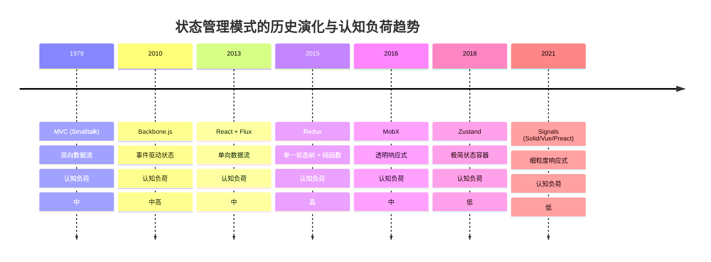
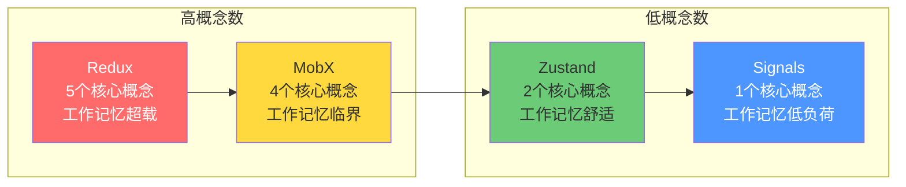
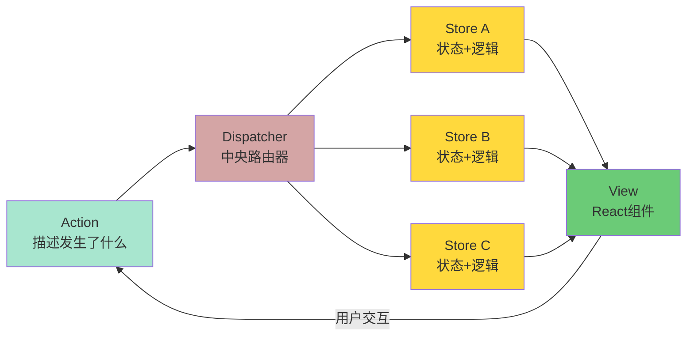
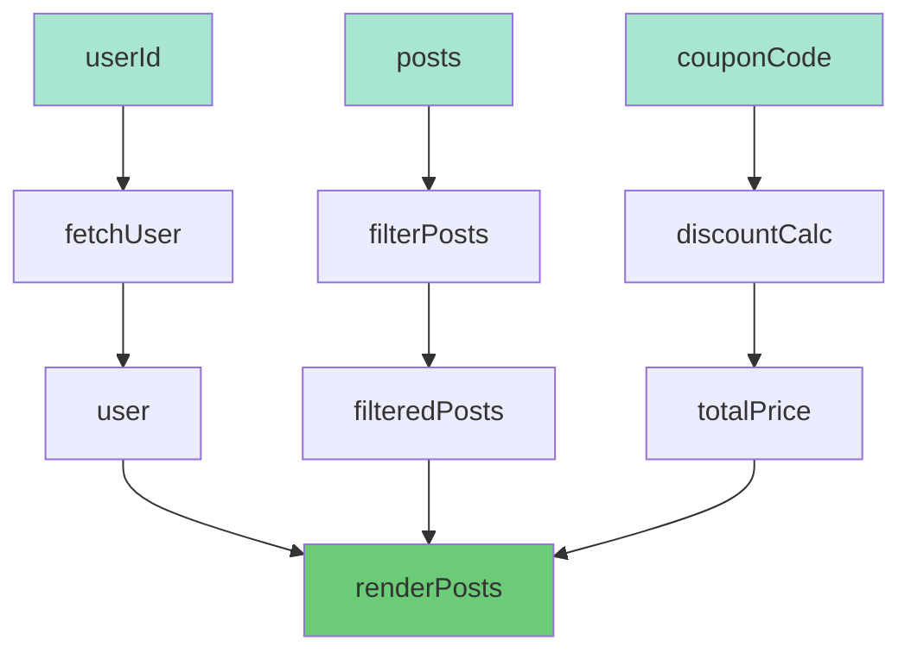

# 数据流与认知轨迹

> **核心命题**：数据流架构不仅是技术选择，它塑造了开发者的心智模型。Redux、MobX、Zustand、Signals 四种模式对应四种不同的认知策略，理解这些策略可以帮助我们选择适合团队心智模型的状态管理方案。

---

## 引言

2015年，Dan Abramov 在 React Europe 会议上演示了 Redux 的"时间旅行调试"——开发者可以在应用运行过程中撤销和重放任意状态变化。这一演示震撼了前端社区，因为它将状态管理从"黑盒"变成了"白盒"。然而，六年后，Redux 团队发布了 Redux Toolkit，承认"Redux 的学习曲线太陡"。同一时间，Zustand 和 Signals 等极简方案迅速崛起。

这一演化的背后，不仅是技术优劣的更替，更是**认知经济学**的重新计算。Redux 要求开发者同时维护 Action 类型、Reducer 逻辑、Selector 函数和中间件链——这五个概念单元恰好达到甚至超过了人类工作记忆的容量上限（Miller, 1956; Cowan, 2001）。Zustand 将概念压缩到"create"和"set"两个单元，认知启动成本大幅降低。

本章将从认知科学、范畴论和工程实践三个维度，建立数据流模式与人类心智模型之间的严格映射。我们将回答：为什么某些状态管理方案"感觉上"更自然？为什么团队规模会影响状态管理选型？以及，如何从认知负荷角度评估一个状态管理方案的适用性？

---

## 理论严格表述

### 工作记忆容量与状态管理概念数

认知心理学家 George Miller 的经典论文《神奇的数字 7±2》揭示了人类工作记忆的有限容量。后续研究（Cowan, 2001）将这一估计修正为 **4±1 个信息组块**（chunks）。这意味着：当开发者需要同时追踪的概念数量超过 4 个时，认知超载就会发生。

不同的状态管理方案对开发者工作记忆提出了不同的要求：

| 状态管理方案 | 核心概念数 | 工作记忆负荷 | 认知风险 |
|-------------|-----------|-------------|---------|
| Redux | 5（Action, Reducer, Store, Selector, Middleware） | 超载 | 概念 juggling |
| MobX | 4（observable, computed, autorun, action） | 临界 | 依赖追踪"魔法" |
| Zustand | 2（create, set） | 舒适 | 过于简单导致遗漏 |
| Signals | 1（signal 原语） | 低 | 需要理解响应式图 |

**关键洞察**：Redux 的五个核心概念恰好超出了工作记忆的安全容量。这解释了为什么 Redux 开发者经常感到"需要在大脑中维护一张全局地图"——他们确实在这么做。

### 认知负荷理论的三重划分

Sweller（1988）的认知负荷理论将学习过程中的认知负荷分为三类：

1. **内在认知负荷**（Intrinsic Load）：任务本身的复杂度。状态之间的依赖关系、时序约束、一致性保证，这些都是状态管理的内在复杂度，不因框架选择而消失。

2. **外在认知负荷**（Extraneous Load）：信息呈现方式带来的额外负担。Redux 的样板代码、MobX 的装饰器语法、Zustand 的极简 API，都是信息呈现方式。Redux 的样板代码显著增加了外在认知负荷——一个简单的计数器需要 20+ 行代码来定义 Action、Action Creator 和 Reducer。

3. **关联认知负荷**（Germane Load）：建立深层理解和图式所需的投入。理解 Redux 的"不可变更新"哲学、理解 MobX 的"透明响应式"原理，都属于关联认知负荷。

**框架选择的认知维度**：好的状态管理框架应该最小化外在认知负荷，为关联认知负荷留出空间，同时不增加内在认知负荷。

### 因果推理与单向数据流

人类大脑天生擅长线性因果推理——"A 导致 B，B 导致 C"。这种能力深植于前额叶皮层（Prefrontal Cortex）的因果推断网络（Friston, 2010）。然而，人类大脑不擅长处理循环因果——"A 影响 B，B 也影响 A"。

单向数据流（如 Flux/Redux）的认知优势在于：它**匹配了人类的线性因果直觉**。数据从 Action 流向 Reducer，再流向 Store，最后到达 View。开发者可以沿着这条链追踪"这个状态为什么变了"。

双向绑定（如早期 AngularJS）则违背了这种直觉。当 View 和 Model 相互同步时，开发者需要同时维护两个方向的因果推理——"View 变化导致 Model 变化"和"Model 变化导致 View 变化"。这在认知上相当于维护两个矛盾的假设，显著增加了工作记忆负担。

### 范畴论视角：数据流作为态射

从范畴论的角度，不同的数据流模式对应不同的范畴结构：

- **Redux 的范畴**：对象 = 状态快照，态射 = Action（状态转换）。这是一个**幺半群范畴**（monoidal category），状态转换通过 Action 的组合形成幺半群结构。
- **MobX 的范畴**：对象 = 响应式对象，态射 = 自动追踪的依赖关系。这是一个**有向图范畴**，对象之间的态射由运行时自动发现。
- **Zustand 的范畴**：对象 = 函数式闭包，态射 = 函数调用。这是一个**集合范畴**的简化版本。
- **Signals 的范畴**：对象 = 细粒度响应式单元，态射 = 显式订阅关系。这是一个**格范畴**（lattice），signal 之间的依赖形成偏序关系。

**核心洞见**：不存在"万能范畴"。选择状态管理方案 = 选择适合你问题结构的范畴。小型应用不需要幺半群范畴的严格性，大型应用则受益于其可预测性。

---

## 工程实践映射

### Redux：命令日志与时间旅行

Redux 将应用状态建模为一个**命令日志**（Command Log）。其核心计算模型可以形式化为：

```typescript
// State(t+1) = Reducer(State(t), Action(t))
// 时间旅行 = 重新执行 Action 序列
// State(t) = foldl(reducer, initialState, actions[0..t])

type State = unknown;
type Action = { type: string; payload?: unknown };
type Reducer<S> = (state: S | undefined, action: Action) => S;

function createStore<S>(reducer: Reducer<S>, initialState?: S) {
  let state = initialState;
  const listeners = new Set<() => void>();
  return {
    getState: () => state!,
    dispatch: (action: Action) => {
      state = reducer(state, action);
      listeners.forEach(l => l());
    },
    subscribe: (listener: () => void) => {
      listeners.add(listener);
      return () => listeners.delete(listener);
    },
  };
}
```

**认知优势**：Redux 的时间旅行调试能力源于其函数式语义。因为状态转换是纯函数，所以可以安全地重放任意 Action 序列。这对于调试复杂的状态问题是一种**认知外包**——开发者不需要在脑中模拟状态变化，调试器可以替他们完成。

**认知代价**：Redux 的样板代码问题。一个简单的计数器需要定义 Action 类型、Action Creator、Reducer 和连接逻辑。这些分离的概念迫使开发者在多个文件之间跳转，增加了注意力切换成本。

### MobX：Excel 表格式的心智模型

MobX 使用**透明响应式编程**（Transparent Reactive Programming）。开发者不需要显式声明依赖，系统自动追踪。

```typescript
// MobX 的简化心智模型
import { observable, computed, autorun, action } from 'mobx';

class Store {
  @observable count = 0;
  @computed get doubled() { return this.count * 2; }
  @action increment() { this.count++; }
}

const store = new Store();
autorun(() => console.log(store.doubled)); // 自动追踪依赖
```

**认知优势**：MobX 的心智模型最接近 **Excel 电子表格**——全球数十亿人熟悉的工具。单元格 = observable，公式 = computed，图表更新 = autorun。任何会用 Excel 的人，都可以在 5 分钟内理解 MobX 的核心概念。

**认知陷阱**：MobX 的"魔法"是隐式的。如果开发者在 computed 中调用非 observable，MobX 不会追踪它——这会产生静默的 bug。条件依赖的动态更新也使心智模型复杂化。

### Zustand：最小主义的认知经济学

Zustand 的设计哲学是**最小认知成本**。核心实现不到 100 行代码：

```typescript
import { create } from 'zustand';

const useStore = create((set) => ({
  count: 0,
  increment: () => set((state) => ({ count: state.count + 1 })),
}));

// 在组件中使用
function Counter() {
  const { count, increment } = useStore();
  return <button onClick={increment}>{count}</button>;
}
```

**认知优势**：Zustand 只需要理解两个概念——`create` 和 `set`。这远低于工作记忆容量上限，开发者可以一次性掌握整个 API。没有 Action、没有 Reducer、没有 Provider、没有 connect。

**局限性**：Zustand 缺少时间旅行调试和自动依赖追踪。对于需要严格审计日志的大型系统，Zustand 的"过于简单"可能成为负担。

### Signals：细粒度响应式的回归

Signals 是前端响应式的"原语"——最小、最细粒度的响应式单元。

```typescript
// Signal 的核心语义
function createSignal<T>(value: T): [() => T, (v: T) => void] {
  const subscribers = new Set<() => void>();
  const read = () => {
    const currentEffect = getCurrentEffect();
    if (currentEffect) subscribers.add(currentEffect);
    return value;
  };
  const write = (newValue: T) => {
    value = newValue;
    subscribers.forEach(effect => effect());
  };
  return [read, write];
}
```

**认知优势**：Signals 是显式的。依赖关系由开发者在代码中明确写出，而非由运行时自动推断。这种显式性降低了"魔法感"，增加了可预测性。

**历史脉络**：Signals 不是新发明。1970 年代的 VisiCalc 电子表格已经有了 signal 的雏形；2000 年代的 Knockout.js 使用 observable；2020 年代的 Solid/Vue Signals 回归了显式 model，但加上了编译时优化。

### 单向 vs 双向绑定的形式化对比

```
单向绑定：
  View = f(Model)
  Model 变化 → View 自动更新
  View 不直接修改 Model

双向绑定：
  View = f(Model)
  Model = g(View)
  View 和 Model 相互同步
```

**范畴论视角**：单向绑定 = 态射（有方向）；双向绑定 = 同构（双向映射）。单向绑定更简单，因为只有一个方向需要理解；双向绑定更强大，但需要处理循环更新问题。

**工程选择**：

| 场景 | 推荐 | 理由 |
|------|------|------|
| 表单输入 | 双向绑定 | 输入框与状态自然同步 |
| 复杂应用状态 | 单向绑定 | 变化来源可追踪 |
| 实时协作 | CRDT/单向 | 冲突解决明确 |
| 简单计数器 | 都可以 | 复杂度低 |

---

## Mermaid 图表

### 图表 1：状态管理模式的认知演化时间线



### 图表 2：四种状态管理方案的认知负荷对比拓扑



### 图表 3：Flux 单向数据流的有向图模型



### 图表 4：数据流作为有向无环图的认知优势



---

## 理论要点总结

本章从认知科学和范畴论两个视角，对前端状态管理模式进行了系统性分析。以下是五个核心结论：

**1. 工作记忆容量是状态管理选型的硬性约束**

人类工作记忆的容量约为 4±1 个组块（Cowan, 2001）。Redux 的 5 个核心概念（Action, Reducer, Store, Selector, Middleware）恰好处于或超出了这一上限，这解释了为什么 Redux 的学习曲线如此陡峭。Zustand 的 2 个概念和 Signals 的 1 个概念则处于舒适区内。

**2. 单向数据流匹配人类的线性因果直觉**

人类大脑的前额叶皮层擅长处理"A 导致 B"的线性因果链（Friston, 2010），不擅长处理"A 和 B 相互影响"的循环因果。Flux/Redux 的单向数据流通过消除循环依赖，降低了因果推理的认知负荷。

**3. 状态管理的演化方向是"用更少的认知成本表达相同的状态逻辑"**

从 MVC → Flux → Redux → MobX → Zustand → Signals，每一代框架都在尝试降低外在认知负荷。这个趋势不会停止，因为人类认知系统的生物学限制是固定的。

**4. 没有"最好"的状态管理方案，只有"最适合当前心智模型"的方案**

从范畴论的角度，不同的状态管理方案对应不同的范畴结构。Redux 对应幺半群范畴，MobX 对应有向图范畴，Zustand 对应集合范畴，Signals 对应格范畴。不存在万能范畴——选择方案 = 选择适合问题结构的范畴。

**5. 团队规模与文化影响状态管理选型**

小型团队（1-3 人）适合 Zustand/Signals（低认知启动成本）；中型团队（4-10 人）适合 MobX/Zustand（平衡速度与可维护性）；大型团队（10+ 人）适合 Redux/Signals（明确的数据流便于协作）。团队的技术文化（函数式 vs 面向对象）也会影响选择。

---

## 参考资源

### 学术论文与经典著作

1. **Miller, G. A. (1956).** "The Magical Number Seven, Plus or Minus Two: Some Limits on Our Capacity for Processing Information." *Psychological Review*, 63(2), 81-97. —— 工作记忆容量的经典研究，揭示了人类信息处理的基本限制。

2. **Sweller, J. (1988).** "Cognitive Load During Problem Solving: Effects on Learning." *Cognitive Science*, 12(2), 257-285. —— 认知负荷理论的奠基论文，为评估不同状态管理方案的认知成本提供了量化框架。

3. **Cowan, N. (2001).** "The Magical Number 4 in Short-Term Memory: A Reconsideration of Mental Storage Capacity." *Behavioral and Brain Sciences*, 24(1), 87-114. —— 将 Miller 的 7±2 修正为 4±1，更精确地解释了为什么 Redux 的 5 个核心概念会导致认知超载。

4. **Friston, K. (2010).** "The Free-Energy Principle: A Unified Brain Theory?" *Nature Reviews Neuroscience*, 11(2), 127-138. —— 从自由能原理角度解释人类大脑的因果推理机制，为单向数据流的认知优势提供了神经科学基础。

5. **Kahneman, D. (2011).** *Thinking, Fast and Slow*. Farrar, Straus and Giroux. —— 系统 1（直觉）与系统 2（分析）的双系统理论，解释了为什么 MobX 的"Excel 式直觉"对新手更友好。

### 技术文档与行业资源

- [Redux Documentation](https://redux.js.org) —— 官方文档，包含 Three Principles 和核心概念说明。
- [MobX Documentation](https://mobx.js.org) —— 透明响应式编程的权威参考。
- [Zustand GitHub](https://github.com/pmndrs/zustand) —— 极简状态管理的实现参考。
- [SolidJS Signals](https://solidjs.com) —— 细粒度响应式的现代实现。
- [TC39 Signals Proposal](https://github.com/tc39/proposal-signals) —— Signals 标准化的最新进展。
