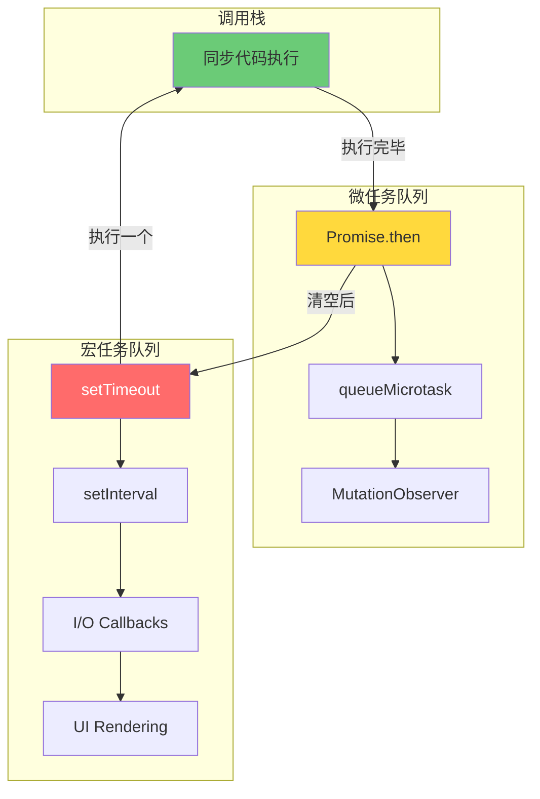
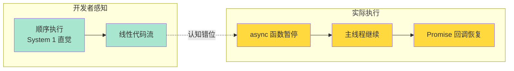
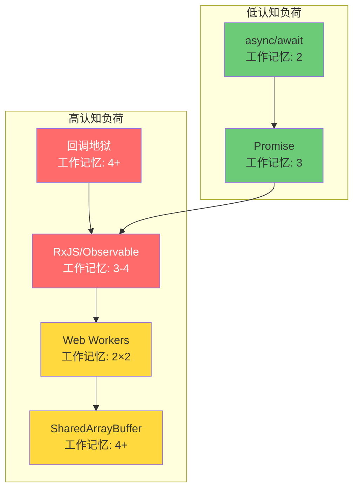
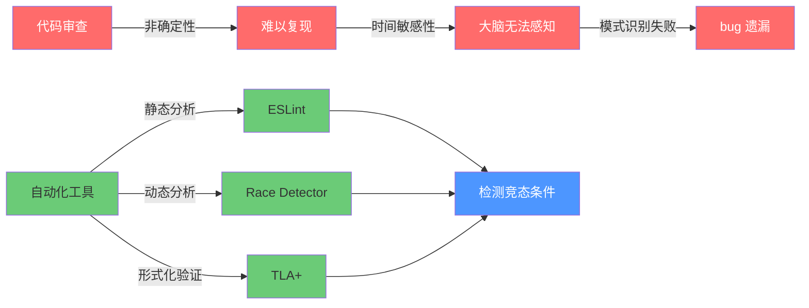

# 异步与并发认知模型

> **核心命题**：人类大脑天生是单线程的。当我们用单线程的大脑去模拟多线程系统的行为时，认知超载是不可避免的。Event Loop 模型之所以成功，不是因为它在技术上最优，而是因为它最符合人类的认知限制。

---

## 引言

想象你在厨房做饭：锅里的水正在烧开，烤箱里的蛋糕需要 30 分钟后取出，你需要切蔬菜准备沙拉，同时接听一个电话。你可以在这些任务之间**切换**，但你不能真正**同时**执行它们。你的注意力是一个单线程的 Event Loop——切菜时你暂时忘记了水，接电话时你暂停了切菜。

这就是人类大脑处理并发的真实方式。**我们天生是单线程的。**

计算机可以同时执行多个任务（多核 CPU），但人类不能。当我们写并发代码时，我们实际上是在用一个单线程的大脑去模拟多线程系统的行为——这本质上就是**认知超载**（Cognitive Overload）。

JavaScript 的 Event Loop 模型之所以被全球数百万开发者接受，不是因为它在并发理论上最先进，而是因为它**隐藏了并发**。开发者看到的是顺序执行的代码，而并发通过任务队列异步实现。这种"伪顺序性"恰好匹配了人类的序列化认知偏好。

本章将从认知科学、神经科学和编程语言理论三个维度，分析异步与并发模型如何与人类认知系统交互。我们将回答：为什么人类不擅长思考并发？为什么 async/await 比 Promise 更容易理解？以及，如何设计低认知负荷的并发系统？

---

## 理论严格表述

### 序列化偏见（Seriality Bias）

人类思维天然是**序列化**的。我们习惯于"先做这个，再做那个"的线性叙事。这源于工作记忆的限制——我们无法同时保持多个独立执行线索。

向 100 名开发者询问以下代码的输出顺序：

```javascript
console.log('A');
setTimeout(() => console.log('B'), 0);
console.log('C');
```

约 30% 的新手会回答 "A, B, C"。为什么？因为他们的大脑自动将代码序列化：

```
错误的心智模型：
  打印 A → 等待 0ms → 打印 B → 打印 C

正确的心智模型：
  打印 A → 将 B 放入任务队列 → 打印 C
  → （当前代码执行完毕）→ 从队列取 B → 打印 B
```

**认知分析**：序列化偏见使大脑忽略了"任务队列"这一间接层。大脑将 `setTimeout(fn, 0)` 错误建模为"立即执行 fn"。实际上，即使延迟为 0，fn 也必须等待当前执行栈清空。这是人类工作记忆容量限制的直接后果——我们无法同时维护"当前执行栈"和"任务队列"两个独立的心理模型。

### 工作记忆的并发瓶颈

Baddeley（2007）的工作记忆模型包含四个子系统：语音环路、视觉空间画板、情景缓冲器和中央执行系统。中央执行系统负责注意力控制和任务切换，但其容量极其有限。

假设你需要理解以下代码中 `x` 的最终值：

```javascript
let x = 0;

async function taskA() {
  x = x + 1;
  await delay(10);
  x = x * 2;
}

async function taskB() {
  x = x + 2;
  await delay(5);
  x = x - 1;
}

taskA();
taskB();
```

要正确推理，你需要同时追踪：

1. taskA 的执行状态（第几行、x 的值）
2. taskB 的执行状态（第几行、x 的值）
3. Event Loop 的任务队列状态
4. delay 的定时器状态

这是 4 个独立线索——**恰好达到工作记忆的容量上限**（Cowan, 2001）。任何额外的复杂度（如第三个任务、条件分支）都会超出认知负荷。

### "他心问题"与状态模拟

**他心问题**（Theory of Mind）是心理学概念：理解"他人有不同的知识、信念和意图"。研究表明，大多数人最多能处理 **2 层嵌套的他心推理**（"我认为他认为我知道..."）。

在多线程编程中，开发者需要"模拟"其他线程的思维状态：

```javascript
// 线程 A
sharedCounter++;

// 线程 B
sharedCounter++;
```

要理解这段代码，你必须同时模拟：

- 线程 A 的视角："我看到 counter 的值，加 1，写回"
- 线程 B 的视角："我看到 counter 的值，加 1，写回"
- 关键洞察：两个线程可能在"看到"和"写回"之间交错执行

但人类大脑不擅长这种"嵌套视角"。并发代码可能需要 3-4 层他心推理，远超大多数人的认知能力。

### 时间感知与前额叶皮层

人类对时间的感知不是客观的，而是由**前额叶皮层**和**基底神经节**共同建构的（Wittmann, 2013）。关键发现包括：

- **时间知觉的可塑性**：当注意力高度集中时，主观时间流逝变慢；当无聊或焦虑时，主观时间流逝加速。
- **预期违背效应**：当预期事件未按时发生时，前额叶会触发**错误相关负波（ERN）**。

这解释了为什么竞态条件如此难以检测：竞态条件的结果依赖于微秒级的时间差异，而人类大脑的时间感知精度在百毫秒级别。我们根本无法"感觉"到竞态条件的存在。

---

## 工程实践映射

### Event Loop："一次只做一件事"的认知匹配

JavaScript 的 Event Loop 模型有一个巨大的认知优势：**它在任何时刻只执行一个任务**。

```javascript
// Event Loop 心智模型（符合人类直觉）
while (queue.hasTasks()) {
  const task = queue.dequeue();
  execute(task); // 执行到完成，不被中断
}
```

这与人类的"一次只做一件事"直觉完美匹配。没有真正的并行执行，没有上下文切换的混乱，开发者可以"一步步"追踪执行流程。

**精确类比：银行排队**

| 概念 | 银行排队 | Event Loop |
|------|---------|-----------|
| 任务 | 客户办理业务 | JavaScript 代码执行 |
| 队列 | 取号排队 | 宏任务队列 |
| 柜员 | 银行柜员 | JS 引擎主线程 |
| VIP 通道 | 快速业务窗口 | 微任务队列 |
| 叫号系统 | 广播下一位 | 从队列取任务 |

类比的局限：像银行一样，Event Loop 保证"一个柜员一次服务一个客户"。但不像银行，Event Loop 的"客户"可能创造新的"客户"（任务创建新任务）。

### async/await 的"伪同步"错觉

async/await 是 JavaScript 历史上最重要的语法糖之一。它将 Promise 的链式调用转换为类似同步代码的结构：

```javascript
// Promise 版本（显式异步）
fetchUser(id)
  .then(user => fetchOrders(user.id))
  .then(orders => console.log(orders));

// async/await 版本（伪同步）
const user = await fetchUser(id);
const orders = await fetchOrders(user.id);
console.log(orders);
```

**认知影响**：

- ✅ 降低了外在认知负荷（代码更易读）
- ❌ 创造了"同步执行"的错误直觉

**为什么 async/await 比 Promise 更容易理解？**

| 维度 | Promise | async/await |
|------|---------|-------------|
| 语法结构 | 链式调用 | 线性代码 |
| 错误处理 | `.catch()` 链 | `try/catch`（熟悉）|
| 条件分支 | 嵌套 Promise | 常规 if/else |
| 调试体验 | 堆栈跟踪困难 | 堆栈跟踪清晰 |

眼动追踪研究表明：阅读回调风格代码时，眼球跳跃频繁，回退次数多；阅读 async/await 时，眼球运动最线性，回退最少。这说明 async/await 确实降低了认知负荷。

**常见陷阱：并行 vs 串行的混淆**

```javascript
// 串行执行（新手常见错误）
async function fetchAllUsers(ids) {
  const users = [];
  for (const id of ids) {
    const user = await fetchUser(id); // 每次等待！
    users.push(user);
  }
  return users;
}

// 并行执行（正确方式）
async function fetchAllUsersParallel(ids) {
  const promises = ids.map(id => fetchUser(id));
  return await Promise.all(promises);
}
```

新手容易犯错，因为 `await` 的语法看起来是"等待这一行完成再继续"，直觉上认为循环会逐个执行。但实际上，`await` 只阻塞当前 async 函数，不阻塞其他代码。

### 竞态条件的认知检测困难

竞态条件有三个特征，每个都针对人类认知的弱点：

**特征 1：非确定性**

竞态条件的结果依赖于精确的执行时序。人类大脑习惯于确定性因果——"我做了 X，所以发生了 Y"。非确定性违背了这种直觉。

**特征 2：时间敏感性**

竞态条件只在特定的时间窗口出现。人类大脑不擅长追踪微秒级的时间差异。

```javascript
let balance = 100;

async function withdraw(amount) {
  const current = balance;    // t0: 读取 100
  await delay(1);             // t1: 其他代码执行
  balance = current - amount; // t2: 写回（可能基于过期的值）
}

withdraw(30);
withdraw(40);
// 实际可能：balance = 60 或 70（取决于交错）
```

**特征 3：难以复现**

竞态条件可能在 1000 次执行中出现 1 次。人类大脑依赖模式识别来学习——如果错误很少出现，大脑无法形成有效的检测模式。

**检测工具与认知辅助**：

| 工具 | 方法 | 检测能力 |
|------|------|---------|
| ESLint (require-atomic-updates) | 静态分析 | 常见模式 |
| TypeScript (strict) | 类型系统 | 部分数据竞争 |
| Race Detector (Chrome DevTools) | 动态分析 | 运行时竞争 |
| TLA+ | 模型检测 | 所有可能的交错 |

**关键建议**：不要依赖人类审查来检测竞态条件。使用自动化工具是必然的。

### 宏任务与微任务的认知差异

```javascript
console.log('1');
setTimeout(() => console.log('2'), 0);
Promise.resolve().then(() => console.log('3'));
console.log('4');
// 输出：1, 4, 3, 2
```

新手的典型错误：认为 `setTimeout(fn, 0)` 和 `Promise.then(fn)` 都"尽快执行"，所以顺序不确定。

**正确的心智模型**：

```
Event Loop 执行流程：
1. 执行当前调用栈（同步代码）→ 输出 1, 4
2. 清空微任务队列（microtask queue）→ 输出 3
3. 执行一个宏任务（macrotask）→ setTimeout 回调 → 输出 2
```

**精确类比：医院急诊分诊**

| 概念 | 医院分诊 | Event Loop |
|------|---------|-----------|
| 同步代码 | 正在手术室进行的手术 | 当前调用栈 |
| 微任务 | 刚从手术室出来需要观察的患者 | Promise.then、MutationObserver |
| 宏任务 | 在候诊室等待的普通患者 | setTimeout、setInterval、I/O |
| 执行顺序 | 先观察术后患者，再叫下一个候诊患者 | 先清空微任务，再执行宏任务 |

**微任务饥饿的认知陷阱**：

```javascript
function starveMacrotasks() {
  Promise.resolve().then(() => {
    console.log('microtask');
    starveMacrotasks();
  });
}
setTimeout(() => console.log('macrotask never runs'), 0);
starveMacrotasks();
```

开发者直觉上认为 `setTimeout` 和 `Promise.then` 都是"异步"，应该有公平竞争的机会。实际上微任务的优先级远高于宏任务——这不是"公平排队"，而是"VIP 插队"。这种不对称性违背了人类对"队列"的公平性直觉。

### 并发抽象的认知金字塔

```
认知负荷金字塔（从低到高）：

Level 1: async/await（伪同步）
  ↓ 开发者看到"顺序执行"

Level 2: Promise（显式异步）
  ↓ 开发者需要理解"链式调用"

Level 3: 回调函数（显式控制反转）
  ↓ 开发者需要理解"完成后调用我"

Level 4: 事件监听（发布-订阅）
  ↓ 开发者需要追踪"谁监听谁"

Level 5: 原始异步原语（setTimeout/XMLHttpRequest）
  ↓ 开发者需要手动管理所有状态
```

**设计建议**：尽量让代码停留在金字塔的低层。每一层的跃迁都意味着认知负荷的显著增加。

---

## Mermaid 图表

### 图表 1：Event Loop 双层队列的认知模型



### 图表 2：async/await 伪同步错觉的神经机制



### 图表 3：并发模型的认知负荷对比



### 图表 4：竞态条件的检测困难模型



---

## 理论要点总结

本章从认知科学和编程语言理论两个视角，对异步与并发模型进行了系统性分析。以下是五个核心结论：

**1. 人类大脑天生是单线程的，并发编程本质是认知超载**

人类工作记忆容量约为 4±1 个组块（Cowan, 2001），而并发代码要求同时追踪多个执行线索、共享状态和时序关系。当这些变量同时出现时，认知超载几乎不可避免。

**2. Event Loop 的成功源于它匹配了人类的序列化认知偏好**

JavaScript 的 Event Loop 在任何时刻只执行一个任务，这与人类"一次只做一件事"的直觉完美匹配。它通过"隐藏并发"降低了认知负荷——开发者看到的是顺序代码，而并发通过任务队列异步实现。

**3. async/await 的认知优势有科学依据**

眼动追踪研究表明，阅读 async/await 代码时眼球运动最线性、回退最少。fMRI 研究发现，阅读深层嵌套回调时背外侧前额叶皮层（DLPFC）活跃度显著升高——这是工作记忆负荷增加的神经证据。async/await 匹配了人类大脑的"序列处理"偏好。

**4. 竞态条件难以被人类检测，必须依赖自动化工具**

竞态条件的非确定性、时间敏感性和低复现率，恰好针对了人类认知的三个弱点：确定性因果偏好、百毫秒级时间感知精度和模式识别学习机制。不要依赖人类审查来检测竞态条件——ESLint、Race Detector 和 TLA+ 等工具是必要的认知外包。

**5. 设计低认知负荷并发系统的五大原则**

- **避免共享可变状态**：不可变数据消除了"谁在什么时候修改了什么"的追踪负担。
- **使用声明式而非命令式**：`Promise.all` 比手动管理并发线索更易于理解。
- **限制并发范围**：局部并发比全局并发更容易推理。
- **提供确定性保证**：明确的执行顺序减少了心理模拟的负担。
- **显式标记并发边界**：让异步代码"看起来"是异步的，避免伪同步错觉。

---

## 参考资源

### 学术论文与经典著作

1. **Baddeley, A. (2007).** *Working Memory, Thought, and Action*. Oxford University Press. —— 工作记忆模型的权威综述，为理解并发编程的认知瓶颈提供了基础框架。

2. **Kahneman, D. (2011).** *Thinking, Fast and Slow*. Farrar, Straus and Giroux. —— 系统 1（直觉）与系统 2（分析）的双系统理论，解释了为什么 async/await 的直觉匹配如此重要。

3. **Cowan, N. (2001).** "The Magical Number 4 in Short-Term Memory: A Reconsideration of Mental Storage Capacity." *Behavioral and Brain Sciences*, 24(1), 87-114. —— 将工作记忆容量修正为 4±1，精确解释了并发代码为何超出认知能力。

4. **Lee, E. A. (2006).** "The Problem with Threads." *Computer*, 39(5), 33-42. —— 从计算机科学角度论证线程模型的根本缺陷，与认知科学的结论相互印证。

5. **Milner, R. (1989).** *Communication and Concurrency*. Prentice Hall. —— 并发理论的形式化基础，为理解不同并发模型的表达能力提供了数学工具。

### 技术文档与行业资源

- [JavaScript Event Loop Explained](https://developer.mozilla.org/en-US/docs/Web/JavaScript/Event_loop) —— MDN 对 Event Loop 的权威解释。
- [Promise A+ Specification](https://promisesaplus.com) —— Promise 的行为规范。
- [Async Functions Proposal](https://github.com/tc39/ecmascript-asyncawait) —— async/await 进入 ECMAScript 的提案文档。
- [Chrome DevTools Performance](https://developer.chrome.com/docs/devtools/performance) —— 可视化 Event Loop 和任务队列的工具。
- [TLA+ Video Course](https://lamport.azurewebsites.net/video/videos.html) —— Leslie Lamport 的形式化验证教程，用于检测竞态条件。
