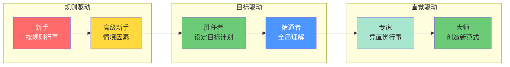
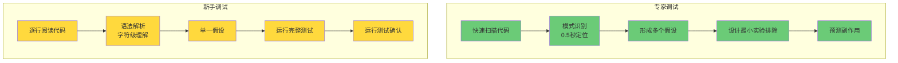
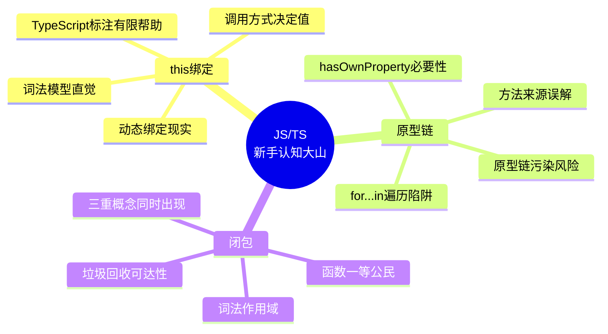
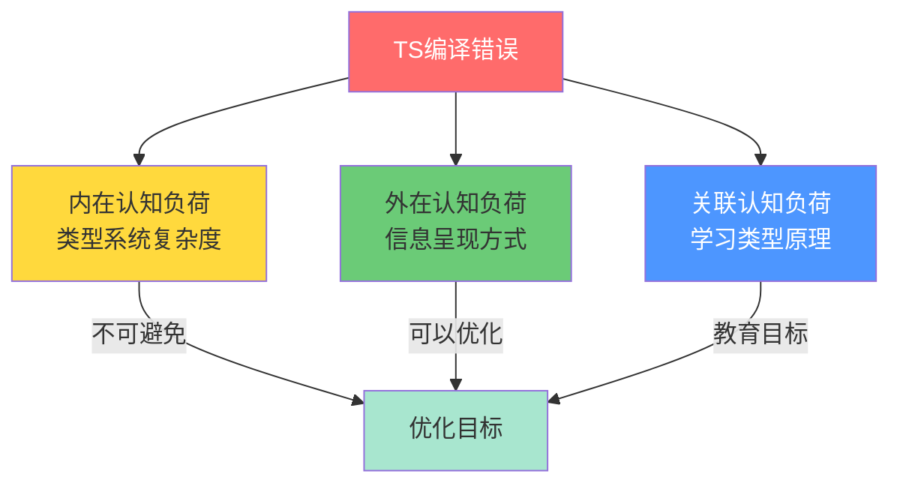

# 专家与新手在JS/TS中的差异

> **核心命题**：专家和新手看到的不是同一段代码。专家看到的是意图和结构，新手看到的是字符序列。这种差异不是简单的"经验多少"，而是认知表征的根本不同——理解这一点，是设计更好的工具、错误信息和教学路径的前提。

---

## 引言

把一段包含闭包、原型链查找和异步回调的 JavaScript 代码同时展示给一个 5 年经验的工程师和一个刚学完变量声明的新手，他们"看到"的东西截然不同。

新手看到的是一个**字符序列**：字母、括号、分号、等号。他们需要逐字符地解析语法，就像学习外语时逐词查字典。

专家看到的是**意图和结构**："这是一个防抖函数，它用闭包保存了计时器引用，返回的函数在延迟后执行回调。如果计时器存在，先清除它。" 专家在几百毫秒内就完成了模式识别，不需要逐行分析。

这种差异不是简单的"经验多少"，而是**认知表征（Cognitive Representation）**的根本不同。专家的大脑已经把常见的代码模式编码为了**组块（Chunks）**——国际象棋大师能一眼看出棋局的"势"，而不需要逐个计算每个棋子的走法（de Groot, 1946; Chase & Simon, 1973）。编程专家同样如此。

理解专家-新手差异的工程意义在于：**如果我们知道新手在哪里卡壳，就能设计更好的工具、更好的错误信息、更好的教学路径。** TypeScript 的错误信息改进、IDE 的智能提示、Lint 规则的渐进式引入，本质上都是在缩小专家和新手的认知差距。

本章将基于 Dreyfus 技能获取模型、模式识别理论和认知负荷理论，系统分析 JS/TS 开发者在不同技能阶段的认知特征，并为团队建设和教学设计提供科学依据。

---

## 理论严格表述

### Dreyfus 技能获取模型的六阶段

Dreyfus 兄弟在 1980 年代提出的技能获取模型，将技能发展划分为六个阶段（Dreyfus & Dreyfus, 1986）。这个模型在编程教育中被广泛应用，因为它精确描述了开发者从"按规则行事"到"直觉驱动"的演进过程。

**阶段 1：新手（Novice）**

新手需要**明确的规则**。他们不理解规则背后的原理，只是机械地遵循。

> 典型行为："老师说 React 组件必须以大写字母开头，所以我就把所有组件名首字母大写。为什么？不知道，规则就是这样。"

在 JS/TS 中，新手的特征包括：需要记忆 `let` 和 `const` 的区别规则但不理解块级作用域；看到 `this` 就把它等同于"当前对象"，不理解动态绑定；类型注解对他们来说是"额外的负担"而非"安全的保障"。

**阶段 2：高级新手（Advanced Beginner）**

高级新手开始识别**情境因素**。他们能在简单场景下脱离规则手册，但复杂场景下仍然需要指导。

> 典型行为："我知道 `async/await` 可以让异步代码看起来像同步的。但如果在 `forEach` 里用 `await`，为什么不会按顺序执行？"

**阶段 3：胜任者（Competent）**

胜任者能够**设定目标、制定计划、选择策略**。他们有了全局观，能理解不同方案之间的权衡。

> 典型行为："这个需求可以用 Redux 或 Context 实现。Redux 会增加样板代码，但更适合团队规模扩大后的调试。考虑到我们团队有 15 个人，我选 Redux。"

**阶段 4：精通者（Proficient）**

精通者能够**全局性理解情境**，不再只关注单个问题，而是能看到问题在整个系统中的位置。他们开始依赖直觉，但仍能回退到分析模式。

> 典型行为："这个性能问题表面上是渲染慢，但根本原因是状态更新触发了大量不必要的重计算。我需要重构 selector 层，而不是加 memo。"

**阶段 5：专家（Expert）**

专家**凭直觉行事**。他们看到问题的瞬间就知道解决方案，不需要有意识地分析。当直觉出错时，他们能快速切换到分析模式。

> 典型行为："这段代码有问题。"（三秒钟后）"哦，是闭包捕获了循环变量。改成 `let` 或者用 IIFE。"

**阶段 6：大师（Master）**

大师不仅能凭直觉解决问题，还能**超越规则**，创造新的范式。

> 典型行为：Brendan Eich 设计 JavaScript，Anders Hejlsberg 设计 TypeScript。

### 各阶段的认知特征对称差

| 维度 | 新手 (Novice) | 高级新手 (Advanced) | 胜任者 (Competent) | 精通者 (Proficient) | 专家 (Expert) |
|------|--------------|-------------------|------------------|-------------------|--------------|
| 规则依赖 | 严格遵循 | 开始理解例外 | 能评估权衡 | 直觉主导 | 创造规则 |
| 错误处理 | 卡住需帮助 | 尝试常见修复 | 系统性调试 | 快速定位根因 | 预防错误 |
| 认知焦点 | "这行代码做什么？" | "这个函数解决什么问题？" | "6个月后还能理解吗？" | "系统的涟漪效应？" | "系统的本质是什么？" |
| 代码阅读 | 逐行解析 | 识别简单模式 | 按语义分组 | 整体图式识别 | 瞬间意图感知 |
| 调试策略 | 无系统 | 试错法 | 假设-验证-排除 | 假设驱动 | 直觉-验证 |

**核心差异**：新手关注**语法**，高级新手开始关注**语义**，胜任者有了**时间维度**的意识，精通者有了**系统性视角**，专家达到了"无意识能力"（Unconscious Competence）。

### 专家的模式识别机制

专家调试时的一个显著特征是：**他们很少逐行阅读代码。** 相反，他们快速扫描，寻找"不对劲"的模式。

这种能力与国际象棋大师的研究结果一致。de Groot (1946) 和 Chase & Simon (1973) 的经典研究发现，大师能在看一个棋局 5 秒后重现几乎所有棋子的位置，而新手只能记住 4-5 个棋子。关键在于：大师不是逐个记忆棋子，而是记忆**模式**——他们识别的不是"白马在 f3"，而是"这是一个法兰西防御的变体"。

编程专家同样如此。他们不是逐字符解析代码，而是识别**代码模式**：

```typescript
// 专家扫视这段代码，0.5 秒内识别出"回调地狱"模式
fetchUser(userId, (user) => {
  fetchOrders(user.id, (orders) => {
    fetchItems(orders[0].id, (items) => {
      fetchDetails(items[0].id, (details) => {
        console.log(details);
      });
    });
  });
});
```

新手可能需要 2 分钟才能理解这段代码的逻辑。专家在第一眼就知道："这是回调地狱，需要 Promise 链或 async/await 重构。"

### TypeScript 错误信息的认知可理解性

TypeScript 的错误信息是出了名的冗长和晦涩。从认知科学角度看，这个问题涉及**认知负荷的三个维度**：

1. **内在认知负荷**：类型系统本身的复杂度。不可避免。
2. **外在认知负荷**：错误信息的呈现方式。可以优化。
3. **关联认知负荷**：从错误中学习类型系统原理。目标。

TypeScript 的错误信息在外在认知负荷上做得不够好。它把类型推导的**中间过程**暴露给了用户，而用户通常只关心**最终结论**。

**与 Rust 和 Go 的对比**：

| 维度 | TypeScript | Rust | Go |
|------|-----------|------|-----|
| 错误长度 | 极长 | 中等 | 极简 |
| 建议质量 | 偶尔有 | 极高 | 无 |
| 认知负荷来源 | 类型推导中间结果 | 所有权和生命周期 | 简单规则违反 |

Rust 的错误信息像**耐心的导师**，告诉你哪里错了、为什么错、怎么改。Go 的错误信息像**极简的指示牌**，只告诉你方向。TypeScript 的错误信息像**全自动诊断系统**，输出了所有异常指标，但没有给出诊断结论。

---

## 工程实践映射

### 新手三座认知大山：this、原型链、闭包

JavaScript 有三个特性让新手反复跌倒。这三个问题不是语法问题，而是**心智模型问题**。

**`this` 绑定的认知陷阱**

新手对 `this` 的直觉是："`this` 指向当前对象。" 但 JavaScript 的 `this` 是**动态绑定**的，它的值取决于函数的调用方式，而非定义位置。

```javascript
const obj = {
  name: 'Alice',
  greet() {
    console.log(`Hello, ${this.name}`);
  }
};

obj.greet(); // "Hello, Alice"
const greet = obj.greet;
greet(); // "Hello, undefined" —— 新手崩溃的地方
```

新手的认知模型是**词法模型**：`this` 应该和变量一样，在定义时绑定。但 JavaScript 的 `this` 是**动态模型**：它在调用时绑定。这种心智模型错位是 `this` 问题的根本来源。

**原型链的认知陷阱**

新手看到 `obj.toString()` 时，直觉是：`obj` 自己有一个 `toString` 方法。他们不理解**原型链查找**——`toString` 实际上在 `Object.prototype` 上。

这导致两个常见错误：原型链污染和 `hasOwnProperty` 的误用。

```javascript
// 新手认为这是在"增强"对象
Array.prototype.last = function() {
  return this[this.length - 1];
};
// 但实际上，这影响了所有数组！
const arr = [1, 2, 3];
for (const key in arr) {
  console.log(key); // 输出 "0", "1", "2", "last"！
}
```

**闭包的认知陷阱**

新手的典型困惑："函数执行完了，局部变量不是应该被垃圾回收吗？为什么还能访问？"

```javascript
function createCounter() {
  let count = 0;
  return {
    increment: () => ++count,
    getValue: () => count
  };
}
const counter = createCounter();
console.log(counter.increment()); // 1
console.log(counter.increment()); // 2
```

理解闭包需要同时掌握三个概念：函数是一等公民、词法作用域、垃圾回收的可达性分析。这三个概念对新手来说都是新的，同时出现就造成了**认知超载**。

### 动态类型 vs 静态类型思维

从 JavaScript 转向 TypeScript 的开发者，通常会经历一个**认知冲突期**。他们习惯了"写代码 → 刷新浏览器 → 看控制台"的循环，现在多了一个"写代码 → 看 TS 报错 → 修复类型 → 刷新浏览器"的步骤。

| 维度 | 动态类型思维 (JS) | 静态类型思维 (TS) |
|------|------------------|------------------|
| 错误发现时机 | 运行时 | 编译时 |
| 代码编写速度 | 快 | 慢 |
| 重构信心 | 低 | 高 |
| 心智模型 | "运行一下看看" | "类型先对了吗？" |
| 对 `any` 的态度 | "方便的工具" | "危险的逃逸出口" |

**核心差异**：动态类型思维是**实验性的**——写代码、运行、看结果、调整。静态类型思维是**证明性的**——先确保证明代码是类型正确的，再运行验证语义。

**直觉类比**：动态类型像日常口语——灵活、快速、但需要共享上下文。静态类型像法律文书——精确、无歧义、写起来慢，但任何人都能准确理解。

### TypeScript 引导正确认知模型的正例

```typescript
// 1. 用字面量类型替代魔术字符串
type Status = 'idle' | 'loading' | 'success' | 'error';

function handleStatus(status: Status) {
  switch (status) {
    case 'idle': break;
    case 'loading': break;
    case 'success': break;
    case 'error': break;
    default:
      const _exhaustive: never = status;
  }
}

// 2. 用 branded type 区分语义相同但用途不同的类型
type UserId = string & { __brand: 'UserId' };
type OrderId = string & { __brand: 'OrderId' };

function getUser(id: UserId) { /* ... */ }
function getOrder(id: OrderId) { /* ... */ }

// 编译时防止混淆
getUser('123' as OrderId); // 报错！

// 3. 用严格空检查教育防御性编程
function greet(name: string | null) {
  console.log(name.toUpperCase()); // TS 报错：name 可能为 null
  if (name !== null) {
    console.log(name.toUpperCase()); // 合法：类型收窄
  }
}
```

### 教学中常见的认知陷阱

**陷阱 1："先学 JS，再学 TS"**

这个策略的问题是：学习者在 JS 阶段形成了**动态类型心智模型**，然后需要在 TS 阶段**重构**这个模型。重构比从零建立更难。

**更好策略**：从第一天就引入类型，但用极其简单的类型。让学习者习惯"先想类型，再写实现"的思维模式。

**陷阱 2：用抽象概念解释抽象概念**

```typescript
// 反模式：用复杂类型教泛型
type ExtractReturnType<T> = T extends (...args: any[]) => infer R ? R : never;
```

一个连函数返回值是什么都还不清楚的新手，不可能理解这个类型构造。

**陷阱 3：忽视错误信息教育**

大多数教程只展示正确的代码，从不展示错误和如何修复。这导致学习者在独立编码时，面对红色波浪线手足无措。

**更好策略**：专门设置"错误诊所"环节，展示常见错误、解释错误信息的含义、演示修复步骤。

**陷阱 4：过度强调"最佳实践"**

"永远不要用 `any`"、"永远不要禁用规则"——这些绝对化的规则对新手是认知负担。他们还没有足够的判断力来理解为什么这些规则存在。

**更好策略**：解释规则背后的原理，展示违反规则的后果，让学习者理解"这不是 arbitrary 的限制，而是有原因的约束"。

### 渐进式复杂度释放

一个有效的教学策略是**渐进式复杂度释放（Progressive Complexity Disclosure）**：先展示最简单、最直观的版本，然后逐步引入复杂性。

以教授 TypeScript 泛型为例：

**步骤 1：展示问题**

```typescript
function identityNumber(arg: number): number { return arg; }
function identityString(arg: string): string { return arg; }
```

**步骤 2：引入泛型解决重复**

```typescript
function identity<T>(arg: T): T { return arg; }
```

**步骤 3：展示约束**

```typescript
function logLength<T extends { length: number }>(arg: T) {
  console.log(arg.length);
}
```

**步骤 4：展示实际应用**

```typescript
async function fetchData<T>(url: string): Promise<T> {
  const response = await fetch(url);
  return response.json();
}
const user = await fetchData<User>('/api/user');
```

每一步只引入一个**最小的新概念**，并在学习者掌握后才进入下一步。

---

## Mermaid 图表

### 图表 1：Dreyfus 技能获取模型的六阶段演进



### 图表 2：专家 vs 新手的调试策略差异



### 图表 3：JS/TS 三座认知大山的知识结构



### 图表 4：TypeScript 错误信息的认知负荷分解



---

## 理论要点总结

本章基于 Dreyfus 技能获取模型、模式识别理论和认知负荷理论，对 JS/TS 开发者的专家-新手差异进行了系统性分析。以下是五个核心结论：

**1. 专家和新手的差异是认知表征的根本不同**

专家的大脑已经将常见代码模式编码为组块（Chunks），能在几百毫秒内完成模式识别。新手需要逐字符解析语法，认知负荷高出几个数量级。这种差异不是经验多少的问题，而是认知结构的质变（Chase & Simon, 1973）。

**2. Dreyfus 模型的六阶段精确描述了 JS/TS 开发者的成长路径**

从新手（按规则行事）到专家（凭直觉行事），每个阶段都有明确的认知特征分水岭。新手关注语法，高级新手关注语义，胜任者有了时间维度的意识，精通者有了系统性视角，专家达到了"无意识能力"。

**3. TypeScript 的错误信息设计需要遵循认知负荷理论**

TS 错误信息经常暴露类型推导的中间过程，增加了外在认知负荷。理想的设计应该像 Rust 一样——不仅是推导过程的输出，而是为开发者优化的信息产品。减少噪音、聚焦结论、提供修复建议，是改进方向。

**4. 动态类型思维与静态类型思维是两种截然不同的认知策略**

动态类型思维是实验性的（写代码、运行、调整），静态类型思维是证明性的（先证明类型正确，再运行）。从 JS 转向 TS 的认知冲突期，本质上是两种思维方式的切换成本。教学设计应该预期并缓解这一冲突。

**5. 有效的编程教学应遵循渐进式复杂度释放和认知负荷最小化原则**

- 不要同时教多个新概念
- 用熟悉的类比引入新概念
- 专门设置"错误诊所"环节
- 解释规则背后的原理，而非灌输绝对化规则
- 每一步只引入一个最小的新概念

---

## 参考资源

### 学术论文与经典著作

1. **Dreyfus, H. L., & Dreyfus, S. E. (1986).** *Mind over Machine: The Power of Human Intuitive Expertise in the Era of the Computer*. Free Press. —— Dreyfus 技能获取模型的原始出处，描述了从新手到专家的六阶段演进。

2. **Ericsson, K. A., Krampe, R. T., & Tesch-Römer, C. (1993).** "The Role of Deliberate Practice in the Acquisition of Expert Performance." *Psychological Review*, 100(3), 363-406. —— 刻意练习理论的奠基论文，解释了专家直觉背后的积累机制。

3. **Chase, W. G., & Simon, H. A. (1973).** "Perception in Chess." *Cognitive Psychology*, 4(1), 55-81. —— 国际象棋大师的模式识别研究，直接类比编程专家如何"看到"代码结构而非字符序列。

4. **Sweller, J. (1988).** "Cognitive Load During Problem Solving: Effects on Learning." *Cognitive Science*, 12(2), 257-285. —— 认知负荷理论的奠基论文，为编程教学设计提供了科学框架。

5. **Hermans, F. (2021).** *The Programmer's Brain: How to Optimize Your Brain for Better Code*. Manning Publications. —— 专门面向软件开发者的认知科学应用指南，涵盖工作记忆、模式识别和代码可读性。

### 技术文档与行业资源

- [TypeScript Documentation](https://typescriptlang.org/docs) —— 官方文档，包含类型系统的完整参考。
- [TypeScript Evolution](https://mariusschulz.com/blog/series/typescript-evolution) —— Marius Schulz 的类型系统深度解析系列。
- [Total TypeScript](https://www.totaltypescript.com) —— Matt Pocock 的 TypeScript 教育平台，实践了渐进式复杂度释放原则。
- [React Documentation](https://react.dev) —— 新版 React 文档专门考虑了不同技能水平的学习者。
- [Cognitive Dimensions of Notations](https://www.cl.cam.ac.uk/~afb21/CognitiveDimensions/) —— 评估编程语言符号系统认知特性的经典框架。
