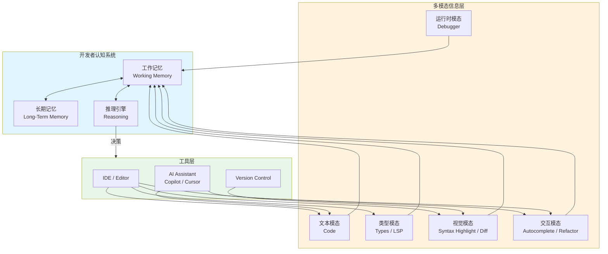
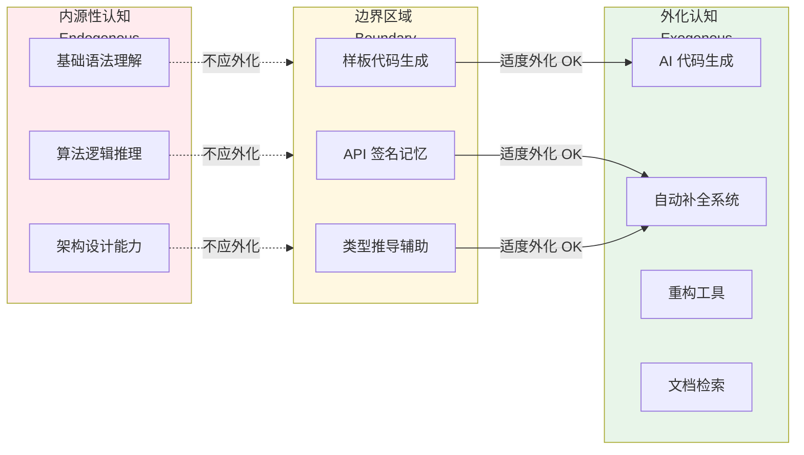
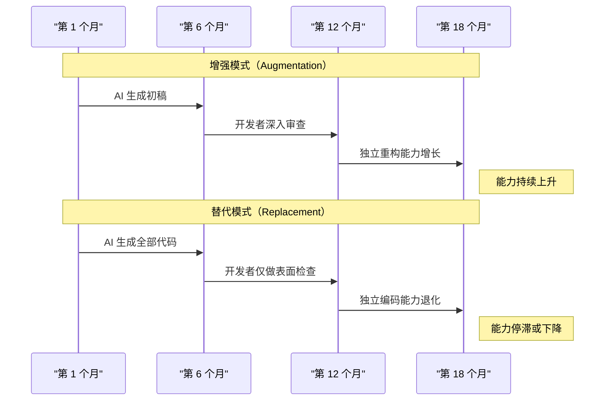
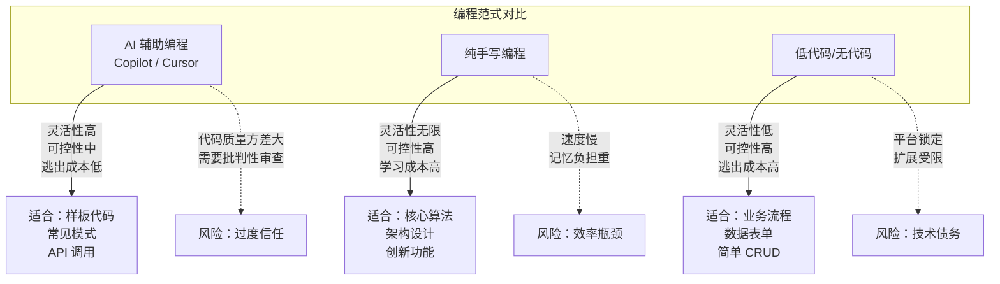

# 多模态交互理论

> **理论深度**: 跨学科（认知科学、人机交互、软件工程）
> **核心命题**: 编程不是"写代码"这么简单，而是文本、类型、运行时、视觉、交互五种模态的协同认知活动。当越来越多的认知负荷被外化到工具中时，开发者的能力是在增强还是在退化？

---

## 引言

传统上，编程被理解为"写代码"——把想法翻译成编程语言的文本序列。但这个理解忽略了编程活动的**多模态本质**。当你在 VS Code 中工作时，你同时在使用五个信息模态：

1. **文本模态**：代码本身的字符序列
2. **类型模态**：悬停提示、类型错误波浪线、内联提示
3. **运行时模态**：Debugger 中的变量值、调用栈、内存快照
4. **视觉模态**：文件树、Git diff 的颜色标记、面包屑导航
5. **交互模态**：自动补全菜单、重构预览、代码操作灯泡

这些模态不是孤立的信息源，而是**协同工作**的。类型错误波浪线（视觉模态）告诉你哪里有问题，悬停提示（文本模态）告诉你具体问题，快速修复（交互模态）让你一键解决。这三个模态的组合，把原本需要"阅读错误信息 → 理解问题 → 手动修改"的多步认知过程，压缩成了"看到波浪线 → 悬停确认 → 点击修复"的直觉式反应。

理解多模态交互的理论基础是**分布式认知（Distributed Cognition）**。这个理论认为，认知不仅发生在人脑中，也分布在**工具**、**环境**和**社会协作**中。当你用计算器做乘法时，认知过程不是"心算 + 验证"，而是"你把计算的一部分外包给了计算器"。IDE 和 AI 工具正是这种外包的极端形式——它们不仅帮你计算，还帮你**搜索**、**记忆**、**推理**和**生成**。

本章节的核心问题是：**当越来越多的认知负荷被外化到工具中时，开发者的能力是在增强还是在退化？** 这个问题没有简单答案，它取决于外化的**方式**、**程度**和**边界**。

---

## 理论严格表述

### 2.1 代码+类型+运行时的三模态互补性

代码、类型和运行时代表了程序的三个**认知维度**：

| 模态 | 回答的问题 | 时间维度 | 确定性 |
|------|-----------|---------|--------|
| 代码（Code） | "程序说了什么？" | 静态 | 语法确定，语义待推断 |
| 类型（Types） | "程序保证什么？" | 静态 | 类型确定，运行时不一定 |
| 运行时（Runtime） | "程序实际做了什么？" | 动态 | 事实，但只能观察到执行过的路径 |

这三个模态是**互补的**：代码告诉你程序的结构，类型告诉你程序的承诺，运行时告诉你程序的真实行为。没有任何一个模态能单独提供完整的理解。例如，类型系统告诉你"这个函数接受一个 `User` 对象并返回 `string`"。代码告诉你"它返回 `user.name.toUpperCase()`"。但运行时可能揭示：在某些情况下，`user.name` 是 `undefined`，导致运行时错误——这是类型系统如果配置不够严格（`strictNullChecks: false`）就无法捕获的。

### 2.2 对称差分析：文本 vs 图形 vs 交互式

为了严格理解不同模态的差异，我们使用**对称差（Symmetric Difference）**分析。设：

- **T = 纯文本模态**（Vim/Emacs 基础模式）
- **G = 图形模态**（可视化 IDE、流程图工具）
- **I = 交互式模态**（现代 IDE + AI 助手）

**T Δ G（文本与图形的差异）**：

| 维度 | 纯文本 (T) | 图形 (G) |
|------|-----------|---------|
| 信息密度 | 极高：一行代码可以表达复杂逻辑 | 较低：图形元素占用更多屏幕空间 |
| 精确性 | 高：无歧义，编译器可解析 | 中：图形可能有多种解释 |
| 编辑速度 | 快：熟练者每分钟数百字符 | 慢：拖拽、连接、调整布局 |
| 结构表达 | 弱：缩进和括号暗示结构 | 强：节点和连线显式表达结构 |
| 版本控制 | 优秀：diff 精确到字符 | 较差：二进制格式或 XML 难以 diff |
| 认知负荷 | 需要脑内解析结构 | 结构显式呈现，但空间导航负荷高 |

**核心差异**：文本模态在**序列化处理**上最优（人类擅长逐行阅读），图形模态在**空间关系处理**上最优（人类擅长识别模式和连接）。编程既涉及序列逻辑（算法步骤），也涉及空间结构（模块依赖、调用图），所以最优工具应该支持两种模态的切换。

**T Δ I（文本与交互式的差异）**：

| 维度 | 纯文本 (T) | 交互式 (I) |
|------|-----------|-----------|
| 信息呈现 | 静态：你看到的就是全部 | 动态：悬停、点击揭示额外信息 |
| 反馈延迟 | 编译/运行后才能获得反馈 | 实时：输入时立即获得类型检查、补全 |
| 认知外部化 | 低：记忆负担在开发者脑中 | 高：工具帮你记住符号、类型、文档 |
| 注意力分散 | 低：单一焦点 | 高：补全菜单、错误提示、内联提示竞争注意力 |
| 学习曲线 | 陡峭：需要记住 API 和语法 | 平缓：工具提示降低记忆需求 |

**核心差异**：交互式模态把**记忆负荷**外化到了工具中（你不需要记住所有 API 签名，IDE 会提示），但增加了**注意力管理**的负担（你需要决定哪些提示值得关注，哪些可以忽略）。

### 2.3 IDE 作为多模态认知工具：从文本编辑器到认知外骨骼

IDE 的发展史就是一部**认知外化**的进化史：

| 时代 | 工具 | 外化的认知功能 |
|------|------|--------------|
| 1970s | 纯文本编辑器（ed、vi） | 无：记忆和解析完全在脑中 |
| 1980s | 语法高亮编辑器 | 词法分析：帮你区分关键字、变量、字符串 |
| 1990s | IntelliSense（Visual Studio） | 符号记忆：自动提示成员列表 |
| 2000s | 重构工具（Eclipse、IDEA） | 结构推理：安全地重命名、提取方法 |
| 2010s | LSP + VS Code | 跨语言知识：统一协议暴露编译器知识 |
| 2020s | AI 辅助（Copilot、Cursor） | 生成和推理：自动写代码、解释代码、改 Bug |

每一步都扩大了**外化的边界**。早期的编辑器只是"记录你的想法"，现代的 IDE 是"帮你思考"。

### 2.4 AI 辅助编程的认知分工重构

GitHub Copilot（2021 年发布）和 Cursor（基于 VS Code 的 AI 编辑器）代表了编程工具的最新进化。它们不是简单地"提示信息"，而是**生成完整的代码片段**。

**传统编程的认知分工**：

1. 理解需求（人）
2. 设计算法（人）
3. 回忆 API 和语法（人 + 文档）
4. 编写代码（人）
5. 调试和测试（人 + 工具）

**AI 辅助编程的认知分工**：

1. 理解需求（人 + AI 澄清）
2. 设计算法（人，AI 可以提供方案）
3. 回忆 API 和语法（AI 主导，人验证）
4. 编写代码（AI 生成，人审查和编辑）
5. 调试和测试（人 + AI 诊断 + 工具）

关键变化在于步骤 3 和 4：**记忆和生成工作大量外化给了 AI。** 这带来的影响是双刃剑：

- **正面**：开发者可以把认知资源集中在**架构设计**和**业务逻辑**上，而不是消耗在"这个 API 的第三个参数叫什么"上。
- **负面**：如果开发者过度依赖 AI 生成，可能逐渐丧失**独立编码能力**——就像总是用导航的人记不住路线。

### 2.5 Vibe Coding 与信任校准问题

"Vibe Coding"（氛围编程）是 2024-2025 年兴起的一种编程范式。它的核心主张是：**开发者不再逐行编写代码，而是通过自然语言描述意图，由 AI 生成实现，开发者通过"感觉"（vibe）来判断代码是否正确。**

这种范式的认知特征：

1. **从精确到模糊**：传统编程要求精确的语法，Vibe Coding 允许模糊的自然语言
2. **从构建到筛选**：开发者不再从零构建，而是从 AI 生成的多个选项中筛选
3. **从理解到信任**：开发者可能不完全理解 AI 生成的代码，但通过测试和运行来建立信任
4. **从局部到全局**：开发者的注意力从"这行代码怎么写"转移到"这个模块应该做什么"

Vibe Coding 的认知风险在于**信任校准问题**。人类对 AI 生成内容的信任往往不是基于理解，而是基于**流畅性启发**（Fluency Heuristic）——"这段代码看起来很专业，所以应该是正确的"。但 AI 特别擅长生成"看起来对但实际上错"的代码。

### 2.6 技能退化风险：外化理论的边界

Clark & Chalmers (1998) 的"延展心智"（Extended Mind）理论认为，认知过程可以延伸到外部工具中。你的笔记本上的购物清单是你的记忆的一部分，就像你脑中的记忆一样。

这个理论为工具使用提供了哲学基础：使用计算器做乘法不是"作弊"，而是**合法的认知延伸**。

但外化有一个**边界条件**：当外部工具不可用时，你仍然需要**足够的基础能力**来完成任务。如果你完全依赖 GPS 导航，在手机没电时你就无法找到路。这不是外化的问题，而是**过度外化**的问题。

在编程中，过度外化的风险包括：

1. **语法遗忘**：总是用自动补全，逐渐忘记 API 签名
2. **算法退化**：总是用 AI 生成排序/搜索代码，忘记基本算法原理
3. **调试依赖**：不理解错误信息，只会把错误粘贴给 AI
4. **架构能力萎缩**：只关注局部代码生成，忽视系统设计

### 2.7 增强 vs 替代：对称差分析

设：

- **E = 增强（Augmentation）**：工具增强人类能力，人类仍然保持核心技能
- **R = 替代（Replacement）**：工具替代人类能力，人类逐渐丧失核心技能

| 维度 | 增强 (E) | 替代 (R) |
|------|---------|---------|
| 工具失效时的表现 | 可以手动完成任务，只是较慢 | 完全无法完成任务 |
| 学习效果 | 使用工具过程中仍然学习 | 被动接受，不主动理解 |
| 创新能力 | 保留：可以在工具基础上创新 | 受限：只能做工具允许的事 |
| 对工具输出的态度 | 批判性审查 | 无条件接受 |
| 长期发展 | 能力持续增长 | 可能停滞或退化 |

**核心差异**：增强模式下，工具是**杠杆**——你仍然需要施加力量，但工具放大了效果。替代模式下，工具是**轮椅**——你依赖它移动，没有它就无法行动。

理想的 AI 辅助编程应该是**增强模式**：AI 生成代码，但你必须理解它、审查它、能在需要时重写它。

---

## 工程实践映射

### 3.1 TypeScript LSP：多模态整合的典范

TypeScript 的语言服务协议（LSP）是一个多模态整合的典范。它把编译器的知识通过标准化协议暴露给编辑器：

```typescript
// 当你在 VS Code 中悬停在这段代码上：
const result = users.filter(u => u.active).map(u => u.name);

// 你同时获得多个模态的信息：
// 文本模态：代码本身
// 类型模态：悬停显示 result 的类型是 string[]
// 视觉模态：filter 和 map 的链式调用有语义着色
// 交互模态：点击 u.active 可以跳转到 User 接口的定义
```

### 3.2 重构工具保护认知安全

```typescript
// 原始代码
interface User {
  name: string;
}

function greet(user: User) {
  return `Hello, ${user.name}`;
}

// 想把 "name" 改成 "fullName"
// 手动修改的风险：漏改某处、破坏类型一致性
// 使用 F2（重命名符号），VS Code 自动：
// 1. 修改接口定义
// 2. 修改所有引用
// 3. 修改相关文件中的引用
// 4. 如果导致类型错误，立即标红
```

重构工具的认知价值在于：**它把"需要记住所有引用位置"的工作记忆负担，转化为了"确认工具预览"的视觉检查负担。** 后者远小于前者。

### 3.3 AI 辅助的理想协作模式

```typescript
// 开发者输入：
// "写一个 TypeScript 函数，接收一个用户数组，
// 按注册日期排序，返回最近注册的 10 个用户的名字列表"

// AI 生成：
function getRecentUserNames(users: User[], limit: number = 10): string[] {
  return users
    .sort((a, b) => new Date(b.registeredAt).getTime() - new Date(a.registeredAt).getTime())
    .slice(0, limit)
    .map(user => user.name);
}

// 人审查发现的问题：
// 1. sort 会修改原数组！应该用 toSorted（ES2023）或先复制
// 2. new Date() 在 sort comparator 中重复创建，性能差
// 3. 没有处理 registeredAt 可能缺失的情况

// 修正后：
function getRecentUserNames(users: readonly User[], limit: number = 10): string[] {
  return [...users]
    .sort((a, b) => {
      const timeA = a.registeredAt ? Date.parse(a.registeredAt) : 0;
      const timeB = b.registeredAt ? Date.parse(b.registeredAt) : 0;
      return timeB - timeA;
    })
    .slice(0, limit)
    .map(user => user.name);
}
```

这个例子展示了 AI 辅助的理想协作模式：**AI 负责快速生成初稿，人负责审查边界情况和性能问题。**

### 3.4 反模式：过度依赖工具提示

```typescript
// 反模式：开发者从未真正理解类型，只是跟着 IDE 提示走
function process(data: unknown) {
  // IDE 提示 "data is of type unknown"
  // 开发者看到 "as" 补全，随手一用
  return (data as any).map(x => x.value);
  // 实际上应该先做类型守卫
}
```

当工具把类型信息以"提示"的形式呈现时，开发者可能依赖提示而不再主动思考类型的含义。这类似于**导航依赖**——总是用 GPS 的人，逐渐失去了独立认路的能力。

### 3.5 反模式：Debugger 依赖导致的推理能力退化

```typescript
// 反模式：不用大脑推理，全靠 debugger 逐行执行
function findBug(data: number[]) {
  // 开发者不知道这里为什么有问题
  // 策略：在每一行设置断点，逐行看变量值
  const sorted = data.sort(); // 断点 1
  const filtered = sorted.filter(x => x > 0); // 断点 2
  const mapped = filtered.map(x => x * 2); // 断点 3
  return mapped.reduce((a, b) => a + b, 0); // 断点 4
}
```

更好的策略是**先推理，再验证**：

```typescript
// 推理：
// 1. sort() 默认按字符串排序！所以 [10, 2] 变成 ["10", "2"] → [10, 2]（字符串比较）
// 2. 修复：sort((a, b) => a - b)
// 3. 用 debugger 验证修复是否生效，而不是用它来找 bug
```

### 3.6 可视化编程与文本编程的认知维度

不是所有编程任务都适合文本模态。某些任务在图形/可视化模态下认知效率更高：

| 任务类型 | 最优模态 | 理由 |
|---------|---------|------|
| 算法实现 | 文本 | 精确控制每行逻辑 |
| 状态机设计 | 图形 | 状态和转换的空间关系更直观 |
| UI 布局 | 可视化 + 代码 | WYSIWYG 快速原型，代码精确微调 |
| 数据库 schema | 图形 | 表关系和约束的空间表达 |
| 正则表达式 | 交互式 | 实时匹配反馈 |
| API 设计 | 文本 + 文档 | 精确的类型签名 + 使用示例 |
| 数据流管道 | 图形 | 节点和连线的视觉表达 |

混合模态试图结合两者的优势。React 的 JSX 是一个典型案例——嵌套结构在视觉上暗示了 DOM 树的空间层级，这是一种**文本中的可视化**。

---

## Mermaid 图表

### 图 1：多模态编程环境的认知信息流



### 图 2：分布式认知中的外化边界模型



### 图 3：增强模式 vs 替代模式的认知依赖演化



### 图 4：AI 辅助 vs 纯手写 vs 低代码的三维对比



---

## 理论要点总结

1. **多模态协同原理**：编程活动的本质是文本、类型、运行时、视觉、交互五种模态的协同。没有任何单一模态能提供完整理解，最优工具应支持模态间的无缝切换。TypeScript LSP 是这一原理的工程典范。

2. **认知外化的双刃剑**：IDE 和 AI 工具将记忆、生成、搜索等认知功能外化到工具中，释放了开发者的工作记忆，使其能专注于更高层次的架构设计。但过度外化会导致基础技能退化，形成"没有工具就无法工作"的脆弱依赖。

3. **增强 vs 替代的边界**：理想的工具使用模式是**增强（Augmentation）**——工具是杠杆，放大人类的能力。危险的模式是**替代（Replacement）**——工具是轮椅，没有它就无法行动。区分两者的关键在于：工具失效时，你是否仍能完成任务？

4. **Vibe Coding 的信任校准**：AI 生成的代码往往具有"流畅性启发"效应——看起来专业，所以被默认为正确。但 AI 特别擅长生成"看起来对但实际上错"的代码。开发者必须建立"批判性审查"的认知习惯，而不是基于"感觉"信任代码。

5. **模态匹配原则**：不同编程任务有其最优模态。算法实现适合文本，状态机设计适合图形，UI 布局适合混合模态。未来的编程环境应该根据任务类型自动推荐或切换模态，而不是强迫开发者用不适合的模态工作。

6. **渐进式外化原则**：基础技能（语法理解、算法推理、架构设计）不应过度外化；繁琐工作（样板代码、API 记忆、文档检索）可以充分外化。让开发者始终保留"无工具也能工作"的基础能力，是防止技能退化的关键防线。

---

## 参考资源

1. Norman, D. A. (2013). *The Design of Everyday Things* (Revised ed.). Basic Books. —— 日常事物设计的认知心理学经典，为理解工具如何扩展人类能力提供了理论基础。

2. Clark, A. (2008). *Supersizing the Mind: Embodiment, Action, and Cognitive Extension*. Oxford University Press. —— 延展心智理论的系统阐述，论证了认知过程如何延伸到外部工具中。

3. Clark, A., & Chalmers, D. (1998). "The Extended Mind." *Analysis*, 58(1), 7-19. —— 延展心智的奠基论文，提出了"外部资源何时成为认知过程的一部分"的判定标准。

4. Kirsh, D. (1995). "The Intelligent Use of Space." *Artificial Intelligence*, 73(1-2), 31-68. —— 空间智能使用理论，解释了为什么图形化和空间化的信息呈现能降低认知负荷。

5. Hutchins, E. (1995). *Cognition in the Wild*. MIT Press. —— 分布式认知的民族志研究，展示了认知如何在人、工具和社会系统中分布。

6. Hermans, F. (2021). *The Programmer's Brain*. Manning Publications. —— 专为软件开发者编写的认知科学读物，直接对应编程中的记忆、注意力和学习问题。

7. Vaithilingam, P., et al. (2022). "Expectation vs. Experience: Evaluating the Usability of Code Generation Tools Powered by Large Language Models." *CHI 2022*. —— 关于 AI 代码生成工具可用性的实证研究，揭示了开发者使用这些工具时的真实挑战。
