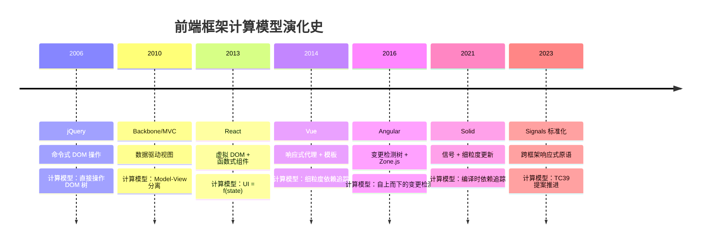
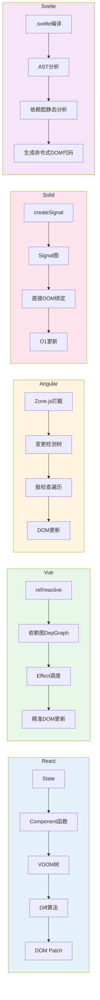
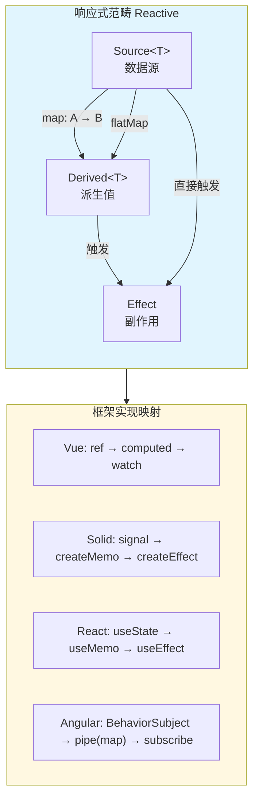
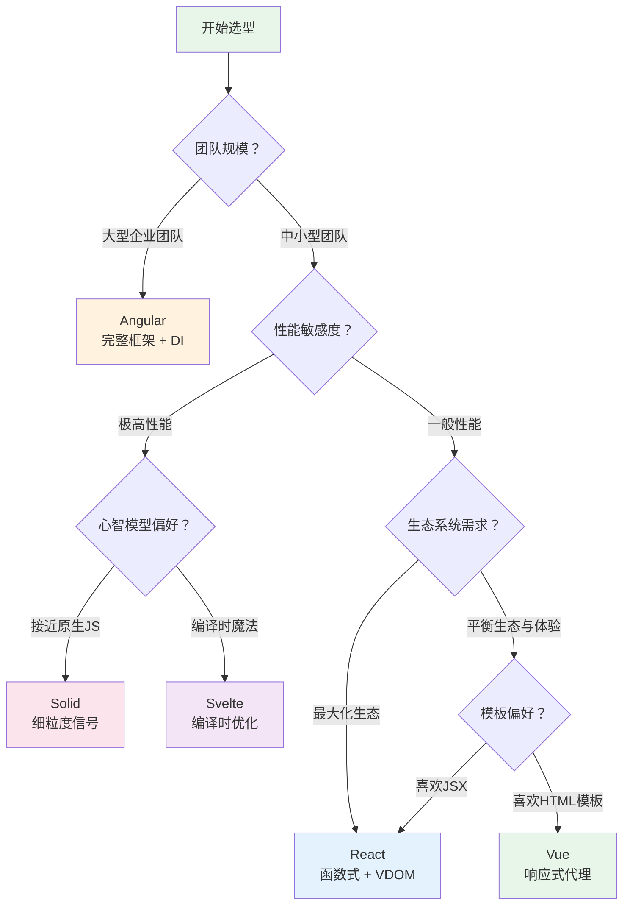

# 前端框架计算模型

> **核心命题**：React、Vue、Angular、Solid 不仅是 UI 库，它们是不同计算模型的工程实现。从形式化角度理解这些模型，可以揭示框架设计的深层原理和选型依据。

---

## 引言

前端框架的演化本质上是"UI 计算模型"的演化。从 2006 年 jQuery 的命令式 DOM 操作，到 2013 年 React 的虚拟 DOM + 函数式组件，再到 2021 年 Solid 的细粒度信号与直接 DOM 更新，每一次框架革命都是对"状态到视图的映射"这一计算问题的重新形式化。

```
2006: jQuery（命令式 DOM 操作）
  → 计算模型：直接操作 DOM 树
  → 开发者负责追踪所有状态变化并手动更新 DOM

2013: React（虚拟 DOM + 函数式组件）
  → 计算模型：UI = f(state)
  → 每次状态变化重新渲染整个组件树

2014: Vue（响应式代理 + 模板）
  → 计算模型：细粒度依赖追踪
  → 自动追踪状态与 DOM 的依赖关系

2016: Angular（变更检测树 + Zone.js）
  → 计算模型：自上而下的变更检测
  → 通过 Zone.js 拦截所有异步操作

2021: Solid（信号 + 细粒度更新）
  → 计算模型：编译时依赖追踪
  → 无虚拟 DOM，直接更新真实 DOM

2023+: Signals 标准化
  → 计算模型：跨框架的响应式原语
  → Vue/Vanilla/Solid converging on Signals
```

**核心洞察**：不同框架代表了处理"状态 → 视图"映射的不同数学结构。React 选择函数复合（Function Composition），Vue 选择依赖图传播（Dependency Graph Propagation），Angular 选择树遍历（Tree Traversal），Solid 选择信号代数（Signal Algebra），Svelte 选择编译时静态分析（Compile-time Static Analysis）。理解这些计算模型，比记住 API 更有长期价值。

---

## 理论严格表述

### 2.1 React：基于代数效应的虚拟 DOM 计算模型

React 的计算模型可以形式化为一个**从状态到虚拟 DOM 树的纯函数**。

```
React 渲染 = 函数复合

Component: State → VDOM
  输入：组件状态（props + hooks state）
  输出：虚拟 DOM 树

VDOMDiff: VDOM × VDOM → Patch[]
  输入：旧虚拟 DOM 和新虚拟 DOM
  输出：DOM 操作补丁序列

Patch: DOM → DOM
  输入：真实 DOM
  输出：更新后的真实 DOM

整体：State → DOM
  = Patch ∘ VDOMDiff(Component(s₀), Component(s₁))
```

**TypeScript 形式化**：

```typescript
// 虚拟 DOM 节点
type VNode = {
  type: string | Function;
  props: Record<string, unknown>;
  children: VNode[];
};

// 组件 = 状态到 VDOM 的函数
type Component<P, S> = (props: P, state: S) => VNode;

// Diff 算法 = 两个 VDOM 的比较
type Patch =
  | { type: 'CREATE'; node: VNode }
  | { type: 'REMOVE' }
  | { type: 'REPLACE'; node: VNode }
  | { type: 'UPDATE'; props: Record<string, unknown> }
  | { type: 'REORDER'; moves: unknown[] };
```

React Hooks 引入了一种**代数效应**（Algebraic Effects）的计算模型。从范畴论视角：

- `useState` = State Monad 的局部实例
- `useEffect` = IO Monad 的局部实例
- `useContext` = Reader Monad 的局部实例

Hooks 的组合性体现了 Monad 的组合性：自定义 Hook `useUser` 本质上是一个 Kleisli 箭头，通过 State Monad + IO Monad 的组合实现从 `userId: string` 到 `User | null` 的映射。

React Fiber 将渲染工作拆分为可中断的单元，形成一个**工作循环图**。每个 Fiber 节点包含有向图结构（组件树 + 副作用链表），渲染阶段是深度优先遍历构建副作用链表，提交阶段遍历副作用链表执行 DOM 操作。

### 2.2 Vue：响应式依赖图的图论模型

Vue 的响应式系统本质上是一个**依赖图**（Dependency Graph）。

```
依赖图 G = (V, E)

V（顶点）：
  - 响应式数据（ref, reactive）
  - 计算属性（computed）
  - 副作用（watch, watchEffect, render）

E（边）：
  - 数据 → 计算属性（数据被计算属性读取）
  - 数据 → 副作用（数据被副作用读取）
  - 计算属性 → 副作用（计算属性被副作用读取）

图的方向 = 依赖方向（从被依赖者指向依赖者）
```

Vue 的更新机制本质上是**对依赖图进行拓扑排序**。当响应式数据 A 改变时：

1. 找到 A 的所有直接订阅者（第一层）
2. 这些订阅者可能是计算属性 B（需要重新计算）或副作用 C（需要重新执行）
3. 如果 B 改变了，找到 B 的订阅者（第二层）
4. 继续传播，直到没有新的变化

这形成了一个广度优先搜索（BFS）过程，确保"被依赖者"先于"依赖者"更新。循环依赖会破坏 DAG 性质，Vue 3 会检测并抛出警告。

### 2.3 Angular：变更检测树的形式化分析

Angular 的变更检测是一个**自上而下的树遍历算法**。

```
变更检测 = 深度优先遍历组件树

checkComponent(node):
  if node.shouldCheck():
    oldValues = node.snapshot()
    node.updateView()
    newValues = node.snapshot()

    if oldValues != newValues:
      for child in node.children:
        checkComponent(child)
    else if node.changeDetection == OnPush:
      // 跳过子树检查
      return
```

**OnPush 策略的范畴论解释**：

- 默认策略（CheckAlways）= 所有子对象的"严格求值"
- OnPush 策略 = 子对象的"惰性求值" = 类似 Haskell 的 lazy evaluation

Zone.js 通过猴子补丁拦截所有异步操作，可以形式化为**计算上下文的 monad transformer**：将底层的异步计算（Task Monad）包装在额外的"变更检测"上下文中，类似于 Haskell 的 `TaskT ChangeDetection IO a`。

### 2.4 Solid：细粒度响应式的信号代数

Solid 的 Signal 是一个极简的响应式原语，具有清晰的代数结构。

```
Signal<T> = (getter: () => T, setter: (v: T) => void)

getter = 读取当前值（建立依赖关系）
setter = 设置新值（触发更新）

Signal 形成了一种"反应式变量"的代数：
- 创建：createSignal(initial) → Signal<T>
- 读取：signal() → T（副作用：注册依赖）
- 写入：signal.set(v) → void（副作用：触发更新）
```

Signal 可以被看作一种特殊的 **State Monad**。区别在于：State Monad 的 `put` 返回新的 monadic 值，而 Signal 的 `set` 直接触发副作用（更新）。因此 Signal 更接近 "IORef" 而非纯 State Monad。

**对称差分析：Signal vs Observable**：

- Signal \\ Observable = <span v-pre>&#123; 同步读取（pull-based）、自动依赖追踪、无订阅/取消订阅开销、更少的内存泄漏风险 &#125;</span>
- Observable \\ Signal = <span v-pre>&#123; 异步推送（push-based）、丰富的操作符（map, filter, merge 等）、支持背压控制、多播能力 &#125;</span>

### 2.5 Svelte：编译时优化的静态分析模型

Svelte 将框架逻辑从运行时转移到编译时。

```
Svelte 编译器 = 静态分析 + 代码生成

输入：.svelte 文件（模板 + 脚本 + 样式）
输出：.js 文件（优化的命令式 DOM 操作）

编译时分析：
1. 解析模板 → AST
2. 分析响应式依赖 → 依赖图
3. 生成增量更新代码 → 直接 DOM 操作

运行时：
- 没有虚拟 DOM
- 没有 diff 算法
- 直接执行编译生成的 DOM 更新代码
```

**编译时 vs 运行时的范畴论对比**：

- React/Vue（运行时框架）：渲染 = 运行时函数求值 = 解释执行（interpretation）
- Svelte（编译时框架）：渲染 = 编译时代码生成 + 运行时直接执行 = 编译执行（compilation）

范畴论对应：

- 解释 = 从语法范畴到语义范畴的函子
- 编译 = 从语法范畴到目标语言语法范畴的函子

### 2.6 响应式系统的范畴论统一

所有响应式系统都可以统一在一个范畴论语境中。

```
响应式范畴 Reactive：

对象：
  - 数据源（Source<T>）
  - 派生值（Derived<T>）
  - 副作用（Effect）

态射：
  - map: Source<A> → Source<B>（值转换）
  - filter: Source<A> → Source<A>（条件筛选）
  - flatMap: Source<A> → Source<Source<B>> → Source<B>（嵌套展开）
  - merge: Source<A> × Source<B> → Source<A | B>（合并）

组合：
  - 响应式管道 = 态射的复合
  - f ∘ g = 先应用 g，再应用 f
```

这一统一模型的工程意义在于：

1. **跨框架概念迁移**：Vue 的 `computed` = Solid 的 `createMemo` = React 的 `useMemo`，它们都是 "Derived" 对象的不同实现
2. **跨框架库设计**：Vue/Vanilla/Solid 都在向 Signals 收敛，TC39 正在推进 Signals 标准化提案
3. **性能优化**：理解依赖图的结构 → 减少不必要的更新传播

---

## 工程实践映射

### 3.1 四大框架计算模型对比

| 框架 | 计算模型 | 核心抽象 | 更新机制 | 时间复杂度 |
|------|---------|---------|---------|-----------|
| React | 函数式渲染 + 虚拟 DOM diff | `Component: State → VDOM` | 重新执行组件函数 + diff | O(n) diff + O(m) 渲染 |
| Vue | 响应式代理 + 依赖追踪 | `DepGraph: State × Effect → Updates` | 依赖图传播 + 精准更新 | O(k) 更新（k=受影响的依赖数） |
| Angular | 变更检测树遍历 | `CDTree: ComponentTree → DOMUpdates` | 自上而下遍历 + 脏检查 | O(t) 遍历（t=组件树节点数） |
| Solid | 细粒度信号 + 直接 DOM 更新 | `SignalGraph: Signal → DOMOperation` | 信号变化 → 直接执行绑定的 DOM 操作 | O(1) 每次信号更新 |

**对称差分析**：

- React \\ Vue = <span v-pre>&#123; 函数式编程范式、更大的生态系统、React Native 跨平台、Fiber 的并发特性 &#125;</span>
- Vue \\ React = <span v-pre>&#123; 模板编译优化、更细粒度的更新、更简单的响应式模型、更好的默认性能 &#125;</span>
- Angular \\ (React ∪ Vue) = <span v-pre>&#123; 完整的框架（路由、HTTP、表单）、TypeScript 深度集成、依赖注入系统、企业级工具链 &#125;</span>
- Solid \\ (React ∪ Vue ∪ Angular) = <span v-pre>&#123; 无虚拟 DOM、最小的运行时、最快的更新性能、编译时优化 &#125;</span>

### 3.2 虚拟 DOM 的权衡分析

虚拟 DOM 是一种**以空间换时间**的策略。

```
虚拟 DOM 的开销：
1. 创建 VDOM 树（内存分配）
2. Diff 算法（CPU 计算）
3. 维护 VDOM 树（GC 压力）

虚拟 DOM 的收益：
1. 跨平台（VDOM 可以渲染到不同目标）
2. 声明式编程（开发者不需要手动操作 DOM）
3. 批量更新（减少实际 DOM 操作次数）

数学分析：
  设 n = 组件数，m = 变化数

  直接 DOM 操作：O(m) DOM 操作
  虚拟 DOM：O(n) VDOM 创建 + O(n) diff + O(m) DOM 操作

  当 m << n 时，虚拟 DOM 有额外开销
  当 m ≈ n 时，虚拟 DOM 的收益显现
```

```typescript
// 简单列表更新：直接 DOM 操作可能更快
function updateListDirect(items: string[]) {
  const list = document.getElementById('list')!;
  list.innerHTML = items.map(item => `<li>${item}</li>`).join('');
}

// React 版本：
function List({ items }: { items: string[] }) {
  return <ul>{items.map(item => <li key={item}>{item}</li>)}</ul>;
}
```

### 3.3 框架选型的形式化决策矩阵

| 需求 | 推荐框架 | 计算模型匹配 | 理由 |
|------|---------|------------|------|
| 大型应用，团队规模大 | Angular | 完整框架 | 内置路由、HTTP、表单、DI |
| 生态系统优先 | React | 函数式 + VDOM | 最大的生态，最多库 |
| 性能优先 | Solid/Svelte | 细粒度/编译时 | 最少的运行时开销 |
| 渐进式采用 | Vue | 响应式代理 | 可以逐步集成到现有项目 |
| 跨平台（移动端） | React Native | VDOM 抽象 | 一次编写，多平台运行 |
| 实时数据可视化 | Vue/Solid | 细粒度响应 | 高频更新，需要精准渲染 |

### 3.4 认知负荷与框架选择

从认知科学角度，框架选择应该考虑团队的心智模型：

- **函数式思维强的团队** → React（函数组件、Hooks、不可变数据）
- **面向对象思维强的团队** → Angular（类、装饰器、依赖注入）
- **模板/标记语言背景的团队** → Vue/Svelte（HTML-like 模板、指令）
- **性能敏感的场景** → Solid（接近原生 JS 的心智模型）

### 3.5 框架抽象泄漏与应对

Joel Spolsky 的"抽象泄漏定律"指出："所有非平凡的抽象，在某种程度上都是泄漏的。"

前端框架的泄漏：

- React：`useEffect` 的依赖数组容易出错
- Vue：响应式代理不追踪所有操作（如数组索引赋值）
- Angular：Zone.js 无法检测所有异步操作
- Solid：信号在组件外使用时需要额外注意

理解框架的底层计算模型，可以帮助开发者预判和应对这些泄漏。

### 3.6 框架间互操作的计算模型

不同框架的计算模型虽然不同，但它们可以通过 Web Components 互操作。Web Components 基于原生浏览器 API（Custom Elements、Shadow DOM、HTML Templates、ES Modules），所有框架都支持。

微前端策略：

1. **iframe 隔离**：完全隔离，但通信成本高
2. **Web Components 封装**：框架无关，但可能需要适配器
3. **运行时集成（Module Federation）**：共享依赖，减少加载时间

范畴论视角：微前端 = 不同范畴的"粘合"，需要"函子"将不同框架的组件映射到统一接口。

---

## Mermaid 图表

### 图 1：前端框架计算模型的演化谱系



### 图 2：五大框架计算模型的核心抽象对比



### 图 3：响应式系统的范畴论统一模型



### 图 4：框架选型决策树



---

## 理论要点总结

1. **框架即计算模型**：React、Vue、Angular、Solid、Svelte 的本质差异不在于 API 风格，而在于它们对"状态到视图映射"这一计算问题的不同形式化。React 使用函数复合（VDOM diff），Vue 使用依赖图传播，Angular 使用树遍历，Solid 使用信号代数，Svelte 使用编译时静态分析。

2. **虚拟 DOM 不是银弹**：虚拟 DOM 以空间换时间，在变化数接近组件数时收益最大，在变化数远小于组件数时反而有额外开销。对于简单列表更新，直接 DOM 操作（如 `innerHTML`）可能比 VDOM 更快。

3. **响应式系统的范畴论统一**：所有响应式系统都可以统一在"响应式范畴"中——对象包括数据源、派生值、副作用，态射包括 map、filter、flatMap、merge。Vue 的 `computed`、Solid 的 `createMemo`、React 的 `useMemo` 都是 "Derived" 对象的不同实现。

4. **编译时 vs 运行时的权衡**：运行时框架（React、Vue）提供灵活性和动态能力，编译时框架（Svelte、Solid）提供更小的包体积和更高的性能。范畴论视角下，运行时 = 解释函子 + 求值，编译时 = 编译函子 + 目标语言求值。

5. **框架选型的形式化原则**：选择框架 = 选择适合你问题的范畴。不存在"最好"的框架，只有"最适合"的框架。大型企业应用 → Angular，生态优先 → React，性能优先 → Solid/Svelte，渐进式采用 → Vue。

6. **认知负荷是选型的重要维度**：框架的计算模型对开发者的认知系统提出不同要求。函数式思维强的团队适合 React，OOP 思维强的团队适合 Angular，模板背景的团队适合 Vue/Svelte。

---

## 参考资源

1. React Team. "React Documentation." react.dev. —— React 官方文档，包含 Fiber 架构和并发特性的详细说明。

2. Vue Team. "Vue.js Documentation." vuejs.org. —— Vue 官方文档，深入解释响应式系统的 Proxy 实现和编译优化。

3. Angular Team. "Angular Documentation." angular.io. —— Angular 官方文档，涵盖变更检测、Zone.js 和依赖注入系统。

4. Elliott, C. (2009). "Push-Pull Functional Reactive Programming." *Haskell Symposium*. —— 函数式响应式编程的经典论文，为理解 Signal 和 Event 的代数结构提供了理论基础。

5. Czaplicki, E., & Chong, S. (2013). "Asynchronous Functional Reactive Programming for GUIs." *PLDI*. —— Elm 语言作者的奠基论文，提出了用于 GUI 的异步函数式响应式编程模型。

6. Palmieri, G. (2020). "A Categorical View of Computational Effects." *PhD Thesis*. —— 从范畴论角度系统分析计算效应，为理解 Hooks、Signal 和 Monad 的关系提供了数学框架。

7. Borceux, F. (1994). *Handbook of Categorical Algebra*. Cambridge University Press. —— 范畴代数的权威参考书，为前端框架的数学形式化提供了基础工具。

8. Green, T. R. G., & Petre, M. (1996). "Usability Analysis of Visual Programming Environments." *Journal of Visual Languages and Computing*. —— 认知维度框架（Cognitive Dimensions of Notation）的奠基论文，为评估不同框架的认知负荷提供了系统化方法。
