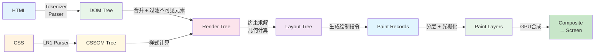
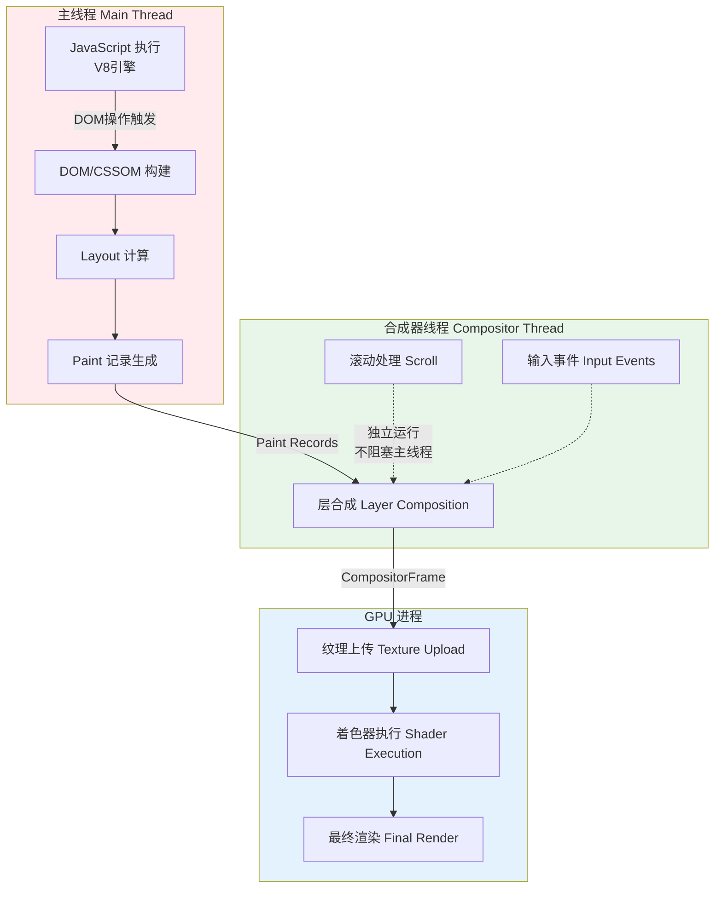
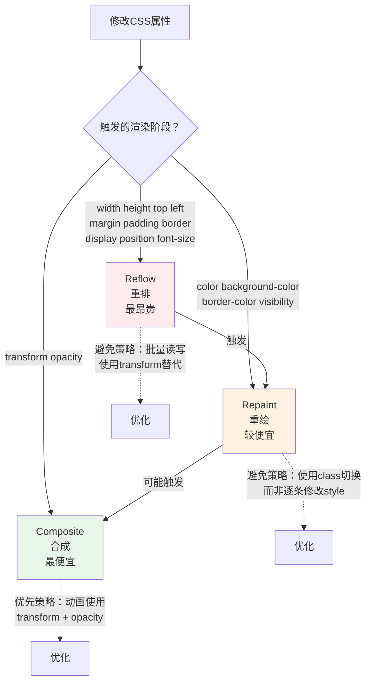
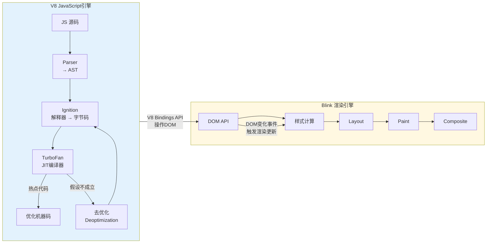

# 浏览器渲染引擎原理

> **核心命题**：浏览器渲染不是"黑魔法"，而是一个有明确阶段、可形式化描述的计算管道。理解这个管道，可以解释为什么某些代码快、某些代码慢，以及如何写出高性能的前端代码。

---

## 引言

浏览器渲染引擎的演化是一部"性能与兼容性"的斗争史。从 1993 年 Mosaic 的简单文本+图片渲染，到 2008 年 Chrome 引入多进程架构和 V8 引擎，再到 2020+ 年代的 GPU 加速渲染和并行 CSS/JS 解析，每一次渲染引擎的革新，都是对"如何在有限时间内将网页内容呈现给用户"这一问题的重新解答。

```
1993: Mosaic（第一个图形界面浏览器）
  → 渲染：简单的文本 + 图片
  → 布局：流式布局（从上到下）

1995: Netscape Navigator
  → 引入 JavaScript（LiveScript）
  → 渲染引擎开始需要处理动态内容

1997: Internet Explorer 4（Trident 引擎）
  → 引入 DOM 概念
  → CSS 开始被支持

2003: Safari（WebKit 引擎）
  → KHTML 分支
  → 更标准的 CSS 支持

2008: Chrome（V8 + WebKit/Blink）
  → 多进程架构
  → V8 JavaScript 引擎
  → 每标签页独立进程

2013: Blink 引擎从 WebKit 分叉
  → Google 主导
  → 更激进的性能优化

2020+: 现代浏览器引擎
  → GPU 加速渲染
  → 并行 CSS/JS 解析
  → 更精细的渲染流水线
```

浏览器将 HTML/CSS/JS 转换为像素的过程，称为**关键渲染路径**（Critical Rendering Path）。它包含六个明确阶段：DOM 构建 → CSSOM 构建 → Render Tree 构建 → Layout → Paint → Composite。理解每个阶段的输入、输出和计算复杂度，是前端性能优化的理论基础。

---

## 理论严格表述

### 2.1 关键渲染路径的六阶段模型

```
关键渲染路径的 6 个阶段：

1. DOM 构建
   HTML → Tokenizer → Parser → DOM Tree

2. CSSOM 构建
   CSS → Parser → CSSOM Tree

3. Render Tree 构建
   DOM + CSSOM → Render Tree（只包含可见元素）

4. Layout（布局）
   Render Tree → Layout Tree（计算每个节点的几何信息）

5. Paint（绘制）
   Layout Tree → Paint Records（绘制指令列表）

6. Composite（合成）
   Paint Layers → GPU Textures → Screen

总时间 = T_DOM + T_CSSOM + T_Render + T_Layout + T_Paint + T_Composite
```

**TypeScript 模拟渲染管道**：

```typescript
interface RenderPipeline {
  // 阶段 1: DOM 构建
  buildDOM(html: string): DOMNode;

  // 阶段 2: CSSOM 构建
  buildCSSOM(css: string): CSSOMNode;

  // 阶段 3: Render Tree
  buildRenderTree(dom: DOMNode, cssom: CSSOMNode): RenderNode;

  // 阶段 4: Layout
  calculateLayout(renderTree: RenderNode): LayoutNode;

  // 阶段 5: Paint
  generatePaintRecords(layoutTree: LayoutNode): PaintRecord[];

  // 阶段 6: Composite
  compositeLayers(records: PaintRecord[]): Frame;
}
```

### 2.2 HTML 解析与 DOM 树构建的形式化模型

HTML 解析器可以看作一个**下推自动机**（Pushdown Automaton）。

```
HTML 解析器 = 下推自动机

状态 = 解析器当前模式（initial, before html, in head, in body, ...）
输入 = HTML 字符流
栈 = 开放元素栈（处理嵌套标签）
输出 = DOM 树

状态转移 = 根据当前状态和输入字符，
           转移到新状态并可能修改栈
```

**Tokenization 过程**：HTML 字符流经过 Tokenizer 产生 Token 序列（DOCTYPE、StartTag、EndTag、Comment、Character、EOF）。

**树构建算法**：将 Token 序列转换为 DOM 树的过程维护一个"开放元素栈"：对于每个 StartTag Token，创建新元素并压入栈；对于每个 EndTag Token，从栈弹出元素。HTML 的容错性（未闭合标签自动闭合、错误嵌套自动重排）对应于下推自动机的"错误恢复"机制。

**DOM 树的范畴论视角**：DOM 树 = 有向树（范畴论中的"树范畴"）。对象是 DOM 节点，态射是父子关系。DOM 操作（`createElement`、`appendChild`、`removeChild`、`replaceChild`）对应于树范畴中的态射操作。

### 2.3 CSS 解析与 CSSOM 构建

CSS 解析器比 HTML 解析器更复杂，因为 CSS 具有**上下文无关语法**，使用 LR(1) 解析器。

**CSSOM 结构**：

```
StyleSheet
  → CSSRule
    → CSSStyleRule（选择器 + 声明块）
    → CSSMediaRule（@media）
    → CSSKeyframesRule（@keyframes）
```

**选择器匹配的复杂度**：

- 简单选择器（如 `div`）：O(1) 每节点
- 后代选择器（如 `div p`）：O(d) 每节点（d = 深度）
- 通用选择器（如 `*`）：O(n) 每节点（n = 节点数）

浏览器维护"规则索引"来加速匹配。

**层叠（Cascade）= 冲突解决算法**：当多个规则匹配同一个元素时：

1. 比较来源（用户代理 < 用户 < 作者 < `!important`）
2. 比较特异性（Specificity）：`(a, b, c)`，其中 a = ID 选择器数量，b = 类/属性/伪类选择器数量，c = 类型/伪元素选择器数量
3. 比较源代码顺序

### 2.4 Render Tree 的构造

Render Tree 只包含**可见元素**。

```
Render Tree 构建算法：

1. 遍历 DOM 树的每个节点
2. 对于每个节点：
   a. 查找匹配的所有 CSS 规则
   b. 计算最终样式（层叠 + 继承 + 默认值）
   c. 如果 display: none，跳过（不加入 Render Tree）
   d. 如果 visibility: hidden，加入但标记为不可见
   e. 创建 RenderObject
3. 建立 RenderObject 之间的父子关系

注意：
- head 元素不加入 Render Tree
- display: none 的元素及其子元素都不加入
- 伪元素（::before, ::after）会创建额外的 RenderObject
```

**DOM Tree ≠ Render Tree**。从范畴论视角，DOM → Render Tree 的映射是"有损的"——某些信息在转换过程中被丢弃（如不可见元素），同时新增信息（如伪元素节点）。这对应于"遗忘函子"。

### 2.5 Layout 计算的形式化模型

Layout 计算每个 RenderObject 的**几何信息**（位置、大小）。

```
Layout 计算 = 递归的约束求解

对于每个节点：
  width = f(parent.width, margin, padding, border, content)
  height = f(children, content, min-height, max-height)
  x = f(parent.x, margin-left)
  y = f(previousSibling.y, previousSibling.height, margin-top)

布局模式：
- Block Flow：块级元素，垂直排列
- Inline Flow：行内元素，水平排列
- Flex：弹性布局
- Grid：网格布局
- Table：表格布局
- Positioned：绝对/固定/粘性定位
```

**Reflow（重排）的触发条件**：当尺寸（width, height, margin, padding, border）、位置（top, left, right, bottom）、内容（text, child 元素变化）、显示属性（display, visibility）改变时触发。Reflow 是递归的——一个元素的布局变化可能影响其父元素、子元素、兄弟元素，最坏情况触发整个文档的 Reflow。

**Layout 算法的时间复杂度**：

- 简单情况（流式布局）：O(n)
- 复杂情况（Flex/Grid）：O(n) 或 O(n × m)
- 最坏情况（绝对定位 + 百分比）：O(n²)

### 2.6 Paint 与分层策略

Paint 将 Layout 结果转换为**绘制指令**。

```
绘制指令类型：
- DrawRect：绘制矩形（背景、边框）
- DrawText：绘制文本
- DrawImage：绘制图片
- DrawPath：绘制路径（SVG、Canvas）
- DrawPicture：嵌套的绘制指令

绘制顺序（Paint Order）：
1. 背景色/背景图
2. 边框
3. 子元素的背景/边框
4. 子元素的内容
5. 轮廓（outline）
6. 其他（如 ::before/::after）
```

浏览器将页面分为多个**层**（Layers）以优化合成性能。

**自动分层**（浏览器决定）：3D 变换（`transform: translateZ()`）、透明度动画（`opacity`）、固定/粘性定位（`position: fixed/sticky`）、`will-change` 属性、video/canvas/iframe 元素、重叠元素（`z-index`）。

**手动分层**（开发者控制）：`will-change: transform`、`transform: translateZ(0)`（强制分层）。

**层的内存开销**：每个层 = 一个 GPU 纹理（位图）。内存占用 = width × height × 4 bytes (RGBA)。例如 1920 × 1080 的层约占用 8 MB。层数过多会导致内存压力 + 合成开销。

### 2.7 Composite 合成与 GPU 加速

合成阶段将多个层合并为最终的屏幕图像。

```
合成 = 层的组合

合成器（Compositor）的工作：
1. 收集所有可见层
2. 按 z-index 排序
3. 对每个层：
   a. 应用变换（transform）
   b. 应用裁剪（clip）
   c. 应用透明度（opacity）
4. 将所有层混合为最终图像

GPU 加速：
  合成在 GPU 上执行（通过 OpenGL/Vulkan/DirectX）
  transform 和 opacity 动画非常高效
  因为不需要 CPU 重新计算 Layout 或 Paint
```

**现代浏览器多线程架构**：

- **主线程**（Main Thread）：JavaScript 执行、DOM/CSSOM 构建、Layout 计算、Paint 记录生成
- **合成器线程**（Compositor Thread）：层合成、滚动处理、部分输入事件
- **GPU 进程**：纹理上传、着色器执行、最终渲染

合成器线程可以独立于主线程运行，因此滚动和某些动画不阻塞 JS 执行。

### 2.8 V8 引擎与渲染引擎的交互

V8 是 Chrome 的 JavaScript 引擎，它与渲染引擎紧密协作。

```
V8 执行管道：

JavaScript 源码 → Parser → AST
  AST → Ignition（解释器）→ 字节码
    字节码 → TurboFan（JIT 编译器）→ 机器码
      热点代码 → 优化编译 → 更高效的机器码
      去优化（Deoptimization）→ 如果假设不成立

与渲染引擎的交互：
  V8 通过 Blink 的 V8 API 访问 DOM
  DOM 操作触发渲染引擎的更新
```

**JavaScript 执行与渲染的同步**：

主线程的执行顺序是 `[JS 执行] → [微任务] → [渲染] → [JS 执行] → ...`。这意味着长时间 JS 执行会阻塞渲染，导致卡顿（Jank）。

- `requestAnimationFrame`：告诉浏览器"请在下次渲染前执行这段代码"，允许 JS 与渲染同步
- `requestIdleCallback`：告诉浏览器"请在空闲时执行这段代码"，允许低优先级任务不阻塞渲染

---

## 工程实践映射

### 3.1 渲染性能优化策略

Reflow 和 Repaint 是性能杀手。理解属性触发的渲染阶段是优化的关键：

- **触发 Reflow 的属性**（最昂贵）：`width`, `height`, `top`, `left`, `margin`, `padding`, `border`, `display`, `position`, `font-size`
- **仅触发 Repaint 的属性**（较便宜）：`color`, `background-color`, `border-color`, `visibility`
- **触发 Composite 的属性**（最便宜）：`transform`, `opacity`

**优化策略**：

1. 使用 `transform` 代替 `top`/`left` 做动画
2. 使用 `opacity` 代替 `visibility`/`display` 做淡入淡出
3. 批量修改样式（使用 class 切换）
4. 使用 `requestAnimationFrame` 同步动画
5. 使用 `will-change` 提示浏览器优化

### 3.2 避免强制同步布局

```typescript
// 坏：读取 layout 后立即修改，再读取
function bad() {
  const height = element.offsetHeight;  // 读取 layout
  element.style.height = (height + 10) + 'px';  // 修改
  const newHeight = element.offsetHeight;  // 再次读取（强制 reflow！）
}

// 好：批量读取，批量修改
function good() {
  const height = element.offsetHeight;
  const width = element.offsetWidth;
  // ... 所有读取完成

  element.style.height = (height + 10) + 'px';
  element.style.width = (width + 10) + 'px';
  // ... 所有修改完成
}
```

### 3.3 虚拟列表与懒加载

**虚拟列表**（Virtual List）：只渲染视口内的元素，滚动时动态更新渲染的元素。

时间复杂度：

- 全量渲染：O(n)
- 虚拟列表：O(v)（v = 视口内元素数，v << n）

**懒加载**（Lazy Loading）：图片/组件只在需要时加载。`IntersectionObserver` 检测元素是否进入视口。

### 3.4 CSS containment 限制渲染范围

```css
.contained {
  contain: layout paint;
}
```

这告诉浏览器：这个元素的布局/绘制不影响外部。可以显著减少 Reflow 和 Repaint 的传播范围。

### 3.5 渲染性能指标与测量

核心性能指标：

| 指标 | 含义 | 目标值 |
|------|------|--------|
| FCP（First Contentful Paint） | 首次内容绘制时间 | < 1.8s |
| LCP（Largest Contentful Paint） | 最大内容绘制时间 | < 2.5s |
| INP（Interaction to Next Paint） | 交互到下次绘制 | < 200ms |
| CLS（Cumulative Layout Shift） | 累积布局偏移 | < 0.1 |
| TTFB（Time to First Byte） | 首字节时间 | < 600ms |

测量工具：Lighthouse、Chrome DevTools Performance 面板、Web Vitals 扩展、PageSpeed Insights。

### 3.6 前端框架与渲染引擎的交互优化

**React 的优化策略**：

- 批量更新（Batching）：多个 `setState` 合并为一次渲染
- 时间切片（Time Slicing）：长任务拆分为小块，避免阻塞主线程
- Suspense：异步数据获取与渲染的协调

**Vue 的优化策略**：

- `nextTick`：利用微任务队列实现批量更新
- 异步组件：代码分割 + 懒加载
- `KeepAlive`：缓存组件实例，避免重复渲染

### 3.7 渲染引擎的安全模型

**同源策略**（Same-Origin Policy）：两个 URL 同源 = protocol + host + port 相同。不同源的页面不能访问彼此的 DOM、Cookie、LocalStorage。

**CSP**（Content Security Policy）：通过 HTTP 头部声明允许加载的资源白名单。

**Spectre 与渲染安全**：Spectre 漏洞利用 CPU 的推测执行机制，对渲染引擎的影响包括 SharedArrayBuffer 被禁用、跨源 iframe 被限制、Site Isolation（每个站点独立进程）。

---

## Mermaid 图表

### 图 1：关键渲染路径的六阶段管道



### 图 2：浏览器多线程架构与任务分工



### 图 3：Reflow / Repaint / Composite 触发属性分类



### 图 4：V8 执行管道与渲染引擎的交互



---

## 理论要点总结

1. **渲染是六阶段计算管道**：浏览器渲染不是黑魔法，而是 DOM 构建 → CSSOM 构建 → Render Tree 构建 → Layout → Paint → Composite 的确定性管道。理解每个阶段的输入、输出和计算复杂度，是性能优化的理论基础。

2. **Reflow 是最昂贵的操作**：Reflow 是递归的约束求解，最坏情况复杂度为 O(n²)。批量读取和批量修改样式、使用 `transform` 代替 `top`/`left`、使用 CSS containment 限制影响范围，是减少 Reflow 的核心策略。

3. **分层是 GPU 加速的关键**：浏览器通过将页面分层（Layer）并在 GPU 上执行合成（Composite），使 `transform` 和 `opacity` 动画可以不经过 Layout 和 Paint 直接完成。但每个层都是 GPU 纹理（约 8MB for 1920×1080），层数过多会导致内存压力和合成开销。

4. **主线程是性能瓶颈**：JavaScript 执行、DOM/CSSOM 构建、Layout、Paint 都在主线程上执行。长时间 JS 执行会阻塞渲染，导致卡顿。`requestAnimationFrame` 和 `requestIdleCallback` 是协调 JS 执行与渲染的关键 API。

5. **范畴论视角下的渲染模型**：DOM 树是有向树范畴，DOM 操作是树范畴的态射。DOM → Render Tree 的映射是"遗忘函子"——丢弃不可见信息，新增伪元素信息。这种形式化视角有助于理解为什么某些 DOM 操作代价高昂。

6. **渲染引擎不是确定性的**：不同浏览器的渲染结果可能不同（默认样式、CSS 特性支持、性能特征、合成策略）。形式化模型只是近似，实际渲染行为需要在真实浏览器中验证。

---

## 参考资源

1. Google Chrome Team. "Chrome University: Life of a Pixel." (2019) —— Chrome 官方渲染管道的深度讲解，从像素角度解释浏览器如何将网页内容呈现到屏幕。

2. Hathi, S. "How Browsers Work: Behind the Scenes of Modern Web Browsers." *HTML5 Rocks*. —— 浏览器工作原理的经典长文，涵盖 HTML 解析、CSSOM 构建、Render Tree、Layout、Paint 的完整流程。

3. Agrawal, R. "Rendering Performance." *web.dev*. —— Google Web 开发者平台的渲染性能优化指南，包含具体的代码优化建议和测量方法。

4. Apple WebKit Team. "WebKit Documentation." webkit.org. —— WebKit 渲染引擎的官方文档，解释了 Safari 浏览器的渲染策略和优化技术。

5. Mozilla MDN. "Critical Rendering Path." developer.mozilla.org. —— MDN 关于关键渲染路径的权威文档，包含各阶段的详细说明和优化建议。

6. Irish, P. "Accelerated Rendering in Chrome." *HTML5 Rocks*. —— Chrome 硬件加速渲染的技术解析，深入讲解合成器线程和 GPU 加速的原理。

7. Google V8 Team. "V8 Documentation." v8.dev. —— V8 引擎的官方文档，涵盖 Ignition 解释器、TurboFan JIT 编译器和垃圾回收机制。

8. Blink Team. "Blink Rendering Engine." chromium.org/blink. —— Blink 渲染引擎的架构文档，包含渲染管道的最新演进和多进程架构设计。
