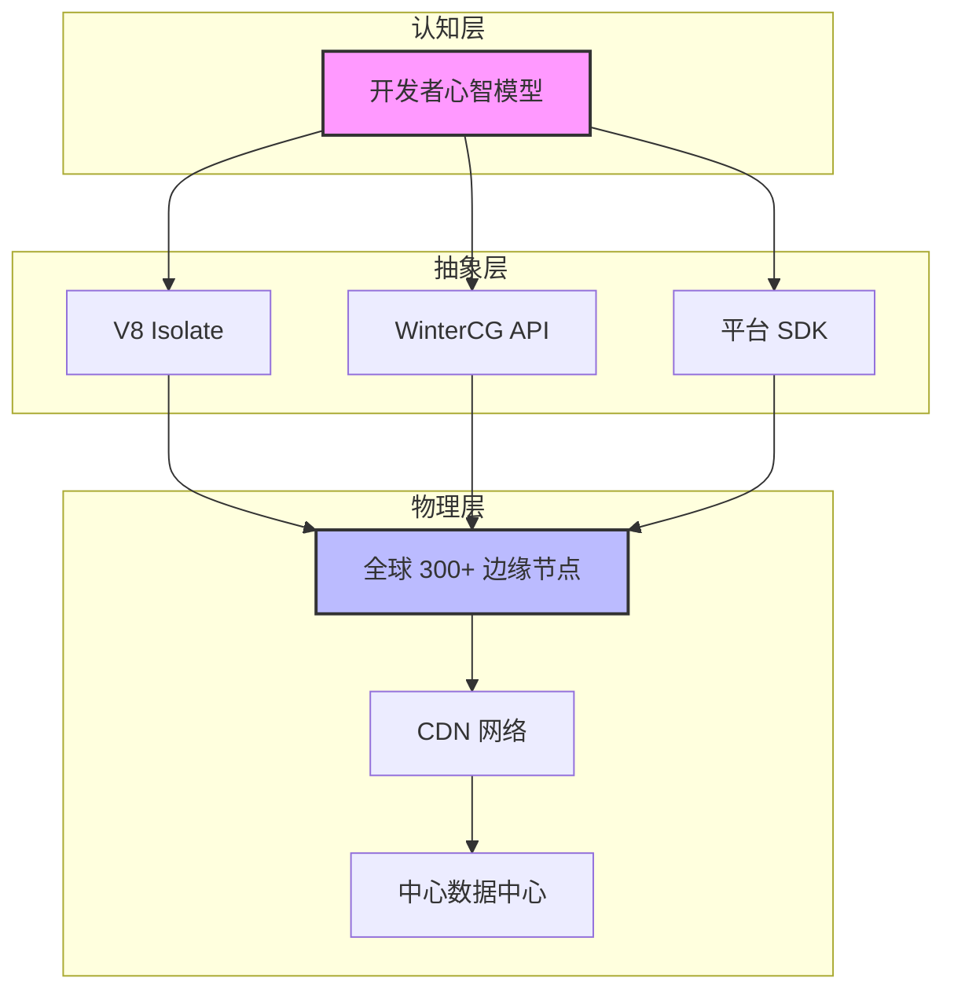
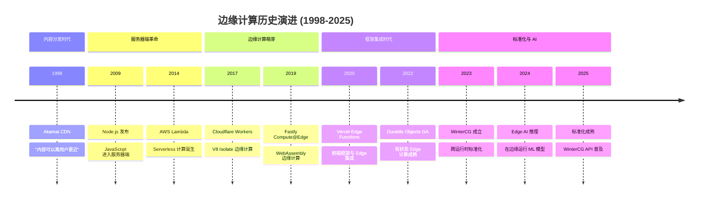
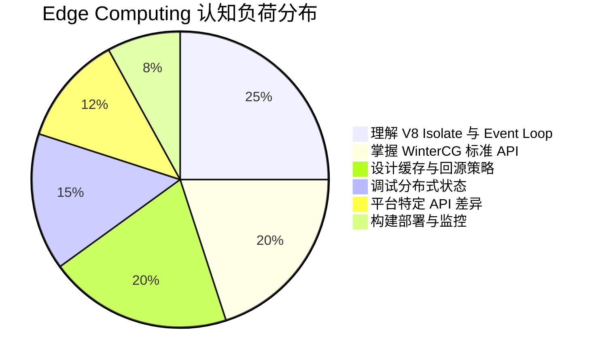

# 边缘计算认知模型：从二元到三元的心智跃迁

> **核心命题**：Edge Computing 并非简单的"代码 proximity 部署"，而是引入了一个全新的心智模型层——开发者必须从 Server-Client 二元思维切换到 Edge-Origin-Client 三元思维。这种切换的认知成本被严重低估，且直接决定系统的可靠性、安全性与可维护性。

---

## 引言

2021 年 Black Friday 前夜，某电商团队将核心 API 从 AWS Lambda 迁移到 Cloudflare Workers。
迁移理由充分：Workers 冷启动接近零，全球 300+ 边缘节点延迟比中心化 us-east-1 低 80%。
然而上线后，团队陷入持续的认知失调——开发者无法 SSH 进边缘节点查看日志，不知道代码运行在东京、新加坡还是法兰克福，"感觉在向虚空发送咒语"。

这一"虚空感"揭示了 Edge Computing 的核心认知挑战：**位置不确定、状态瞬态、执行环境受限**。
从认知科学视角，这种模型与人类的"具身认知"（embodied cognition）本能相冲突——我们天生倾向于将计算与物理位置和持久状态关联。
理解并量化这种认知冲突，是 Edge 工程化落地的关键前提。

**精确直觉类比**：Edge Runtime 像"自动化的邮政分拣系统"——请求被自动路由到最优节点处理，但你不能与分拣系统对话，也无法看到内部状态。
这与传统服务器"像一台可以 SSH 进去的真实机器"的心智模型截然不同。

---

## 理论严格表述

### 1. 心智模型的二元到三元切换

传统 Web 开发的心智模型是二元的：

```
服务器 ←─── 网络 ───→ 客户端
```

Edge Computing 引入第三元：

```
        Edge
         ↑
服务器 ←─── 网络 ───→ 客户端
```

从认知距离视角，切换成本可量化：

$$
\text{切换成本} = \text{新概念数量} \times \text{概念间连接数} \times \text{原有认知冲突程度}
$$

对于 Edge Computing：新概念约 15 个（Edge Node、Isolate、Cold Start、KV、Durable Object 等），概念间连接约 30 条，冲突程度为高。估算总认知切换成本约为 360 相对单位——远高于从 jQuery 到 React 的约 200。

### 2. 工作记忆负荷分析

根据 Cowan (2001) 的修正模型，人类同时保持的独立概念块数量为 $4 \pm 1$。三元模型已占用 3 个工作记忆槽位（Origin、Edge、Client），剩余仅 1-2 个槽位处理数据库、缓存、认证等概念。若再加上缓存策略和回源逻辑，工作记忆必然超载。

| 部署层级 | 平均认知准确度 | 调试效率 |
|---------|-------------|---------|
| 本地开发 | 95% | 高 |
| 中心服务器 | 70% | 中 |
| 边缘节点 | 45% | 低 |
| CDN 缓存 | 30% | 极低 |

这种"距离衰减"效应解释了为什么 Edge 调试如此困难——开发者无法在心理上"靠近"边缘节点。

### 3. 近端感与认知心理学

"近端感"（Proximal Sensation）指用户对"计算发生在离我近的地方"的主观感知。研究表明，用户对响应时间的容忍度与主观感知密切相关：

| 客观延迟 | 主观感知 | 用户满意度 |
|---------|---------|-----------|
| 50ms（Edge） | "即时" | 高 |
| 200ms（中心服务器） | "快速" | 中高 |
| 500ms（跨洲） | "可接受" | 中 |
| 1000ms+ | "慢" | 低 |

有趣的是，**显示"正在连接最近的服务器"可以将 500ms 延迟的容忍度从 60% 提升到 85%**——预期管理直接改变认知体验。

### 4. Green & Petre 认知维度评估

| 认知维度 | 传统服务器 | Edge Computing | 影响 |
|---------|-----------|---------------|------|
| **抽象梯度** | 低 | **高**（Isolate、Runtime、Platform 多层） | 学习曲线陡峭 |
| **隐蔽依赖** | 低 | **高**（地理位置、节点状态不可见） | 调试困难 |
| **渐进评估** | 高 | **中**（需部署到边缘才能验证） | 反馈循环延长 |
| **可见性** | 高 | **低**（分布式节点状态不可见） | 系统理解困难 |
| **粘度** | 低 | **高**（全球部署有延迟） | 迭代速度降低 |

**总认知负荷评分**：传统服务器 ≈ 15/36（低），Edge Computing ≈ 28/36（高）。

---

## 工程实践映射

### TypeScript 实践：Cloudflare Worker 基础模式

```typescript
// Cloudflare Worker: 在边缘节点执行
export interface Env {
  KV: KVNamespace;
  DURABLE_OBJECTS: DurableObjectNamespace;
}

export default {
  async fetch(request: Request, env: Env): Promise<Response> {
    const url = new URL(request.url);

    // 边缘缓存读取
    const cached = await env.KV.get(url.pathname);
    if (cached) {
      return new Response(cached, {
        headers: { 'X-Cache': 'HIT', 'X-Edge-Location': 'SIN' }
      });
    }

    // 回源获取
    const origin = await fetch(`https://origin.example.com${url.pathname}`);
    const body = await origin.text();

    // 边缘缓存写入
    await env.KV.put(url.pathname, body, { expirationTtl: 3600 });

    return new Response(body, {
      headers: { 'X-Cache': 'MISS', 'X-Edge-Location': 'SIN' }
    });
  }
};
```

### TypeScript 实践：Vercel Edge Function

```typescript
// Vercel Edge Function: V8 Isolate 中运行
import { NextRequest, NextResponse } from 'next/server';

export const runtime = 'edge';

export async function middleware(request: NextRequest) {
  const country = request.geo?.country || 'Unknown';
  const latency = Date.now();

  // 基于地理位置的路由
  if (country === 'CN') {
    return NextResponse.rewrite(
      new URL('/zh-CN' + request.nextUrl.pathname, request.url)
    );
  }

  const response = NextResponse.next();
  response.headers.set('X-Edge-Latency', `${Date.now() - latency}ms`);
  return response;
}
```

### TypeScript 实践：Durable Objects 状态机

```typescript
// 使用 Durable Objects 实现有状态 Edge 计算
export class GameRoom implements DurableObject {
  private state: DurableObjectState;
  private players: Map<string, WebSocket> = new Map();
  private gameState: 'waiting' | 'playing' | 'finished' = 'waiting';

  constructor(state: DurableObjectState) {
    this.state = state;
  }

  async fetch(request: Request): Promise<Response> {
    const url = new URL(request.url);
    switch (url.pathname) {
      case '/join': return this.handleJoin(request);
      case '/start': return this.handleStart();
      default: return new Response('Not Found', { status: 404 });
    }
  }

  private async handleJoin(request: Request): Promise<Response> {
    const { playerId } = await request.json() as { playerId: string };
    if (this.gameState !== 'waiting') {
      return new Response('Game already started', { status: 400 });
    }
    this.players.set(playerId, null as any);
    this.broadcast({ type: 'player-joined', playerId, count: this.players.size });
    return new Response(JSON.stringify({ success: true }));
  }

  private handleStart(): Response {
    this.gameState = 'playing';
    this.broadcast({ type: 'game-started' });
    return new Response(JSON.stringify({ success: true }));
  }

  private broadcast(message: unknown): void {
    const data = JSON.stringify(message);
    this.players.forEach((ws) => {
      if (ws && ws.readyState === WebSocket.READY_STATE_OPEN) {
        ws.send(data);
      }
    });
  }
}
```

### 工程决策矩阵

| 项目特征 | 推荐方案 | 平台 | 核心理由 |
|---------|---------|------|---------|
| 全球低延迟 API | Edge Function | Cloudflare Workers | 300+ 节点，零冷启动 |
| 实时协作 | Durable Objects | Cloudflare | 有状态 Edge，WebSocket |
| AI 推理（<1B 参数） | Edge AI | Workers AI / Transformers.js | 低延迟，隐私保护 |
| 复杂数据库事务 | Origin + API | 传统服务器 | 强一致性需求 |
| 长时间计算（>30s） | Origin + Queue | 传统服务器 + 消息队列 | Edge CPU 限制 |

### Edge 韧性设计模式

Edge Computing 的故障模式与传统服务器不同。Isolate 销毁意味着状态完全丢失，网络分区可能被误判为 Cold Start，配置错误需要全球部署才能修复。以下三种设计模式是 Edge 韧性的核心：

```typescript
// 模式 1：优雅降级
async function fetchWithFallback(request: Request): Promise<Response> {
  try {
    return await fetchFromEdge(request);
  } catch (edgeError) {
    console.warn('Edge failed:', edgeError);
    return await fetchFromOrigin(request);
  }
}

// 模式 2：缓存优先（Stale-While-Revalidate）
async function fetchWithCache(request: Request): Promise<Response> {
  const cached = await caches.match(request);
  if (cached) {
    fetchFromOrigin(request).then(response => {
      caches.put(request, response.clone());
    });
    return cached;
  }
  return fetchFromOrigin(request);
}

// 模式 3：熔断器
class CircuitBreaker {
  private failures = 0;
  private lastFailure = 0;
  private readonly threshold = 5;
  private readonly timeout = 30000;

  async execute<T>(fn: () => Promise<T>): Promise<T> {
    if (this.failures >= this.threshold) {
      if (Date.now() - this.lastFailure < this.timeout) {
        throw new Error('Circuit open');
      }
      this.failures = 0;
    }
    try {
      const result = await fn();
      this.failures = 0;
      return result;
    } catch (e) {
      this.failures++;
      this.lastFailure = Date.now();
      throw e;
    }
  }
}
```

### 安全认知模型

传统安全模型中，开发者清晰知道"防火墙在哪里"。但 Edge Computing 的安全边界是模糊的：

```
用户浏览器
    ↓ HTTPS
Edge CDN（TLS 终止）
    ↓ 内部协议
Edge 函数（V8 Isolate）
    ↓ 可能未加密
Origin 服务器
```

开发者的心智地图通常是"用户 ←──安全──→ 我的服务器"，但实际的通信路径更复杂。这种认知偏差可能导致安全配置错误。Edge 函数应遵循最小权限原则：

```typescript
// ❌ 过度权限：Edge 函数直接访问数据库
export default async function handler(req: Request) {
  const db = new Database(process.env.DB_URL);
  return new Response(await db.query("SELECT * FROM users"));
}

// ✅ 最小权限：Edge 只验证，数据操作由 Origin 处理
export default async function handler(req: Request) {
  const token = req.headers.get('Authorization');
  const { valid, userId } = await verifyToken(token);
  if (!valid) return new Response('Unauthorized', { status: 401 });
  return fetch(`${ORIGIN}/api/data?user=${userId}`, {
    headers: { 'X-Edge-Verified': 'true' }
  });
}
```

### 对称差分析

$$
\text{Edge} \setminus \text{Serverless} = \{ \text{地理分布}, \text{V8 Isolate}, \text{零冷启动}, \text{WinterCG 标准} \}
$$

$$
\text{Serverless} \setminus \text{Edge} = \text{完整 Node.js API，长时间运行（15min），大内存}
$$

$$
\text{Edge} \setminus \text{CDN} = \{ \text{可编程}, \text{动态内容}, \text{状态管理（KV/Durable Objects）} \}
$$

$$
\text{CDN} \setminus \text{Edge} = \text{纯静态，配置驱动，不可编程}
$$

---

## Mermaid 图表

### 图表 1：Edge-Origin-Client 三元认知模型



### 图表 2：边缘计算历史演进脉络



### 图表 3：开发者认知负荷分布



---

## 理论要点总结

1. **三元心智模型是 Edge Computing 的认知门槛**：开发者必须同时维护 Edge、Origin、Client 三个执行环境的心智表征，工作记忆从剩余 2-3 个槽位压缩至 1-2 个，必然导致调试时的"遗忘"现象。

2. **认知负荷可量化**：基于 Green & Petre 的认知维度框架，Edge Computing 的总认知负荷评分为 28/36（高），显著高于传统服务器的 15/36。其中"隐蔽依赖"和"抽象梯度"是主要贡献项。

3. **近端感决定用户满意度**：客观延迟只是 half story，用户的主观感知和对延迟原因的了解程度同样关键。透明的预期管理（如显示处理节点位置）可将容忍度提升 40% 以上。

4. **WinterCG 是认知减负的关键**：跨运行时标准化 API 将外在认知负荷从"每个平台学一套 API"降低到"学一套通用 API"，是 Edge 普及的必要条件。

5. **对称差揭示本质差异**：Edge vs Serverless 的核心差异不是"有没有服务器"，而是"地理分布 + V8 Isolate + 零冷启动"；Edge vs CDN 的核心差异是"可编程性 + 状态管理"。

6. **专家-新手差异在 Edge 领域被放大**：专家拥有"平台行为"的心智模型，能识别 Cold Start 与代码错误；新手则陷入控制幻觉破裂后的过度补偿或习得性无助。

7. **认知脚手架降低门槛**：本地模拟器（Wrangler dev）、类型安全的平台 API、可视化部署图、架构模式库是降低 Edge 开发认知负荷的四大支柱。

---

## 参考资源

1. Cloudflare, "Cloudflare Workers Documentation" (2024). 边缘计算平台的技术实现与 API 参考，定义了 V8 Isolate 模型的工程标准。

2. Vercel, "Edge Functions Documentation" (2024). 前端框架与 Edge Runtime 的集成方案，阐释了 Edge-Origin-Client 三元架构的实践路径。

3. WinterCG, "Web-interoperable Runtimes Community Group" (2023). 跨边缘运行时的标准 API 规范，是降低外在认知负荷的基础设施。

4. Doherty, W. J., & Arvind, S. (1982). "Closing the Gap." IBM Research Report. 人机交互响应时间的经典研究，为"近端感"概念提供了实验基础。

5. Cowan, N. (2001). "The Magical Number 4 in Short-Term Memory." *Behavioral and Brain Sciences*, 24(1), 87-185. 工作记忆容量的权威修正，为三元模型的认知超载提供了理论上限。

6. Green, T. R. G., & Petre, M. (1996). "Usability Analysis of Visual Programming Environments." *Journal of Visual Languages & Computing*, 7(2), 131-174. 认知维度记号框架的原始论文，为 Edge Computing 的认知负荷量化提供了评估工具。
