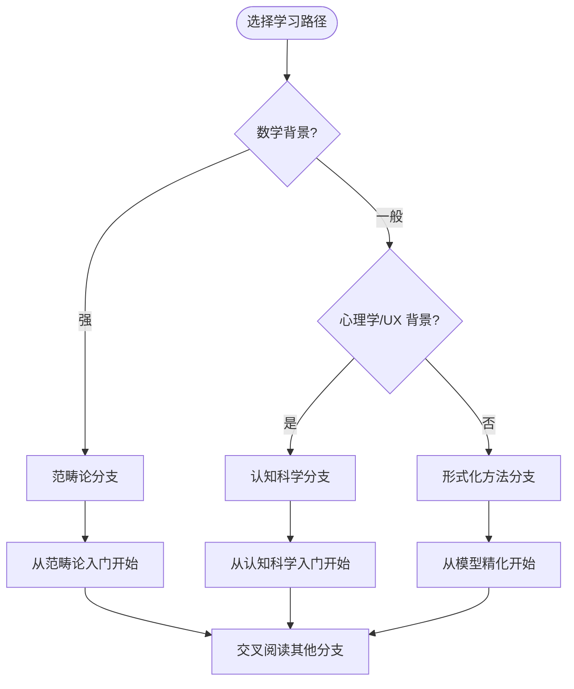

# 🧠 理论基础

> 深入 JavaScript/TypeScript 的数学基础、认知科学与形式化分析，构建严谨的技术思维框架。

## 范畴论与计算范式 (70.1)

从范畴论视角分析编程语言构造，涵盖类型系统、运行时语义、控制流、并发模型等核心主题。

### 文档目录

| 编号 | 主题 | 文件 |
|------|------|------|
| 01 | 范畴论入门 | [查看](../../70-theoretical-foundations/70.1-category-theory-and-computational-paradigms/01-category-theory-primer-for-programmers.md) |
| 02 | 笛卡尔闭范畴与 TypeScript | [查看](../../70-theoretical-foundations/70.1-category-theory-and-computational-paradigms/02-cartesian-closed-categories-and-typescript.md) |
| 03 | 函子与自然变换 | [查看](../../70-theoretical-foundations/70.1-category-theory-and-computational-paradigms/03-functors-natural-transformations-in-js.md) |
| 04 | 单子与代数效应 | [查看](../../70-theoretical-foundations/70.1-category-theory-and-computational-paradigms/04-monads-algebraic-effects-comparison.md) |
| 05 | 极限与余极限 | [查看](../../70-theoretical-foundations/70.1-category-theory-and-computational-paradigms/05-limits-colimits-and-aggregation-patterns.md) |
| 06 | 伴随与自由遗忘对 | [查看](../../70-theoretical-foundations/70.1-category-theory-and-computational-paradigms/06-adjunctions-and-free-forgetful-pairs.md) |
| 07 | Yoneda 引理 | [查看](../../70-theoretical-foundations/70.1-category-theory-and-computational-paradigms/07-yoneda-lemma-and-representable-functors.md) |
| 08 | Topos 理论与类型系统 | [查看](../../70-theoretical-foundations/70.1-category-theory-and-computational-paradigms/08-topos-theory-and-type-systems.md) |
| 09 | 计算范式作为范畴 | [查看](../../70-theoretical-foundations/70.1-category-theory-and-computational-paradigms/09-computational-paradigms-as-categories.md) |
| 10 | Rust vs TypeScript 范畴分析 | [查看](../../70-theoretical-foundations/70.1-category-theory-and-computational-paradigms/10-rust-vs-typescript-category-theory-analysis.md) |
| 11 | 控制流的范畴构造 | [查看](../../70-theoretical-foundations/70.1-category-theory-and-computational-paradigms/11-control-flow-as-categorical-constructs.md) |
| 12 | 运行时模型范畴语义 | [查看](../../70-theoretical-foundations/70.1-category-theory-and-computational-paradigms/12-runtime-model-categorical-semantics.md) |
| 13 | 变量系统范畴分析 | [查看](../../70-theoretical-foundations/70.1-category-theory-and-computational-paradigms/13-variable-system-categorical-analysis.md) |
| 14 | 事件系统范畴语义 | [查看](../../70-theoretical-foundations/70.1-category-theory-and-computational-paradigms/14-event-systems-and-message-passing-categorical-semantics.md) |
| 15 | 并发计算模型 | [查看](../../70-theoretical-foundations/70.1-category-theory-and-computational-paradigms/15-concurrent-computation-models.md) |
| **16** | **Server Components 范畴语义** ⭐新 | [查看](../../70-theoretical-foundations/70.1-category-theory-and-computational-paradigms/16-server-components-categorical-semantics.md) |
| **17** | **Signals 范式范畴论** ⭐新 | [查看](../../70-theoretical-foundations/70.1-category-theory-and-computational-paradigms/17-signals-paradigm-category-theory.md) |
| **18** | **Islands 架构范畴语义** ⭐新 | [查看](../../70-theoretical-foundations/70.1-category-theory-and-computational-paradigms/18-islands-architecture-categorical-semantics.md) |
| **19** | **构建工具范畴论** ⭐新 | [查看](../../70-theoretical-foundations/70.1-category-theory-and-computational-paradigms/19-build-tools-category-theory.md) |
| **20** | **Web Components 形式语义** ⭐新 | [查看](../../70-theoretical-foundations/70.1-category-theory-and-computational-paradigms/20-web-components-formal-semantics.md) |

---

## 认知交互模型 (70.2)

从认知科学角度分析前端框架、UI 设计与开发者体验，建立人机交互的理论基础。

### 文档目录

| 编号 | 主题 | 文件 |
|------|------|------|
| 01 | 开发者认知科学入门 | [查看](../../70-theoretical-foundations/70.2-cognitive-interaction-models/01-cognitive-science-primer-for-developers.md) |
| 02 | 心智模型与编程语言 | [查看](../../70-theoretical-foundations/70.2-cognitive-interaction-models/02-mental-models-and-programming-languages.md) |
| 03 | JavaScript 工作记忆负荷 | [查看](../../70-theoretical-foundations/70.2-cognitive-interaction-models/03-working-memory-load-in-javascript.md) |
| 04 | UI 框架概念模型 | [查看](../../70-theoretical-foundations/70.2-cognitive-interaction-models/04-conceptual-models-of-ui-frameworks.md) |
| 05 | React 代数效应认知分析 | [查看](../../70-theoretical-foundations/70.2-cognitive-interaction-models/05-react-algebraic-effects-cognitive-analysis.md) |
| 06 | Vue 响应式认知模型 | [查看](../../70-theoretical-foundations/70.2-cognitive-interaction-models/06-vue-reactivity-cognitive-model.md) |
| 07 | Angular 架构认知负荷 | [查看](../../70-theoretical-foundations/70.2-cognitive-interaction-models/07-angular-architecture-cognitive-load.md) |
| 08 | 渲染引擎认知感知 | [查看](../../70-theoretical-foundations/70.2-cognitive-interaction-models/08-rendering-engine-cognitive-perception.md) |
| 09 | 数据流与认知轨迹 | [查看](../../70-theoretical-foundations/70.2-cognitive-interaction-models/09-data-flow-and-cognitive-trajectory.md) |
| 10 | 异步并发认知模型 | [查看](../../70-theoretical-foundations/70.2-cognitive-interaction-models/10-async-concurrency-cognitive-models.md) |
| 11 | 专家与新手差异 | [查看](../../70-theoretical-foundations/70.2-cognitive-interaction-models/11-expert-novice-differences-in-js-ts.md) |
| 12 | 多模态交互理论 | [查看](../../70-theoretical-foundations/70.2-cognitive-interaction-models/12-multimodal-interaction-theory.md) |
| 13 | 前端框架计算模型 | [查看](../../70-theoretical-foundations/70.2-cognitive-interaction-models/13-frontend-framework-computation-models.md) |
| 14 | 浏览器渲染引擎原理 | [查看](../../70-theoretical-foundations/70.2-cognitive-interaction-models/14-browser-rendering-engine-principles.md) |
| **15** | **边缘计算认知模型** ⭐新 | [查看](../../70-theoretical-foundations/70.2-cognitive-interaction-models/15-edge-computing-cognitive-model.md) |
| **16** | **现代技术栈开发者认知模型** ⭐新 | [查看](../../70-theoretical-foundations/70.2-cognitive-interaction-models/16-developer-cognitive-modern-stack.md) |

---

## 多模型形式分析 (70.3)

运用多种数学模型（操作语义、指称语义、公理化方法）对 JS/TS 进行统一的形式化分析。

### 文档目录

| 编号 | 主题 | 文件 |
|------|------|------|
| 01 | 模型细化与仿真 | [查看](../../70-theoretical-foundations/70.3-multi-model-formal-analysis/01-model-refinement-and-simulation.md) |
| 02 | 操作语义与指称语义对应 | [查看](../../70-theoretical-foundations/70.3-multi-model-formal-analysis/02-operational-denotational-axiomatic-correspondence.md) |
| 03 | 类型运行时对称差分 | [查看](../../70-theoretical-foundations/70.3-multi-model-formal-analysis/03-type-runtime-symmetric-difference.md) |
| 04 | 响应式模型适配 | [查看](../../70-theoretical-foundations/70.3-multi-model-formal-analysis/04-reactive-model-adaptation.md) |
| 05 | 多模型范畴构造 | [查看](../../70-theoretical-foundations/70.3-multi-model-formal-analysis/05-multi-model-category-construction.md) |
| 06 | 语义学中的对角线论证 | [查看](../../70-theoretical-foundations/70.3-multi-model-formal-analysis/06-diagonal-arguments-in-semantics.md) |
| 07 | 综合响应理论 | [查看](../../70-theoretical-foundations/70.3-multi-model-formal-analysis/07-comprehensive-response-theory.md) |
| 08 | 框架范式互操作性 | [查看](../../70-theoretical-foundations/70.3-multi-model-formal-analysis/08-framework-paradigm-interoperability.md) |
| 09 | 模型间隙形式验证 | [查看](../../70-theoretical-foundations/70.3-multi-model-formal-analysis/09-formal-verification-of-model-gaps.md) |
| 10 | JS/TS 统一元模型 | [查看](../../70-theoretical-foundations/70.3-multi-model-formal-analysis/10-unified-metamodel-for-js-ts.md) |
| 11 | 执行框架渲染三角 | [查看](../../70-theoretical-foundations/70.3-multi-model-formal-analysis/11-execution-framework-rendering-triangle.md) |
| **12** | **元框架对称差分** ⭐新 | [查看](../../70-theoretical-foundations/70.3-multi-model-formal-analysis/12-meta-framework-symmetric-difference.md) |
| **13** | **统一前端架构分析** ⭐新 | [查看](../../70-theoretical-foundations/70.3-multi-model-formal-analysis/13-unified-frontend-architecture-analysis.md) |

---

## 边缘运行时与 Serverless (70.5) ⭐新

边缘计算与 Serverless 架构的 L0 级理论深度分析，覆盖 Edge Runtime、WASM、SSR、Edge DB、RPC、安全、CRDT、AI 推理等前沿主题。

### 文档目录

| 编号 | 主题 | 文件 |
|------|------|------|
| 34 | Edge Runtime 架构对比 | [查看](../../70-theoretical-foundations/70.5-edge-runtime-and-serverless/34-edge-runtime-architecture.md) |
| 35 | WebAssembly 边缘化 | [查看](../../70-theoretical-foundations/70.5-edge-runtime-and-serverless/35-webassembly-edge.md) |
| 36 | 同构渲染与 Edge SSR | [查看](../../70-theoretical-foundations/70.5-edge-runtime-and-serverless/36-isomorphic-rendering-and-edge-ssr.md) |
| 37 | Edge 数据库与状态管理 | [查看](../../70-theoretical-foundations/70.5-edge-runtime-and-serverless/37-edge-databases.md) |
| 38 | Edge KV 与缓存策略 | [查看](../../70-theoretical-foundations/70.5-edge-runtime-and-serverless/38-edge-kv-and-caching.md) |
| 39 | RPC 框架与类型安全传输 | [查看](../../70-theoretical-foundations/70.5-edge-runtime-and-serverless/39-rpc-frameworks.md) |
| 40 | Serverless 冷启动与成本模型 | [查看](../../70-theoretical-foundations/70.5-edge-runtime-and-serverless/40-serverless-coldstart.md) |
| 41 | 边缘安全与零信任架构 | [查看](../../70-theoretical-foundations/70.5-edge-runtime-and-serverless/41-edge-security-and-zero-trust.md) |
| 42 | 实时协同与 CRDT | [查看](../../70-theoretical-foundations/70.5-edge-runtime-and-serverless/42-realtime-collaboration-and-crdt.md) |
| 43 | 边缘 AI 推理与模型服务 | [查看](../../70-theoretical-foundations/70.5-edge-runtime-and-serverless/43-edge-ai-inference.md) |
| 44 | 全栈 TypeScript 部署拓扑 | [查看](../../70-theoretical-foundations/70.5-edge-runtime-and-serverless/44-fullstack-deployment-topology.md) |
| 45 | 边缘可观测性与分布式追踪 | [查看](../../70-theoretical-foundations/70.5-edge-runtime-and-serverless/45-edge-observability.md) |

---

---

## Web 平台机制 (70.4)

浏览器作为运行时平台的全栈机制深度分析，覆盖网络协议、安全模型、存储架构、并发模型等核心基础设施。

### 文档目录

| 编号 | 主题 | 文件 |
|------|------|------|
| 21 | 同源策略与跨域安全 | [查看](../../70-theoretical-foundations/70.4-web-platform-fundamentals/21-same-origin-policy-and-cross-origin-security.md) |
| 22 | Web 缓存架构 | [查看](../../70-theoretical-foundations/70.4-web-platform-fundamentals/22-web-caching-architecture.md) |
| 23 | WebSocket 与实时通信 | [查看](../../70-theoretical-foundations/70.4-web-platform-fundamentals/23-websocket-and-realtime-protocols.md) |
| 24 | HTTP 协议栈 | [查看](../../70-theoretical-foundations/70.4-web-platform-fundamentals/24-http-protocol-stack.md) |
| 25 | 事件循环与并发模型 | [查看](../../70-theoretical-foundations/70.4-web-platform-fundamentals/25-event-loop-and-concurrency-model.md) |
| 26 | Web 安全威胁模型 | [查看](../../70-theoretical-foundations/70.4-web-platform-fundamentals/26-web-security-threat-model.md) |
| 27 | 浏览器存储与持久化 | [查看](../../70-theoretical-foundations/70.4-web-platform-fundamentals/27-browser-storage-and-persistence.md) |
| 28 | Web Workers 与并行计算 | [查看](../../70-theoretical-foundations/70.4-web-platform-fundamentals/28-web-workers-and-parallelism.md) |
| 29 | CSS 架构与渲染管线 | [查看](../../70-theoretical-foundations/70.4-web-platform-fundamentals/29-css-architecture-and-rendering.md) |
| 30 | 资源加载与性能优化 | [查看](../../70-theoretical-foundations/70.4-web-platform-fundamentals/30-resource-loading-and-performance.md) |
| 31 | 导航与页面生命周期 | [查看](../../70-theoretical-foundations/70.4-web-platform-fundamentals/31-navigation-and-page-lifecycle.md) |
| 32 | 模块化系统与 Web Components | [查看](../../70-theoretical-foundations/70.4-web-platform-fundamentals/32-module-system-and-web-components.md) |
| 33 | 权限模型与隐私沙盒 | [查看](../../70-theoretical-foundations/70.4-web-platform-fundamentals/33-permissions-and-privacy-sandbox.md) |

---

## 辅助文档

- [交叉引用索引](../../70-theoretical-foundations/CROSS_REFERENCE.md)
- [跟进计划](../../70-theoretical-foundations/FOLLOW_UP_PLAN.md)
- [知识图谱](../../70-theoretical-foundations/KNOWLEDGE_GRAPH.md)
- [主计划](../../70-theoretical-foundations/MASTER_PLAN.md)
- [符号指南](../../70-theoretical-foundations/NOTATION_GUIDE.md)

---

## 学习路径导航

理论前沿专题包含五大分支，建议根据背景选择切入点：

### 路径 1：范畴论深度（数学导向）

适合有抽象代数或函数式编程背景的读者：

1. [范畴论入门](cat-01-category-theory-primer.md) — 建立范畴论的基本语言
2. [笛卡尔闭范畴与 TypeScript](cat-02-cartesian-closed-categories.md) — 将范畴论映射到类型系统
3. [函子与自然变换](cat-03-functors-natural-transformations.md) — 理解映射与结构保持
4. [Monad 与代数效应](cat-04-monads-algebraic-effects.md) — 控制流的形式化
5. [Yoneda 引理](cat-07-yoneda-lemma.md) — 范畴论的核心定理

### 路径 2：认知科学应用（工程导向）

适合关注开发者体验与 UI 设计的读者：

1. [认知科学入门](cog-01-cognitive-science-primer.md) — 理解人类认知限制
2. [心智模型与编程语言](cog-02-mental-models.md) — 类型系统的心智成本
3. [工作记忆负荷](cog-03-working-memory.md) — 异步代码的认知负担
4. [UI 框架概念模型](cog-04-conceptual-models-ui.md) — 框架切换成本分析
5. [专家与新手差异](cog-11-expert-novice.md) — 团队技能分层策略

### 路径 3：形式化方法（研究导向）

适合对语言语义和程序验证感兴趣的读者：

1. [模型精化与仿真](mm-01-model-refinement.md) — 规范到实现的精化链
2. [语义对应理论](mm-02-semantics-correspondence.md) — 三种语义的统一视角
3. [类型与运行时对称差](mm-03-type-runtime-difference.md) — 渐进类型的形式化
4. [模型间隙形式化验证](mm-09-formal-verification.md) — TLA+/Coq 验证实践
5. [统一元模型](mm-10-unified-metamodel.md) — JS/TS 的四视角整合

---

## 理论层次映射

理论前沿专题的内容与 [理论层次总论](/theoretical-hierarchy/) 形成双向映射：

| 理论前沿内容 | 对应层次 | 理论层次主题 |
|-------------|---------|-------------|
| 范畴论基础 | L0 → L1 | 数学到计算 |
| 类型系统范畴语义 | L1 → L2 | 计算到语言 |
| 认知负荷分析 | L2 ↔ L6 | 语言与 UI 的交互 |
| 响应式系统形式化 | L3 | 编程范式 |
| 框架模型范畴论 | L3 → L4 | 范式到框架 |
| 形式化验证 | L0 → L5 | 数学贯穿到应用 |

---

## 与工程实践的双轨连接

理论前沿专题的每篇文档均遵循**双轨并行**结构：

- **理论严格表述**：形式化定义、定理证明、数学推导
- **工程实践映射**：TypeScript 代码示例、框架源码分析、性能权衡

这种结构确保读者既能建立严谨的数学直觉，又能将理论洞察直接应用于日常开发决策。

---

## 参考资源

### 范畴论经典

- *Category Theory for Programmers* — Bartosz Milewski
- *Basic Category Theory* — Tom Leinster
- *The NLab* (ncatlab.org) — 范畴论在线百科

### 认知科学经典

- *The Psychology of Programming* — Ellen Ullman
- *The Design of Everyday Things* — Don Norman
- *Thinking, Fast and Slow* — Daniel Kahneman

### 形式化方法经典

- *Types and Programming Languages* (TAPL) — Benjamin Pierce
- *Software Foundations* (Coq 教材) — Pierce 等
- *Concrete Semantics* — Tobias Nipkow

### 在线课程

- [Category Theory for Programmers](https://bartoszmilewski.com/2014/10/28/category-theory-for-programmers-the-preface/) — Milewski 的博客系列
- [Software Foundations](https://softwarefoundations.cis.upenn.edu/) — UPenn 的 Coq 课程
- [Type Theory Foundations](https://www.coursera.org/learn/type-theory) — 类型论入门

---

*最后更新: 2026-05-01 | 分类: theoretical-foundations | 层次: L0-L6 全层覆盖*

---

## 贡献与参与

理论前沿专题欢迎以下形式的贡献：

### 内容补充

- **新主题提案**：如果你发现某个重要的理论方向未被覆盖（如线性类型、依赖类型、同伦类型论），请提交 Issue 提案。
- **案例补充**：为现有文档添加新的工程实践案例（如新兴框架的范畴论语义分析）。
- **错误修正**：数学公式、代码示例或引用链接的错误修正。

### 质量基准

所有贡献需满足以下质量标准：

- **准确性**：数学定义和定理引用需经过验证，优先引用权威教材或学术论文。
- **可访问性**：形式化内容需配有直观的编程类比，避免纯符号堆砌。
- **完整性**：每篇文档包含引言、理论表述、工程映射、图表、总结和参考资源六部分。
- **一致性**：符号约定遵循 [符号指南](../../70-theoretical-foundations/NOTATION_GUIDE.md)，术语使用与全站统一。

### 评审流程

1. 提交 Pull Request 至项目仓库
2. 维护者进行数学准确性评审（48小时内）
3. 社区进行可读性反馈（72小时开放讨论）
4. 合并后自动触发构建验证

---

## 常见问题

### Q1: 没有数学背景可以阅读这些文档吗？

可以。每篇文档的**工程实践映射**部分专门为无数学背景的读者设计，通过 TypeScript 代码和框架案例建立直觉。建议从 [认知科学入门](cog-01-cognitive-science-primer.md) 或 [范畴论入门](cat-01-category-theory-primer.md) 开始，这两篇对数学前置知识要求最低。

### Q2: 这些理论对实际工作有什么帮助？

- **架构决策**：范畴论语义帮助你理解不同框架的设计哲学差异（如 React vs Vue 的响应式模型）。
- **性能优化**：认知负荷分析指导你编写更易维护的代码（如减少嵌套、使用显式类型）。
- **技术选型**：形式化验证方法帮助你评估类型系统的安全边界（如何时需要 Runtime 校验）。
- **团队培训**：心智模型理论帮助你设计更有效的技术分享和代码审查流程。

### Q3: 70.x 目录和 website/theoretical-foundations/ 有什么区别？

- **70.x 目录**：保留完整的学术深度版本，包含完整的数学证明、形式化定义和参考文献，适合研究和深度学习。
- **website/theoretical-foundations/**：面向工程实践的摘要版本，简化数学表述并增加代码示例，适合日常参考和团队分享。

两者形成**学术深度**与**工程实用**的双轨体系，读者可根据需求选择合适版本。

---

## 相关专题

- [理论层次总论](/theoretical-hierarchy/) — L0-L6 的全景式理论框架
- [编程原理](/programming-principles/) — 形式化语义与语言设计理论
- [编程范式](/programming-paradigms/) — 计算范式的范畴论分析
- [框架模型](/framework-models/) — 前端框架的范畴论语义
- [应用设计](/application-design/) — 架构模式的理论支撑

---

*维护者: JSTS技术社区 | 协议: CC BY-SA 4.0 | 构建验证: 0 dead links*
