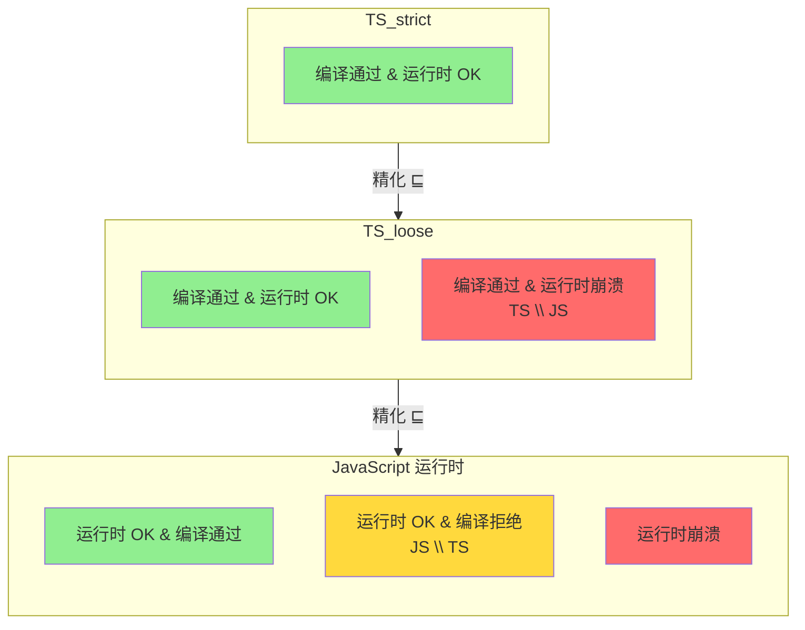
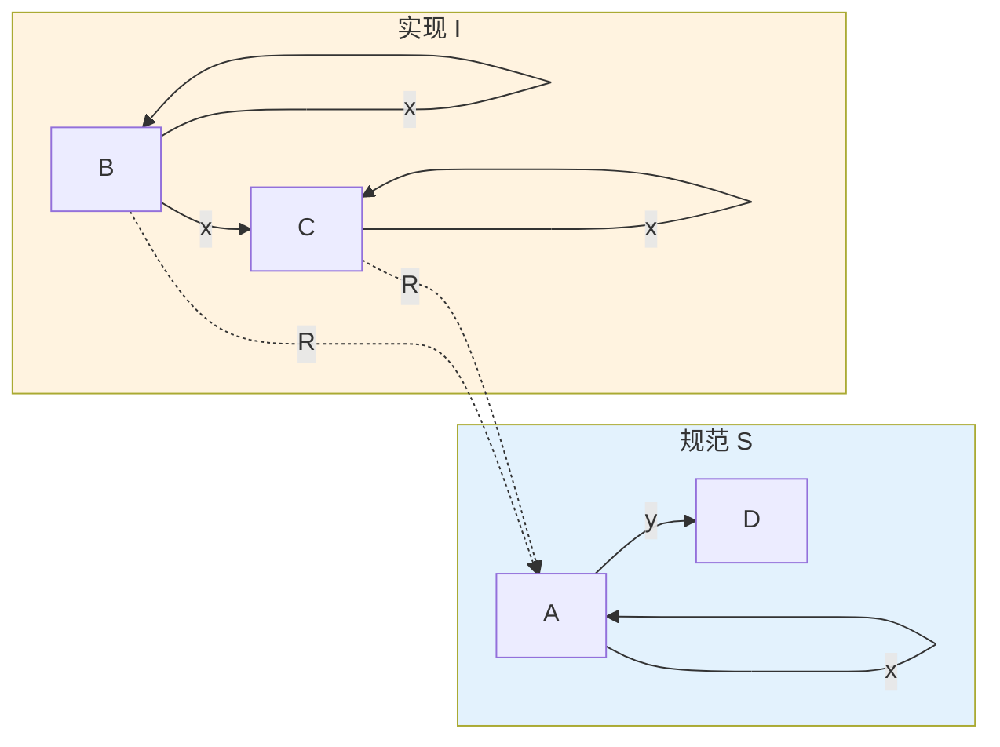
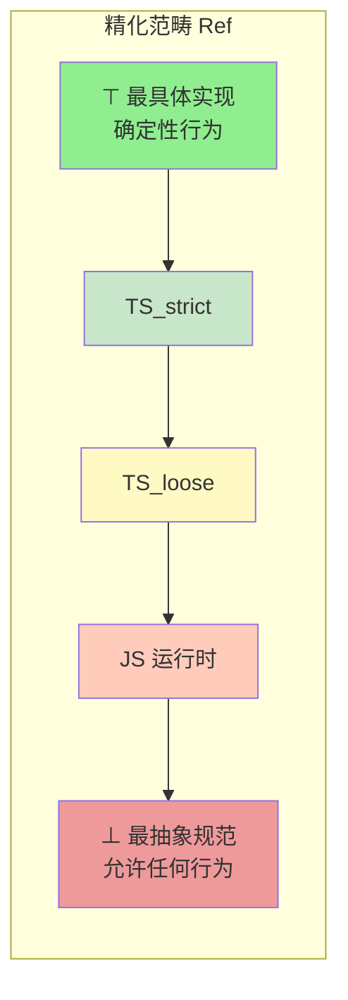

# 模型精化与仿真关系

## 引言

在软件工程的日常实践中，一个核心问题始终困扰着开发者与架构师：**如何形式化地证明"新实现正确遵循了旧规范"？** 传统的单元测试只能证明"在已测试的输入下行为匹配"，而无法覆盖全部输入空间。精化关系（Refinement）与模拟关系（Simulation）正是为回答这一问题而生的形式化工具。

本章从标记转移系统（Labeled Transition System, LTS）出发，建立精化关系的严格数学定义，引入前向模拟与后向模拟作为精化的结构化证明方法，并讨论互模拟（Bisimulation）作为行为精确等价的最强关系。在此基础上，我们将理论映射到 JavaScript 与 TypeScript 的语义分析中，揭示 `TS_strict ⊑ TS_loose ⊑ JS` 这一精化链的深层含义，为工程中的类型配置决策提供形式化依据。

---

## 理论严格表述

### 1. 标记转移系统与精化关系

程序的行为可以通过标记转移系统形式化建模：

$$
M = (S, s_0, A, \to)
$$

其中 $S$ 为状态集合，$s_0 \in S$ 为初始状态，$A$ 为动作标签集合，$\to \subseteq S \times A \times S$ 为转移关系。

**迹精化（Trace Refinement）** 定义如下：

$$
M_1 \sqsubseteq_{\text{trace}} M_2 \iff \text{Traces}(M_1) \subseteq \text{Traces}(M_2)
$$

迹精化要求实现 $M_1$ 的所有可观察动作序列都被规范 $M_2$ 允许。然而，迹精化过于粗糙——它忽略了"在什么状态下拒绝做什么"。更精确的是**失败精化（Failures Refinement）**：

$$
M_1 \sqsubseteq_{\text{failures}} M_2 \iff \text{Failures}(M_1) \supseteq \text{Failures}(M_2)
$$

注意方向反转：失败集合越大，系统越严格，越精化。对于编程语言语义，我们最常使用的是**模拟精化（Simulation Refinement）**，它在结构和行为之间建立了更紧密的对应关系。

### 2. 前向模拟与后向模拟

模拟关系提供了比迹比较更结构化的证明方法。给定实现 $I$ 与规范 $S$，关系 $R \subseteq S_I \times S_S$ 是一个**前向模拟**，当且仅当：

1. **初始状态对应**：$(s_{0I}, s_{0S}) \in R$
2. **步进保持**：若 $(s, t) \in R$ 且 $s \xrightarrow{a}_I s'$，则存在 $t'$ 使得 $t \xrightarrow{a}_S t'$ 且 $(s', t') \in R$

前向模拟的直觉是：**实现能做的每一步，规范都能做**。它证明实现没有"越界"行为。

**后向模拟**则要求：

1. **初始状态对应**：$(s_{0I}, s_{0S}) \in R$
2. **反向步进**：若 $(s, t) \in R$ 且 $t \xrightarrow{a}_S t'$，则存在 $s'$ 使得 $s \xrightarrow{a}_I s'$ 且 $(s', t') \in R$

后向模拟的直觉是：**规范要求做的，实现必须能做**。它证明实现没有"遗漏"行为。

两种模拟不可互换。考虑规范 $S$：状态 $\{A, D\}$，初始 $A$，转移 $A \xrightarrow{x} A, A \xrightarrow{y} D$。实现 $I$：状态 $\{B, C\}$，初始 $B$，转移 $B \xrightarrow{x} B, B \xrightarrow{x} C, C \xrightarrow{x} C$（注意无 $y$ 转移）。定义 $R = \{(B, A), (C, A)\}$，则 $R$ 是前向模拟（实现只做 $x$，规范允许），但不是后向模拟（规范要求 $y$，实现没有）。

### 3. 互模拟：行为的精确等价

关系 $R$ 是一个**互模拟**，当且仅当它同时是前向模拟和后向模拟：

- 若 $(s_1, s_2) \in R$ 且 $s_1 \xrightarrow{a} s_1'$，则存在 $s_2'$ 使 $s_2 \xrightarrow{a} s_2'$ 且 $(s_1', s_2') \in R$
- 若 $(s_1, s_2) \in R$ 且 $s_2 \xrightarrow{a} s_2'$，则存在 $s_1'$ 使 $s_1 \xrightarrow{a} s_1'$ 且 $(s_1', s_2') \in R$

最大互模拟记作 $\sim$。互模拟忽略内部实现差异，只关注可观察行为。例如，整数计数器 $M_1$（状态 $\mathbb{Z}$）与带奇偶追踪的计数器 $M_2$（状态 $\mathbb{Z} \times \{\text{even}, \text{odd}\}$）是互模拟的——奇偶信息是不可观察的内部状态。

### 4. 精化与对称差的消长关系

精化关系与对称差（Symmetric Difference）是互补的分析工具。如果 $M_1 \sqsubseteq M_2$，则：

$$
\Delta(M_1, M_2) = M_2 \setminus M_1
$$

即对称差只剩下"粗化模型接受但精化模型拒绝"的程序。应用到 TypeScript：

$$
TS_{strict} \sqsubseteq TS_{loose} \sqsubseteq JS
$$

因此：
- $\Delta(TS_{strict}, TS_{loose}) = TS_{loose} \setminus TS_{strict}$：严格模式额外拒绝的程序（如 `strictNullChecks` 捕获的错误）
- $\Delta(TS_{loose}, JS) = JS \setminus TS_{loose}$：渐进类型无法捕获的程序

开启严格选项的本质是**收缩 $TS \setminus JS$**（减少编译通过但运行时崩溃的程序），同时可能**扩大 $JS \setminus TS$**（增加运行时正确但被编译器拒绝的程序）。

### 5. 精化作为偏序与范畴构造

精化关系 $\sqsubseteq$ 满足偏序的三个条件：

1. **自反性**：$M \sqsubseteq M$
2. **传递性**：$M_1 \sqsubseteq M_2$ 且 $M_2 \sqsubseteq M_3$ 则 $M_1 \sqsubseteq M_3$
3. **反对称性（在互模拟意义下）**：$M_1 \sqsubseteq M_2$ 且 $M_2 \sqsubseteq M_1$ 则 $M_1 \sim M_2$

由此可构造**精化范畴** $\mathbf{Ref}$：对象为 LTS，态射为精化关系（或其证明——模拟关系），复合为模拟关系的复合。在此范畴中，初始对象为最抽象的规范（允许任何行为），终对象为最具体的实现（确定性行为）。精化范畴是 Poset 范畴的实例，拉回对应"共同精化"，推出对应"最小公共粗化"。

---

## 工程实践映射

### 1. TypeScript 配置作为精化链

在工程实践中，TypeScript 的编译配置直接对应一条精化链。考虑以下三个语义模型：

| 模型 | 接受什么程序 |
|------|-------------|
| $TS_{strict}$ | 类型检查通过且运行时安全的程序 |
| $TS_{loose}$ | 较宽松类型检查通过且运行时安全的程序 |
| $JS$ | 所有能在 JS 引擎中执行的程序 |

精化链为 $TS_{strict} \sqsubseteq TS_{loose} \sqsubseteq JS$。这意味着：

- 从 $TS_{loose}$ 到 $TS_{strict}$：编译器拒绝更多程序，但运行时错误率下降
- 从 $JS$ 到 $TS_{loose}$：类型系统捕获了一部分运行时错误，但由于类型擦除和 `any` 的存在，$TS \setminus JS$ 区域仍然存在

**工程决策依据**：当团队发现生产环境中频繁出现 NullReferenceError 时，开启 `strictNullChecks` 就是在将一部分原本位于 $TS \setminus JS$ 区域的程序移入"被拒绝"区域，从而保护运行时。

### 2. 重构安全的形式化保证

精化关系为"重构是否保持行为"提供了形式化判据。考虑支付模块的重构：

```typescript
// 原始实现
function processPayment(order: Order): Result {
  const validated = validateOrder(order);
  if (!validated.ok) return { success: false, error: validated.error };
  const charged = chargeCard(order.card, order.amount);
  if (!charged.ok) return { success: false, error: charged.error };
  const saved = saveToDatabase(order);
  return { success: saved.ok };
}

// 新实现：增加邮件通知与重试
async function processPaymentV2(order: Order): Promise<Result> {
  const validated = validateOrder(order);
  if (!validated.ok) return { success: false, error: validated.error };
  const charged = await chargeCardWithRetry(order.card, order.amount, { maxRetries: 3 });
  if (!charged.ok) return { success: false, error: charged.error };
  const [saved, emailed] = await Promise.all([
    saveToDatabase(order),
    sendEmail(order.userEmail, "Payment confirmed")
  ]);
  return { success: saved.ok && emailed.ok };
}
```

关键差异：新实现使用 `Promise.all` 并行执行数据库保存和邮件发送。如果邮件失败但数据库保存成功，新实现返回 `success: false`，而旧实现返回 `success: true`。存在一个可观察行为（邮件失败导致整体失败）是旧实现不允许的。因此：**新实现不精化旧实现**。精化关系的形式化分析在重构评审中提供了一套超越单元测试的验证框架。

### 3. 编译器优化的精化验证

编译器优化应保持程序的可观察行为，这正是精化关系的要求：

```typescript
// 原始代码
for (let i = 0; i < 4; i++) { arr[i] = i * 2; }

// 优化后（循环展开）
arr[0] = 0; arr[1] = 2; arr[2] = 4; arr[3] = 6;
```

若将程序建模为"对内存状态的操作序列"，优化前后的程序是互模拟的——产生完全相同的最终内存状态。

然而，利用未定义行为（Undefined Behavior, UB）的"优化"会破坏精化关系：

```c
int foo(int x) { return x + 1 > x; }  // C 代码，x = INT_MAX 时溢出（UB）
// 某些编译器"优化"为：
int foo(int x) { return 1; }  // 假设永远不会溢出
```

当 $x = \text{INT_MAX}$ 时，原始代码的 UB 允许任何事情发生，但优化后的代码返回 1。这不是精化——优化引入了规范中没有的新行为。**Rust 的设计哲学正是避免 UB，确保所有优化都是安全的精化**。

### 4. 渐进类型的精化含义

渐进类型（Gradual Typing）的核心思想是类型标注可以逐步添加。$TS_{loose}$ 比 $JS$ 更严格，但比 $TS_{strict}$ 更宽松。

```typescript
// 程序 p
function greet(name: string) {
  console.log(name.toUpperCase());
}

// TS_loose：greet(null) 编译通过（null 可赋值给 any），运行时错误
// TS_strict：greet(null) 编译错误（strictNullChecks）
```

精化分析：$TS_{loose}$ 接受程序 $p$（传入 null）但运行时失败；$TS_{strict}$ 拒绝程序 $p$。因此 $TS_{strict}$ 的接受集合是 $TS_{loose}$ 的子集——从"拒绝错误程序"的角度，$TS_{strict}$ 精化了 $TS_{loose}$。

`strictFunctionTypes` 的精化效果同样显著。在关闭该选项时，函数参数类型是双变的（bivariant），允许将接受更宽类型的函数赋值给接受更窄类型的函数位置。开启后，这一漏洞被修复，类型系统"误判安全"的程序数量减少，$TS \setminus JS$ 区域随之收缩。

### 5. 证明方法论的系统化

证明 $I \sqsubseteq S$ 的系统方法包括五个步骤：

1. **确定状态空间**：实现的状态 = 程序计数器 + 变量值 + 内存状态；规范的状态 = 更抽象的表示（通常只保留可观察变量）
2. **定义关系 $R$**：每个实现状态映射到至少一个规范状态，保持可观察等价
3. **验证初始状态**：实现的初始状态映射到规范的初始状态
4. **验证步进保持**：实现中的每一步转移，规范中必须有对应转移
5. **处理非确定性**：若实现比规范更非确定，确保规范允许所有可能结果

常见陷阱包括：内部状态泄漏（实现暴露了规范未定义的方法）、时间行为差异（同步规范 vs 异步实现）、资源约束差异（$O(n^2)$ 内存实现 vs $O(n)$ 内存规范）。

---

## Mermaid 图表

### 图表 1：TypeScript 精化链与三区域划分



### 图表 2：前向模拟与后向模拟的不可互换性



此图展示了经典的不可互换反例：$R = \{(B, A), (C, A)\}$ 是前向模拟（实现的 $x$ 转移在规范中都有对应），但不是后向模拟（规范要求 $y$ 转移，实现没有）。

### 图表 3：精化范畴中的拉回与推出



---

## 理论要点总结

1. **精化关系是单向的行为包含**：实现的所有可观察行为必须在规范的允许范围内。与等价不同，精化允许实现比规范更详细、更确定，但不能"越界"。

2. **模拟关系是精化的结构化证明工具**：前向模拟证明实现没有非法行为（实现能做的，规范都能做），后向模拟证明实现没有遗漏行为（规范要求的，实现必须能做）。两者不可互换。

3. **互模拟是最强的行为等价**：它同时要求前向和后向模拟，忽略内部状态差异，只关注可观察行为。适用于验证重构前后行为一致、证明两个 API 等价等场景。

4. **TypeScript 语义构成精化链**：$TS_{strict} \sqsubseteq TS_{loose} \sqsubseteq JS$。严格模式通过拒绝更多错误程序来精化宽松模式，但代价是可能拒绝一些运行时正确的程序（扩大 $JS \setminus TS$）。

5. **精化范畴提供组合推理框架**：在 $\mathbf{Ref}$ 中，态射的可组合性对应"若 A 精化 B 且 B 精化 C，则 A 精化 C"。拉回对应"共同精化"（同时满足多个约束），推出对应"最小公共粗化"。

6. **对称差与精化是互补视角**：精化回答"A 是否比 B 更精确"，对称差回答"A 和 B 有多少不同"。当精化关系成立时，对称差简化为单向集合差，工程分析得以简化。

---

## 参考资源

1. **Milner, R. (1989).** *Communication and Concurrency*. Prentice Hall. 精化关系与进程演算的经典教材，系统阐述了 CCS 中的互模拟理论。

2. **de Roever, W. P., et al. (2001).** *Concurrency Verification: Introduction to Compositional and Noncompositional Methods*. Cambridge University Press. 前向模拟与后向模拟在并发验证中的系统应用。

3. **Lynch, N. A., & Vaandrager, F. W. (1995).** "Forward and Backward Simulations — Part I: Untimed Systems." *Information and Computation*, 121(2), 214-233. 模拟关系不可互换性的形式化证明来源。

4. **Hoare, C. A. R. (1972).** "Proof of Correctness of Data Representations." *Acta Informatica*, 1, 271-281. 精化关系在数据表示正确性证明中的奠基性工作。

5. **Siek, J. G., & Taha, W. (2006).** "Gradual Typing for Functional Languages." *Scheme and Functional Programming Workshop*. 渐进类型理论的核心文献，为理解 TS_loose 与 JS 的关系提供理论基础。

6. **Wadler, P., & Findler, R. B. (2009).** "Well-Typed Programs Can't Be Blamed." *ESOP 2009*. 探讨类型系统与运行时边界责任的经典论文，与 TS \ JS 对称差分析直接相关。
