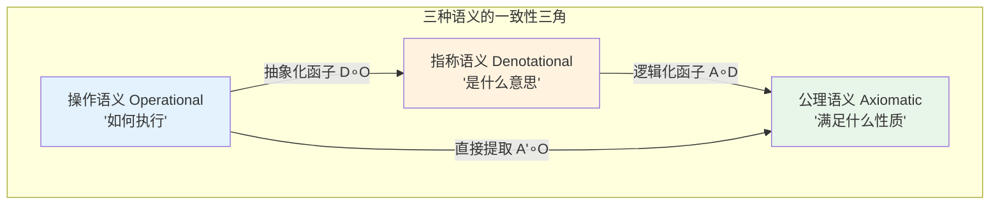
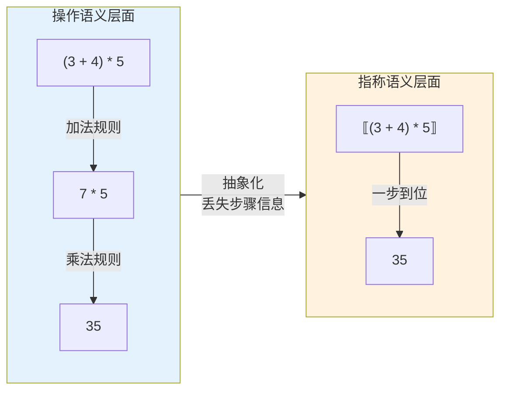
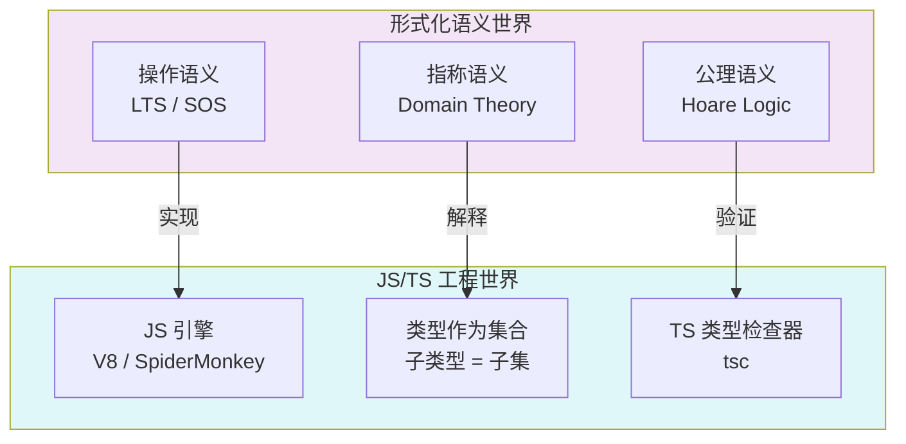

# 操作语义、指称语义与公理语义的形式化对应

## 引言

当你在生产环境中调试一个棘手的 bug 时，你实际上在同时面对三个层面的问题："程序一步一步执行时发生了什么？"（操作语义）、"程序的本意应该计算什么数学函数？"（指称语义）、以及"程序是否满足安全性质，如库存锁定后最终一定会被释放？"（公理语义）。同一个程序，三种不同的理解方式。如果这三种理解不一致，bug 就产生了。

本章系统阐述操作语义、指称语义和公理语义的形式化定义，分析它们之间的对称差与函子性对应，建立可靠性与完备性的严格框架，并将这一理论三角映射到 JavaScript/TypeScript 的生态环境中——揭示 JS 引擎如何实现操作语义、TS 类型系统如何扮演公理语义角色、以及类型如何作为指称的集合论语义。

---

## 理论严格表述

### 1. 操作语义：程序"如何执行"

操作语义（Operational Semantics）描述程序一步步如何执行。它是最接近程序员直觉的语义——调试器本质上就是在展示操作语义。

**小步操作语义（SOS, Structural Operational Semantics）** 将计算描述为一系列小步规约：

$$
\frac{e_1 \to e_1'}{e_1 + e_2 \to e_1' + e_2} \quad \text{（左规约）}
$$

$$
\frac{n = n_1 + n_2}{n_1 + n_2 \to n} \quad \text{（加法计算）}
$$

**大步操作语义（自然语义）** 直接描述"从初始状态到最终状态"的关系：

$$
\frac{\langle e_1, \sigma \rangle \Downarrow n_1 \quad \langle e_2, \sigma \rangle \Downarrow n_2 \quad n = n_1 + n_2}{\langle e_1 + e_2, \sigma \rangle \Downarrow n}
$$

小步语义更精细，可以描述中间状态和非终止（无限循环）；大步语义更简洁，但不适用于描述并发和死锁。

### 2. 指称语义：程序"是什么意思"

指称语义（Denotational Semantics）将程序映射到数学对象。其核心思想是：程序的含义不应该是"如何执行"，而应该是"它计算了什么函数"。

对于简单算术表达式：

$$
\llbracket n \rrbracket = n \quad \text{（数字的指称就是数字本身）}
$$

$$
\llbracket e_1 + e_2 \rrbracket = \llbracket e_1 \rrbracket + \llbracket e_2 \rrbracket
$$

指称语义的关键特性是**组合性（Compositional）**：复合表达式的含义只依赖于子表达式的含义，不依赖于它们的内部结构。

当语言包含递归时，需要**域论（Domain Theory）**。递归定义对应于连续函数的**最小不动点（Least Fixed Point）**：

$$
\llbracket \text{rec } f(x). e \rrbracket = \text{fix}(\lambda g. \lambda x. \llbracket e \rrbracket[f \mapsto g])
$$

其中 $\text{fix}(f) = \bigsqcup_{n \geq 0} f^n(\bot)$，$\bot$ 表示"未定义/非终止"。

### 3. 公理语义：程序"满足什么性质"

公理语义（Axiomatic Semantics）不关心程序如何执行，也不关心它计算什么函数。它只关心程序执行前后状态满足什么逻辑性质。

**霍尔三元组（Hoare Triple）** 描述程序的性质：

$$
\{P\}\ C\ \{Q\}
$$

文字解释：如果程序 $C$ 执行前前置条件 $P$ 成立，那么 $C$ 执行后后置条件 $Q$ 成立。

**最弱前置条件（Weakest Precondition, wp）** 是霍尔逻辑的机械化版本：

$$
wp(x := e, Q) = Q[x \mapsto e]
$$

$$
wp(C_1; C_2, Q) = wp(C_1, wp(C_2, Q))
$$

### 4. 三种语义的对称差分析

三种语义之间存在深刻的互补关系，同时也存在各自无法表达的内容：

**操作语义 \\ 指称语义**（操作语义能描述但指称语义丢失的）：
- 执行步骤的顺序：`(3 + 4) * 5` 是先算 `3 + 4 = 7` 再算 `7 * 5 = 35`，指称语义直接给出 35
- 副作用的时机：`console.log` 在操作语义中是明确步骤，在纯指称语义中不存在
- 非终止和死锁：操作语义可描述无限循环的每一步；指称语义用 $\bot$ 表示非终止，但丢失"在哪里卡住"的信息

**指称语义 \\ 操作语义**（指称语义能描述但操作语义难以表达的）：
- 程序等价性：操作语义要证明两个程序等价，需要证明所有执行步骤一一对应；指称语义只需证明 $\llbracket p_1 \rrbracket = \llbracket p_2 \rrbracket$
- 高阶抽象：操作语义处理高阶函数时非常复杂，指称语义通过域论自然处理

**公理语义 \\ 指称语义**：
- 不变式：公理语义可表达循环不变式；指称语义只关心最终状态
- 安全性与活性：公理语义可区分"不会发生坏事"与"最终会发生好事"

**指称语义 \\ 公理语义**：
- 具体数值结果：指称语义给出 `factorial(5) = 120` 的确切含义；公理语义只能说"如果输入是 5，输出是 120"
- 函数的完整行为：指称语义描述函数在所有输入上的行为

### 5. 函子性对应与可靠完备性

从范畴论视角，三种语义可以看作从**程序范畴** $\mathbf{Prog}$ 到不同语义范畴的函子：

- 操作语义 $O: \mathbf{Prog} \to \mathbf{TransitionSystem}$
- 指称语义 $D: \mathbf{Prog} \to \mathbf{DomainTheory}$
- 公理语义 $A: \mathbf{Prog} \to \mathbf{Logic}$

**函子性要求**：程序的组合映射为语义范畴中的组合；恒等程序映射为恒等态射。

三种语义可组织为交换图：

```
         操作语义 (Op)
             |
             | 解释函子
             v
指称语义 (Den) -----> 公理语义 (Ax)
      (抽象化)           (逻辑化)
```

**交换条件**：$\mathcal{A}(\mathcal{D}(\mathcal{O}(p))) = \mathcal{A}'(\mathcal{O}(p))$。即程序先经操作语义，再经指称语义，最后经公理语义，应等价于直接从操作语义提取公理性质。

**可靠性（Soundness）**：公理语义不会"撒谎"。若公理语义证明了 $\{P\}\ C\ \{Q\}$，则在操作语义中该三元组确实成立：

$$
\vdash \{P\}\ C\ \{Q\} \quad \Rightarrow \quad \models \{P\}\ C\ \{Q\}
$$

**完备性（Completeness）**：公理语义足够强大，能证明所有真实的性质：

$$
\models \{P\}\ C\ \{Q\} \quad \Rightarrow \quad \vdash \{P\}\ C\ \{Q\}
$$

然而，对于足够强大的程序语言，公理语义**不可能同时满足可靠性和完备性**（哥德尔不完备定理的幽灵）。例如，停机问题的不可判定性意味着霍尔逻辑无法证明或反驳某些程序的三元组——尽管它们在操作语义中要么成立要么不成立。

---

## 工程实践映射

### 1. JS 引擎 ≈ 操作语义

JavaScript 引擎（V8、SpiderMonkey、JavaScriptCore）本质上是在实现 ECMAScript 规范中的操作语义。规范中的每个抽象操作（如 `ToNumber`、`GetValue`）都对应引擎中的具体执行逻辑。

```typescript
// ECMAScript 规范：Abstract Equality Comparison (==)
// 1. 如果类型相同，按 === 比较
// 2. 如果一个是 null，一个是 undefined，返回 true
// 3. 如果一个是 number，一个是 string，将 string 转为 number
// 4. ...

// 引擎中的对应实现（概念性）
function abstractEqual(x: unknown, y: unknown): boolean {
  if (typeof x === typeof y) return strictEqual(x, y);
  if ((x === null && y === undefined) || (x === undefined && y === null)) return true;
  if (typeof x === "number" && typeof y === "string") return abstractEqual(x, Number(y));
  if (typeof x === "string" && typeof y === "number") return abstractEqual(Number(x), y);
  // ... 规范的其余步骤
  return false;
}
```

操作语义在工程中的直接对应就是**调试器与 Profiler**。当你用 Chrome DevTools 单步执行代码时，你看到的正是操作语义的可视化呈现。V8 的 Ignition 解释器直接实现了 ECMAScript 规范中的抽象操作序列。

### 2. TypeScript 类型系统 ≈ 公理语义

TypeScript 的类型检查器本质上是一个**公理语义引擎**。它验证程序是否满足"类型不变式"——这正是一种公理性质。

**霍尔三元组的类型系统类比**：

$$
\{\text{arg}: \text{number}\}\ \text{function}(\text{arg})\ \{\text{return}: \text{string}\}
$$

对应 TypeScript 的类型签名：

```typescript
function convert(arg: number): string
```

- 前置条件 = 参数类型约束
- 程序体 = 函数实现
- 后置条件 = 返回类型约束

类型检查作为公理验证，其可靠性意味着：如果 TypeScript 接受一个程序，那么该程序在类型层面是"自洽的"——但这不等于运行时正确，因为类型擦除和 `any` 的存在破坏了从公理语义到操作语义的完全对应。

### 3. 类型作为指称

在指称语义中，类型可被理解为**域中的子集**：

- `number` 类型 = 所有 JavaScript 数字值构成的集合（包括 `NaN`、`Infinity`）
- `string` 类型 = 所有字符串值构成的集合
- `number | string` = `number` 集合与 `string` 集合的并集
- `number & string` = 空集（在 JS 中不存在既是 number 又是 string 的值）

**子类型作为集合包含**：

$$
A <: B \iff \llbracket A \rrbracket \subseteq \llbracket B \rrbracket
$$

这在 TypeScript 中的体现：

```typescript
interface Animal { name: string; }
interface Dog extends Animal { bark(): void; }
// Dog <: Animal 因为所有 Dog 的值集合是 Animal 值集合的子集
```

三种语义在 TypeScript 语境下出现分歧的典型场景：

```typescript
// 操作语义视角：这个程序在运行时会做什么？
function unsafe(x: any): string {
  return x.toString();  // x 可能是 null，运行时报错
}

// 公理语义视角：类型检查器接受这个程序吗？
// TS 接受（any 允许任何操作）

// 指称语义视角：这个函数的数学含义是什么？
// (x) => x.toString()，定义域是 "有 toString 方法的对象"
// 但 TS 的类型签名说定义域是 any（即所有值）
```

这正是 $TS \setminus JS$ 对称差的深层原因：三种语义之间的不一致。公理语义（类型检查器）过于乐观地接受了程序，而操作语义（运行时）揭示了实际的错误。

### 4. 形式化方法在工业中的应用谱系

形式化方法在工业界的应用经历了从"学术玩具"到"关键基础设施"的演变：

| 公司/项目 | 形式化方法 | 验证目标 | 效果 |
|----------|-----------|---------|------|
| Intel | 定理证明 | 浮点运算单元 | 避免 Pentium FDIV bug 重演 |
| Microsoft | SLAM/模型检查 | Windows 驱动程序 | 显著减少蓝屏死机 |
| AWS | TLA+ | 分布式系统协议 | S3/DynamoDB 的正确性保证 |
| Airbus | B 方法 | 飞行控制系统 | DO-178C 认证 |
| CompCert | Coq 证明 | C 编译器 | 生成代码语义等价于源码 |
| seL4 | Isabelle/HOL | 操作系统内核 | 功能正确性形式化证明 |

**TypeScript 中的轻量级形式化**：

```typescript
// 类型系统本身就是一种轻量级形式化方法
// 它不能证明运行时正确性，但能证明"类型安全"
type SafeDiv = (a: number, b: number) => Option<number>;

// 这个类型规范了：
// 1. 输入是两个 number
// 2. 输出是 Option<number>（可能失败）
// 3. 不可能返回 string 或 undefined（除非实现错误）
// 虽然不如 Coq/Isabelle 强大，但类型系统覆盖了 80% 的常见错误
```

形式化方法的工程成本不可忽视。seL4 微内核的形式化验证：约 10,000 行 C 代码，约 200,000 行 Isabelle/HOL 证明，耗时约 10 人年。结论：形式化方法目前只适用于关键安全系统（航空、医疗、金融核心）。对于一般的 Web 应用，类型系统 + 测试覆盖是更经济的方案。

### 5. 三种语义的教育学映射

形式化语义不仅是理论工具，也是编程教育的认知脚手架。初学者学习编程的常见困难——"变量"不是数学中的变量、"函数调用"不是数学中的函数、"相等"不是数学中的相等——都可以通过形式化语义提供精确的数学模型来纠正。

操作语义解释赋值 `x = x + 1`：

$$
\langle x = x + 1, \sigma \rangle \to \langle \text{skip}, \sigma[x \mapsto \sigma(x) + 1] \rangle
$$

关键洞察：编程中的 `=` 是**状态转换**，不是等式！Python Tutor 网站通过可视化操作语义（小步归约），帮助学生理解程序执行的每一步——这正是操作语义的教育价值。

---

## Mermaid 图表

### 图表 1：三种语义的三角对应与交换图



### 图表 2：操作语义 vs 指称语义的抽象层次



### 图表 3：JS/TS 语境下的语义映射



---

## 理论要点总结

1. **操作语义回答"如何执行"**：通过小步或大步规约，精确描述程序的执行轨迹。它是调试器和解释器的理论基础，但无法判断程序是否"正确"——它只描述发生了什么，不描述应该发生什么。

2. **指称语义回答"是什么意思"**：将程序映射到数学对象（通常是域中的元素）。它具有组合性——复合表达式的含义只依赖于子表达式的含义。域论通过最小不动点处理递归定义。指称语义善于证明程序等价性，但丢失副作用和计算步骤信息。

3. **公理语义回答"满足什么性质"**：通过霍尔三元组和最弱前置条件，描述程序执行前后状态的逻辑关系。它是静态分析器和形式验证工具的理论基础。但公理语义无法表达时间复杂度、内存消耗等非功能性属性。

4. **三种语义构成函子性对应**：从程序范畴到转移系统范畴、域范畴和逻辑范畴的函子。交换图的一致性保证了：用调试器追踪程序的同时用类型检查器验证程序，两者不会矛盾。

5. **可靠性与完备性的张力**：可靠性保证公理语义不会"撒谎"；完备性保证所有真实性质都可证明。但哥德尔不完备定理意味着，对于足够强大的语言，二者不可兼得。TypeScript 的类型系统选择了一种实用的折中：可靠的类型安全（不会证明错误的类型关系），但在表达能力上有意不完备。

6. **JS/TS 的语义三角映射**：JS 引擎实现操作语义，TS 类型检查器实现公理语义，TS 类型作为指称语义的集合论语义。三者之间的不一致（类型检查器接受但运行时崩溃的程序）正是 $TS \setminus JS$ 对称差的根源。

---

## 参考资源

1. **Winskel, G. (1993).** *The Formal Semantics of Programming Languages*. MIT Press. 程序语义学的标准教材，系统覆盖操作语义、指称语义与公理语义。

2. **Harper, R. (2016).** *Practical Foundations for Programming Languages* (2nd ed.). Cambridge University Press. 从类型论视角统一三种语义的理论框架。

3. **Plotkin, G. D. (1981).** "A Structural Approach to Operational Semantics." *Aarhus University Technical Report*. 小步操作语义（SOS）的奠基性论文。

4. **Hoare, C. A. R. (1969).** "An Axiomatic Basis for Computer Programming." *Communications of the ACM*, 12(10), 576-580. 霍尔逻辑的开创性论文，公理语义的奠基之作。

5. **Scott, D. S. (1976).** "Data Types as Lattices." *SIAM Journal on Computing*, 5(3), 522-587. 域论与指称语义的理论基础。

6. **Pierce, B. C. (2002).** *Types and Programming Languages*. MIT Press. 类型系统与程序语言的权威教材，涵盖类型作为指称的集合论语义。
