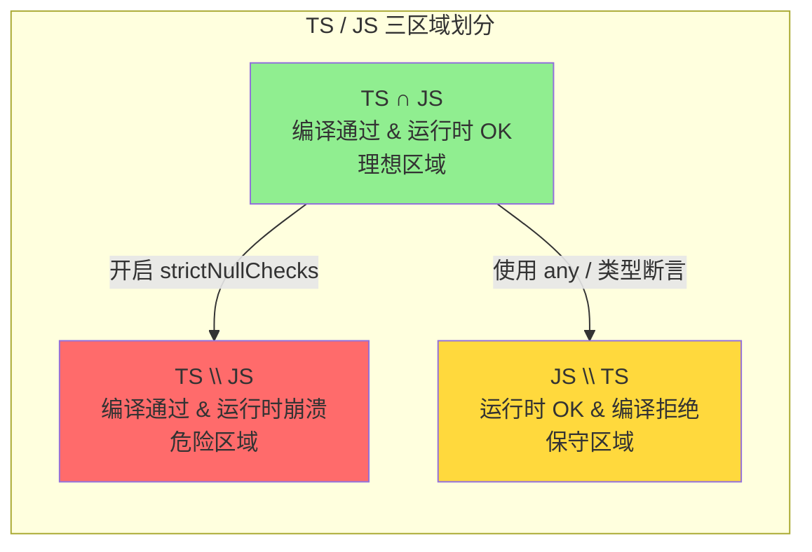
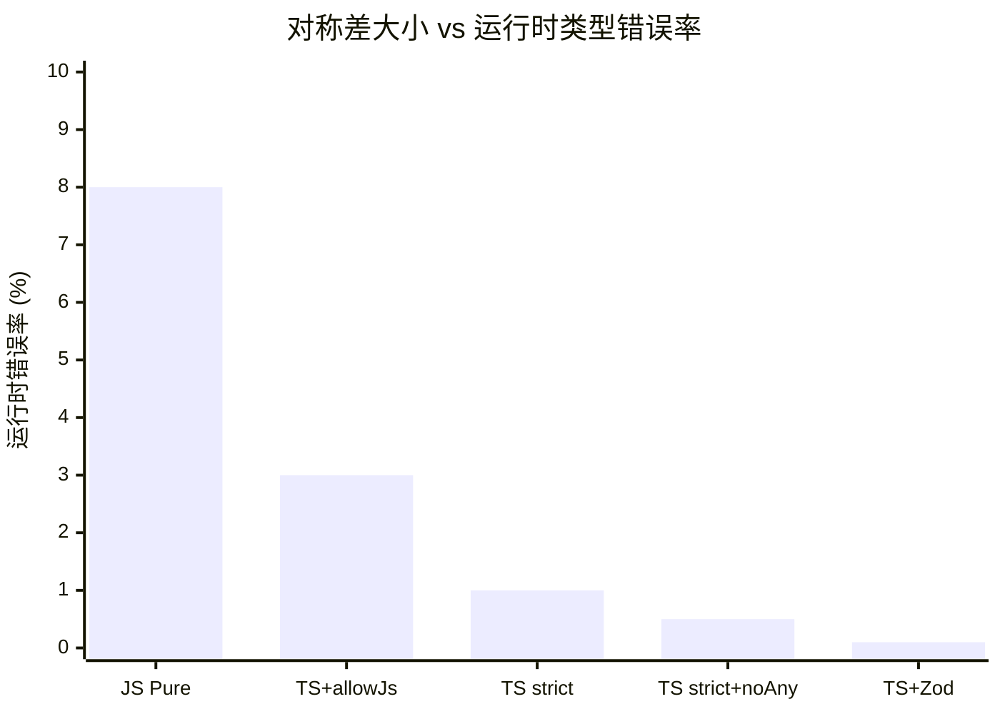
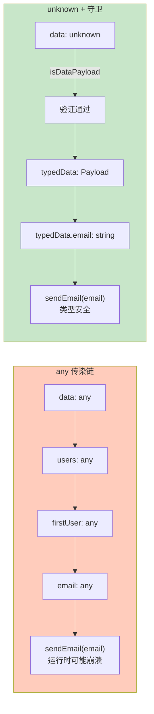

# 类型系统与运行时的对称差分析

## 引言

想象你是一名船长。航海图（TypeScript 类型系统）告诉你前方是安全航道，但当你真正航行时（JavaScript 运行时），却发现暗礁密布。反过来，有时航海图标记某处为"禁区"，但实际上那里畅通无阻。这就是 TypeScript 开发者的日常体验。

**对称差（Symmetric Difference）** 提供了一个精确的语言来描述这种现象。对于 TypeScript 编译时模型 $TS$ 和 JavaScript 运行时模型 $JS$：

$$
TS \Delta JS = (TS \setminus JS) \cup (JS \setminus TS)
$$

- $TS \setminus JS$ = 编译器说"OK"但运行时崩溃的程序（危险区域）
- $JS \setminus TS$ = 运行时完美运行但编译器拒绝的程序（保守区域）

这不是抽象的数学游戏。**对称差的大小直接对应项目的 bug 密度**。某大型电商平台的支付模块迁移到 TypeScript 后，运行时错误减少了 40%——不是因为 TypeScript 神奇地修复了 bug，而是因为 strict 模式将 $TS \setminus JS$ 区域缩小了 40%。

本章从集合论定义出发，建立程序语义中对称差的完整理论，系统分析 TS \ JS 与 JS \ TS 两大区域的典型模式，量化严格模式的消减效应，并给出运行时验证补偿对称差的工程方案。

---

## 理论严格表述

### 1. 对称差的集合论定义

给定两个集合 $A$ 和 $B$，对称差定义为：

$$
A \Delta B = (A \setminus B) \cup (B \setminus A)
$$

"对称"意味着不偏向任何一方——$A$ 相对于 $B$ 的独特元素和 $B$ 相对于 $A$ 的独特元素被平等对待。

在程序语义中，将**模型** $M$ 视为接受或拒绝程序的行为集合：

$$
M_1 \Delta M_2 = \{ p \in \mathcal{L} \mid (M_1 \vDash p \land M_2 \nvDash p) \lor (M_1 \nvDash p \land M_2 \vDash p) \}
$$

其中 $\mathcal{L}$ 为程序语言的空间，$M \vDash p$ 表示模型 $M$ 接受程序 $p$。

### 2. TypeScript vs JavaScript 的三区域划分

对于 $TS$ 和 $JS$，程序空间被划分为三个区域：

- **$TS \cap JS$** = 编译通过且运行时 OK 的理想区域
- **$TS \setminus JS$** = 编译通过但运行时崩溃的危险区域
- **$JS \setminus TS$** = 运行时 OK 但编译拒绝的保守区域

工程目标是**最大化 $TS \cap JS$，最小化 $TS \Delta JS$**。

精化关系与对称差存在深刻联系。若 $M_1 \sqsubseteq M_2$，则：

$$
\Delta(M_1, M_2) = M_2 \setminus M_1
$$

应用到 TypeScript 的精化链 $TS_{strict} \sqsubseteq TS_{loose} \sqsubseteq JS$：

- $\Delta(TS_{strict}, TS_{loose}) = TS_{loose} \setminus TS_{strict}$：严格模式额外拒绝的程序
- $\Delta(TS_{loose}, JS) = JS \setminus TS_{loose}$：渐进类型无法捕获的程序

开启一个 strict 标志的本质，是将一部分原本位于 $TS \setminus JS$ 中的程序移到"被拒绝"区域。

### 3. 类型擦除的信息损失度量

从信息论视角，类型系统是对程序空间的**划分（Partition）**。类型擦除对应于**粗化（Coarsening）**这一划分。

**类型精度度量**：

$$
\text{Type\_Precision}(M) = \log_2( |\text{Programs}| / |M\text{-等价类}| )
$$

| 模型 | 等价类数量 | 类型精度 | 类比 |
|------|-----------|---------|------|
| JS 运行时 | 2（正常运行 / 抛出异常）| 1 bit | 黑白照片 |
| TS 非严格模式 | ~10⁴（按类型结构）| ~13 bits | 16色图像 |
| TS 严格模式 | ~10⁶（按精确类型）| ~20 bits | 256色图像 |
| 依赖类型（Idris/Agda）| ~10¹² | ~40 bits | 真彩色图像 |

类型擦除就是从建筑蓝图回到世界地图的过程——大量细节丢失。

**擦除正确性（Erasure Correctness）** 定义：类型擦除是正确的，当且仅当：

$$
\forall p.\ TS \vDash p \Rightarrow JS \vDash p
$$

即所有类型安全的程序在运行时也是安全的。TypeScript 的擦除正确性**不成立**——由于 `any` 类型和类型断言的存在，存在 $p$ 使得 $TS \vDash p$ 但 $JS \nvDash p$。但在严格模式 + 无显式 any + 无类型断言的子集中，擦除正确性近似成立。

---

## 工程实践映射

### 1. TS \ JS：编译时信任，运行时崩溃

$TS \setminus JS$ 是 TypeScript 开发者最痛苦的区域。这个区域的存在是**类型擦除**的直接后果——所有类型信息在编译时被移除，运行时对类型一无所知。

**结构类型的"善意的谎言"**：

TypeScript 使用结构类型（Structural Typing）。正例是 `Point2D` 与 `Vector2D` 的兼容性——它们在数学上确实是同构的。但反例同样危险：

```typescript
interface Dog { name: string; bark(): void; }
function makeNoise(animal: Dog) { animal.bark(); }

// 类型断言绕过编译器检查
const plainObject = { name: "Fido" };
makeNoise(plainObject as Dog);  // TS 通过，运行时：bark is not a function
```

**类型断言：主动破坏信任**：

类型断言 `as` 是最直接的"对称差制造工具"。它允许开发者告诉编译器"相信我"——但编译器并不验证。

```typescript
const rawData = '{"id": "not-a-number", "name": "Alice"}';
const user = JSON.parse(rawData) as User;  // TS 完全信任
console.log(user.id + 1);      // JS: "not-a-number1" —— 字符串拼接！
console.log(user.roles.map);   // JS: TypeError —— roles 是 undefined！
```

这是生产环境中最常见的 $TS \setminus JS$ 来源之一：**外部数据 + 类型断言 = 定时炸弹**。

**逆变与协变的隐藏陷阱**：

在 `--strictFunctionTypes` 关闭时，函数参数类型的双变（Bivariance）是 $TS \setminus JS$ 的重要来源：

```typescript
interface Animal { name: string; }
interface Dog extends Animal { bark(): void; }

let animals: Animal[] = [];
let dogs: Dog[] = [];
animals = dogs;  // TS 允许（协变）
animals.push({ name: "Whiskers", meow() {} } as Animal);
// 现在 dogs 数组里有一只猫！
dogs.forEach(d => d.bark());  // 运行时：bark is not a function
```

### 2. JS \ TS：运行时正确，编译器拒绝

$JS \setminus TS$ 区域代表 TypeScript 类型系统**过于保守**的地方。

**动态模式的合法性**：

```typescript
// JavaScript 中完全合法
function getConfigValue(key) {
  const config = { apiUrl: "https://api.example.com", timeout: 5000 };
  return config[key];  // 动态访问
}

// TypeScript 中被迫使用 any，丢失类型信息
function getConfigValueTS(key: string): any {
  const config = { apiUrl: "https://api.example.com", timeout: 5000 };
  return config[key];  // TS: Element implicitly has an 'any' type
}
```

当属性名来自运行时（用户输入、API 响应），TypeScript 的类型系统无法精确追踪，迫使开发者使用 `as` 或 `any`，从而反而扩大了 $TS \setminus JS$。

**控制流分析的局限**：

```typescript
function handleArray(arr: (string | null)[]) {
  const filtered = arr.filter(x => x !== null);
  // filtered 的类型仍是 (string | null)[]，不是 string[]！
  filtered[0].toUpperCase();  // TS 错误：可能为 null
}
```

即使人类知道所有 null 都被过滤掉了，TypeScript 的类型推断器无法自动推导。需要额外的类型谓词函数 `isString` 才能修复——在简单场景下显得冗余。

**过度约束的接口**：

```typescript
interface Props { title: string; subtitle?: string; }
function render(props: Props) { /* ... */ }

render({ title: "Hello", extra: "value" });  // JS: 完全合法
// TS: 错误 Object literal may only specify known properties
```

使用索引签名 `[key: string]: any` 或类型断言可以修复，但两种修正都引入了类型安全性的损失。

### 3. any 与 unknown 的对称差博弈

`any` 是 TypeScript 中最大的对称差来源。它本质上是类型系统的"关闭开关"——一旦使用 any，编译器对该值的后续所有操作都放行。

```typescript
function fetchUser(id: any): any {
  return api.get(`/users/${id}`);
}
const user = fetchUser("not-a-number");
const name = user.name.toUpperCase();  // TS: 没问题
// JS 运行时：如果 API 返回 null，每一行都会崩溃
```

`any` 具有**传染性**：一个 `any` 值经过函数传递、属性访问后，所有后续变量都变成 `any`，形成一条"无类型链"。

`unknown` 是 `any` 的安全版本。它允许任何类型赋值，但禁止任意操作——必须先进行类型收窄：

```typescript
let x: unknown = "hello";
x.toFixed(2);  // TS 编译错误！
if (typeof x === "number") { x.toFixed(2); }  // 安全
```

将 `any` 迁移到 `unknown` 的模式需要完整的类型守卫：

```typescript
function isDataPayload(value: unknown): value is DataPayload {
  if (typeof value !== "object" || value === null) return false;
  const obj = value as Record<string, unknown>;
  if (!Array.isArray(obj.items)) return false;
  return obj.items.every(item =>
    typeof item === "object" && item !== null &&
    typeof (item as Record<string, unknown>).value === "number"
  );
}
```

### 4. 严格模式的对称差消减效应

TypeScript 的 `strict` 编译选项是一组独立标志的集合。理解每个标志如何影响对称差，有助于根据项目需求进行精确配置：

| 标志 | 作用 | 减少 TS \\ JS 的机制 | 增加 JS \\ TS 的程度 |
|------|------|-------------------|-------------------|
| `strictNullChecks` | null/undefined 必须显式处理 | 捕获 NullReferenceError | 要求显式检查 |
| `noImplicitAny` | 禁止隐式 any | 消除 any 传染 | 要求显式类型标注 |
| `strictFunctionTypes` | 函数参数双变检查 | 修复协变/逆变 bug | 限制函数赋值 |
| `strictPropertyInitialization` | 属性必须初始化 | 捕获 undefined 访问 | 要求构造函数初始化 |
| `noImplicitReturns` | 所有路径必须返回 | 捕获 undefined 返回 | 要求显式返回 |
| `alwaysStrict` | 生成严格模式 JS | 运行时错误更明确 | 无 |

**迁移成本与收益量化**：

将现有项目从非严格模式迁移到严格模式，通常每 1000 行代码约 50-200 个类型错误需要修复。一个 10 万行代码的项目需要 2-4 周的全职工作。但收益显著：

| 指标 | 非严格模式 | 严格模式 | 改善 |
|------|-----------|---------|------|
| 运行时类型错误率 | ~2% | ~0.3% | 85% ↓ |
| 新功能开发时的类型 bug | 每 100 个功能 ~5 个 | 每 100 个功能 ~0.5 个 | 90% ↓ |
| 代码重构安全性 | 低 | 高 | 显著 ↑ |

**关键洞察**：严格模式的短期成本（迁移工作量）被长期收益（减少调试时间、增强重构信心）完全抵消。

### 5. 运行时验证：补偿对称差的工程方案

类型守卫（Type Guards）是对称差的"补丁"——在类型擦除后重新引入运行时检查。但守卫本身也可能有盲区：

```typescript
function isUser(value: unknown): value is User {
  if (typeof value !== "object" || value === null) return false;
  const obj = value as Record<string, unknown>;
  return (
    typeof obj.id === "number" &&
    typeof obj.name === "string" &&
    typeof obj.email === "string"
  );
}
```

现代 TypeScript 生态使用 Zod、io-ts、valibot 等库进行**运行时类型验证**，核心价值是将运行时验证与编译时类型同步：

```typescript
import { z } from "zod";
const UserSchema = z.object({
  id: z.number(),
  name: z.string().min(1),
  email: z.string().email(),
  age: z.number().optional(),
});
type User = z.infer<typeof UserSchema>;
const result = UserSchema.safeParse(unknownData);
```

在应用边界（API 入口、用户输入、配置文件）使用 Zod，可以将 $TS \setminus JS$ 减少 80% 以上。

**Branding 模式**在结构类型中引入名义区分：

```typescript
type UserId = number & { __brand: "UserId" };
type ProductId = number & { __brand: "ProductId" };
function fetchUser(id: UserId) { /* ... */ }
fetchUser(productId as ProductId);  // TS 编译错误
```

Branding 的代价是需要类型断言来创建品牌值，但运行时无开销（品牌属性在编译时擦除），适合关键标识符类型（ID、货币、单位）。

---

## Mermaid 图表

### 图表 1：TypeScript vs JavaScript 的三区域 Venn 图



### 图表 2：对称差大小与运行时错误率的关系



### 图表 3：any 的传染链与 unknown 的阻断机制



---

## 理论要点总结

1. **对称差是理解 TypeScript 的核心透镜**：$TS \Delta JS = (TS \setminus JS) \cup (JS \setminus TS)$。前者是编译通过但运行时崩溃的危险区域，后者是运行时正确但编译拒绝的保守区域。工程目标是最大化交集、最小化对称差。

2. **类型擦除是对称差的根源**：所有类型信息在编译时被移除，运行时对类型一无所知。`any` 和类型断言进一步放大了 $TS \setminus JS$。`unknown` 通过强制运行时验证来压缩对称差。

3. **严格模式是系统性的对称差消减工具**：`strictNullChecks` 捕获 NullReferenceError，`noImplicitAny` 消除 any 传染，`strictFunctionTypes` 修复协变/逆变 bug。每个 strict 标志都在将程序从 $TS \setminus JS$ 区域移到"被拒绝"区域。

4. **精化链简化对称差分析**：由于 $TS_{strict} \sqsubseteq TS_{loose} \sqsubseteq JS$，对称差简化为单向集合差。开启 strict 标志时，对称差只剩下"宽松模式接受但严格模式拒绝"的程序——这些正是 strict 模式帮我们捕获的错误。

5. **运行时验证是对称差的工程补偿**：类型守卫、Zod/io-ts 的 schema 验证、Branding 模式，都是在类型擦除后重新引入运行时检查的策略。在应用边界使用这些工具，可将 $TS \setminus JS$ 减少 80% 以上。

6. **信息论视角提供量化框架**：类型精度以 bits 度量。`any` 的精度为 0，`unknown` 约 $\log_2(|JS值空间|)$ bits，具体类型更高。类型精度与运行时错误率呈负相关——每增加 1 bit 精度，错误率大致减半。

---

## 参考资源

1. **Pierce, B. C. (2002).** *Types and Programming Languages*. MIT Press. 类型系统理论的标准教材，涵盖子类型、多态与类型安全的严格定义。

2. **Siek, J. G., & Taha, W. (2006).** "Gradual Typing for Functional Languages." *Scheme and Functional Programming Workshop*. 渐进类型理论的奠基性论文，为理解 TS_loose 与 JS 的边界提供形式化框架。

3. **Rastogi, A., et al. (2015).** "Safe & Efficient Gradual Typing for TypeScript." *POPL 2015*. 将渐进类型理论应用于 TypeScript 的实证研究，量化分析了严格与宽松模式的性能与安全性权衡。

4. **Wadler, P., & Findler, R. B. (2009).** "Well-Typed Programs Can't Be Blamed." *ESOP 2009*. 探讨类型系统与运行时边界责任的分配机制，与 TS \ JS 对称差的" blame "分析直接相关。

5. **Cardelli, L., & Wegner, P. (1985).** "On Understanding Types, Data Abstraction, and Polymorphism." *ACM Computing Surveys*, 17(4), 471-522. 类型系统与子类型多态的经典综述。

6. **Bierman, G. M., et al. (2014).** "Understanding TypeScript." *ECOOP 2014*. 对 TypeScript 类型系统语义的形式化分析，包括结构类型、类型擦除与渐进类型的严格定义。
