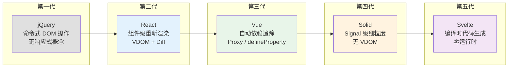
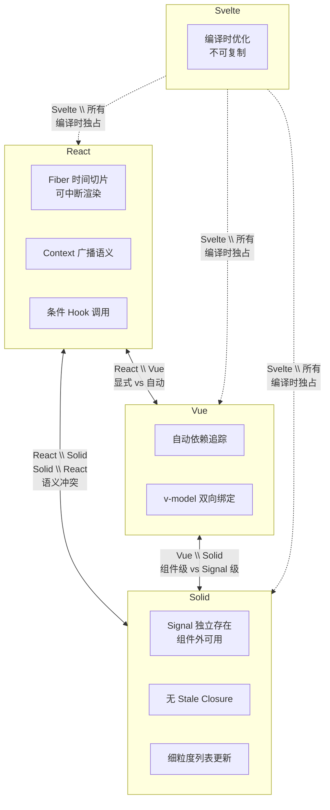
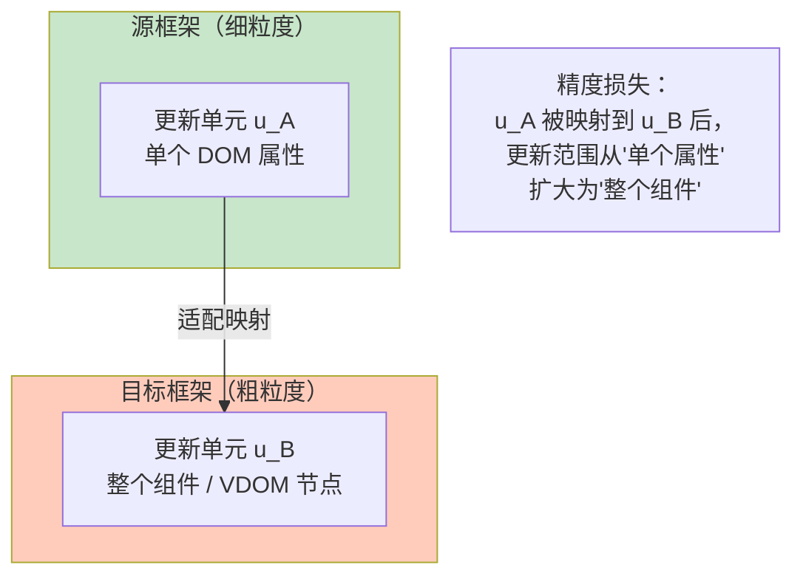

# 响应式模型的适配理论与不可表达性

## 引言

2023 年，某知名 SaaS 公司决定将核心业务组件从 React 迁移到 Solid，理由是"Solid 的性能更好"。三个月后，项目回滚。不是性能问题——Solid 确实更快——而是团队发现：React 中基于 Hooks 封装的 200 多个自定义 Hook，在 Solid 中没有一个可以直接复用。`useEffect` 的重新执行语义与 `createEffect` 的一次性订阅语义完全不同；React 的 Context 在 Solid 中没有直接对应物；React 的 Suspense 边界在 Solid 中行为不一致。

这个案例揭示了一个被工程界长期忽视的事实：**框架迁移不只是语法转换，而是语义模型的转换**。如果两个框架的响应式模型之间存在不可表达性（Inexpressibility），迁移成本不是线性的，而是指数级的。

本章将 React、Vue、Solid、Svelte 的响应式系统形式化为四元组 $\mathcal{R} = (S, V, D, \tau)$，分析它们之间的对称差，定义模型间的适配函子，证明关键不可表达性命题，并给出迁移可行性矩阵与微前端多模型共存的工程策略。

---

## 理论严格表述

### 1. 响应式系统的通用形式化

一个响应式系统可以形式化为四元组：

$$
\mathcal{R} = (S, V, D, \tau)
$$

其中：
- $S$ = 状态空间（所有可能的状态值）
- $V$ = 视图空间（所有可能的 UI 表示）
- $D: S \to \mathcal{P}(V)$ = 依赖关系（状态到视图的映射）
- $\tau: S \times S \to \Delta V$ = 状态变化的传播函数

**React 的重新渲染模型**：

$$
\mathcal{R}_{React} = (S_{component}, V_{VDOM}, D_{props}, \tau_{reconcile})
$$

状态为组件状态（`useState`/`useReducer`）+ Props；视图为 Virtual DOM 树；依赖为从组件状态到其子树 VDOM 的映射；传播函数为 Diff 算法计算最小 DOM 更新集合。**核心语义特征**：状态变化触发整个组件子树的重新渲染（概念层面），组件函数每次状态变化都重新执行。

**Vue 的自动追踪模型**：

$$
\mathcal{R}_{Vue} = (S_{reactive}, V_{template}, D_{proxy}, \tau_{patch})
$$

状态为响应式状态（`ref`/`reactive`）；视图为模板编译后的渲染函数输出；依赖为 Proxy 拦截自动建立的依赖图；传播为精确的 DOM Patch。**核心语义特征**：依赖在首次渲染时自动追踪，状态变化只触发依赖该状态的视图部分更新。

**Solid 的细粒度 Signal 模型**：

$$
\mathcal{R}_{Solid} = (S_{signal}, V_{DOM}, D_{fine\_grained}, \tau_{direct})
$$

状态为 Signal（`createSignal` 创建的响应式原子）；视图为直接 DOM 引用（无 Virtual DOM）；依赖为 Signal 读取时建立的精确依赖；传播为直接 DOM 更新（无 Diff）。**核心语义特征**：组件函数只执行一次，Signal 变化直接更新读取该 Signal 的精确 DOM 节点。

**Svelte 的编译时代码生成模型**：

$$
\mathcal{R}_{Svelte} = (S_{compiled}, V_{template}, D_{static}, \tau_{generated})
$$

依赖关系在编译时确定，运行时没有框架代码。编译器分析模板与状态的依赖关系，生成直接更新 DOM 的代码。

### 2. 响应式模型的对称差分析

将类型-运行时对称差推广到响应式框架语境。对于两个框架模型 $\mathcal{R}_A$ 和 $\mathcal{R}_B$：

$$
\mathcal{R}_A \Delta \mathcal{R}_B = (\mathcal{R}_A \setminus \mathcal{R}_B) \cup (\mathcal{R}_B \setminus \mathcal{R}_A)
$$

其中 $\mathcal{R}_A \setminus \mathcal{R}_B$ = "在框架 A 中可以自然表达，但在框架 B 中无法表达或需要根本性重构"的模式集合。

**React \\ Solid**（React 能做到而 Solid 做不到）：

1. **基于重新渲染的条件 Hook 调用**：React 中可以在条件分支中早期返回，Hooks 仍然按规则工作。Solid 的组件只执行一次，不能"提前返回 JSX"，必须通过 `Show` 组件在 JSX 层面处理条件。

2. **Fiber 时间切片与可中断渲染**：React 的 Fiber 架构允许可中断的渲染——如果浏览器需要响应用户输入，React 可以暂停正在进行的重新渲染。Solid 的 Signal 更新是同步且不可中断的，细粒度更新虽然快，但失去了调度边界。

3. **Context 的重新订阅语义**：React Context 值变化时，所有消费组件重新渲染。Solid 的 Context API 提供的只是依赖注入，不是响应式广播。

**Solid \\ React**（Solid 能做到而 React 做不到）：

1. **Signal 在组件边界外的独立存在**：Solid 的 Signal 是第一等的响应式原语，独立于组件生命周期。React 的 State 是组件的附属物，要共享状态必须通过 Context 或外部库。

2. **无 Stale Closure 的语义保证**：Solid 的 Signal 读取是动态查找（通过依赖追踪获取最新值），不是闭包捕获。React 中经典的 Stale Closure 问题在 Solid 中根本不存在。

3. **细粒度列表更新**：Solid 的 `For` 组件对每个列表项建立独立的响应式追踪。某个 `todo.done` 变化时，只有该复选框的 `checked` 属性更新，列表中的其他 DOM 节点完全不受影响。

### 3. 模型间的适配函子

在两个响应式模型之间，可以定义**适配函子** $F: \mathbf{React} \to \mathbf{Vue}$。函子性要求：
- $F(id_A) = id_{F(A)}$（恒等态射映射为恒等态射）
- $F(g \circ f) = F(g) \circ F(f)$（复合保持）

**精度损失定理**：如果框架 $A$ 的响应式粒度比框架 $B$ 更细，则从 $A$ 到 $B$ 的适配必然丢失粒度信息。

*证明概要*：设 $A$ 的更新单元为 $u_A$，$B$ 的更新单元为 $u_B$，且 $|u_A| < |u_B|$。在 $A$ 中，状态变化 $\Delta s$ 只更新单元 $u_A$。适配到 $B$ 后，$u_A$ 必须被映射到某个 $u_B$。由于 $|u_B| > |u_A|$，更新 $u_B$ 意味着更新比 $u_A$ 更多的 DOM 或视图状态。因此 $A$ 中"只更新 $u_A$"的语义在 $B$ 中丢失。∎

这就是 Solid → React 的适配必然丢失细粒度的原因：React 的最小更新单元是组件（或 VDOM 节点），而 Solid 的最小更新单元是 Signal（对应单个 DOM 文本或属性）。

### 4. 不可表达性证明

**命题 1**：Solid 的 Signal 细粒度更新语义在 React 中无法精确表达。

*证明*：Solid 的 Signal 有两个核心语义属性：(1) 组件函数只执行一次；(2) Signal 读取建立动态依赖，Signal 变化时只更新读取该 Signal 的具体 DOM 节点，不触发组件重新渲染。

假设 React 可以精确表达 Solid 的 Signal 语义，则 React 中必须存在机制 $M$，使得组件函数不重新执行且 Signal 变化不触发重新渲染。但 React 的核心不变式是：状态变化触发组件重新渲染（组件函数重新执行）。若 $M$ 使得组件函数不重新执行，则 $M$ 破坏了 React 的基本渲染语义；若 $M$ 不破坏渲染语义，则 Signal 变化必然触发重新渲染，与 Solid 的"只更新精确 DOM 节点"矛盾。因此不存在这样的 $M$。∎

**命题 2**：React 的并发特性（Suspense、Transitions、`useDeferredValue`）在 Vue 和 Solid 中无法精确表达。

*证明概要*：React 的并发特性依赖 Fiber 架构的可中断渲染、时间切片和优先级系统。Vue 的响应式系统假设状态更新是同步执行的；虽然 Vue 3 引入了 `nextTick`，但这只是批处理层面的延迟，不是渲染中断层面的。Solid 的 Signal 更新也是同步执行的，`createEffect` 的依赖变化会立即触发 effect 执行，没有"渲染阶段"的概念，因此没有可以在中间打断的"渲染工作"。∎

**命题 3**：Svelte 的编译时依赖分析和代码生成优化在其他运行时框架中无法复制。

*证明*：Svelte 的优化依赖编译时可用的模板结构和变量使用信息。运行时框架在运行时接收的是已经编译好的 JavaScript 代码，模板结构已经丢失。要在运行时框架中复制 Svelte 的优化，需要在运行时重新解析组件源码（通常不可能，因为源码不部署到生产环境），或将运行时框架的编译器改为生成直接 DOM 操作代码（这等于将框架重写为 Svelte）。∎

---

## 工程实践映射

### 1. 框架核心哲学的语义差异

不可表达性的根源不是技术限制，而是**设计哲学的差异**：

| 框架 | 核心哲学 | 不可被复制的根本特性 |
|------|---------|-------------------|
| React | UI 是状态的纯函数 | 重新渲染语义 + Fiber 调度 |
| Vue | 渐进式框架，自动追踪 | Proxy 自动依赖图 + 模板优化 |
| Solid | 细粒度响应式，无 VDOM | Signal 的组件外独立存在 + 无重新渲染 |
| Svelte | 编译器即框架 | 编译时代码生成 + 零运行时 |

这些哲学选择互相排斥：如果你选择"重新渲染"（React），就不能同时选择"组件只执行一次"（Solid）；如果你选择"运行时追踪"（Vue），就不能同时选择"编译时分析"（Svelte）。

### 2. 迁移可行性矩阵

迁移的可行性取决于两个框架模型的精化关系：

$$
\text{框架 A 可迁移到框架 B} \iff \exists \text{ 适配函子 } F: A \to B, \text{ 使得核心行为保持}
$$

| 从 \\ 到 | React | Vue | Solid | Svelte |
|---------|-------|-----|-------|--------|
| **React** | — | 可行但丢失重新渲染语义；迁移成本：中 | 困难，语义冲突；迁移成本：极高 | 困难，运行时→编译时；迁移成本：极高 |
| **Vue** | 可行但丢失自动追踪；迁移成本：中 | — | 困难，粒度差异；迁移成本：高 | 困难，运行时→编译时；迁移成本：高 |
| **Solid** | 困难，语义冲突；迁移成本：极高 | 困难，粒度差异；迁移成本：高 | — | 困难，运行时→编译时；迁移成本：高 |
| **Svelte** | 困难，编译时→运行时；迁移成本：极高 | 困难，编译时→运行时；迁移成本：极高 | 困难，编译时→运行时；迁移成本：极高 | — |

**关键洞察**：任何框架 → Svelte 的迁移都是"极高"成本，因为 Svelte 的零运行时无法在运行时框架中保持。React ↔ Solid 的迁移同样困难，因为两者的核心语义直接冲突。

### 3. 心智模型转换成本

迁移成本不仅仅是代码行数的改写，更重要的是**心智模型**的转换：

**React → Vue**：
- 失去："重新渲染是常态，组件函数是纯函数"
- 获得："依赖自动追踪，不需要手动声明"
- 转换难点：React 开发者习惯用 `useMemo`、`useCallback` 优化性能，这些在 Vue 中不仅不需要，反而有害

**React → Solid**：
- 失去："重新渲染是常态"
- 获得："组件只执行一次，Signal 是独立原语"
- 转换难点：React 中的几乎所有模式（Context、Hooks 规则、Suspense）在 Solid 中都没有直接对应

**任何框架 → Svelte**：
- 失去："运行时有一个响应式框架在运作"
- 获得："编译器生成所有更新代码"
- 转换难点：`$:` 反应式声明的编译时语义与运行时的直觉常常冲突

### 4. 微前端架构的多模型共存

在微前端架构中，多个框架可能在同一页面共存。这是处理不可表达性的务实策略：**不迁移，共存**。

```
页面
  ├── 微应用 A (React) — 需要 Concurrent Features 的部分
  ├── 微应用 B (Vue) — 需要快速开发、自动追踪的部分
  └── 微应用 C (Solid) — 需要极致性能的部分
```

跨框架状态共享的适配层本质是一个**最低公共精化**：提取所有框架都能理解的"订阅-发布"模式，然后为每个框架提供适配。

```typescript
class CrossFrameworkStore<T> {
  private value: T;
  private listeners = new Set<(v: T) => void>();
  constructor(initial: T) { this.value = initial; }
  getState(): T { return this.value; }
  setState(v: T) { this.value = v; this.listeners.forEach(l => l(v)); }
  subscribe(listener: (v: T) => void): () => void {
    this.listeners.add(listener);
    return () => this.listeners.delete(listener);
  }
  // React 适配
  useReactState(): T {
    const [state, setState] = useState(this.value);
    useEffect(() => this.subscribe(setState), []);
    return state;
  }
  // Vue 适配
  useVueRef(): Ref<T> {
    const state = ref(this.value);
    this.subscribe(v => state.value = v);
    return state;
  }
}
```

代价是丢失了各框架的高级特性（React 的并发调度、Vue 的自动追踪、Solid 的细粒度）。

### 5. 统一响应模型的局限

所有前端框架的响应式系统都可以尝试统一到以下模型：

$$
\mathcal{R}_{unified} = (S, E, H, V, \delta)
$$

其中 $S$ 为状态空间，$E$ 为效应空间，$H$ 为 Handler 空间，$V$ 为视图空间，$\delta$ 为状态转换和视图更新函数。

| 框架 | 状态 $S$ | 效应 $E$ | Handler $H$ | 视图 $V$ |
|------|---------|---------|------------|---------|
| React | useState/useReducer | useEffect | 组件函数 | VDOM |
| Vue | ref/reactive | watch/watchEffect | 组件 setup | 渲染函数 |
| Solid | createSignal | createEffect | 组件函数 | 直接 DOM |
| Svelte | let/$: | 反应式声明 | 编译器生成 | 编译生成 |

统一模型的价值在于提供一个**元语言**来描述和比较不同框架。但它无法捕捉编译时 vs 运行时的本质差异，也无法指导"应该选择哪个框架"——因为选择取决于不可形式化的因素（团队熟悉度、生态成熟度、特定性能需求）。

---

## Mermaid 图表

### 图表 1：四大框架响应式模型的演进与粒度对比



### 图表 2：框架间的对称差与不可表达性



### 图表 3：适配函子的精度损失



---

## 理论要点总结

1. **响应式系统的形式化四元组**：$\mathcal{R} = (S, V, D, \tau)$ 统一描述了 React（组件级重新渲染）、Vue（Proxy 自动追踪）、Solid（Signal 细粒度）和 Svelte（编译时代码生成）的核心语义。四种模型的根本差异在于状态变化的传播粒度与时机。

2. **对称差分析揭示不可表达性**：$\mathcal{R}_A \Delta \mathcal{R}_B$ 量化了两个框架之间"无法自然表达"的模式集合。React 的 Fiber 时间切片在 Solid 中无对应物；Solid 的 Signal 独立存在语义在 React 中无法精确表达；Svelte 的编译时优化在所有运行时框架中不可复制。

3. **适配函子必然伴随精度损失**：若框架 $A$ 的粒度比 $B$ 更细，则从 $A$ 到 $B$ 的适配必然丢失粒度信息。这是由更新单元的包含关系决定的数学事实，不是实现技巧可以弥补的。

4. **不可表达性的根源是设计哲学差异**：React 选择"UI 是状态的纯函数"，Solid 选择"细粒度响应式"，Svelte 选择"编译器即框架"。这些选择互相排斥——不是技术限制，而是基本假设的不同。

5. **迁移可行性矩阵是决策工具**：React ↔ Vue 的迁移可行但有心智模型转换成本；React ↔ Solid 和任何框架 → Svelte 的迁移成本极高，因为存在根本性语义冲突。在决定迁移前，必须量化不可表达性的范围。

6. **微前端多模型共存是务实策略**：与其强行将一种框架的语义塞进另一种，不如在架构层面隔离不同语义需求的模块。跨框架状态共享的适配层本质是最低公共精化，代价是丢失各框架的高级特性。

---

## 参考资源

1. **React Core Team.** "React Fiber Architecture." React 官方技术文档。Fiber 架构的调度原理与并发特性的设计依据。

2. **Vue Team.** "Vue 3 Reactivity RFC." (2020). Vue 3 Proxy 响应式系统的设计文档，详细阐述了自动依赖追踪的实现机制。

3. **Harris, R. (2019).** "Rethinking Reactivity." (Talk). SolidJS 创始人对响应式系统设计的核心演讲，提出了 Signal 模型的设计哲学。

4. **Bainomugisha, E., et al. (2013).** "A Survey on Reactive Programming." *ACM Computing Surveys*. 响应式编程的系统性综述，涵盖 FRP、数据流与组件级响应式的形式化定义。

5. **Czaplicki, E. (2013).** "Asynchronous Functional Reactive Programming for GUIs." *PLDI 2013*. Elm 语言的响应式模型基础，对时间语义与并发更新的形式化分析具有参考价值。

6. **Maier, I., & Odersky, M. (2012).** "Deprecating the Observer Pattern." (Scala Days). 提出基于 Signal 的响应式抽象替代观察者模式，与 Solid 的设计思想直接相关。
