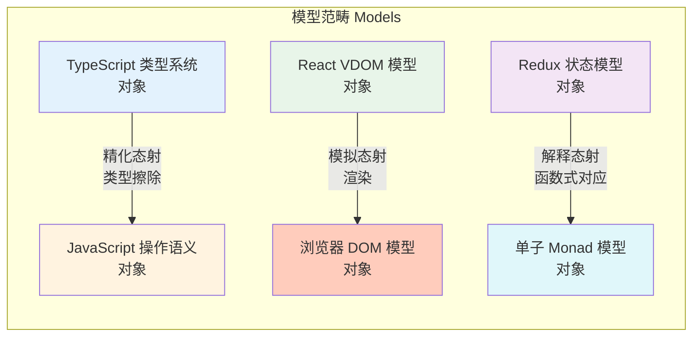
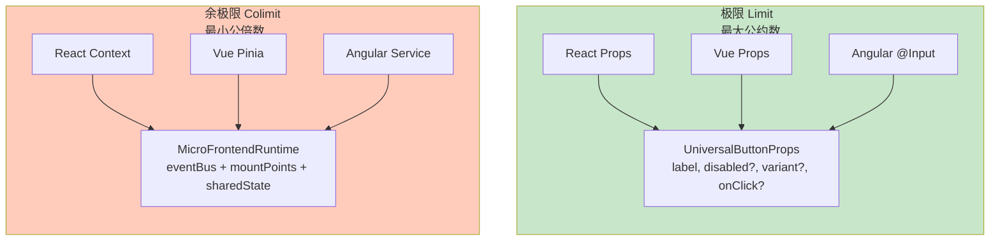
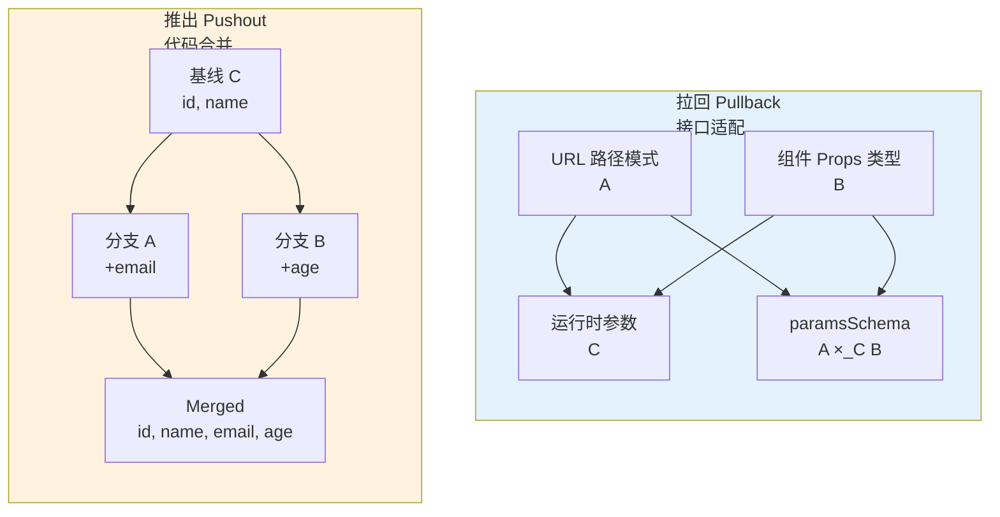

# 多模型的范畴构造与极限语义

## 引言

在软件工程中，我们每天都在和"模型"打交道：类型系统是一种模型，它抽象了程序的行为；操作语义是一种模型，它描述了程序如何一步步执行；React 的虚拟 DOM 是一种模型，它抽象了浏览器的真实 DOM；Redux 的状态树是一种模型，它抽象了应用的全局状态。

这些模型各自解决不同的问题，但鲜有人追问：**这些模型之间有什么关系？**

范畴论的价值在于提供了一种统一的语言来描述这些关系。当我们说"模型 A 是模型 B 的精化"，或者"模型 C 可以同时解释模型 D 和模型 E 的行为"时，我们实际上是在描述模型之间的结构性关系。范畴论把这些直觉性的描述形式化了。

本章构造**模型范畴 Models**，分析其中的极限与余极限、初始对象与终端对象、拉回与推出、以及笛卡尔闭性，并将这些抽象构造映射到跨框架工具链设计、版本合并策略和元编程系统的工程实践中。

---

## 理论严格表述

### 1. 模型范畴 Models 的构造

在模型范畴 **Models** 中，一个**对象**是一个形式化模型 $M$，包含：
- **语法（Syntax）**：模型的语言——类型表达式、项、语句等
- **语义（Semantics）**：语义的解释域——集合、范畴、域等
- **满足关系（Satisfaction）**：语法元素如何映射到语义元素

一个从模型 $A$ 到模型 $B$ 的**态射** $f: A \to B$ 是一种结构保持映射。工程上最常见的三种态射：

**精化态射（Refinement）**：模型 $B$ 是模型 $A$ 的精化——$B$ 比 $A$ 更具体，但 $B$ 中的一切都可以在 $A$ 中找到对应。例如：TypeScript 类型系统 → JavaScript 操作语义（类型擦除保持运行时行为）。

**模拟态射（Simulation）**：模型 $B$ 模拟模型 $A$——$A$ 中的每个计算步骤都可以在 $B$ 中找到对应的计算，且保持可观察行为。例如：React 虚拟 DOM 模型 → 真实浏览器 DOM 模型。

**解释态射（Interpretation）**：模型 $B$ 解释模型 $A$——$A$ 的语义可以在 $B$ 的语义框架内被解释。例如：Redux 状态模型 → 范畴论中的单子（Monad）模型。

要证明 **Models** 是一个范畴，需要验证三个公理：
1. **结合律**：$(h \circ g) \circ f = h \circ (g \circ f)$。如果你先把 TypeScript 编译到 JavaScript，再把 JavaScript 编译到 WebAssembly，组合的语义不依赖于中间组合的顺序。
2. **单位律**：$f \circ id_A = f$，$id_A \circ g = g$。TypeScript 的"恒等编译"就是一个恒等态射。
3. **封闭性**：$g \circ f$ 仍然是合法态射。Redux → Monad → Haskell 类型系统的复合映射本身也是合法的模型关系。

### 2. 极限与余极限的语义解释

**极限（Limit）= 模型的"最大公约数"**

给定一组模型和它们之间的态射，这些模型的极限是"能同时满足所有模型的最具体约束"。

极限的本质是**保守的交集**：只保留所有模型都同意的东西，丢弃任何有分歧的东西。

**余极限（Colimit）= 模型的"最小公倍数"**

给定一组模型和态射，它们的余极限是"能包含所有模型的最小合并"。

余极限的本质是**最小合并**：取所有模型的并集，但消除冗余。

**极限 vs 积（Product）**：积是一种特殊的极限——当模型之间没有关系（没有态射）时的极限。极限在关系的约束下取共同部分，通常比积更小。

**余极限 vs 和（Coproduct/Sum）**：和是余极限的对偶——当模型之间没有关系时的余极限。余极限在关系的约束下最小合并，必须处理冲突；和直接取不交并，无冲突。

### 3. 初始对象与终端对象

**始对象（Initial Object）** 是范畴中的特殊对象，它到任何其他对象都有且只有一条态射。在 **Models** 中，始对象是**最抽象的模型**——它没有任何具体的约束，因此可以映射到任何其他模型。

工程实例：无类型 Lambda 演算。它只有语法规则（变量、抽象、应用），没有类型约束，没有特定的语义解释。从 Lambda 演算到任何编程语言都有一个解释态射（结构上是唯一的）。始对象对应"领域特定语言的语法核心"。

**终对象（Terminal Object）** 是始对象的对偶。从任何对象到终对象都有且只有一条态射。在 **Models** 中，终对象是**最具体的模型**——任何其他模型都可以被解释为它，但信息通常丢失。

工程实例：x86-64 机器码。任何高级语言程序都编译为机器码，但机器码丢失了源代码的所有结构信息。终对象对应"部署目标"。

### 4. 拉回与推出

**拉回（Pullback）** 是一种特殊的极限。给定两个模型 $A$ 和 $B$，以及它们到第三个模型 $C$ 的态射，$A$ 和 $B$ 在 $C$ 上的拉回是"在 $C$ 的约束下，$A$ 和 $B$ 的兼容部分"。

拉回的直观理解：两个模型在某个共同上下文中的"重叠区域"。

**推出（Pushout）** 是拉回的对偶。给定两个模型 $A$ 和 $B$，以及从第三个模型 $C$ 到它们的态射，$A$ 和 $B$ 在 $C$ 上的推出是"在 $C$ 的共享部分下，最小地合并 $A$ 和 $B$"。

推出对应代码合并：两个开发者从同一个基线 $C$ 出发，分别做了修改 $A$ 和 $B$。推出就是把两个修改合并为一个，同时保留基线的共享部分。如果冲突（改了同一行），推出不存在——需要人工介入。

### 5. 模型范畴的笛卡尔闭性

一个范畴是**笛卡尔闭的（Cartesian Closed Category, CCC）**，如果满足：
1. 有终对象
2. 任意两个对象的积存在
3. 任意两个对象的**指数对象**存在

CCC 的重要性在于：**它是简单类型 lambda 演算的语义模型。** 在 **Models** 中，CCC 性质意味着我们可以在模型层面定义"模型变换"，并像操作普通对象一样操作这些变换。

**指数对象 $B^A$** 直观上代表"从 $A$ 到 $B$ 的所有态射的集合"。在 **Models** 中，指数对象是**"模型变换器"**——一种把模型 $A$ 转换为模型 $B$ 的元模型。

工程实例：TypeScript → JavaScript 编译器是指数对象 $Models(JS)^{Models(TS)}$ 的一个元素。给定编译器 $c$ 和 TS 程序 $p$，可以"应用"编译器到程序上：$eval(c, p): Models(JS)$。这对应 CCC 的 $eval: B^A \times A \to B$ 态射。

---

## 工程实践映射

### 1. 用极限设计跨框架工具链

假设我们要设计一个能在 React、Vue、Angular 中使用的通用状态管理库。三个框架的"状态读写"模型有不同的细节，但共享核心结构。

极限思维告诉我们：提取三个模型的共同抽象——即"极限"。

```typescript
// 极限 = 三个模型的共同抽象
interface UniversalState<T> {
  get(): T;                          // 三者都支持读取
  set(value: T): void;              // 三者都支持写入
  subscribe(callback: (value: T) => void): () => void; // 三者都支持订阅
}

// 每个框架提供适配器，把自己的模型映射到极限
function createReactAdapter<T>(
  useStateTuple: [T, React.Dispatch<React.SetStateAction<T>>]
): UniversalState<T> {
  const [value, setValue] = useStateTuple;
  return {
    get: () => value,
    set: setValue,
    subscribe: (cb) => {
      // React 没有原生订阅机制，需要额外实现
      const interval = setInterval(() => cb(value), 0);
      return () => clearInterval(interval);
    }
  };
}

function createVueAdapter<T>(ref: Ref<T>): UniversalState<T> {
  return {
    get: () => ref.value,
    set: (v) => { ref.value = v; },
    subscribe: (cb) => watch(ref, cb, { immediate: true })
  };
}

function createAngularAdapter<T>(subject: BehaviorSubject<T>): UniversalState<T> {
  return {
    get: () => subject.getValue(),
    set: (v) => subject.next(v),
    subscribe: (cb) => {
      const sub = subject.subscribe(cb);
      return () => sub.unsubscribe();
    }
  };
}
```

极限的价值：基于 `UniversalState` 编写的逻辑可以跨框架复用。

**反例：误把积当成极限**

```typescript
// 错误做法：把 React 和 Vue 的所有 API 直接合并
interface BadUniversalComponent {
  // React 的 API
  props: Record<string, unknown>;
  state: Record<string, unknown>;
  setState: (updater: any) => void;
  render: () => any;
  // Vue 的 API
  data: () => Record<string, unknown>;
  methods: Record<string, Function>;
  computed: Record<string, Function>;
  template: string;
}
```

问题：这个接口允许同时定义 React 的 `render()` 和 Vue 的 `template`——这是无意义的。极限思维要求的是"约束下的交集"，而非无约束的并集。

### 2. 用拉回设计类型安全的路由参数

拉回对应"接口契约"——确保两个模型在某个共同协议下的兼容性。

```typescript
// 模型 A：URL 路径定义（字符串模式）
const routePattern = '/user/:userId/post/:postId';

// 模型 B：React 组件的 Props 类型
type PostPageProps = { userId: string; postId: string; };

// 模型 C：运行时解析后的参数对象（Record<string, string>）
// 态射 A→C：路由库把 URL 模式解析为参数对象
// 态射 B→C：组件接收的 props 来自参数对象

// 拉回 = "从运行时参数到 TypeScript 类型的安全映射"
import { z } from 'zod';
const paramsSchema = z.object({
  userId: z.string().uuid(),
  postId: z.string().uuid()
});

type ValidatedParams = z.infer<typeof paramsSchema>;
```

`paramsSchema` 是 URL 模式和组件 Props 在运行时参数上的拉回——它既约束了参数的形状（来自 Props 类型），又约束了验证规则（来自 URL 模式）。

### 3. 用推出理解版本合并冲突

推出对应"版本合并"——在共享基线上合并两个分支的修改。

```typescript
// 分支 A：给 User 接口添加了 email 字段
interface User_A {
  id: string;
  name: string;
  email: string;
}

// 分支 B：给 User 接口添加了 age 字段
interface User_B {
  id: string;
  name: string;
  age: number;
}

// 共同基线 C：原始的 User 接口
interface User_C {
  id: string;
  name: string;
}

// 推出 = Git 合并后的结果
interface User_Merged {
  id: string;      // 来自 C（共享）
  name: string;    // 来自 C（共享）
  email: string;   // 来自 A
  age: number;     // 来自 B
}
```

推出的关键性质：(1) 保留 C 的所有内容；(2) 包含 A 和 B 的非冲突新增内容；(3) 是"最小的"——没有添加不必要的内容。

**冲突场景**：

```typescript
// 分支 A：把 id 从 string 改为 number
interface User_A { id: number; name: string; }

// 分支 B：保持 id 为 string
interface User_B { id: string; name: string; }

// 错误的"推出"：
interface User_BadMerge { id: string | number; name: string; }
```

问题：推出不总是存在！当 A 和 B 在共享部分 C 上的修改不兼容时，推出可能不存在，或者需要额外的合并策略。正确的处理是：要么选择 A 的方案，要么选择 B 的方案。**不存在一个"自然"的合并——这是范畴论告诉我们的工程真理。**

### 4. 指数对象与元编程系统

指数对象对应"把变换器当作数据"——这是元编程的理论基础。

```typescript
// 指数对象 Models(B)^Models(A) = "从 A 模型到 B 模型的编译器"

// TypeScript → JavaScript 编译器
// 它是指数对象 Models(JS)^Models(TS) 的一个元素

// 指数对象的 eval 态射：
// eval: Compiler × TypeScriptProgram → JavaScriptProgram

// 工程实例：Babel 插件系统
const plugin: BabelPlugin = {
  visitor: {
    Identifier(path) {
      path.node.name = path.node.name.split('').reverse().join('');
    }
  }
};
// 插件是一个"变换器"（指数对象的元素），可以被存储、传递、组合
```

TypeScript 的编译器 API、Babel 的插件系统、Webpack 的 loader 系统，都是"把变换器当作数据"的工程实例。CCC 保证了这种"应用"操作在任意对象上都成立——不仅限于编译器应用，还可以是解释器应用、转换器应用、验证器应用。

### 5. 对称差分析：极限 vs 余极限 vs 积 vs 和

| 维度 | 极限 (Lim) | 余极限 (Col) | 积 (Prod) | 和 (Sum) |
|------|-----------|-------------|----------|---------|
| 构造方向 | "向下"提取共同部分 | "向上"合并为一个 | 笛卡尔积 | 不交并 |
| 信息保留 | 保守 | 激进 | 包含所有组合 | 包含所有分支 |
| 工程对应 | 接口提取、共同子集 | 适配器、运行时 | 联合类型 | Tagged Union |
| 前提条件 | 模型之间有关系 | 模型之间有关系 | 模型独立 | 模型独立 |
| 冲突处理 | 丢弃分歧 | 需要解决冲突 | 无冲突 | 无冲突 |
| 直观类比 | 最大公约数 GCD | 最小公倍数 LCM | 全组合 | 或类型 |

```typescript
// 积的例子：两个独立模型的简单组合
type ReactProps = { onClick: () => void; label: string };
type VueProps = { onClick: () => void; disabled: boolean };
type ProductProps = ReactProps & VueProps;
// { onClick: () => void; label: string; disabled: boolean }

// 和的例子：Tagged Union
type Result<T, E> =
  | { tag: 'ok'; value: T }
  | { tag: 'err'; error: E };
```

---

## Mermaid 图表

### 图表 1：模型范畴 Models 的对象与态射



### 图表 2：极限与余极限的工程对应



### 图表 3：拉回与推出的代码合并类比



---

## 理论要点总结

1. **模型范畴 Models 统一了程序语义的形式化描述**：对象为模型（语法 + 语义 + 满足关系），态射为结构保持映射（精化、模拟、解释）。结合律、单位律和封闭性在工程中分别对应编译管道的顺序无关性、恒等编译的无影响性、以及模型映射的可组合性。

2. **极限是"最大公约数"，余极限是"最小公倍数"**：极限保守地提取多个模型的共同部分（如跨框架通用接口），余极限激进地合并多个模型的全部功能（如微前端运行时）。积和和分别是极限与余极限在无关系假设下的特例。

3. **初始对象是"源"，终对象是"汇"**：始对象（无类型 Lambda 演算）是所有编程语言的共同语法起点；终对象（机器码）是所有程序的共同部署终点。始对象可逆（可嵌入多个模型），终对象不可逆（信息丢失）。

4. **拉回是"兼容性检查"，推出是"最小合并"**：拉回确保两个模型在共同协议下兼容（如类型安全的路由参数验证）；推出在共享基线上合并两个分支的修改（如 Git 合并）。当冲突不可调和时，推出不存在——范畴论揭示了版本合并的数学边界。

5. **笛卡尔闭性支撑元编程**：指数对象 $B^A$ 是"从 A 到 B 的模型变换器"（如编译器、Babel 插件、Webpack loader）。CCC 保证了变换器可以像数据一样被存储、传递和应用，这是现代构建工具链的理论基础。

6. **范畴论是认知工具而非算法工具**：它提供了"极限 = 交集"、"余极限 = 并集"、"拉回 = 适配"、"推出 = 合并"的直觉框架，帮助架构师在跨框架设计、版本管理和工具链抽象中做出结构化决策。但它不给出具体构造算法，也不关心性能特征——这些是工程判断的领域。

---

## 参考资源

1. **Riehl, E. (2016).** *Category Theory in Context*. Dover Publications. 现代范畴论的标准教材，系统阐述了极限、余极限、拉回、推出与笛卡尔闭性的构造与证明。

2. **Awodey, S. (2010).** *Category Theory* (2nd ed.). Oxford University Press. 从逻辑与计算机科学视角介绍范畴论，特别适合理解 CCC 与类型论的对应关系。

3. **Pierce, B. C. (2002).** *Types and Programming Languages*. MIT Press. 类型系统与程序语言的权威教材，涵盖简单类型 lambda 演算的 CCC 语义模型。

4. **Jacobs, B. (1999).** *Categorical Logic and Type Theory*. North Holland. 范畴逻辑与类型论的高级专著，深入分析了模型范畴的构造与语义解释。

5. **Barr, M., & Wells, C. (1990).** *Category Theory for Computing Science*. Prentice Hall. 面向计算机科学的范畴论入门，包含大量程序语义与软件工程的范畴化案例。

6. **Fiore, M. P. (1996).** "Axiomatic Domain Theory in Categories of Partial Maps." *PhD Thesis, University of Edinburgh*. 域论的范畴公理化，为指称语义的范畴构造提供理论基础。
