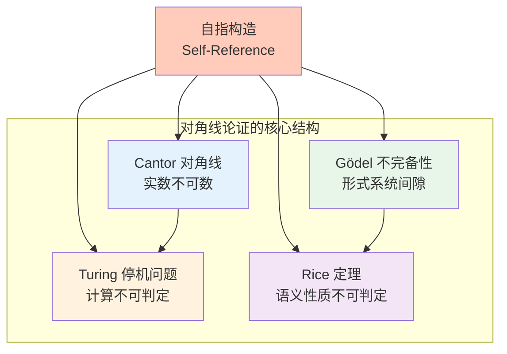
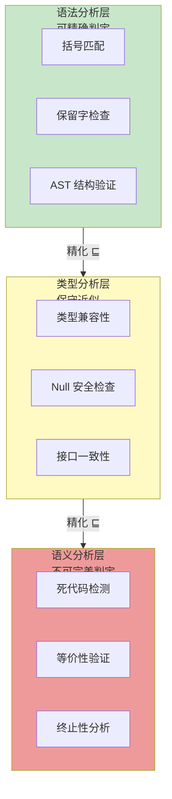
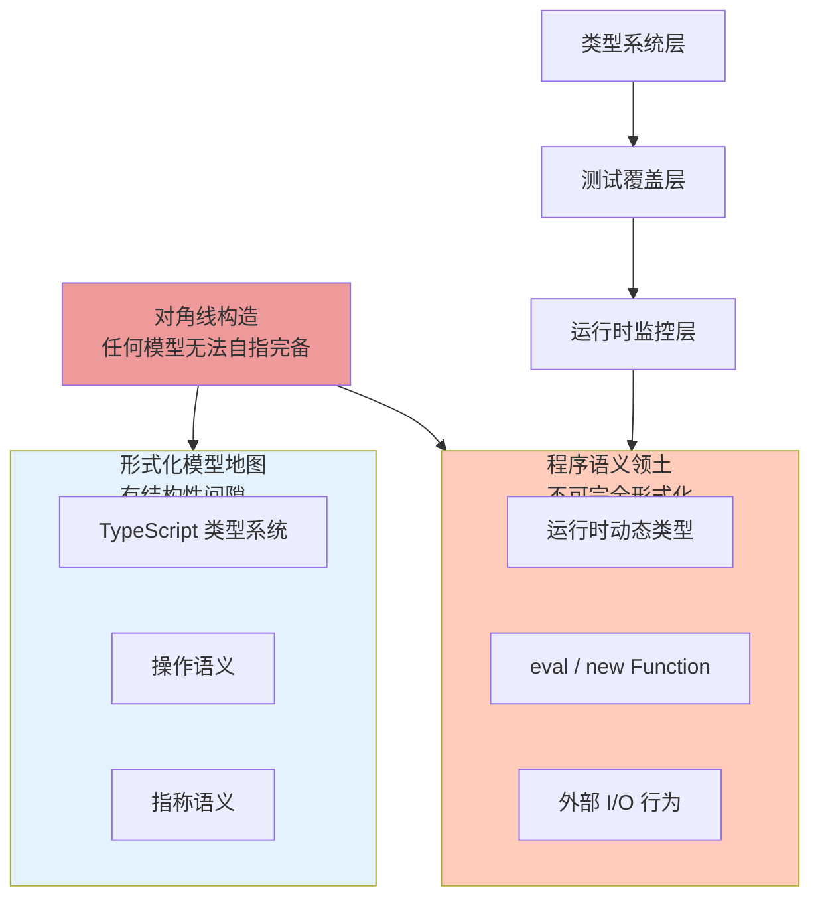

# 语义中的对角线论证

## 引言

在软件工程中，我们习惯于证明某件事可以做——展示一个算法、一个框架或一个工具，证明它在某些场景下有效。但有一类证明恰恰相反：它们证明某件事永远不可能做到。这类不可能性证明不是消极的，而是最强大的认知节省工具。当你知道某件事情在理论上不可能时，你就不会再浪费数周时间去尝试它。

对角线论证是证明不可能性的最强武器。从 Cantor 证明实数不可数，到 Turing 证明停机问题不可判定，到 Gödel 证明算术系统的不完备性——它们共享同一个核心思想：**自指（Self-Reference）**。本章的目标是理解对角线论证不是抽象的数学游戏，而是软件工程中每一个"我们无法完美做某事"背后的深层原因。我们将从 Cantor 对角线出发，经过 Rice 定理和停机问题，最终抵达模型间隙的构造，为 JS/TS 生态中的静态分析工具设计和类型系统边界提供严格的形式化依据。

---

## 理论严格表述

### 1. Cantor 对角线论证与程序空间的不可穷尽

Cantor 的对角线论证是数学史上最优雅的证明之一。其核心思想是：假设你能列出所有的东西，我总能构造出一个不在列表中的新东西。

**经典版本（实数不可数）**：假设区间 $[0,1]$ 内的所有实数可以被列出为 $r_1, r_2, r_3, \ldots$。构造一个新实数 $d$，它的第 $i$ 位小数与 $r_i$ 的第 $i$ 位小数不同。那么 $d$ 不在列表中——矛盾！因此实数不可数。

**程序语义中的应用**：这个论证直接适用于程序空间。假设存在一个完美的测试生成器，能枚举所有可能的程序行为。那么我们可以构造一个"对角线程序"：对于第 $n$ 个被生成的测试用例，这个程序的行为与预期不同。这个程序不会被生成器覆盖——矛盾！因此，**完美覆盖所有行为的测试生成器不可能存在**。

工程上这意味着：测试永远是不完备的。这不是因为我们不够努力，而是因为程序输入空间在数学上就是不可穷尽的。

### 2. Rice 定理：语义分析的不可判定性

Rice 定理（1953 年）可能是软件工程中最重要的不可能性结果：

> 任何非平凡的程序语义性质都是不可判定的。

其中，"非平凡"指这个性质不是所有程序都有，也不是所有程序都没有；"语义性质"指描述的是程序**做什么**，而不是程序**怎么写**。

| 性质类型 | 例子 | 可判定性 |
|---------|------|---------|
| 语法性质 | 程序是否包含变量 `x` | ✅ 可判定 |
| 语义性质 | 程序是否在所有输入下返回正数 | ❌ 不可判定 |
| 语义性质 | 程序是否等价于另一个程序 | ❌ 不可判定 |
| 语义性质 | 程序是否包含死代码 | ❌ 不可判定 |

Rice 定理的工程影响是毁灭性的：它意味着不存在一个完美的静态分析工具，能准确判断任意程序是否具有任意的非平凡语义性质。任何工具要么有漏报（遗漏实际错误），要么有误报（报告不存在的错误）。

### 3. 停机问题的范畴论语义

停机问题（Halting Problem）是 Turing 在 1936 年证明的：不存在一个程序 $H$，它能判定任意程序 $P$ 在任意输入 $I$ 上是否会终止。

**证明的核心（对角线论证）**：

假设存在这样的 $H$。构造一个新程序 $D$：

- $D$ 接收一个程序 $P$ 作为输入
- $D$ 调用 $H(P, P)$
- 如果 $H$ 说会终止，$D$ 就进入无限循环
- 如果 $H$ 说不会终止，$D$ 就立即终止

现在问：$D(D)$ 会终止吗？

- 如果 $D(D)$ 终止，那么 $H(D, D)$ 应该回答"会终止"，但 $D$ 的定义说这种情况下 $D$ 会无限循环——矛盾！
- 如果 $D(D)$ 不终止，那么 $H(D, D)$ 应该回答"不会终止"，但 $D$ 的定义说这种情况下 $D$ 会立即终止——矛盾！

因此 $H$ 不可能存在。

**范畴论语义**：在计算范畴中，停机问题对应于不存在一个从计算范畴到真值范畴的满函子。对象 = 程序（或程序-输入对），态射 = 计算步骤（或程序的偏函数语义），真值范畴 = $\{\text{true}, \text{false}\}$。如果停机判定器存在，它就是一个函子 $H: \text{Programs} \to \{\text{true}, \text{false}\}$，但 $D$ 的构造表明这样的函子会导致逻辑矛盾。

### 4. 模型间隙的对角线构造

在程序语义中，任何单一形式化模型都无法完全捕捉 JS/TS 的语义。对角线论证为这一论断提供了严格的数学基础。

Gödel 不完备性定理（1931 年）是对角线论证在逻辑系统中的体现：**任何足够强大的一致形式系统，都存在无法在该系统内部证明或否证的真命题。**

对于程序语义，这意味着：

- 类型系统是程序语义的模型
- 任何足够强大的类型系统（能表达通用计算）都必然存在间隙
- 这些间隙对应于类型系统无法判定真伪的语义性质

TypeScript 的类型系统正是如此：它能捕获大量运行时错误，但 `any` 类型、`eval` 调用和动态属性访问创造了对角线空间，使得某些语义性质无法在编译时判定。

---

## 工程实践映射

### 1. 接受近似：Rice 定理与静态分析工具设计

既然完美分析不可能，工程的目标就不是消除所有错误，而是把错误率降到业务可接受的水平。

```typescript
// 正确：理解 Rice 定理，接受静态分析的不完美
// ESLint 的 no-unused-vars 规则是语法分析，可精确判定
// 但以下性质是 Rice 定理意义上的语义性质，不可完美判定：
// - 这个函数是否在所有输入下都返回正数？
// - 这个函数是否等价于另一个函数？
// - 这个函数是否包含死代码？

// 工具的合理期望：
// 1. 对语法性质：追求完美（100% 准确）
// 2. 对语义性质：追求实用（减少误报/漏报，但不追求零）
```

TypeScript 的类型系统是语义分析的**保守近似**。它牺牲了精确性（拒绝了一些正确的程序），换取了可判定性（能在有限时间内给出答案）。`strictNullChecks` 把一部分运行时语义问题转化为编译时类型问题——但仍然是保守的。

```typescript
function divide(a: number, b: number): number | undefined {
  if (b === 0) return undefined;
  return a / b;
}

// TypeScript 能判定这个函数的类型签名
// 但它无法判定：调用方是否处理了 undefined 的情况
// 这需要运行时检查或更复杂的依赖类型系统
```

### 2. 用超时处理不可判定的停机问题

工程上接受不可判定性，用实用方案替代：

```typescript
async function runWithTimeout<T>(
  fn: () => Promise<T>,
  timeoutMs: number
): Promise<T | 'TIMEOUT'> {
  return new Promise((resolve) => {
    const timer = setTimeout(() => resolve('TIMEOUT'), timeoutMs);
    fn().then(result => {
      clearTimeout(timer);
      resolve(result);
    });
  });
}
```

这不是停机问题的解——它只是把问题从"是否停机"转化为"是否在限定时间内停机"。但对于工程来说，这是足够的。V8 引擎的 `execution timeout`、Node.js 的 `vm` 模块超时、以及浏览器的 `Long Task API`，都是这一思路的工程实现。

### 3. 限制表达力以消除对角线空间

TypeScript 的 `any`、JavaScript 的 `eval`、C 的指针算术——这些特性创造了对角线空间。如果移除它们，系统变得更弱但更可靠：

- **Rust** 的所有权系统限制了内存操作，消除了整类错误
- **纯函数式语言**禁止副作用，使得等价性分析更容易
- **有限状态机**替代通用图灵机，使得验证成为可能

```typescript
// 错误：试图通过静态分析完全消除死循环
function maybeInfinite(n: number): number {
  while (n > 0) {
    if (isPrime(n)) n = n - 1;
    else n = n + 1;
  }
  return n;
}

// 没有任何静态分析工具能对所有可能的 isPrime 实现和 n 值做出正确判断
// Rice 定理保证了这一点
```

### 4. 混淆不可判定性和计算复杂度的陷阱

```typescript
// 错误：认为不可判定只是计算量太大

// 不可判定 != 很难算
// 不可判定 = 不存在算法，无论多慢、无论有多少内存

// NP 完全问题（如旅行商问题）是难算的，但可判定：
// 你可以穷举所有路径，只是需要指数时间

// 停机问题是不可判定的：
// 不存在任何算法，即使是指数时间、即使是无限并行
// 这是数学上的不可能，不是工程上的困难
```

### 5. 分层防御缩小模型间隙

单一模型有间隙，但多个模型的交叉可以缩小间隙：

| 防御层 | 捕获的错误类型 | 理论依据 |
|--------|--------------|---------|
| 类型系统 | 类型不匹配、空值引用 | 保守近似 |
| 单元测试 | 特定输入下的错误 | 有限枚举 |
| 模糊测试 | 边界条件、异常输入 | 统计覆盖 |
| 运行时监控 | 内存泄漏、性能退化 | 动态观测 |

没有任何一层完美，但多层叠加覆盖大部分风险。

---

## Mermaid 图表

### 图表 1：不可能性证明的层次结构



### 图表 2：静态分析工具的能力边界



### 图表 3：模型间隙与分层防御



---

## 理论要点总结

1. **对角线论证通过自指构造不可能性**：Cantor 证明实数不可数、Turing 证明停机问题不可判定、Gödel 证明算术不完备——它们共享同一个核心模式：假设完备/可判定/可枚举，然后构造一个自指对象导出矛盾。这个模式是软件工程中每一个"无法完美做某事"的深层根源。

2. **Rice 定理划定静态分析的绝对边界**：任何非平凡的语义性质（描述程序做什么，而非怎么写）都不可判定。这意味着 ESLint、TypeScript、tsc 等工具对语义性质只能做近似，误报和漏报在数学上不可避免。工程目标应是"实用"而非"完美"。

3. **停机问题是 Rice 定理的特例，也是工程妥协的起点**：通过超时、watchdog、任务配额等机制，工程实践将不可判定的停机问题转化为可管理的"限时执行"问题。这不是数学上的解决，而是业务场景下的充分近似。

4. **模型间隙是足够强大系统的必然属性**：任何能表达通用计算的形式系统（包括 TypeScript 的类型系统）都必然存在间隙。`any`、`eval`、动态属性访问等特性在扩展表达能力的同时，也扩大了对角线空间。接受间隙的存在，是理性工程决策的前提。

5. **分层防御是应对模型间隙的唯一可行策略**：类型系统、单元测试、模糊测试、运行时监控——每一层覆盖不同的错误类别，每一层都不完美，但多层叠加可以大幅缩小实际风险。这与信息安全中的"纵深防御"理念同构。

6. **限制表达力是消除特定对角线空间的有效手段**：Rust 的所有权系统、纯函数式语言的无副作用约束、有限状态机的有界状态空间——这些设计通过牺牲一部分表达能力，换取了特定性质的可判定性。在需要高可靠性的场景中，这种权衡往往是值得的。

---

## 参考资源

1. **Turing, A. M. (1936).** "On Computable Numbers, with an Application to the Entscheidungsproblem." *Proceedings of the London Mathematical Society*, 42(2), 230-265. 停机问题与可计算性理论的奠基论文，对角线论证在计算理论中的首次严格应用。

2. **Rice, H. G. (1953).** "Classes of Recursively Enumerable Sets and Their Decision Problems." *Transactions of the American Mathematical Society*, 74(2), 358-366. Rice 定理的原始证明，确立了语义分析不可判定性的严格边界。

3. **Gödel, K. (1931).** "Über formal unentscheidbare Sätze der Principia Mathematica und verwandter Systeme I." *Monatshefte für Mathematik und Physik*, 38, 173-198. 不完备性定理的经典论文，对角线论证在逻辑系统中的最深远影响。

4. **Boolos, G. S., Burgess, J. P., & Jeffrey, R. C. (2007).** *Computability and Logic* (5th ed.). Cambridge University Press. 可计算性与逻辑的权威教材，系统阐述了对角线论证、Rice 定理和停机问题的证明细节。

5. **Sipser, M. (2012).** *Introduction to the Theory of Computation* (3rd ed.). Cengage Learning. 计算理论的标准入门教材，从自动机到不可判定性，提供了丰富的教学性证明。

6. **Pierce, B. C. (2002).** *Types and Programming Languages*. MIT Press. 类型系统与程序语言的权威教材，讨论了类型系统作为语义保守近似的理论基础。

7. **Cutland, N. J. (1980).** *Computability: An Introduction to Recursive Function Theory*. Cambridge University Press. 递归函数论的经典教材，深入分析了对角线方法在可计算性理论中的系统应用。
