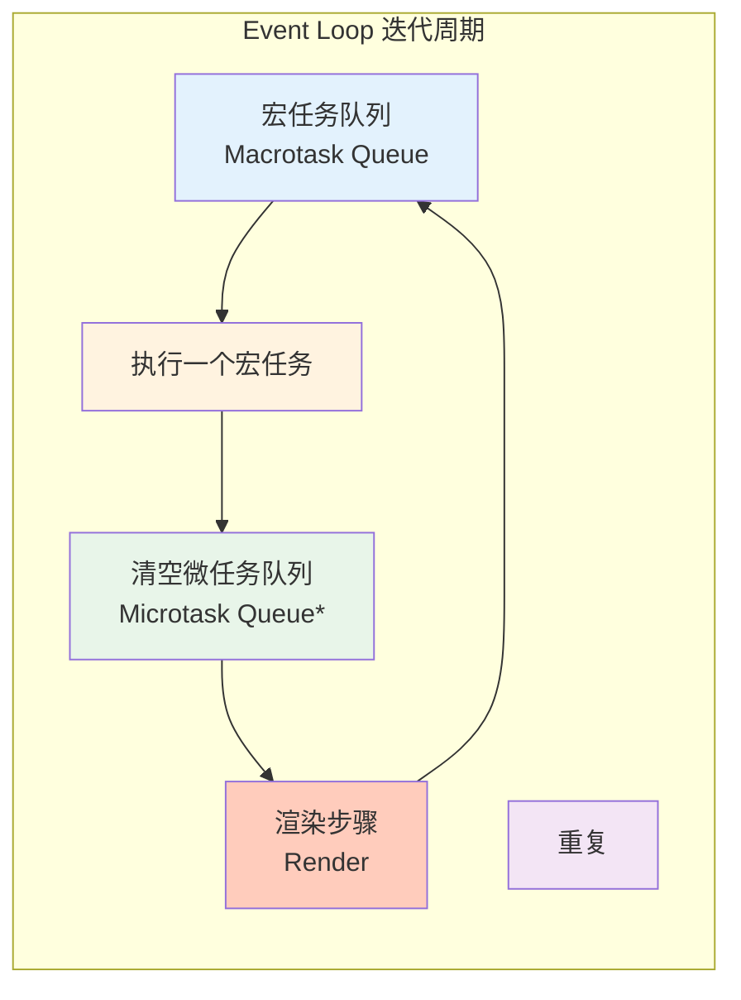
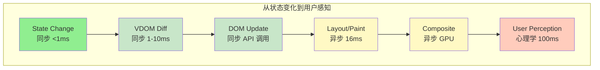

# 综合响应理论

## 引言

请预测以下代码的输出顺序：

```typescript
console.log("1");
setTimeout(() => console.log("2"), 0);
Promise.resolve().then(() => console.log("3"));
console.log("4");
```

如果你回答 `1, 4, 2, 3`，恭喜你——你和大多数中级开发者一样踩进了这个坑。正确答案是 `1, 4, 3, 2`。因为 `Promise.then` 的回调进入**微任务队列**（Microtask Queue），而 `setTimeout` 的回调进入**宏任务队列**（Macrotask Queue）。Event Loop 在一次迭代中，会先清空所有微任务，再执行一个宏任务。

这个例子揭示了一个根本问题：JavaScript 的"响应"不是单一维度的。在 JS/TS 生态中，响应发生在三个不同的时间尺度上：**同步响应**（纳秒-微秒，直接函数调用）、**异步响应**（微秒-毫秒，回调/Promise/async-await）、**并发响应**（毫秒-秒，Worker/多线程）。如果不区分这三种响应，就会写出灾难性的代码——例如在同步循环中串行发起 1000 个 `fetch` 请求，总时间等于 1000 倍 RTT。

综合响应理论的核心目标是：**提供一个统一的框架来理解、比较和选择不同时间尺度的响应机制**。我们将从响应函数的统一定义出发，经过同步与异步的范畴论区分、流式响应的余代数定义、并发响应的交错语义与偏序语义，最终抵达 JS Event Loop 的形式化模型和前端框架的响应式综合，为工程中的响应范式选择提供严格的决策依据。

---

## 理论严格表述

### 1. 响应函数的统一定义

系统对输入的完整响应可以形式化为一个函数：

$$
R: \text{Input} \times \text{Time} \to \text{Output}
$$

文字解释：对于给定的输入 $i$ 和时间点 $t$，$R(i, t)$ 给出系统在时间 $t$ 对输入 $i$ 的响应输出。

这个简单的定义已经蕴含了丰富的结构。我们可以将响应分解为三个正交分量：

$$
R(i, t) = R_{sync}(i) \cdot \mathbf{1}_{t = 0} + R_{async}(i, t) \cdot \mathbf{1}_{t > 0} + R_{concurrent}(i, t) \cdot \mathbf{1}_{parallel}
$$

其中 $\mathbf{1}_{t = 0}$ 是指示函数（同步响应，立即发生），$\mathbf{1}_{t > 0}$ 指示异步响应（延迟发生），$\mathbf{1}_{parallel}$ 指示并发响应（同时发生）。

**同步分量** $R_{sync}$：时间特性 $t = 0$，组合方式为函数复合 $f \circ g$，类型签名 $A \to B$。

**异步分量** $R_{async}$：时间特性 $t > 0$，组合方式为 Kleisli 复合（Monadic bind），类型签名 $A \to \text{Promise}(B)$。

**并发分量** $R_{concurrent}$：时间特性为物理时间重叠，组合方式为并行组合，类型签名涉及共享状态的同步原语。

### 2. 同步与异步的范畴论区分

从范畴论视角，同步和异步的组合方式有本质区别。

**同步 = 恒等态射与函数复合**。在集合范畴 $\mathbf{Set}$ 中，同步函数就是普通的态射 $f: A \to B$，复合满足结合律 $(f \circ g) \circ h = f \circ (g \circ h)$。

**异步 = Kleisli 箭头与 Monad bind**。异步函数是 Kleisli 箭头，属于某个 Monad（如 Promise Monad）的范畴。Kleisli 复合也是结合的，但多了 Monad 的单位律和结合律约束。

从同步到异步的转换不是"免费的"——它改变了组合结构。一个直接的工程后果是：同步代码中的 `try-catch` 捕获同一代码块中抛出的异常，但异步代码中 `new Promise` 的构造函数是同步执行的，而回调中的错误发生在不同的执行上下文中。

### 3. 流式响应的 Coinductive 定义

流（Stream）是**无限序列**的形式化表示。从范畴论角度，流是**余代数（Coalgebra）**：

```typescript
type Stream<A> = {
  head: A;
  tail: () => Stream<A>;
};
```

- 代数（Algebra）是"构造"数据的方式（如递归定义列表）
- 余代数（Coalgebra）是"观察"数据的方式（如从流中取 head 和 tail）
- 流是最终余代数（Terminal Coalgebra），对应 Coinductive 类型

AsyncGenerator 和 Observable 是 JS/TS 中流的两种主要实现。AsyncGenerator 是**拉取模式**（消费者控制），Observable 是**推送模式**（生产者控制）。两者在背压处理、多播支持和取消机制上存在对称差。

### 4. 并发响应的交错语义与偏序语义

**交错语义（Interleaving Semantics）**：并发被建模为所有可能的单线程执行序列的集合。两个并发进程 $P$ 和 $Q$ 的行为等于它们的所有可能交错。这是理解 Race Condition 的基础。

**偏序语义（Partial Order Semantics）**：不关注所有可能的交错，而是关注事件之间的 **Happens-Before** 关系 $\prec$：

- 程序顺序：同一线程中的前一条语句 Happens-Before 后一条语句
- 同步顺序：解锁操作 Happens-Before 后续的加锁操作
- 传递闭包：若 $a \prec b$ 且 $b \prec c$，则 $a \prec c$

偏序语义比交错语义更抽象，因为它忽略了不相关事件的顺序。在 JS 中，`Atomics.wait`/`notify` 和 `postMessage` 都是建立 Happens-Before 关系的机制。

### 5. JS Event Loop 的形式化模型

JavaScript 的 Event Loop 可以形式化为一个响应序列：

$$
R_{EventLoop}(i, t) = \sum_{k=0}^{\infty} \left( \mathrm{MacroTask}_k(i) + \mathrm{MicroTask}_k^*(i) + \mathrm{Render}_k(i) \right) \cdot \mathbf{1}_{t = t_k}
$$

其中：

- $\mathrm{MacroTask}_k$ = 第 $k$ 个宏任务（`setTimeout`、`setInterval`、I/O 回调）
- $\mathrm{MicroTask}_k^*$ = 第 $k$ 个宏任务之后清空的**所有**微任务队列
- $\mathrm{Render}_k$ = 第 $k$ 轮的可能渲染操作

**执行顺序的不变式**：

1. 从宏任务队列取出一个最老的任务执行
2. 执行所有微任务队列中的任务（包括执行微任务时新加入的微任务）
3. 如果需要，执行渲染步骤
4. 重复步骤 1

**微任务与宏任务的对称差**：

- 微任务能做到而宏任务做不到的：立即执行（在当前宏任务结束后立即执行）、高优先级（保证在渲染前执行）
- 宏任务能做到而微任务做不到的：明确延迟（`setTimeout(..., 1000)`）、I/O 回调、避免饥饿（宏任务之间允许浏览器渲染）

---

## 工程实践映射

### 1. 从同步到异步的安全转换

不是所有同步模式都能安全异步化。异常处理在同步和异步中的不对称是最典型的陷阱：

```typescript
// 同步版本：try-catch 捕获所有错误
function syncDivide(a: number, b: number): number {
  try {
    if (b === 0) throw new Error("Division by zero");
    return a / b;
  } catch (e) {
    console.log("Caught:", e);
    return 0;
  }
}

// 异步版本的经典错误
function asyncDivideReallyBroken(a: number, b: number): Promise<number> {
  try {
    return new Promise((resolve, reject) => {
      setTimeout(() => {
        if (b === 0) reject(new Error("Division by zero"));
        else resolve(a / b);
      }, 0);
    });
  } catch (e) {
    // 这行永远不会执行！因为 new Promise 立即返回，不会抛出
    console.log("Never caught:", e);
    return Promise.resolve(0);
  }
}
```

`try-catch` 捕获的是**同一代码块中同步抛出的异常**。异步回调中的错误需要通过 `Promise.catch` 或 `await` 的传播机制来处理。

### 2. 流式响应的工程实践：AsyncGenerator 与 Observable

```typescript
// AsyncGenerator：拉取模式，自然支持背压
async function* naturalNumbers(): AsyncGenerator<number> {
  let n = 0;
  while (true) yield n++;
}

// Observable：推送模式，需要额外背压控制
const numbers$ = new Observable<number>((observer) => {
  let n = 0;
  const interval = setInterval(() => observer.next(n++), 100);
  return () => clearInterval(interval);
});
```

**资源泄漏是流式编程的最常见错误**：

```typescript
// 错误：忘记取消订阅导致的内存泄漏
function LiveChart() {
  const [data, setData] = useState<number[]>([]);
  useEffect(() => {
    const service = new DataService();
    // 没有保存 unsubscribe 函数
    service.getData().subscribe({ next: (x) => setData(prev => [...prev, x]) });
    // 组件卸载时 WebSocket 不会关闭！
  }, []);
  // return ...
}

// 修正：保存并返回清理函数
function LiveChartFixed() {
  const [data, setData] = useState<number[]>([]);
  useEffect(() => {
    const unsubscribe = dataService.subscribe((x) => setData(prev => [...prev, x]));
    return () => unsubscribe(); // 组件卸载时取消订阅
  }, []);
  // return ...
}
```

### 3. 并发响应：Race Condition 与死锁

```typescript
// 创建共享内存
const buffer = new SharedArrayBuffer(4);
const counter = new Int32Array(buffer);

// Worker 代码：不使用原子操作
const workerCode = `
  const counter = new Int32Array(self.sharedBuffer);
  for (let i = 0; i < 100000; i++) {
    const current = counter[0];
    counter[0] = current + 1;  // 非原子操作，Race Condition
  }
`;

// 修正：使用 Atomics.add
const workerCodeFixed = `
  const counter = new Int32Array(self.sharedBuffer);
  for (let i = 0; i < 100000; i++) {
    Atomics.add(counter, 0, 1);  // 原子操作，无竞争
  }
`;
```

死锁的经典模式：

```typescript
// 使用 Atomics.wait/notify 实现互斥锁
class Mutex {
  private lock = new Int32Array(new SharedArrayBuffer(4));
  acquire() {
    while (Atomics.compareExchange(this.lock, 0, 0, 1) !== 0) {
      Atomics.wait(this.lock, 0, 1);
    }
  }
  release() {
    Atomics.store(this.lock, 0, 0);
    Atomics.notify(this.lock, 0, 1);
  }
}

// 死锁示例：两个线程以相反顺序获取两个锁
// 线程 A: acquire(mutex1); acquire(mutex2);
// 线程 B: acquire(mutex2); acquire(mutex1);
```

### 4. 前端框架的响应式综合

前端框架的响应可以形式化为一个复合响应链：

$$
\text{State Change} \xrightarrow{\tau_1} \text{VDOM/Diff} \xrightarrow{\tau_2} \text{DOM Update} \xrightarrow{\tau_3} \text{Layout/Paint} \xrightarrow{\tau_4} \text{Composite} \xrightarrow{\tau_5} \text{User Perception}
$$

关键洞察：虽然 DOM API（如 `element.textContent = '...'`）是同步调用的，但浏览器实际的**绘制**是异步的，发生在下一个渲染帧中。

```typescript
// 这段代码不会导致 1000 次重绘
for (let i = 0; i < 1000; i++) {
  element.textContent = i.toString();  // 只是标记脏状态
}
// 真正的重绘只发生在当前宏任务结束后
```

`requestAnimationFrame` 的回调在**渲染前**执行，是修改 DOM 的最后机会。但如果在 rAF 回调中执行耗时超过 16ms 的操作，就会导致**掉帧（jank）**。

```typescript
// 错误：在 rAF 回调中执行耗时操作
function badFrame(currentTime: number) {
  heavyComputation(); // 耗时 50ms
  requestAnimationFrame(badFrame);
}

// 修正：将耗时计算拆分到多个帧
let computationState = 0;
function goodFrame(currentTime: number) {
  const deadline = currentTime + 10;
  while (performance.now() < deadline && computationState < totalWork) {
    doIncrementalWork(computationState++);
  }
  if (computationState < totalWork) {
    requestAnimationFrame(goodFrame);
  }
}
```

### 5. Backpressure 的认知模型与工程处理

Backpressure（背压）是流式系统中最容易被忽视但最关键的概念。从认知科学角度，它的难点在于**时间尺度的不可见性**——生产者速度远大于消费者速度时，内存会在不知不觉中爆炸。

```typescript
// 策略 1：丢弃（Drop）—— 最新数据优先
source.pipe(throttleTime(100)).subscribe(consumer);
// 适用：实时图表、传感器数据

// 策略 2：缓冲（Buffer）—— 批量处理
source.pipe(bufferTime(1000)).subscribe(batch => {
  batch.forEach(consumer);
});
// 适用：日志收集、批量写入

// 策略 3：暂停（Pause）—— 拉取模式
const pullSource = new PullStream({
  pull: async () => {
    await consumer.ready;
    return producer.next();
  }
});
// 适用：文件流、网络流

// 策略 4：扩展（Scale）—— 增加消费者
source.pipe(mergeMap(item => consumer(item), 4)).subscribe();
// 适用：CPU 密集型任务
```

Node.js Readable Stream 的 `pipe` 方法实现了**隐式背压**：`writable.write` 返回 `false` 时，readable 自动暂停，等待 `drain` 事件。但这种透明性也意味着调试困难——当背压失效时，开发者往往不知道问题出在哪里。

### 6. 微任务饥饿与让出策略

```typescript
// 危险代码：微任务无限循环
function starveMacrotasks() {
  console.log("Start");
  let count = 0;
  function loop() {
    count++;
    if (count < 1000) {
      Promise.resolve().then(loop);  // 递归创建微任务
    }
  }
  loop();
  setTimeout(() => console.log("This might be delayed!"), 0);
  console.log("End");
}

// 修正：将递归微任务改为宏任务
function safeLoop() {
  let count = 0;
  function loop() {
    count++;
    if (count < 1000) {
      setTimeout(loop, 0);  // 使用宏任务，让出事件循环
    }
  }
  loop();
}
```

---

## Mermaid 图表

### 图表 1：JS Event Loop 的综合响应模型



### 图表 2：三种响应范式的范畴论对应

```mermaid
flowchart TB
    subgraph Sync["同步响应"]
        S1["恒等态射 id"]
        S2["函数复合 f ∘ g"]
        S3["类型 A → B"]
    end
    subgraph Async["异步响应"]
        A1["Kleisli 箭头"]
        A2["Monad bind >>= " ]
        A3["类型 A → Promise&#123;B&#125;"]
    end
    subgraph Concurrent["并发响应"]
        C1["积范畴 (A→B) × (C→D)"]
        C2["并行组合 ||"]
        C3["类型 Worker&#123;A→B&#125;"]
    end
    Sync -->|"添加时间维度"| Async
    Async -->|"添加物理并行"| Concurrent
    style Sync fill:#C8E6C9
    style Async fill:#FFF9C4
    style Concurrent fill:#FFCCBC
```



### 图表 3：前端响应链的时序分解



---

## 理论要点总结

1. **响应函数 $R(i, t)$ 统一了三种时间尺度的响应**：同步（$t = 0$，恒等态射与函数复合）、异步（$t > 0$，Kleisli 箭头与 Monad bind）、并发（物理时间重叠，积范畴与并行组合）。三种响应不是"程度差异"，而是**结构差异**——从同步到异步的转换改变了组合结构。

2. **Event Loop 的形式化揭示了微任务与宏任务的本质区别**：微任务是"尽快但不阻塞"（高优先级、在渲染前执行），宏任务是"明确延迟或 I/O 驱动"（允许浏览器渲染、避免饥饿）。不理解这一区别会导致微任务饥饿或不必要的渲染阻塞。

3. **流是余代数，对应 Coinductive 类型**：AsyncGenerator（拉取模式）与 Observable（推送模式）是 JS/TS 中流的两种对偶实现。拉取模式天然支持背压，推送模式更适合多播和组合操作，但需要显式背压控制。

4. **交错语义解释 Race Condition，偏序语义解释 Happens-Before**：交错枚举所有可能的执行序列，状态空间指数爆炸；偏序只关注因果依赖，更抽象但更实用。`Atomics` 和 `postMessage` 都是建立 Happens-Before 关系的工程机制。

5. **前端框架的响应是复合响应链**：State Change → VDOM Diff → DOM Update → Layout/Paint → Composite → User Perception。虽然 DOM API 是同步的，但浏览器绘制是异步的。`requestAnimationFrame` 在渲染前执行，是修改 DOM 的最后机会，但耗时操作会导致掉帧。

6. **背压是流式系统的必然要求**：生产者速度大于消费者速度时，没有背压策略的系统必然内存爆炸或数据丢失。丢弃、缓冲、暂停、扩展四种策略各有适用场景，对称差分析帮助选择最合适的策略。

---

## 参考资源

1. **Milner, R. (1989).** *Communication and Concurrency*. Prentice Hall. 进程演算与并发语义的经典教材，为理解交错语义与偏序语义提供了形式化基础。

2. **Winskel, G. (1993).** *The Formal Semantics of Programming Languages*. MIT Press. 程序形式语义的标准教材，系统阐述了操作语义、指称语义与公理语义的关系。

3. **WhatWG.** "HTML Living Standard — Event Loops." <https://html.spec.whatwg.org/multipage/webappapis.html#event-loops> Event Loop 的权威规范定义，是理解宏任务、微任务和渲染步骤的原始依据。

4. **Jacobs, B. (1999).** *Categorical Logic and Type Theory*. Elsevier. 范畴逻辑与类型论的高级专著，深入分析了余代数、Kleisli 范畴与响应式系统的范畴论结构。

5. **Rutten, J. (2000).** "Universal Coalgebra: A Theory of Systems." *Theoretical Computer Science*, 249(1), 3-80. 余代数理论的奠基论文，为流式数据结构和 Coinductive 类型提供了统一的数学框架。

6. **Meijer, E. (2012).** "Your Mouse is a Database." *Communications of the ACM*, 55(5), 66-73. 响应式编程与事件流处理的经典论述，从数据库视角重新理解了响应式系统的设计。

7. **Bainomugisha, E., et al. (2013).** "A Survey on Reactive Programming." *ACM Computing Surveys*, 45(4), 1-34. 响应式编程的全面综述，涵盖了 Signals、FRP、背压和主流实现的技术对比。
