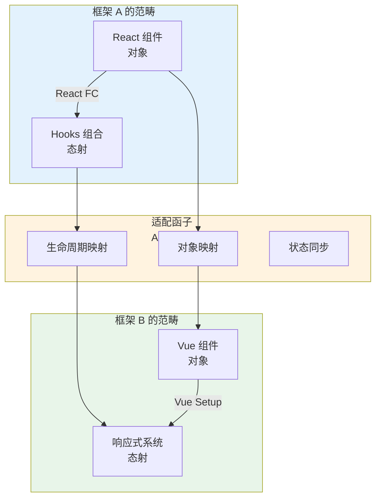
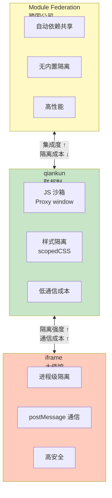
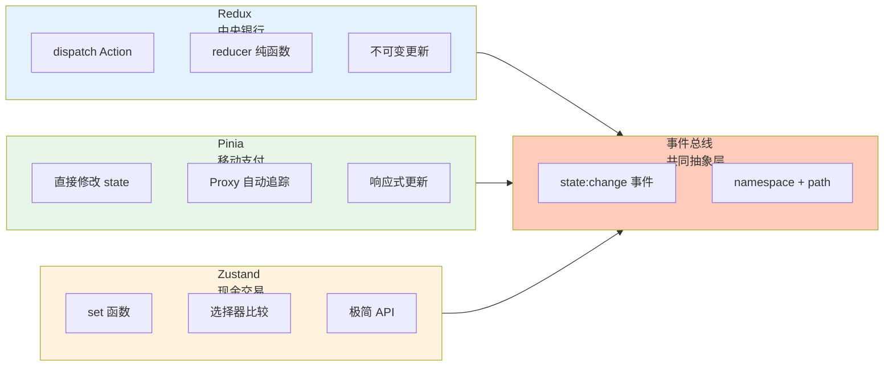

# 框架与范式互操作性

## 引言

十年前，前端开发者的选择很简单：选一个框架，所有代码都用它写。
今天，这个假设已经失效。现代企业级应用通常面临历史遗留（50% 的代码用 AngularJS 1.x 写，新业务要用 React）、团队自治（A 组用 Vue，B 组用 React，C 组用 Svelte）、渐进迁移和第三方集成等现实。
这些场景的共同点是：**多个具有不同内部模型的系统需要在同一个运行时中共存并协作。**

每个前端框架都是一个完整的计算模型：React 是函数式 + 虚拟 DOM + 单向数据流 + Hooks 时间语义；
Vue 是响应式代理 + 虚拟 DOM + 双向绑定 + 组合式 API；
Angular 是依赖注入 + Zone.js 变更检测 + RxJS 流；Svelte 是编译时优化 + 真实 DOM 操作。
这些模型在底层假设上存在根本差异。当它们被强制共存时，就会出现**模型冲突**。理解这些冲突的数学结构，是设计可靠互操作方案的前提。

本章从范畴论语境下互操作性的形式化定义出发，分析 React 组件在 Vue 中的适配器模式、微前端架构的多模型共存、状态管理库的兼容性矩阵，最终抵达范式泄漏的形式化定义与工程决策框架。

---

## 理论严格表述

### 1. 互操作性的形式化定义

在范畴论语境下，设 Framework A 的模型为范畴 $\mathbf{A}$，Framework B 的模型为范畴 $\mathbf{B}$。
框架 A 的程序 $P_A$ 能在框架 B 中正确执行，当且仅当存在一个**适配态射** $adapt: \mathbf{A} \to \mathbf{B}$，使得：

$$
\text{execute}_B(adapt(P_A)) \approx \text{execute}_A(P_A)
$$

即：经过适配后的程序在 B 中的执行结果，与原始程序在 A 中的执行结果是**观察等价**的。
我们不追求内部状态完全一致（那通常不可能），只追求外部可观察行为一致（UI 渲染结果、网络请求、用户交互响应）。

**兼容（Compatibility）**、**互操作（Interoperability）**与**可移植（Portability）**是三件不同的事：

- **兼容** = 两个系统可以在同一环境中运行，不互相破坏（"井水不犯河水"）
- **互操作** = 两个系统可以交换数据并协作完成任务（"说同一种工作语言"）
- **可移植** = 同一个程序可以在不同系统中运行，保持语义（"同一个人会说两种语言"）

兼容是消极的（不互相伤害），互操作是积极的（能互相帮忙），可移植是最理想的（不需要翻译）。

### 2. 适配器模式的范畴论语义

从范畴论角度看，框架间的适配器是一个**函子（Functor）**——它把一个范畴中的对象和态射映射到另一个范畴，同时保持结构关系。

React → Vue 的适配器做三件事：

1. **对象映射**：把 React 函数组件映射为 Vue 组件定义
2. **生命周期映射**：把 Vue 的 `setup`/`mount`/`update`/`unmount` 映射到 React 的渲染周期
3. **状态同步**：把 Vue 的 props 变化同步到 React 的重新渲染

```typescript
function adaptReactToVue<P>(ReactComponent: React.FC<P>): Vue.Component {
  return {
    setup(vueProps: P) {
      const containerRef = ref<HTMLElement>();
      const reactRootRef = ref<Root>();
      onMounted(() => {
        reactRootRef.value = createRoot(containerRef.value!);
        reactRootRef.value.render(React.createElement(ReactComponent, vueProps));
      });
      onUpdated(() => {
        reactRootRef.value?.render(React.createElement(ReactComponent, vueProps));
      });
      onUnmounted(() => reactRootRef.value?.unmount());
      return () => h('div', { ref: containerRef });
    }
  };
}
```

适配器（Adapter）、包装器（Wrapper）与代理（Proxy）是三件不同的事：

- **适配器**：转换接口使不兼容的接口能协作（改变接口）
- **包装器**：在不改变接口的情况下添加功能（保持接口）
- **代理**：控制对对象的访问，通常不改变接口（保持接口）

### 3. 微前端的多模型共存语义保证

微前端的核心承诺是：多个独立开发、独立部署的前端应用可以在同一个页面中协作，对用户来说像一个整体。这需要五条语义保证：

1. **隔离保证**：子应用的运行时错误不影响其他子应用
2. **样式隔离**：子应用的 CSS 不泄漏到其他子应用
3. **状态隔离**：子应用的全局状态（`window`、`document`）不互相污染
4. **通信契约**：子应用可以通过标准化协议交换数据
5. **路由协调**：浏览器 URL 变化时，正确的子应用被激活

三种主流方案的对称差：

| 维度 | qiankun | Module Federation | iframe |
|------|---------|------------------|--------|
| 隔离强度 | 软隔离（Proxy `window`） | 无内置隔离 | 硬隔离（浏览器进程级） |
| 通信成本 | 低：直接函数调用 | 低：共享模块 | 高：`postMessage` |
| 依赖共享 | 手动配置 | 自动共享 | 无 |
| 适用场景 | 异构框架共存 | 同构技术栈拆分 | 第三方不受信任内容 |

qiankun 强调**隔离和安全**，Module Federation 强调**集成和共享**，iframe 提供**最强隔离但最高通信成本**。这是一个经典的**安全-效率权衡**。

### 4. 状态管理库的兼容性矩阵

状态管理库之间的互换不像替换一个工具函数那么简单。每个库都嵌入了一套完整的状态更新语义：

| 库 | 更新哲学 | 核心机制 |
|----|---------|---------|
| Redux | 显式 Action + 不可变更新 | `dispatch` → `reducer` → 新状态 |
| Pinia | 响应式代理 + 直接修改 | Proxy 拦截修改 → 自动追踪依赖 |
| Zustand | 极简 `set` + 选择器 | `set` 调用 → 选择器比较 → 重渲染 |
| MobX | 直接修改 observable | 依赖追踪 → 自动重新执行观察者 |

即使两个库都存储了同一个状态值，状态变化的传播方式也完全不同。跨状态库同步的正确方式是基于**事件总线的共同抽象层**，而非直接共享对象引用。

### 5. 范式泄漏的形式化定义

"范式泄漏"（Paradigm Leakage）指的是：当使用框架 A 的代码被迫暴露框架 A 的内部假设时，框架 B 的使用者必须理解框架 A 的范式才能正确使用这段代码。

设框架 A 的公开 API 为 $API_A$，框架 A 的内部实现假设为 $Assumption_A$。如果一段对外宣称"框架无关"的代码，其正确使用依赖于 $Assumption_A$ 中的某些知识，则称发生了范式泄漏。

```typescript
// 声称框架无关的工具函数
export function useDebounce<T>(value: T, delay: number): T {
  const [debounced, setDebounced] = useState(value);
  useEffect(() => {
    const timer = setTimeout(() => setDebounced(value), delay);
    return () => clearTimeout(timer);
  }, [value, delay]);
  return debounced;
}
// 问题：这个函数使用了 React 的 useState 和 useEffect
// 虽然它导出为一个普通函数，但它只能在 React 组件中调用
// 这就是一个范式泄漏
```

范式泄漏、抽象泄漏和实现泄漏是三个不同层次的问题：

- **范式泄漏**：编程范式假设暴露（如 Hooks 规则泄漏到通用库）
- **抽象泄漏**：抽象层之下的实现机制意外暴露（如 ORM 暴露 SQL）
- **实现泄漏**：具体算法/数据结构暴露（如需要知道内部用数组而非链表）

---

## 工程实践映射

### 1. Web Components 作为互操作基线

Web Components 提供了浏览器级别的互操作标准，把互操作性问题从框架层下沉到了浏览器层。框架不再直接互相通信，而是各自与浏览器标准通信。

```typescript
class UniversalButton extends HTMLElement {
  static get observedAttributes() { return ['label', 'disabled']; }
  private _label = '';
  private _disabled = false;

  constructor() {
    super();
    this.attachShadow({ mode: 'open' });
    this.render();
  }

  attributeChangedCallback(name: string, oldVal: string, newVal: string) {
    if (name === 'label') this._label = newVal;
    if (name === 'disabled') this._disabled = newVal !== null;
    this.render();
  }

  private render() {
    this.shadowRoot!.innerHTML = `
      <button ?disabled="${this._disabled}">${this._label}</button>
    `;
  }
}
customElements.define('universal-button', UniversalButton);
```

这个组件可以在任何框架中使用：

- React: `<universal-button label="Click" />`
- Vue: `<universal-button :label="buttonLabel" />`
- Angular: `<universal-button [attr.label]="buttonLabel" />`
- Svelte: `<universal-button label={buttonLabel} />`

### 2. 微前端运行时：qiankun 的 JS 沙箱

```typescript
class ProxySandbox {
  private proxy: WindowProxy;
  private running = false;
  private addedProps = new Set<string>();
  private modifiedProps = new Map<string, any>();

  constructor(name: string) {
    const rawWindow = window;
    const fakeWindow = Object.create(null);
    this.proxy = new Proxy(fakeWindow, {
      get(target, prop) {
        if (prop === 'window' || prop === 'self' || prop === 'globalThis') {
          return this.proxy;
        }
        if (this.modifiedProps.has(prop as string)) {
          return this.modifiedProps.get(prop as string);
        }
        return rawWindow[prop as any];
      },
      set: (target, prop, value) => {
        if (this.running) {
          if (!(prop in rawWindow)) this.addedProps.add(prop as string);
          this.modifiedProps.set(prop as string, value);
        }
        return true;
      }
    });
  }

  active() { this.running = true; }
  inactive() {
    this.running = false;
    this.addedProps.forEach(prop => delete (this.proxy as any)[prop]);
    // 恢复原始 window 状态...
  }
}
```

每个微前端应用运行在自己的 `ProxySandbox` 中。应用 A 修改 `window.x = 1`，不会影响到应用 B 看到的 `window.x`。应用失活后，全局状态被恢复，避免副作用泄漏。

### 3. 跨状态库同步：事件总线适配器

```typescript
interface StateSyncProtocol {
  event: 'state:change';
  payload: {
    namespace: string;
    path: string;
    value: unknown;
    timestamp: number;
  };
}

// Redux 适配器：把 Redux Action 转换为通用事件
function reduxToUniversalMiddleware(store: ReduxStore) {
  return (next: Dispatch) => (action: Action) => {
    const prevState = store.getState();
    const result = next(action);
    const nextState = store.getState();
    const diff = calculateDiff(prevState, nextState);
    diff.forEach(({ path, value }) => {
      eventBus.emit('state:change', { namespace: 'redux', path, value, timestamp: Date.now() });
    });
    return result;
  };
}

// Pinia 适配器：把 Pinia 订阅转换为通用事件
function piniaToUniversalPlugin({ store }: PiniaPluginContext) {
  store.$subscribe((mutation, state) => {
    eventBus.emit('state:change', {
      namespace: 'pinia',
      path: mutation.events?.target?.join('.') || '',
      value: mutation.events?.newValue,
      timestamp: Date.now()
    });
  });
}
```

任何状态库都可以接入这个通用协议，消费方不需要知道状态来自 Redux 还是 Pinia。

### 4. 避免范式泄漏：真正框架无关的抽象

```typescript
// 正确：基于标准 Web API，不依赖任何框架
export class EventEmitter<T extends Record<string, any>> {
  private listeners: { [K in keyof T]?: Array<(payload: T[K]) => void> } = {};

  on<K extends keyof T>(event: K, handler: (payload: T[K]) => void): () => void {
    if (!this.listeners[event]) this.listeners[event] = [];
    this.listeners[event]!.push(handler);
    return () => this.off(event, handler);
  }

  emit<K extends keyof T>(event: K, payload: T[K]): void {
    this.listeners[event]?.forEach(h => h(payload));
  }

  private off<K extends keyof T>(event: K, handler: (payload: T[K]) => void): void {
    this.listeners[event] = this.listeners[event]?.filter(h => h !== handler);
  }
}
```

这个 `EventEmitter` 可以在任何环境中使用：React、Vue、Angular、Node.js 或浏览器原生环境。它是真正框架无关的，因为它只依赖 JavaScript 语言本身的标准特性，不依赖任何框架的范式假设。

### 5. 工程决策框架

| 场景 | 推荐方案 | 理由 |
|------|---------|------|
| 同技术栈，模块拆分 | Module Federation | 最高性能，最小开销，自动共享依赖 |
| 异构框架，强隔离需求 | iframe | 最强隔离，安全边界清晰，进程级保护 |
| 异构框架，用户体验优先 | qiankun / single-spa | 平衡隔离和集成度，无缝用户体验 |
| 共享通用组件 | Web Components | 浏览器原生标准，零框架依赖，长期稳定 |
| 状态跨子应用共享 | 事件总线 + 适配器 | 解耦具体状态库实现，最小共同抽象 |
| 第三方嵌入 | iframe + postMessage | 安全隔离是首要的，不可信任的外部代码 |

核心原则：

1. **互操作性是成本，不是收益**。如果没有明确的业务需求，避免引入多框架架构。
2. **隔离和集成是此消彼长的**。更强的隔离意味着更高的通信成本和更差的用户体验。
3. **找到最小共同抽象**。不同框架之间的互操作，应该基于最低层次的共同协议（Web Components、事件总线、标准 DOM API），而非高层框架特性。
4. **明确标注范式泄漏**。如果你的库只能在特定框架中正确使用，请在文档中明确标注，不要声称"框架无关"。

---

## Mermaid 图表

### 图表 1：框架互操作的范畴论语义



### 图表 2：微前端方案的对称差分析



### 图表 3：状态管理库的兼容矩阵



---

## 理论要点总结

1. **互操作性建立在观察等价而非内部等价之上**：经过适配后的程序在新框架中的执行结果，只需与原始程序观察等价（UI 渲染、网络请求、交互响应），无需内部状态一致。这一原则是设计适配器的认知起点。

2. **兼容、互操作、可移植是递增的能力要求**：兼容只需不冲突（沙箱隔离即可），互操作需要数据交换和状态共享（需要协议转换），可移植要求同一份代码在不同环境中保持语义（通常需要框架无关设计）。工程上应优先追求兼容，再逐步提升到互操作。

3. **适配器是范畴论语境下的函子**：它把源框架的对象（组件）和态射（生命周期/状态更新）映射到目标框架，同时保持结构关系。Web Components 是"只适配一次"的最优策略——适配到浏览器标准后，所有框架都能消费。

4. **微前端的三种方案对应三种治理模式**：qiankun 像联邦制（共享基础设施但有州法隔离），Module Federation 像跨国公司（文化统一、资源共享），iframe 像各国互派大使馆（完全自治、外交通信）。选择取决于隔离需求和性能约束。

5. **状态库的互操作不能通过直接共享引用实现**：Redux 的不可变更新、Pinia 的 Proxy 可变追踪、Zustand 的显式 set——这些更新语义互不兼容。基于事件总线的共同抽象层是跨库同步的正确方式。

6. **范式泄漏是框架互操作的最大隐性成本**：声称"框架无关"但隐含依赖 React Hooks 规则或 Vue 响应式假设的库，会在跨框架使用时产生意想不到的故障。明确标注框架依赖，是负责任的设计。

---

## 参考资源

1. **Garlan, D., & Shaw, M. (1993).** "An Introduction to Software Architecture." *Advances in Software Engineering and Knowledge Engineering*, 1-39. 软件架构的奠基性论文，为理解框架作为计算模型的互操作问题提供了概念基础。

2. **Mezzalira, L. (2021).** *Building Micro-Frontends*. O'Reilly Media. 微前端架构的权威实践指南，系统比较了 qiankun、Module Federation 和 iframe 等方案的设计权衡。

3. **Web Components Standard.** W3C Specification. 浏览器原生组件标准的权威规范，是理解跨框架互操作基线的技术基础。

4. **Gamma, E., et al. (1994).** *Design Patterns: Elements of Reusable Object-Oriented Software*. Addison-Wesley. 设计模式的经典教材，适配器模式、代理模式和包装器模式的原始定义与辨析来源。

5. **Jackson, D. (2006).** *Software Abstractions: Logic, Language, and Analysis*. MIT Press. 软件抽象的形式化方法专著，为理解范式泄漏和抽象泄漏提供了严格的逻辑框架。

6. **Webpack Module Federation.** webpack.js.org/plugins/module-federation-plugin/. 模块联邦的官方文档，详细阐述了构建时与运行时依赖共享的技术机制。

7. **qiankun Documentation.** GitHub: umijs/qiankun. 微前端运行时沙箱、样式隔离和生命周期管理的开源实现参考。
