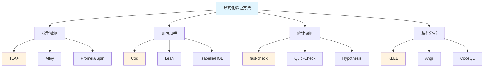
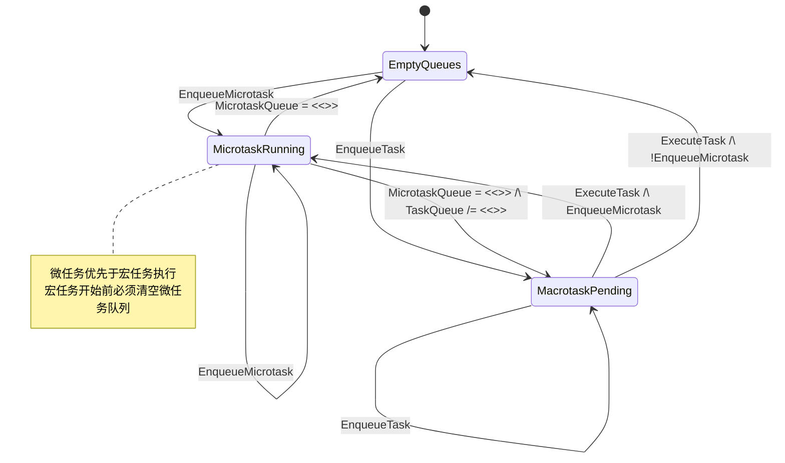

# 模型间隙的形式化验证

> **理论深度**: 形式化方法级别
> **前置阅读**: 类型-运行时对称差分析
> **目标读者**: 形式化验证工程师、架构师、对程序正确性有深度追求的高级开发者

---

## 引言

传统软件测试的思路是：编写若干输入用例，运行程序，检查输出是否符合预期。这种方法的覆盖率受限于测试作者能够想象到的场景数量——无论测试多么全面，它始终只是对无限输入空间的有限采样。形式化验证则走上了一条截然不同的道路：**不是检查程序在某些输入下的行为，而是证明程序在所有可能的输入下都满足某种性质**；当完全证明不可行时，则系统地搜索反例。

这一差异可以通过一个精妙的类比来理解：**传统测试像抽查产品质量**——你随机抽取一百个产品进行检查，如果全部合格，便推断整批产品可能合格，但永远无法排除第一百零一个是次品的可能性。**形式化验证像验证生产线的设计图纸**——你检查生产线的结构是否满足数学规范，证明只要原材料符合规格，无论来料如何波动，最终产品必然合格。

在 JavaScript/TypeScript 的语境下，"模型间隙"指的是**类型系统承诺的行为与运行时实际行为之间的差距**。TypeScript 编译器在静态阶段做出了大量保证：这个变量是 `string`、这个函数返回 `number`、这个对象具有特定的结构。然而，经过类型擦除后，运行时中的 JavaScript 引擎对这些保证一无所知。`any` 类型断言、类型守卫的误用、外部数据注入、编译器选项的宽松配置——所有这些因素都可能导致类型承诺与运行时现实之间的偏离。

形式化验证为缩小这一间隙提供了四种互补的武器：

1. **TLA+ 模型检测**——精确描述异步并发语义，在架构设计阶段发现竞态条件与时序漏洞
2. **Coq/Lean 证明助手**——对核心算法建立数学级别的正确性保证，证明类型擦除保持语义等价
3. **属性基测试（Property-Based Testing）**——将测试从"枚举例子"升级为"验证不变量"，自动生成数千个随机用例进行统计探测
4. **符号执行（Symbolic Execution）**——用符号变量代替具体值，系统性探索程序的所有执行路径，发现类型转换漏洞与边界情况

本章的目标并非教授 TLA+ 规范语言或 Coq 证明脚本的编写技巧——这些需要专门的学习路径。我们的核心使命是阐明：**这些工具在工程实践中的真实价值是什么？何时值得投入学习成本？如何在团队中将形式化方法与传统开发流程有机结合？**

---

## 理论严格表述

### TLA+ 与异步事件循环的数学建模

TLA+（Temporal Logic of Actions）由 Leslie Lamport 开发，是一种用于描述和验证分布式系统与并发算法的形式化规范语言。其核心思想极为简洁：**用数学精确描述系统应该做什么，然后用模型检测器自动检查实现是否满足规范**。TLA+ 的语法接近一阶逻辑与时序逻辑的自然融合，使得工程师可以用抽象的数学对象描述系统状态与状态转换。

考虑 JavaScript 的事件循环——这是模型间隙的经典来源。TypeScript 类型系统完全无法表达"这个 `Promise` 将在何时 resolve"、"这个微任务队列是否已被清空"、"这个 `setTimeout` 回调与 `await` 后续代码的精确时序关系"。TLA+ 却可以精确建模事件循环的时序语义：

```tlaplus
(* TLA+ 建模 JavaScript 事件循环的核心语义 *)
MODULE JSEventLoop
EXTENDS Sequences, Integers

CONSTANTS Tasks,    (* 所有可能的宏任务 *)
          Microtasks  (* 所有可能的微任务 *)

VARIABLES taskQueue,      (* 宏任务队列 *)
          microtaskQueue, (* 微任务队列 *)
          currentTask,    (* 当前执行的宏任务 *)
          callStack       (* 调用栈深度 *)

Init ==
  /\ taskQueue = <<>>
  /\ microtaskQueue = <<>>
  /\ currentTask = "none"
  /\ callStack = 0

(* 添加宏任务 *)
EnqueueTask(t) ==
  /\ t \in Tasks
  /\ taskQueue' = Append(taskQueue, t)
  /\ UNCHANGED <<microtaskQueue, currentTask, callStack>>

(* 添加微任务 *)
EnqueueMicrotask(m) ==
  /\ m \in Microtasks
  /\ microtaskQueue' = Append(microtaskQueue, m)
  /\ UNCHANGED <<taskQueue, currentTask, callStack>>

(* 执行一个微任务 *)
ExecuteMicrotask ==
  /\ microtaskQueue /= <<>>
  /\ LET m == Head(microtaskQueue)
    IN
      /\ microtaskQueue' = Tail(microtaskQueue)
      /\ callStack' = callStack + 1
  /\ UNCHANGED <<taskQueue, currentTask>>

(* 执行一个宏任务 *)
ExecuteTask ==
  /\ taskQueue /= <<>>
  /\ microtaskQueue = <<>>  (* 宏任务开始前必须清空微任务队列 *)
  /\ LET t == Head(taskQueue)
    IN
      /\ taskQueue' = Tail(taskQueue)
      /\ currentTask' = t
      /\ callStack' = 0
  /\ UNCHANGED microtaskQueue

Next ==
  /\E t \in Tasks : EnqueueTask(t)
  /\/ \E m \in Microtasks : EnqueueMicrotask(m)
  /\/ ExecuteMicrotask
  /\/ ExecuteTask
```

这个规范捕捉了事件循环的关键语义：**微任务优先于宏任务，且微任务队列必须清空后才执行下一个宏任务**。通过 TLA+ 模型检测器 TLC 的自动探索，我们可以验证类型系统承诺的"`await` 后的代码在微任务中执行"是否正确、`Promise.then` 与 `setTimeout` 的时序关系是否符合 ECMAScript 规范、`async/await` 的语法转换是否保持了语义等价性。

TLA+ 与其他形式化方法之间存在系统性的能力差异。与 Alloy（基于关系逻辑与 SAT 求解）相比，TLA+ 擅长描述**随时间变化的系统行为**（状态机、并发协议），而 Alloy 更适合静态结构约束（架构设计、数据关系）。对于 JS/TS 的异步语义建模，TLA+ 的表达更为自然。与 Promela/Spin（基于进程代数）相比，TLA+ 的数学表达能力更强，支持任意数学结构，而 Promela 更接近伪代码风格，更适合通信协议验证。

### Coq/Lean 证明精化关系

模型检测可以自动检查有限状态空间中的性质，但它有两个根本局限：一是状态空间的尺寸限制，TLC 通常只能处理 $10^6$ 到 $10^8$ 个状态；二是模型的抽象性——抽象可能遗漏真实系统的某些关键行为。证明助手（Proof Assistant）提供了另一种验证路径：**机器辅助的人工证明**。你写出严格的数学证明，证明助手验证每一步推理是否合法。

```coq
(* Coq 示例：证明列表反转的 involutive 性质 *)
Theorem rev_involutive : forall (X : Type) (l : list X),
  rev (rev l) = l.
Proof.
  intros X l. induction l as [| n l' IHl'].
  - reflexivity.
  - simpl. rewrite -> rev_app_distr. rewrite -> IHl'. reflexivity.
Qed.
```

这个经典证明展示了 Coq 的工作方式：声明定理、对数据结构做归纳、逐步应用推理规则、证明助手在每个步骤验证合法性，最终得到一个被机器验证为正确的证明对象。在 JS/TS 的语境下，证明助手可以用于证明类型擦除保持程序语义、编译器优化的正确性、运行时与类型系统之间的不变量关系。

Coq、Lean 与 Isabelle/HOL 三大证明助手形成了互补的生态。Coq 基于归纳构造演算（CIC），在编译器验证领域拥有最丰富的工业经验（CompCert 已持续开发超过 15 年）。Lean 4 采用了现代化的依赖类型理论与宏系统，对程序员更加友好，其 `mathlib` 数学库规模庞大。Isabelle/HOL 基于经典高阶逻辑，自动化能力最强（Sledgehammer 可以自动调用外部求解器），适合不需要深入理解证明过程的工程验证。对于 JS/TS 的形式化工作，Coq 的构造主义基础更适合程序语义的形式化——因为程序本身就是构造性的。

### 属性基测试作为统计探测

属性基测试（Property-Based Testing）代表了一种从"单元测试"到"不变量验证"的思维跃迁。传统单元测试询问"这个具体例子是否正确？"，属性测试则询问"什么性质对所有例子都成立？"。测试作者从"想例子"的创造性工作中解放出来，转而专注于"定义正确性"的分析性工作。

```typescript
// 属性测试：检查对所有输入都成立的性质
import fc from 'fast-check';

test('sort should produce ordered output', () => {
  fc.assert(
    fc.property(fc.array(fc.integer()), (arr) => {
      const sorted = sort(arr);
      for (let i = 1; i < sorted.length; i++) {
        expect(sorted[i]).toBeGreaterThanOrEqual(sorted[i - 1]);
      }
    })
  );
});

test('sort should preserve length', () => {
  fc.assert(
    fc.property(fc.array(fc.integer()), (arr) => {
      expect(sort(arr).length).toBe(arr.length);
    })
  );
});

test('sort should be idempotent', () => {
  fc.assert(
    fc.property(fc.array(fc.integer()), (arr) => {
      expect(sort(sort(arr))).toEqual(sort(arr));
    })
  );
});
```

在 JS/TS 生态中，`fast-check` 是最成熟的属性测试库。它利用 TypeScript 的类型信息指导随机数据生成，确保生成的输入是"合法的"（well-typed）。这与模糊测试（Fuzzing）形成鲜明对比：模糊测试不假设输入的合法性，可能生成完全无效的二进制数据，目标是发现崩溃与安全漏洞；属性测试则假设输入满足类型约束，目标是验证功能正确性。两者互补：属性测试覆盖正常情况，模糊测试发现极端情况。

### 符号执行发现语义差异

符号执行（Symbolic Execution）是一种用**符号变量**代替具体值来执行程序的分析技术。传统执行中输入 `x = 5`，执行 `if (x > 0) return x * 2` 得到结果 `10`。符号执行中输入 `x = α`（符号变量），程序为每条路径生成一个路径条件（Path Condition）：`α > 0` 时结果为 `2α`，`α <= 0` 时进入 `else` 分支。结合约束求解器（如微软的 Z3），符号执行可以判断某条路径是否可达、生成触发特定路径的具体输入、发现导致错误的输入组合。

```typescript
// 符号执行可以发现类型断言背后的漏洞
function parseConfig(value: unknown): Config {
  if (typeof value === 'string') {
    return JSON.parse(value);
  }
  if (typeof value === 'object' && value !== null) {
    return value as Config; // 类型断言！
  }
  throw new Error('Invalid config');
}
```

符号执行可以系统性地探索 `parseConfig` 的所有路径：字符串路径、对象路径、`null` 路径、数字路径。在对象路径中，符号执行会发现 `value` 可能缺少 `Config` 的必需字段——约束求解器可以生成具体反例 `{ missing: true }`，这个输入在运行时会导致后续访问 `undefined` 属性的错误。这正是 TypeScript 类型系统无法捕获的模型间隙：类型断言 `as Config` 让编译器相信了运行时并不保证的前提。

符号执行与抽象解释（Abstract Interpretation）形成了"精确但有限"与"近似但完整"的互补关系。符号执行追求路径级别的精确性，发现的 bug 是真实的（无误报），但面临严重的路径爆炸问题——循环与条件分支的组合可能导致指数级路径增长。抽象解释通过在汇合点合并抽象状态来保持有界性，可以处理大型程序，但保守近似可能产生误报。在工程实践中，符号执行适合安全审计阶段的漏洞发现，抽象解释适合 CI/CD 中的持续静态分析（如 Meta 的 Infer、GitHub 的 CodeQL）。

---

## 工程实践映射

### 多方法协同的分层验证策略

单一验证方法都有其不可逾越的局限，工业级最佳实践是**多方法协同的分层验证**。不同方法在覆盖范围、自动化程度、适用阶段与成本之间形成权衡矩阵：

| 验证方法 | 覆盖范围 | 自动化程度 | 适用阶段 | 人力成本 |
|---------|---------|-----------|---------|---------|
| TLA+ 模型检测 | 设计/协议层 | 高（模型检测器自动运行） | 架构设计期 | 中（需学习规范语言） |
| Coq/Lean 证明 | 核心算法 | 低（人工编写证明） | 关键模块开发 | 高（需数学训练） |
| 属性基测试 | 功能逻辑不变量 | 高（自动生成用例） | 开发期 | 低（仅需定义性质） |
| 符号执行 | 具体执行路径 | 中（需配置与解释） | 安全审计期 | 中 |
| 模糊测试 | 边界与崩溃 | 高（自动化运行） | 发布前 | 低 |
| 传统单元测试 | 已知场景回归 | 高 | 持续集成 | 低 |

**协同策略的实践框架**：

1. **设计阶段**：用 TLA+ 验证架构设计中的关键协议和时序约束。例如，验证 Redux-Saga 的 `takeLatest` 是否正确处理了竞态条件——当新请求发出后，旧请求的响应是否被正确丢弃。在规范层面发现的设计错误，修复成本远低于编码实现后的重构。

2. **开发阶段**：用属性基测试覆盖核心数据结构和算法的不变量。例如，验证序列化/反序列化的往返一致性（roundtrip preservation）：对于所有合法的 `User` 对象，`JSON.parse(JSON.stringify(user))` 应得到等价对象。这种测试比人工编写几百个单元测试用例更为高效且覆盖更广。

3. **关键模块**：用 Coq/Lean 证明安全关键函数的正确性。例如，加密算法的实现、权限校验逻辑、金融计算模块。CompCert 项目的经验表明，即使需要数十人年的投入，对于关键基础设施而言，形式化证明的正确性保证是无法用测试替代的。

4. **安全审计**：用符号执行和模糊测试发现潜在的漏洞和边界情况。符号执行适合分析类型转换、输入验证、边界检查等逻辑；模糊测试适合发现解析器、协议实现中的崩溃点。

5. **回归防护**：用传统单元测试覆盖已知 bug 的修复和关键用户场景。形式化方法无法完全替代单元测试——单元测试的可读性和确定性使其在持续集成中仍然不可替代。

### 不可表达性与验证的边界

形式化验证并非万能。由 Rice 定理可知：**任何非平凡的语义性质都是不可判定的**。这意味着不存在一种通用算法，可以判断任意程序是否满足任意非平凡性质（如"这个函数对所有输入都终止"）。

```typescript
// 不可判定的性质示例
function mystery(n: number): number {
  // 如果哥德巴赫猜想成立，返回 1；否则无限循环
  // 我们无法在通用算法层面验证这个函数是否总是终止
  return 1;
}
```

这一理论边界对工程实践的影响是深远的：

| 可验证的性质 | 不可验证的性质 |
|-------------|--------------|
| 类型安全（在有限类型系统内） | 功能正确性（完全意义上的） |
| 内存安全（无越界访问） | 性能保证（执行时间、内存占用） |
| 无死锁（有限状态系统） | 终止性（通用情况） |
| 协议合规（有限消息序列） | 用户体验与主观满意度 |

精确的理解是：形式化验证像医学诊断——它可以检测"客观指标"（血压、血糖），但无法评估"主观体验"（幸福、疼痛）。医学诊断可以发现"疾病"（bug），但不能保证"健康"（完美）。但与医学不同的是，形式化验证在数学上是精确的——如果验证通过，性质一定成立，不存在"假阴性"。

### 工业应用的成本效益分析

形式化验证的最大障碍不是技术难度，而是**成本效益比**。对一个普通的 CRUD  Web 应用引入完整的 TLA+ 建模和 Coq 证明显然是不经济的。决策框架应基于以下维度：

- **失败成本**：如果系统出现错误，代价是什么？医疗设备、金融交易、航天控制——高失败成本系统值得投入形式化验证。
- **状态空间复杂度**：系统是否涉及复杂的并发、分布式协议、异步交互？这些场景正是形式化方法的优势领域。
- **变更频率**：系统核心逻辑是否稳定？频繁变更的需求会使形式化证明迅速过时。
- **团队能力**：团队是否具备形式化方法的基础训练？缺乏数学背景的团队使用证明助手可能事倍功半。

对于绝大多数 JS/TS 项目，**属性基测试 + 符号执行 + 高质量单元测试**的组合已经能够提供足够的信心。形式化证明应保留给真正的关键路径。

---

## Mermaid 图表

### 形式化验证方法的能力谱系



### 模型间隙验证的工作流

```mermaid
flowchart LR
    subgraph 设计阶段
        D1[架构设计] --> D2[TLA+ 建模]
        D2 --> D3[模型检测]
        D3 --> D4&#123;通过?&#125;
        D4 -->|否| D1
        D4 -->|是| D5[进入开发]
    end

    subgraph 开发阶段
        DEV1[编码实现] --> DEV2[属性基测试]
        DEV2 --> DEV3[单元测试]
        DEV3 --> DEV4[集成测试]
    end

    subgraph 审计阶段
        A1[代码冻结] --> A2[符号执行]
        A2 --> A3[模糊测试]
        A3 --> A4&#123;发现漏洞?&#125;
        A4 -->|是| DEV1
        A4 -->|否| A5[发布]
    end

    D5 --> DEV1
    DEV4 --> A1

    style D2 fill:#e8f5e9
    style DEV2 fill:#e8f5e9
    style A2 fill:#e8f5e9
    style A5 fill:#c8e6c9
```

### 分层验证策略的决策树

```mermaid
graph TD
    START[开始验证规划] --> Q1&#123;失败成本 > 100万?&#125;
    Q1 -->|是| Q2&#123;核心算法稳定?&#125;
    Q1 -->|否| Q3&#123;并发复杂度 > 中?&#125;

    Q2 -->|是| T1[Coq/Lean 证明]
    Q2 -->|否| T2[TLA+ 模型检测]

    Q3 -->|是| T3[TLA+ + 属性测试]
    Q3 -->|否| Q4&#123;安全关键路径?&#125;

    Q4 -->|是| T4[符号执行 + 模糊测试]
    Q4 -->|否| T5[属性测试 + 单元测试]

    T1 --> T6[发布]
    T2 --> T6
    T3 --> T6
    T4 --> T6
    T5 --> T6

    style START fill:#e1f5fe
    style T1 fill:#fff3e0
    style T6 fill:#c8e6c9
```

### JS/TS 事件循环的 TLA+ 抽象



---

## 理论要点总结

1. **形式化验证的本质**：不是"测试更多用例"，而是"证明所有用例"。它将验证从统计推断提升为数学演绎，从经验科学跃迁为演绎科学。

2. **TLA+ 的工程价值**：在编码之前发现设计层面的错误。对于异步并发系统（事件循环、竞态条件、分布式协议），TLA+ 的抽象表达能力远超类型系统。

3. **证明助手的适用边界**：适合核心算法、安全关键模块、编译器正确性证明。不适合快速迭代的需求、启发式算法、用户体验逻辑。CompCert 的经验表明，关键基础设施的形式化证明值得投入，但日常业务逻辑不值得。

4. **属性测试的生产力优势**：将测试编写从"创造性工作"（想例子）转变为"分析性工作"（定义性质）。`fast-check` 等库在 JS/TS 生态中已经成熟，应成为每个项目的标准配置。

5. **符号执行的审计价值**：对类型断言、输入验证、边界检查等"模型间隙高发区"进行系统性路径探索。与抽象解释工具（CodeQL、Infer）结合使用，可以覆盖精确分析与大规模分析的不同需求。

6. **分层验证的黄金法则**：把最昂贵的验证资源（形式化证明）投入到最关键的组件上，用自动化的方法（属性测试、模型检测）覆盖大部分代码，用传统测试保障回归安全。

7. **不可判定性的哲学启示**：不存在完美的验证。形式化验证不是追求"绝对正确"，而是追求"在明确假设下的数学保证"。理解什么可以被验证、什么不能被验证，是形式化方法实践者的核心素养。

---

## 参考资源

1. Lamport, L. (2002). *Specifying Systems: The TLA+ Language and Tools for Hardware and Software Engineers*. Addison-Wesley.
2. Pierce, B. C., et al. (2024). *Software Foundations* (Electronic textbook).
3. Clarke, E. M., Grumberg, O., & Peled, D. A. (1999). *Model Checking*. MIT Press.
4. Leroy, X. (2009). "A Formally Verified Compiler Back-end." *Journal of Automated Reasoning*, 43(4), 363-446.
5. de Moura, L., & Bjørner, N. (2008). "Z3: An Efficient SMT Solver." *TACAS 2008*.
6. Cadar, C., & Sen, K. (2013). "Symbolic Execution for Software Testing: Three Decades Later." *Communications of the ACM*, 56(2), 82-90.
7. Cousot, P., & Cousot, R. (1977). "Abstract Interpretation: A Unified Lattice Model for Static Analysis of Programs." *POPL 1977*.
8. Claessen, K., & Hughes, J. (2000). "QuickCheck: A Lightweight Tool for Random Testing of Haskell Programs." *ICFP 2000*.
9. Rice, H. G. (1953). "Classes of Recursively Enumerable Sets and Their Decision Problems." *Transactions of the American Mathematical Society*, 74(2), 358-366.
10. Hoare, C. A. R. (1969). "An Axiomatic Basis for Computer Programming." *Communications of the ACM*, 12(10), 576-580.
