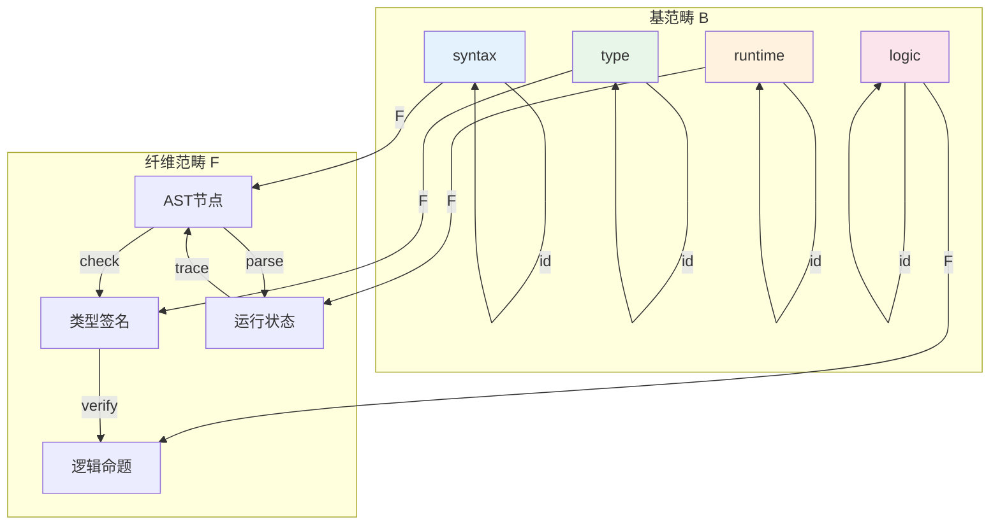
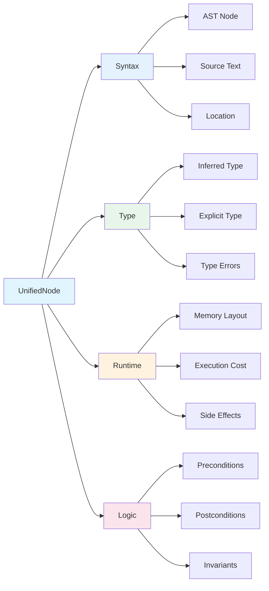
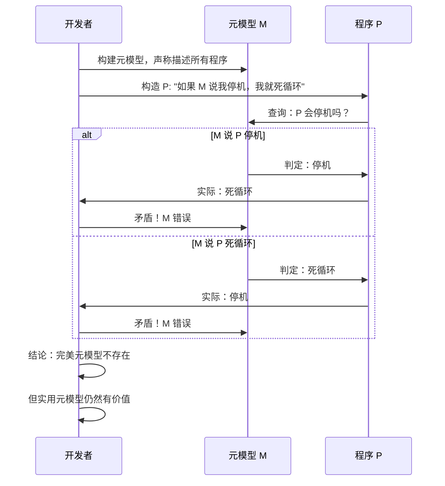

# JS/TS 统一元模型

> **核心命题**：JavaScript/TypeScript 可以从语法、类型、运行时、逻辑四个视角被统一理解。Grothendieck 构造提供了一种数学框架，将这些视角整合为一个连贯的元模型——但正如对角线论证所示，不存在"完美元模型"，只有"足够好的近似"。

---

## 引言

编程语言理论的发展，本质上是一部从"单一模型"到"多模型融合"的思想史。
1950 年代的机器码模型只有硬件执行这一个视角；
1960 年代的 BNF 语法模型引入了代码结构视角；
1970 年代的操作语义与指称语义加入了执行过程与数学含义视角；
1980 年代的类型论带来了静态约束视角；
1990 年代的程序验证（Hoare 逻辑）补充了逻辑正确性视角。
进入 21 世纪，语法、类型、运行时、逻辑四种模型并存，但始终缺少一个统一的数学框架来刻画它们之间的内在关联。

这一碎片化状态给 JS/TS 开发者带来了深刻的认知负担。
初级开发者只看到语法——"这段代码写了什么？
"中级开发者同时关注语法与类型——"这段代码的类型安全吗？
"高级开发者加入运行时视角——"这段代码的执行效率如何？
"而专家开发者需要在所有四个维度上同时思考——"这段代码在所有维度上都正确吗？"
这种认知层次的差异，根源在于缺乏一个统一的"地图"来指引开发者从单一视角扩展到多视角。

统一元模型（Unified Metamodel）正是为了回答这个问题而生。
它不是一个具体的工具或库，而是一种**思维框架**——一种将程序从多个互补视角进行结构化理解的方法论。
本章将展示：如何用范畴论的 Grothendieck 构造将语法、类型、运行时、逻辑四个视角整合为单一数学结构；
如何在工程实践中用 `UnifiedNode` 接口实现这一元模型；
以及为什么对角线论证证明了"完美元模型"的不可能性，却并不削弱元模型的实用价值。

理解统一元模型的关键，在于接受一个看似矛盾的真理：**我们需要追求统一，但永远不能达到完美统一**。
这就像地图与领土的关系——好的地图帮助我们导航，但地图永远不等于领土本身。

---

## 理论严格表述

### 四个视角的形式化定义

统一元模型的基础是四个互补的分析视角，每个视角都可以形式化为一个范畴（Category）：

**语法视角（Syntax）**关注代码的文本结构与抽象语法树（AST）。在范畴论语境下，语法范畴的对象是 AST 节点（`Program`、`Statement`、`Expression` 等），态射是语法关系（父子关系、兄弟关系）。语法分析可以被理解为从字符串到语法范畴的函子：`Parser: String → Syntax`。TypeScript 对 JavaScript 的语法扩展体现为：`TS_Syntax = JS_Syntax + 类型注解 + 接口 + 泛型`。这一视角回答的问题是："代码在结构上是否合法？"

**类型视角（Type）**关注代码的静态约束与类型关系。类型范畴的对象是类型（`number`、`string`、`{name: string}` 等），态射是子类型关系（`A <: B`）。类型检查是从语法到类型的函子：`TypeChecker: Syntax → Type`。TypeScript 的类型系统具有独特的组合：有界量化（Bounded Quantification）、结构子类型（Structural Subtyping）与条件类型（Conditional Types）。这一视角回答的问题是："代码在类型层面是否一致？"

**运行时视角（Runtime）**关注代码的执行行为与状态转换。运行时范畴的对象是运行时状态（变量绑定、堆内存、调用栈），态射是状态转换（语句执行、函数调用、Promise 解析）。解释执行是从语法到运行时的函子：`Interpreter: Syntax → Runtime`。JIT 编译则是从语法到机器码的函子：`JIT: Syntax → MachineCode`。这一视角回答的问题是："代码在实际执行时会发生什么？"

**逻辑视角（Logic）**关注代码的正确性证明与规范满足。逻辑范畴的对象是命题（"程序满足的性质"），态射是证明（从假设到结论的推导）。程序验证是从语法与类型到逻辑的函子：`Verification: Syntax × Type → Logic`。Curry-Howard 对应揭示了一个深刻的同构：类型即命题，程序即证明。这一视角回答的问题是："代码在逻辑上是否正确？"

### Grothendieck 构造的编程解释

Grothendieck 构造是范畴论中将**索引范畴族**组合为**单一范畴**的标准工具。给定基范畴 `B`（作为索引）和伪函子 `F: B^op → Cat`（从基范畴到范畴的范畴），Grothendieck 构造 `∫ F` 的对象是二元组 `(b, x)`，其中 `b ∈ B`，`x ∈ F(b)`。态射是 `(f, g): (b, x) → (b', x')`，其中 `f: b → b'` 是基范畴中的态射，`g: x → F(f)(x')` 是纤维范畴中的态射。

将这一抽象构造映射到 JS/TS 的语境中：

- **基范畴 `B`** = `{syntax, type, runtime, logic}`，即四个分析视角构成的离散范畴
- **伪函子 `F`**：
  - `F(syntax)` = AST 节点范畴
  - `F(type)` = 类型范畴
  - `F(runtime)` = 运行时状态范畴
  - `F(logic)` = 逻辑命题范畴
- **视角间的映射（态射）**：
  - `parse: syntax → runtime`（解析）
  - `check: syntax → type`（类型检查）
  - `verify: type → logic`（验证）
  - `execute: syntax → runtime`（执行）

Grothendieck 构造 `∫ F` 即为**统一元模型范畴**。它的对象是"带有视角标签的程序实体"，例如 `(syntax, FunctionDeclaration)`、`(type, (number) => string)`、`(runtime, {x: 42, y: "hello"})`、`(logic, "程序终止")`。态射则包含同一视角内的转换（如 AST 节点的语法重写）和跨视角的映射（如从语法节点到其推断类型的映射）。

这一构造的数学优雅之处在于：**它将"多视角分析"这一直觉概念，严格地转化为范畴论中的标准操作**。Grothendieck 构造保证了统一范畴的良定义性——它满足范畴公理（结合律、恒等律），因此可以使用范畴论的全部工具进行分析。

### 统一节点结构与信息损失

统一元模型需要一个具体的表示结构来承载四个视角的信息。`UnifiedNode` 接口提供了这一结构：

```typescript
interface UnifiedNode {
  // 唯一标识
  id: string;

  // 语法视角
  syntax: {
    node: SyntaxNode;
    sourceText: string;
    location: SourceLocation;
  };

  // 类型视角
  type: {
    inferredType: TypeNode;
    explicitType?: TypeNode;
    typeErrors: TypeError[];
  };

  // 运行时视角
  runtime: {
    memoryLayout: MemoryLayout;
    executionCost: Complexity;
    sideEffects: SideEffect[];
  };

  // 逻辑视角
  logic: {
    preconditions: Proposition[];
    postconditions: Proposition[];
    invariants: Proposition[];
  };
}
```

统一节点的创建过程本身就是多视角分析的实例化：先解析源码得到语法信息，再用类型检查器推导类型信息，接着进行运行时分析估算执行成本，最后提取契约信息（前置条件、后置条件、不变量）。

不同视角之间存在**信息损失**——从一个视角转换到另一个视角时，某些信息必然丢失。这是视角转换的本质属性，而非实现缺陷。`Syntax → Type` 的转换丢失了变量名、代码格式与注释，保留了类型约束。`Syntax → Runtime` 的转换丢失了变量名、类型注解与注释，保留了执行语义。`Type → Logic` 的转换丢失了具体的类型实现细节，保留了逻辑命题结构。信息损失的形式化表达是：**视角转换函子不是忠实的（not faithful）**——存在不同的源对象被映射到相同的目标对象。例如，`(x: number) => x + 1` 与 `(x: number) => x * 2` 具有相同的类型签名 `(number) => number`，但语义完全不同。

### 对角线论证与元模型的根本局限

正如哥德尔不完备定理揭示了任何形式系统的内在局限，**对角线论证证明了不存在包含自身的完美元模型**。构造一个程序 `P`，它读取一个元模型描述 `d`：如果 `d` 描述的程序会停机，`P` 进入死循环；如果 `d` 描述的程序会死循环，`P` 停机。现在问：`P` 的描述是否在元模型 `M` 中？无论回答是或否，都会导致矛盾。因此，`M` 不可能完美描述所有程序的所有方面。

这一结论不应令人沮丧，而应被视为**解放**。正是因为"完美元模型"不存在，我们才不必追求虚幻的完美；正是因为"足够好的元模型"是可能的，我们的工程实践才有价值。TypeScript 编译器本身就是一个极好的例子：它不完美（存在 `any`、存在类型断言），但它捕获了 95% 的常见错误，在工程上极其有价值。统一元模型的目标从来不是"完美地描述所有程序"，而是"足够好地帮助开发者理解和推理程序"。

---

## 工程实践映射

### 统一元模型在工具开发中的应用

基于统一元模型的思想，可以构建一系列新一代开发工具：

**智能 IDE**：传统的 IDE 提供语法高亮和基础类型提示。基于统一元模型的 IDE 可以同时展示语法信息（AST 结构）、类型信息（推断类型流）、运行时信息（变量值的预估范围）和逻辑信息（当前函数的前置/后置条件）。开发者在光标悬停时看到的不是单一维度的提示，而是多维度的综合分析。

**自动重构工具**：重构操作（如重命名、提取函数、内联变量）需要在多个视角下保持一致。统一元模型可以验证：语法重构后类型仍然兼容、运行时行为未被改变、逻辑契约仍然满足。这大大降低了大规模重构的风险。

**代码审查机器人**：传统的静态分析工具（如 ESLint）主要从语法视角检查代码。基于统一元模型的审查机器人可以从四个视角同时评估代码质量：语法风格一致性、类型安全完整性、运行时性能特征、逻辑正确性证据。交叉验证多个视角的结果，可以显著减少误报和漏报。

**代码迁移工具**：跨框架迁移（如 React 到 Vue）是前端开发中的常见痛点。统一元模型可以作为"中间表示"（IR）：先从源框架提取四个视角的信息，再重新生成为目标框架的语法/类型/运行时/逻辑表示。这类似于编译器中的多目标代码生成。

### 认知价值与开发者成长

统一元模型最深远的影响可能在于**认知层面**。它提供了一张"学习地图"，帮助开发者规划从前端到形式化方法的知识路径：

- **初学者**：从语法视角开始，理解"代码写了什么"。这是编程入门的自然起点。
- **进阶开发者**：引入类型视角，理解"代码的类型约束"。TypeScript 的严格模式是这一阶段的理想工具。
- **高级开发者**：加入运行时视角，理解"代码的执行行为"。性能分析工具（Chrome DevTools、Lighthouse）帮助建立这一直觉。
- **专家开发者**：引入逻辑视角，理解"代码的正确性"。断言、不变量检查、形式化规范是这一阶段的标志。

统一元模型将这一成长路径从隐性的经验积累转变为显性的知识框架。团队可以基于统一元模型建立代码审查清单：语法风格是否一致？类型定义是否完整？是否存在性能陷阱？测试覆盖是否充分？每个模块的文档模板也可以要求包含四个视角的描述，帮助新成员快速建立全局理解。

### 渐进式采用策略

在实际项目中引入统一元模型思想，不应追求一步到位，而应采用渐进式策略：

**阶段一：双视角分析**。同时关注语法和类型，启用 TypeScript 的 `strict` 模式，使用 `type-coverage` 工具监控类型覆盖率。这是成本最低、收益最明显的起点。

**阶段二：三视角分析**。加入运行时视角，引入性能分析工具（Chrome DevTools Performance 面板、Web Vitals），在代码审查中讨论执行效率。

**阶段三：四视角分析**。加入逻辑视角，使用 Jest/Playwright 进行测试，使用 `fast-check` 进行属性测试，在关键模块中编写前置/后置条件注释。

**阶段四：自动化**。将多视角分析集成到 CI/CD 流水线，自动生成多视角质量报告，建立跨视角的一致性检查。

### 性能与粒度的工程权衡

维护统一元模型需要面对三个工程挑战：

**内存开销**：每个程序实体需要维护四个视角的表示，内存使用可能增加 3-4 倍。**解决方案**：延迟计算（on-demand analysis）——只在需要时计算特定视角的信息；增量更新（incremental computation）——代码修改时只更新受影响节点的视角信息；缓存（memoization）——重复查询时复用已有结果。

**计算开销**：每次代码修改可能需要更新所有四个视角。**解决方案**：事件驱动更新——利用 TypeScript 编译器的增量编译能力；脏标记机制——只重新计算"脏"节点；后台线程——将元模型更新放到 Web Worker 中执行。

**粒度选择**：元模型应该在什么粒度上统一？太粗（文件级别）会丢失太多细节，无法提供有用的分析；太细（AST 节点级别）会导致数据量爆炸。**最佳实践**：语句/表达式级别——这对应于开发者的"思维单元"，在细节丰富度和计算成本之间取得了平衡。

---

## Mermaid 图表

### Grothendieck 构造的视角整合



### 统一节点的四视角结构



### 视角间的信息损失与函子映射

```mermaid
flowchart LR
    subgraph 语法
        S1["const add = (x, y) => x + y"]
    end

    subgraph 类型
        T1["(number, number) => number"]
    end

    subgraph 运行时
        R1["Function Object&#92;n[[Call]]: +"]
    end

    subgraph 逻辑
        L1["∀x,y∈number.&#92;nadd(x,y)=x+y"]
    end

    S1 -->|TypeCheck| T1
    T1 -->|Verify| L1
    S1 -->|Execute| R1
    R1 -.->|Trace| S1

    S1 -.->|丢失:变量名&#92;n代码格式| T1
    T1 -.->|丢失:实现细节| L1
    S1 -.->|丢失:类型注解| R1

    style S1 fill:#e3f2fd
    style T1 fill:#e8f5e9
    style R1 fill:#fff3e0
    style L1 fill:#fce4ec
```



### 对角线论证的元模型局限



---

## 理论要点总结

1. **多视角分析的必要性**：语法、类型、运行时、逻辑四个视角各自回答不同的问题，没有单一视角可以替代其他视角。TypeScript 编译器的成功恰恰在于它整合了语法与类型视角，但运行时与逻辑视角仍然是独立的分析维度。

2. **Grothendieck 构造的数学优雅**：将"多视角统一"这一工程直觉，严格转化为范畴论中的标准构造。基范畴编码"视角"，纤维范畴编码"每个视角下的具体对象"，统一范畴编码"带标签的多维对象"。

3. **信息损失的不可避免性**：视角转换必然伴随信息损失，这是函子非忠实性的数学体现。`(number) => number` 的类型签名抹去了函数体的语义差异。认识这一点，有助于我们正确理解每个视角的能力边界。

4. **对角线论证的解放意义**：完美元模型的不存在不是悲观的结论，而是务实的起点。它告诉我们不必追求虚幻的完美，而应专注于"足够好"的近似。TypeScript 编译器本身就是"不完美但极其有用"的典范。

5. **UnifiedNode 的工程映射**：统一元模型不是纯理论概念，可以通过具体的接口和工具链落地。IDE、重构工具、代码审查机器人、迁移工具都可以基于统一元模型的思想进行设计。

6. **渐进式采用的可行性**：团队不需要一次性实现完整的四视角分析。从双视角（语法+类型）开始，逐步扩展到运行时和逻辑，是最可持续的演进路径。

7. **元模型是地图而非领土**：统一元模型帮助开发者导航复杂的程序理解任务，但它本身不是程序。好的地图是有用的，但不应限制我们探索新的理解方式。保持对元模型局限性的清醒认识，是成熟工程师的标志。

---

## 参考资源

1. Grothendieck, A. (1961). "Technique de descente et théorèmes d'existence en géométrie algébrique." *Séminaire Bourbaki*.
2. Jacobs, B. (1999). *Categorical Logic and Type Theory*. Elsevier.
3. Streicher, T. (2006). *Fibred Categories à la Jean Bénabou*. arXiv:1801.02927.
4. Vickers, S. (2007). "Locales and Toposes as Spaces." *Handbook of Spatial Logics*.
5. Lawvere, F. W. (1969). "Adjointness in Foundations." *Dialectica*.
6. Hoare, C. A. R. (1969). "An Axiomatic Basis for Computer Programming." *Communications of the ACM*.
7. Scott, D. S. (1976). "Data Types as Lattices." *SIAM Journal on Computing*.
8. Girard, J.-Y. (1989). *Proofs and Types*. Cambridge University Press.
9. Wadler, P. (2015). "Propositions as Types." *Communications of the ACM*.
10. Pierce, B. C. (2002). *Types and Programming Languages*. MIT Press.
11. TypeScript Team. "TypeScript Compiler API." typescriptlang.org.
12. React Team. "React Concurrent Mode." react.dev.
13. Chrome Team. "Blink Rendering Engine." chromium.org/blink.
14. V8 Team. "V8 JavaScript Engine." v8.dev.
15. ECMA International. *ECMA-262 Specification*.
