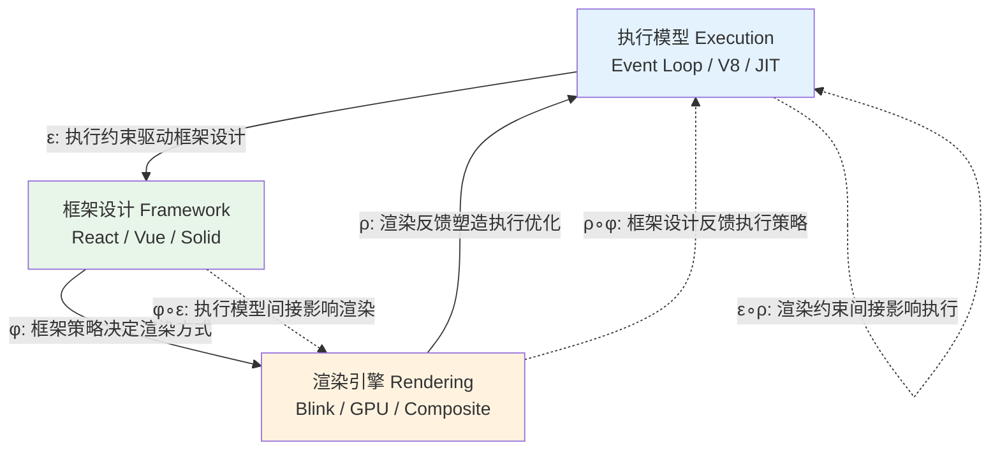
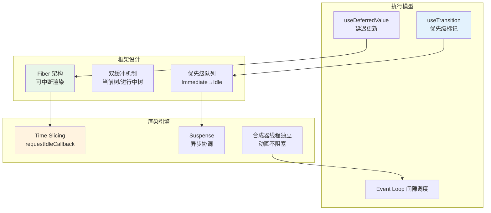
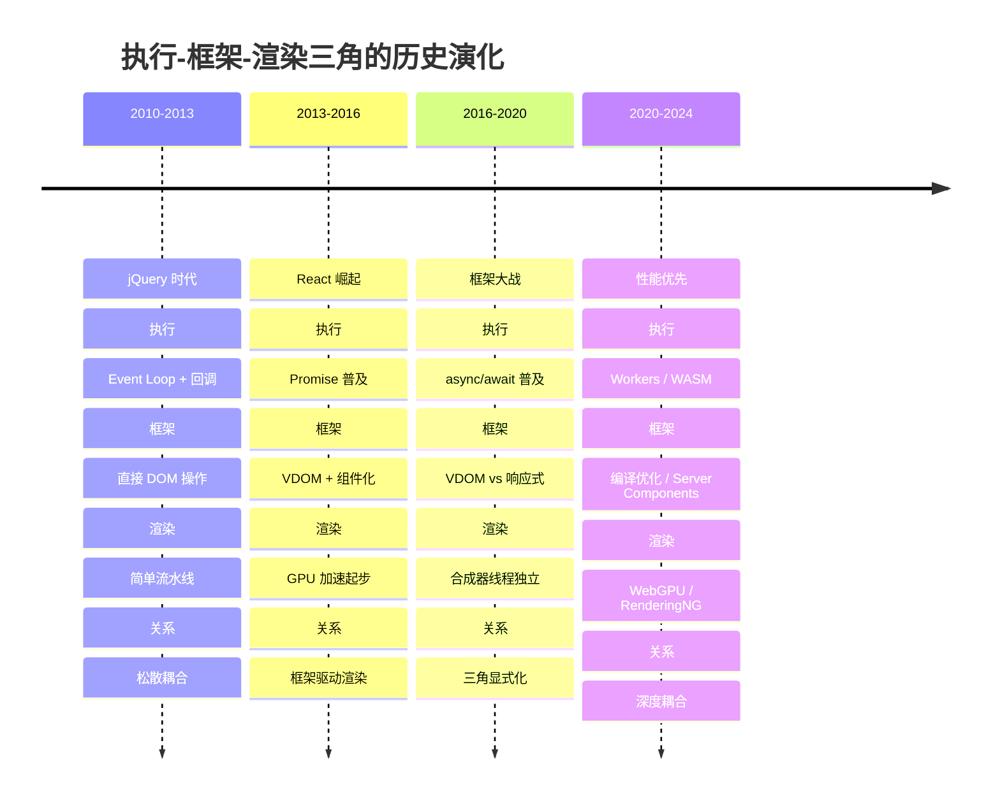

# 执行-框架-渲染三角

> **核心命题**：JavaScript 的执行模型、前端框架的设计、浏览器渲染引擎的机制，三者构成了一个相互制约、相互成就的三角关系。理解这个三角关系，是掌握现代前端技术的钥匙——优化一个维度可能损害另一个维度，唯有全局思考才能做出正确的架构决策。

---

## 引言

现代前端开发早已超越了"写几个页面"的简单时代。
今天的 Web 应用是复杂的软件系统，涉及三个核心领域的深度交互：**执行模型**（JavaScript 如何在浏览器中运行）、**框架设计**（如何组织和管理前端应用）、**渲染引擎**（浏览器如何将代码转换为屏幕上的像素）。
这三个领域不是孤立的知识点，而是一个相互关联、动态演化的生态系统。

执行模型决定了框架设计的可能性空间。
JavaScript 的单线程 Event Loop 是所有前端框架必须面对的根本约束——长时间 JS 执行会阻塞 UI，因此 React 引入了 Fiber 架构实现可中断渲染，Vue 将更新批量放入微任务队列，Angular 使用 Zone.js 批量处理异步操作。
如果 JavaScript 从一开始就是多线程的，整个前端框架的演化史将会完全不同。

框架设计反过来塑造了渲染优化的策略选择。
React 的虚拟 DOM 策略在内存中构建新的 VDOM 树，通过 Diff 算法生成最小 DOM 操作序列——这带来了跨平台能力和声明式编程体验，但也付出了内存与 CPU 开销。
Solid 和 Vue 3 的细粒度更新策略则直接操作真实 DOM，消除了 Diff 开销，却需要更复杂的依赖追踪机制。
框架的选择直接决定了应用与渲染引擎的交互方式。

渲染引擎的约束又反馈到执行策略的调整。
60fps 要求每帧在 16.67ms 内完成，这意味着单次 JS 任务应控制在 5ms 以内。
现代浏览器的合成器线程独立于主线程，使得 CSS `transform` 和 `opacity` 动画即使主线程繁忙也能流畅运行——这一特性直接催生了框架的 Time Slicing 和优先级调度策略。
GPU 加速能力则改变了动画库的设计哲学，Framer Motion 和 GSAP 优先使用 `transform` 而非 `width`/`height` 来避免触发昂贵的 Layout 计算。

本章将这一三角关系从工程经验提升为系统理论。
我们将展示：如何用范畴论中的函子形式化三个领域之间的映射关系；
React Concurrent Features 和 Vue 3 响应式重构如何体现三角关系的深度耦合；
以及如何基于三角关系建立性能诊断的系统性方法论。

---

## 理论严格表述

### 三角关系的范畴论模型

三角关系可以被严格形式化为三个范畴之间的函子映射：

**执行范畴 `E`**：对象是运行时状态（调用栈、堆内存、事件队列），态射是状态转换（函数调用、Promise 解析、事件处理、微任务执行）。
Event Loop 的调度策略、V8 的 JIT 编译优化、内存管理的垃圾回收策略——所有这些执行层面的机制都编码在执行范畴的态射中。

**框架范畴 `F`**：对象是组件或应用状态（React 的组件树、Vue 的响应式对象、Solid 的信号图），态射是状态更新（`setState` 调用、`dispatch` 动作、信号值改变）。
框架的状态管理模型、组件生命周期、响应式追踪机制——这些框架设计层面的选择编码在框架范畴的结构中。

**渲染范畴 `R`**：对象是渲染树或层（DOM 树、CSSOM 树、合成层），态射是渲染操作（DOM 更新、样式计算、Layout、Paint、Composite）。浏览器的渲染流水线、GPU 分层策略、关键渲染路径——这些渲染引擎层面的机制编码在渲染范畴的态射中。

三个函子刻画了三角关系的核心动力学：

- **`ε: E → F`**（执行模型影响框架设计选择）：单线程 Event Loop 迫使框架采用异步更新策略；V8 的 Hidden Classes 优化启发框架在初始化时稳定对象形状；JIT 编译特性引导框架减少运行时的代码分支。

- **`φ: F → R`**（框架设计决定渲染策略）：虚拟 DOM 框架生成完整的渲染树再进行 Diff；细粒度框架直接定位并更新受影响的 DOM 节点；编译时框架（如 Svelte）在构建阶段就将组件编译为高效的渲染指令。

- **`ρ: R → E`**（渲染约束反馈到执行优化）：60fps 的帧预算要求将长任务拆分为小任务；合成器线程的独立性允许框架安全地进行时间切片；GPU 纹理限制迫使框架采用智能分层策略。

函子的复合产生了间接影响：`φ ∘ ε: E → R` 表示执行模型通过框架设计间接影响渲染策略；`ρ ∘ φ: F → E` 表示框架设计通过渲染约束反馈到执行优化。这些复合函子解释了为什么前端优化往往具有"牵一发而动全身"的特性——改动一个维度可能通过复合函子产生连锁反应。

### 历史演化的范畴视角

三角关系的具体形式并非一成不变，而是随着技术演进而动态重构。从范畴论的视角看，这是三个范畴的结构（对象与态射）以及函子的定义随时间演化的过程：

**2010-2013（jQuery 时代）**：执行范畴的对象是简单的回调函数，框架范畴几乎不存在（jQuery 不是框架而是库），渲染范畴的态射是直接 DOM 操作。三角关系是松散耦合的——三者各自为政，缺乏系统性关联。

**2013-2016（React 崛起）**：执行范畴引入 Promise 对象，框架范畴出现虚拟 DOM 和组件化，渲染范畴开始 GPU 加速。函子 `φ: F → R` 变得显著——框架开始系统性驱动渲染优化。

**2016-2020（框架大战）**：执行范畴普及 `async/await`，框架范畴分裂为 VDOM 与响应式两大阵营，渲染范畴实现合成器线程独立。三角关系开始显式化——工程师逐渐意识到技术选择需要同时考虑三个维度。

**2020-2024（性能优先）**：执行范畴扩展到 Web Workers 与 WebAssembly，框架范畴引入编译时优化和服务器组件，渲染范畴进化到 WebGPU 和 RenderingNG。三角关系深度耦合——React Concurrent Features、Vue 的编译优化、Qwik 的 Resumability 都是三个维度协同进化的产物。

### 三角关联的度量体系

理解三角关系后，可以建立系统性的度量体系来监控前端应用的健康度：

**执行模型度量**：长任务（>50ms 的 JS 任务）的数量与分布、主线程阻塞时间（TBT）、JS 堆内存使用趋势、代码覆盖率。这些指标通过 `PerformanceObserver` 和 Chrome DevTools 采集，直接反映执行范畴的健康状态。

**框架设计度量**：不必要的重新渲染次数、组件渲染时间分布、状态更新频率、组件间依赖复杂度。React DevTools Profiler 和 Vue DevTools Performance 面板提供了这些指标的可视化，反映框架范畴的运行特征。

**渲染引擎度量**：Core Web Vitals（LCP、INP、CLS）、帧率（FPS）、布局抖动（Layout Thrashing）次数、合成层数量、重绘面积。Lighthouse 和 Web Vitals API 提供了标准化的采集工具，反映渲染范畴的输出质量。

三角一致性的理想状态是：执行度量显示低阻塞、框架度量显示高效更新、渲染度量显示流畅帧率。当三个维度的指标同时恶化时，通常意味着架构层面的系统性问题，而非局部优化可以修复。

---

## 工程实践映射

### 案例：React Concurrent Features 的三角分析

React Concurrent Features 是三角关系深度耦合的典范之作，三个维度同时发生了协同创新：

**执行模型层面**：`useTransition` 和 `useDeferredValue` 允许开发者显式标记更新的优先级。低优先级更新（如搜索结果列表渲染）可以被高优先级更新（如用户输入响应）中断。这一设计直接依赖于浏览器 Event Loop 的调度机制——React 将渲染任务拆分为小块，在 Event Loop 的间隙中调度执行。

**框架设计层面**：Fiber 架构重构了 React 的内部实现。每个更新单元都是一个 Fiber 节点，渲染过程可以"暂停"和"恢复"。双缓冲机制维护"当前树"和"进行中的树"，确保用户始终看到一致的 UI。优先级调度算法将更新分为 `Immediate`、`UserBlocking`、`Normal`、`Low`、`Idle` 五个等级，高优先级可以抢占低优先级。

**渲染引擎层面**：Time Slicing 利用 `requestIdleCallback`（及后来的自定义调度器）将渲染工作切分到多个帧中。Suspense 机制协调异步数据获取与渲染时序，避免"瀑布式"加载。这些特性依赖于渲染引擎的合成器线程独立性——即使主线程在进行繁重的 JS 计算，合成器线程仍然可以流畅地处理滚动和动画。

这三个层面的创新缺一不可。没有 Fiber 架构的可中断性，优先级调度无从谈起；没有 Event Loop 的间隙利用，Time Slicing 无法工作；没有合成器线程的独立，用户体验仍然会在主线程阻塞时受损。React Concurrent Features 的成功，正是三角关系协同优化的最佳证明。

### 案例：Vue 3 响应式重构的三角优化

Vue 3 的全面重构从另一个角度展示了三角关系的优化潜力：

**执行模型层面**：Vue 2 使用 `Object.defineProperty` 遍历对象的所有属性进行劫持，初始化成本高且无法监听新增属性。Vue 3 改用 `Proxy` 拦截整个对象，初始化性能显著提升，原生支持 `Map`、`Set` 等数据结构。这一改变直接受益于 ES2015 Proxy 的执行模型进化。

**框架设计层面**：选项式 API（`data`、`methods`、`computed`）演进为组合式 API（`ref`、`reactive`、`computed`）。组合式 API 提供了更好的逻辑复用能力和更细粒度的控制。响应式系统从全局追踪进化为组件级追踪，减少了无关更新的传播范围。

**渲染引擎层面**：Vue 3 编译器引入了静态提升（Static Hoisting）优化。编译器分析模板中的静态节点（如 `<h1>Title</h1>`），将其提升到渲染函数之外，在多次渲染中复用。这直接减少了运行时的 DOM 创建开销，也减轻了渲染引擎的 Patch 负担。

三角关系在这三个层面形成了正向反馈循环：`Proxy` 的执行效率提升 → 组合式 API 的设计空间扩大 → 编译时优化减少运行时开销 → 渲染引擎的工作量减少 → 整体帧率提升。Vue 3 的性能优势不是单一优化的结果，而是三角关系协同进化的产物。

### 渲染策略的决策矩阵

基于三角关系的理解，不同场景应选用不同的渲染策略：

| 应用场景 | 推荐策略 | 执行模型适配 | 框架选择 | 渲染优化 |
|---------|---------|-------------|---------|---------|
| 大型应用，复杂状态 | 虚拟 DOM Diff | Event Loop + 时间切片 | React | 批量更新、Suspense |
| 性能敏感，高频更新 | 细粒度响应式 | 微任务批量 | Solid | 直接 DOM 更新 |
| 平衡方案 | 响应式 + VDOM | nextTick 批量 | Vue | 静态提升、PatchFlag |
| 编译时极致优化 | 编译时框架 | AOT 生成指令 | Svelte | 无运行时 VDOM |
| 实时数据可视化 | 细粒度 + Canvas | requestAnimationFrame | 自定义 | 直接像素控制 |
| 内容型网站 | SSR + 静态生成 | 服务器预渲染 | Next.js/Nuxt | 图片懒加载、流式传输 |

这一矩阵的核心洞察是：**没有"最好的"渲染策略，只有"最适合当前三角约束"的策略**。技术选型必须同时考虑执行环境（移动端/桌面）、框架能力（生态系统/团队熟悉度）和渲染需求（动画/静态/实时）。

### 性能瓶颈的三维诊断法

当应用出现性能问题时，传统的"头痛医头"方法往往无效。基于三角关系的诊断流程要求从三个维度同时分析：

**步骤一：定位瓶颈维度**。使用 Chrome DevTools Performance 面板记录性能轨迹，分析时间分布：

- `Scripting`（黄色）耗时过长 → 执行模型问题，检查是否有长任务、是否有阻塞主线程的同步计算
- `Rendering`（紫色）耗时过长 → 渲染引擎问题，检查是否触发了强制同步布局（Forced Reflow）
- `Painting`（绿色）耗时过长 → 渲染引擎问题，检查重绘面积是否过大、层数是否过多
- `Idle`（空白）过少 → 框架调度问题，检查是否有过多的不必要的重新渲染

**步骤二：分析跨维度根因**。单个维度的症状往往有跨维度的根因：

- 执行模型的长任务可能是因为框架触发了大规模重新渲染（框架 → 执行）
- 渲染引擎的 Layout Thrashing 可能是因为框架在循环中交替读取和写入 DOM（框架 → 渲染）
- 框架的不必要重新渲染可能是因为执行模型的状态更新过于频繁（执行 → 框架）

**步骤三：应用针对性优化**：

- 执行模型优化：代码分割、懒加载、Web Workers、将计算移到服务器端
- 框架设计优化：`memo`/`computed` 缓存、虚拟列表、OnPush 变更检测、状态归一化
- 渲染引擎优化：`will-change` 分层、`transform` 替代 `top`/`left`、CSS `contain` 隔离、减少层数

### 跨平台三角映射

三角关系不仅适用于 Web 前端，还可以扩展到 React Native、Flutter、Electron 等跨平台场景：

**React Native**：执行模型是 JavaScript Core/Hermes，通过 Bridge 与原生代码通信；框架设计是 React 组件模型映射到原生组件；渲染引擎是 iOS 的 UIKit/SwiftUI 和 Android 的 Android View/Jetpack Compose。关键差异在于 Bridge 通信有显著开销——新架构（Fabric + TurboModules）通过减少 Bridge 使用来优化三角关系。

**Flutter**：执行模型是 Dart VM（AOT 编译为机器码）；框架设计是 Widget 树的声明式 UI；渲染引擎是 Skia（以及新的 Impeller）。Flutter 的独特之处在于它自己控制渲染引擎，不依赖平台原生渲染——这使得三角关系更加紧凑、性能更可控，但代价是更大的包体积。

**Electron**：执行模型是 Chromium 的 V8 + Node.js API；框架设计可以是任何 Web 框架；渲染引擎是 Chromium 的 Blink。Electron 本质上是 Web 应用打包为桌面应用——三角关系与 Web 端几乎相同，但增加了原生 API 访问能力和显著的内存开销（整个 Chromium 实例）。

---

## Mermaid 图表

### 执行-框架-渲染三角关系



### React Concurrent Features 的三角协同



### 前端技术演化的时间线



### 性能瓶颈诊断决策树

```mermaid
graph TD
    START[应用卡顿/性能差] --> PROF[Chrome DevTools Performance]

    PROF --> SCRIPT&#123;Scripting 占比高?&#125;
    PROF --> RENDER&#123;Rendering 占比高?&#125;
    PROF --> PAINT&#123;Painting 占比高?&#125;

    SCRIPT -->|是| E1[执行模型问题]
    E1 --> E2&#123;长任务?&#125;
    E2 -->|是| E3[代码分割 / Web Workers]
    E2 -->|否| E4[框架过度渲染?]
    E4 -->|是| E5[memo / computed / 虚拟列表]

    RENDER -->|是| R1[渲染引擎问题]
    R1 --> R2&#123;Layout Thrashing?&#125;
    R2 -->|是| R3[读写分离 / CSS contain]
    R2 -->|否| R4[层数过多?]
    R4 -->|是| R5[减少 will-change / 合理分层]

    PAINT -->|是| P1[绘制问题]
    P1 --> P2[减少重绘面积 / 使用 transform]

    style START fill:#e1f5fe
    style E3 fill:#c8e6c9
    style E5 fill:#c8e6c9
    style R3 fill:#c8e6c9
    style R5 fill:#c8e6c9
    style P2 fill:#c8e6c9
```

---

## 理论要点总结

1. **三角关系的系统性本质**：执行模型、框架设计、渲染引擎不是三个孤立的知识点，而是一个相互制约、动态演化的系统。优化一个维度可能损害另一个维度，唯有全局思考才能做出正确的架构决策。

2. **范畴论语义的建模能力**：将三个领域形式化为范畴，将领域间的影响形式化为函子，将协同优化形式化为函子复合。这一数学框架不仅提供了精确的描述语言，还揭示了间接影响的传导路径。

3. **历史演化的连续性**：从 jQuery 的松散耦合到 React/Vue/Solid 的深度耦合，三角关系经历了从隐性到显性、从简单到复杂的演化。理解这一历史脉络，有助于预测未来的技术方向（如 Server Components、WebAssembly、AI 辅助渲染）。

4. **案例研究的示范价值**：React Concurrent Features 和 Vue 3 响应式重构都是三角关系协同优化的成功范例。它们证明：真正的性能突破不是单一层面的优化，而是执行、框架、渲染三个层面的协同创新。

5. **决策矩阵的实用指导**：不存在"最好的"框架或"最好的"渲染策略。技术选型必须基于具体的三角约束：执行环境（设备性能、网络条件）、团队能力（生态熟悉度、维护成本）、渲染需求（动画密度、交互复杂度）。

6. **三维诊断的系统方法**：性能瓶颈的诊断必须同时考察执行、框架、渲染三个维度。Chrome DevTools 的不同颜色区域（Scripting、Rendering、Painting）对应着不同维度的问题，而问题的根因往往跨越维度。

7. **跨平台扩展的普适性**：三角关系不仅适用于 Web 前端，也适用于 React Native、Flutter、Electron 等跨平台场景。不同平台的差异主要体现在执行模型与渲染引擎的选择，而框架设计的基本原理（组件化、响应式、声明式 UI）具有跨平台的普适性。

---

## 参考资源

1. React Team. "React Documentation." react.dev.
2. Vue Team. "Vue.js Documentation." vuejs.org.
3. Angular Team. "Angular Documentation." angular.io.
4. SolidJS Team. "Solid.js Documentation." solidjs.com.
5. Svelte Team. "Svelte Documentation." svelte.dev.
6. Google Chrome Team. "Chrome University: Life of a Pixel." (2019)
7. Google V8 Team. "V8 Documentation." v8.dev.
8. Mozilla MDN. "Event Loop." developer.mozilla.org.
9. W3C. "HTML Specification." html.spec.whatwg.org.
10. W3C. "CSS Specification." w3.org/Style/CSS.
11. ECMA International. *ECMA-262 Specification*.
12. WebAssembly Team. "WebAssembly Specification." webassembly.org.
13. Next.js Team. "Next.js Documentation." nextjs.org.
14. Nuxt Team. "Nuxt Documentation." nuxt.com.
15. SvelteKit Team. "SvelteKit Documentation." kit.svelte.dev.
