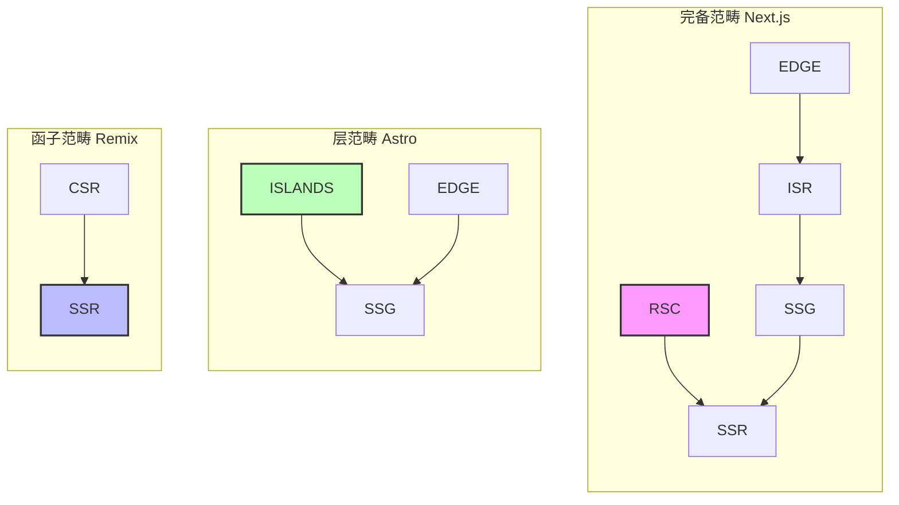
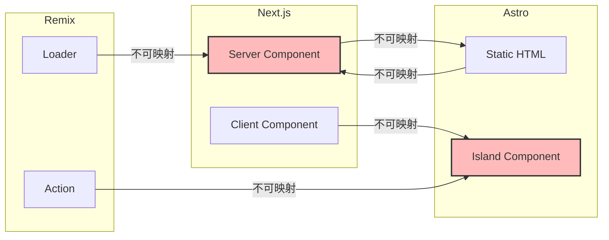

# 元框架对称差分析：形式化视角下的框架选型

> **核心命题**：Next.js、Nuxt、SvelteKit、Astro、Remix 不是"功能相似的框架"。从形式化视角，它们各自建立在不可通约的计算模型之上——某些渲染策略在一个框架中是原生构造，在另一个框架中需要复杂的模拟甚至不可实现。理解这种不可表达性，是避免"选型时看 Benchmark，上线后付认知债"的关键。

---

## 引言

2024 年初，某初创团队在技术选型时陷入两难：Next.js 生态最成熟，但 Astro 的 Lighthouse 分数高出 15 分；Remix 的 Web 标准理念最纯粹，但招聘市场上几乎找不到有经验的开发者。团队最终选择了 Next.js，六个月后却发现 Server Components 的复杂性远超预期——一个简单的数据表格需要同时处理 Server Component、Client Component 和 Server Action 三种抽象。

这一遭遇揭示了元框架选型中最常见的误区：**将框架视为"功能集合"，而非"计算模型"**。从形式化视角，每个元框架都建立在独特的计算模型之上——Next.js 的 RSC 模型、Astro 的 Islands 模型、Remix 的 Web 标准模型——这些模型之间存在不可表达性：某些渲染策略在一个框架中是原生构造，在另一个框架中需要复杂的模拟甚至不可实现。

**精确直觉类比**：元框架选型像选择城市定居。Next.js 像纽约——机会最多、资源最丰富、但生活成本高（复杂性）。Astro 像波特兰——生活质量高、环境友好、但工作机会少（生态系统小）。Remix 像柏林——理念先进、社区活跃、但语言障碍（学习曲线）。SvelteKit 像东京——效率最高、体验最佳、但文化独特（语法不同）。没有"最好的城市"，只有"最适合你的城市"。

---

## 理论严格表述

### 1. 元框架作为渲染范畴

每个元框架定义了一个**渲染范畴**，其中：

- **对象**：页面、组件、路由
- **态射**：渲染转换（数据 → HTML/VDOM）
- **组合**：嵌套路由、布局组合
- **恒等**：组件自身渲染

| 框架 | 原生渲染策略 | 范畴论特征 |
|------|-------------|-----------|
| Next.js | SSR/SSG/ISR/EDGE/CSR | **完备范畴**——支持所有策略 |
| Nuxt | SSR/SSG/ISR/CSR/EDGE | **预加范畴**——路由规则驱动 |
| SvelteKit | SSR/SSG/CSR/EDGE | **Adapter 范畴**——通过适配器映射到部署目标 |
| Astro | SSG/ISLANDS/EDGE | **层范畴**——静态为基础，交互为局部 |
| Remix | SSR/CSR | **函子范畴**——Web 标准 API 的函子映射 |

### 2. 五种核心渲染策略的范畴论语义

**SSG (Static Site Generation)**：
$$
\text{SSG}: \mathbf{Content} \to \mathbf{HTML} \quad \text{在构建时执行}
$$
范畴论解释：SSG 是**初始对象**的构造——从内容到 HTML 的最直接映射，没有中间状态。

**SSR (Server-Side Rendering)**：
$$
\text{SSR}: \mathbf{Request} \times \mathbf{Data} \to \mathbf{HTML} \quad \text{在请求时执行}
$$
范畴论解释：SSR 是**余极限**——在请求时间点，将所有数据源合并为一个 HTML 输出。

**ISR (Incremental Static Regeneration)**：
$$
\text{ISR}: \mathbf{HTML}_{cached} \xleftarrow{\text{stale}} \mathbf{HTML}_{fresh} \quad \text{后台刷新}
$$
范畴论解释：ISR 是**拉回**——缓存版本和新鲜版本的交集。

**Edge Rendering**：
$$
\text{Edge}: \mathbf{Request} \xrightarrow{\text{geo}} \mathbf{EdgeNode} \xrightarrow{\text{compute}} \mathbf{Response}
$$
范畴论解释：Edge 是**Kleisli 范畴**——请求通过地理路由（效应）到达边缘节点。

**Islands Architecture**：
$$
\text{Islands}: \mathbf{Page}_{static} + \sum_{i} \mathbf{Island}_{i}^{hydrated}
$$
范畴论解释：Islands 是**层（Sheaf）**——静态页面作为"基空间"，交互组件作为"局部截面"。

### 3. 对称差的形式化定义

**定义**：对任意框架 $F$，定义其**特征集** $S(F) \subseteq \mathcal{U}$，其中全域 $\mathcal{U}$ 包含所有可辨识的架构特征。

**对称差距离**：

$$
d(F_1, F_2) = |S(F_1) \Delta S(F_2)| = |(S(F_1) \setminus S(F_2)) \cup (S(F_2) \setminus S(F_1))|
$$

该距离满足度量空间的三条公理：非负性、对称性、三角不等式。

**Jaccard 相似度**：

$$
J(F_1, F_2) = \frac{|S(F_1) \cap S(F_2)|}{|S(F_1) \cup S(F_2)|}
$$

### 4. 不可表达性定理

**定义**：渲染策略 $S$ 在框架 $F$ 中**不可表达**，当且仅当不存在 $F$ 中的原生构造可以语义等价地实现 $S$。

**定理**：Islands Architecture 在 Remix 中不可表达。

**证明概要**：Remix 的计算模型基于统一的 SSR/CSR 二元对立——每个路由要么在服务器渲染，要么在客户端 hydrate。Islands 的"选择性 hydrate"概念在 Remix 模型中没有对应物。虽然可以通过复杂的条件渲染模拟 Islands 的行为，但这种模拟破坏了 Remix 的"渐进增强"核心哲学，因此不是语义等价的实现。

### 5. 多属性效用理论（MAUT）

元框架选型可以形式化为多属性决策问题：

$$
U(F) = \sum_{i=1}^{n} w_i \cdot u_i(F)
$$

其中 $w_i$ 为第 $i$ 个属性的权重，$u_i(F)$ 为框架 $F$ 在第 $i$ 个属性上的效用值。

---

## 工程实践映射

### 映射损失案例 1：Next.js → Astro

Next.js 的 App Router 支持 Server Components 的嵌套和组合：

```typescript
// Next.js: Server Component 可以嵌套 Client Component
// 而 Client Component 又可以包含 Server Component（通过 children）
<ServerLayout>
  <ClientTabs>
    <ServerTabContent /> {/* 这是合法的 */}
  </ClientTabs>
</ServerLayout>
```

Astro 的 Islands 模型不允许这种嵌套——Island 内部只能是该框架的组件，不能包含 Astro 组件的静态内容。

**映射损失**：Next.js 的"交错 Server/Client"模式在 Astro 中不可表达。

### 映射损失案例 2：Astro → Next.js

Astro 的零 JavaScript 默认在 Next.js 中不可表达：

```astro
<!-- Astro: 默认零 JS，只有显式标记的组件才加载 JS -->
<h1>Static Title</h1> <!-- 零 JS -->
<Counter client:load /> <!-- 只有这里加载 JS -->
```

Next.js 的页面级渲染策略意味着即使静态内容也包含 Next.js 的运行时 JS。

**映射损失**：Astro 的"选择性零 JS"在 Next.js 中不可表达。

### 映射损失案例 3：Remix 的 Web 标准不可迁移性

Remix 的核心理念是"使用 Web 标准"：

```typescript
// Remix: 使用标准 Form + HTTP，不依赖 Server Action
export async function action({ request }: ActionFunctionArgs) {
  const formData = await request.formData();
  return redirect('/success');
}
```

Next.js 的 Server Actions 是 React 特有的抽象，Remix 认为这是"框架锁定"。

**映射损失**：Remix 的"Web 标准优先"哲学在 Next.js 中不可表达。

### 框架能力矩阵的 TypeScript 实现

```typescript
/**
 * 渲染策略的范畴论分类
 * 将每种策略映射到其计算模型的数学结构
 */

type RenderingStrategy = 'SSR' | 'SSG' | 'ISR' | 'CSR' | 'EDGE' | 'ISLANDS';

interface StrategySemantics {
  readonly strategy: RenderingStrategy;
  readonly categoryStructure: string;
  readonly timeOfExecution: 'build' | 'request' | 'edge' | 'client';
  readonly statefulness: 'stateless' | 'stateful' | 'hybrid';
  readonly jsPayload: 'zero' | 'minimal' | 'full';
}

const strategyCatalog: Record<RenderingStrategy, StrategySemantics> = {
  SSR: {
    strategy: 'SSR',
    categoryStructure: '余极限 (Colimit) - 请求时的累积构造',
    timeOfExecution: 'request',
    statefulness: 'stateless',
    jsPayload: 'full'
  },
  SSG: {
    strategy: 'SSG',
    categoryStructure: '初始对象 (Initial) - 构建时的最一般解',
    timeOfExecution: 'build',
    statefulness: 'stateless',
    jsPayload: 'minimal'
  },
  ISR: {
    strategy: 'ISR',
    categoryStructure: '拉回 (Pullback) - 缓存与新鲜度的交集',
    timeOfExecution: 'request',
    statefulness: 'hybrid',
    jsPayload: 'minimal'
  },
  CSR: {
    strategy: 'CSR',
    categoryStructure: '终端对象 (Terminal) - 客户端的最终状态',
    timeOfExecution: 'client',
    statefulness: 'stateful',
    jsPayload: 'full'
  },
  EDGE: {
    strategy: 'EDGE',
    categoryStructure: 'Kleisli 范畴 - 分布式计算的效应组合',
    timeOfExecution: 'edge',
    statefulness: 'stateless',
    jsPayload: 'minimal'
  },
  ISLANDS: {
    strategy: 'ISLANDS',
    categoryStructure: '层 (Sheaf) - 局部可交互的粘合',
    timeOfExecution: 'client',
    statefulness: 'hybrid',
    jsPayload: 'minimal'
  }
};

// 框架的策略支持矩阵
interface FrameworkCapabilities {
  readonly name: string;
  readonly nativeStrategies: RenderingStrategy[];
  readonly simulatedStrategies: RenderingStrategy[];
  readonly impossibleStrategies: RenderingStrategy[];
}

const frameworkCapabilities: FrameworkCapabilities[] = [
  {
    name: 'Next.js',
    nativeStrategies: ['SSR', 'SSG', 'ISR', 'CSR', 'EDGE'],
    simulatedStrategies: ['ISLANDS'],
    impossibleStrategies: []
  },
  {
    name: 'Astro',
    nativeStrategies: ['SSG', 'ISLANDS', 'EDGE'],
    simulatedStrategies: ['SSR', 'ISR'],
    impossibleStrategies: ['CSR']
  },
  {
    name: 'Remix',
    nativeStrategies: ['SSR', 'CSR'],
    simulatedStrategies: ['SSG', 'EDGE'],
    impossibleStrategies: ['ISLANDS']
  }
];
```

### 技术债务的形式化

技术债务可以形式化为框架模型的表达能力差距：

$$
TD(F, P) = \sum_{r \in P} \text{cost}(\text{simulate}(r, F))
$$

其中 $P$ 为项目所需的所有渲染策略集合，$r$ 为单个渲染策略，$\text{simulate}(r, F)$ 为在框架 $F$ 中模拟策略 $r$ 所需的代码复杂度。

**示例**：一个需要 Islands Architecture 的项目选择 Next.js：

$$
TD(\text{Next.js}, \{ISLANDS\}) = \text{cost}(\text{复杂条件渲染} + \text{手动代码分割}) \approx \text{高}
$$

### 综合对称差分析表

| 框架对 | 对称差距离 $d$ | Jaccard $J$ | 主导关系 | 迁移难度 |
|-------|--------------|------------|---------|---------|
| Next.js ↔ Nuxt | 5 | 0.762 | 互不支配 | 中（语法层） |
| Next.js ↔ Astro | 12 | 0.478 | 互不支配 | 高（范式层） |
| SvelteKit ↔ Remix | 6 | 0.625 | SvelteKit ⊃ Remix | 中-高 |
| SolidStart ↔ TanStack | 1 | 0.909 | SolidStart ⊃ TanStack | 极低 |

---

## Mermaid 图表

### 图表 1：元框架渲染范畴的结构映射



### 图表 2：框架不可表达性映射



### 图表 3：元框架选型决策树

```mermaid
flowchart TD
    START[开始选型] --> Q1&#123;React 生态？&#125;
    Q1 -->|是| Q2&#123;需要 RSC？&#125;
    Q1 -->|否| Q3&#123;Vue 生态？&#125;
    Q2 -->|是| CH1[Next.js App Router]
    Q2 -->|否| Q4&#123;需要 Web 标准？&#125;
    Q4 -->|是| CH2[Remix]
    Q4 -->|否| CH3[Next.js Pages]
    Q3 -->|是| CH4[Nuxt 3]
    Q3 -->|否| Q5&#123;内容站点？&#125;
    Q5 -->|是| CH5[Astro + Islands]
    Q5 -->|否| Q6&#123;性能至上？&#125;
    Q6 -->|是| CH6[SvelteKit]
    Q6 -->|否| CH7[根据团队经验选择]

    style START fill:#f9f,stroke:#333,stroke-width:2px
    style CH1 fill:#bfb,stroke:#333,stroke-width:2px
    style CH5 fill:#bfb,stroke:#333,stroke-width:2px
    style CH6 fill:#bfb,stroke:#333,stroke-width:2px
```

---

## 理论要点总结

1. **框架差异的本质是计算模型的不可通约性**：Next.js 建立在 RSC 的交错 Server/Client 模型之上，Astro 建立在 Islands 层模型之上，Remix 建立在 Web 标准函子映射之上。这些模型之间存在严格的不可表达性——某些策略在一个框架中是原生构造，在另一个中需要高成本模拟甚至不可实现。

2. **对称差距离是客观的框架差异度量**：$d(F_1, F_2) = |S(F_1) \Delta S(F_2)|$ 满足度量空间公理，为框架选型提供了超越主观偏好的客观工具。Next.js 与 Astro 的对称差距离为 12，远大于 Next.js 与 Nuxt 的 5，预示了从 Next.js 迁移到 Astro 的认知成本显著高于同生态内的迁移。

3. **Jaccard 相似度预测迁移难度**：$J(Next, Nuxt) \approx 0.76$ 的高相似度意味着二者迁移主要在语法层；$J(Next, Astro) \approx 0.48$ 的低相似度意味着迁移涉及范式层的心智模型重构。

4. **技术债务可形式化为表达能力差距**：当框架 $F$ 无法原生支持策略 $r$ 时，开发者面临模拟、绕过或切换三种选择。技术债务 $TD(F, P)$ 量化了这种差距的维护成本。

5. **元框架的生态系统价值遵循梅特卡夫定律**：$V \propto N^2$，其中 $N$ 为插件数量。Next.js 的 $N \approx 2000$，Nuxt 的 $N \approx 800$，SvelteKit 的 $N \approx 300$。但生态质量比数量更重要——废弃插件会降低整体价值。

6. **纳什均衡解释 Next.js 的主导地位**：当大多数开发者选择同一框架时，生态系统变得更丰富，进一步吸引更多开发者——形成正反馈循环。这种 dominance 不是因为技术最优，而是因为生态系统的网络效应。

7. **AI 训练数据偏见正在强化 React 的主导地位**：GitHub Copilot 的训练数据中 React/Next.js 最多，导致 AI 生成质量最高，进一步增加 React 的采用率。这构成了技术选型中的"路径依赖"新维度。

8. **融合与分化是元框架演进的并行趋势**：WinterCG 和通用运行时（Hono、Nitro）推动底层统一，而垂直优化（Next.js 电商、Astro 文档、SvelteKit 高性能）推动上层分化。未来的元框架差异将主要在开发者体验层，而非运行时层。

---

## 参考资源

1. State of JS 2025 Survey (13,002 respondents). 前端技术生态的权威年度调查，为框架采用率、开发者满意度和技术趋势提供了经验数据基础。

2. Stack Overflow Developer Survey 2025 (49,000+ developers). 全球开发者偏好与薪资调查，为框架的招聘难度和市场需求提供了宏观经济视角。

3. Next.js Documentation (v16, 2025). Vercel 官方文档，定义了 React Server Components 的工程实现标准与 App Router 的渲染模型。

4. Astro Documentation (v4/v5, 2024-2025). Astro 团队官方文档，阐述了 Islands Architecture 的层范畴语义与零 JavaScript 默认的设计哲学。

5. Remix Documentation (v2, 2024). Shopify 团队官方文档，论证了 Web 标准优先的函子映射模型与渐进增强的工程实践。

6. WinterCG, "Minimum Common Web Platform API" (2024). Web-interoperable Runtimes 的标准规范，为元框架的底层运行时统一提供了协议基础。

7. Nuxt Documentation (v3/v4, 2024-2025). NuxtLabs 官方文档，描述了 Nitro 引擎的预加范畴特性与 Universal Rendering 的实现机制。
