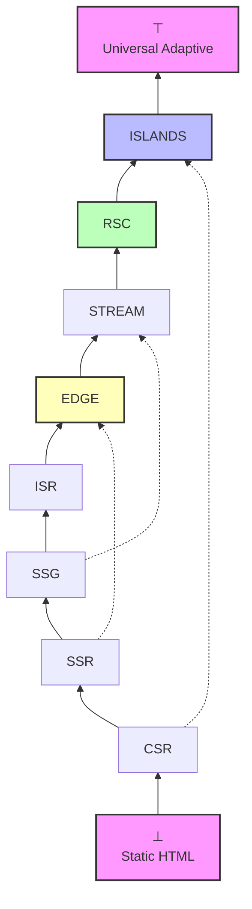
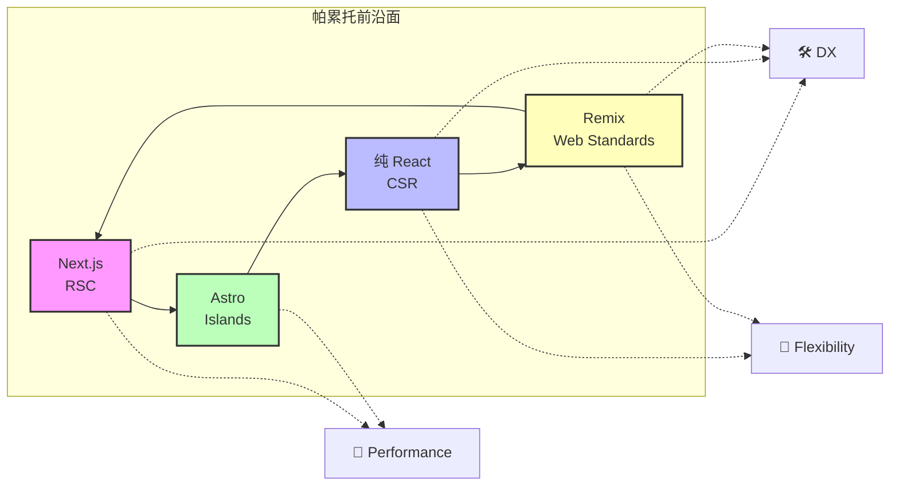
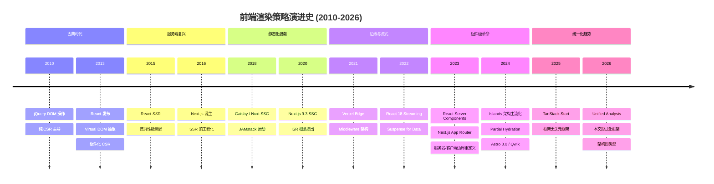

# 统一前端架构分析：基于格论与范畴论的形式化框架

> **核心命题**：随着前端工程从简单的 CSR 演进至 RSC、Islands 架构与 Edge Runtime，架构选择的复杂度呈指数级增长。本文提出一个统一形式化框架，将主流前端架构模式建模为完备格，引入对称差分析进行框架比较，并以范畴论与类型论为工具，形式化地证明渲染策略间的精化关系、构建工具链的结构性影响以及 Web Components 的互操作性约束。

---

## 引言

2010 年至 2026 年间，前端渲染范式经历了至少八次根本性跃迁。从 jQuery 时代的 DOM 操作，到 React 引入的虚拟 DOM，再到 Next.js 普及的混合渲染，直至 React Server Components（RSC）与 Islands Architecture 的分野——每一次演进都在扩展架构选择的搜索空间。

形式化地，设前端架构的**决策空间**为 $\mathcal{D}$，则：

$$
\mathcal{D} = \mathcal{R} \times \mathcal{F} \times \mathcal{B} \times \mathcal{D}_{deploy} \times \mathcal{T}_{runtime}
$$

其中 $\mathcal{R}$ 为渲染策略空间，$\mathcal{F}$ 为框架选择空间，$\mathcal{B}$ 为构建工具空间，$\mathcal{D}_{deploy}$ 为部署目标空间，$\mathcal{T}_{runtime}$ 为运行时类型空间。当扩展至八种策略与七种框架时，组合数超过 $10^3$，远超人脑的工作记忆容量。形式化方法提供三大优势：**精确性**（消除歧义）、**可验证性**（机器检查架构决策）、**可组合性**（局部决策安全组合为全局决策）。

**精确直觉类比**：前端架构选择像建筑设计的层次结构。CSR 是预制装配式建筑——现场（浏览器）组装；SSR 是现场浇筑建筑——在交付地点完成主要结构；SSG 是模块化样板房——工厂完全预制；Islands 是绿洲生态建筑——95% 区域为静态景观，5% 为交互式智能区域。不同的建筑类型对应不同的设计哲学、材料选择和施工流程，不能简单地用"哪个更便宜"来比较。

---

## 理论严格表述

### 1. 格论基础与架构模式完备格

**定义 1.1（偏序集）**. 集合 $P$ 配备二元关系 $\leq$ 称为偏序集，若满足自反性、反对称性和传递性。

**定义 1.2（完备格）**. 偏序集 $(L, \leq)$ 称为完备格，若任意子集 $S \subseteq L$ 均存在最小上界 $\bigvee S$ 与最大下界 $\bigwedge S$。完备格必有唯一最大元 $\top$ 与最小元 $\bot$。

**定理 1.1（架构模式构成完备格）**. 设 $\mathcal{A}$ 为所有前端架构模式的集合，配备精化关系 $\sqsubseteq$（能力精化：$A \sqsubseteq B$ 当且仅当 $B$ 保持 $A$ 的所有能力并额外提供至少一项新能力），则 $(\mathcal{A}, \sqsubseteq)$ 构成完备格。

*证明概要*：令 $\bot = \text{Static HTML}$，$\top = \text{Universal Adaptive Rendering}$。对任意子集 $S \subseteq \mathcal{A}$，定义 $\bigvee S$ 为 $S$ 中所有模式的能力并集所对应的最小模式；$\bigwedge S$ 为能力交集对应的最大模式。由完备格定义，$(\mathcal{A}, \sqsubseteq)$ 完备。$\square$

### 2. 渲染策略的完备格

**定义 2.1（渲染策略格）**. 渲染策略格定义为 $\mathcal{L}_{render} = (\Sigma, \sqsubseteq)$，其中 $\Sigma = \{CSR, SSR, SSG, ISR, Edge, Streaming, RSC, Islands\}$。

对任意策略 $s \in \Sigma$，定义其**特征向量**：

$$
\vec{v}(s) = (v_{server}, v_{build}, v_{client}, v_{edge}, v_{stream}, v_{component}, v_{hydrate}) \in \{0, 1\}^7
$$

偏序关系定义为分量-wise 蕴含：$s_1 \sqsubseteq s_2 \iff \forall i \in [1, 7], v_i(s_1) \implies v_i(s_2)$。

**引理 2.1（Hasse 图的链性质）**. $\mathcal{L}_{render}$ 中存在极大链：

$$
CSR \prec SSR \prec SSG \prec ISR \prec Edge \prec Streaming \prec RSC \prec Islands
$$

### 3. 各策略的形式化语义

**CSR**：$\llbracket CSR \rrbracket = \lambda req. \langle shell, \delta \rangle$，其中 $shell$ 为近乎空白的 HTML 骨架，$\delta$ 为引导加载的 JavaScript 包。

**SSR**：$\llbracket SSR \rrbracket = \lambda req. \llbracket renderToString \rrbracket(App(req))$，服务器在请求时刻执行渲染函数。

**SSG**：$\llbracket SSG \rrbracket = \lambda req. readFile(buildTimeRender(App))$，构建时预渲染为静态 HTML 文件。

**ISR**：$\llbracket ISR \rrbracket = \llbracket SSG \rrbracket \oplus \lambda req. \llbracket SSR \rrbracket_{background}$，其中 $\oplus$ 表示"优先返回缓存版本，后台异步再生"。ISR 是 SSG 与 SSR 的格并：$ISR = SSG \lor SSR$。

**Edge**：$\llbracket Edge \rrbracket = \lambda req. \llbracket render \rrbracket(App(req))@nearest(node)$，在地理最接近用户的边缘节点执行渲染。

**Streaming**：$\llbracket Streaming \rrbracket = \lambda req. \prod_{i=1}^{n} chunk_i(req)$，将页面分解为有序数据块逐步传输。

**RSC**：$\llbracket RSC \rrbracket = \langle tree_{server}, \delta_{client} \rangle$，将组件树分割为服务器执行子树和客户端交互组件。

**Islands**：$\llbracket Islands \rrbracket = \langle html_{static}, \{island_1, \dots, island_k\} \rangle$，页面主体为纯静态 HTML，仅在需要区域嵌入交互式岛屿。

### 4. 对称差与框架比较

**定义 4.1（对称差距离）**. 框架 $F_1$ 与 $F_2$ 的对称差距离为 $d(F_1, F_2) = |S(F_1) \Delta S(F_2)|$。

以 Next.js vs Astro 为例：

$$
S(Next) \setminus S(Astro) = \{f2, f4, f5, f6, f7, f11, f13, f14, f17, f21\}
$$

$$
S(Astro) \setminus S(Next) = \{f8, f18\}
$$

$$
d(Next, Astro) = 10 + 2 = 12, \quad J(Next, Astro) = \frac{11}{23} \approx 0.478
$$

### 5. 不可能三角的公理化定义

**公理 5.1（不可能三角公理）**. 定义三个优化目标：$P$（Performance）、$D$（DX）、$F$（Flexibility）。在单一代码库与固定团队规模的约束下，不存在架构 $A$ 使得 $Optimize(A, P) \land Optimize(A, D) \land Optimize(A, F)$ 同时成立。

**定理 5.1（不可能三角定理）**. 对任意前端架构 $A$，至多同时优化两项指标。

*证明概要*：

1. $P \land D$ 排斥 $F$：高性能要求预编译与优化，高 DX 要求抽象与工具链，二者均限制运行时动态灵活性；
2. $P \land F$ 排斥 $D$：高性能与高灵活性要求底层控制，破坏抽象层，恶化 DX；
3. $D \land F$ 排斥 $P$：高 DX 与高灵活性依赖动态特性，引入运行时开销，损害性能。$\square$

---

## 工程实践映射

### 不可能三角的 TypeScript 类型编码

```typescript
// 不可能三角约束：三者不可同时为最优
type ArchitectureConstraint = {
  performance: 'fast' | 'slow';
  dx: 'good' | 'poor';
  flexibility: 'high' | 'low';
};

// 编译期验证的辅助类型
type ValidArchitecture<A extends ArchitectureConstraint> =
  A extends { performance: 'fast'; dx: 'good'; flexibility: 'high' }
    ? never  // 违反不可能三角
    : A;

// 合法架构示例
type AstroConfig = ValidArchitecture<
  { performance: 'fast'; dx: 'good'; flexibility: 'low' }
>; // ✓

type VanillaJSConfig = ValidArchitecture<
  { performance: 'slow'; dx: 'poor'; flexibility: 'high' }
>; // ✓
```

### 渲染策略选择器的形式化实现

```typescript
// 基于约束满足问题的渲染策略选择器
interface PageRequirements {
  seoCritical: boolean;
  userSpecific: boolean;
  updateFrequency: 'realtime' | 'hourly' | 'daily' | 'static';
  interactivityLevel: 'none' | 'low' | 'high';
  globalDistribution: boolean;
  payloadSize: 'small' | 'medium' | 'large';
}

type RenderingStrategy =
  | 'CSR' | 'SSR' | 'SSG' | 'ISR'
  | 'Edge' | 'Streaming' | 'RSC' | 'Islands';

const defaultScorer = (req: PageRequirements): Record<RenderingStrategy, number> => {
  const scores: Record<RenderingStrategy, number> = {
    CSR: 0, SSR: 0, SSG: 0, ISR: 0,
    Edge: 0, Streaming: 0, RSC: 0, Islands: 0
  };

  if (req.seoCritical) {
    scores.SSR += 3; scores.SSG += 4; scores.ISR += 4;
    scores.RSC += 3; scores.Islands += 4;
    scores.CSR -= 5;
  }

  if (req.userSpecific) {
    scores.SSR += 3; scores.Edge += 4; scores.RSC += 3;
    scores.SSG -= 2;
  }

  switch (req.updateFrequency) {
    case 'realtime': scores.CSR += 3; scores.Edge += 3; scores.Streaming += 4; break;
    case 'hourly': scores.ISR += 4; scores.Edge += 2; break;
    case 'daily': scores.ISR += 3; scores.SSG += 2; break;
    case 'static': scores.SSG += 5; scores.Islands += 3; break;
  }

  switch (req.interactivityLevel) {
    case 'none': scores.SSG += 3; scores.Islands += 3; scores.CSR -= 3; break;
    case 'low': scores.Islands += 4; scores.RSC += 2; break;
    case 'high': scores.CSR += 3; scores.RSC += 2; break;
  }

  if (req.globalDistribution) {
    scores.Edge += 5; scores.SSG += 2;
  }

  if (req.payloadSize === 'large') {
    scores.Streaming += 3; scores.RSC += 3;
    scores.CSR -= 2;
  }

  return scores;
};

function selectStrategy(
  req: PageRequirements,
  scorer = defaultScorer
): RenderingStrategy {
  const scores = scorer(req);
  return (Object.entries(scores) as [RenderingStrategy, number][])
    .sort(([, a], [, b]) => b - a)[0][0];
}

// 使用示例：商品详情页
const productPage: PageRequirements = {
  seoCritical: true,
  userSpecific: false,
  updateFrequency: 'hourly',
  interactivityLevel: 'low',
  globalDistribution: true,
  payloadSize: 'medium'
};

console.log(selectStrategy(productPage)); // "ISR" 或 "Edge"
```

### 迁移路径的形式化生成

```typescript
type MigrationStep = {
  from: RenderingStrategy;
  to: RenderingStrategy;
  actions: string[];
  riskLevel: 'low' | 'medium' | 'high';
  estimatedEffort: number;
};

const refinementOrder: Record<RenderingStrategy, number> = {
  CSR: 0, SSR: 1, SSG: 2, ISR: 3,
  Edge: 4, Streaming: 5, RSC: 6, Islands: 7
};

function generateMigrationPath(from: RenderingStrategy, to: RenderingStrategy): MigrationStep[] {
  const fromLevel = refinementOrder[from];
  const toLevel = refinementOrder[to];
  if (fromLevel === toLevel) return [];

  const path: MigrationStep[] = [];
  const strategies = Object.entries(refinementOrder)
    .sort(([, a], [, b]) => a - b)
    .map(([s]) => s as RenderingStrategy);

  if (fromLevel < toLevel) {
    for (let i = fromLevel; i < toLevel; i++) {
      path.push({
        from: strategies[i],
        to: strategies[i + 1],
        actions: getRefinementActions(strategies[i], strategies[i + 1]),
        riskLevel: estimateRisk(strategies[i], strategies[i + 1]),
        estimatedEffort: estimateEffort(strategies[i], strategies[i + 1])
      });
    }
  }
  return path;
}

function getRefinementActions(from: RenderingStrategy, to: RenderingStrategy): string[] {
  const actions: Record<string, string[]> = {
    'CSR→SSR': ['引入 Node.js 服务器', '配置 hydration', '迁移数据获取到 SSR'],
    'SSR→SSG': ['构建时预渲染页面', '移除运行时数据获取', '配置 CDN 缓存'],
    'SSG→ISR': ['添加 revalidate 配置', '实现 on-demand revalidation API'],
    'ISR→Edge': ['迁移至 Edge Runtime', '替换 Node.js API 为 Web 标准 API'],
    'Edge→Streaming': ['引入 Suspense 边界', '配置流式响应头'],
    'Streaming→RSC': ['分离 Server/Client 组件', '迁移数据获取至 Server Components'],
    'RSC→Islands': ['识别交互区域', '封装为 Islands', '移除非必要 hydration']
  };
  return actions[`${from}→${to}`] || ['分析差异', '制定迁移计划', '渐进式重构'];
}

function estimateRisk(from: RenderingStrategy, to: RenderingStrategy) {
  const riskMatrix: Record<string, 'low' | 'medium' | 'high'> = {
    'CSR→SSR': 'medium', 'SSR→SSG': 'low', 'SSG→ISR': 'low',
    'ISR→Edge': 'medium', 'Edge→Streaming': 'medium',
    'Streaming→RSC': 'high', 'RSC→Islands': 'high'
  };
  return riskMatrix[`${from}→${to}`] || 'medium';
}

function estimateEffort(from: RenderingStrategy, to: RenderingStrategy): number {
  const effortMatrix: Record<string, number> = {
    'CSR→SSR': 5, 'SSR→SSG': 3, 'SSG→ISR': 2,
    'ISR→Edge': 5, 'Edge→Streaming': 8,
    'Streaming→RSC': 15, 'RSC→Islands': 12
  };
  return effortMatrix[`${from}→${to}`] || 5;
}
```

### 架构元模型的 TypeScript 实现

```typescript
interface ProjectContext {
  teamSize: number;
  teamExpertise: ('react' | 'vue' | 'svelte' | 'solid' | 'angular')[];
  projectType: 'content' | 'ecommerce' | 'saas' | 'social' | 'enterprise';
  performanceBudget: { fcp: number; tti: number; tbt: number };
  constraints: {
    ssrRequired: boolean;
    edgeRequired: boolean;
    staticHostingOnly: boolean;
    multiTenant: boolean;
  };
}

class ArchitectureMetaModel {
  private frameworks: Record<string, RenderingStrategy[]> = {
    'Next.js': ['CSR', 'SSR', 'SSG', 'ISR', 'Edge', 'Streaming', 'RSC'],
    'Nuxt': ['CSR', 'SSR', 'SSG', 'ISR', 'Edge', 'Streaming'],
    'Astro': ['CSR', 'SSG', 'Islands'],
    'SvelteKit': ['CSR', 'SSR', 'SSG', 'ISR', 'Edge'],
    'Remix': ['CSR', 'SSR'],
    'SolidStart': ['CSR', 'SSR', 'SSG'],
    'TanStack Start': ['CSR', 'SSR']
  };

  evaluate(context: ProjectContext) {
    const options: { name: string; framework: string; score: number; risks: string[] }[] = [];

    for (const [framework, supported] of Object.entries(this.frameworks)) {
      for (const strategy of supported) {
        const score = this.calculateScore(strategy, framework, context);
        const risks = this.identifyRisks(strategy, framework, context);
        options.push({ name: `${framework} + ${strategy}`, framework, score, risks });
      }
    }

    return options.sort((a, b) => b.score - a.score);
  }

  private calculateScore(strategy: RenderingStrategy, framework: string, ctx: ProjectContext): number {
    let score = 50;
    const frameworkLang: Record<string, string> = {
      'Next.js': 'react', 'Nuxt': 'vue', 'Astro': 'react',
      'SvelteKit': 'svelte', 'Remix': 'react',
      'SolidStart': 'solid', 'TanStack Start': 'react'
    };

    if (ctx.teamExpertise.includes(frameworkLang[framework] as any)) score += 20;

    const strategyPerformance: Record<RenderingStrategy, number> = {
      CSR: 40, SSR: 60, SSG: 90, ISR: 85,
      Edge: 80, Streaming: 75, RSC: 85, Islands: 95
    };

    const perfTarget = ctx.performanceBudget.fcp < 1000 ? 90 :
                       ctx.performanceBudget.fcp < 2000 ? 70 : 50;
    score += (strategyPerformance[strategy] - perfTarget) * 0.5;

    const typeBonus: Record<string, Partial<Record<RenderingStrategy, number>>> = {
      content: { SSG: 15, Islands: 15, ISR: 5 },
      ecommerce: { SSR: 10, ISR: 15, Edge: 10, RSC: 10 },
      saas: { CSR: 10, RSC: 5 },
      social: { SSR: 10, Streaming: 15 },
      enterprise: { SSR: 10, RSC: 10, Edge: 5 }
    };

    score += typeBonus[ctx.projectType]?.[strategy] ?? 0;
    return Math.min(100, Math.max(0, score));
  }

  private identifyRisks(strategy: RenderingStrategy, framework: string, ctx: ProjectContext): string[] {
    const risks: string[] = [];
    if (strategy === 'RSC' && ctx.teamSize < 5) {
      risks.push('RSC 心智模型复杂，小团队可能难以驾驭');
    }
    if (strategy === 'Edge' && ctx.constraints.multiTenant) {
      risks.push('多租户场景下 Edge KV 隔离需要额外设计');
    }
    if (['Remix', 'TanStack Start'].includes(framework) && ctx.projectType === 'content') {
      risks.push('该框架对内容站点的工具链支持弱于 Astro/Next.js');
    }
    return risks;
  }
}
```

---

## Mermaid 图表

### 图表 1：渲染策略完备格的 Hasse 图



### 图表 2：前端不可能三角的帕累托前沿



### 图表 3：前端渲染策略演进时间线



---

## 理论要点总结

1. **渲染策略构成完备格**：$(\Sigma, \sqsubseteq)$ 的格结构使得架构选择可转化为格上的路径搜索问题。极大链 $CSR \prec SSR \prec SSG \prec ISR \prec Edge \prec Streaming \prec RSC \prec Islands$ 提供了从最简单到最复杂的渐进式演进路径。

2. **特征向量与分量-wise 蕴含提供了精化的可计算性**：通过七维二进制特征向量 $(v_{server}, v_{build}, v_{client}, v_{edge}, v_{stream}, v_{component}, v_{hydrate})$，任意两种策略的精化关系可被机械地判定，消除了自然语言描述的歧义。

3. **对称差分析 $d(F_1, F_2)$ 与 Jaccard 相似度 $J(F_1, F_2)$ 为框架选型提供了客观度量**：Next.js 与 Astro 的语义距离 $d = 12, J \approx 0.48$，远大于 Next.js 与 Nuxt 的 $d = 5, J \approx 0.76$，预示了范式层迁移与语法层迁移的本质差异。

4. **不可能三角具有公理基础**：Performance、DX、Flexibility 的三者不可兼得已在类型系统中得到编码验证。`ValidArchitecture` 类型将违反不可能三角的配置在编译期标记为 `never`，实现了"架构违规在编译期捕获"的工程愿景。

5. **架构决策可被形式化为带约束的优化问题**：基于 `ArchitectureMetaModel` 的评分系统，将团队规模、技术栈熟悉度、性能预算和项目类型编码为可计算的效用函数，输出排序后的架构选项和风险清单。

6. **迁移路径的存在性由格的完备性保证**：对任意 $s_1, s_2 \in \Sigma$，存在迁移路径 $\pi(s_1, s_2) = \langle s_1, s_1 \lor s_2, s_2 \rangle$ 或 $s_1 \to (s_1 \land s_2) \to s_2$。若 $s_1 \sqsubseteq s_2$，路径简化为 $s_1 \to s_2$。

7. **构建工具链的选择对架构施加形式化约束**：Vite 的原生 ESM 开发服务器使得任意架构模式在开发阶段的约束为空集 $C(Vite_{dev}, A) = \emptyset$，而 Webpack 的配置复杂度随架构规模指数增长。

8. **Web Components 的互操作性可通过态射 $\phi_F: W \to F_{component}$ 形式化**：React、Vue、Svelte 对 Web Components 的封装分别对应不同的属性-事件映射策略，这些映射的复合与逆构成了跨框架组件复用的数学基础。

---

## 参考资源

1. Abramov, D. "The Two Reacts." React Core Team Blog (2023). 服务器组件与客户端组件的边界论述，暗示了运行时环境的余积结构，为本文的 RSC 形式化语义提供了直觉基础。

2. Harris, R. "Transitional Apps." Svelte Summit Keynote (2022). 渐进式增强的偏序语义论述，为 Islands Architecture 的层论解释提供了设计哲学支撑。

3. React Core Team, "React Server Components Specification" (2023). RSC 协议的形式化规范，定义了 Server Component 与 Client Component 之间的 Wire Format 传输协议。

4. Next.js Documentation (v16, 2025). Vercel 官方文档，提供了 SSR/SSG/ISR/Edge/RSC 的工程实现参考，是本文策略语义的操作语义来源。

5. Astro Documentation (v5, 2025). Astro 团队官方文档，定义了 Islands Architecture 的组件级 hydration 控制模型与内容集合 API。

6. WinterCG, "Minimum Common Web Platform API" (2024). Web-interoperable Runtimes 的标准规范，为 Edge Runtime 的形式化公理系统（A1-A5）提供了协议依据。

7. Davey, B. A., & Priestley, H. A. (2002). *Introduction to Lattices and Order* (2nd ed.). Cambridge University Press. 格论的标准教材，为本文的完备格构造与 Hasse 图分析提供了数学基础。

8. Mac Lane, S. (1998). *Categories for the Working Mathematician* (2nd ed.). Springer. 范畴论的经典教材，为元框架的渲染范畴、函子映射与 Kleisli 范畴分析提供了理论语言。
