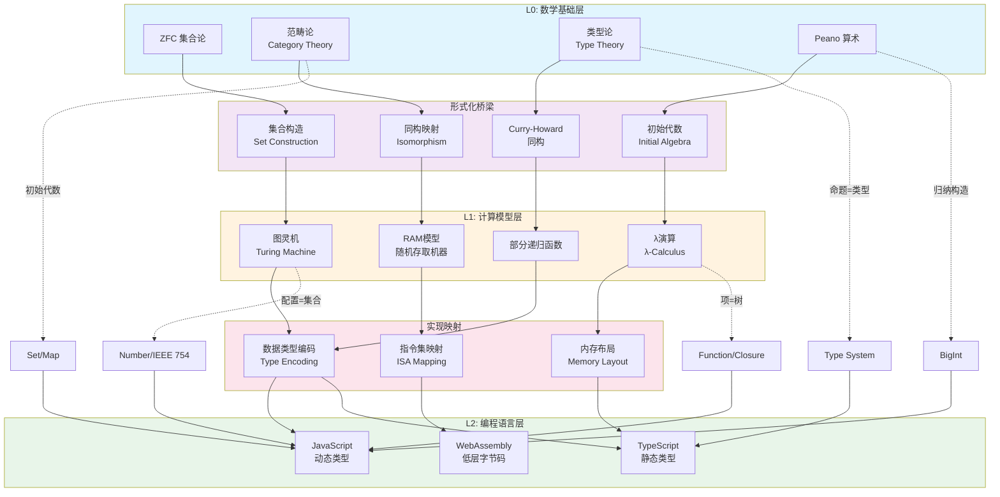
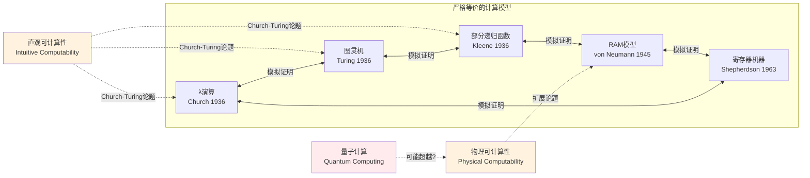

# L0→L1：数学如何定义计算

## 引言

在计算机科学的理论谱系中，存在一个根本性的问题：**计算的本质是什么？** 这个问题并非工程层面的效率之争，而是关于「可计算性」的形而上学追问。从数学基础（L0层）到计算模型（L1层）的跨越，是人类思想史上一次深刻的范式转换——我们将抽象的数学结构转化为可执行的符号操作。

本章作为「层次关联总论」专题的开篇，旨在建立一条严格的形式化链条：**集合论 → 计算模型 → 编程语言实现**。我们将看到，JavaScript 中的 `Number`、`BigInt`、`Set`、`Map` 并非凭空设计，而是数学概念在工程约束下的具体化身。理解这一映射关系，是掌握后续 L2（语言语义）与 L3（编程范式）理论的基石。

---

## 理论严格表述

### 1. 集合论：计算的元数学基础

现代数学的根基建立在 **ZFC 集合论**（Zermelo-Fraenkel with Choice）之上。在这一框架中，一切数学对象——从自然数到函数——都可以被构造为集合。计算理论借用这一基础，将「计算状态」定义为集合，将「计算步骤」定义为集合上的关系。

#### 1.1 图灵机配置的集合论表示

一台图灵机 $M$ 可以被形式化定义为七元组：

$$
M = (Q, \Sigma, \Gamma, \delta, q_0, q_{\text{accept}}, q_{\text{reject}})
$$

其中：

- $Q$ 是有限状态集
- $\Sigma$ 是输入字母表
- $\Gamma$ 是带字母表（$\Sigma \subset \Gamma$）
- $\delta: Q \times \Gamma \to Q \times \Gamma \times \{L, R\}$ 是转移函数
- $q_0 \in Q$ 是初始状态

**图灵机的瞬时描述**（Instantaneous Description, ID）——即「配置」——可以被严格表示为一个三元组的集合：

$$
\text{ID} = (q, \alpha, \beta) \in Q \times \Gamma^* \times \Gamma^*
$$

其中 $\alpha$ 表示读写头左侧的带内容（逆序），$\beta$ 表示读写头处及右侧的带内容。图灵机的计算过程，即是从初始配置集合到终止配置集合的**偏函数**（partial function）。

> **关键洞察**：计算的每一步都是集合上的关系应用。图灵机的「运行」本质上是在配置空间中进行的一次**关系闭包遍历**。

#### 1.2 λ项作为语法树的集合构造

Alonzo Church 的 λ演算提供了另一种计算的形式化。λ项的语法可以通过归纳集合定义：

$$
\begin{aligned}
\Lambda &::= x \quad &\text{(变量)} \\
  &|\quad (\lambda x. M) \quad &\text{(抽象)} \\
  &|\quad (M\ N) \quad &\text{(应用)}
\end{aligned}
$$

从集合论视角，λ项是**有限标记树**（finite labeled trees）的一个子集。每个 λ项都是在一个基础集合上的归纳构造，满足：

1. **变量集合** $V$ 是无限可数集（通常取自然数的一个副本）
2. **项集合** $\Lambda$ 是满足上述文法的最小集合
3. **自由变量函数** $\text{FV}: \Lambda \to \mathcal{P}(V)$ 是递归定义的

β归约 $(\lambda x.M)\ N \to_\beta M[x := N]$ 本质上是**树重写系统**（tree rewriting system）的一个规则。λ演算的计算过程，即是在项集合上反复应用重写规则，直至达到正规形式（如果存在的话）。

### 2. Church-Turing 论题的形式化陈述

Church-Turing 论题是现代计算理论的基石。它并非一个数学定理（因为它涉及「直观可计算性」这一非形式化概念），而是一个**经验性论题**（empirical thesis）。

#### 2.1 原始陈述与精化

**Church 的原始陈述**（1936）：
> 一个自然数上的函数是「直观可计算」的，当且仅当它是 λ可定义的（λ-definable）。

**Turing 的独立陈述**（1936）：
> 一个函数是「机械可计算」的，当且仅当它能被某一图灵机计算。

**现代精化版本**（Church-Turing Thesis）：
> 任何在物理世界中可执行的、有限步完成的算法过程，都可以被图灵机（或等价的 λ演算、部分递归函数）模拟。

#### 2.2 扩展论题：物理 Church-Turing 论题

随着量子计算的发展，学界提出了**物理 Church-Turing 论题**的变体：

> **强物理 Church-Turing 论题**：任何在物理世界中可执行的计算，都可以被概率图灵机在多项式时间内模拟。

量子计算机对多项式时间计算的潜在超越（如 Shor 算法），使得这一强形式受到挑战。然而，对于**经典计算**——即当前所有基于硅基半导体的数字计算——Church-Turing 论题仍然成立。JavaScript 引擎、V8 的 JIT 编译器、乃至最复杂的分布式系统，其计算能力都不超出图灵可计算的范围。

#### 2.3 形式化等价定理

以下计算模型已被严格证明具有**等价计算能力**（即它们定义了相同的可计算函数类）：

| 计算模型 | 提出者 | 年份 | 核心机制 |
|---------|-------|------|---------|
| λ演算 | Alonzo Church | 1936 | 函数抽象与应用 |
| 图灵机 | Alan Turing | 1936 | 状态转移与带读写 |
| 部分递归函数 | Kurt Gödel, Stephen Kleene | 1936 | 原始递归+极小化 |
| 通用寄存器机器 | John Shepherdson, Howard Sturgis | 1963 | 寄存器操作 |
| 随机存取机器（RAM） | John von Neumann（概念） | 1945 | 内存寻址与算术 |

> **理论意义**：无论我们选择哪种模型，「可计算」的边界是相同的。这一不变性为编程语言的设计提供了理论保证——所有通用编程语言在计算能力上是等价的（忽略资源限制）。

### 3. 范畴论：初始代数与归纳类型

范畴论（Category Theory）为类型系统提供了统一的数学框架。在这一视角下，数据类型不是随意的结构，而是满足**泛性质**（universal property）的数学对象。

#### 3.1 范畴论基础构造

一个**范畴** $\mathcal{C}$ 由以下部分组成：

- 对象的类 $\text{Ob}(\mathcal{C})$
- 态射的类 $\text{Hom}(\mathcal{C})$，每个态射 $f: A \to B$ 有源对象和目标对象
- 态射的组合运算 $\circ$，满足结合律
- 每个对象 $A$ 上的恒等态射 $\text{id}_A: A \to A$

#### 3.2 F-代数与初始代数

给定一个**内函子**（endofunctor）$F: \mathcal{C} \to \mathcal{C}$，一个 **F-代数** 是一个对 $(A, \alpha)$，其中：

$$
\alpha: F(A) \to A
$$

$F$-代数的**同态** $h: (A, \alpha) \to (B, \beta)$ 是满足以下交换图的态射：

$$
\begin{array}{ccc}
F(A) & \xrightarrow{F(h)} & F(B) \\
\downarrow{\alpha} & & \downarrow{\beta} \\
A & \xrightarrow{h} & B
\end{array}
$$

**初始代数**（Initial Algebra）是 F-代数范畴中的初始对象。它满足关键的**归纳原理**：从初始代数出发，存在到任何其他 F-代数的唯一同态。这一性质正是**归纳类型**（Inductive Types）的数学基础。

#### 3.3 自然数作为初始代数

考虑定义自然数的内函子：

$$
F(X) = 1 + X
$$

其中 $1$ 是终对象（单位类型），$+$ 是余积（和类型）。自然数类型 $\mathbb{N}$ 是这一内函子的初始代数：

$$
\text{in}: 1 + \mathbb{N} \to \mathbb{N}
$$

具体地：

- $\text{in}(\text{inl}(*)) = 0$（零元）
- $\text{in}(\text{inr}(n)) = \text{succ}(n)$（后继）

这就是 **Peano 算术**的范畴论实现。`zero` 和 `succ` 构成了自然数的构造子（constructors），而初始性保证了**原始递归**的有效性。

#### 3.4 列表类型与树类型

列表内函子：

$$
F_{\text{List}}(X) = 1 + A \times X
$$

其中 $A$ 是元素类型。其初始代数给出有限列表类型：

- $\text{nil}: 1 \to \text{List}_A$
- $\text{cons}: A \times \text{List}_A \to \text{List}_A$

二叉树内函子：

$$
F_{\text{Tree}}(X) = A + X \times X
$$

其初始代数给出二叉搜索树的数学结构。

> **核心结论**：所有归纳数据类型（自然数、列表、树）都是某个内函子的初始代数。这一统一视角解释了为什么递归数据结构具有天然的归纳证明方法。

### 4. 类型论中的 Peano 算术实现

**Martin-Löf 类型论**（MLTT）和 **构造演算**（Calculus of Constructions）为 Peano 算术提供了构造性的形式化。

#### 4.1 归纳构造的语法

在依赖类型论中，自然数类型 $\mathbb{N}$ 通过**归纳构造**（Inductive Definition）引入：

```
Inductive ℕ : Type :=
  | zero : ℕ
  | succ : ℕ → ℕ.
```

相应的**归纳 eliminator**（在编程中对应 `fold` 或 `rec`）具有类型：

$$
\text{elim}_\mathbb{N}: \prod_{P: \mathbb{N} \to \text{Type}} P(0) \to \left(\prod_{n:\mathbb{N}} P(n) \to P(\text{succ}(n))\right) \to \prod_{n:\mathbb{N}} P(n)
$$

这对应于数学归纳法的类型论版本：

- 基础情形：证明 $P(0)$
- 归纳步骤：假设 $P(n)$，证明 $P(\text{succ}(n))$
- 结论：对所有 $n \in \mathbb{N}$，$P(n)$ 成立

#### 4.2 Curry-Howard 同构

**Curry-Howard 同构**揭示了类型与逻辑之间的深刻对应：

| 逻辑 | 类型论 |
|-----|--------|
| 命题 $P$ | 类型 $P$ |
| 证明 $p$ 的 $P$ | 项 $p: P$ |
| $P \implies Q$ | 函数类型 $P \to Q$ |
| $P \land Q$ | 积类型 $P \times Q$ |
| $P \lor Q$ | 和类型 $P + Q$ |
| $\forall x: A. P(x)$ | 依赖积 $\prod_{x:A} P(x)$ |
| $\exists x: A. P(x)$ | 依赖和 $\sum_{x:A} P(x)$ |

在这一框架下，**程序即证明，类型即命题**。一个通过类型检查的函数，对应于一个逻辑上有效的证明。这一同构是现代证明辅助器（如 Coq、Agda、Lean）的理论基础。

### 5. 从数学结构到计算模型的同构映射

我们可以建立一张严格的映射表，展示数学概念如何一步步转化为计算实现：

| 数学结构（L0） | 计算模型（L1） | 编程语言概念（L2） |
|--------------|--------------|-----------------|
| 集合 $A$ | 数据类型 | 类型声明 `type A = ...` |
| 函数 $f: A \to B$ | 可计算函数 | 函数定义 `const f = (x: A): B => ...` |
| 关系 $R \subseteq A \times B$ | 非确定性计算 | 多返回值、生成器 |
| 初始代数 $\mu F$ | 归纳数据类型 | `interface`, `class`, ADT |
| 终余代数 $\nu F$ | 余归纳数据类型 | 流（Stream）、无限列表 |
| 等价关系 | 类型等价 | 结构等价、名义等价 |
| 偏序集 | 指称语义 | 域（Domain）、完全偏序（CPO） |

> **同构的意义**：这种映射不是类比，而是**严格的结构保持映射**（structure-preserving mapping）。数学定理在计算模型中成立，反之亦然。例如，初始代数的唯一性定理保证了递归函数的良定义性。

---

## 工程实践映射

### 1. Number 类型：从数学实数到 IEEE 754 浮点数

JavaScript 的 `Number` 类型基于 **IEEE 754 双精度浮点数标准**（64-bit binary64）。这是数学实数 $\mathbb{R}$ 到计算表示的一个**有损映射**。

#### 1.1 实数与浮点数的根本差异

数学实数具有以下性质：

- **稠密性**：任意两个不同实数之间存在无限多个实数
- **完备性**：所有柯西序列收敛
- **无限精度**：实数可以有无限小数展开

IEEE 754 双精度浮点数：

- 1 位符号位 + 11 位指数位 + 52 位尾数位 = 64 位
- 可表示的数值范围：$\approx [2^{-1074}, 2^{1024}]$
- 精度：约 15-17 位十进制有效数字
- 特殊值：`NaN`（Not a Number）、`+Infinity`、`-Infinity`

```javascript
// 数学上 0.1 + 0.2 = 0.3
// 但在 IEEE 754 中：
console.log(0.1 + 0.2 === 0.3); // false
console.log(0.1 + 0.2);         // 0.30000000000000004
```

这一差异的根源在于：$0.1$ 在二进制中是无限循环小数 $0.0001100110011..._2$，而 52 位尾数只能存储截断后的近似值。

#### 1.2 浮点数的集合论解释

从集合论视角，IEEE 754 浮点数集合 $\mathbb{F}$ 是实数集合 $\mathbb{R}$ 的一个**有限子集**加上特殊值：

$$
\mathbb{F} = \{0\} \cup \{\pm \text{NaN}\} \cup \{\pm \infty\} \cup \{\pm 2^e \times 1.m : e \in [-1022, 1023], m \in [0, 2^{52}-1]\}
$$

实数到浮点数的映射是一个**部分函数**：

$$
\text{round}: \mathbb{R} \rightharpoonup \mathbb{F}
$$

该映射满足**单调性**（monotonicity）和**对称性**（symmetry），但不满足结合律和分配律。

#### 1.3 工程中的应对策略

```javascript
// 策略1：使用整数运算替代浮点运算
const cents = 1000; // 表示 $10.00，以分为单位

// 策略2：使用误差容忍的相等性判断
const EPSILON = 1e-10;
function floatEqual(a, b) {
  return Math.abs(a - b) < EPSILON;
}

// 策略3：使用 decimal.js 等库进行任意精度十进制运算
// 策略4：在 TypeScript 中使用 branded types 标记货币类型
type Cents = number & { readonly __brand: 'Cents' };
```

### 2. BigInt：扩展计算的数值范围

ES2020 引入的 `BigInt` 类型是对 IEEE 754 限制的直接回应。`BigInt` 可以表示**任意精度的整数**，突破了 `Number.MAX_SAFE_INTEGER`（$2^{53} - 1$）的限制。

#### 2.1 安全整数与数学整数的差距

```javascript
console.log(Number.MAX_SAFE_INTEGER); // 9007199254740991 = 2^53 - 1
console.log(Number.MAX_SAFE_INTEGER + 1 === Number.MAX_SAFE_INTEGER + 2); // true!
```

在 $2^{53}$ 之后，相邻的浮点数之间的间隔大于 1，导致整数无法被唯一表示。这与数学整数 $\mathbb{Z}$ 的无限性形成鲜明对比。

#### 2.2 BigInt 的实现原理

`BigInt` 在引擎层面通常使用**变长数组**（dynamically sized array）存储大整数，以 $2^{30}$ 或 $2^{32}$ 为基底进行多位运算。其时间复杂度：

- 加法/减法：$O(n)$，其中 $n$ 是机器字数
- 乘法：Karatsuba 算法 $O(n^{\log_2 3}) \approx O(n^{1.585})$，或 FFT-based 算法 $O(n \log n)$
- 除法：$O(n^2)$（经典算法）

```javascript
// 大整数运算
const factorial = (n) => {
  let result = 1n;
  for (let i = 2n; i <= n; i++) {
    result *= i;
  }
  return result;
};

console.log(factorial(100n).toString());
// 93326215443944152681699238856266700490715968264381621468592963895217599993229915608941463976156518286253697920827223758251185210916864000000000000000000000000
```

> **理论映射**：`BigInt` 实现了整数环 $(\mathbb{Z}, +, \times)$ 的一个**有限截断近似**，在可用内存范围内精确表示整数运算。

### 3. Set 与 Map：从集合论抽象到数据结构

ES2015 引入的 `Set` 和 `Map` 是集合论概念在工程中的直接映射。

#### 3.1 Set：有限集的计算实现

数学中的集合具有以下公理性质：

- **外延性**：$A = B$ 当且仅当它们具有相同的元素
- **无重复性**：集合中每个元素只出现一次
- **无序性**：元素没有内在顺序

JavaScript 的 `Set` 实现了这些性质：

```javascript
const s = new Set();
s.add(1);
s.add(1); // 重复添加无效
s.add(2);
console.log(s.size); // 2
```

然而，`Set` 也引入了工程约束：

- **SameValueZero 相等性**：基于 `Object.is` 的变体，将 `NaN` 视为等于自身
- **迭代顺序**：ES2015 规定按插入顺序迭代（这超出了纯集合论的范畴）

#### 3.2 Map：函数的有限表示

数学中，函数 $f: A \to B$ 是 $A \times B$ 的一个特殊子集（满足单值性）。`Map` 是这种关系在有限域上的**显式枚举**：

```javascript
const f = new Map();
f.set('a', 1);
f.set('b', 2);

// 对应数学函数：f('a') = 1, f('b') = 2
// 定义域：dom(f) = {'a', 'b'}
// 值域：ran(f) = {1, 2}
```

#### 3.3 底层实现：哈希表与数学

`Set` 和 `Map` 在 V8 引擎中通常使用**哈希表**（hash table）实现。哈希函数 $h: K \to \{0, 1, ..., m-1\}$ 将键空间映射到有限索引集。理想的哈希函数应近似**均匀分布**（uniform distribution），这与概率论中的随机映射概念相关。

平均时间复杂度：

- 插入/查找/删除：$O(1)$（假设良好分布的哈希函数）
- 最坏情况（所有键碰撞）：$O(n)$

```javascript
// WeakSet 和 WeakMap：引入了「弱引用」概念
// 对应数学上：允许元素从定义域中「消失」（被垃圾回收）
const weakMap = new WeakMap();
let obj = { key: 'value' };
weakMap.set(obj, 'data');
obj = null; // 对象可被垃圾回收，weakMap 中的条目自动消失
```

> `WeakMap` 的「弱引用」语义在数学上没有直接对应，但在**域理论**（Domain Theory）中，可以类比于偏序中的「信息增长」与「有限逼近」概念。

### 4. 类型系统的完备性与一致性

在 TypeScript 类型系统中，「完备性」和「一致性」这两个术语经常被提及，但其含义与数理逻辑中的严格定义既有联系又有区别。

#### 4.1 逻辑系统中的完备性与一致性

**哥德尔不完备定理**（Gödel, 1931）指出：

- 任何足够强的、一致的形式系统，都存在不可证明的真命题
- 这样的系统不能证明自身的一致性

**一致性**（Consistency）：系统中不存在命题 $P$ 使得 $P$ 和 $\neg P$ 都可证。
**完备性**（Completeness）：所有真命题都可证。

#### 4.2 类型系统中的应用

在类型论中：

- **类型安全性**（Type Safety）= **进展**（Progress）+ **保持**（Preservation）
- **进展**：良类型的程序不会「卡住」（要么是个值，要么可以继续归约）
- **保持**：如果 $e: T$ 且 $e \to e'$，则 $e': T$

TypeScript 的类型系统**有意地**是不可判定的（undecidable）——为了支持灵活的类型操作（如条件类型、映射类型、递归类型），TS 编译器在类型检查深度上设置了限制（默认约 50 层递归）。

```typescript
// 这一类型在足够深的递归下会触发 TS 的递归深度限制
type DeepJSON =
  | string
  | number
  | boolean
  | null
  | DeepJSON[]
  | { [key: string]: DeepJSON };

// 实际编译时可能报错：Type instantiation is excessively deep and possibly infinite.
```

#### 4.3 工程含义

- **一致性**在工程中意味着：类型系统不会同时接受和拒绝同一个程序。TypeScript 通过结构化类型检查保证了这一点。
- **完备性**在工程中是**妥协的**：TS 宁愿拒绝一些正确的程序（ false positive ），也不接受错误的程序（ false negative ）。这是一种**保守近似**（conservative approximation）。

```typescript
// TS 可能过度保守的例子
function narrow(x: string | number) {
  if (typeof x === 'string') {
    return x.toUpperCase();
  }
  // TS 知道这里 x 是 number，但如果逻辑更复杂，可能需要类型断言
  return (x as number).toFixed(2);
}
```

### 5. 数学同构在框架设计中的体现

现代前端框架的设计深受数学概念影响：

#### 5.1 函子（Functor）与数组映射

范畴论中的 **Functor** 是保持结构的映射 $F: \mathcal{C} \to \mathcal{D}$，满足：

- $F(\text{id}_A) = \text{id}_{F(A)}$
- $F(f \circ g) = F(f) \circ F(g)$

JavaScript 数组的 `.map` 方法就是一个函子实例：

```javascript
const arr = [1, 2, 3];

// Functor law 1: 恒等
arr.map(x => x); // [1, 2, 3] —— 等于原数组

// Functor law 2: 组合
const f = x => x + 1;
const g = x => x * 2;
arr.map(x => f(g(x)));        // [3, 5, 7]
arr.map(g).map(f);             // [3, 5, 7] —— 结果相同
```

#### 5.2 单子（Monad）与 Promise

单子是带有 `unit`（`of`）和 `bind`（`flatMap`/`then`）运算的自函子。`Promise` 满足单子律：

```javascript
// 左单位元：Promise.resolve(x).then(f) ≈ f(x)
Promise.resolve(5).then(x => x * 2); // ≈ (x => x * 2)(5)

// 右单位元：p.then(Promise.resolve) ≈ p
Promise.resolve(5).then(Promise.resolve); // ≈ Promise.resolve(5)

// 结合律：p.then(f).then(g) ≈ p.then(x => f(x).then(g))
```

> 严格来说，JavaScript 的 `Promise` 不满足纯函数意义上的单子律（因为执行时机和副作用），但在类型结构层面具有单子的形态。

---

## Mermaid 图表

### 图1：数学概念到计算模型到编程语言实现的完整映射链



### 图2：Church-Turing 论题的等价模型网络



### 图3：初始代数到数据类型的构造链

```mermaid
flowchart TB
    subgraph Functor["内函子 F"]
        F1["F(X) = 1 + X<br/>自然数"]
        F2["F(X) = 1 + A × X<br/>列表"]
        F3["F(X) = A + X × X<br/>二叉树"]
    end

    subgraph InitialAlg["初始代数 μF"]
        IA1["zero: 1 → ℕ<br/>succ: ℕ → ℕ"]
        IA2["nil: 1 → Listₐ<br/>cons: A × Listₐ → Listₐ"]
        IA3["leaf: A → Treeₐ<br/>node: Treeₐ × Treeₐ → Treeₐ"]
    end

    subgraph Programming["编程语言实现"]
        P1["```ts\ntype Nat = { tag: 'zero' } | { tag: 'succ'; pred: Nat };\n```"]
        P2["```ts\ntype List<A> = null | { head: A; tail: List<A> };\n```"]
        P3["```ts\ntype Tree<A> = { tag: 'leaf'; val: A } | { tag: 'node'; l: Tree<A>; r: Tree<A> };\n```"]
    end

    subgraph Elimination["消去子/折叠"]
        E1["fold: 递归函数定义"]
        E2["fold: reduce/forEach"]
        E3["fold: 树遍历"]
    end

    F1 --> IA1
    F2 --> IA2
    F3 --> IA3

    IA1 --> P1
    IA2 --> P2
    IA3 --> P3

    P1 --> E1
    P2 --> E2
    P3 --> E3

    style Functor fill:#e3f2fd
    style InitialAlg fill:#e8f5e9
    style Programming fill:#fff3e0
    style Elimination fill:#fce4ec
```

---

## 理论要点总结

1. **集合论为计算提供元数学基础**：图灵机配置是集合，λ项是归纳集合，计算的每一步都是集合上的关系应用。JavaScript 中的 `Set` 和 `Map` 直接映射了集合论中的集合和函数概念。

2. **Church-Turing 论题确立了可计算的边界**：所有通用编程语言在计算能力上等价。TypeScript 和 JavaScript 不能计算图灵机无法计算的函数——这是理论上的硬性上限。

3. **范畴论的初始代数统一了数据类型理论**：自然数、列表、树等看似不同的数据结构，都是特定内函子的初始代数。这一视角解释了递归结构的归纳原理，并直接指导了代数数据类型（ADT）的设计。

4. **类型论的 Curry-Howard 同构连接了证明与程序**：类型即命题，程序即证明。TypeScript 的类型检查器在执行一种「轻量级定理证明」，尽管其逻辑能力远弱于 Coq 或 Agda。

5. **IEEE 754 是数学实数到计算表示的有损映射**：理解这一映射的局限性（精度损失、结合律失效）是避免数值计算陷阱的关键。`BigInt` 通过变长表示扩展了整数范围，但引入了新的性能考量。

6. **完备性与一致性在工程中表现为类型安全**：类型系统的「保守近似」策略（宁可误报也不漏报）是工程实践对理论不可判定性的务实回应。

---

## 参考资源

### 经典文献

1. **Church, A.** (1936). "An unsolvable problem of elementary number theory." *American Journal of Mathematics*, 58(2), 345-363. 这篇论文引入了 λ可定义性的概念，奠定了 Church-Turing 论题的一半基础。

2. **Turing, A. M.** (1936). "On computable numbers, with an application to the Entscheidungsproblem." *Proceedings of the London Mathematical Society*, 42(2), 230-265. 图灵机的原始论文，证明了停机问题的不可判定性。

3. **Pierce, B. C.** (2002). *Types and Programming Languages*. MIT Press. 类型系统领域的权威教材，第1-5章详细阐述了 λ演算、简单类型系统与 Curry-Howard 同构的理论基础。

4. **Barendregt, H. P.** (1992). "Lambda calculi with types." *Handbook of Logic in Computer Science*, 2, 117-309. 对类型化 λ演算的全面综述。

5. **Jacobs, B.** (1999). *Categorical Logic and Type Theory*. Elsevier. 从范畴论视角系统阐述类型论的专著，第2-4章深入讨论了初始代数与归纳类型。

6. **IEEE Computer Society** (2019). *IEEE Standard for Floating-Point Arithmetic* (IEEE 754-2019). 浮点数运算的工程标准文档。

### 在线资源

- [The Stanford Encyclopedia of Philosophy: The Church-Turing Thesis](https://plato.stanford.edu/entries/church-turing/) — 对 Church-Turing 论题哲学层面的深入探讨
- [nLab: Initial algebra of an endofunctor](https://ncatlab.org/nlab/show/initial+algebra+of+an+endofunctor) — 范畴论视角下初始代数的严格定义与性质
- [V8 引擎博客: BigInt 实现](https://v8.dev/features/bigint) — Google V8 团队关于 BigInt 设计与实现的官方说明

### 相关层次

- **下一章**：[L1→L2：计算理论到编程语言](02-computation-to-language.md) — 探讨形式语言、自动机与复杂度理论如何塑造编程语言的语法与语义设计
- **前置知识**：[计算模型概述](../70-theoretical-foundations/70.1-category-theory-and-computational-paradigms/computational-models.md)

---

*本文档属于「理论层次总论」专题，遵循双轨并行写作规范：理论严格表述与工程实践映射相结合。*
