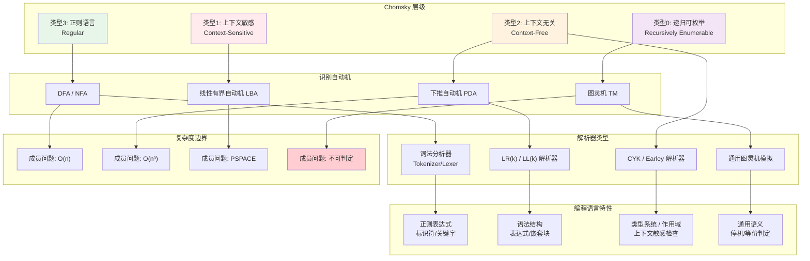
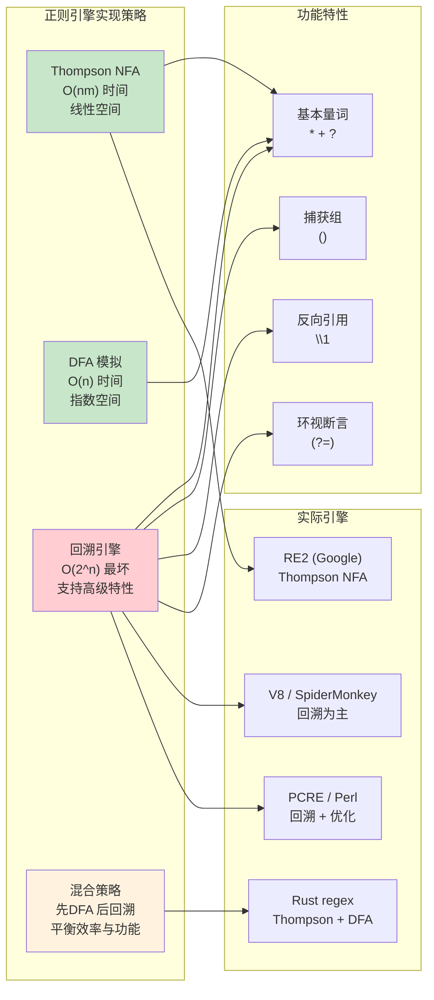
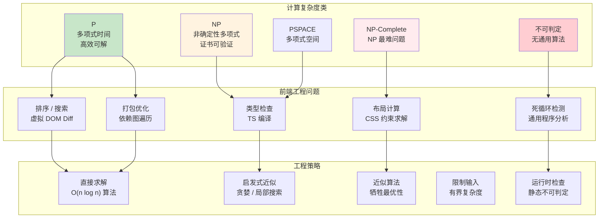

# L1→L2：计算理论到编程语言

## 引言

如果数学（L0）回答了「什么是可计算的」这一本体论问题，那么计算理论（L1）则致力于回答「如何有效地描述和组织计算」这一方法论问题。从形式语言的层级结构到自动机的状态转移，从停机问题的不可判定性到 P vs NP 的千古之谜，计算理论为编程语言的设计划定了不可逾越的边界，同时也提供了丰富的构造工具。

本章作为「层次关联总论」的第二篇，将沿着 **Chomsky 层级 → 自动机 → 解析器 → 语言特性** 的主线，揭示计算理论如何深刻地影响着 JavaScript/TypeScript 的语法设计、引擎实现以及前端工程实践。我们将看到，ES6 引入的 `class` 语法糖、正则表达式的回溯机制、虚拟 DOM 的 diff 算法复杂度，乃至 WebAssembly 的指令集设计，无一不根植于 L1 层的理论土壤。

---

## 理论严格表述

### 1. 形式语言的层级结构：Chomsky 层级

Noam Chomsky 于 1956 年提出的**乔姆斯基层级**（Chomsky Hierarchy）将形式语言划分为四个严格嵌套的类别，每一类对应不同表达能力的文法与不同计算能力的自动机。

#### 1.1 四类文法的形式化定义

设文法 $G = (V, \Sigma, R, S)$，其中 $V$ 是非终结符集合，$\Sigma$ 是终结符集合，$R$ 是产生式规则集合，$S \in V$ 是开始符号。

**类型 0：递归可枚举文法（Recursively Enumerable）**

- 产生式形式：$\alpha \to \beta$，其中 $\alpha, \beta \in (V \cup \Sigma)^*$，且 $\alpha \neq \varepsilon$
- 识别设备：图灵机（无限制）
- 闭包性质：对并、交、连接、Kleene 星号封闭
- 判定问题：成员问题可判定，但空性问题不可判定

**类型 1：上下文敏感文法（Context-Sensitive）**

- 产生式形式：$\alpha A \beta \to \alpha \gamma \beta$，其中 $A \in V$，$\gamma \neq \varepsilon$
- 或等价地：$|\alpha| \leq |\beta|$（非收缩性）
- 识别设备：线性有界自动机（LBA）
- 时间复杂度：成员问题可在非确定性线性空间内解决（NSPACE(n)）

**类型 2：上下文无关文法（Context-Free）**

- 产生式形式：$A \to \gamma$，其中 $A \in V$，$\gamma \in (V \cup \Sigma)^*$
- 识别设备：下推自动机（PDA）
- 闭包性质：对并、连接、Kleene 星号封闭；对交、补不封闭
- 算法复杂度：成员问题可在 $O(n^3)$ 时间内解决（CYK 算法）

**类型 3：正则文法（Regular）**

- 产生式形式：$A \to aB$ 或 $A \to a$，其中 $A, B \in V$，$a \in \Sigma$
- 识别设备：有限自动机（DFA/NFA）
- 闭包性质：对并、交、补、连接、Kleene 星号均封闭
- 算法复杂度：成员问题 $O(n)$，最小化 $O(n \log n)$

#### 1.2 Chomsky 层级的包含关系

$$
\text{Regular} \subset \text{Context-Free} \subset \text{Context-Sensitive} \subset \text{Recursively Enumerable}
$$

这一严格包含关系意味着：

- 每个正则语言都是上下文无关的
- 存在上下文无关语言不是正则的（如 $\{a^n b^n : n \geq 0\}$）
- 存在上下文敏感语言不是上下文无关的（如 $\{a^n b^n c^n : n \geq 0\}$）

#### 1.3 与编程语言语法的对应关系

| 层级 | 编程语言中的应用 | 典型示例 |
|------|----------------|---------|
| 正则语言 | 词法分析（Tokenization） | 标识符、关键字、数字字面量的模式匹配 |
| 上下文无关语言 | 语法分析（Parsing） | 表达式、语句块、嵌套结构的解析 |
| 上下文敏感语言 | 类型检查、作用域分析 | 变量使用前声明、类型一致性 |
| 递归可枚举 | 图灵完备语言的语义 | 程序终止性判断、通用程序分析 |

> **关键洞察**：编程语言的**语法**（syntax）通常由上下文无关文法描述，而**静态语义**（static semantics，如类型检查）往往需要上下文敏感甚至更强的机制。

### 2. 自动机与解析器：从理论到算法

#### 2.1 有限自动机与正则表达式

**确定性有限自动机**（DFA）是一个五元组 $M = (Q, \Sigma, \delta, q_0, F)$：

- $\delta: Q \times \Sigma \to Q$ 是确定性转移函数
- 对任何输入字符串，DFA 有唯一的计算路径

**非确定性有限自动机**（NFA）允许：

- 同一状态下同一输入转移到多个状态
- $\varepsilon$-转移（不消耗输入的状态转移）

**Thompson 构造法**（1968）和 **子集构造法**（Powerset Construction）证明了：

$$
L(\text{NFA}) = L(\text{DFA}) = L(\text{Regular Expression})
$$

即三者具有等价的表达能力。然而，NFA 到 DFA 的转换可能导致**状态爆炸**：$n$ 状态的 NFA 对应的最小 DFA 可能有 $2^n$ 个状态。

#### 2.2 下推自动机与上下文无关解析

下推自动机（PDA）在有限自动机的基础上增加了一个**栈**（stack）作为辅助存储。PDA 与上下文无关文法的等价性，对应于程序语言中**嵌套结构**（括号匹配、代码块嵌套）的解析能力。

解析算法按复杂度分类：

| 算法类别 | 时间复杂度 | 适用文法 | 代表算法 |
|---------|----------|---------|---------|
| LL(k) | $O(n)$ | LL(k) 文法 | 递归下降、预测分析 |
| LR(k) | $O(n)$ | LR(k) 文法 | LR(0), SLR, LALR, LR(1) |
| 通用 CYK | $O(n^3)$ | 所有 CNF 文法 | CYK 算法 |
| Earley | $O(n^3)$（最坏） | 所有 CFG | Earley 解析器 |
| GLR | $O(n^3)$（最坏） | 所有 CFG | Tomita 算法 |

#### 2.3 从 NFA 到 LL/LR：解析器设计的谱系

```
正则表达式 → NFA → DFA（最小化）→ 词法分析器（Lexer）
                         ↓
上下文无关文法 → LL(k)/LR(k) 分析表 → 语法分析器（Parser）
                         ↓
                    抽象语法树（AST）
                         ↓
                    语义分析与代码生成
```

LL 解析器（Left-to-right, Leftmost derivation）采用**自顶向下**策略，实现直观但需要消除左递归。LR 解析器（Left-to-right, Rightmost derivation in reverse）采用**自底向上**策略，表达能力更强（所有 LL(k) 文法都是 LR(k) 的，反之不然）。

### 3. 可计算性边界：停机问题与语言设计的限制

#### 3.1 停机问题的严格陈述

**停机问题**（Halting Problem）：给定任意程序 $P$ 和输入 $x$，判定 $P$ 在输入 $x$ 上是否最终停机。

Turing 于 1936 年通过**对角线法**证明了停机问题是**不可判定的**（undecidable）：

> 不存在图灵机 $H$，使得对所有程序 $P$ 和输入 $x$：
>
> - 若 $P(x)$ 停机，则 $H(P, x)$ 输出「是」
> - 若 $P(x)$ 不停机，则 $H(P, x)$ 输出「否」

#### 3.2 Rice 定理与一般不可判定性

**Rice 定理**（Rice, 1953）极大地扩展了不可判定性的范围：

> 任何关于程序**语义**的非平凡属性都是不可判定的。

「非平凡」意味着该属性对某些程序成立，对某些程序不成立。「语义属性」意味着如果两个程序计算相同的函数，则它们要么都满足该属性，要么都不满足。

这意味着以下问题都是不可判定的：

- 程序是否等价于另一个程序？
- 程序是否存在运行时类型错误？
- 程序是否包含死代码？
- 程序是否会访问未初始化变量？

#### 3.3 对编程语言设计的直接影响

停机问题及相关不可判定性结果，对语言设计产生了深远影响：

1. **类型系统的近似**：静态类型检查是停机问题的近似解。TypeScript 的类型检查器**不是**完备的——它会拒绝一些正确的程序（保守近似），但保证接受的程序在运行时不会出现类型错误（理想情况下）。

2. **安全子集与限制语言**：为了获得可判定的分析，语言设计者常常限制语言的表达能力。例如，CSS 选择器语言是正则的，因此匹配效率可保证；XPath 1.0 的某些子集也是可高效判定的。

3. **运行时检查的必要性**：由于静态分析的局限性，某些检查只能在运行时进行。JavaScript 的 `typeof`、`instanceof`、异常处理机制，都是停机问题不可判定性的工程体现。

4. **linting 与静态分析的边界**：ESLint、TSLint 等工具只能检测**模式匹配**可发现的问题，无法检测需要完全语义分析的问题（如死循环、未定义行为的精确检测）。

### 4. 计算复杂度：P、NP 与算法选择

#### 4.1 复杂度类的定义

**P**（Polynomial time）：存在确定性图灵机在多项式时间内可判定的语言类。

**NP**（Nondeterministic Polynomial time）：存在非确定性图灵机在多项式时间内可判定的语言类。等价地，一个语言 $L \in \text{NP}$ 当且仅当存在多项式时间可验证的证书（certificate）。

**PSPACE**：存在确定性图灵机在多项式空间内可判定的语言类。

**EXP**：存在确定性图灵机在指数时间内可判定的语言类。

包含关系链：

$$
\text{P} \subseteq \text{NP} \subseteq \text{PSPACE} \subseteq \text{EXP}
$$

著名的 **P vs NP 问题**：是否 $\text{P} = \text{NP}$？这是 Clay 数学研究所七大千禧年难题之一，至今未解。

#### 4.2 NP 完全问题

**Cook-Levin 定理**（1971）：布尔可满足性问题（SAT）是 NP 完全的。

**Karp 的 21 个 NP 完全问题**（1972）建立了 NP 完全性的标准问题集，包括：

- 3-SAT（布尔公式可满足性）
- 顶点覆盖（Vertex Cover）
- 哈密顿回路（Hamiltonian Cycle）
- 背包问题（Knapsack）
- 图着色（Graph Coloring）

NP 完全问题的核心特征：

- 目前未知是否存在多项式时间算法
- 如果其中一个问题存在多项式时间算法，则所有 NP 问题都有（P = NP）
- 在实践中，通常使用近似算法、启发式算法或限制输入规模来应对

#### 4.3 复杂度理论对算法设计的指导

复杂度理论告诉我们哪些问题「 inherently hard 」，从而指导工程中的算法选择：

| 问题类型 | 复杂度 | 工程策略 |
|---------|--------|---------|
| 排序 | $O(n \log n)$（最优比较排序） | 使用快速排序、归并排序、Timsort |
| 最短路径 | $O((V+E)\log V)$（Dijkstra） | 图遍历、路由算法 |
| 正则表达式匹配 | $O(nm)$（Thompson NFA） | 避免回溯灾难 |
| SAT 求解 | NP 完全 | 使用 CDCL 启发式求解器（工业级） |
| 类型推断（HM） | $O(n^3)$（经典） | ML 系列语言的类型系统 |

### 5. 计算模型对语言语义的影响

不同的计算模型强调了计算的不同侧面，从而影响了语言语义的设计：

#### 5.1 图灵机与命令式语义

图灵机模型强调：

- **状态**：有限控制器的状态
- **内存**：无限带的格子
- **操作**：读写头的移动与符号改写

这直接映射到命令式编程语言的语义：

- 变量 ↔ 带上的格子
- 赋值语句 ↔ 改写操作
- 控制流 ↔ 状态转移
- 指针/引用 ↔ 带地址的直接访问

#### 5.2 λ演算与函数式语义

λ演算模型强调：

- **函数作为一等公民**
- **应用与替换**作为核心操作
- **无显式状态**，通过参数传递所有信息

这映射到函数式编程语言：

- 高阶函数 ↔ 函数作为参数和返回值
- 闭包 ↔ λ抽象的捕获环境
- 递归 ↔ 不动点组合子 Y
- 惰性求值 ↔ 正规序归约策略

#### 5.3 RAM 模型与低级语言

随机存取机器（RAM）模型更接近现代计算机架构：

- 寄存器与内存的区分
- 常数时间的随机内存访问
- 算术与逻辑运算的原子性

这映射到汇编语言、C 语言以及 WebAssembly：

- 显式内存管理
- 指针算术
- 栈操作与调用约定

---

## 工程实践映射

### 1. JavaScript 正则表达式：回溯与 NFA 模拟

JavaScript 的 `RegExp` 引擎基于 **NFA 回溯**（backtracking）策略，这与形式语言理论中的 NFA 模拟密切相关。

#### 1.1 回溯机制的工作原理

当正则表达式包含选择（`|`）或量词（`*`, `+`, `?`）时，引擎采用**深度优先搜索**（DFS）策略尝试所有可能的匹配路径：

```javascript
// 灾难性回溯的例子
const badRegex = /^(a+)+$/;
const input = 'aaaaaaaaaaaaaaaaaaaaaaaaaaaaab';

console.time('catastrophic');
badRegex.test(input); // 超指数级时间！
console.timeEnd('catastrophic');
```

上述正则表达式 `(a+)+$` 的 NFA 状态数与输入字符串长度呈线性关系，但回溯路径数与组嵌套深度呈指数增长。当输入以非 `'a'` 字符结尾时，引擎必须尝试所有可能的组划分，导致**灾难性回溯**（Catastrophic Backtracking）。

#### 1.2 工程中的防御策略

```javascript
// 策略1：使用 possessive quantifiers（JS 不支持，可用原子组模拟）
// 在支持原子组的语言中：(?>a+)+

// 策略2：限制回溯——使用非回溯子表达式
const saferRegex = /^a+$/; // 简单量词，无嵌套组

// 策略3：设置超时或长度限制
function safeTest(regex, input, maxLength = 1000) {
  if (input.length > maxLength) return false;
  return regex.test(input);
}

// 策略4：使用 RE2 风格的线性时间引擎
// Node.js 可使用 re2 库：npm install re2
```

#### 1.3 从 Thompson NFA 到回溯引擎

Ken Thompson 于 1968 年提出的 **Thompson NFA** 构造法，可以在 $O(nm)$ 时间内完成正则匹配（$n$ 为输入长度，$m$ 为模式长度）。但大多数主流正则引擎（包括 JavaScript 的 V8 引擎）选择回溯策略，原因包括：

- **捕获组与反向引用**：回溯引擎天然支持 `(a+)\1` 等高级特性
- **lookahead/lookbehind**：上下文敏感匹配需要回溯
- **历史原因**：Perl、PCRE 等早期实现采用回溯，形成了生态惯性

> **理论边界**：带反向引用的正则表达式**不是**正则语言，其匹配问题是 NP 难的。这解释了为什么 V8 引擎对某些模式会「卡住」——这是计算复杂度的硬性约束。

### 2. 解析器生成器：从自动机到工程工具

#### 2.1 PEG.js 与 Packrat 解析

**解析表达式文法**（PEG, Parsing Expression Grammar）是一种确定性的文法形式，消除了上下文无关文法的歧义性。PEG.js 是一个基于 JavaScript 的 PEG 解析器生成器。

```javascript
// PEG.js 风格的语法定义（概念性）
/*
Expression
  = left:Term _ "+" _ right:Expression { return left + right; }
  / Term

Term
  = left:Factor _ "*" _ right:Term { return left * right; }
  / Factor

Factor
  = "(" _ expr:Expression _ ")" { return expr; }
  / number:Number { return number; }

Number = digits:[0-9]+ { return parseInt(digits.join(''), 10); }
_ = [ \t\n\r]*
*/
```

PEG 使用 **Packrat 解析**（Ford, 2002），即带记忆化的递归下降解析。通过表格记忆化（tabulation），Packrat 解析可以在 $O(n)$ 时间内处理任何 PEG 文法，空间复杂度 $O(n \times |G|)$。

#### 2.2 Nearley 与 Earley 解析器

Nearley 是一个基于 JavaScript 的通用解析器生成器，实现了 **Earley 算法**。与 PEG 的确定性不同，Earley 算法可以处理**所有上下文无关文法**，包括歧义文法：

```javascript
// Nearley 语法示例（概念性）
/*
@builtin "number.ne"
@builtin "whitespace.ne"

expr -> expr "+" expr | expr "*" expr | number
*/
```

Earley 算法的 $O(n^3)$ 最坏时间复杂度在实践中通常接近 $O(n)$（对于非歧义文法）。Nearley 还支持生成多个解析树（parse forest），这对自然语言处理等需要处理歧义的应用尤为重要。

#### 2.3 TypeScript 编译器的解析策略

TypeScript 编译器（tsc）使用**手写的递归下降解析器**，而非解析器生成器。这种选择的工程理由：

- **错误恢复**：手写解析器可以精确控制错误报告和恢复策略
- **性能**：针对 TypeScript 特定语法优化的解析器比通用生成器更快
- **增量解析**：IDE 场景需要局部重新解析能力
- **与 Scanner 的紧密耦合**：TS 的词法分析器与语法分析器高度协作

```typescript
// TypeScript 解析器内部（简化示意）
// 位于 src/compiler/parser.ts
function parseSourceFile(fileName: string, sourceText: string) {
  const scanner = createScanner(ScriptTarget.Latest, /*skipTrivia*/ true);
  scanner.setText(sourceText);
  // ... 递归下降解析逻辑
}
```

### 3. Big-O 复杂度分析在前端性能优化中的应用

#### 3.1 虚拟 DOM 的 O(n) Diff 算法

React 的虚拟 DOM diff 算法是一个经典的算法设计案例。理论上，两棵树之间的最小差异计算是 **O(n³)** 的（基于树编辑距离）。React 采用 **O(n)** 的启发式算法，基于两个关键假设：

1. **不同类型的元素产生不同的树**：如果根节点类型不同（如 `div` → `span`），直接卸载旧树、挂载新树
2. **通过 key 属性提供隐式线索**：开发者通过 `key` 提示哪些子元素是稳定的

```javascript
// React diff 的简化逻辑（概念性）
function diff(oldVNode, newVNode) {
  if (oldVNode.type !== newVNode.type) {
    // 假设1：不同类型，直接替换 —— O(1)
    return { type: 'REPLACE', newNode: newVNode };
  }

  if (oldVNode.key !== newVNode.key) {
    // key 不匹配，视为不同元素
    return { type: 'REPLACE', newNode: newVNode };
  }

  // 同类型同 key，递归比较子节点
  const childPatches = diffChildren(oldVNode.children, newVNode.children);
  return { type: 'UPDATE', props: diffProps(...), children: childPatches };
}
```

#### 3.2 Promise 链的复杂度分析

Promise 链的时间复杂度分析需要考虑微任务队列（microtask queue）的调度机制：

```javascript
// 顺序执行的 Promise 链
const chain = Promise.resolve();
for (let i = 0; i < n; i++) {
  chain = chain.then(() => fetch(`/api/item/${i}`));
}
// 时间复杂度：O(n) 次网络请求，顺序执行
// 总延迟：sum(latency_i) for i in 0..n-1

// 并行执行的 Promise
const parallel = Promise.all(
  Array.from({ length: n }, (_, i) => fetch(`/api/item/${i}`))
);
// 时间复杂度：O(n) 次网络请求，并行执行
// 总延迟：max(latency_i) for i in 0..n-1
```

从计算复杂度角度：

- `Promise.then()` 链：时间 $O(n)$，空间 $O(n)$（闭包累积）
- `Promise.all()`：时间 $O(n)$（假设并行执行），空间 $O(n)$
- `Promise.race()`：时间 $O(1)$（取最先完成），空间 $O(n)$

#### 3.3 数据结构选择的复杂度考量

```javascript
// 场景：频繁查找和插入
// 选项1：数组 —— 查找 O(n)，插入 O(n)（需要移位）
const arr = [];

// 选项2：Map —— 查找 O(1)，插入 O(1)
const map = new Map();

// 场景：需要有序遍历
// 选项1：对象 + 手动排序 —— 插入 O(1)，遍历 O(n log n)
// 选项2：Map（ES2015 保持插入顺序）— 插入 O(1)，遍历 O(n)

// 场景：LRU 缓存
// 理论要求：get 和 put 都是 O(1)
// 工程实现：Map + 双向链表（如 lodash.memoize 或 lru-cache）
class LRUCache {
  constructor(capacity) {
    this.capacity = capacity;
    this.cache = new Map(); // Map 保持插入顺序！
  }

  get(key) {
    if (!this.cache.has(key)) return -1;
    const val = this.cache.get(key);
    this.cache.delete(key);   // O(1)
    this.cache.set(key, val); // O(1)，重新放入末尾
    return val;
  }

  put(key, value) {
    if (this.cache.has(key)) this.cache.delete(key);
    else if (this.cache.size >= this.capacity) {
      const firstKey = this.cache.keys().next().value;
      this.cache.delete(firstKey); // 淘汰最久未使用
    }
    this.cache.set(key, value);
  }
}
```

### 4. WebAssembly：可移植的汇编与 RAM 模型

#### 4.1 WebAssembly 的计算模型

WebAssembly（Wasm）被设计为「可移植的汇编语言」，其计算模型直接映射到 **RAM 模型**：

- **线性内存**（Linear Memory）：一个可增长的字节数组，对应 RAM 的地址空间
- **栈机模型**（Stack Machine）：指令操作隐式操作数栈，类似 JVM 字节码
- **局部变量**：寄存器的抽象
- **控制流**：`block`、`loop`、`if` 结构化控制流（非任意 goto）

```wat
;; WebAssembly 文本格式：计算阶乘
(module
  (func $factorial (param $n i32) (result i32)
    (local $result i32)
    (local.set $result (i32.const 1))
    (block $break
      (loop $continue
        (br_if $break (i32.eqz (local.get $n)))
        (local.set $result (i32.mul (local.get $result) (local.get $n)))
        (local.set $n (i32.sub (local.get $n) (i32.const 1)))
        (br $continue)
      )
    )
    (local.get $result)
  )
  (export "factorial" (func $factorial))
)
```

#### 4.2 从 JS 到 Wasm 的理论映射

| JavaScript 概念 | WebAssembly 对应 | RAM 模型概念 |
|----------------|-----------------|-------------|
| `ArrayBuffer` | Linear Memory | 地址空间 |
| 局部变量 | `local` | 寄存器 |
| 函数调用栈 | 隐式操作数栈 + 调用帧 | 调用栈 |
| `i32`, `i64`, `f32`, `f64` | 值类型 | 机器字 |
| 模块实例 | `Module` + `Instance` | 程序加载 |

#### 4.3 复杂度保持性

WebAssembly 的设计保证了**计算复杂度保持性**：如果一个问题在 JavaScript 中具有 $O(f(n))$ 的时间复杂度，在编译为 Wasm 后仍保持 $O(f(n))$（忽略常数因子）。这是因为 Wasm 指令集是图灵完备的，且没有引入新的计算能力——它只是更接近硬件的表达方式。

```javascript
// JavaScript 与 Wasm 的复杂度等价性示例
// JS: O(n) 的数组求和
function sumJS(arr) {
  let sum = 0;
  for (let i = 0; i < arr.length; i++) {
    sum += arr[i];
  }
  return sum;
}

// 编译为 Wasm 后：仍然是 O(n)，
// 但常数因子更小（无类型检查、无 GC 开销）
```

### 5. TypeScript 类型系统的可判定性边界

#### 5.1 类型检查作为近似停机判定

TypeScript 的类型系统是有意设计成**不可判定**的，以支持表达性的类型操作。这与计算理论中的停机问题直接相关：

```typescript
// 条件类型递归可能导致类型检查器「停机问题」式的行为
type Infinite<T> = T extends string ? Infinite<T> : never;
// TypeScript 设置了递归深度限制（默认约 50）
// 超过限制报错：Type instantiation is excessively deep
```

#### 5.2 结构类型与等价判定

TypeScript 使用**结构类型**（Structural Typing）而非**名义类型**（Nominal Typing）。这对应于数学上的「同构判定」问题：

```typescript
interface Point2D { x: number; y: number; }
interface Vector2D { x: number; y: number; }

// 结构类型系统判定 Point2D 和 Vector2D 等价
// 因为它们具有相同的「形状」（结构同构）
const p: Point2D = { x: 1, y: 2 };
const v: Vector2D = p; // OK
```

结构等价性的判定在有限类型上是可判定的，但对于支持递归类型、泛型、映射类型的系统，复杂度会显著增加。

#### 5.3 复杂度类映射

| TS 类型特性 | 对应计算问题 | 复杂度 |
|-----------|-----------|--------|
| 基本类型检查 | 结构同构判定 | P（多项式时间） |
| 泛型实例化 | 高阶类型替换 | PSPACE-hard（某些情况） |
| 条件类型 | 类型级编程 | 图灵完备（有意为之） |
| 模板字面量类型 | 正则语言匹配 | P（基于 DFA） |

---

## Mermaid 图表

### 图1：Chomsky 层级与自动机、解析器、语言特性的完整对应关系



### 图2：正则表达式引擎实现策略的复杂度谱系



### 图3：计算复杂度类与前端工程决策的映射



---

## 理论要点总结

1. **Chomsky 层级严格划分了语言的表达能力**：从正则到上下文无关到上下文敏感再到递归可枚举，每一层的跃升都伴随着识别设备的增强和判定问题复杂度的增加。编程语言的语法通常止于上下文无关，而静态语义则需要更强的机制。

2. **自动机与解析器之间存在精确的理论映射**：DFA/NFA 对应正则表达式和词法分析，PDA 对应语法分析，而图灵机对应通用计算。解析器生成器（PEG.js、Nearley）是这些理论算法的工程封装。

3. **停机问题与 Rice 定理为语言设计划定了绝对边界**：不存在通用的程序分析算法可以精确判定程序的任意语义属性。TypeScript 的类型系统、ESLint 的静态检查、垃圾回收器的行为，都是在这不可判定性边界上的近似与妥协。

4. **复杂度理论指导算法选择**：P、NP、PSPACE 的层级关系告诉我们哪些问题在多项式时间内可解，哪些问题可能需要指数时间。前端工程中的虚拟 DOM diff、Promise 调度、数据结构选择，都应考虑底层算法的复杂度类。

5. **正则表达式的回溯机制是 NFA 模拟与功能扩展的权衡**：JavaScript 的 RegExp 引擎选择回溯策略以支持捕获组和反向引用，但这引入了灾难性回溯的风险。理解 NFA/DFA 的理论差异，是编写安全正则表达式的前提。

6. **WebAssembly 是 RAM 模型的可移植实现**：Wasm 的线性内存、栈机指令集、结构化控制流，直接映射到图灵机等价但更接近硬件的计算模型。其设计保证了与 JavaScript 的计算复杂度等价性。

---

## 参考资源

### 经典文献

1. **Chomsky, N.** (1956). "Three models for the description of language." *IRE Transactions on Information Theory*, 2(3), 113-124. 乔姆斯基层级的原始论文，奠定了形式语言理论的分类框架。

2. **Hopcroft, J. E., & Ullman, J. D.** (1979). *Introduction to Automata Theory, Languages, and Computation*. Addison-Wesley. 自动机理论的经典教材，第3-10章系统阐述了从有限自动机到图灵机的完整理论谱系。

3. **Aho, A. V., Lam, M. S., Sethi, R., & Ullman, J. D.** (2006). *Compilers: Principles, Techniques, and Tools*（2nd ed., 即「龙书」）. Addison-Wesley. 第3-4章详细讨论了词法分析与语法分析的理论基础和实现技术。

4. **Cook, S. A.** (1971). "The complexity of theorem-proving procedures." *Proceedings of the Third Annual ACM Symposium on Theory of Computing*, 151-158. 引入 NP 完全性概念的奠基论文。

5. **Ford, B.** (2004). "Parsing expression grammars: A recognition-based syntactic foundation." *Proceedings of the 31st ACM SIGPLAN-SIGACT Symposium on Principles of Programming Languages*, 111-122. 提出 PEG 文法和 Packrat 解析算法的原始论文。

6. **Thompson, K.** (1968). "Programming techniques: Regular expression search algorithm." *Communications of the ACM*, 11(6), 419-422. 提出 Thompson NFA 构造法的经典论文，奠定了线性时间正则匹配的理论基础。

### 在线资源

- [Regular-Expressions.info: Catastrophic Backtracking](https://www.regular-expressions.info/catastrophic.html) — 关于正则表达式灾难性回溯的详细技术说明
- [WebAssembly Specification 2.0](https://webassembly.github.io/spec/core/index.html) — WebAssembly 的严格形式化规范，第2-3章定义了执行语义
- [TypeScript Compiler Internals](https://basarat.gitbook.io/typescript/overview) — TypeScript 编译器架构的社区文档，涵盖解析器和类型检查器的实现

### 相关层次

- **上一章**：[L0→L1：数学如何定义计算](01-math-to-computation.md) — 探讨集合论、类型论与范畴论如何为计算模型提供数学基础
- **下一章**：[L2→L3：语言特性如何孕育范式](03-language-to-paradigm.md) — 分析语言语义构造如何决定编程范式的形成与演化

---

*本文档属于「理论层次总论」专题，遵循双轨并行写作规范：理论严格表述与工程实践映射相结合。*
