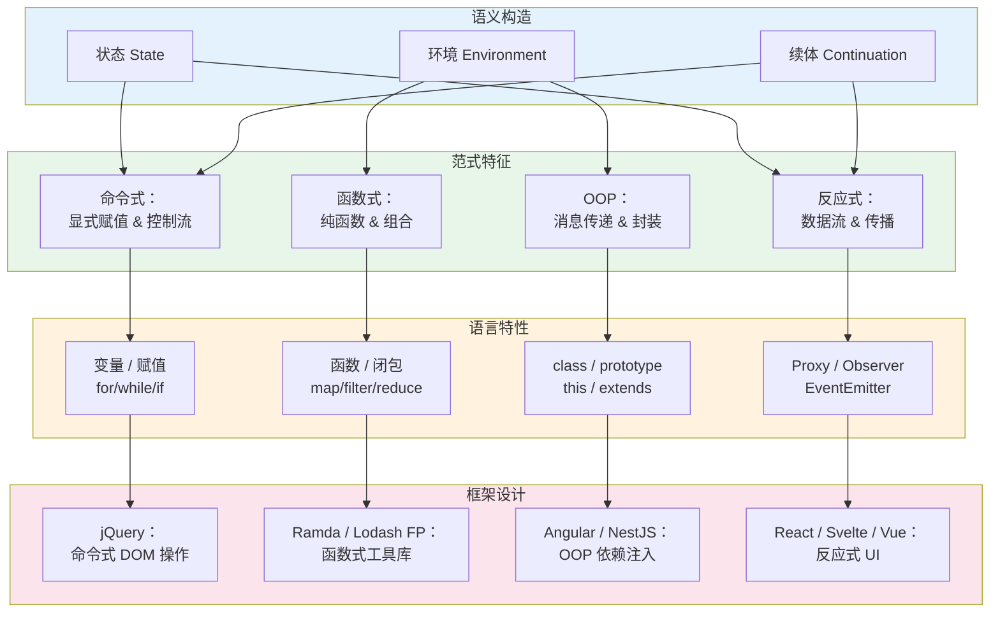
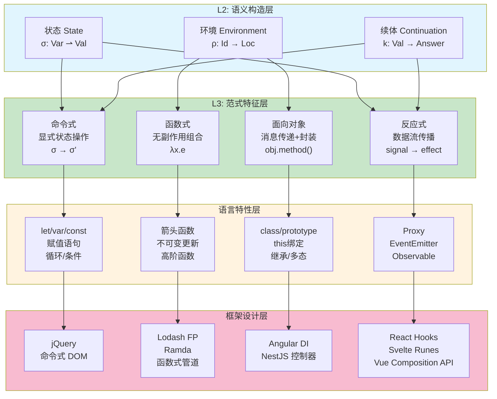
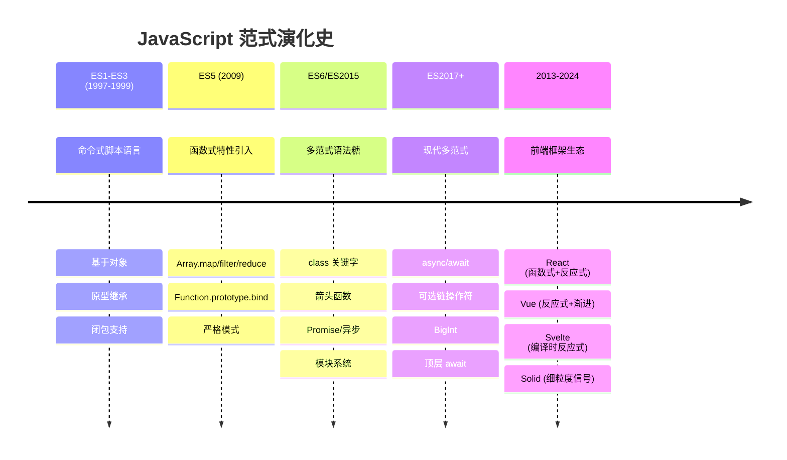
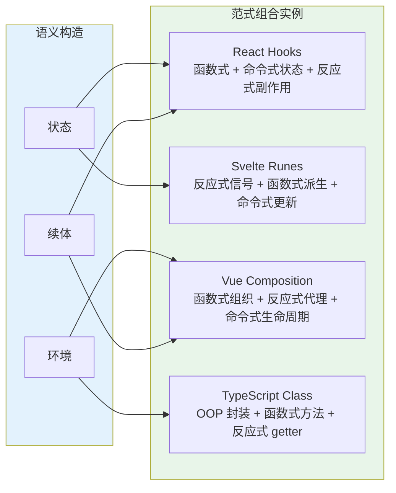

# L2→L3：语言特性如何孕育范式

## 引言

如果说计算理论（L1）告诉我们「什么是可计算的」，那么编程语言（L2）则在探索「如何表达计算」。然而，语言特性本身并非中性的构造工具——每一种语法糖、每一个语义规则，都在暗中塑造着程序员的思维方式和代码的组织形态。这些被语言特性所「偏爱」的思维方式，经过历史的沉淀和社区的放大，最终凝结为**编程范式**（Programming Paradigm）。

本章作为「层次关联总论」的第三篇，将深入语言语义的核心构造——**状态**（State）、**环境**（Environment）、**续体**（Continuation）——揭示命令式、函数式、面向对象与反应式四大范式如何从这些基础语义元素中「生长」出来。我们将看到，JavaScript 从一门简单的脚本语言演化为现代的多范式巨兽，TypeScript 的类型系统如何同时支持结构化的 OOP 与代数数据类型，以及 React Hooks 与 Svelte Runes 如何在函数式的表象下混合命令式与反应式的语义。

---

## 理论严格表述

### 1. 语义构造的元理论：状态、环境与续体

编程语言的**指称语义**（Denotational Semantics）和**操作语义**（Operational Semantics）通常基于三个核心构造：状态、环境和续体。理解这三者，是理解范式本质的钥匙。

#### 1.1 状态（State）：计算的存储面

**状态**是程序执行过程中存储位置的值映射。形式化地，状态 $\sigma$ 是从变量名（或存储地址）到值的偏函数：

$$
\sigma: \text{Var} \rightharpoonup \text{Val}
$$

命令式语言的核心特征就是**显式的状态操作**：

- 赋值语句 $\sigma[x \mapsto v]$ 修改状态
- 顺序执行 $S_1; S_2$ 是状态的顺序转换
- 循环是状态的迭代转换

从范畴论视角，状态转换可以表示为**Kleisli 箭头**：

$$
\sigma \xrightarrow{f} \sigma'
$$

其中 $f$ 是一个可能产生副作用、可能不终止的计算。

#### 1.2 环境（Environment）：作用域与绑定的数学

**环境** $\rho$ 是标识符到存储位置的映射，解决了命名与存储的分离：

$$
\rho: \text{Id} \to \text{Loc}
$$

状态与环境的关系：

- 环境回答「变量名 $x$ 在哪里？」
- 状态回答「那个位置的当前值是什么？」

**词法作用域**（Lexical Scoping）意味着环境的结构由程序的语法结构（而非运行时调用栈）决定。**闭包**（Closure）是函数与其定义环境的配对 $(\lambda x.e, \rho)$，它使得函数可以在定义处之外的环境中正确解析自由变量。

#### 1.3 续体（Continuation）：控制流的显式化

**续体** $k$ 表示「程序剩余部分」的计算抽象。如果当前表达式 $e$ 的值将用于更大的上下文 $C[e]$，则续体是函数 $k(v) = C[v]$。

在标准语义中，续体是隐式的（由调用栈维护）。**Continuation-Passing Style**（CPS）将续体显式化为函数的额外参数：

```
直接风格:  f(x) = x + 1
CPS 风格:  f(x, k) = k(x + 1)
```

续体的代数结构：

- **恒等续体**（identity continuation）：$k_{\text{id}}(v) = v$
- **续体组合**：$(k_1 \circ k_2)(v) = k_2(k_1(v))$

> **核心洞察**：状态、环境、续体是语义学的「原子」。不同的范式选择暴露或隐藏这些原子，从而塑造了完全不同的编程世界观。

### 2. 命令式范式：显式状态操作

#### 2.1 计算模型

命令式编程（Imperative Programming）的核心抽象是**冯·诺依曼架构**的直接映射：

$$
\text{程序} = \text{状态} \xrightarrow{\text{指令序列}} \text{新状态}
$$

其语义特征包括：

- **存储单元**（变量）作为基本抽象
- **赋值**作为基本操作
- **控制流**（顺序、选择、循环）组织指令
- **副作用**（I/O、全局状态修改）是常态

#### 2.2 结构化编程与 Böhm-Jacopini 定理

**Böhm-Jacopini 定理**（1966）是命令式范式的基础性结果：

> 任何可计算函数都可以由仅包含三种控制结构的程序计算：
>
> - 顺序（Sequence）
> - 选择（Selection，如 `if-then-else`）
> - 迭代（Iteration，如 `while` 循环）

这一定理从理论上证明了「goto 是有害的」（Dijkstra, 1968）——我们不需要无限制的跳转，结构化的控制流已足够表达任何算法。

#### 2.3 从内存模型到并发问题

命令式范式的最大挑战在于**共享可变状态**（Shared Mutable State）。当多个执行线程可以读写同一内存位置时，程序的行为取决于不可控的调度顺序，导致：

- **竞态条件**（Race Conditions）
- **死锁**（Deadlocks）
- **内存模型复杂性**（Memory Model Complexity）

### 3. 函数式范式：无副作用与高阶抽象

#### 3.1 λ演算作为计算基础

函数式编程将 λ演算作为核心计算模型：

- **表达式**而非**语句**
- **引用透明**（Referential Transparency）：同一表达式总是求值为同一值
- **无副作用**：函数不修改外部状态
- **高阶函数**：函数作为参数和返回值

#### 3.2 类型化的函数式编程：ML 传统

**Hindley-Milner 类型系统**（Milner, 1978）为函数式语言提供了强大的类型推断：

```
let map f xs = match xs with
  | [] -> []
  | x::xs' -> f x :: map f xs'

(* 推断类型: ('a -> 'b) -> 'a list -> 'b list *)
```

关键特性：

- **参数多态**（Parametric Polymorphism）：`map` 函数适用于任何类型
- **代数数据类型**（ADT）：通过 `type`/`data` 定义归纳类型
- **模式匹配**：对数据结构进行结构化解构

#### 3.3 惰性求值与严格求值

**惰性求值**（Lazy Evaluation）延迟计算直到结果绝对需要。Haskell 采用惰性求值作为默认语义：

```haskell
-- Haskell: 无限列表
nats = [1..]
take 5 nats  -- [1, 2, 3, 4, 5]，nats 的其余部分永不计算
```

**严格求值**（Strict Evaluation）在参数传递前求值。ML 系列语言采用严格求值。

从语义角度，惰性求值对应于**调用名**（Call-by-name）加上**记忆化**（memoization），而严格求值对应于**调用值**（Call-by-value）。

#### 3.4 单子与效应系统

**单子**（Monad）是函数式语言中管理副作用的数学结构。一个单子由三部分组成：

- 类型构造子 $M: \text{Type} \to \text{Type}$
- `return`/`unit`: $A \to M(A)$
- `bind`/`flatMap`: $M(A) \to (A \to M(B)) \to M(B)$

满足单子律（结合律和单位律）。常见的单子实例：

| 单子 | 效应 | JavaScript 对应 |
|-----|------|---------------|
| Maybe / Option | 可失败计算 | `null`/`undefined` 检查 |
| List | 非确定性 | 数组运算 |
| State | 状态传递 | `reduce` 累积器 |
| IO | 输入/输出 | `Promise`、回调 |
| Reader | 环境读取 | 闭包捕获配置 |
| Writer | 日志累积 | 副作用日志 |

### 4. 面向对象范式：消息传递与封装

#### 4.1 从 Simula 到 Smalltalk：两种 OOP 传统

面向对象编程存在两个理论根源：

**Simula / C++ / Java 传统**（基于类的 OOP）：

- 对象是类的实例
- 类定义了状态（字段）和行为（方法）的模板
- 继承是代码复用的主要机制
- 类型系统基于**名义类型**（Nominal Typing）

**Smalltalk / Self / JavaScript 传统**（基于原型的 OOP）：

- 对象是自治的实体
- 对象通过**消息传递**（Message Passing）交互
- 委托（Delegation）而非继承是主要复用机制
- 类型系统基于**鸭子类型**（Duck Typing）或**结构类型**（Structural Typing）

#### 4.2 对象作为闭包

从语义学角度，**对象可以看作是一组闭包的集合**。方法调用 $o.m(a)$ 等价于从对象 $o$ 的环境中查找名为 `m` 的闭包并应用参数 $a$：

```javascript
// 对象作为闭包集合
const counter = (function() {
  let state = 0; // 私有状态（被闭包捕获）
  return {
    inc: () => ++state,
    dec: () => --state,
    get: () => state
  };
})();
```

#### 4.3 子类型多态与 Liskov 替换原则

**子类型**（Subtyping）关系 $A <: B$ 意味着任何需要 $B$ 的地方都可以用 $A$ 替代。**Liskov 替换原则**（Liskov, 1987）是子类型语义的核心约束：

> 如果 $A <: B$，则 $A$ 的方法必须满足 $B$ 的方法契约（前置条件更弱、后置条件更强、不变式保持）。

这对应于范畴论中的**行为兼容性**（Behavioral Compatibility）概念。

### 5. 反应式范式：数据流与传播

#### 5.1 反应式编程的计算模型

反应式编程（Reactive Programming）将**数据流**（Data Flow）和**变化传播**（Change Propagation）作为核心抽象。

形式化地，一个反应式系统可以建模为**有向图** $G = (V, E)$：

- 节点 $V$ 表示计算单元（信号、流、单元格）
- 边 $E$ 表示数据依赖关系
- 当源节点变化时，变化沿边传播到所有依赖节点

#### 5.2 推模型与拉模型

**推模型**（Push-based）：数据变化时主动通知下游。适用于事件流、用户交互。

**拉模型**（Pull-based）：下游需要时向上游请求数据。适用于惰性计算、大数据处理。

**混合模型**：现代框架通常结合两者——推模型处理用户输入，拉模型处理派生状态。

#### 5.3 函数式反应式编程（FRP）

**FRP**（Functional Reactive Programming）将反应式语义与函数式编程结合：

- **行为**（Behaviors）：时间连续的值 $B(t) \in \text{Val}$
- **事件**（Events）：时间离散的值序列 $E = [(t_1, v_1), (t_2, v_2), ...]$

经典 FRP（如 Fran、Yampa）满足**因果律**（Causality）：输出的当前值只依赖于输入的过去和当前值。

### 6. 多范式语言：语义构造的组合

#### 6.1 多范式的设计哲学

Bjarne Stroustrup（C++ 创始人）的著名论断：

> 「支持一种范式，你就限制了程序员能表达什么；支持多种范式，你让程序员选择最适合问题的工具。」

多范式语言的核心挑战是**语义一致性**：不同范式的构造如何在同一语言中和平共存？

#### 6.2 语义构造 → 范式的映射矩阵

| 语义构造 | 命令式 | 函数式 | OOP | 反应式 |
|---------|-------|-------|-----|-------|
| 状态 $\sigma$ | **显式操作** | **避免/隔离** | **封装为字段** | **信号/单元格** |
| 环境 $\rho$ | 栈帧 | 闭包 | 对象/类 | 组件上下文 |
| 续体 $k$ | 控制流语句 | CPS/协程 | 异常/委托 | 异步流 |
| 组合方式 | 顺序 | 函数复合 | 继承/组合 | 数据流图 |
| 抽象单元 | 过程 | 纯函数 | 对象/类 | 信号/流 |
| 时间模型 | 隐式步进 | 无时间 | 方法调用 | 显式事件 |

#### 6.3 范式选择的计算本质

范式选择不是风格偏好，而是**问题本质与计算模型的匹配**：

- **数据转换流水线** → 函数式（无副作用、可组合）
- **状态机 / 交互系统** → 命令式或 OOP（显式状态管理）
- **实时数据更新 UI** → 反应式（自动传播）
- **并发 / 分布式系统** → 函数式或 Actor 模型（避免共享状态）

---

## 工程实践映射

### 1. JavaScript 的范式演化：从命令式到多范式

JavaScript 诞生之初是一门简单的命令式脚本语言（ES1-ES3），经历了深刻的范式扩展：

#### 1.1 ES5：函数式原型的奠基

```javascript
// ES5：高阶函数与函数式模式
var numbers = [1, 2, 3, 4, 5];

var doubled = numbers.map(function(x) { return x * 2; });
var sum = numbers.reduce(function(acc, x) { return acc + x; }, 0);
var evens = numbers.filter(function(x) { return x % 2 === 0; });

// 闭包实现「模块模式」
var myModule = (function() {
  var privateVar = 0;
  return {
    increment: function() { return ++privateVar; },
    get: function() { return privateVar; }
  };
})();
```

ES5 的 `Array.prototype.map`/`filter`/`reduce` 引入了函数式风格，但受限于冗长的 `function` 语法和缺乏不可变数据结构的语法支持。

#### 1.2 ES6+：多范式的语法升级

```javascript
// 箭头函数：更简洁的函数式表达
const compose = (...fns) => x => fns.reduceRight((v, f) => f(v), x);
const pipe = (...fns) => x => fns.reduce((v, f) => f(v), x);

// 类语法：OOP 的语法糖（底层仍是原型）
class Rectangle {
  constructor(width, height) {
    this.width = width;
    this.height = height;
  }
  get area() { return this.width * this.height; }
}

// Proxy：元编程与反应式的基础
const reactive = (target) => new Proxy(target, {
  set(obj, prop, value) {
    obj[prop] = value;
    console.log(`${String(prop)} changed to ${value}`);
    return true;
  }
});

// 迭代器/生成器：惰性序列
function* fibonacci() {
  let [a, b] = [0, 1];
  while (true) {
    yield a;
    [a, b] = [b, a + b];
  }
}
```

#### 1.3 现代 JS 的范式光谱

现代 JavaScript 程序员在同一代码库中自由切换范式：

```javascript
// 文件：dataProcessor.js
// 函数式数据处理管道
const processUsers = pipe(
  filter(user => user.isActive),
  map(user => ({ ...user, displayName: `${user.firstName} ${user.lastName}` })),
  sortBy('lastLogin'),
  take(10)
);

// 文件：UserService.js
// OOP 风格的领域对象
class UserService {
  constructor(apiClient) {
    this.apiClient = apiClient;
  }

  async fetchActiveUsers() {
    const users = await this.apiClient.get('/users');
    return processUsers(users); // 调用函数式管道
  }
}

// 文件：app.js
// 命令式初始化 + 反应式事件处理
const service = new UserService(new ApiClient());
document.getElementById('refresh').addEventListener('click', async () => {
  const users = await service.fetchActiveUsers();
  renderUserList(users); // 命令式 DOM 操作
});
```

### 2. TypeScript 的类型系统：多范式的类型支持

TypeScript 的类型系统是**结构性**（structural）而非**名义性**（nominal）的，这使其能够优雅地支持多种范式。

#### 2.1 接口：结构性 OOP

```typescript
// 接口定义「形状」—— 结构类型系统的核心
interface Drawable {
  draw(ctx: CanvasRenderingContext2D): void;
  readonly bounds: BoundingBox;
}

// 任何具有 draw 和 bounds 属性的对象都满足接口
// 不需要显式声明 implements
const circle = {
  draw(ctx) { /* ... */ },
  bounds: { x: 0, y: 0, w: 100, h: 100 },
  radius: 50 // 额外属性不影响结构兼容
};

function render(items: Drawable[]) {
  items.forEach(item => item.draw(context));
}

render([circle]); // OK，结构兼容
```

这种**鸭子类型**（Duck Typing）的静态版本，对应于逻辑上的**子类型**关系：如果 $A$ 的结构包含 $B$ 的所有必需属性，则 $A <: B$。

#### 2.2 类型别名：函数式代数数据类型

```typescript
// 代数数据类型（ADT）的 TypeScript 实现
// 使用 discriminated union（可辨识联合）

type Shape =
  | { kind: 'circle'; radius: number; center: Point }
  | { kind: 'rectangle'; width: number; height: number; topLeft: Point }
  | { kind: 'polygon'; points: Point[] };

// 穷举模式匹配（通过 switch）
function area(shape: Shape): number {
  switch (shape.kind) {
    case 'circle':
      return Math.PI * shape.radius ** 2;
    case 'rectangle':
      return shape.width * shape.height;
    case 'polygon':
      return polygonArea(shape.points);
    default:
      // 如果新增 Shape 变体而忘记处理，这里会类型报错
      const _exhaustive: never = shape;
      return _exhaustive;
  }
}
```

这里 TypeScript 的类型别名实现了**和类型**（Sum Type，`|`），而接口实现了**积类型**（Product Type，`{a: A, b: B}`）。完整的 ADT 支持使 TS 能够表达函数式语言中的核心抽象。

#### 2.3 条件类型与类型级编程

```typescript
// 类型级条件运算 —— 对应逻辑上的 if-then-else
type IsString<T> = T extends string ? true : false;

// 类型级映射 —— 对应函子
type Nullable<T> = { [K in keyof T]: T[K] | null };

// 递归类型 —— 对应不动点
type DeepReadonly<T> = T extends object
  ? { readonly [K in keyof T]: DeepReadonly<T[K]> }
  : T;

// 模板字面量类型 —— 对应正则语言
type EventName<T extends string> = `on${Capitalize<T>}`;
// EventName<'click'> = 'onClick'
```

这些类型级特性使 TypeScript 的类型系统接近**图灵完备**，允许在类型层面进行复杂的元编程。

#### 2.4 名义类型的模拟

虽然 TS 默认是结构类型，但可以通过**品牌类型**（Branded Types）模拟名义子类型：

```typescript
// 使用交叉类型 + 唯一符号模拟名义类型
type UserId = string & { readonly __brand: unique symbol };
type OrderId = string & { readonly __brand: unique symbol };

function createUserId(id: string): UserId {
  return id as UserId;
}

function createOrderId(id: string): OrderId {
  return id as OrderId;
}

// 现在 UserId 和 OrderId 在类型上不可互换
function getUser(id: UserId) { /* ... */ }
getUser(createOrderId('123')); // 类型错误！
```

### 3. Svelte Runes：反应式语义的形式化引入

Svelte 5 引入的 **Runes**（`$state`、`$derived`、`$effect`）代表了反应式语义在 JavaScript 中的显式形式化。

#### 3.1 从编译时魔法到显式信号

```svelte
<!-- Svelte 4：编译时反应式（隐式） -->
<script>
  let count = 0; // 编译器自动插入反应式追踪
  $: doubled = count * 2; // 编译时推导依赖
</script>

<!-- Svelte 5：Runes 显式反应式 -->
<script>
  let count = $state(0);           // 显式声明状态信号
  let doubled = $derived(count * 2); // 显式声明派生信号

  $effect(() => {                  // 显式声明副作用
    console.log('count changed:', count);
  });
</script>
```

#### 3.2 Runes 的语义构造映射

| Runes | 语义构造 | 对应范式 | 数学抽象 |
|-------|---------|---------|---------|
| `$state()` | 状态 $\sigma$ | 命令式/反应式 | 可变存储单元 |
| `$derived()` | 纯函数依赖 | 函数式 | 图上的推导节点 |
| `$effect()` | 续体/副作用 | 命令式 | 变化传播的回调 |
| `$props()` | 环境 $\rho$ | OOP/组件 | 组件接口契约 |

#### 3.3 细粒度反应式的图结构

Svelte 5 的 Runes 在运行时维护一个**依赖图**（Dependency Graph）：

```javascript
// 概念性的内部实现
const stateGraph = {
  nodes: new Map([
    ['count', { type: 'state', value: 0, subscribers: new Set(['doubled', 'effect1']) }],
    ['doubled', { type: 'derived', fn: () => count * 2, subscribers: new Set() }],
    ['effect1', { type: 'effect', fn: () => console.log(count), subscribers: new Set() }]
  ]),
  edges: [
    { from: 'count', to: 'doubled' },
    { from: 'count', to: 'effect1' }
  ]
};
```

当 `count` 变化时，图按**拓扑序**传播变化，确保派生值在副作用执行前更新。这与理论上的**数据流图**（Data Flow Graph）模型同构。

### 4. React Hooks：函数式与命令式的混合

React Hooks 是编程范式混合的经典案例：在函数组件的表象下，混合了函数式、命令式和反应式的语义。

#### 4.1 Hooks 的语义分析

```javascript
function Counter() {
  // useState：在函数式组件中引入命令式状态
  // 状态存储在闭包外的「 fiber 节点」中
  const [count, setCount] = useState(0);

  // useEffect：引入副作用（命令式语义）
  // 依赖数组控制执行时机（反应式语义）
  useEffect(() => {
    document.title = `Count: ${count}`;
  }, [count]);

  // useMemo：函数式优化（记忆化纯计算）
  const doubled = useMemo(() => count * 2, [count]);

  // 渲染本身是纯函数（函数式语义）
  return <button onClick={() => setCount(c => c + 1)}>{doubled}</button>;
}
```

#### 4.2 Hooks 规则的理论根源

Hooks 的两条核心规则：

1. **只在最顶层调用 Hooks** —— 保证 Hooks 调用的顺序固定，从而维护一个隐式的**索引状态**
2. **只在 React 函数中调用 Hooks** —— 保证状态与组件生命周期的绑定

从理论角度，Hooks 的索引机制实现了一个**隐式的状态 monad**：

```typescript
// Hooks 的概念性 monad 类型
type HookState<S, A> = (initialState: S) => [A, (update: S | ((prev: S) => S)) => void];

// useState 的类型签名（简化）
function useState<S>(initial: S): HookState<S, S>;

// 组件渲染对应 monadic 绑定
// render = useState(0).bind(count =>
//   useEffect(...).bind(_ =>
//     JSX.Element))
```

#### 4.3 Hooks 与代数效应（Algebraic Effects）

Hooks 的设计深受**代数效应**（Algebraic Effects）理论影响。代数效应是一种结构化异常/控制流的机制，允许函数「抛出」效应并由调用栈中的处理程序捕获。

React 的 `useEffect` 可以看作一种**退化的代数效应**：组件「抛出」副作用需求，React 运行时作为处理程序在合适的时机执行。

### 5. 纯函数式 vs 多范式：工程 trade-offs

#### 5.1 类型系统的对比

| 维度 | Haskell（纯函数式） | TypeScript（多范式） |
|-----|-------------------|-------------------|
| 类型推断 | Hindley-Milner，全局推断 | 基于约束的局部推断 |
| 副作用追踪 | `IO` Monad 显式标记 | 无显式标记（任意函数可能有副作用） |
| ADT 支持 | 原生 `data` 声明 | `type` + discriminated union |
| 类型类 | `class`/`instance` 多态 | 无（可用接口 + 条件类型模拟） |
| 编译时保证 | 强（运行时类型擦除） | 中等（类型擦除，仅编译时检查） |
| 学习曲线 | 陡峭 | 渐进（可从 JS 平滑过渡） |

#### 5.2 工程实践的权衡

**纯函数式的优势**：

- **可测试性**：纯函数的输入输出完全确定
- **并发安全**：无共享可变状态，天然适合并行
- **可组合性**：函数复合是数学上的结合运算
- **可推理性**：等式推理（Equational Reasoning）有效

**纯函数式的挑战**：

- **性能开销**：惰性求值和持久数据结构的常数因子
- **学习门槛**：单子、函子、 applicative 等抽象概念
- **生态系统**：某些领域库不如命令式语言丰富
- **副作用管理**：即使简单的 `console.log` 也需要 `IO` monad

**多范式的优势**：

- **灵活性**：为问题选择最合适的抽象
- **生态兼容**：与现有命令式/OOP 代码库集成
- **团队友好**：不同背景的开发者可以找到熟悉的模式
- **渐进采用**：可以逐步引入函数式实践

**多范式的挑战**：

- **一致性风险**：混合范式可能导致代码风格不统一
- **复杂度叠加**：需要理解多种抽象模型
- **调试困难**：隐式状态流（如 React 的闭包陷阱）难以追踪

```typescript
// React 闭包陷阱：多范式混合的典型痛点
function Timer() {
  const [count, setCount] = useState(0);

  useEffect(() => {
    const interval = setInterval(() => {
      // 陷阱：这里捕获的是旧的 count 值！
      console.log(count);
      setCount(count + 1); // 永远设置为 1
    }, 1000);
    return () => clearInterval(interval);
  }, []); // 空依赖数组意味着只执行一次

  // 修复：使用函数式更新
  // setCount(c => c + 1);

  return <div>{count}</div>;
}
```

### 6. 框架设计中的范式映射实例



---

## Mermaid 图表

### 图1：语义构造到范式特征到语言特性到框架设计的层次映射



### 图2：JavaScript 范式演化的历史时间线



### 图3：多范式语言的语义构造组合矩阵



---

## 理论要点总结

1. **状态、环境、续体是语义学的三大原子构造**：命令式范式显式操作状态，函数式范式隔离状态（通过参数传递），OOP 封装状态（通过对象字段），反应式范式将状态建模为信号图。范式选择的本质是「如何处理这三大构造」的架构决策。

2. **JavaScript 的范式演化是工程需求驱动的语言扩展**：从 ES3 的命令式原型编程，到 ES5 的函数式工具引入，再到 ES6+ 的 `class`、`Promise`、模块系统，JS 逐步积累了多范式表达能力。这一演化不是设计出来的，而是社区实践与标准化过程共同塑造的。

3. **TypeScript 的结构类型系统天然支持多范式**：接口实现名义 OOP 的结构等价，类型别名实现函数式 ADT 的和/积类型，条件类型和模板字面量类型支持类型级元编程。TS 没有强迫开发者选择单一范式，而是提供了表达多种范式的类型工具。

4. **现代前端框架是范式混合的实验室**：React Hooks 在函数组件中混合命令式状态与反应式副作用；Svelte Runes 将反应式语义显式化为语言层面的信号；Vue Composition API 用函数式 API 组织反应式逻辑。这些设计的成功与争议，都根植于范式混合的固有价值与风险。

5. **纯函数式与多范式的 trade-off 是工程决策而非价值判断**：Haskell 的纯函数式在可推理性和并发安全上具有理论优势，但学习曲线和生态限制是现实约束。TypeScript/JavaScript 的多范式策略牺牲了某些理论保证，换取了灵活性和生态兼容性。

6. **反应式编程将时间维度显式引入程序语义**：传统的命令式和函数式编程默认「时间」是隐式的执行顺序，而反应式编程通过数据流图显式建模依赖关系与变化传播。这与 FRP 理论中的 Behaviors（连续时间）和 Events（离散时间）概念一脉相承。

---

## 参考资源

### 经典文献

1. **Stroustrup, B.** (1997). *The C++ Programming Language*（3rd ed.）. Addison-Wesley. 第2章「抽象机制」系统阐述了多范式设计的哲学，是理解 C++ 如何整合命令式、OOP 和泛型编程的经典参考。

2. **Wadler, P.** (1989). "Theorems for free!" *Proceedings of the Fourth International Conference on Functional Programming Languages and Computer Architecture*, 347-359. 展示了参数多态如何产生「免费定理」，是函数式编程类型力量的经典展示。

3. **Wadler, P.** (1995). "Monads for functional programming." *Advanced Functional Programming*, 24-52. 将单子从范畴论引入编程实践的奠基论文，以简洁方式解释了 IO、状态、异常等效应的单子封装。

4. **Van Roy, P., & Haridi, S.** (2004). *Concepts, Techniques, and Models of Computer Programming*. MIT Press. 可能是对编程范式最全面的学术论述，将数十种编程模型按照「计算模型」维度进行系统分类，第2-4章尤为精彩。

5. **Abelson, H., & Sussman, G. J.** (1996). *Structure and Interpretation of Computer Programs*（2nd ed.）. MIT Press. 通过 Scheme 语言展示了过程抽象、数据抽象、状态、流和元语言抽象的深层统一，第3章「模块化、对象与状态」与本章主题直接相关。

6. **Liskov, B. H., & Wing, J. M.** (1994). "A behavioral notion of subtyping." *ACM Transactions on Programming Languages and Systems*, 16(6), 1811-1841. Liskov 替换原则的严格形式化论文。

7. **Elliott, C., & Hudak, P.** (1997). "Functional reactive animation." *Proceedings of the Second ACM SIGPLAN International Conference on Functional Programming*, 263-273. FRP 的经典原始论文，将 Behaviors 和 Events 作为 first-class 抽象引入函数式编程。

### 在线资源

- [React Hooks 设计提案](https://github.com/reactjs/rfcs/pull/68) — React 团队关于 Hooks 设计的原始 RFC，包含代数效应动机的详细说明
- [Svelte 5 Runes 文档](https://svelte.dev/blog/runes) — Svelte 官方关于 Runes 设计哲学的博客文章
- [To Mock a Mockingbird](https://www.amazon.com/Mock-Mockingbird-Raymond-Smullyan/dp/0192801422) — Raymond Smullyan 以谜题形式介绍组合逻辑和 λ演算的经典读物

### 相关层次

- **上一章**：[L1→L2：计算理论到编程语言](02-computation-to-language.md) — 探讨形式语言、自动机与复杂度理论如何塑造编程语言的语法与语义设计
- **下一章**（待续）：L3→L4：范式到架构与系统 — 分析编程范式如何影响软件架构模式与系统设计决策
- **前置知识**：[编程范式分类](/programming-paradigms/)

---

*本文档属于「理论层次总论」专题，遵循双轨并行写作规范：理论严格表述与工程实践映射相结合。*
