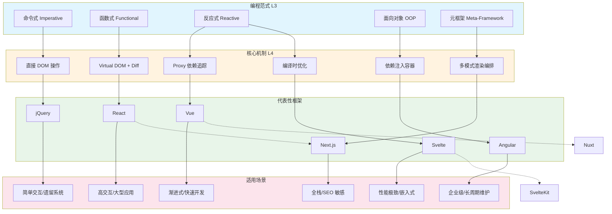
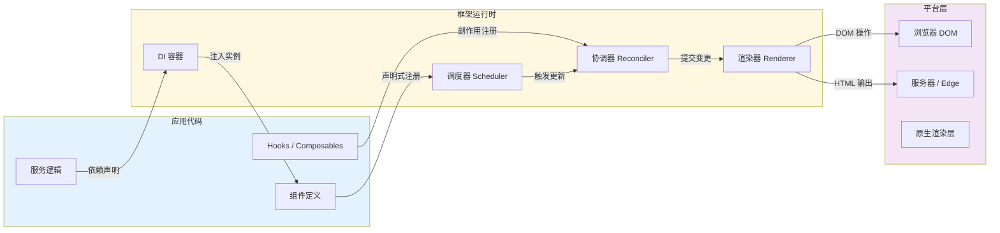

# L3→L4：范式如何决定框架形态

## 引言

编程范式（Programming Paradigm）并非抽象的语言学游戏，而是一套关于「如何组织计算」的根本性约定。当这些约定从语言层面（L3）上升到框架层面（L4）时，它们不再仅仅影响单个函数的写法，而是决定了整个应用程序的架构模式、状态管理方式、组件通信机制以及渲染策略。理解范式如何映射到框架形态，是前端工程师从「使用工具」跃迁到「理解工具」的关键分水岭。

现代前端框架的多样性——React 的声明式函数组件、Vue 的响应式代理系统、Svelte 的编译时优化、Angular 的依赖注入容器——表面上看起来是 API 设计的差异，深层却是不同编程范式在浏览器运行时中的具体实现。本文将建立一条从范式理论到框架工程的完整映射链条，揭示「框架选型 = 范式偏好 + 团队认知模型」这一核心命题。

---

## 理论严格表述

### 2.1 编程范式的定义与分类

编程范式是一组关于计算的基本假设，它规定了：

- **状态如何表示**：可变状态 vs 不可变状态
- **计算如何组合**：顺序执行 vs 函数组合 vs 数据流图
- **控制流如何管理**：显式控制 vs 隐式传播 vs 自动调度
- **抽象如何构建**：过程抽象 vs 数据抽象 vs 行为抽象

在前端工程语境下，五大核心范式构成了框架设计的基础光谱：

| 范式 | 核心隐喻 | 状态模型 | 控制流特征 | 代表性框架 |
|------|---------|---------|-----------|-----------|
| 命令式（Imperative） | 「如何做」的指令序列 | 可变，就地修改 | 显式、顺序、程序员主导 | jQuery, DOM API |
| 函数式（Functional） | 「是什么」的数学映射 | 不可变，值传递 | 纯函数组合、无副作用 | React, Elm |
| 反应式（Reactive） | 数据流与依赖图 | 可变但自动追踪 | 隐式传播、推模型 | Vue, Svelte, MobX |
| 面向对象（OOP） | 对象协作与消息传递 | 封装在对象内部 | 消息分发、多态路由 | Angular, Ember |
| 元框架（Meta-Framework） | 范式组合与运行时编排 | 混合模型 | 多范式协调、控制反转 | Next.js, Nuxt, Astro |

### 2.2 命令式范式：直接操纵的计算模型

命令式编程的核心在于**显式状态变更**。程序员通过一系列指令直接修改程序状态，每条语句的执行都产生副作用。在浏览器环境中，命令式范式的最纯粹体现是 DOM API：

```javascript
const element = document.getElementById('app');
element.textContent = 'Hello';
element.style.color = 'red';
element.addEventListener('click', handler);
```

每一条语句都是对浏览器内部状态的直接 mutation。jQuery 虽然在 API 层面进行了封装，但其本质仍然是命令式的：

```javascript
$('#app').text('Hello').css('color', 'red').on('click', handler);
```

这种范式的**控制流完全由程序员显式指定**，框架（或库）仅提供便捷的工具函数，不提供任何自动化的状态同步或渲染调度机制。

### 2.3 函数式范式：纯函数与不可变状态

函数式编程将计算视为**数学函数的求值**。其两大支柱是：

1. **纯函数（Pure Function）**：相同输入永远产生相同输出，无副作用
2. **不可变数据（Immutable Data）**：状态一旦创建便不可修改，变更通过产生新值实现

React 的组件模型是函数式范式在前端领域最成功的工程实现。React 组件本质上是一个纯函数：

```jsx
function Greeting({ name }) {
  return <h1>Hello, {name}</h1>;
}
```

输入是 `props`，输出是虚拟 DOM 树。在理想情况下，相同的 `props` 永远产生相同的渲染输出。React 通过「单向数据流」强制保持这种函数式语义：`props` 自上而下传递，`state` 通过 `useState` 提供不可变的快照。

函数式范式对框架形态的决定性影响体现在 Virtual DOM 的设计上。由于每次状态变更都需要产生新的 UI 描述，直接操作真实 DOM 的成本过高。Virtual DOM 作为一种「轻量级的、可 diff 的 UI 描述层」，是函数式不可变语义在工程上的自然产物——它使得「重新计算整个 UI」在性能上变得可行。

### 2.4 反应式范式：依赖追踪与自动传播

反应式编程（Reactive Programming）将程序建模为**数据流图（Dataflow Graph）**。当数据源发生变化时，变化沿着依赖关系自动传播到所有订阅者。这一范式的核心抽象是「信号（Signal）」或「可观察对象（Observable）」。

反应式系统的形式化定义包含三个要素：

- **源（Source）**：可变的原子状态单元
- **派生（Derived）**：依赖于其他信号的计算值
- **副作用（Effect）**：依赖于信号的副作用执行单元

Vue 的响应式系统是典型的反应式范式实现。Vue 3 使用 `Proxy` 对对象进行拦截，在属性访问时收集依赖（track），在属性修改时触发更新（trigger）：

```javascript
const state = reactive({ count: 0 });
const doubled = computed(() => state.count * 2);
// 访问 state.count → track 依赖
// 修改 state.count → trigger 所有订阅者
```

这种「自动传播」的机制使得程序员无需显式调用 `render()` 或 `setState()`，框架接管了状态变更到 UI 更新的全部控制流。

### 2.5 面向对象范式：封装、继承与多态

面向对象编程（OOP）将程序组织为相互协作的对象集合，每个对象封装了状态和行为。OOP 的四大特征——封装、继承、多态、抽象——在 Angular 框架中得到了系统性的体现。

Angular 的核心架构决策包括：

- **装饰器（Decorators）**：`@Component`, `@Injectable`, `@NgModule` 等装饰器实现了声明式的元数据编程，是 OOP 中「类元编程」的工程映射
- **依赖注入容器（DI Container）**：通过构造函数声明依赖，由框架在运行时解析和装配对象图，实现了控制反转（Inversion of Control, IoC）
- **服务层（Services）**：通过 `@Injectable` 标记的类封装业务逻辑，支持单例或多例生命周期管理
- **模块化系统（NgModules）**：通过 `imports`, `exports`, `providers`, `declarations` 显式管理模块边界

Angular 的 DI 容器是 OOP 范式中最具理论深度的工程实现。它实现了 Martin Fowler 所描述的依赖注入模式：「将组件的依赖关系从组件内部抽离，由外部容器负责装配」[^1]。

### 2.6 元框架：多范式的组合与编排

元框架（Meta-Framework）并不发明新的范式，而是在更高层次上**组合和编排**已有范式。Next.js、Nuxt、Astro 等框架的核心创新在于：它们允许同一个代码库中并存多种渲染范式，并根据路由、请求特征或构建配置自动选择最优策略。

Next.js 支持的渲染模式包括：

- **CSR（Client-Side Rendering）**：纯函数式组件在浏览器端执行，适用于高交互性页面
- **SSR（Server-Side Rendering）**：组件在服务器端预渲染为 HTML，适用于首屏性能敏感场景
- **SSG（Static Site Generation）**：构建时预渲染为静态 HTML，适用于内容型页面
- **ISR（Incremental Static Regeneration）**：混合 SSG 与 SSR，允许静态页面在运行时增量更新

这种多范式组合要求框架具备强大的「控制反转」能力：程序员编写的是「什么」（React 组件），框架决定的是「何时、何地、如何」执行渲染。正如 Fowler 所言：「控制反转是框架与库的根本区别——库被你的代码调用，框架调用你的代码。」[^1]

---

## 工程实践映射

### 3.1 React 的 Virtual DOM：函数式范式的自然产物

React 的 Virtual DOM 常被误解为「为了快」而发明的一种优化技术。更准确的理解是：**Virtual DOM 是函数式不可变语义在浏览器环境中的必要适配层**。

在纯函数式理想世界中，每次状态变更都应该重新计算整个 UI。但浏览器的 DOM API 是命令式的、有副作用的、且操作成本高昂。Virtual DOM 作为中间层解决了这一矛盾：

1. **不可变快照**：每次渲染产生一棵新的虚拟树（`ReactElement` 树），符合不可变语义
2. **差异计算（Diffing）**：通过比较前后两棵虚拟树，计算出最小的 DOM 操作集合
3. **批量提交（Reconciliation + Commit）**：将差异批量应用到真实 DOM，减少重排和重绘

React 16 引入的 Fiber 架构进一步深化了函数式范式。Fiber 将渲染工作拆分为可中断的单元，允许高优先级更新（如用户输入）插队到低优先级更新（如列表渲染）之前。这种「可中断的函数求值」模型，使得 React 能够在保持函数式语义的同时，实现复杂的调度策略。

工程实践中，React 的函数式范式要求开发者养成不可变数据的习惯：

```javascript
// ❌ 命令式 mutation（破坏纯函数语义）
const newList = items;
newList.push(item);
setItems(newList);

// ✅ 函数式不可变更新
setItems([...items, item]);
```

使用 `useMemo`、`useCallback`、`React.memo` 等 API 是函数式性能优化的工程手段——它们通过记忆化（Memoization）避免不必要的重新计算，是对纯函数「相同输入相同输出」特性的运行时缓存。

### 3.2 Vue 的响应式系统：反应式语义的「自动传播」

Vue 的响应式系统实现了反应式编程中最核心的「自动依赖追踪与变更传播」。与 React 的显式 `setState` 不同，Vue 的状态变更看起来是「自动生效」的：

```vue
<script setup>
import { ref, computed } from 'vue'
const count = ref(0)
const doubled = computed(() => count.value * 2)
// 修改 count → doubled 自动更新 → 依赖的模板自动重新渲染
</script>

<template>
  <button @click="count++">{{ doubled }}</button>
</template>
```

Vue 3 的 `Proxy` 实现机制如下：

1. **拦截（Intercept）**：`new Proxy(target, handlers)` 拦截对象的 `get`、`set`、`deleteProperty` 等操作
2. **依赖收集（Track）**：在 `get` 拦截器中，将当前活跃的副作用（如渲染函数）注册到该属性的依赖集合中
3. **变更触发（Trigger）**：在 `set` 拦截器中，遍历该属性的依赖集合，重新执行所有副作用

这种机制的工程优势在于**隐式与显式的平衡**。开发者无需手动声明依赖关系（如 React 的 `useEffect` 依赖数组），框架通过运行时访问模式自动推断。但这也带来了调试挑战：依赖关系是动态构建的，难以静态分析。

Vue 的 `computed` 实现了惰性求值（Lazy Evaluation）与缓存：只有在其依赖变更后首次被访问时，才会重新计算。这是反应式数据流图中「派生节点」的标准实现模式。

### 3.3 Svelte：将反应式范式「编译掉」

Svelte 采取了与 Vue 和 React 截然不同的工程策略：**将反应式语义从运行时转移到编译时**。

Svelte 编译器会分析组件源码中的赋值语句，自动插入依赖追踪和更新调用的代码。开发者编写的代码看起来几乎是纯 JavaScript：

```svelte
<script>
  let count = 0;
  $: doubled = count * 2;
  function increment() {
    count += 1;
  }
</script>

<button on:click={increment}>
  {doubled}
</button>
```

编译后，这段代码会被转换为包含细粒度订阅机制的 JavaScript。`$: doubled = count * 2` 被编译为在 `count` 变更时自动重新计算的响应式声明。

Svelte 的工程哲学是：**框架应该尽可能在构建时完成工作，运行时只保留必要的最小代码**。这与 React 和 Vue 的「运行时重」策略形成鲜明对比。Svelte 的编译时优化包括：

- **无 Virtual DOM**：直接生成靶向 DOM 操作的指令代码
- **自动作用域样式**：通过哈希类名实现组件级 CSS 隔离
- **反应式语句编译**：将 `$:` 标签（Label Statement）编译为依赖追踪代码

Svelte 5 引入的 Runes（如 `$state`, `$derived`, `$effect`）进一步显式化了反应式语义，解决了之前「魔法赋值」导致的语义不透明问题。

### 3.4 Angular 的依赖注入：OOP IoC 的工程实现

Angular 的依赖注入（DI）容器是前端框架中最接近企业级后端框架（如 Spring、.NET Core）的实现。其核心机制包括：

1. **提供者注册（Providers）**：在模块或组件级别声明可注入的服务
2. **令牌解析（Token Resolution）**：通过类型或注入令牌（`InjectionToken`）标识依赖
3. **注入器层级（Injector Hierarchy）**：形成与组件树平行的注入器树，支持作用域隔离
4. **生命周期管理**：支持单例（`root`）、模块级、组件级等多种生命周期

```typescript
@Injectable({ providedIn: 'root' })
export class UserService {
  constructor(private http: HttpClient) {}
}

@Component({
  selector: 'app-profile',
  template: `...`,
  providers: [UserService] // 组件级作用域
})
export class ProfileComponent {
  constructor(private userService: UserService) {}
}
```

Angular 的 DI 系统实现了完整的控制反转：组件不创建依赖，也不查找依赖，而是**声明依赖，由框架注入**。这种设计使得：

- **单元测试易于 mock**：只需在测试模块中替换 provider
- **模块边界清晰**：依赖关系通过模块系统显式管理
- **延迟加载可行**：模块及其依赖可以按需加载

### 3.5 Next.js：多渲染范式的组合与路由编排

Next.js 作为 React 的元框架，其核心创新在于**将多种渲染范式统一到同一个路由系统中**。在 Next.js 13+ 的 App Router 中，同一棵组件树中可以混合使用不同的渲染模式：

```tsx
// app/page.tsx —— 默认 SSR（Server Component）
import { ProductList } from './ProductList'

export default async function HomePage() {
  const products = await fetch('https://api.example.com/products')
  return <ProductList data={products} />
}

// app/ProductList.tsx —— 客户端交互组件
'use client'
import { useState } from 'react'

export function ProductList({ data }) {
  const [filter, setFilter] = useState('')
  // 客户端状态管理 + 交互
}
```

Next.js 的架构决策体现了元框架的本质：

- **Server Components**：在服务器端执行，可直接访问数据库，不打包到客户端 bundle
- **Client Components**：通过 `'use client'` 指令标记，在浏览器端执行，支持 state 和 effect
- **Streaming SSR**：支持渐进式流式传输，优先渲染加载完成的部分
- **Edge Runtime**：支持在 CDN Edge 节点执行轻量级渲染逻辑

这种「同构但不同责」的架构，使得开发者可以在单一框架内根据页面特征选择最优渲染策略，而无需切换技术栈。

### 3.6 框架选型：范式偏好与团队认知模型

框架选型的决策不应仅基于「流行度」或「性能基准」，而应回归范式层面的匹配分析：

| 团队特征 | 推荐范式 | 适配框架 | 理由 |
|---------|---------|---------|------|
| 偏好显式控制、函数式思维 | 函数式 | React | 纯函数、不可变数据、显式状态管理 |
| 偏好自动同步、声明式模板 | 反应式 | Vue, Svelte | 响应式代理、模板编译、隐式依赖追踪 |
| 企业级团队、强类型背景 | OOP + DI | Angular | 完整的类型系统、DI 容器、模块化架构 |
| 全栈团队、SEO 敏感 | 多范式组合 | Next.js, Nuxt | 灵活的渲染策略、同构架构 |
| 性能极致、打包体积极限 | 编译时反应式 | Svelte, Solid | 无 Virtual DOM、编译时优化 |

Martin Fowler 在《Inversion of Control》中指出：「框架的价值不在于它提供了什么功能，而在于它强制实施了什么架构约束。」[^1] 选择框架本质上是在选择一套架构约束，而这套约束的底层逻辑正是编程范式。

---

## Mermaid 图表

### 图1：五大范式到框架的核心映射矩阵



### 图2：控制反转的层次结构



---

## 理论要点总结

1. **框架是范式的运行时实现**。jQuery 是命令式的、React 是函数式的、Vue 是反应式的、Angular 是 OOP 的——这些不是偶然的市场定位，而是深层范式约束的必然结果。

2. **Virtual DOM 是函数式不可变语义与命令式 DOM API 之间的适配层**。没有函数式范式的「重新计算整个 UI」假设，就不会需要 Virtual DOM 这一中间抽象。

3. **Vue 的响应式系统通过 Proxy 拦截实现了反应式数据流图的自动构建与传播**。`track` 与 `trigger` 是反应式语义在 JavaScript 运行时中的最小完备实现。

4. **Svelte 将反应式范式从运行时「编译掉」**，代表了前端框架架构的另一种极端：用构建时复杂度换取运行时极简。这提示我们「框架」可以存在于编译时、运行时或两者的任意组合。

5. **Angular 的 DI 容器是控制反转原则最完整的工程实现**。它将对象创建、依赖解析和生命周期管理从应用代码中抽离，交由框架统一协调。

6. **元框架的本质是多范式的组合与编排**。Next.js 的 Server/Client Component 边界、多种渲染模式的自动选择，体现了「框架调用你的代码」这一控制反转的最高形态。

7. **框架选型 = 范式偏好 × 团队认知模型 × 场景约束**。脱离范式理解谈框架优劣，容易陷入「性能基准迷信」或「流行度跟风」的误区。

---

## 参考资源

[^1]: Fowler, Martin. "Inversion of Control Containers and the Dependency Injection pattern." *martinfowler.com*, January 2004. <https://martinfowler.com/articles/injection.html> —— 控制反转与依赖注入的奠基性文章，清晰区分了框架与库的本质差异。


---

> **延伸阅读**：
>
> - Meijer, Erik. "Your Mouse is a Database." *ACM Queue*, 2012. —— 从 LINQ/RxJS 视角阐述反应式编程的理论基础。
> - Eisenberg, Richard. "Reactive Programming vs. Reactive Systems." *O'Reilly*, 2016. —— 区分反应式编程（数据流）与反应式系统（弹性架构）的概念边界。
> - 本文属于「理论层次总论」系列的 L3→L4 映射篇，建议配合「L1→L2：类型系统的代数语义」与「L2→L3：编译原理与语言实现」共同阅读，以建立从前端语言层到框架层的完整认知图谱。
