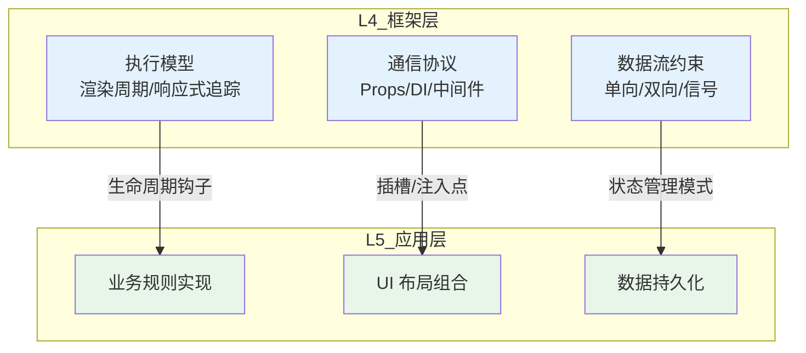
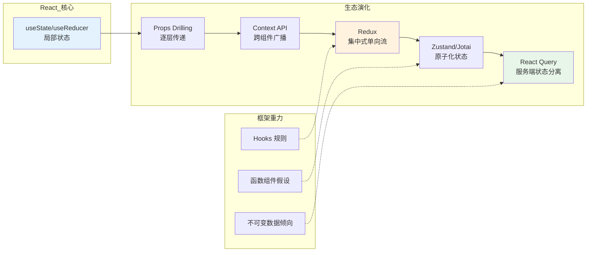
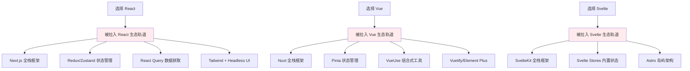

# L4→L5：框架如何约束应用设计

## 引言

在软件架构的层次模型中，L4（框架层）与 L5（应用层）之间的边界往往比表面看起来更为模糊。
开发者常常将框架视为「中立的工具」——一种可以被任意使用的通用基础设施，而应用代码则是在其之上自由生长的业务逻辑。
然而，这一假设在工程实践中几乎从未成立。框架并非中立的容器，而是具有强烈「重力」（Gravity）的引力场：它通过 API 设计、约定优先于配置（Convention over Configuration）的规范、以及隐性的架构风格偏好，深刻地塑造着应用的结构、模块边界与数据流向。

这种约束性并非框架的缺陷，而是其本质属性。
正如建筑师无法在设计摩天大楼时忽视钢结构框架的力学特性，软件工程师也无法在构建应用时完全摆脱底层框架的结构性影响。
理解框架如何约束应用设计，不仅是技术选型的前提，更是架构演进与系统治理的基础能力。

本文将从理论层面建立「框架-应用」约束关系的分析框架，随后将其映射到 Next.js、NestJS、React 生态与 SvelteKit 等具体案例中，最终揭示与框架对抗的架构反模式及其代价。

---

## 理论严格表述

### 1. 框架的「不变性」与应用的「可变性」分离理论

软件系统的演化遵循一条基本张力：框架提供的是相对稳定的「不变性」（Invariants），而应用代码承载的是持续变化的「可变性」（Variability）。这一分离是框架存在的根本理由——如果没有可变性需要被管理，就不需要框架；如果没有不变性作为约束，可变性将迅速导致系统熵增。

**不变性的三重维度**：

1. **执行模型不变性**：框架定义了代码何时、如何被执行。React 的渲染周期（Render Phase → Commit Phase）、Vue 的响应式追踪机制、Angular 的变更检测循环——这些执行模型是不可协商的。应用代码必须按照框架规定的生命周期钩子（Lifecycle Hooks）插入自己的逻辑。

2. **通信协议不变性**：框架定义了模块间通信的契约。React 的 Props 自上而下传递、NestJS 的依赖注入容器管理 Service 实例、Express 的中间件链式处理——这些通信模式构成了应用架构的「语法」。

3. **数据流不变性**：框架对数据流动的方向与方式施加了结构性约束。Redux 的「单向数据流」、MobX 的「透明的函数式响应编程」（TFRP）、Prisma 的「类型安全的数据访问层」——这些不仅仅是库，更是关于「数据应该如何流动」的规范性声明。

**可变性的承载位置**：

应用的可变性主要体现在：业务规则的实现、UI 布局的组合、API 端点的定义、数据库 Schema 的映射。理想情况下，框架的不变性为可变性提供了稳定的边界，使得业务逻辑可以在不破坏系统整体结构的前提下自由演化。然而，当应用的可变性需求突破了框架不变性的边界时，冲突便产生了。

### 2. 钩子与插槽：框架提供的设计约束接口

框架对应用设计的约束并非通过强制性的代码检查（虽然类型系统可以提供部分保障）实现，而是通过「钩子」（Hooks）与「插槽」（Slots）的提供来引导开发者的行为。

**钩子（Hooks）——扩展点作为约束**

钩子是框架预留的回调接口，允许应用代码在框架执行流程的特定节点插入自定义逻辑。表面上看，钩子是「自由度」的授予；实质上，它是「自由度」的限制——开发者只能在框架规定的节点插入逻辑，无法干预框架的核心执行路径。

以 React 的 Hooks API 为例：

```jsx
function useCustomLogic() {
  // 只能在函数组件顶层调用
  const [state, setState] = useState(0);

  // 只能在特定生命周期阶段执行副作用
  useEffect(() => {
    // 副作用逻辑
    return () => {
      // 清理逻辑
    };
  }, [state]);

  return state;
}
```

Hooks 的规则（只在顶层调用、不在循环或条件中调用）看似是技术限制，实则是架构约束：它们强制开发者将副作用逻辑与渲染逻辑分离，将状态管理粒度细化到组件级别。违反这些规则不仅会导致技术错误（如 Hook 调用顺序不一致），更会导致架构层面的混乱（副作用与渲染逻辑混杂）。

**插槽（Slots）——组合点作为约束**

插槽机制允许开发者在框架预定义的「容器」中填充自定义内容。Vue 的 `<slot>` 元素、Web Components 的 Shadow DOM Slot、Angular 的 Content Projection——这些机制表面上提供了布局的灵活性，实质上规定了组件组合的「合法方式」。

```vue
<!-- Vue 3 具名插槽示例 -->
<BaseLayout>
  <template #header>
    <AppHeader />
  </template>
  <template #default>
    <PageContent />
  </template>
  <template #footer>
    <AppFooter />
  </template>
</BaseLayout>
```

在上述代码中，`<BaseLayout>` 组件通过具名插槽强制了页面布局的三段式结构。应用开发者虽然可以自由填充每个插槽的内容，但无法突破「Header-Main-Footer」的整体布局约束。这种约束在大型设计系统（Design System）中尤为重要——它确保了不同页面在结构层面的一致性，同时允许内容层面的差异化。

### 3. 框架对架构风格的隐性强制

框架的选择往往预先决定了应用的架构风格，即使开发者并未意识到这一点。这种「隐性强制」（Implicit Enforcement）通过以下机制实现：

**心智模型引导**：框架的文档、示例代码与社区最佳实践共同构建了一种「正确的做事方式」。React 官方文档推崇「组合优于继承」、函数组件优于类组件，这一倡导虽然不具备技术强制性，但通过社区共识形成了强大的规范压力。

**工具链锁定**：框架配套的 CLI 工具、脚手架与构建配置进一步强化了架构偏好。Next.js 的 `create-next-app` 会生成 App Router 或 Pages Router 的标准目录结构；Vue CLI 的插件系统引导开发者以「插件」的方式扩展功能而非直接修改配置。

**API 设计偏好**：框架核心 API 的设计选择隐性地排斥了某些架构模式。例如：

- **React → Flux/Redux → 单向数据流**：React 的 Props 单向传递机制天然适合与单向数据流架构配合。虽然 React 并不强制使用 Redux，但当应用规模增长时，React 的局部状态管理（`useState`）很快就会显得力不从心，从而「推动」开发者引入 Redux 或 Zustand。

- **Angular → 模块化 → 分层架构**：Angular 的 `NgModule` 系统（尽管在新版中已被 Standalone Components 部分替代）、依赖注入容器与强 TypeScript 集成，天然适合企业级分层架构。Angular 应用的典型结构——`core/`、`shared/`、`features/` 的模块划分——并非偶然，而是框架设计哲学的直接产物。

- **NestJS → DDD → 六边形架构**：NestJS 的 `Module`、`Controller`、`Service`、`Repository` 的目录约定与装饰器语法，几乎是领域驱动设计（DDD）分层架构的代码映射。选择 NestJS 意味着选择了一种面向对象、分层明确、高度结构化的应用架构。

### 4. 框架与架构模式的匹配理论

Ralph Johnson 与 Brian Foote 在 1988 年的经典论文《Designing Reusable Classes》中指出：「框架是一组协同工作的类，它们构成了特定类型软件的可重用设计。」这一定义的核心在于「特定类型」——框架从来不是中立的，它总是为特定的问题域与架构风格而设计。

**匹配理论的核心命题**：

1. **框架-架构同构性**：成功的应用架构往往与其底层框架的设计假设保持同构。React 应用采用 Flux/Redux 的成功率远高于采用 MVC；NestJS 应用采用 DDD 的成功率远高于采用事务脚本模式。

2. **阻抗失配成本**：当应用架构与框架的设计假设发生冲突时，会产生「阻抗失配」（Impedance Mismatch），类似于对象-关系映射（ORM）中对象模型与关系模型之间的不一致。这种失配表现为大量的胶水代码（Glue Code）、绕过框架的 Hack、以及难以维护的适配层。

3. **框架重力的不可逃逸性**：无论开发者如何努力保持「框架无关」的架构，框架的设计哲学总会通过执行模型、调试工具、性能优化策略与社区生态渗透进应用的每个角落。试图完全隔离框架影响的尝试，往往导致比直接遵循框架惯例更高的复杂度。

### 5. 框架重力（Framework Gravity）

「框架重力」是一个隐喻性概念，用于描述框架对周边技术选型、团队行为与架构决策的引力效应。这一概念最早由 David Heinemeier Hansson（Rails 创始人）在阐述 Rails Doctrine 时隐含提出，后由前端社区进一步发展。

**框架重力的表现形式**：

- **技术生态的向心运动**：围绕 React 形成的生态（Next.js、Redux、React Query、Tailwind CSS、Storybook）具有高度的互操作性，选择 React 往往意味着被拉入这一生态 orbit。
- **开发者行为的标准化**：框架的惯例与最佳实践通过代码审查、Lint 规则与团队培训内化为开发者的行为习惯。Angular 的严格 TypeScript 规范使团队成员倾向于编写类型安全的代码；React 的函数式编程倾向使团队成员更熟悉不可变数据与纯函数。
- **架构决策的锁定**：一旦基于某框架构建了核心模块，迁移到其他框架的成本随时间呈指数级增长。这种锁定不仅源于代码层面的依赖，更源于隐性的知识积累与工具链投资。

---

## 工程实践映射

### 1. Next.js 如何约束应用架构

Next.js 作为 React 的全栈元框架，通过文件系统约定对应用架构施加了多层次的约束。

**文件系统路由 → 页面组织**：

Next.js 的 App Router（13+）将 URL 路径直接映射到文件系统目录。`app/blog/[slug]/page.tsx` 自动对应 `/blog/:slug` 路由。这种约定强制了以下架构特征：

1. **路由与文件结构的同构**：开发者无法随意组织页面文件的位置，路由结构即文件结构。这一约束消除了路由配置与文件位置不一致的风险，但也限制了灵活的路由组织方式。

2. **布局的层级继承**：`layout.tsx` 文件在目录层级中自动继承，子路由的页面嵌套在父布局的 `children` 插槽中。这强制了「布局层级 = 路由层级」的架构假设，使得跨路由的独立布局实现变得复杂。

3. **loading.tsx 与 error.tsx 的并行架构**：Next.js 允许在同级目录中定义 `loading.tsx` 和 `error.tsx`，框架自动将其作为 Suspense Boundary 与 Error Boundary。这种约定强制了「加载状态与错误状态是路由的第一类公民」的设计理念。

**API 路由 → 后端分层**：

Next.js 的 Route Handlers（`app/api/**/route.ts`）允许在同一项目中构建后端 API。这种能力约束了后端架构的组织方式：

```typescript
// app/api/users/route.ts
import { NextRequest, NextResponse } from 'next/server';
import { UserService } from '@/services/user.service';

export async function GET(request: NextRequest) {
  const users = await UserService.findAll();
  return NextResponse.json(users);
}
```

虽然 Next.js 不强制使用 Service 层，但将业务逻辑直接写在 Route Handler 中会导致代码重复与测试困难。社区最佳实践自然演化出「Route Handler → Service → Repository」的分层结构——这正是框架重力引导架构演化的典型案例。

### 2. NestJS 如何强制 DDD 分层

NestJS 是框架强制架构分层的极端案例。其装饰器语法与模块系统几乎将 DDD 的分层架构「编译」进了框架 DNA。

**Controller → Service → Repository 的强制分层**：

```typescript
// users.controller.ts
@Controller('users')
export class UsersController {
  constructor(private readonly usersService: UsersService) {}

  @Get()
  findAll() {
    return this.usersService.findAll();
  }
}

// users.service.ts
@Injectable()
export class UsersService {
  constructor(private readonly usersRepo: UsersRepository) {}

  findAll() {
    return this.usersRepo.find();
  }
}
```

在这一结构中：

- **Controller** 层负责 HTTP 协议适配，不直接处理业务逻辑；
- **Service** 层负责用例编排与领域逻辑；
- **Repository** 层负责数据持久化抽象。

NestJS 的依赖注入容器（基于 TypeScript 装饰器与反射元数据）强制了层间依赖的方向：Controller 依赖 Service，Service 依赖 Repository，反向依赖会导致编译时或运行时错误。这种设计使得「绕过分层直接操作数据库」成为需要刻意对抗框架的行为。

**Module 系统的边界约束**：

NestJS 的 `@Module` 装饰器强制了模块的显式边界：

```typescript
@Module({
  imports: [TypeOrmModule.forFeature([User])],
  controllers: [UsersController],
  providers: [UsersService, UsersRepository],
  exports: [UsersService],
})
export class UsersModule {}
```

只有在 `exports` 数组中声明的 Provider 才能被其他模块导入。这一约束强制了「显式接口与封装」的设计理念，防止了隐性的全局依赖。在大型应用中，这种约束成为维护模块边界的关键机制。

### 3. React 生态如何催生状态管理架构

React 本身是一个视图层库，但其设计哲学催生了整个状态管理架构的生态系统。这种「催生」并非偶然，而是框架重力在技术生态层面的具体体现。

**从 Local State 到 Global State 的必然性**：

React 的 `useState` 与 `useReducer` 适合管理局部组件状态。但当多个不相关组件需要共享状态时，Props Drilling（逐层传递 Props）很快变得不可维护。React 不提供内置的全局状态管理方案，这一「刻意的不完整」为社区库创造了空间。

**Redux：Flux 架构的规范化**：

Redux 将 Flux 架构提炼为严格的「Action → Reducer → Store」循环：

```javascript
// Action
const increment = () => ({ type: 'INCREMENT' });

// Reducer
const counterReducer = (state = 0, action) => {
  switch (action.type) {
    case 'INCREMENT': return state + 1;
    default: return state;
  }
};

// Store
const store = createStore(counterReducer);
```

Redux 的严格性（单一 Store、纯函数 Reducer、不可变更新）与 React 的函数式编程倾向高度同构。选择 React + Redux 的组合意味着接受「显式数据流、可预测的状态变更、时间旅行调试」的架构风格。

**Zustand：极简主义的反作用**：

随着 Redux 的样板代码（Boilerplate）成为痛点，Zustand 以极简 API 提供了替代方案：

```javascript
import { create } from 'zustand';

const useStore = create((set) => ({
  count: 0,
  increment: () => set((state) => ({ count: state.count + 1 })),
}));
```

Zustand 的流行反映了 React 生态内部的张力：框架重力既推动架构向严格分层演化，也为反抗这种严格性的轻量方案提供了市场空间。这种「约束与逃逸」的动态正是健康技术生态的特征。

**React Query：服务端状态的重新定义**：

React Query（TanStack Query）进一步展示了框架如何重新定义架构概念。它将「服务端状态」（Server State）与「客户端状态」（Client State）明确区分，为前者提供了缓存、去重、后台更新与错误重试的专用解决方案。这种区分并非 React 强制，但 React 的函数组件与 Hooks 模型使其成为自然的选择。

### 4. SvelteKit 如何简化全栈架构

与 Next.js 和 NestJS 的「通过约定施加约束」不同，SvelteKit 采取了「通过简化降低约束感知」的策略。其设计理念可以用「少即是多」（Less is More）概括。

**文件系统路由的极简实现**：

SvelteKit 的路由约定比 Next.js 更为简洁：`src/routes/blog/[slug]/+page.svelte` 即为一个路由。`+page.svelte`、 `+layout.svelte`、 `+page.server.ts`、 `+server.ts` 的命名约定通过 `+` 前缀明确区分框架文件与普通文件。

**加载数据的零样板**：

```svelte
<!-- +page.svelte -->
<script>
  export let data;
</script>

<h1>{data.title}</h1>
<p>{data.content}</p>
```

```typescript
// +page.server.ts
export async function load({ params }) {
  const post = await getPost(params.slug);
  return { title: post.title, content: post.content };
}
```

在 SvelteKit 中，页面组件通过 `export let data` 自动接收 `load` 函数返回的数据，无需显式的数据获取 Hook 或状态管理。这种设计将「数据获取 → 数据传递 → 数据渲染」的流程压缩到最小，降低了全栈开发的认知负荷。

**表单动作的框架级抽象**：

SvelteKit 将 HTML 表单的 `action` 属性提升到框架级别，提供了渐进增强（Progressive Enhancement）的表单处理机制：

```svelte
<form method="POST" action="?/createPost">
  <input name="title" />
  <button type="submit">Create</button>
</form>
```

```typescript
// +page.server.ts
export const actions = {
  createPost: async ({ request }) => {
    const data = await request.formData();
    await db.post.create({ title: data.get('title') });
    return { success: true };
  }
};
```

这种设计强制了「表单提交是服务端动作」的心智模型，同时通过框架级的处理保证了 JavaScript 禁用时的基本可用性。SvelteKit 的约束不是通过增加复杂度实现的，而是通过将最佳实践内化为默认行为。

### 5. 反模式：与框架对抗的架构设计

理解框架约束的最终目的，是为了识别并避免「与框架对抗」的反模式。以下是最常见的几种：

**反模式一：在 React 中模拟双向绑定**

React 的设计假设是单向数据流。试图在 React 中实现 AngularJS 式的双向绑定（如通过隐式的全局状态自动同步）会导致数据流不可追踪、调试困难。

```jsx
// 反模式：隐式双向绑定
function BadComponent() {
  const state = useSharedState(); // 全局可变状态
  return <input value={state.name} onChange={state.setName} />;
  // 其他组件可能随时修改 state.name，导致不可预测的重渲染
}
```

正确的做法是利用 React 的单向数据流机制，显式传递状态与更新函数：

```jsx
function GoodComponent({ name, onNameChange }) {
  return <input value={name} onChange={(e) => onNameChange(e.target.value)} />;
}
```

**反模式二：在 NestJS 中绕过依赖注入**

NestJS 的核心价值在于依赖注入容器管理的可测试性与模块化。直接使用 `new Service()` 而非通过构造函数注入，会破坏依赖图的可追踪性，使得单元测试中的 Mock 变得困难。

```typescript
// 反模式：手动实例化
@Controller('users')
export class UsersController {
  private usersService = new UsersService(); // 绕过 DI 容器
}
```

**反模式三：在 Next.js App Router 中强制客户端渲染**

Next.js App Router 的设计假设是「服务端优先」（Server First）。将所有组件标记为 `'use client'` 并禁用服务端渲染，意味着放弃了 App Router 的核心优势（更小的客户端包体积、更快的首屏加载、更好的 SEO），同时承担了其约束（Server Components 与 Client Components 的边界限制）。

```tsx
// 反模式：不必要的客户端指令
'use client';

export default function Page() {
  // 这是一个纯展示页面，不需要任何客户端交互
  return <div>Static Content</div>;
}
```

**反模式四：框架抽象层泄漏**

试图在框架之上构建「框架无关」的抽象层，往往导致「泄漏的抽象」（Leaky Abstraction）。例如，构建一个同时支持 React 和 Vue 的「通用组件库」，如果不使用 Mitosis 等编译时方案，最终会在抽象层中积累大量的条件分支与适配代码，其复杂度往往超过分别维护两套组件库。

---

## Mermaid 图表

### 图表一：框架约束应用设计的层次模型



### 图表二：NestJS 的 DDD 分层架构约束

```mermaid
graph TB
    subgraph 客户端
        C1[HTTP 请求]
    end

    subgraph NestJS_应用
        D1[Controller<br/>协议适配层] --> D2[Service<br/>用例/领域层]
        D2 --> D3[Repository<br/>持久化抽象层]
        D3 --> D4[(Database<br/>基础设施层)]
    end

    subgraph 框架约束
        F1[@Controller 装饰器<br/>强制路由声明]
        F2[@Injectable 装饰器<br/>强制 DI 容器]
        F3[@Module 边界<br/>强制模块封装]
    end

    C1 --> D1
    F1 -.-> D1
    F2 -.-> D2
    F3 -.-> D1

    style D1 fill:#fff3e0
    style D2 fill:#e8f5e9
    style D3 fill:#e3f2fd
    style D4 fill:#fce4ec
```

### 图表三：React 生态的状态管理架构演化



### 图表四：框架重力对技术选型的影响



---

## 理论要点总结

1. **框架的本质是约束的提供者**：框架通过不变性（执行模型、通信协议、数据流）为应用的可变性划定边界。理解这些约束是高效使用框架的前提。

2. **钩子与插槽是约束的接口化表达**：框架提供的扩展点（Hooks）与组合点（Slots）在授予自由度的同时，限定了自由的范围。它们引导开发者以框架预期的方式组织代码。

3. **框架对架构风格具有隐性强制力**：React 推动单向数据流，Angular 推动模块化分层，NestJS 推动 DDD 分层——框架的选择预先决定了应用架构的成功路径。

4. **框架重力是不可逃逸的**：技术生态的向心运动、开发者行为的标准化与架构决策的锁定共同构成了框架的重力场。与其对抗，不如理解并利用这种引力。

5. **匹配理论指导框架选型**：应用架构与框架设计假设的同构性决定了项目的长期健康度。阻抗失配会导致大量的胶水代码与技术债务。

6. **与框架对抗的反模式代价高昂**：在 React 中模拟双向绑定、在 NestJS 中绕过依赖注入、在 Next.js 中强制客户端渲染——这些反模式不仅增加了代码复杂度，更剥夺了框架提供的架构保障。

---

## 参考资源

1. Fowler, M. (2004). *Inversion of Control Containers and the Dependency Injection pattern*. [https://martinfowler.com/articles/injection.html](https://martinfowler.com/articles/injection.html). 该文系统阐述了控制反转（IoC）与依赖注入（DI）的设计原则，是理解现代框架架构基础的核心文献。

2. Johnson, R. E., & Foote, B. (1988). *Designing Reusable Classes*. Journal of Object-Oriented Programming, 1(2), 22-35. 这篇经典论文首次从学术角度定义了「框架」的概念，提出了「好莱坞原则」（Don't call us, we'll call you）与模板方法模式在框架设计中的应用。

3. Hansson, D. H. (2016). *The Rails Doctrine*. [https://rubyonrails.org/doctrine](https://rubyonrails.org/doctrine). Rails 创始人阐述的框架设计哲学，包括「约定优于配置」、「不要重复自己」（DRY）与「多约定少配置」等原则，对理解框架如何通过约定塑造应用架构具有重要参考价值。

4. Django Software Foundation. *Django Design Philosophies*. [https://docs.djangoproject.com/en/stable/misc/design-philosophies/](https://docs.djangoproject.com/en/stable/misc/design-philosophies/). Django 官方文档中关于框架设计哲学的阐述，尤其关注「松耦合」、「少编码」与「快速开发」原则，展示了服务端框架如何通过设计假设约束应用结构。

5. Vercel. (2024). *Next.js App Router Documentation*. [https://nextjs.org/docs/app](https://nextjs.org/docs/app). Next.js 官方对 App Router 架构的详细说明，包括文件系统路由、布局继承、加载状态与错误处理的约定。

6. NestJS. (2024). *NestJS Documentation — Overview*. [https://docs.nestjs.com/](https://docs.nestjs.com/). NestJS 官方文档系统阐述了其模块化架构、依赖注入容器与装饰器语法，是理解框架如何强制 DDD 分层的最佳案例。
