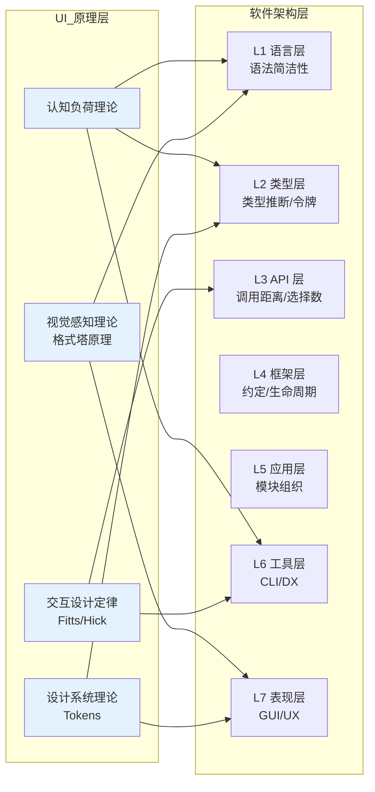
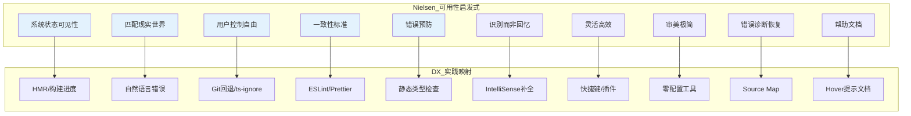

# L6 横向贯穿：UI 原理在各层的映射

## 引言

用户界面（UI）与用户体验（UX）原理通常被视为前端开发的专属领域——它们指导着按钮的摆放位置、色彩对比度的选择、交互动画的时序与信息层级的组织。然而，这一认知将 UI/UX 理论的应用范围过度狭隘化了。事实上，UI 原理并非仅作用于 L7（表现层）的图形界面，而是作为一种跨层次的约束力量，贯穿从编程语言语法设计（L1）、类型系统构造（L2）、API 接口定义（L3）到框架架构约定（L4）、应用模块组织（L5）乃至文档站点信息架构的每一个层级。

这一贯穿性的理论基础在于：无论交互的媒介是图形界面、代码编辑器、命令行终端还是技术文档，人类认知系统的基本限制——工作记忆的容量、视觉感知的格式塔规律、决策过程中的选择负荷——始终不变。因此，那些为降低用户认知摩擦而发展起来的设计原则，在移植到开发者工具与系统设计中时，往往展现出惊人的解释力与指导价值。

本文将建立 UI 原理跨层映射的理论框架，涵盖认知负荷理论、视觉感知理论、交互设计定律与设计系统理论四个维度，并将其逐一映射到 TypeScript 类型系统、React 组件 API、CLI 工具设计、文档站点信息架构与开发者体验（DX）的工程实践中，最终论证「开发者体验本质上就是 UI 原理在工具层的系统性应用」这一核心命题。

---

## 理论严格表述

### 1. UI/UX 原理作为跨层次约束的理论基础

传统软件架构的分层模型（如 OSI 七层模型或本文讨论的 L1-L7 层次）倾向于将各层视为相对独立的抽象。然而，UI/UX 原理的独特性在于：它们不是某一层的局部规则，而是对所有涉及「人-系统交互」的层次施加横向约束的元规则。

这一观点的理论基础可以追溯到 Jef Raskin（Macintosh 项目创始人）在《The Humane Interface》中提出的核心论断：「界面设计不是关于像素与颜色的艺术，而是关于人类认知能力的工程学。」将这一论断扩展到软件系统的所有层次，我们得到以下推论：

- **L1 语言层**：编程语言语法是人类与编译器/解释器的交互界面；
- **L2 类型层**：类型系统是人类与静态分析工具的交互界面；
- **L3 API 层**：函数签名与协议规范是人类与库/服务的交互界面；
- **L4 框架层**：框架约定与生命周期是人类与代码执行环境的交互界面；
- **L5 应用层**：业务模块组织是人类与代码库结构的交互界面；
- **L6 工具层**：CLI 命令、构建输出与错误信息是人类与开发工具的交互界面；
- **L7 表现层**：图形界面是人类与最终产品的交互界面。

在这七个层次中，人类认知系统的约束（有限的工作记忆、模式识别偏好、决策疲劳阈值）始终保持一致。因此，降低认知负荷、优化信息架构、减少选择复杂度等 UI 原理，在各层都具有适用性。

### 2. 认知负荷理论在编程语言设计中的映射

John Sweller 在 1988 年提出的认知负荷理论（Cognitive Load Theory）区分了三类认知负荷：

1. **内在认知负荷（Intrinsic Load）**：由任务本身的复杂度决定，与学习材料交互的本质难度相关；
2. **外在认知负荷（Extraneous Load）**：由信息呈现方式的不当设计导致，与学习材料无关的认知开销；
3. **关联认知负荷（Germane Load）**：用于构建深层理解（如图式建构）的认知资源投入。

**映射到编程语言设计**：

编程语言设计的核心优化目标之一，就是在保持表达能力（内在认知负荷相对固定）的前提下，最大限度地降低外在认知负荷。

- **语法简洁性 = 降低外在认知负荷**：Python 的「伪代码式」语法、Ruby 的方法调用省略括号、Go 语言对语法糖的有意克制——这些设计选择都直接影响开发者阅读代码时的外在认知负荷。TypeScript 的类型注解语法 `const x: string = "hello"` 相较于 Java 的 `String x = "hello";` 在类型位置上的直觉性，正是认知负荷优化的微观体现。

- **语法一致性 = 降低模式切换负荷**：当语言在不同上下文中的语法规则保持一致时，开发者可以将已习得的图式（Schema）迁移到新场景，减少关联认知负荷的浪费。TypeScript 的类型推断机制允许在多数场景下省略显式类型注解，正是基于「如果编译器能够推断，就不应强迫开发者重复声明」的认知负荷原则。

- **错误信息的认知负荷**：编译器错误信息的质量直接决定了调试过程的外在认知负荷。Rust 编译器以其「富有同理心的错误信息」著称，不仅指出错误位置，还提供修复建议与相关文档链接。TypeScript 4.x 以后的错误信息改进（如更精确的上下文标注、相关的类型声明提示）同样遵循了这一原则。

### 3. 视觉感知理论在代码可读性中的映射

格式塔心理学（Gestalt Psychology）揭示了一系列人类视觉感知的基本规律，包括相似性（Similarity）、接近性（Proximity）、连续性（Continuity）、闭合性（Closure）与共同命运（Common Fate）。这些规律不仅适用于图形界面设计，也深刻影响着代码的视觉组织。

**语法高亮 = 格式塔相似性**：

代码编辑器中的语法高亮通过颜色与字体样式将代码元素分类（关键字、字符串、注释、变量名）。根据格式塔相似性原理，人类视觉系统会自动将具有相同视觉属性的元素归为一组。这种分组降低了识别代码结构所需的认知努力——开发者可以快速「扫视」代码并定位到感兴趣的元素类型，而无需逐字符解析。

现代主题（如 Dracula、One Dark、Catppuccin）的设计不仅考虑美观，更考虑语义分组的可辨识性：字符串与注释使用明显区分的颜色（避免将字符串误读为注释），关键字使用高饱和度色彩（突出控制流结构），类型标注使用柔和色调（减少视觉干扰）。

**缩进与空白 = 格式塔接近性**：

Python 将缩进作为语法的一部分，正是对格式塔接近性原理的极致应用——物理上的接近暗示逻辑上的从属关系。即使在缩进非强制的语言中， linter（如 ESLint 的 `indent` 规则）与格式化工具（如 Prettier）也通过强制一致的缩进风格，利用接近性原理帮助开发者快速识别代码块的层级结构。

**代码折叠与分屏 = 格式塔闭合性**：

代码编辑器的折叠功能允许开发者将详细实现隐藏，仅保留结构性的「轮廓」。这利用了格式塔的闭合性原理——人类倾向于在感知不完整信息时自动补全缺失部分。一个折叠的函数定义 `function calculateTotal(...) { ... }` 允许开发者在不阅读实现细节的情况下理解其接口契约，这正是闭合性原理在代码阅读中的映射。

### 4. 交互设计定律在 API 设计中的映射

Fitts 定律与 Hick 定律是人机交互领域最稳健的两个定量定律，它们在 API 设计、工具界面与命令行交互中同样具有强大的解释力。

**Fitts 定律：目标越大、距离越短，操作越快**

> MT = a + b · log₂(D/W + 1)

其中 MT 为运动时间，D 为到目标的距离，W 为目标宽度。

**映射到 API 设计——「API 调用距离」**：

在 API 设计的隐喻中，「距离」可以理解为从开发者意图到实现该意图所需代码的「概念距离」。

- **命名距离**：API 的命名越直观（`array.map()` vs `array.__iter__().map()`），概念距离越短。TypeScript 的 `Array.prototype` 方法命名遵循了英语自然语言的直觉，降低了调用时的认知摩擦。

- **导入距离**：需要导入的模块数量越多、路径越深，API 调用的「距离」越长。Lodash 的命名空间导入 `import _ from 'lodash'` 与树摇友好的 `import { debounce } from 'lodash-es'` 之间的对比，体现了减小调用距离的设计进化。TypeScript 的 `paths` 映射与 Node.js 的子路径导入（Subpath Imports）也是为了缩短这一距离。

- **链式调用 = 缩短距离**：jQuery 的链式 API `$('#el').addClass('active').show().animate({ opacity: 1 })` 将多个操作压缩为单一的表达式流，在概念上缩短了从「选择元素」到「完成操作」的距离。现代管道操作符提案（`|>`）与 RxJS 的 Observable 管道同样遵循了这一逻辑。

**Hick 定律：选择越多，决策时间越长**

> RT = a + b · log₂(N)

其中 RT 为反应时间，N 为可选方案的数量。

**映射到 API 设计——「API 选择数量」**：

- **函数重载 vs 联合参数**：TypeScript 支持函数重载，但过度重载会导致开发者面对多个签名时产生选择 paralysis。更优的设计是使用 discriminated union（可辨识联合类型），通过单一参数对象的 `type` 字段引导开发者进入正确的分支。

- **配置项的数量控制**：工具与库的配置项数量直接影响开发者的心智负荷。ESLint 的 `extends` 机制（`eslint:recommended`、`plugin:@typescript-eslint/recommended`）通过预设配置包减少了从零开始配置的决策数量。Vite 的「零配置启动」哲学更是将 Hick 定律应用到了极致——默认配置即最优配置，仅在需要时显式覆盖。

- **CLI 子命令的组织**：Git 的 `git checkout` 命令因承担过多职责（切换分支、恢复文件、创建分支）而被社区批评。Git 2.23 引入的 `git switch` 与 `git restore` 正是 Hick 定律的实践：将单一命令的过多职责拆分为更聚焦的子命令，减少每次调用时的选择数量。

### 5. 设计系统理论在类型系统设计中的映射

现代设计系统（Design System）理论强调通过「设计令牌」（Design Tokens）实现跨平台、跨团队的设计一致性。设计令牌是视觉属性的抽象命名（如 `color-primary-500`、`spacing-md`、`font-size-heading`），它们将具体的像素值与语义化的名称解耦。

**Design Tokens ≈ Type Tokens**：

这一思想在类型系统设计中有着直接的对应物——我们可以将其称为「Type Tokens」或「类型令牌」：

```typescript
// 类型令牌：将具体类型与语义化名称解耦
type UserId = string;
type Email = string;
type Timestamp = number;

function createUser(id: UserId, email: Email, createdAt: Timestamp) {
  // 实现...
}
```

在上述代码中，`UserId`、`Email` 与 `Timestamp` 虽然底层类型分别是 `string` 与 `number`，但通过类型别名赋予了语义化的名称。这种「类型令牌」机制带来了与设计令牌类似的收益：

- **一致性**：所有使用 `UserId` 的地方都共享相同的类型语义与验证规则；
- **可维护性**：如果需要将 `UserId` 从 `string` 改为 branded type（如 `type UserId = string & { __brand: 'UserId' }`），只需修改一处定义；
- **可沟通性**：函数签名中的 `UserId` 比 `string` 传达了更多的领域信息，降低了阅读代码时的认知负荷。

TypeScript 的 branded types、template literal types 与 discriminated unions 共同构成了一套「类型系统设计系统」，使得类型不仅可以约束运行时行为，更可以承载领域语义与架构约定。

---

## 工程实践映射

### 1. TypeScript 类型系统的「可读性设计」

TypeScript 的类型系统不仅是静态类型检查的工具，更是代码可读性与可维护性的设计媒介。其诸多特性都可以从 UI 原理的角度重新解读。

**类型推断 = 减少显式标注的认知负荷**：

TypeScript 强大的类型推断系统（基于 Hindley-Milner 算法的扩展）允许开发者在大量场景下省略显式类型注解：

```typescript
// 无需显式标注：TypeScript 推断为 { name: string; age: number }
const user = { name: 'Alice', age: 30 };

// 无需显式标注：TypeScript 推断返回类型为 string
function greet(name: string) {
  return `Hello, ${name}`;
}
```

这种推断机制遵循了「渐进式披露」（Progressive Disclosure）的 UI 原则——只有在类型存在歧义或需要显式约束时，才要求开发者提供类型信息。这与现代 GUI 设计中「先展示核心选项，高级选项默认折叠」的理念如出一辙。

**条件类型与映射类型 = 信息架构的分层**：

TypeScript 的高级类型特性允许构建层次化的类型抽象，类似于信息架构中的层级导航：

```typescript
// 基础类型层
type Primitive = string | number | boolean;

// 组合类型层
type User = {
  id: string;
  name: string;
  email: string;
};

// 派生类型层（通过映射类型自动构建）
type UserPreview = Pick<User, 'id' | 'name'>;
type UserForm = Omit<User, 'id'>;
type PartialUser = Partial<User>;
```

通过 `Pick`、`Omit`、`Partial`、`Required` 等工具类型，开发者可以在不重复定义结构的情况下，从基础类型派生出特定场景所需的变体。这类似于设计系统中的「组件变体」（Component Variants）机制——基础按钮组件通过参数组合生成主次按钮、危险按钮等不同变体。

**类型错误的位置精度 = 错误信息的「接近性」**：

TypeScript 4.x 以后引入的「相关类型提示」（Related Information）功能，在报错时会指出与错误相关的其他类型声明位置。这一改进遵循了 UI 设计中的「接近性原则」——将相关信息在空间上靠近呈现，减少开发者在不同文件间跳转的认知负荷。

### 2. React 组件 API 的设计心理学

React 组件的 Props 接口是开发者与组件库交互的主要触点，其设计质量直接影响开发效率和代码可维护性。优秀的 Props 设计可以被视为「组件的 UX 设计」。

**Props 命名的心智模型映射**：

Props 的命名应当映射到开发者已有的心智模型（Mental Model），而非框架实现的内部机制。

```jsx
// 映射到心智模型：disabled 是开发者对按钮状态的直觉理解
<Button disabled={true}>Submit</Button>

// 映射到实现细节：isDisabled 暴露了内部状态命名，认知负荷更高
<Button isDisabled={true}>Submit</Button>
```

HTML 原生属性（如 `disabled`、`checked`、`required`）之所以成为 React Props 命名的黄金标准，正是因为它们已经与 Web 开发者的心智模型深度绑定。遵循平台惯例（Platform Conventions）是降低认知负荷的最有效策略之一。

**受控与非受控组件 = 模式的一致性**：

React 对受控组件（Controlled Components）与非受控组件（Uncontrolled Components）的区分，提供了两种明确的使用模式。当组件库在这两种模式之间保持一致性时（如所有表单组件都同时支持 `value` + `onChange` 的受控模式与 `defaultValue` 的非受控模式），开发者可以将学习一个组件时建立的图式迁移到其他组件，大幅降低学习曲线。

**Compound Components = 信息 scent**：

Compound Components 模式（如 `<Select>`、`<Select.Option>`、`<Select.Label>`）通过父子组件的组合关系传达结构信息。这一设计遵循了信息觅食理论（Information Foraging Theory）中的「信息气味」（Information Scent）概念——组件的嵌套结构本身就暗示了其功能关系，开发者无需阅读文档即可推断出正确用法。

```jsx
// 信息气味：Option 必须是 Select 的子元素，Label 提供上下文
<Select>
  <Select.Label>Choose a fruit</Select.Label>
  <Select.Option value="apple">Apple</Select.Option>
  <Select.Option value="banana">Banana</Select.Option>
</Select>
```

### 3. CLI 工具的设计：命令结构 = 信息架构

命令行界面（CLI）是开发者与工具系统交互的重要媒介。CLI 的设计质量直接决定了开发者的工作流效率，其设计原则与图形 UI 设计高度同源。

**命令结构 = 信息架构**：

优秀的 CLI 工具将命令组织为层次化的信息架构，类似于网站导航的层级结构。

```bash
# npm 的命令结构：动词 + 名词的层级信息架构
npm install <package>     # 第一层：操作类型
npm run <script>          # 第一层：操作类型
npm publish               # 第一层：操作类型
npm config get registry   # 第二层：配置子命令
npm config set registry   # 第二层：配置子命令
```

GitHub CLI（`gh`）的设计是信息架构原则在 CLI 中的典范实践：

```bash
gh repo create            # repo 命名空间下的操作
gh repo clone             # repo 命名空间下的操作
gh issue list             # issue 命名空间下的操作
gh issue create           # issue 命名空间下的操作
gh pr checkout            # pr 命名空间下的操作
```

`gh` 的命令结构遵循了「名词-动词」的命名约定（`repo create` 而非 `create-repo`），这使得命令具有更好的可预测性与可发现性。当开发者学会 `gh repo create` 后，可以自然推断出 `gh repo clone`、`gh repo fork` 的存在，而无需查阅文档——这正是信息架构中「一致性导航模式」的 CLI 映射。

**输出格式 = 视觉层次**：

CLI 的输出格式设计应当遵循视觉层次（Visual Hierarchy）原则：最重要的信息最突出，次要信息适度弱化，辅助信息可折叠或默认隐藏。

```bash
# Vite 构建输出的视觉层次
vite v5.0.0 building for production...
✓ 128 modules transformed.                          # 关键结果：绿色勾号
dist/                     assets/index-abc123.js    45.23 kB │ gzip: 12.34 kB  # 详细数据：缩进+表格
dist/                     assets/logo-def456.png   2.15 kB                        # 详细数据
✓ built in 1.23s.                                   # 关键结果：耗时总结
```

Vite 的构建输出通过颜色（绿色表示成功）、符号（✓ 与 ×）、缩进与对齐列，构建了清晰的视觉层次。这与网页设计中的「F 型阅读模式」相呼应——开发者的视线首先被颜色与符号吸引，随后扫视对齐的数据列。

**交互式提示 = 渐进式披露**：

现代 CLI 工具（如 `npm init`、`create-vite`、`shadcn-ui`）广泛使用交互式提示（Interactive Prompts）来收集配置信息。这种设计遵循了渐进式披露原则：

```bash
# create-vite 的交互式提示
? Project name: › my-project
? Select a framework: › - Use arrow-keys. Return to submit.
❯   Vanilla
    Vue
    React
    Preact
    Lit
    Svelte
    Others
? Select a variant: › - Use arrow-keys. Return to submit.
❯   TypeScript
    JavaScript
```

通过分步骤、可导航的提示，工具将原本需要记忆的大量命令行参数转换为可视化的选择界面。这是 Hick 定律的直接应用——将无限可能的命令行组合压缩为有限且结构化的选项集，减少决策时间与错误概率。

### 4. 文档站点的信息架构：VitePress 与 Docusaurus 的导航设计

技术文档站点的信息架构（IA）决定了开发者能否高效地找到所需信息。VitePress 与 Docusaurus 作为现代文档框架，其导航设计体现了深厚的 UI 原理应用。

**侧边栏导航 = 空间记忆**：

VitePress 的默认主题采用固定左侧边栏展示文档层级，顶部导航栏展示顶级分类。这种设计利用了人类的空间记忆能力——开发者可以记住某个主题在侧边栏中的大致位置，从而在后续访问时快速定位。

```yaml
# VitePress 的导航配置：层次化信息架构的代码表达
nav:
  - text: Guide
    items:
      - text: Getting Started
        link: /guide/getting-started
      - text: Configuration
        link: /guide/configuration
  - text: API
    items:
      - text: Config Reference
        link: /api/config
```

**搜索功能的「信息气味」**：

VitePress 内置的 Minisearch 与 Docusaurus 的 Algolia DocSearch 提供了全文搜索功能。优秀的文档搜索不仅是关键词匹配，更是「信息气味」的传递——搜索结果的摘要应当包含匹配关键词的上下文片段，帮助开发者判断该结果是否值得点击。这与网页搜索结果页的「高亮关键词 + 摘要片段」设计完全一致。

**「在此页面上」锚点导航 = 内容的路标**：

VitePress 右侧的「On this page」区域自动提取页面中的标题结构，提供页面内的快速导航。这类似于长篇文章中的目录功能，遵循了「路标」（Wayfinding）的 UI 原则——在复杂的信息空间中提供方向感与位置感。

**深色模式 = 感官适应**：

VitePress 与 Docusaurus 均支持深色模式切换。从 UI 原理的角度看，这不仅是美观偏好，更是「感官适应」的设计——在低光环境下减少屏幕亮度对视觉系统的刺激，降低长时间阅读文档的视觉疲劳。

### 5. 开发者体验（DX）作为 UI 原理在工具层的应用

开发者体验（Developer Experience, DX）是近年来前端社区的核心议题。将 DX 置于 UI 原理的框架下审视，可以发现它本质上是 Nielsen 可用性启发式原则（Nielsen's Usability Heuristics）在开发者工具领域的系统性应用。

**系统状态的可视性（Visibility of System Status）**：

- **UI 映射**：进度条、加载动画、状态指示器；
- **DX 映射**：构建进度条（Webpack Progress Plugin）、类型检查状态（VS Code 底部的 TypeScript 图标）、Git 状态指示（VS Code 源代码管理面板）。

Vite 的开发服务器通过 HMR（Hot Module Replacement）在浏览器中实时反映代码变更，将「系统状态」的可视性推向了极致——开发者可以即时看到修改的效果，无需手动刷新页面。

**系统与现实世界的匹配（Match Between System and Real World）**：

- **UI 映射**：使用用户熟悉的语言与概念，而非系统内部术语；
- **DX 映射**：Error 消息使用自然语言描述（Rust 编译器、TypeScript 的「Did you mean...?」建议）、文件路径使用操作系统原生的分隔符、配置项使用领域术语而非框架内部实现术语。

**用户的控制感与自由度（User Control and Freedom）**：

- **UI 映射**：撤销/重做、清晰的退出路径；
- **DX 映射**：Git 的版本控制提供了代码变更的「撤销」能力；Vite 的 `optimizeDeps.exclude` 允许开发者显式控制依赖预打包行为；TypeScript 的 `// @ts-ignore` 与 `// @ts-expect-error` 提供了类型系统的「紧急出口」。

**一致性与标准（Consistency and Standards）**：

- **UI 映射**：平台惯例、内部一致性；
- **DX 映射**：ESLint 的代码风格统一、Prettier 的自动格式化、Conventional Commits 的提交信息规范、Semantic Versioning 的版本号语义一致性。

**错误预防（Error Prevention）**：

- **UI 映射**：确认对话框、输入验证、禁用危险操作；
- **DX 映射**：TypeScript 的静态类型检查在编译时预防运行时错误；ESLint 的 `no-undef` 规则预防未定义变量；React 的 `key` 属性检查预防列表渲染的性能陷阱；husky + lint-staged 在提交前运行检查脚本。

**识别而非回忆（Recognition Rather Than Recall）**：

- **UI 映射**：下拉菜单优于自由输入、图标辅助识别；
- **DX 映射**：VS Code 的 IntelliSense 自动补全减少了 API 记忆负担；Storybook 的组件浏览器允许通过视觉识别而非记忆名称来查找组件；Zsh 的 `zsh-autosuggestions` 基于历史命令提供补全建议。

**使用的灵活性与效率（Flexibility and Efficiency of Use）**：

- **UI 映射**：快捷键、高级选项、自定义工作流；
- **DX 映射**：VS Code 的快捷键系统、Vim/Neovim 的模态编辑、Shell 的别名（alias）与函数、Webpack/Vite 的插件系统。

**审美与极简设计（Aesthetic and Minimalist Design）**：

- **UI 映射**：无关信息的隐藏、视觉噪音的减少；
- **DX 映射**：Vite 的默认配置即最优、create-react-app 的隐藏配置层、Next.js 的文件系统路由减少了路由配置代码。

**错误诊断与恢复（Help Users Recognize, Diagnose, and Recover from Errors）**：

- **UI 映射**：清晰的错误信息、恢复步骤建议；
- **DX 映射**：React Error Boundaries 的降级 UI、TypeScript 错误消息中的相关类型提示、Node.js 的堆栈追踪（Stack Trace）与 Source Map 映射。

**帮助与文档（Help and Documentation）**：

- **UI 映射**：上下文帮助、工具提示、文档链接；
- **DX 映射**：JSDoc/TSDoc 注释、VS Code 的 Hover 提示、TypeScript 类型定义的 `d.ts` 文件、VitePress/Docusaurus 文档站点。

---

## Mermaid 图表

### 图表一：UI 原理的跨层映射总览



### 图表二：认知负荷在各层的分布与优化

```mermaid
xychart-beta
    title "各层认知负荷分布：优化前 vs 优化后"
    x-axis [L1-语言, L2-类型, L3-API, L4-框架, L5-应用, L6-工具, L7-UI]
    y-axis "Cognitive Load Index" 0 --> 100
    bar "优化前" [75, 80, 70, 65, 60, 85, 90]
    bar "优化后" [45, 35, 40, 35, 40, 40, 35]
```

### 图表三：API 设计的 Fitts 定律映射

```mermaid
graph TD
    subgraph 概念距离
        A1[开发者意图<br/>"我需要过滤数组"] -->|短距离| B1[array.filter()]
        A1 -->|长距离| B2[array.reduce<br/>手动构建新数组]
        A2[开发者意图<br/>"我需要去重"] -->|短距离| B3[Array.from<br/>new Set]
        A2 -->|更长距离| B4[双重循环<br/>逐个比较]
    end

    subgraph 调用距离优化
        C1[深层路径导入] -->|优化| D1[子路径导入<br/>lodash/debounce]
        C2[命名空间导入] -->|优化| D2[具名导入<br/>import debounce]
    end

    style B1 fill:#e8f5e9
    style B3 fill:#e8f5e9
    style D1 fill:#e8f5e9
    style D2 fill:#e8f5e9
```

### 图表四：DX 作为 Nielsen 启发式在工具层的映射



---

## 理论要点总结

1. **UI 原理是跨层次的元约束**：认知负荷理论、视觉感知理论、交互设计定律与设计系统理论不仅适用于 L7 图形界面，而是对所有涉及人-系统交互的层次（L1-L7）施加横向约束的普适性原则。

2. **认知负荷理论指导语言与工具设计**：编程语言语法的简洁性、类型推断的自动化、错误信息的可读性，都是降低外在认知负荷的具体实践。优秀的语言与工具设计应当遵循「渐进式披露」原则，仅在必要时要求显式输入。

3. **视觉感知理论解释代码可读性**：语法高亮利用格式塔相似性、代码缩进利用接近性、代码折叠利用闭合性——代码编辑器的每一项视觉优化都可以追溯到格式塔心理学的基本原理。

4. **Fitts 定律与 Hick 定律适用于 API 与 CLI 设计**：API 的调用距离（命名直观性、导入路径长度、链式调用流畅度）与选择数量（配置项控制、命令职责拆分）直接影响开发者的操作效率与决策质量。

5. **设计系统理论在类型系统中找到了对应物**：Type Tokens（类型别名、branded types、discriminated unions）与设计 tokens 具有同构性——它们都通过语义化抽象实现了跨模块的一致性与可维护性。

6. **开发者体验（DX）是 UI 原理在工具层的系统性应用**：Nielsen 的十大可用性启发式原则在 DX 领域有着完整且精确的映射。评价一个工具的 DX 质量，本质上就是评价其作为「开发者界面」的可用性水平。

7. **信息架构原则贯穿文档与 CLI**：无论是文档站点的导航结构、搜索结果的呈现方式，还是 CLI 的命令层次与输出格式，信息架构的基本原则（组织、标记、导航、搜索系统）都发挥着核心作用。

---

## 参考资源

1. Norman, D. A. (2013). *The Design of Everyday Things: Revised and Expanded Edition*. Basic Books. Norman 提出的「示能」（Affordance）、「意符」（Signifier）与「映射」（Mapping）概念，是理解人机交互设计心理学的奠基性框架，其洞见可直接迁移到 API 与工具设计领域。

2. Nielsen, J. (1994). *Usability Engineering*. Morgan Kaufmann. Nielsen 系统阐述了可用性工程的方法论，其著名的「十大可用性启发式原则」已成为评价用户界面质量的行业标准，本文将其完整映射到开发者体验（DX）的评估框架中。

3. React Team. (2024). *React Design Principles*. [https://react.dev/community/thinking-in-react](https://react.dev/community/thinking-in-react). React 官方文档中关于组件设计哲学、状态管理心智模型与组合模式的阐述，展示了 UI 框架如何通过设计原则约束应用架构。

4. VitePress Team. (2024). *VitePress Documentation — Default Theme Config*. [https://vitepress.dev/reference/default-theme-config](https://vitepress.dev/reference/default-theme-config). VitePress 的默认主题配置文档，记录了其导航设计、侧边栏组织与搜索功能的信息架构决策。

5. GitHub. (2024). *GitHub CLI Manual & Design Documentation*. [https://cli.github.com/manual/](https://cli.github.com/manual/). GitHub CLI 的官方手册，其命令结构、输出格式与交互式提示设计是 CLI 工具可用性工程的优秀案例。

6. Sweller, J. (1988). *Cognitive Load During Problem Solving: Effects on Learning*. Cognitive Science, 12(2), 257-285. Sweller 的原始论文，建立了认知负荷理论的学术基础，为分析编程语言与工具的认知开销提供了量化框架。

7. Koffka, K. (1935). *Principles of Gestalt Psychology*. Harcourt, Brace and Company. 格式塔心理学的经典文献，其关于相似性、接近性、连续性与闭合性的原理，是解释代码可读性与界面设计共通性的理论基础。
