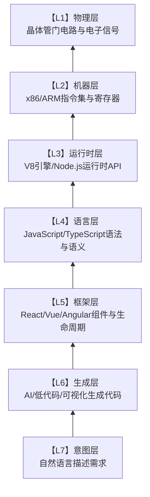
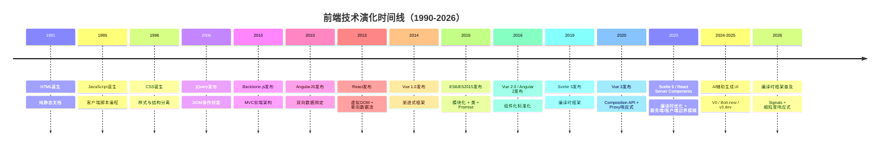
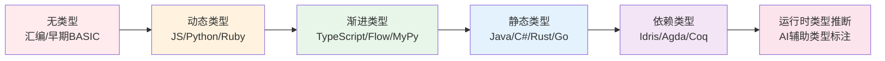
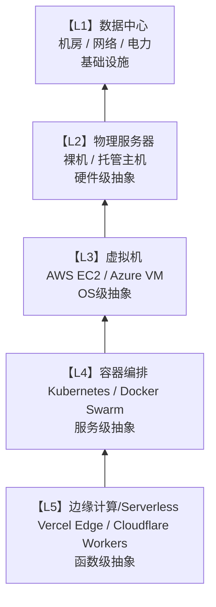

# 演化路径：从汇编到AI辅助编程

## 引言

技术的演化并非随机漫步，而是遵循某种深层结构的定向运动。从打孔纸带上的机器码到自然语言描述的AI代码生成，编程技术的每一次跃迁都在重复着同一个主题：**提升抽象层次，隐藏底层复杂性，扩大可解决问题的范围**。这一演化过程不仅改变了我们书写代码的方式，更重塑了软件开发作为一门学科的边界与内涵。

理解技术演化的内在逻辑，对于在技术浪潮中保持清醒判断至关重要。当React取代jQuery、当TypeScript吞噬纯JavaScript的领地、当AI Copilot开始参与代码评审，这些表面上的"工具更替"背后，是抽象层次的系统性提升与问题域的持续扩展。本章将从技术演化的长周期理论出发，建立一套分析框架，将前端技术栈、类型系统与部署模型的历史变迁纳入统一的解释模型，并在此基础上审视AI辅助编程的现状、限制与未来可能。

---

## 理论严格表述

### 1. 技术演化的长周期理论

#### 1.1 Kondratiev长波与技术革命

苏联经济学家Nikolai Kondratiev在1920年代提出了"长波理论"（Long Waves），指出资本主义经济存在50-60年的长周期波动。英国经济学家Chris Freeman和葡萄牙经济学家Carlota Perez在此基础上发展了"技术-经济范式"（Techno-Economic Paradigm）理论，将长波与技术革命联系起来。

根据Perez的理论，每次技术革命都遵循一个可识别的生命周期：

1. **导入期（Installation Period）**：新技术出现，金融资本主导，投机泡沫形成，旧范式与新范式剧烈冲突
2. **展开期（Deployment Period）**：技术成熟，生产资本主导，制度框架调整，新范式全面扩散
3. **成熟期（Maturity Period）**：技术潜力耗尽，利润边际下降，为下一次技术革命积蓄条件

从编程技术的视角，我们可以识别出若干次显著的技术-经济范式转换：

| 周期 | 时间 | 核心技术 | 编程范式转移 |
|------|------|----------|-------------|
| 第1波 | 1950s-1960s | 晶体管计算机 | 机器码 → 汇编语言 |
| 第2波 | 1960s-1980s | 集成电路/大型机 | 汇编 → 高级语言（FORTRAN/COBOL/C） |
| 第3波 | 1980s-2000s | 个人计算机/互联网 | 过程式 → 面向对象/结构化 |
| 第4波 | 2000s-2020s | 移动互联网/云计算 | 单体应用 → 分布式/微服务/SaaS |
| 第5波 | 2020s- | AI/边缘计算/量子计算 | 人工编码 → AI辅助/自动生成 |

**关键洞察**：每次范式转换的导入期都伴随着"旧范式捍卫者"与"新范式激进者"之间的激烈争论。1960年代的" goto 语句之争"、2000年代的"静态类型 vs 动态类型"、2020年代的"AI是否会取代程序员"，本质上都是同一深层结构在不同历史条件下的重复。

#### 1.2 技术S曲线与采纳生命周期

Everett Rogers的"创新扩散理论"和后续的"技术采纳生命周期模型"为理解单项技术的演化提供了微观框架。技术S曲线描述了技术性能随时间发展的规律：

```
性能
 ^
 |                    **** 技术极限
 |                 ***
 |              ***
 |           ***   ← 成熟期（性能边际递减）
 |        ***
 |     ***       ← 成长期（性能快速提升）
 |  ***
 |**             ← 导入期（性能缓慢起步）
 +----------------------------------> 时间
```

技术的S曲线具有三个特征阶段：

- **导入期**：技术基础不成熟，性能提升缓慢，早期采用者（Innovators/Early Adopters）承担高风险
- **成长期**：关键瓶颈突破，性能指数级提升，早期大众（Early Majority）开始涌入
- **成熟期**：接近物理或理论极限，性能提升边际递减，晚期大众（Late Majority）和落伍者（Laggards）被迫跟进

**技术替换的临界点**发生在两条S曲线的交点处：当新技术的性能-成本比超过旧技术的最佳水平时，替换将加速发生。TypeScript对JavaScript的侵蚀、React对传统jQuery开发的取代，都可以用这个模型精确描述。

### 2. 抽象层次的持续提升

#### 2.1 抽象层次的层次结构

编程技术的核心演化动力是**抽象层次的持续提升**。我们可以建立一个七层抽象模型：



每一层都对下一层进行**封装（Encapsulation）**和**隐藏（Information Hiding）**：

- **封装**：将下一层的复杂机制包装为有限数量的接口或操作
- **隐藏**：使下一层的实现细节对上层的观察者来说不可见

形式化地说，如果第 $n$ 层的计算模型为 $M_n = (S_n, O_n, T_n)$（状态空间、操作集合、转移规则），则第 $n+1$ 层通过**抽象函数** $\alpha: S_n \to S_{n+1}$ 和**具体化函数** $\gamma: S_{n+1} \to \mathcal{P}(S_n)$ 建立与下层的关系。 Gallina 和 Cousot 的抽象解释理论为这种层次关系提供了严格的数学框架。

#### 2.2 每代技术对前一代的封装与隐藏

**机器码 → 汇编语言**：汇编将二进制操作码封装为助记符（`MOV`, `ADD`, `JMP`），隐藏了指令编码的细节，但保留了寄存器模型和内存地址的直接暴露。

**汇编 → 高级语言**：C语言将寄存器分配封装为变量声明，将跳转指令封装为控制结构（`if`, `while`, `for`），隐藏了调用约定和栈帧布局的细节。函数成为基本抽象单元，程序员不再需要手动管理程序计数器。

**高级语言 → 框架**：jQuery将DOM操作和浏览器兼容性封装为链式API；React将手动DOM更新封装为虚拟DOM reconciler；Vue将响应式依赖追踪封装为`ref`和`computed`。每一代框架都隐藏了前一代的"样板代码"（Boilerplate），让开发者聚焦于业务逻辑而非基础设施。

**框架 → 低代码/无代码**：低代码平台将组件组合和状态管理封装为可视化界面，隐藏了大部分代码语法，但牺牲了表达能力和灵活性。

**低代码 → AI生成**：AI辅助编程将需求描述封装为自然语言提示，隐藏了甚至组件选择和架构决策的过程，但引入了"幻觉"（Hallucination）和不可解释性的风险。

### 3. 技术演化的不可逆性：抽象泄漏定律

#### 3.1 Spolsky的抽象泄漏定律

Joel Spolsky在2002年提出了著名的"抽象泄漏定律"（The Law of Leaky Abstractions）：

> "所有非平凡的抽象，在某种程度上都是泄漏的。"

这一定律揭示了技术演化的一个深层悖论：**抽象层次的提升虽然极大地提高了生产力，但永远无法完全消除对底层理解的需求**。当抽象泄漏时——当底层的细节以一种出乎意料的方式"渗透"到上层——缺乏底层知识的开发者将陷入困境。

经典案例包括：

- **SQL抽象泄漏**：ORM框架（如Hibernate、Prisma）隐藏了SQL语法，但当性能问题出现时，开发者必须理解查询计划、索引结构和N+1查询问题
- **网络抽象泄漏**：HTTP客户端库隐藏了TCP连接管理的细节，但当遇到连接超时、队头阻塞或TLS握手失败时，开发者必须理解传输层协议
- **内存抽象泄漏**：垃圾回收器隐藏了内存分配和释放的细节，但当应用出现内存泄漏或GC停顿（GC Pause）时，开发者必须理解堆结构、引用图和GC算法

#### 3.2 不可逆性与向下兼容性

技术演化在技术史上表现出强烈的**不可逆性**。一旦开发者习惯了更高层次的抽象，他们极少愿意主动退回到更低的层次。这种不可逆性源于认知经济学的基本原理：高抽象层次减少了工作记忆负荷（Working Memory Load），使开发者能够在更高的问题层次上进行思考。

然而，不可逆性也带来了**技术债务的累积**。每一层抽象都增加了系统的总体复杂度（尽管对上层使用者隐藏了）。当多层抽象堆叠在一起时——例如：AI生成代码 → React组件 → JSX → Babel编译 → JavaScript → V8 JIT → x86机器码——系统的总复杂度变成了各层复杂度的乘积而非和。这解释了为什么现代前端工具链的调试和性能优化如此困难。

### 4. 未来演化方向的预测理论

#### 4.1 Ray Kurzweil的技术加速回报定律

Futurist Ray Kurzweil提出了"加速回报定律"（Law of Accelerating Returns），指出技术进步的速度本身是指数增长的。这一规律在计算领域表现为摩尔定律的长期有效性（尽管晶体管缩放正在接近物理极限，但计算能力的增长通过并行化、专用加速器和算法优化得以延续）。

如果加速回报定律继续适用，我们可以预期：

- **2025-2030**：AI辅助编程从"代码补全"进化到"模块生成"，开发者角色从"编码者"转变为"AI协作者"和"架构审查者"
- **2030-2040**：形式化验证与AI生成的结合，使"零缺陷软件"在关键领域成为现实
- **2040+**：自然语言编程达到实用水平，非专业用户可以通过自然语言描述构建复杂应用

#### 4.2 Bret Victor的"发明原则"与编程工具演化

Bret Victor在2012年的演讲《Inventing on Principle》中提出了一个根本性的批评：现代编程工具与40年前相比，在"即时反馈"和"直接操作"方面几乎没有进步。他设想了一种"即时编程环境"，开发者可以直接操纵运行中的程序状态，立即看到修改的结果。

这一愿景正在部分实现：

- **热模块替换（HMR）**：Vite、Webpack HMR使前端开发者的反馈循环从分钟级缩短到秒级
- **React DevTools / Vue DevTools**：允许运行时检查和修改组件状态
- **Chrome DevTools**：提供对运行时DOM、网络、性能的实时可视化
- **AI实时预览**：V0、Bolt.new等工具允许通过自然语言修改UI并即时预览

Victor的洞见提醒我们：技术演化不仅发生在"抽象层次"维度，也发生在"人机交互"维度。未来的编程工具将同时在两个维度上推进。

---

## 工程实践映射

### 1. 前端技术的演化链

前端技术的演化是抽象层次提升的绝佳案例研究。我们可以清晰地识别出一条从手动操作到声明式抽象的演化链：



#### 1.1 各代技术的能力边界与封装策略

**原生DOM时代（1995-2005）**：开发者直接操作DOM API（`document.getElementById`, `appendChild`, `innerHTML`），需要手动处理浏览器兼容性（IE6的内存泄漏、事件模型差异）。这一时代的抽象层次最低，灵活性最高，但样板代码极多。

**jQuery时代（2006-2012）**：jQuery封装了DOM操作、事件绑定、AJAX请求和动画，提供了跨浏览器的一致性API。其核心抽象是"查询-操作链"：`$(selector).action()`。jQuery隐藏了浏览器差异，但没有提供应用架构指导，大型jQuery代码库往往演变为"意大利面条式代码"。

**MVC/MVVM框架时代（2010-2015）**：Backbone.js引入了模型-视图-控制器分离；AngularJS引入了双向数据绑定和依赖注入；Knockout.js引入了MVVM模式。这一代框架开始关注**应用架构**，而不仅是DOM操作封装。

**组件化框架时代（2013-2020）**：React将UI分解为独立的函数式组件，引入虚拟DOM和单向数据流；Vue提供了模板+响应式系统的渐进式方案；Angular提供了完整的TypeScript企业级框架。这一代的核心抽象是**组件**——自包含的、可组合的UI单元。

**编译时框架时代（2019-至今）**：Svelte 3/5将框架从运行时转移到编译时，消除了虚拟DOM的开销；Solid.js采用细粒度响应式，直接编译为DOM操作指令。这一代的核心洞察是：**框架可以消失在编译产物中**，运行时仅保留必要的反应式基础设施。

**AI辅助时代（2024-至今）**：V0、Bolt.new、v0.dev等工具允许开发者通过自然语言描述生成完整的UI组件和应用原型。AI隐藏了框架API细节、样式设计和交互逻辑的实现，但引入了"生成代码可维护性"的新问题。

#### 1.2 抽象泄漏在前端领域的体现

前端领域的抽象泄漏尤为频繁和 painful：

- **React的虚拟DOM泄漏**：当性能问题出现时，开发者必须理解reconciliation算法、`key`属性的作用、`useMemo`/`useCallback`的语义，以及并发特性（Concurrent Features）的调度机制
- **CSS抽象的泄漏**：Tailwind CSS隐藏了CSS规则的书写，但当需要自定义动画、复杂布局或媒体查询时，开发者必须回到原生CSS
- **构建工具抽象的泄漏**：Vite、Webpack隐藏了模块解析和转换管线，但当遇到"模块找不到"、"循环依赖"或"构建性能瓶颈"时，开发者必须理解模块图、tree-shaking算法和加载器管线
- **TypeScript类型抽象的泄漏**：类型系统隐藏了运行时类型检查，但当遇到`any`蔓延、条件类型递归过深或类型推断失败时，开发者必须理解结构类型系统、协变/逆变规则和类型擦除语义

### 2. 类型系统的演化

类型系统的演化史是另一条清晰的抽象提升路径：



#### 2.1 从无类型到动态类型

早期编程语言（汇编、BASIC、原始Lisp）几乎没有类型概念。数据就是位模式，解释取决于操作。这种"无类型"状态提供了最大的灵活性，但代价是运行时错误频发。

动态类型语言（JavaScript、Python、Ruby）引入了运行时类型标签，将"位模式解释"封装为自动化的类型检查。类型错误在运行时被捕获（通常以异常形式），而非在编译时。这种抽象隐藏了内存布局的细节，但泄漏了"运行时类型检查开销"和"类型错误在运行时才暴露"的问题。

#### 2.2 渐进类型：TypeScript的革命

TypeScript引入了一种创新的中间状态：**渐进类型**（Gradual Typing）。开发者可以在代码库中逐步添加类型标注，从完全无类型的JavaScript平滑过渡到几乎完全静态类型的代码。

渐进类型的核心形式化基础是Siek和Taha（2006）提出的"渐进类型理论"。该理论通过**一致性关系**（Consistency Relation）`~`替代传统的类型相等关系，允许动态类型`*`与任何类型一致：

$$
T_1 \sim T_2 \iff T_1 = T_2 \lor T_1 = * \lor T_2 = *
$$

TypeScript的工程成功在于它找到了"静态类型安全性"与"JavaScript生态兼容性"之间的最佳平衡点。它不是最严格的类型系统（相比Haskell或Rust），但它是最实用的——能够在不废弃现有代码库的前提下引入类型检查。

#### 2.3 静态类型与依赖类型

静态类型语言（Java、C#、Go、Rust）将类型检查完全前移到编译时，消除了运行时的类型检查开销。Rust更进一步，通过所有权系统将内存安全也纳入类型系统的范畴。

依赖类型（Dependent Types）是类型系统的"前沿"。在依赖类型系统中，类型可以依赖于值——例如，`Vec<n>`表示长度为`n`的向量，其类型本身携带了运行时值的约束。Idris、Agda和Coq等语言展示了依赖类型在形式化验证中的强大能力，但目前尚未进入主流工程实践。

#### 2.4 AI辅助类型标注

AI正在创造类型系统演化的新维度：自动类型推断和标注。GitHub Copilot、Codeium和类似的工具能够根据上下文自动推断变量类型、生成TypeScript接口、甚至为无类型的遗留代码库自动添加JSDoc类型注释。

这种"AI辅助类型化"可以被视为一种新型的渐进类型：人类开发者提供核心架构的类型约束，AI填充细节的类型标注。它降低了采用静态类型的认知门槛，但也引入了"AI推断类型与实际运行时行为不一致"的新风险。

### 3. 部署模型的演化

部署模型的演化同样遵循抽象层次提升的规律：



#### 3.1 物理服务器 → 虚拟机 → 容器 → Serverless

**物理服务器时代**：开发者需要管理硬件采购、机房、电力、网络和操作系统维护。抽象层次最低，控制力最强，运维负担最重。

**虚拟机时代（VM）**：Hypervisor将物理硬件虚拟化为多个隔离的虚拟机。开发者获得了"虚拟硬件"的抽象，可以独立管理操作系统，但不再需要关心物理基础设施。AWS EC2（2006年）将虚拟机抽象为可编程的API，开启了云计算时代。

**容器时代（Container）**：Docker将操作系统进一步抽象为轻量级的容器镜像。容器共享主机内核，但拥有独立的文件系统、进程空间和网络栈。与VM相比，容器启动速度从分钟级降到秒级，资源占用大幅减少。Kubernetes进一步将容器编排抽象为声明式配置（YAML）。

**Serverless时代**：AWS Lambda、Vercel Functions、Cloudflare Workers将服务器管理完全抽象化。开发者只需上传函数代码，平台自动处理扩缩容、负载均衡、故障恢复和补丁更新。Serverless的极端抽象带来了"冷启动延迟"和"供应商锁定"的泄漏问题。

**边缘计算时代**：Cloudflare Workers、Vercel Edge Runtime将计算从中心数据中心推向全球边缘节点。抽象层次进一步提升到"地理分布式执行"，但引入了"边缘-中心数据一致性"和"边缘环境限制"（如V8隔离的限制、无文件系统访问）的新复杂性。

#### 3.2 前端部署的特殊演化路径

前端部署经历了独特的演化路径：

| 阶段 | 技术 | 抽象层次 | 主要泄漏 |
|------|------|----------|----------|
| FTP上传 | FileZilla/cuteFTP | 文件级 | 无原子性、无回滚、无CDN |
| CI/CD流水线 | Jenkins/GitHub Actions | 构建+测试+部署自动化 | 流水线配置复杂、构建环境差异 |
| 静态托管 | Netlify/Vercel Surge | 推送即部署 | 构建时间限制、函数执行限制 |
| 边缘部署 | Vercel Edge/Cloudflare Pages | 全球边缘节点自动分发 | 边缘函数限制、数据合规 |
| AI一键部署 | Vercel v0 / Bolt.new | 自然语言描述即部署 | 可维护性、安全性、架构债务 |

### 4. AI辅助编程的现状与限制

#### 4.1 当前AI代码生成工具的能力矩阵

| 工具 | 核心能力 | 最佳场景 | 能力边界 |
|------|----------|----------|----------|
| GitHub Copilot | 行级/块级代码补全 | 样板代码、API调用、常见算法 | 架构设计、复杂业务逻辑、安全关键代码 |
| ChatGPT (GPT-4o) | 对话式代码生成与解释 | 学习新技术、代码审查、Bug分析 | 上下文长度限制、幻觉、知识截止日期 |
| Claude (Claude 3.5/4) | 长上下文代码理解与生成 | 大型代码库分析、文档生成、重构建议 | 实时信息、精确数学计算、形式化验证 |
| Cursor | IDE集成AI编辑器 | 全文件编辑、代码库问答、自动重构 | 复杂类型系统推理、并发安全、性能优化 |
| v0 / Bolt.new | UI组件生成与部署 | 原型开发、Landing Page、管理后台 | 自定义设计系统、复杂交互、性能调优 |

#### 4.2 AI辅助编程的能力边界

尽管AI代码生成工具在近年来取得了惊人进步，但它们存在若干根本性的能力边界：

**上下文理解限制**：当前LLM的上下文窗口虽然已从4K扩展到200K+ tokens，但面对百万行级别的企业级代码库，AI仍然无法建立完整的项目语义模型。跨模块的隐式依赖、架构约束和业务规则往往散落在代码、文档和开发者的大脑中。

**幻觉（Hallucination）问题**：AI会"自信地"生成看似合理但实际上错误的代码。这包括：编造不存在的API、忽略边界条件、使用已弃用的语法、以及在安全敏感场景中引入漏洞（如SQL注入、XSS）。

**抽象层次错配**：AI擅长生成中低抽象层次的代码（函数实现、组件UI、API调用），但在高抽象层次的决策（架构选型、技术债务权衡、长期可维护性评估）上表现薄弱。这些决策需要理解组织的业务目标、团队的技能分布和技术的演化趋势——信息通常不在代码库中。

**形式化保证缺失**：AI生成的代码缺乏形式化正确性保证。与经过Coq或Agda验证的程序不同，AI代码的正确性依赖于统计模式的匹配，而非逻辑推导。在航空、医疗、金融等关键领域，这种"概率正确性"是不可接受的。

**创造性设计的局限**：Bret Victor所倡导的"创造性编程"——探索性的、直觉驱动的、与运行时直接交互的设计过程——与当前的AI代码生成范式存在本质张力。AI基于已有模式进行生成，而真正的创新往往来自于对模式的突破。

#### 4.3 人机协作的新范式

面对AI的能力边界，行业正在形成一种新的"人机协作"范式：

1. **AI作为初稿生成器**：人类负责架构设计和需求分析，AI负责生成初始实现，人类进行审查和 refinement
2. **AI作为配对程序员**：在编码过程中，AI实时提供建议、检测潜在错误、生成测试用例，人类保留最终决策权
3. **AI作为知识检索器**：AI帮助开发者快速理解不熟悉的代码库、API文档和技术概念，减少上下文切换的认知开销
4. **AI作为自动化维护者**：AI协助进行代码重构、依赖升级、文档更新和测试补充，减轻维护负担

这一范式的核心认知是：**AI不是要取代程序员，而是要将程序员的认知负荷从"实现细节"转移到"问题理解与架构决策"**。这与编程技术演化的一贯主题——提升抽象层次——完全一致。

---

## 理论要点总结

1. **技术演化遵循长周期规律**：Kondratiev-Perez的长波理论和技术S曲线为理解编程技术的代际更替提供了宏观经济框架。每次范式转换都经历导入期（金融资本主导、泡沫与冲突）和展开期（生产资本主导、制度调整与全面扩散）。

2. **抽象层次的提升是演化的核心动力**：从机器码到汇编、从高级语言到框架、从低代码到AI生成，每一代技术都通过封装和隐藏下层复杂性来提升开发者生产力。这种提升可以用Gallina-Cousot的抽象解释理论进行形式化描述。

3. **抽象泄漏定律定义了不可逆性的代价**：所有非平凡的抽象都是泄漏的。技术演化的不可逆性意味着开发者对底层理解的遗忘，而抽象泄漏则 periodically 强制开发者重新学习底层细节。这一张力构成了技术债务的深层来源。

4. **前端技术演化是抽象提升的绝佳案例**：从原生DOM到jQuery、从MVC框架到组件化React/Vue、从运行时框架到编译时Svelte/Solid，前端技术的每一次跃迁都对应着抽象层次的提升和新的封装边界的确立。

5. **类型系统的演化从"运行时检查"走向"编译时保证"再到"AI辅助推断"**：渐进类型（TypeScript）找到了静态安全性与生态兼容性之间的平衡点；依赖类型代表了形式化验证的前沿；AI辅助类型标注正在创造"人机协作类型系统"的新范式。

6. **部署模型的演化将运维负担持续上移**：从物理服务器到VM、从容器到Serverless、从中心云到边缘计算，部署抽象的持续提升使得开发者可以聚焦于应用逻辑，但"供应商锁定"和"环境限制"的泄漏问题也随之浮现。

7. **AI辅助编程并非终点，而是新的起点**：当前AI工具在代码补全、原型生成和知识检索方面已展现出巨大价值，但在架构设计、形式化保证和创造性突破方面仍存在根本性限制。未来的演化方向是"人类负责架构与决策，AI负责实现与维护"的协作范式。

---

## 参考资源

1. Kondratiev, N. D. (1925). *The Major Economic Cycles*. 原始俄文版；英文翻译见：Kondratiev, N. D. (1984). *The Long Wave Cycle*. Richardson & Snyder. Kondratiev的长波理论是理解技术革命宏观经济周期的奠基之作，其50-60年周期假说在信息技术时代得到了显著验证。

2. Perez, C. (2002). *Technological Revolutions and Financial Capital: The Dynamics of Bubbles and Golden Ages*. Edward Elgar Publishing. Perez将Kondratiev长波与技术-经济范式理论结合，提出了"导入期-展开期"两阶段模型，为理解互联网泡沫（1995-2000）和AI投资热潮（2022-）提供了统一的分析框架。

3. Kurzweil, R. (2005). *The Singularity is Near: When Humans Transcend Biology*. Viking. Kurzweil的加速回报定律预测了技术进步的指数性质。尽管其"奇点"时间表存在争议，但他关于计算能力、存储容量和带宽增长的历史分析具有强大的数据支撑。

4. Victor, B. (2012). *Inventing on Principle* [Video]. Vimeo. Bret Victor的演讲是近十年来对编程工具设计最具影响力的批评之一。他所倡导的"即时反馈"和"直接操作"原则正在通过HMR、DevTools和AI实时预览等工具逐步实现。

5. Spolsky, J. (2002). *The Law of Leaky Abstractions*. Joel on Software Blog. Spolsky的这篇博客文章以惊人的简洁性概括了软件抽象的根本悖论。其洞见对于理解为什么"现代开发更简单但也更复杂"至关重要。

6. Kuhn, T. S. (1962). *The Structure of Scientific Revolutions*. University of Chicago Press. Kuhn的"范式转换"概念虽然针对科学史提出，但其"常规科学-危机-革命-新常规科学"的周期模型同样适用于技术演化分析。

7. Siek, J. G., & Taha, W. (2006). *Gradual Typing for Functional Languages*. Scheme and Functional Programming Workshop. Siek和Taha的论文奠定了渐进类型的形式化基础，为理解TypeScript的设计哲学提供了严格的数学框架。

8. Cousot, P., & Cousot, R. (1977). *Abstract Interpretation: A Unified Lattice Model for Static Analysis of Programs by Construction or Approximation of Fixpoints*. ACM POPL. 抽象解释理论为理解不同抽象层次之间的关系提供了统一的数学框架，是分析技术封装与泄漏的形式化工具。

9. Rodgers, E. M. (2003). *Diffusion of Innovations* (5th ed.). Free Press. Rogers的创新扩散理论和技术采纳生命周期模型为理解单项技术在社区中的传播规律提供了微观层面的分析工具。
