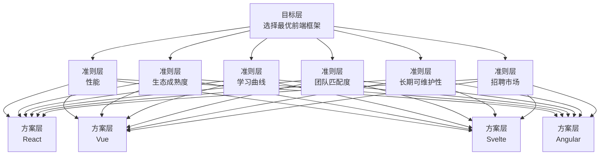
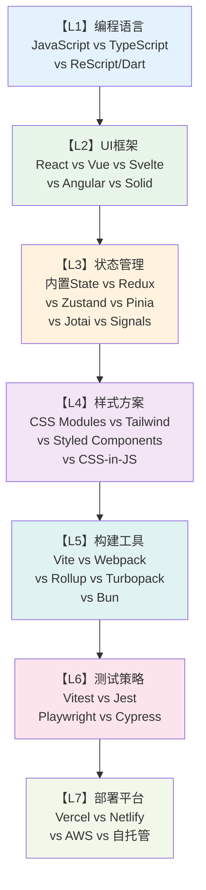
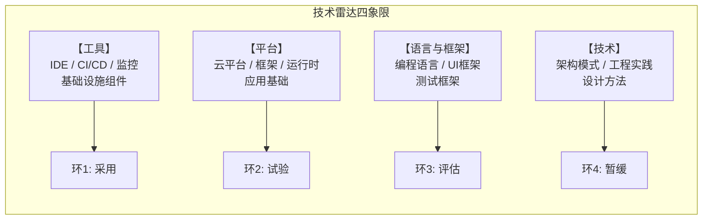
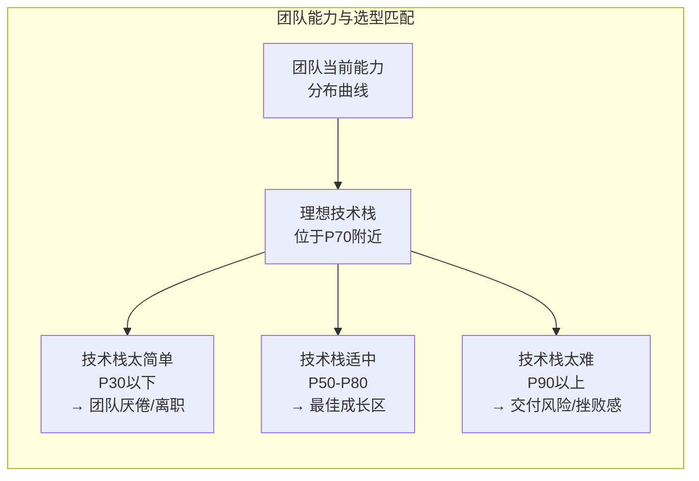

# 技术选型决策框架：形式化方法

## 引言

在软件工程实践中，技术选型是最具战略意义的决策之一，也是最容易陷入非理性陷阱的环节。一个框架的选择不仅影响当前项目的开发效率，更在长达数年的时间尺度上塑造了团队的技能结构、代码库的可维护性和产品的技术债务轮廓。然而，现实中的技术选型往往被 hype cycle（炒作周期）、个人偏好、"简历驱动开发"（Resume-Driven Development）和群体思维（Groupthink）所主导，缺乏系统化的分析方法。

本章从决策科学的形式化理论出发，建立一套技术选型的严格分析框架。我们将探讨多属性决策理论（MADM）、贝叶斯决策理论、成本-效益分析和风险评估的数学模型，然后将这些理论工具映射到前端技术栈选型的具体实践——从编程语言到框架、从状态管理到部署平台的逐层决策。通过这种"理论严格表述 + 工程实践映射"的双轨结构，我们旨在为技术决策者提供一套可复用、可辩护、可审查的决策方法论。

---

## 理论严格表述

### 1. 技术选型的多属性决策理论

技术选型本质上是一个**多属性决策问题**（Multi-Attribute Decision Making, MADM）：在多个备选方案中，根据多个评价准则选择最优方案。形式化地说，给定备选方案集合 $A = \{A_1, A_2, ..., A_m\}$ 和评价准则集合 $C = \{C_1, C_2, ..., C_n\}$，决策目标是找到一个映射 $D: A \to \mathbb{R}$，使得方案可以按照 $D(A_i)$ 的值进行全序排列。

#### 1.1 AHP层次分析法

Thomas Saaty于1980年提出的**层次分析法**（Analytic Hierarchy Process, AHP）是MADM中最具影响力的方法之一。AHP将复杂的决策问题分解为层次结构：



AHP的核心步骤包括：

1. **构建判断矩阵**：对每一层中的元素，进行两两比较，使用Saaty的1-9标度法：
   - 1：同等重要
   - 3：稍微重要
   - 5：明显重要
   - 7：强烈重要
   - 9：极端重要

   对于准则层，判断矩阵 $P$ 的元素 $p_{ij}$ 表示准则 $C_i$ 相对于 $C_j$ 的重要性。矩阵满足互反性：$p_{ij} = 1 / p_{ji}$。

2. **计算权重向量**：通过求解特征值问题 $P \cdot w = \lambda_{max} \cdot w$ 获得准则权重向量 $w$。实践中常用几何平均法近似：
   $$
   w_i = \frac{(\prod_{j=1}^n p_{ij})^{1/n}}{\sum_{k=1}^n (\prod_{j=1}^n p_{kj})^{1/n}}
   $$

3. **一致性检验**：计算一致性指标 $CI = (\lambda_{max} - n) / (n - 1)$，并与随机一致性指标 $RI$ 比较。若一致性比率 $CR = CI / RI < 0.1$，则判断矩阵通过一致性检验。

4. **层次总排序**：将各层次的局部权重逐层合成，得到方案层相对于总目标的综合权重。

#### 1.2 TOPSIS逼近理想解排序法

**TOPSIS**（Technique for Order Preference by Similarity to Ideal Solution）由Hwang和Yoon于1981年提出，其核心思想是：最优方案应当同时最接近正理想解（所有准则中的最优值）和最远离负理想解（所有准则中的最劣值）。

算法步骤如下：

1. **构建决策矩阵** $X = (x_{ij})_{m \times n}$，其中 $x_{ij}$ 是方案 $A_i$ 在准则 $C_j$ 上的原始评分
2. **标准化**：使用向量标准化 $r_{ij} = x_{ij} / \sqrt{\sum_{i=1}^m x_{ij}^2}$
3. **加权标准化**：$v_{ij} = w_j \cdot r_{ij}$
4. **确定正理想解** $A^+ = (v_1^+, v_2^+, ..., v_n^+)$ 和负理想解 $A^- = (v_1^-, v_2^-, ..., v_n^-)$
5. **计算欧氏距离**：
   $$
   D_i^+ = \sqrt{\sum_{j=1}^n (v_{ij} - v_j^+)^2}, \quad D_i^- = \sqrt{\sum_{j=1}^n (v_{ij} - v_j^-)^2}
   $$
6. **计算相对贴近度**：$C_i = D_i^- / (D_i^+ + D_i^-)$，$C_i \in [0, 1]$，值越大越优

TOPSIS的优势在于计算简单、直观易懂，且充分利用了原始数据的信息。在技术选型中，它特别适合处理包含定量指标（性能基准、Bundle大小、GitHub Stars）和定性指标（学习曲线、文档质量、社区活跃度）的混合决策场景。

#### 1.3 ELECTRE淘汰选择法

**ELECTRE**（ELimination Et Choix Traduisant la REalité）方法家族（ELECTRE I, II, III, IV, TRI）引入了"和谐性"（Concordance）和"非和谐性"（Discordance）的概念，允许决策者表达"无差异阈值"和"否决权"。

在技术选型中，ELECTRE特别适合处理以下场景：

- **否决准则**：某些准则具有"一票否决"性质。例如，如果框架的许可证与公司的法律政策冲突，无论其他准则评分多高，该框架都应被排除
- **无差异阈值**：在两个方案的性能差距小于感知阈值时，决策者认为它们在该准则上等效
- **偏好不完全性**：决策者可能无法或不愿意对所有方案进行完全排序

ELECTRE III使用伪准则（Pseudo-criteria）模型，为每个准则定义三个阈值：

- **无差异阈值** $q_j$：$|a_{ij} - a_{kj}| \leq q_j$ 时，两方案在准则 $j$ 上无差异
- **偏好阈值** $p_j$：$q_j < |a_{ij} - a_{kj}| \leq p_j$ 时，存在弱偏好
- **否决阈值** $v_j$：$|a_{ij} - a_{kj}| > v_j$ 时，劣势方案被否决

### 2. 决策树与影响图

#### 2.1 决策树分析

决策树是表示序贯决策问题的图形化工具。在技术选型中，决策树可以捕捉"选择技术A → 遇到特定问题 → 采取应对措施 → 产生结果"的完整因果链。

一个技术选型决策树的节点类型包括：

- **决策节点**（方形）：决策者可以选择的行动（如选择React vs Vue）
- **机会节点**（圆形）：不受决策者控制的不确定性事件（如框架生态的演化方向）
- **结果节点**（三角形）：决策路径的最终收益或损失

通过**逆向归纳法**（Backward Induction），从结果节点向根节点回溯，计算每个决策节点的期望效用，从而确定最优策略。

#### 2.2 影响图

影响图（Influence Diagram）是决策树的紧凑表示，使用有向无环图（DAG）表达决策、不确定性和价值之间的依赖关系：

- **决策节点**（矩形）：如"框架选择"、"架构模式选择"
- **机会节点**（椭圆）：如"团队学习速度"、"社区生态演化"
- **价值节点**（六边形）：如"项目总成本"、"交付时间"
- **确定性节点**（双椭圆）：如"已知的技术约束"

影响图的优势在于可以清晰地表达**条件独立性**关系。例如，"项目成功"可能条件独立于"框架选择"，给定"团队熟练度"和"架构合理性"——这意味着如果团队足够熟练且架构设计合理，框架的具体选择对项目成功的影响可能不大。这一洞察对于避免"框架决定论"的决策陷阱至关重要。

### 3. 贝叶斯决策理论在技术选型中的应用

#### 3.1 贝叶斯更新框架

技术选型面临的核心不确定性在于：**我们必须在信息不完全的情况下做出决策**。贝叶斯决策理论为此提供了严格的数学框架。

设 $\theta$ 为未知参数（如"框架X在生产环境中的真实缺陷率"），$D$ 为观测数据（如"框架X在原型阶段的测试结果"）。根据贝叶斯定理：

$$
P(\theta | D) = \frac{P(D | \theta) \cdot P(\theta)}{P(D)}
$$

在技术选型中，这一框架的应用流程为：

1. **先验分布** $P(\theta)$：基于历史数据、行业报告和专家判断，对框架的真实性能建立初始信念
2. **似然函数** $P(D | \theta)$：建立测试数据与真实性能之间的概率模型
3. **后验分布** $P(\theta | D)$：根据原型开发和POC（Proof of Concept）的结果，更新对框架性能的信念
4. **决策规则**：选择使期望效用最大化的行动

#### 3.2 信息价值分析

贝叶斯框架的一个重要扩展是**完全信息期望价值**（Expected Value of Perfect Information, EVPI）和**样本信息期望价值**（Expected Value of Sample Information, EVSI）：

$$
EVPI = E_{\theta}[\max_a U(a, \theta)] - \max_a E_{\theta}[U(a, \theta)]
$$

EVPI回答了这样一个问题："如果我们能完美地预知未来（框架的真实性能），这个信息对我们值多少钱？"如果EVPI很小，说明当前信息已经足够做出决策，无需进一步调研；如果EVPI很大，则值得投入资源进行更深入的POC和评估。

EVSI进一步考虑了不完美的信息来源：原型测试、参考客户访谈、技术雷达分析等。通过比较EVSI与获取信息的成本，决策者可以理性地决定"调研到何种程度为止"。

### 4. 成本-效益分析的NPV模型

技术选型不仅影响开发成本，还影响维护成本、招聘成本、培训成本和机会成本。**净现值**（Net Present Value, NPV）模型为跨时间维度的成本-效益比较提供了框架。

对于技术方案 $A_i$，其在时间跨度 $T$ 内的NPV为：

$$
NPV_i = \sum_{t=0}^{T} \frac{B_{it} - C_{it}}{(1 + r)^t}
$$

其中：

- $B_{it}$：方案 $i$ 在第 $t$ 年的收益（开发效率提升、性能改进带来的用户增长等）
- $C_{it}$：方案 $i$ 在第 $t$ 年的成本（许可费、培训费、维护费、重构成本等）
- $r$：贴现率，反映资金的时间价值和项目风险

在技术选型中，NPV分析需要特别注意**隐性成本**的量化：

- **技术债务累积成本**：低质量选型导致的代码腐化速度加快
- **认知负荷成本**：复杂技术栈导致的开发者效率下降
- **上下文切换成本**：多技术栈并存导致的团队协作摩擦
- **机会成本**：因技术栈限制而无法采用的新技术或进入的新市场

### 5. 技术风险评估

#### 5.1 风险矩阵模型

技术风险可以形式化为一个二元组 $(P, I)$，其中 $P$ 是风险发生的概率，$I$ 是风险发生后的影响程度。风险值（Risk Score）通常定义为：

$$
R = P \times I
$$

技术选型的风险矩阵可以按以下维度构建：

```mermaid
graph LR
    subgraph 技术风险评估矩阵
        direction TB
        R1[【低概率/高影响】<br/>框架被收购/放弃<br/>重大安全漏洞] --> A1[应对: 技术雷达监控<br/>多源供应商策略]
        R2[【高概率/高影响】<br/>团队学习成本超预期<br/>生态工具不成熟] --> A2[应对: 渐进迁移<br/>POC验证]<br/>A2
        R3[【高概率/低影响】<br/>小版本升级破坏<br/>API弃用] --> A3[应对: 自动化测试<br/>锁定版本]
        R4[【低概率/低影响】<br/>文档小错误<br/>边缘Bug] --> A4[应对: 社区反馈<br/>内部补丁]
    end
```

#### 5.2 蒙特卡洛模拟

对于复杂的技术选型决策，解析方法往往过于简化。**蒙特卡洛模拟**通过随机采样来估计决策结果的概率分布。

在技术选型的蒙特卡洛模拟中：

1. 为每个不确定性参数定义概率分布（如"开发时间"服从三角分布，"维护成本年增长率"服从正态分布）
2. 进行 $N$ 次（通常 $N \geq 10,000$）随机抽样
3. 每次抽样计算该场景下的NPV或效用值
4. 汇总 $N$ 次模拟的结果，得到NPV的概率分布

蒙特卡洛模拟的输出可以回答关键问题："选择框架X时，项目超预算的概率是多少？"、"方案A和方案B的NPV分布是否存在统计显著差异？"

### 6. 集体决策理论

#### 6.1 德尔菲法

**德尔菲法**（Delphi Method）是一种结构化的专家咨询技术，适用于技术选型等需要汇聚群体智慧但又要避免群体思维的场景。

德尔菲法的流程：

1. **问卷设计**：向多位独立专家发送结构化的技术评估问卷
2. **匿名回复**：专家独立给出评分和理由，避免权威压力和从众效应
3. **统计汇总**：计算评分的统计分布（均值、中位数、四分位距）
4. **反馈迭代**：将统计结果和匿名化的专家理由反馈给所有专家，允许修改评分
5. **收敛判断**：重复3-4轮，直到评分收敛或意见分歧明确化

德尔菲法在前端技术选型中的典型应用是：组建一个包含内部资深开发者、外部技术顾问和框架核心贡献者的专家小组，对候选框架进行全面评估。

#### 6.2 Arrow不可能定理与决策机制设计

Kenneth Arrow的**不可能定理**指出：在满足一组看似合理的公理（无限制定义域、帕累托效率、无关独立性、非独裁性）的条件下，不存在能够将个体偏好聚合为社会偏好的完美投票机制。

这一定理对技术选型的启示是：**任何集体决策机制都必然存在某种缺陷**。常见的决策机制包括：

- **技术负责人独裁**：决策速度快，但可能忽视团队的实际困难
- **简单多数投票**：尊重团队偏好，但可能导致"最小公分母"选择
- **加权投票**（按经验/影响力加权）：平衡效率与参与感，但权重分配本身具有主观性
- **否决权机制**（如技术委员会的一票否决）：防止灾难性选择，但可能导致保守主义

理解Arrow定理有助于决策者以现实主义态度看待集体决策过程，选择最适合组织文化和项目约束的机制，而非追求理论上完美的方案。

---

## 工程实践映射

### 1. 前端技术栈选型决策框架

前端技术栈选型是一个多层嵌套的决策问题。我们可以建立一个**逐层决策模型**，从底层到顶层依次确定各层技术：



#### 1.1 L1：编程语言决策

**TypeScript vs JavaScript** 的决策矩阵示例：

| 准则 | 权重 | TypeScript评分 | JavaScript评分 |
|------|------|---------------|---------------|
| 类型安全性 | 0.20 | 9 | 3 |
| 开发效率 | 0.15 | 7 | 8 |
| 生态兼容性 | 0.15 | 9 | 9 |
| 团队学习成本 | 0.15 | 6 | 9 |
| 工具链支持 | 0.15 | 9 | 6 |
| 编译开销 | 0.10 | 5 | 9 |
| 招聘市场 | 0.10 | 8 | 7 |

使用TOPSIS计算后，TypeScript的综合贴近度通常高于JavaScript（对于中大型团队），但这一结论强烈依赖于权重分配——如果"团队学习成本"权重提高到0.30，结果可能逆转。

#### 1.2 L2：UI框架决策

React、Vue、Svelte、Angular和Solid的选择是最具争议的前端决策之一。基于AHP的简化分析：

**准则层权重**（示例，需根据团队实际情况调整）：

- 生态成熟度（npm包数量、工具链完整性）：0.20
- 运行时性能（启动时间、更新性能、内存占用）：0.20
- Bundle体积：0.15
- 学习曲线（新成员上手时间）：0.15
- 团队现有经验：0.15
- 长期可维护性（API稳定性、升级路径）：0.10
- 招聘市场（人才可获得性）：0.05

**关键洞察**："团队现有经验"的权重往往是被低估的决定性因素。如果团队已有3年的Vue 2经验，迁移到Vue 3的成本远低于迁移到React——即使React在某些客观准则上评分更高。

#### 1.3 L3-L7：逐层锁定

每一层的选择都会约束下一层的选择空间：

- 选择 **React** → 状态管理可选Redux/Zustand/Jotai/Recoil；样式可选CSS Modules/Styled Components/Tailwind
- 选择 **Vue** → 状态管理可选Pinia/Vuex；样式默认支持Scoped CSS
- 选择 **Svelte** → 状态管理内置（`$state`, `$derived`）；构建通常搭配Vite
- 选择 **Angular** → 状态管理可选NgRx/Akita；样式默认Scoped CSS；构建使用Angular CLI

这种约束关系意味着：**高层决策具有路径依赖性**。一旦选定React，团队将积累React生态的特定知识（Hooks心智模型、JSX语法、Next.js约定），这些知识在迁移到Vue时大部分将失效。这解释了为什么技术栈迁移的成本往往被低估。

### 2. 建立技术雷达

#### 2.1 ThoughtWorks技术雷达模式

ThoughtWorks技术雷达是一种可视化的技术追踪工具，将技术按四个象限分类：



四个环代表技术采纳建议：

- **采用（Adopt）**：经过验证的、应当默认使用的技术
- **试验（Trial）**：值得在低风险项目中试验的新技术
- **评估（Assess）**：值得研究和原型验证的技术
- **暂缓（Hold）**：谨慎使用的技术（可能因成熟度不足、替代方案出现或负面经验积累）

#### 2.2 前端技术雷达示例（2026）

| 象限 | 采用 | 试验 | 评估 | 暂缓 |
|------|------|------|------|------|
| **语言与框架** | TypeScript, React, Vue 3, Svelte 5 | Solid, Qwik, Astro Islands | Vanilla Extract, QuickJS | AngularJS, jQuery, 遗留Backbone |
| **工具** | Vite, pnpm, ESLint, Prettier, Vitest | Bun, Turbopack, Biome | Rolldown, Oxc | Webpack 4, Gulp, Grunt |
| **平台** | Vercel, Node.js 20+, PostgreSQL | Cloudflare Workers, Deno Deploy | Wasmer, WinterJS | Heroku, 自托管物理服务器 |
| **技术** | Composition API, Signals, Server Components | AI辅助编程, Edge-first架构 | CRDT实时协作, WASM UI | 重客户端渲染, 纯REST API |

建立和维护技术雷达的价值在于：它为团队提供了**技术决策的共享心智模型**，减少了每次选型时的重复讨论，并确保团队对技术演化的方向保持同步认知。

### 3. 架构决策记录（ADR）

#### 3.1 ADR模板与流程

**架构决策记录**（Architecture Decision Record, ADR）是捕获技术决策上下文、选项分析和决策理由的标准化文档。Michael Nygard提出的ADR格式已成为行业事实标准：

```markdown
# ADR-XXX: [决策标题]

## 状态
- 提案 / 已接受 / 已弃用 / 已替代

## 背景
- 需要解决什么问题？
- 什么约束条件影响了决策？

## 决策
- 选择了什么方案？

## 后果
- 积极后果
- 消极后果 / 技术债务
- 中性后果

## 备选方案
- 考虑过但拒绝的方案及其理由
```

#### 3.2 ADR在前端技术选型中的应用示例

以"选择Svelte 5作为新项目框架"为例：

```markdown
# ADR-042: 选择Svelte 5作为营销站点前端框架

## 状态
已接受（2025-03-15）

## 背景
营销站点项目要求极致的首屏加载性能（Lighthouse Performance ≥ 95），
且团队对SEO有严格要求（需要SSR/SSG）。项目周期短（6周），
团队规模为2名前端开发者。

## 决策
选择 Svelte 5 + SvelteKit 作为技术栈。

## 后果
- 积极：Bundle体积最小（Hello World ~2KB），无需虚拟DOM运行时，
  内置SSR/SSG支持，开发效率极高
- 消极：团队无Svelte经验，需1周学习期；生态小于React/Vue，
  某些专用组件库需自行封装
- 中性：采用编译时响应式模型，与团队现有的React Hooks心智模型不同

## 备选方案
- React 19 + Next.js：生态最成熟，但Bundle体积较大，对2人团队过于复杂
- Vue 3 + Nuxt：团队有Vue 2经验，迁移成本低，但Bundle体积和运行时性能不如Svelte
- Astro：SSG性能优秀，但营销站点需要少量交互，Astro的岛屿架构引入额外复杂性
```

ADR的核心价值不在于记录"选择了什么"，而在于记录"为什么这样选择"和"在当时已知什么"。当6个月后有人质疑"为什么不用React"时，ADR提供了可追溯的决策上下文，避免了重复争论。

### 4. 技术债务的量化与偿还策略

#### 4.1 技术债务的量化模型

Ward Cunningham在1992年提出"技术债务"隐喻后，学界和工业界发展出了多种量化模型。

**静态分析量化法**：使用SonarQube、CodeClimate等工具计算技术债务指数：

$$
\text{Technical Debt Ratio} = \frac{\text{Remediation Cost}}{\text{Development Cost}} \times 100\%
$$

SonarQube将代码异味（Code Smells）映射为修复时间估算，生成"债务天数"指标。但这种方法存在局限：它只能捕获可静态检测的债务，无法度量架构级债务、知识债务和测试债务。

**财务模型法**：将技术债务视为真实的金融债务，计算其"利息"——即每次修改因债务存在而增加的成本。

假设模块 $M$ 的正常修改成本为 $C_0$，由于技术债务的存在，实际修改成本为 $C_1 = C_0 \cdot (1 + d)^t$，其中 $d$ 是债务增长率，$t$ 是债务存在的时间。技术债务的NPV为：

$$
NPV_{debt} = \sum_{t=1}^{T} \frac{C_0 \cdot [(1 + d)^t - 1]}{(1 + r)^t}
$$

#### 4.2 技术债务偿还策略

技术债务的偿还策略应当与产品生命周期和业务目标对齐：

| 策略 | 适用场景 | 前端实例 |
|------|----------|----------|
| **一次性偿还** | 债务集中、偿还窗口存在 | 项目启动前的遗留代码重构 |
| **分期偿还** | 债务分散、持续交付压力 | 每个Sprint分配20%容量还债 |
| **最小利息** | 债务不可避免、专注新功能 | 对稳定模块仅修复阻塞Bug |
| **债务转换** | 旧债务过时、新技术出现 | jQuery → React逐步迁移 |

Martin Fowler的"技术债务象限"提供了另一个有用的分析维度，将债务按"有意/无意"和"鲁莽/谨慎"分为四类。前端开发中最常见的"鲁莽/有意"债务是为了赶Deadline而跳过的测试；"谨慎/有意"债务是为了验证市场而采用的原型级技术栈。

### 5. 团队技术能力评估与选型匹配

#### 5.1 能力评估矩阵

技术选型必须与团队的实际能力匹配，而非理想能力。团队能力评估可以从以下维度进行：

| 维度 | 评估指标 | 评估方法 |
|------|----------|----------|
| 语言熟练度 | TypeScript类型体操、JS运行时理解 | 代码审查、技术面试题库 |
| 框架熟练度 | React/Vue/Svelte核心概念掌握 | 实际项目复盘、架构设计评审 |
| 工具链熟练度 | 构建配置、调试、性能分析 | 故障排查演练、工具配置审查 |
| 架构设计能力 | 组件拆分、状态管理、性能优化 | 设计文档评审、重构提案 |
| 测试能力 | 单元测试、集成测试、E2E测试 | 测试覆盖率、测试质量审查 |
| 运维能力 | CI/CD、监控、故障响应 | 事故复盘、部署流水线审查 |

#### 5.2 选型-能力匹配模型

技术选型的一个基本原则是：**选择的技术栈应当在团队能力分布的第70百分位附近**——既有一定的挑战性以促进成长，又不至于因过度超出现有能力而导致交付风险。



例如，如果团队对响应式编程（RxJS、Signals）毫无经验，直接采用Solid.js或全面使用RxJS管理状态可能带来过高的认知负荷。更稳妥的策略是：先用Vue 3的Composition API建立响应式思维，再逐步引入更细粒度的信号模型。

### 6. A/B测试在技术决策中的应用

#### 6.1 技术实验框架

A/B测试通常与产品功能实验关联，但同样适用于技术决策。当两种技术方案各有优劣且理论分析无法给出明确结论时，**受控实验**是最可靠的决策方法。

技术A/B测试的设计原则：

1. **随机分组**：将用户或流量随机分配到方案A和方案B
2. **单一变量**：两组之间仅技术实现不同，其他条件保持一致
3. **统计显著性**：收集足够样本量，确保结果差异不是随机波动
4. **多指标评估**：同时关注性能指标（FCP、LCP、TTI）、业务指标（转化率、跳出率）和可靠性指标（错误率）

#### 6.2 前端技术A/B测试实例

| 实验 | 方案A | 方案B | 评估指标 |
|------|-------|-------|----------|
| 框架性能 | React 19 + Next.js | Svelte 5 + SvelteKit | FCP, LCP, TTI, Bundle大小 |
| 状态管理 | Redux Toolkit | Zustand + TanStack Query | 代码行数, 渲染性能, 开发者满意度 |
| 样式方案 | Tailwind CSS | CSS Modules | 构建时间, 运行时性能, 样式冲突率 |
| 构建工具 | Webpack 5 | Vite 6 | 冷启动时间, HMR延迟, 构建产物大小 |

技术A/B测试的额外价值在于：**它提供了真实的因果证据，替代了基于 opinions 的争论**。当团队成员对"React快还是Vue快"争论不休时，一个设计良好的A/B测试可以给出数据驱动的结论。

---

## 理论要点总结

1. **技术选型是多属性决策问题**：AHP、TOPSIS和ELECTRE等MADM方法为技术选型提供了系统化的分析框架。AHP擅长处理定性准则的层次结构，TOPSIS适合混合定量/定性指标，ELECTRE允许表达否决权和无差异阈值。

2. **决策树和影响图捕捉序贯决策结构**：技术选型不是一次性事件，而是"选择 → 观察结果 → 调整 → 再选择"的序贯过程。影响图特别有助于识别条件独立性关系，避免"框架决定论"的简化思维。

3. **贝叶斯框架为信息不完全决策提供严格基础**：通过先验分布、似然函数和后验更新的循环，决策者可以理性地整合POC结果、行业数据和专家判断。EVPI和EVSI为"调研到何时停止"提供了量化答案。

4. **NPV模型将技术选型纳入跨时间维度的财务分析**：技术选型不仅影响当期开发成本，更在数年尺度上影响维护成本、招聘成本和机会成本。隐性成本（认知负荷、上下文切换、技术债务累积）的量化是NPV分析的关键挑战。

5. **风险评估需要概率×影响的二元分析**：风险矩阵和蒙特卡洛模拟为技术风险提供了从定性到定量的分析工具。理解风险的概率分布（而非仅期望值）对于制定稳健的技术策略至关重要。

6. **集体决策受Arrow不可能定理约束**：不存在完美的群体偏好聚合机制。技术委员会应当根据自身组织文化，在独裁、投票、加权投票和否决权机制之间做出务实选择，而非追求理论上的完美方案。

7. **前端技术栈选型是七层嵌套的决策问题**：从编程语言到部署平台，每一层的选择都会约束下一层的选项空间，并产生路径依赖。技术雷达、ADR和团队能力评估是将理论方法落地到工程实践的关键工具。

8. **A/B测试为技术决策提供因果证据**：当理论分析无法给出明确结论时，受控实验是最可靠的技术选型方法。技术A/B测试的设计应当遵循随机分组、单一变量、统计显著性和多指标评估的原则。

---

## 参考资源

1. Saaty, T. L. (1980). *The Analytic Hierarchy Process*. McGraw-Hill. Saaty的AHP方法是多属性决策领域最具影响力的贡献之一。其1-9标度法和一致性检验为定性准则的量化比较提供了可操作的方法论。

2. Hwang, C. L., & Yoon, K. (1981). *Multiple Attribute Decision Making: Methods and Applications*. Springer. TOPSIS方法的原始文献，为理解"逼近理想解"的排序逻辑提供了完整的形式化基础。

3. Keeney, R. L., & Raiffa, H. (1993). *Decisions with Multiple Objectives: Preferences and Value Tradeoffs*. Cambridge University Press. 多目标决策理论的经典教材，系统阐述了效用理论、偏好建模和价值权衡分析。

4. Fowler, M. (2003). *Who Needs an Architect?*. IEEE Software, 20(5), 11-13. Fowler在这篇短文中提出了"架构师作为导师而非独裁者"的理念，强调技术决策应当是团队协作的结果而非个人专断。

5. Kleppmann, M. (2017). *Designing Data-Intensive Applications: The Big Ideas Behind Reliable, Scalable, and Maintainable Systems*. O'Reilly Media. 虽然聚焦数据系统，但Kleppmann关于技术选型、可维护性和系统演化的洞见同样适用于前端架构决策。

6. Nygard, M. T. (2011). *Documenting Architecture Decisions*. 原始ADR格式的提出文献，为技术决策的可追溯性提供了轻量级文档模板。

7. Royce, W. W. (1970). *Managing the Development of Large Software Systems*. Proceedings of IEEE WESCON. Royce首次提出了"瀑布模型"（尽管他本人更推崇迭代方法），为理解软件工程决策的序贯性质提供了历史背景。

8. Arrow, K. J. (1951). *Social Choice and Individual Values*. Yale University Press. Arrow不可能定理的原始文献，虽然针对社会选择理论，但其对群体决策机制局限性的深刻洞见直接适用于技术委员会的决策设计。

9. Cunningham, W. (1992). *The WyCash Portfolio Management System*. OOPSLA Experience Report. Ward Cunningham首次提出"技术债务"隐喻的原始文献，为理解技术决策的长期财务后果提供了概念基础。

10. ThoughtWorks. (2024). *Technology Radar*. [https://www.thoughtworks.com/radar](https://www.thoughtworks.com/radar). ThoughtWorks技术雷达是追踪技术趋势和行业共识的权威参考，其象限-环结构为组织建立自己的技术雷达提供了可直接复用的模式。
