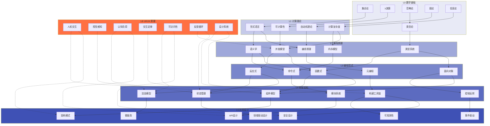

# 理论层次总论

## 总论概述

**理论层次模型**（Theoretical Hierarchy Model）是本知识体系的核心组织框架，它将 JavaScript/TypeScript 生态系统中的知识按照抽象层级划分为 **L0 至 L6 七个层次**。这一模型并非简单的分类标签，而是揭示了从数学基础到用户体验的完整知识演化链条——每一层次都建立在其下层基础之上，同时又为上层提供约束与指导。

理解这一层次结构至关重要，因为在实际工程实践中，技术问题往往需要在正确的抽象层次上才能被有效解决。一个渲染性能问题可能在 L4（框架架构）层面表现为虚拟 DOM diff 算法的优化，但在 L2（编程原理）层面可能是内存模型与并发模型的冲突，在 L0（数学基础）层面则涉及图论中的最小更新集问题。拥有层次化的理论视角，意味着工程师能够"上下求索"——既能向下追问问题的根本原理，也能向上评估方案的用户价值。

本专题的核心使命是建立 **L0-L6 各层次之间的映射关系**。这种映射不是一对一的简单对应，而是多对多的复杂关联：L2 的类型系统既受到 L0 类型论的直接影响，也在 L4 框架层面通过 `TypeScript` 的静态类型检查得以工程化实现；L3 的函数式编程范式在 L4 中转化为 `React` 的 Hooks 模型，又在 L5 应用设计中体现为不可变数据流架构。

> "在计算机科学中，没有什么问题是不能通过增加一层抽象来解决的——除了抽象层过多本身的问题。" — David Wheeler（改编）

---

## 七大层次的核心定义

### L0 数学基础：一切抽象的根基

**核心领域**: 集合论、λ演算、范畴论、类型论、逻辑学、图论、信息论

L0 是知识体系的绝对根基。JavaScript/TypeScript 生态中的每一个概念，无论多么高层，都可以追溯至数学基础：

- **集合论** 构成了数据结构与数据库理论的基础。数组、集合、Map、对象在数学上都是集合的特化。SQL 的集合操作（UNION、INTERSECT、JOIN）直接源自集合代数。
- **λ演算**（Lambda Calculus）由 Alonzo Church 于 1936 年提出，是函数式编程的数学基础。`JavaScript` 的箭头函数、高阶函数、闭包、`React` 的函数组件都可以视为 λ演算在工程中的具体化。
- **范畴论**（Category Theory）为类型系统、函数组合与抽象代数提供了统一的数学语言。`TypeScript` 的类型构造器（如 `Promise<T>`、`Array<T>`）、`fp-ts` 库中的 `Functor`、`Monad`、`Applicative` 都是范畴论概念的直接映射。
- **类型论**（Type Theory），特别是 Martin-Löf 的依赖类型论与 Per Martin-Löf 的直觉主义类型论，是 `TypeScript` 类型系统的理论先祖。理解积类型（product types，对应元组/对象）、和类型（sum types，对应联合类型/ discriminated union）的数学本质，是掌握高级 `TypeScript` 类型的关键。
- **图论** 支撑了前端依赖分析、模块打包（Webpack/Rollup 的依赖图）、状态管理图（`Vue` 的响应式依赖图、`MobX` 的观察图）以及网络请求优化。
- **信息论**（Shannon 理论）指导了代码压缩算法（Gzip/Brotli）、前端资源优化（关键渲染路径）、API 负载设计与缓存策略。

> **核心洞见**: L0 不是"无用的理论"。当你在 `TypeScript` 中为一个复杂对象编写精确的类型定义时，你实际上是在进行类型论的实践；当你设计一个纯函数管道时，你在应用 λ演算与范畴论中的函数组合定律。

---

### L1 计算理论：什么是可计算的

**核心领域**: 形式语言、自动机理论、可计算性、计算复杂度、停机问题、P vs NP

L1 回答"什么问题可以被计算机解决"以及"解决需要多少资源"。这一层次的洞见对前端与后端工程都有深远影响：

- **形式语言与自动机**: 正则表达式（正则语言/有限自动机）、上下文无关文法（CFG，用于解析 HTML/CSS/JavaScript）、BNF/EBNF 语法定义（`TypeScript` 编译器、`Babel` 解析器的内部实现）
- **可计算性**: 停机问题（Halting Problem）的不可判定性解释了为什么静态分析工具（如 ESLint、类型检查器）必然存在误报或漏报；Rice 定理说明了程序行为分析的内在困难
- **计算复杂度**:
  - P 类问题（多项式时间可解）：数组查找（O(n)）、排序（O(n log n)）
  - NP 类问题：旅行商问题、SAT 求解器、某些 CSS 布局约束求解
  - NP-完全问题在工程中的启发：理解为什么某些构建优化（如最优代码分割、理想树摇）是计算困难甚至不可行的
- **图灵机与 lambda 计算等价**: 理解为什么 `JavaScript` 是图灵完备的，以及这一完备性对安全沙箱设计的意义（如 iframe 的 `sandbox` 属性、WebAssembly 的线性内存隔离）

> **核心洞见**: L1 帮助工程师建立"计算边界"意识。当你面对一个需要指数时间求解的依赖解析问题时，你会知道寻找近似算法或贪心策略比追求最优解更务实。

---

### L2 编程原理：语言如何工作

**核心领域**: 语义学（操作语义、指称语义、公理化语义）、类型系统、内存模型、并发模型、编译原理、程序分析

L2 是连接计算理论与具体编程语言的桥梁。深入这一层次意味着理解"代码在机器上实际发生了什么"：

- **语义学**:
  - 操作语义（Operational Semantics）解释了 `JavaScript` 引擎（V8、SpiderMonkey、JavaScriptCore）如何逐步执行代码
  - 指称语义（Denotational Semantics）将程序映射到数学函数，是 `React`"UI = f(state)" 公式的理论来源
  - 公理化语义（Axiomatic Semantics，Hoare 逻辑）支撑了形式化验证与契约式编程
- **类型系统**:
  - `TypeScript` 的 structural typing 与 Java/C# 的 nominal typing 的深层差异
  - 类型推断算法（Hindley-Milner、双向类型检查）
  - 高级类型特性：条件类型、映射类型、模板字面量类型、逆变/协变/双变
  - 类型安全边界：`any`、`unknown`、`never` 的语义学解释
- **内存模型**:
  - `JavaScript` 的垃圾回收（标记-清除、分代回收、增量回收）
  - 值类型 vs 引用类型、闭包与作用域链的内存表示
  - `WebAssembly` 的线性内存模型与 JavaScript 引擎内存管理的交互
  - `SharedArrayBuffer` 与 Atomics API 引入的内存一致性模型
- **并发模型**:
  - 事件循环（Event Loop）与任务队列（microtask vs macrotask）
  - `Promise` 的 monadic 结构、`async/await` 的状态机转换
  - `Web Workers` 与 `Service Workers` 的共享 nothing 架构
  - 软件事务内存（STM）、Actor 模型（Deno 的隔离模型）
- **编译原理**:
  - 词法分析、语法分析（LL、LR、GLR 解析器）、AST 转换
  - `Babel`、`TypeScript` 编译器、`SWC`、`esbuild` 的架构差异
  - Source Map 的编码原理与调试映射

> **核心洞见**: L2 是"魔法消失"的层次。当你理解了 `async/await` 只是 `Promise` 和生成器的语法糖、理解了 `TypeScript` 编译器如何执行类型推断、理解了闭包在内存中的实际结构，你就从"API 使用者"晋升为"系统理解者"。

---

### L3 编程范式：如何组织思维

**核心领域**: 命令式编程、函数式编程（FP）、面向对象编程（OOP）、逻辑式编程、反应式编程（RP）、泛型编程、元编程

L3 是程序员日常工作的"思维操作系统"。JavaScript/TypeScript 作为一门多范式语言，融合了多种编程范式：

- **命令式编程**: `JavaScript` 的基础编程风格（变量赋值、循环、条件分支）。理解其状态突变（mutation）的语义与副作用（side effects）的影响范围。
- **函数式编程（FP）**:
  - 纯函数、引用透明、不可变性（`immutable.js`、Immer、冻结对象）
  - 高阶函数（`map`、`filter`、`reduce`）、函数组合（`compose`、`pipe`）、柯里化（currying）与部分应用（partial application）
  - `React` 的函数组件、`Redux` 的 reducer 纯函数、`Ramda`/`lodash/fp` 的 FP 工具集
  - `fp-ts` 将 Haskell 的类型类（Type Classes）引入 `TypeScript`
- **面向对象编程（OOP）**:
  - 原型链继承（`JavaScript` 的独特 OOP 模型）vs 类继承（`ES2015 class` 语法糖）
  - 封装、多态、组合优于继承（Composition over Inheritance）
  - `TypeScript` 的接口、抽象类、泛型类、装饰器（`experimentalDecorators`）
  - `NestJS` 的依赖注入容器、Angular 的服务架构
- **逻辑式编程**: `Datalog` 在数据库查询中的影响（GraphQL 的声明式本质、SQL 的逻辑编程基因）、Prolog 风格在类型约束求解中的体现（`TypeScript` 的条件类型推导可视为逻辑编程）
- **反应式编程（RP）**:
  - `RxJS` 的 Observable 流、操作符（`map`、`mergeMap`、`switchMap`、`debounceTime`）
  - `Vue` 的响应式系统（依赖追踪与自动更新）、`MobX` 的可观察状态
  - `Svelte` 的编译时反应性、`SolidJS` 的细粒度反应性
  - 信号（Signals）模式的复兴（`Preact Signals`、 `Angular Signals`、Vue Vapor Mode）
- **泛型编程**: `TypeScript` 的泛型系统、类型参数约束、泛型默认值、变型（variance）
- **元编程**: 反射（`Reflect` API）、代理（`Proxy`）、装饰器、宏（`babel` macro、`sweet.js`）、代码生成（`graphql-codegen`、`prisma` 客户端生成）

> **核心洞见**: L3 的范式选择不是宗教式的站队，而是问题特征与工具特性的匹配。数据处理管道天然适合 FP，复杂领域模型适合 OOP + DDD，实时数据流适合 RP，而底层工具链可能需要元编程的灵活性。

---

### L4 框架架构：如何构建应用

**核心领域**: 组件模型、状态管理、渲染模型、控制反转（IoC）、模块系统、构建工具链、开发者体验（DX）

L4 是将 L0-L3 的理论原理封装为可复用基础设施的层次。在现代 JavaScript/TypeScript 生态中，框架不仅是工具，更是架构决策的结晶：

- **组件模型**:
  - `React` 的函数组件 + Hooks 模型（闭包作为状态机制、代数效应的模拟）
  - `Vue` 的单文件组件（`SFC`，模板 + 脚本 + 样式的内聚单元）
  - `Angular` 的 decorator 驱动组件、依赖注入与变更检测
  - `Svelte` 的编译时组件转换（无虚拟 DOM、直接生成更新代码）
  - `SolidJS` 的细粒度反应性组件（无组件实例开销）
  - Web Components 的标准化组件模型（Custom Elements、Shadow DOM）
- **状态管理**:
  - 局部状态（`useState`、`useReducer`、`ref`）vs 全局状态（`Redux`、`Pinia`、`Zustand`）
  - 服务器状态（`React Query`/`TanStack Query`、`SWR`、`Vue Query`）vs 客户端状态
  - 原子化状态（`Jotai`、`Recoil`）vs 集中式存储
  - 不可变更新模式 vs 可变/响应式追踪模式
- **渲染模型**:
  - 虚拟 DOM（`React`、`Vue`）与真实 DOM 操作的权衡
  - 静态站点生成（SSG，`Next.js` `getStaticProps`、`Astro`）
  - 服务端渲染（SSR，`Next.js` `getServerSideProps`、`Nuxt`、 `Remix`）
  - 增量静态再生（ISR）、流式 SSR（`React` 18 `renderToPipeableStream`）
  - 岛屿架构（Islands Architecture，`Astro`、`Fresh`）
  - 服务器组件（Server Components，`React` RSC、`Next.js` App Router）
- **控制反转（IoC）**:
  - 依赖注入框架（`InversifyJS`、 `TSyringe`、 `NestJS` 内置容器）
  - 控制反转与依赖倒置原则（DIP）的关系
  - 前端中的 IoC（`React` 的 context provider、`Vue` 的 provide/inject）
- **模块系统**:
  - ESM（ES Modules）与 CJS（CommonJS）的语义差异与互操作
  - 动态导入（`import()`）、模块联邦（Module Federation）、微前端架构
  - Tree Shaking 的依赖分析原理与 `sideEffects` 配置
- **构建工具链**:
  - 打包器（Webpack、Rollup、Parcel、Vite、esbuild、Turbopack）的架构差异
  - 转译器（Babel、SWC、esbuild）的性能与生态权衡
  - 类型检查与构建的分离（`tsc --noEmit` + `esbuild`/`swc` 编译）
  - Monorepo 工具（`Nx`、`Turborepo`、`Rush`、`pnpm workspaces`）

> **核心洞见**: L4 框架的选择是一种架构承诺。选择 `React` 意味着接受其闭包心智模型与显式状态管理哲学；选择 `Vue` 意味着拥抱模板编译与响应式自动追踪；选择 `Svelte` 意味着将复杂性从运行时转移至编译时。没有"最好的框架"，只有"最适合问题特征的框架"。

---

### L5 应用设计：如何构建系统

**核心领域**: 架构模式、领域驱动设计（DDD）、微服务、事件驱动架构（EDA）、API 设计、数据管理、安全、可观测性、测试、演进式架构

L5 将 L4 的框架能力组织为完整的、可运行的软件系统。这一层次的内容已在 **/application-design/** 专题中系统展开，其核心关注点包括：

- **架构模式**: 分层架构、六边形架构、微服务、事件驱动、CQRS 等模式的选型与组合
- **领域驱动设计**: 限界上下文、聚合根、领域事件、防腐层在复杂业务系统中的实践
- **分布式系统**: 服务拆分、分布式事务（Saga）、一致性模型、容错设计（熔断、舱壁、重试）
- **数据架构**: 数据库选型、缓存策略、搜索索引、数据一致性保证
- **质量属性**: 安全（纵深防御、零信任）、可观测性（日志/指标/追踪）、可测试性（测试金字塔、契约测试）
- **系统演进**: 适应度函数、绞杀者模式、技术债务管理、架构决策记录（ADR）

> **核心洞见**: L5 的核心挑战是**权衡**。在资源、时间、复杂度、性能、一致性之间做出符合当前上下文的决策，并记录这些决策以便未来重访。

---

### L6 UI/UX 原理：横向贯穿层

**核心领域**: 人机交互（HCI）、视觉感知、认知负荷、交互设计定律、设计系统、排版、动效、可访问性、响应式、状态模型、反馈、跨文化

L6 不是传统意义上的"更高层"，而是**横向贯穿 L0-L5 的跨层维度**。UI/UX 原理同时受到下层技术约束与上层用户需求的牵引：

- L6 的**交互设计定律**（如 Fitts 定律）直接影响 L4 的组件设计（按钮尺寸、触摸目标）
- L6 的**认知负荷理论**指导 L3 的 API 设计（函数签名简洁性、命名可预测性）与 L2 的类型系统复杂度控制
- L6 的**可访问性**要求跨越 L4（ARIA 属性、键盘导航）、L5（服务端渲染保证语义 HTML）与 L2（色彩对比度计算算法）
- L6 的**反馈循环**理论在 L4 中体现为加载状态组件、骨架屏、乐观更新，在 L2 中体现为事件循环的任务调度策略

> **核心洞见**: L6 的"横向贯穿"特性意味着 UI/UX 不是"最后的美化步骤"，而是贯穿软件生命周期每一层的质量属性。一个技术上完美的系统如果忽视了 Fitts 定律与认知负荷，最终仍会失败。

---

## 层次关联文章导航

本专题包含 **8 篇深度文章**，专门探讨层次之间的映射关系、演化规律与决策方法。

### 01. 从数学到计算

**文件**: [01-math-to-computation.md](./01-math-to-computation.md)

探索 L0 数学基础如何为 L1 计算理论提供形式化根基。文章从 Church-Turing 论题出发，讲解 λ演算与图灵机的等价性如何定义了"可计算"的边界。内容涵盖：集合论在形式语言定义中的作用、布尔代数在逻辑门与条件判断中的映射、图论在自动机状态转移图中的体现，以及信息论如何量化计算资源的下限。对于 JavaScript/TypeScript 开发者，本文揭示了 `Array.prototype.map` 与范畴论中 `Functor` 的对应关系、`Promise` 与单子（Monad）的结构相似性，以及类型系统与直觉主义逻辑的 Curry-Howard 同构。

> **关键映射**: L0(λ演算/图灵机) → L1(可计算性/复杂度) → L2(编程语言语义)

---

### 02. 从计算到语言

**文件**: [02-computation-to-language.md](./02-computation-to-language.md)

分析 L1 计算理论如何约束和塑造 L2 编程原理。文章讨论形式文法（正则、上下文无关、上下文有关）如何对应到不同复杂度的语法解析需求；停机问题的不可判定性如何解释了静态分析的局限性；P vs NP 问题对编译器优化策略的影响；以及有限自动机在正则表达式引擎（`RegExp`）实现中的直接应用。本文还深入探讨 `JavaScript` 引擎如何将高级语言代码转换为可执行形式：V8 的 Ignition + TurboFan 流水线、AST 到字节码到机器码的渐进式编译策略，以及 JIT 编译器如何利用类型反馈优化热点代码。

> **关键映射**: L1(形式语言/自动机) → L2(编译原理/类型系统/内存模型)

---

### 03. 从语言到范式

**文件**: [03-language-to-paradigm.md](./03-language-to-paradigm.md)

揭示 L2 编程原理如何凝聚为 L3 编程范式的可用形式。文章分析 `JavaScript` 作为多范式语言的设计哲学：原型链如何实现 OOP 的灵活继承、一等函数如何支撑 FP 的函数组合、Proxy 与 Reflect 如何启用元编程、`Promise`/`async-await` 如何模拟代数效应。内容涵盖：`TypeScript` 的类型系统如何扩展 JavaScript 的表达能力而不改变运行时语义、`structural typing` 与 `nominal typing` 对 OOP 设计模式的影响、以及 `React Hooks` 如何将 FP 的闭包与代数效应思想封装为声明式 API。

> **关键映射**: L2(语义学/类型系统) → L3(FP/OOP/RP/元编程)

---

### 04. 从范式到框架

**文件**: [04-paradigm-to-framework.md](./04-paradigm-to-framework.md)

追踪 L3 编程范式如何在 L4 框架架构中获得工程化实现。文章系统对比主流框架的范式根基：`React` 的函数式根基（纯函数组件、不可变状态、代数效应模拟）、`Vue` 的响应式编程根基（依赖追踪、自动更新、细粒度订阅）、`Angular` 的 OOP + IoC 根基（装饰器、依赖注入、服务层）、`Svelte` 的编译时元编程根基（模板编译为高效指令）。同时探讨框架之间的范式融合趋势：`SolidJS` 将 FP 与 RP 结合为细粒度信号、`Qwik` 利用序列化与恢复（resumability）重新思考 hydration 范式。

> **关键映射**: L3(FP/OOP/RP) → L4(组件模型/状态管理/渲染模型)

---

### 05. 从框架到应用

**文件**: [05-framework-to-application.md](./05-framework-to-application.md)

分析 L4 框架架构如何被组织为 L5 应用设计的系统结构。文章讨论框架选型对应用架构的深远影响：选择 `Next.js` App Router 意味着接受 React Server Components 的组件级服务端渲染架构；选择 `Nuxt` 意味着拥抱约定优于配置的模块化目录结构；选择 `NestJS` 意味着采用装饰器驱动的分层架构。内容涵盖：框架的扩展机制如何影响插件/中间件架构、框架的构建输出如何决定部署模式（静态托管 vs Serverless vs 容器）、以及框架的默认约定如何塑造团队代码组织的"隐形架构"。

> **关键映射**: L4(组件/状态/渲染) → L5(架构模式/DDD/微服务/API)

---

### 06. UI 跨层理论

**文件**: [06-ui-cross-layer-theory.md](./06-ui-cross-layer-theory.md)

这是本专题最具独创性的文章之一，系统论证 L6 UI/UX 原理如何作为横向维度贯穿 L0-L5。文章从三个维度展开分析：

- **纵向渗透**: Fitts 定律如何在 L4 中影响组件点击区域设计、在 L2 中影响事件循环的输入处理优先级；认知负荷理论如何在 L3 中约束 API 的复杂度预算、在 L1 中影响编译错误的可读性设计
- **横向关联**: 可访问性需求如何从 L6 向下分解为 L5 的服务端语义化渲染、L4 的 ARIA 属性与键盘导航、L2 的色彩对比度算法；响应式设计如何从 L6 的断点策略映射到 L4 的媒体查询组件、L3 的响应式数据结构
- **反馈循环**: 用户反馈的感知阈值（多尔蒂阈值 400ms）如何在 L5 的 API 性能预算、L4 的骨架屏组件、L2 的异步调度策略中得到分层实现

> **关键映射**: L6 → L5/L4/L3/L2/L0（横向贯穿）

---

### 07. 演化路径

**文件**: [07-evolution-pathways.md](./07-evolution-pathways.md)

知识不是静态的层次堆叠，而是动态的历史演化。本文追踪 JavaScript/TypeScript 生态中关键技术的演化轨迹，揭示层次之间的跃迁规律：

- **从回调到 Promise 到 async/await**: L2 的并发模型演化（事件循环语义扩展）如何推动 L3 的编程风格变迁
- **从 jQuery 到 React/Vue/Angular**: L4 框架的演化如何反映了 L3 范式（命令式 → 声明式 → 反应式）的深层迁移
- **从单体到微前端到 Server Components**: L5 应用架构的演化如何受到 L4 渲染模型（SSR → CSR → 混合渲染）的牵引
- **从 JavaScript 到 TypeScript**: L2 类型系统的引入如何改变了 L3 的 OOP 实践、L4 的组件接口设计与 L5 的 API 契约定义
- **从 CSS 到 CSS-in-JS 到 Tailwind**: L6 排版理论的工程化如何在 L4 工具链层面经历了多次范式摇摆

文章提出"演化力学"概念：技术演化的驱动力来自下层理论的成熟、上层需求的牵引，以及同层竞争的选择压力。

> **核心观点**: 技术演化不是线性进步，而是在约束空间中的适应性探索。理解演化路径帮助预测技术趋势并避免过早采纳或过度保守。

---

### 08. 决策框架

**文件**: [08-decision-framework.md](./08-decision-framework.md)

提供一套基于理论层次模型的系统化技术决策方法论。文章将架构决策过程建模为在 L0-L6 层次空间中的导航问题：

- **层次诊断**: 如何识别当前问题所处的理论层次（一个渲染卡顿问题可能是 L6 的动效过度、L4 的虚拟 DOM  diff 效率、L2 的内存分配模式，或 L0 的算法复杂度）
- **向上求解**: 当低层解决方案过于复杂时，如何通过上层抽象简化问题（例如，将 L2 的手动内存优化转化为 L4 的框架级自动优化）
- **向下求证**: 当上层方案出现瓶颈时，如何向下层追溯根本原因（例如，L4 的框架性能问题可能源于 L2 的类型系统运行时开销或 L1 的解析算法复杂度）
- **层次一致性检查**: 确保架构决策在各层次之间保持一致（例如，L3 选择函数式范式与 L4 选择 `React` 是层次一致的；但 L3 选择 OOP 重型 DDD 与 L4 选择 `Svelte` 可能需要额外的适配层）
- **决策记录模板**: 基于 ADR 格式扩展的"层次影响分析"模板，强制记录每个决策对 L0-L6 各层次的影响

文章提供多个真实案例的层次分析：Next.js App Router  adoption 决策、微前端拆分决策、`tRPC` vs REST API 选型决策。

> **核心工具**: 层次影响矩阵、一致性检查清单、演化风险评估

---

## 核心 Mermaid 图：L0-L6 层次映射全景图

以下 Mermaid 图展示了理论层次模型中各层之间的核心映射关系与知识流动方向：

### 层次映射说明

| 映射方向 | 核心机制 | 示例 |
|----------|----------|------|
| **L0 → L1** | 数学结构定义计算边界 | λ演算定义可计算函数 → 图灵机实现通用计算 |
| **L1 → L2** | 计算理论约束语言实现 | 停机问题不可判定 → 静态分析的固有局限性 |
| **L2 → L3** | 语言机制支撑编程风格 | `JavaScript` 一等函数 → 函数式编程范式 |
| **L3 → L4** | 范式选择决定框架形态 | FP 纯函数 → `React` 函数组件与不可变状态 |
| **L4 → L5** | 框架能力限定系统架构 | `Next.js` RSC → 组件级服务端渲染架构 |
| **L6 → L0-5** | UI 原理贯穿所有层次 | Fitts 定律 → 组件尺寸、API 响应预算、算法优化 |

---

## 与五大专题的交叉引用导航

理论层次总论作为知识体系的中枢，与所有其他专题存在深度关联：

### UI 原理专题（L6 横向贯穿层）

- **/ui-principles/**: UI 原理专题深入展开 L6 的 13 个子主题。[06-ui-cross-layer-theory.md](./06-ui-cross-layer-theory.md) 专门论证 UI 理论如何向下渗透至 L0-L5 各层。
- 推荐对照阅读: [ui-principles/04-interaction-design-laws.md](../ui-principles/04-interaction-design-laws.md) 与本文 L6 → L4 的映射分析

### 应用设计专题（L5 系统构建层）

- **/application-design/**: 应用设计专题系统阐述 L5 的 14 个子主题。[05-framework-to-application.md](./05-framework-to-application.md) 专门分析 L4 框架选型对 L5 架构的约束与影响。
- 推荐对照阅读: [application-design/01-architecture-patterns-overview.md](../application-design/01-architecture-patterns-overview.md) 与本文 L5 架构模式的层次定位

### 框架架构专题（L4 基础设施层）

- **/framework-models/**: 框架架构专题深入分析 `React`、`Vue`、`Angular`、`Svelte` 等主流框架的内部机制。[04-paradigm-to-framework.md](./04-paradigm-to-framework.md) 专门追踪 L3 范式到 L4 框架的映射关系。
- 推荐对照阅读: 框架架构专题中的组件模型、状态管理与渲染模型章节

### 对比矩阵专题（技术选型支持）

- **/comparison-matrices/**: 对比矩阵提供技术选型的结构化数据支持。[08-decision-framework.md](./08-decision-framework.md) 中的层次诊断方法可以直接利用对比矩阵的数据进行决策分析。
- 推荐对照阅读: [comparison-matrices/index.md](../comparison-matrices/index.md) 中的框架对比、ORM 对比、状态管理对比

### 编程原理与范式专题（L2-L3 基础层）

- **/programming-principles/** 与 **/programming-paradigms/**: 这两个专题分别深入 L2 编程原理与 L3 编程范式的细节。[02-computation-to-language.md](./02-computation-to-language.md) 与 [03-language-to-paradigm.md](./03-language-to-paradigm.md) 提供了从 L1 到 L3 的完整映射分析。
- 推荐对照阅读: 编程原理专题中的类型系统深度解析与编程范式专题中的函数式编程实践

---

## 学习路径：理论层次全景学习路线图

### 路线 A：自上而下（Top-Down）— 问题导向型

> 适合有经验的开发者，从实际工程问题出发，向下追溯理论根源

**起点**: 选择一个当前项目中的棘手问题（如"我们的 React 应用在列表渲染时有明显卡顿"）

**L6 层诊断**: 阅读 [ui-principles/02-visual-perception.md](../ui-principles/02-visual-perception.md) 与 [ui-principles/11-feedback-loops-ux.md](../ui-principles/11-feedback-loops-ux.md) — 卡顿是真实性能问题还是感知性能问题？

**L5 层分析**: 检查应用设计中的数据管理策略（[application-design/08-data-management-patterns.md](../application-design/08-data-management-patterns.md)）— 是否一次性加载过多数据？分页/虚拟滚动策略是否合理？

**L4 层检查**: 深入框架架构层面 — 是否使用了不合适的渲染模式？`React` 的虚拟 DOM diff 是否可以通过 `React.memo`、`useMemo` 优化？是否需要迁移到 `React Server Components` 减少客户端负载？

**L3 层反思**: 检查编程范式选择 — 状态管理是否过度使用全局不可变更新导致大量重新计算？是否可以引入反应式细粒度更新（如 `Zustand` 选择器、`Jotai` 原子）？

**L2 层追溯**: 理解 `JavaScript` 引擎的内存模型与垃圾回收机制 — 是否存在内存泄漏导致 GC 压力？事件循环中是否有阻塞性任务？

**L1/L0 层根因**: 如果问题涉及大规模数据排序/过滤，可能需要分析算法复杂度（L1）或选择更合适的数据结构（L0 图论/集合论）。

### 路线 B：自下而上（Bottom-Up）— 基础夯实型

> 适合计算机科学学生或希望建立坚实理论基础的开发者

**阶段 1：L0 数学基础**（4-6 周）

- 学习 λ演算基础：变量、抽象、应用、β归约、Y 组合子
- 学习范畴论入门：范畴、函子（Functor）、自然变换、单子（Monad）
- 学习类型论基础：简单类型 λ演算、积类型与和类型、Curry-Howard 同构
- **实践**: 使用 `fp-ts` 实现范畴论概念，使用 `TypeScript` 高级类型验证类型论原理

**阶段 2：L1 计算理论**（3-4 周）

- 形式语言与自动机：正则表达式引擎原理、LL/LR 解析器基础
- 可计算性：停机问题证明、Rice 定理、归约方法
- 复杂度：大 O 记号、P/NP/PSPACE 的基本概念
- **实践**: 实现一个简单的递归下降解析器（如 JSON 解析器），分析 `npm` 依赖解析的复杂度

**阶段 3：L2 编程原理**（6-8 周）

- 语义学：操作语义与指称语义的基本概念
- 类型系统：`TypeScript` 编译器的类型推断算法、条件类型的实现原理
- 内存模型：`JavaScript` 引擎的内存布局、闭包实现、垃圾回收算法
- 并发模型：事件循环的规范级理解、微任务队列的语义、Worker 的隔离模型
- **实践**: 阅读 V8 博客与 `TypeScript` 编译器源码，实现一个简化版的类型检查器

**阶段 4：L3 编程范式**（4-6 周）

- 系统学习函数式编程：`Ramda`/`fp-ts` 实践、函数组合与 point-free 风格
- 深入 OOP：设计模式在 `TypeScript` 中的实现、依赖注入与 SOLID 原则
- 掌握反应式编程：`RxJS` 的完整操作符体系、`Vue` 响应式系统的实现原理
- **实践**: 使用纯 FP 风格重构一个现有项目组件，实现一个简化版 `RxJS`

**阶段 5：L4-L6 综合应用**（持续）

- 阅读框架源码（`React`、`Vue`、`Svelte`）理解 L3→L4 的映射
- 参与 L5 应用架构设计与 L6 UI/UX 优化
- **实践**: 基于理论分析贡献开源项目或撰写技术文章

### 路线 C：横向切穿（Cross-Cut）— 专题深挖型

> 适合技术负责人或架构师，选择一个贯穿多个层次的主题进行深度研究

**示例主题 1：类型系统之旅**

- L0: Martin-Löf 类型论 → L1: 类型推断算法的可判定性 → L2: `TypeScript` 编译器的类型检查实现 → L3: 泛型编程与类型类 → L4: `tRPC` 的端到端类型安全 → L5: API 契约设计与版本兼容性

**示例主题 2：并发模型比较**

- L0: 进程代数（CSP、CCS）→ L1: 可计算性与并行复杂度 → L2: 事件循环、Worker、SharedArrayBuffer → L3: `async/await`、`RxJS`、CSP 库（`js-csp`）→ L4: `React` 并发特性（Concurrent Features）、 `Vue` 的异步更新队列 → L5: 微服务中的 Saga 模式与分布式事务

**示例主题 3：渲染技术演化**

- L0: 图论（DOM 树作为图结构）→ L1: 布局算法的复杂度 → L2: 浏览器渲染引擎的多线程架构 → L3: 声明式 UI 的函数式语义 → L4: 虚拟 DOM vs 细粒度反应性 vs 编译时优化 → L5: SSR/SSG/ISR 的架构决策 → L6: 感知性能与反馈设计

---

## 权威引用与理论基础

理论层次模型的构建借鉴了以下权威学术传统与工程实践：

### 计算理论基础

- **Alan Turing** — 图灵机（1936）：可计算性的机械定义
- **Alonzo Church** — λ演算（1936）：函数式计算的数学基础
- **Stephen Kleene** — 递归函数论、Kleene 闭包
- **Noam Chomsky** — 乔姆斯基层级（正则/上下文无关/上下文有关/无限制文法）
- **Claude Shannon** — 信息论（1948）：信息熵、信道容量、编码理论

### 编程语言理论

- **John McCarthy** — LISP（1958）：函数式编程的先驱
- **Dana Scott** & **Christopher Strachey** — 指称语义学（Denotational Semantics）
- **Gordon Plotkin** — 结构化操作语义（SOS）
- **Tony Hoare** — 公理化语义（Hoare Logic）、快速排序、CSP（通信顺序进程）
- **Per Martin-Löf** — 直觉主义类型论、依赖类型
- **John Reynolds** — 多态 λ演算（System F）、定义性解释器
- **Robin Milner** — ML 语言、Hindley-Milner 类型推断、LCF 定理证明器
- **Simon Peyton Jones** — Haskell 编译器 GHC、惰性求值、函数式编程推广

### 软件架构理论

- **Fred Brooks** — 《人月神话》：软件工程的本质困难与偶然困难
- **David Parnas** — 信息隐藏、模块化设计
- **Edsger Dijkstra** — 结构化编程、信号量、最短路径算法
- **Bertrand Meyer** — Eiffel 语言、Design by Contract
- **Martin Fowler** — 企业应用架构模式、重构、DSL、微服务
- **Eric Evans** — 领域驱动设计
- **Robert C. Martin** — SOLID 原则、整洁架构

### 范畴论与函数式编程

- **Saunders Mac Lane** — 《Categories for the Working Mathematician》
- **Bartosz Milewski** — 《Category Theory for Programmers》（程序员视角的范畴论普及）
- **Eugenio Moggi** — 使用单子结构计算（Computational Lambda-Calculus and Monads）
- **Philip Wadler** — 单子用于函数式编程、Theorems for Free!

### HCI 与认知科学

- **Donald Norman** — 《设计心理学》、 affordance 理论
- **Jakob Nielsen** — 可用性工程、启发式评估
- **Herbert Simon** — 有限理性（Bounded Rationality）、设计科学

---

## 持续演进与贡献

理论层次模型并非封闭的教条，而是持续演化的知识框架。随着 JavaScript/TypeScript 生态的发展，以下方向正在推动模型的演进：

- **AI 层（L?）的潜在引入**: 大型语言模型（LLM）与 AI Agent 是否构成一个新的理论层次？它们如何与 L0-L6 交互？
- **边缘计算对层次边界的影响**: Cloudflare Workers、Vercel Edge Runtime 是否模糊了 L4 框架与 L5 应用架构的传统边界？
- **类型系统的进一步数学化**: `TypeScript` 的类型系统正逐步接近依赖类型论（如 `satisfies` 运算符、const 类型参数、类型谓词），这是否意味着 L2 与 L0 的进一步融合？
- **可逆计算与反应式的理论统一**: 信号（Signals）模式的复兴是否预示着 L3 反应式编程与 L2 并发模型的新统一？

我们欢迎社区通过 [GitHub Issues](https://github.com/lu-yanpeng/JavaScriptTypeScript/issues) 或 Pull Request 参与理论层次模型的讨论与完善。

> "理论是当我们知道一切但什么都不起作用时产生的。实践是当一切都起作用但没人知道为什么时产生的。我们将理论与实践结合：什么都不起作用，而且没人知道为什么。" — 计算机科学谚语（改编）

---

*最后更新: 2026-05-01 | 分类: theoretical-foundations | 层次: L0-L6 总论*
