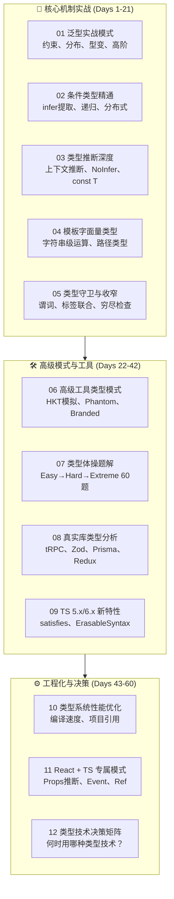

# TypeScript 类型系统深度掌握

:::tip 专题定位
本专题是与 **Svelte Signals 编译器生态**、**TypeScript 类型系统深度专题** 同等级别的旗舰内容，目标是为前端/全栈工程师提供一份关于 TypeScript 类型系统的**实战模式库**。

> **核心主张**：类型系统不是语法糖，而是**可复用的设计模式**。本专题从 [Total TypeScript](https://www.totaltypescript.com/)、[Type Challenges](https://github.com/type-challenges/type-challenges) 和真实库源码（tRPC、Zod、Prisma）中提取可复用的类型模式，让你在面对任何类型问题时都有成熟的解决方案。
:::

---

## 全景概览

---

## 60天学习路径

| 阶段 | 天数 | 章节 | 目标 | 预计耗时 |
|------|------|------|------|----------|
| **机制实战期** | Day 1-5 | [01 泛型实战模式](./01-generics-patterns.md) | 掌握约束、默认参数、分布条件、型变规则；能设计可复用的泛型工具 | 10h |
| | Day 6-10 | [02 条件类型精通](./02-conditional-types-mastery.md) | 精通 `extends ? :`、infer 提取、递归条件、分布式条件；能实现 `ReturnType`、`TupleToUnion` 等工具 | 10h |
| | Day 11-15 | [03 类型推断深度](./03-type-inference-deep-dive.md) | 理解上下文推断、泛型推断、最佳公共类型、`as const`、`satisfies`、`NoInfer<T>` | 8h |
| | Day 16-19 | [04 模板字面量类型](./04-template-literary-types.md) | 掌握字符串级类型运算、路径类型解析、事件名类型生成 | 6h |
| | Day 20-21 | [05 类型守卫与收窄](./05-type-guards-narrowing.md) | 精通自定义类型谓词、标签联合、穷尽检查、类型断言最佳实践 | 6h |
| **模式工具期** | Day 22-28 | [06 高级工具类型模式](./06-advanced-utility-patterns.md) | 掌握 HKT 高阶类型模拟、Phantom 类型、Branded 类型、Opaque 类型 | 10h |
| | Day 29-35 | [07 类型体操题解](./07-type-challenges-workbook.md) | 完成 60 道渐进式类型体操题，从 Easy 到 Extreme | 14h |
| | Day 36-42 | [08 真实库类型分析](./08-real-world-library-types.md) | 读懂 tRPC、Zod、Prisma、Redux 的核心类型设计 | 10h |
| | Day 43-45 | [09 TS 5.x/6.x 新特性](./09-ts5-ts6-new-features.md) | 掌握 `satisfies`、`NoInfer`、Erasable Syntax、类型导入优化 | 4h |
| **工程决策期** | Day 46-49 | [10 类型系统性能优化](./10-performance-optimization.md) | 诊断编译瓶颈、优化项目引用、减少 .d.ts 体积 | 6h |
| | Day 50-55 | [11 React + TS 专属模式](./11-react-ts-patterns.md) | 精通组件 Props 推断、Event 类型、Ref 类型、Context 类型 | 8h |
| | Day 56-60 | [12 类型技术决策矩阵](./12-decision-matrix.md) | 建立类型技术选型的系统决策框架 | 4h |

---

## 权威资源索引

| 资源 | 链接 | 说明 | 本专题衔接 |
|------|------|------|-----------|
| **TypeScript 官方文档** | [typescriptlang.org](https://www.typescriptlang.org/docs/) | 最权威语言参考 | [前置知识](../typescript-type-system/01-type-system-fundamentals.md) |
| **Total TypeScript** | [totaltypescript.com](https://www.totaltypescript.com/) | Matt Pocock 实战课程 | [08 真实库类型分析](./08-real-world-library-types.md) |
| **Type Challenges** | [GitHub](https://github.com/type-challenges/type-challenges) | 类型体操题库 | [07 类型体操题解](./07-type-challenges-workbook.md) |
| **React TypeScript Cheatsheet** | [cheatsheet](https://react-typescript-cheatsheet.netlify.app/) | React+TS 速查 | [11 React+TS 模式](./11-react-ts-patterns.md) |
| **TypeScript Deep Dive** | [basarat](https://basarat.gitbook.io/typescript/) | 免费深度指南 | 通用参考 |

---

## 前置知识

本专题假设你已掌握：

- TypeScript 基础类型语法（interface、type、联合/交叉类型）
- 基本泛型概念（`function f<T>(x: T): T`）
- 基本编译配置（tsconfig.json）

**如果尚未掌握**，请先学习 [TypeScript 类型系统深度专题](../typescript-type-system/) 的 L0 基础层（Day 0-14）。

---

## 与现有模块的关联

| 本专题章节 | 关联的现有模块 | 关联方式 |
|-----------|--------------|---------|
| 01-05 核心机制 | `website/typescript-type-system/`（L1 核心机制层） | 本专题聚焦**实战模式**，理论专题聚焦**系统教学** |
| 06-08 高级模式 | `50-examples/50.3-advanced/compiler-workshop/`（M3-M5） | 编译器工作坊偏**底层实现**，本专题偏**应用模式** |
| 07 类型体操 | `20-code-lab/20.1-fundamentals-lab/language-core/01-types/` | 配套练习 |
| 10 性能优化 | `website/typescript-type-system/17-tsconfig-complete.md` | 进阶参考 |
| 11 React+TS | `website/patterns/react-patterns.md` | 类型层补充 |
