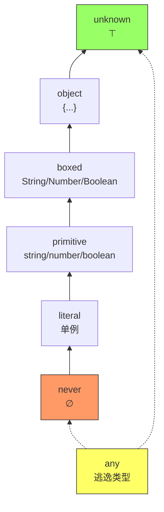
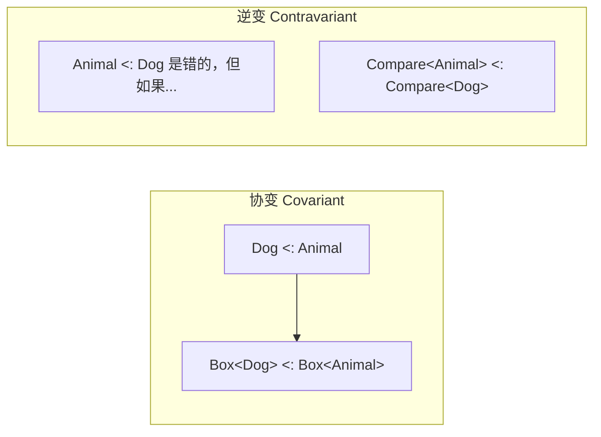

# 01 类型系统基础 — 类型即集合

:::tip 本章核心
**类型是值的集合**。TypeScript 的类型系统本质上是一个基于**结构化子类型**的集合代数系统。掌握这一观点，比记住 100 条语法规则更有价值。
:::

---

## 1.1 类型即集合：TypeScript 的第一性原理

在 TypeScript 中，每个类型都可以被看作一个**值的集合**：

| 类型 | 值的集合 |
|------|----------|
| `never` | 空集 `∅` |
| `"hello"` | 单例集合 `{"hello"}` |
| `string` | 所有字符串的集合（无限集） |
| `string \| number` | 字符串集合与数字集合的并集 |
| `string & number` | 字符串集合与数字集合的交集（空集 → `never`） |
| `unknown` | 全集：所有可能值的集合 |
| `any` | 逃逸集：关闭类型检查的特殊类型 |

### 1.1.1 代码示例：集合视角

```ts
// 单例类型（Unit Type）
type Hello = "hello"; // 集合：{"hello"}
const h: Hello = "hello"; // ✅ 属于该集合
const h2: Hello = "world"; // ❌ 不在集合中

// 并集类型（Union）
type StringOrNumber = string | number;
// 集合：Strings ∪ Numbers
const u1: StringOrNumber = "x"; // ✅
const u2: StringOrNumber = 42;  // ✅
const u3: StringOrNumber = true; // ❌ 不在并集中

// 交集类型（Intersection）
type A = { a: string };
type B = { b: number };
type AB = A & B;
// 集合：同时满足 A 和 B 结构的所有对象
const ab: AB = { a: "x", b: 1 }; // ✅
```

### 1.1.2 关键洞察

> **如果一个值属于类型 A 的集合，那么它可以被安全地用在期望类型 A 的任何地方。**

这正是**子类型**（subtyping）的直觉：如果 `A` 的集合是 `B` 集合的子集，那么 `A` 是 `B` 的子类型（`A <: B`）。

```ts
// "hello" <: string <: unknown
// 因为 {"hello"} ⊂ AllStrings ⊂ AllValues

type T1 = "hello" extends string ? true : false;     // true
type T2 = string extends unknown ? true : false;       // true
type T3 = "hello" extends unknown ? true : false;      // true
```

---

## 1.2 类型层级：从 never 到 unknown

TypeScript 的类型可以按集合包含关系排列成一个层级结构：



### 1.2.1 底类型：never

`never` 是**底类型**（bottom type），表示永不可达的代码。其集合为空集。

```ts
// never 可以赋值给任何类型（空集是任何集合的子集）
function throwError(): never {
  throw new Error("fail");
}

const x: string = throwError(); // ✅ never <: string

// 但没有任何类型可以赋值给 never（除了 never 自身）
const n: never = "hello"; // ❌ string 不是 never 的子集
```

**never 的两种产生场景**：

| 场景 | 示例 | 解释 |
|------|------|------|
| 异常终止 | `throw new Error()` | 函数无正常返回 |
| 穷尽检查 | `switch` 的 `default` | 当所有 case 已穷尽时 |

```ts
// 穷尽检查示例
type Shape =
  | { kind: "circle"; radius: number }
  | { kind: "square"; side: number };

function area(s: Shape): number {
  switch (s.kind) {
    case "circle": return Math.PI * s.radius ** 2;
    case "square": return s.side ** 2;
    default:
      // s 的类型被收窄为 never
      const _exhaustive: never = s;
      return _exhaustive;
  }
}
```

### 1.2.2 顶类型：unknown

`unknown` 是**顶类型**（top type），表示任何值。与 `any` 的区别在于：

| 特性 | `unknown` | `any` |
|------|-----------|-------|
| 可以接收任何值 | ✅ | ✅ |
| 可以赋值给任何类型 | ❌（需类型断言或收窄） | ✅ |
| 属性访问/方法调用 | ❌（需先证明类型） | ✅（关闭检查） |
| 类型安全 | ✅ 安全 | ❌ 不安全 |

```ts
function process(x: unknown) {
  // x.toFixed(); // ❌ 无法直接在 unknown 上操作

  if (typeof x === "number") {
    console.log(x.toFixed(2)); // ✅ 类型收窄后
  }
}

function unsafeProcess(x: any) {
  console.log(x.anything.goes()); // ❌ 运行时可能崩溃，但 TS 不报错
}
```

### 1.2.3 逃逸类型：any

`any` 是类型系统中的"黑洞"。它会**双向禁用**类型检查：

```ts
let a: any = 4;
a = "string";        // ✅
a.toFixed();         // ✅（运行时错误！）

let s: string = a;   // ✅（把任何东西给 string）
let n: number = a;   // ✅
```

**any 的传播性**：

```ts
const arr: any[] = [1, "x", true];
const first = arr[0]; // first: any

const obj: { x: any } = { x: 1 };
const { x } = obj;    // x: any
```

**最佳实践**：

- 在迁移 JavaScript 项目时，用 `unknown` 替代 `any` 作为中间状态
- 开启 `noImplicitAny` 防止隐式 any
- 使用 `satisfies` 运算符（TS 4.9+）替代某些 any 场景

```ts
// 用 unknown + 类型守卫替代 any
function parseJSON(json: string): unknown {
  return JSON.parse(json);
}

const data = parseJSON('{"name":"ts"}');
if (typeof data === "object" && data !== null && "name" in data) {
  console.log(data.name); // ✅
}
```

---

## 1.3 子类型关系：结构化子类型

TypeScript 使用**结构化子类型**（structural subtyping）：`A <: B` 当且仅当 `A` 的结构（成员）满足 `B` 的要求。

### 1.3.1 基本规则

```ts
interface Point2D {
  x: number;
  y: number;
}

interface Point3D {
  x: number;
  y: number;
  z: number;
}

// Point3D 有 Point2D 的所有成员 + 额外成员
// 因此 Point3D <: Point2D

const p3d: Point3D = { x: 1, y: 2, z: 3 };
const p2d: Point2D = p3d; // ✅ 子类型可赋值给父类型
```

**规则总结**：

```
A <: B 当且仅当：
  - A 的所有必需属性都存在于 B 中
  - 且对应属性的类型是协变的（见 1.4）
  - 且 A 的方法参数是双变的（默认，strictFunctionTypes 下为逆变）
```

### 1.3.2 反例：名义类型模拟

有时我们希望基于**名称**而非结构区分子类型（例如用户 ID 和订单 ID 都是 string）：

```ts
// ❌ 结构化类型系统下，这二者是等价的！
type UserId = string;
type OrderId = string;

function getUser(id: UserId) { /* ... */ }
const orderId: OrderId = "order-123";
getUser(orderId); // ✅ 不报错，但语义错误！
```

**解决方案： branded types**（详见 *13 高级模式*（待更新））：

```ts
type UserId = string & { __brand: "UserId" };
type OrderId = string & { __brand: "OrderId" };

const userId = "user-123" as UserId;
const orderId = "order-123" as OrderId;

getUser(orderId); // ❌ 类型错误
```

### 1.3.3 可选属性与子类型

可选属性影响子类型关系：

```ts
interface RequiredName {
  name: string;
}

interface OptionalName {
  name?: string;
}

// RequiredName <: OptionalName？
// 因为 {name: string} 可以赋值给 {name?: string}
const r: RequiredName = { name: "ts" };
const o: OptionalName = r; // ✅
```

| 关系 | 是否成立 | 原因 |
|------|----------|------|
| `{name: string} <: {name?: string}` | ✅ | 有值可以赋值给可选 |
| `{name?: string} <: {name: string}` | ❌ | 可能没有 name，不满足必需要求 |
| `{name?: string} <: {}` | ✅ | 可选属性可忽略 |
| `{} <: {name?: string}` | ❌（strictNullChecks）| 可能缺少 name，且属性类型可能不匹配 |

---

## 1.4 变型（Variance）：类型系统的核心机制

**变型**描述的是：当类型参数变化时，构造出的复合类型如何变化。

设有类型 `Box<T>`，如果 `Dog <: Animal`，那么：

- `Box<Dog>` 与 `Box<Animal>` 有什么关系？

这就是变型问题。

### 1.4.1 四种变型



| 变型 | 方向 | 数学符号 | TypeScript 实例 |
|------|------|----------|-----------------|
| **协变** | 同向 | `A <: B ⇒ F<A> <: F<B>` | 对象属性类型、数组元素类型、返回值类型 |
| **逆变** | 反向 | `A <: B ⇒ F<B> <: F<A>` | 函数参数类型（strictFunctionTypes 开启时） |
| **双变** | 双向 | `A <: B ⇒ F<A> <: F<B>` 且反向 | 函数参数类型（strictFunctionTypes 关闭时，默认旧行为） |
| **不变** | 无关 | `A <: B` 不蕴含 `F<A>` 与 `F<B>` 的关系 | `T` 同时出现在协变和逆变位置 |

### 1.4.2 协变：数组与对象属性

```ts
interface Animal { name: string; }
interface Dog extends Animal { breed: string; }

// 数组是协变的（在 TS 中，数组元素是协变位置）
let dogs: Dog[] = [{ name: "Buddy", breed: "Lab" }];
let animals: Animal[] = dogs; // ✅ Dog[] <: Animal[]

animals.push({ name: "Whiskers" }); // 在 Animal[] 层面合法...
// 但 dogs[1] 现在是一只 Cat！这是协变数组的已知问题
```

**注意**：协变数组在写入时是不安全的。TypeScript 允许这种行为是因为 JavaScript 数组本身就是协变的，完全禁止会破坏大量现有代码。

### 1.4.3 逆变：函数参数

开启 `strictFunctionTypes`（推荐）后，函数参数是**逆变**的：

```ts
// 假设我们有一个处理 Animal 的函数
type AnimalHandler = (animal: Animal) => void;
// 和一个处理 Dog 的函数
type DogHandler = (dog: Dog) => void;

// 问：DogHandler <: AnimalHandler 吗？
// 即：需要 AnimalHandler 的地方，能给 DogHandler 吗？

const dogHandler: DogHandler = (dog) => {
  console.log(dog.breed); // 访问 breed 属性
};

const animalHandler: AnimalHandler = dogHandler;
// ❌ strictFunctionTypes 下报错！
// 因为 animalHandler 可能接收到一个非 Dog 的 Animal
// 此时 dog.breed 会崩溃
```

**直觉解释**：

```
DogHandler 要求：给我一只 Dog，我会用 breed 属性
AnimalHandler 承诺：给我任何 Animal，我都能处理

如果你把 DogHandler 当作 AnimalHandler 用，
调用者可能传一只 Cat，而 DogHandler 会崩溃。

因此：DogHandler 不能替代 AnimalHandler。
反向呢？AnimalHandler 能替代 DogHandler 吗？
AnimalHandler 处理所有 Animal，当然能处理 Dog。
所以：AnimalHandler <: DogHandler。

这就是逆变！
```

### 1.4.4 双变：TS 的默认兼容行为

在未开启 `strictFunctionTypes` 时，为了兼容大量 JavaScript 代码，TS 对**方法参数**使用双变（bivariance）：

```ts
class Animal {
  move() {}
}
class Dog extends Animal {
  woof() {}
}

// 方法参数默认是双变的
class Parent {
  handler(animal: Animal) {}
}
class Child {
  handler(dog: Dog) {}
}

const p: Parent = new Child(); // ❓ 旧版 TS 默认允许（双变）
                               // ✅ strictFunctionTypes 下报错
```

**为何方法参数默认双变？** 因为许多经典 OOP 设计模式（如 EventEmitter 的回调）在逆变下会很难用。但这会牺牲类型安全。

| 配置 | 函数参数 | 方法参数 |
|------|----------|----------|
| 无 `strictFunctionTypes` | 双变 | 双变 |
| `strictFunctionTypes` | 逆变 | 双变（兼容性） |

### 1.4.5 不变：同时出现在双向位置

当类型参数同时出现在协变和逆变位置时，该参数是**不变**的：

```ts
interface State<T> {
  get: () => T;      // T 在协变位置（返回值）
  set: (value: T) => void;  // T 在逆变位置（参数）
}

// 由于 T 同时出现在协变和逆变位置，State<T> 对 T 是不变的

type AnimalState = State<Animal>;
type DogState = State<Dog>;

// 无论哪个方向都不成立！
const as: AnimalState = {
  get: () => ({ name: "a" }),
  set: (a) => {},
};

const ds: DogState = as; // ❌ 不成立
```

**变型位置速查表**：

| 位置 | 变型 | 例子 |
|------|------|------|
| 对象属性类型 | 协变 | `{ x: T }` |
| 返回值类型 | 协变 | `() => T` |
| 函数参数类型 | 逆变 | `(x: T) => void` |
| 构造器参数 | 逆变 | `new (x: T) => void` |
| 泛型约束 | 逆变 | `T extends U` |
| 联合类型成员 | 协变 | `T \| U` |
| 交叉类型成员 | 协变 | `T & U` |
| 数组/元组元素 | 协变 | `T[]`, `[T, U]` |

---

## 1.5 类型拓宽（Widening）与收窄（Narrowing）

### 1.5.1 类型拓宽

TypeScript 在推断变量类型时，会将字面量类型**拓宽**到其基类型：

```ts
const a = "hello";      // a 的类型："hello"（const 不拓宽）
let b = "hello";        // b 的类型：string（let 拓宽到基类型）

const c = [1, 2, 3];    // c 的类型：number[]（数组元素拓宽）
const d = [1, 2, 3] as const; // d 的类型：readonly [1, 2, 3]

const e = { x: 1 };     // e 的类型：{ x: number }
const f = { x: 1 } as const;  // f 的类型：{ readonly x: 1 }
```

**拓宽规则表**：

| 场景 | 推断结果 | 阻止方式 |
|------|----------|----------|
| `let x = "a"` | `string` | `let x: "a" = "a"` 或 `const` |
| `const x = "a"` | `"a"` | — |
| `[1, 2]` | `number[]` | `as const` |
| `{x: 1}` | `{x: number}` | `as const` |
| `Math.random() > 0.5 ? 1 : 2` | `1 \| 2`（不拓宽！） | — |

### 1.5.2 类型收窄

TypeScript 使用**控制流分析**（Control Flow Analysis, CFA）在运行时检查处收窄类型：

```ts
function process(value: string | number) {
  // value: string | number

  if (typeof value === "string") {
    // value: string（收窄）
    value.toUpperCase();
  } else {
    // value: number（收窄）
    value.toFixed(2);
  }
}
```

**收窄机制大全**：

| 机制 | 示例 | 适用类型 |
|------|------|----------|
| `typeof` | `typeof x === "string"` | 原始类型 |
| `instanceof` | `x instanceof Date` | 类实例 |
| `in` 操作符 | `"name" in x` | 对象类型 |
| 属性检查 | `x.kind === "circle"` | 可辨识联合 |
| 自定义类型守卫 | `isString(x)` | 任意 |
| 相等性检查 | `x === null` | `null` / `undefined` |
| 真值检查 | `if (x)` | 过滤 `null`/`undefined`/`0`/空字符串 |
| `Array.isArray` | `Array.isArray(x)` | 数组 |
| 赋值收窄 | `x = "hello"` | let 变量 |

```ts
// 自定义类型守卫
type Fish = { swim: () => void };
type Bird = { fly: () => void };

function isFish(pet: Fish | Bird): pet is Fish {
  return (pet as Fish).swim !== undefined;
}

function move(pet: Fish | Bird) {
  if (isFish(pet)) {
    pet.swim(); // ✅ pet: Fish
  } else {
    pet.fly();  // ✅ pet: Bird
  }
}
```

### 1.5.3 可辨识联合（Discriminated Unions）

```ts
type Circle = { kind: "circle"; radius: number };
type Square = { kind: "square"; side: number };
type Triangle = { kind: "triangle"; base: number; height: number };
type Shape = Circle | Square | Triangle;

function area(s: Shape): number {
  switch (s.kind) {
    case "circle":
      // s: Circle
      return Math.PI * s.radius ** 2;
    case "square":
      // s: Square
      return s.side ** 2;
    case "triangle":
      // s: Triangle
      return (s.base * s.height) / 2;
    default:
      // s: never（穷尽检查）
      return s;
  }
}
```

---

## 1.6 健全性（Soundness）与完备性（Completeness）

TypeScript 的设计哲学：**在健全性和实用性之间取得平衡**。

### 1.6.1 类型系统的理想属性

| 属性 | 含义 | TypeScript 的选择 |
|------|------|-------------------|
| **健全性** (Soundness) | 如果程序通过类型检查，则运行时不会发生类型错误 | ❌ 不完全健全（ intentional unsoundness ） |
| **完备性** (Completeness) | 如果程序运行时安全，则一定能通过类型检查 | ❌ 不完备（拒绝一些合法程序） |
| **可判定性** (Decidability) | 类型检查算法一定能在有限时间内终止 | ✅ 可判定（但某些类型可能检查很慢） |

### 1.6.2 TypeScript 的不健全之处

TS 为了兼容 JavaScript 和工程实用性，在几处故意放宽了健全性：

```ts
// 1. 协变数组（写入不安全）
const dogs: Dog[] = [new Dog()];
const animals: Animal[] = dogs;
animals.push(new Cat()); // 类型安全，运行时 dogs[1] 是 Cat！

// 2. 初始化前的变量使用（开启 strictNullChecks 后修复）
let x: string;
console.log(x); // undefined，但类型是 string

// 3. 类型断言（as）
const s = "hello" as unknown as number;
s.toFixed(); // 类型上说OK，运行时崩溃

// 4. any 类型
const a: any = 1;
a.whatever(); // 不报错

// 5. 对象字面量的可选属性
interface Options { debug?: boolean }
function setup(opts: Options) {}
setup({ debug: true, extra: 1 } as Options); // 绕过 excess property check
```

### 1.6.3 为什么不完备？

```ts
// TS 会拒绝这个在运行时完全安全的代码
function f(x: string | number) {
  if (typeof x !== "string") {
    // x: number
    // 但 TS 不会知道这等于 "typeof x === 'number'" 的语义
    console.log(x.toFixed()); // 需要 number 类型，但 x 是 number，OK
  }
}

// 更复杂的不可判定场景
function check<T>(x: T extends string ? "yes" : "no") {
  // T 是泛型时，条件类型可能无法求值
}
```

---

## 1.7 类型等价性

在结构化类型系统中，两个类型等价当且仅当它们具有相同的结构。

### 1.7.1 递归类型等价

```ts
interface A {
  next: A;
}

interface B {
  next: B;
}

// A 和 B 结构相同，因此等价
const a: A = { next: null as any };
const b: B = a; // ✅
```

### 1.7.2 泛型类型的等价

```ts
type Pair<T> = [T, T];

// Pair<number> 和 Pair<number> 显然等价
// Pair<number> 和 [number, number] 也等价
const p1: Pair<number> = [1, 2];
const p2: [number, number] = p1; // ✅
```

### 1.7.3 名义类型的模拟

```ts
// 使用交叉类型创建 branded type
type USD = number & { __currency: "USD" };
type EUR = number & { __currency: "EUR" };

function usd(amount: number): USD {
  return amount as USD;
}

function eur(amount: number): EUR {
  return amount as EUR;
}

const price = usd(100);
const cost = eur(80);

// price + cost; // ❌ 不直接报错，但无法赋值
// 更好的方式详见第13章
```

---

## 1.8 自测题

### 题目 1

```ts
type R = { name: string };
type O = { name?: string };

// 判断以下赋值是否合法（strictNullChecks 开启）
const r: R = { name: "ts" };
const o: O = r;     // (1)
const r2: R = o;    // (2)
const o2: O = {};   // (3)
```

<details>
<summary>答案</summary>

- (1) ✅ `R <: O`，因为 name 从 required 变为 optional 是子类型关系（更严格类型可以赋值给更宽松类型）
- (2) ❌ `O` 可能缺少 `name`，不满足 `R` 的必需属性要求
- (3) ✅ `O` 的 name 是可选的，可以省略

</details>

### 题目 2

```ts
interface Animal { name: string; }
interface Dog extends Animal { breed: string; }

type GetAnimal = () => Animal;
type GetDog = () => Dog;

const getDog: GetDog = () => ({ name: "Buddy", breed: "Lab" });
const getAnimal: GetAnimal = getDog; // 是否合法？为什么？
```

<details>
<summary>答案</summary>

✅ **合法**。返回值位置是**协变**的。`Dog <: Animal`，所以 `() => Dog <: () => Animal`。

</details>

### 题目 3

```ts
type State<T> = {
  get: () => T;
  set: (value: T) => void;
};

// State<Dog> 和 State<Animal> 之间有什么关系？
```

<details>
<summary>答案</summary>

**无任何子类型关系（不变）**。因为 `T` 同时出现在协变位置（`get` 返回值）和逆变位置（`set` 参数）。

</details>

### 题目 4

```ts
function process(x: unknown) {
  if (typeof x === "object" && x !== null) {
    console.log(x.toString());
  }
}
```

`x.toString()` 会报错吗？如何修复？

<details>
<summary>答案</summary>

会报错！`typeof x === "object"` 将 `x` 收窄为 `object | null`，排除 `null` 后变为 `object`。但 `object` 类型没有 `toString` 方法（严格地说，`Object.prototype.toString` 存在，但 TS 的类型定义不允许在 `object` 上调用）。

修复方式：使用类型断言或进一步收窄到具体类型。

```ts
console.log((x as { toString(): string }).toString());
```

</details>

---

## 1.9 本章小结

| 概念 | 一句话总结 |
|------|------------|
| 类型即集合 | 每个类型是值的集合，子类型 = 子集 |
| never | 空集，可赋值给任何类型 |
| unknown | 全集，需收窄后才能操作 |
| any | 逃逸类型，双向关闭检查 |
| 结构化子类型 | 基于结构而非名称判断子类型关系 |
| 协变 | 同向变化：返回值、属性类型 |
| 逆变 | 反向变化：函数参数（strict 模式下） |
| 双变 | 双向允许：方法参数（兼容模式） |
| 不变 | 无关系：同时出现在协变/逆变位置 |
| 类型拓宽 | let / 对象字面量推断为较宽类型 |
| 类型收窄 | 控制流分析收窄联合类型 |

---

## 参考与延伸阅读

1. [TypeScript Handbook: Type Compatibility](https://www.typescriptlang.org/docs/handbook/type-compatibility.html)
2. [TypeScript Handbook: Everyday Types](https://www.typescriptlang.org/docs/handbook/2/everyday-types.html)
3. [Variance in TypeScript](https://www.stephanboyer.com/post/132/what-are-covariance-and-contravariance) — Stephan Boyer
4. [TypeScript 编译器源码：checker.ts `isRelatedTo`](https://github.com/microsoft/TypeScript/blob/main/src/compiler/checker.ts) — 类型关系核心算法
5. [The TypeScript Handbook: Type Widening and Narrowing](https://www.typescriptlang.org/docs/handbook/2/narrowing.html)

---

:::info 下一章
深入 TypeScript 的原始类型世界，探索字面量类型、联合/交叉类型，以及 enum 的陷阱 → [02 原始类型深度](./02-primitive-types.md)
:::
