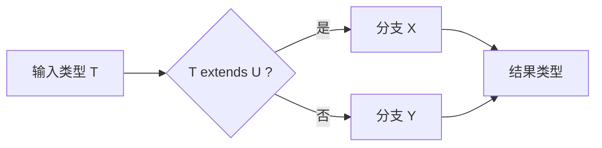

# 06 条件类型 — 分布式条件、never 过滤与模板字面量前置

:::tip 本章核心
条件类型是 TypeScript 类型系统的**逻辑运算单元**。理解分布式条件类型（Distributive Conditional Types）的分配律与 `never` 的过滤机制，是掌握类型级编程（type-level programming）的关键分水岭。本章将揭示类型系统如何执行 if-else 逻辑。
:::

---

## 6.1 条件类型基础语法

条件类型的语法形式为三元表达式：`T extends U ? X : Y`。它在类型层面实现了 if-else 分支逻辑，是类型系统的第一个图灵完备构造块。

```ts
// 最简单的条件类型
type IsString<T> = T extends string ? true : false;

type A = IsString<"hello">;  // ✅ true
type B = IsString<42>;       // ✅ false
type C = IsString<string>;   // ✅ true
type D = IsString<unknown>;  // ✅ false
type E = IsString<any>;      // ✅ boolean（any 特殊行为，见下文）
type F = IsString<never>;    // ✅ never（never 是空联合，见分布式行为）
```

### 6.1.1 条件类型的工作原理



### 6.1.2 条件类型与联合类型

当条件类型作用于**裸类型参数**（naked type parameter）且输入为联合类型时，TypeScript 会执行**分布式**展开——这是条件类型最重要的特性之一。

```ts
type ToArray<T> = T extends any ? T[] : never;

// 分布式展开："a" | "b" → "a"[] | "b"[]
type A = ToArray<"a" | "b">;
// ✅ "a"[] | "b"[]（注意：不是 ("a" | "b")[]）

// 非分布式（包裹后）
type ToArrayNonDist<T> = [T] extends [any] ? T[] : never;
type B = ToArrayNonDist<"a" | "b">;
// ✅ ("a" | "b")[] — 联合类型作为整体处理
```

---

## 6.2 分布式条件类型（Distributive Conditional Types）

分布式条件类型是 TypeScript 条件类型最精妙的设计之一。当泛型参数以裸类型（naked type）出现在 `extends` 左侧时，联合类型会被**分配律式**展开。

### 6.2.1 分配律的形式化描述

```
对于条件类型 C<T> = T extends U ? X : Y
如果 T = A | B | C，则：
C<T> = C<A> | C<B> | C<C>

即：
(A | B | C) extends U ? X : Y
等价于
(A extends U ? X : Y) | (B extends U ? X : Y) | (C extends U ? X : Y)
```

```ts
// 形式化验证
type Dist<T> = T extends string ? "str" : "non-str";

type R = Dist<string | number | boolean>;
// 展开过程：
// = Dist<string> | Dist<number> | Dist<boolean>
// = "str" | "non-str" | "non-str"
// = "str" | "non-str"
// ✅ "str" | "non-str"
```

### 6.2.2 抑制分布式行为

有时需要让联合类型作为整体参与判断，而非分配展开。方法是将类型参数**包裹**在元组中：

```ts
// 裸类型参数 → 分布式
type Dist<T> = T extends any ? T[] : never;
type D1 = Dist<string | number>;
// ✅ string[] | number[]

// 包裹后的类型参数 → 非分布式
type NonDist<T> = [T] extends [any] ? T[] : never;
type D2 = NonDist<string | number>;
// ✅ (string | number)[]
```

| 写法 | 是否分布式 | 结果（输入 `string \| number`） |
|------|-----------|-------------------------------|
| `T extends U ? X : Y` | ✅ 是 | `X1 \| X2`（逐个分配） |
| `[T] extends [U] ? X : Y` | ❌ 否 | 联合类型整体判断 |
| `(T & {}) extends U ? X : Y` | ❌ 否 | 联合类型整体判断 |
| `keyof T extends U ? X : Y` | ❌ 否 | 非裸类型参数 |

### 6.2.3 分布式的实际应用

```ts
// 提取联合类型中的特定类型
type Extract<T, U> = T extends U ? T : never;

type E1 = Extract<"a" | "b" | "c", "a" | "c">;
// 展开过程：
// = Extract<"a", "a" | "c"> | Extract<"b", "a" | "c"> | Extract<"c", "a" | "c">
// = "a" | never | "c"
// = "a" | "c"
// ✅ "a" | "c"

// 排除联合类型中的特定类型
type Exclude<T, U> = T extends U ? never : T;

type E2 = Exclude<"a" | "b" | "c", "a" | "c">;
// 展开过程：
// = Exclude<"a", ...> | Exclude<"b", ...> | Exclude<"c", ...>
// = never | "b" | never
// = "b"
// ✅ "b"
```

---

## 6.3 never 过滤机制

`never` 在联合类型中具有**absorptive（吸收）**特性：`T | never = T`。这使得它成为条件类型中"过滤"的理想工具。

### 6.3.1 never 的吸收律

```ts
type A = string | never;           // ✅ string
type B = number | never | boolean; // ✅ number | boolean
type C = never;                    // ✅ never
type D = never | never;            // ✅ never
```

### 6.3.2 使用 never 进行类型过滤

```ts
// 过滤出非 null/undefined 的类型
type NonNullable<T> = T extends null | undefined ? never : T;

type N1 = NonNullable<string | null | undefined>;
// = NonNullable<string> | NonNullable<null> | NonNullable<undefined>
// = string | never | never
// = string
// ✅ string

// 过滤出对象类型（排除原始类型）
type ObjectOnly<T> = T extends object ? T : never;

type O1 = ObjectOnly<string | { a: 1 } | number | [1, 2]>;
// = never | { a: 1 } | never | [1, 2]
// = { a: 1 } | [1, 2]
// ✅ { a: 1 } | [1, 2]

// 过滤出函数类型
type FunctionOnly<T> = T extends (...args: any[]) => any ? T : never;

type F1 = FunctionOnly<string | (() => void) | number>;
// ✅ (() => void)
```

### 6.3.3 never 在分布式条件中的特殊行为

```ts
// never 被视为空联合类型，因此分布式条件类型作用于 never 时：
// 分配律展开产生空联合，结果直接为 never
type Dist<T> = T extends any ? [T] : never;
type N = Dist<never>;
// ✅ never（不是 [never]！）

// 解释：never = 空联合，对空联合进行分配得到空结果
// 数学类比：对所有空集合的元素执行操作，结果仍为空集合

// 如果需要保留 never，使用非分布式版本
type NonDistNever<T> = [T] extends [never] ? [T] : T extends any ? [T] : never;
type N2 = NonDistNever<never>; // ✅ [never]
```

---

## 6.4 类型分配律的深入理解

### 6.4.1 分配律的完整形式

```ts
// 一元条件类型的分配律
type F<T> = T extends U ? A : B;
// F<X | Y> = F<X> | F<Y>

// 二元条件类型的分配律（只有左侧参数分配）
type G<T, U> = T extends U ? A : B;
// G<X | Y, Z> = G<X, Z> | G<Y, Z>
// 注意：只有 extends 左侧的裸类型参数会被分配
```

### 6.4.2 多个泛型参数的分配行为

```ts
// 只有第一个泛型参数（裸参数）会触发分配
type Check<T, U> = T extends U ? { t: T; u: U } : never;

type R1 = Check<"a" | "b", "a">;
// = Check<"a", "a"> | Check<"b", "a">
// = { t: "a"; u: "a" } | never
// ✅ { t: "a"; u: "a" }

type R2 = Check<"a", "a" | "b">;
// ✅ { t: "a"; u: "a" | "b" }（U 不触发分配）
```

### 6.4.3 反向约束模式

```ts
// 判断 T 是否是 U 的子类型
type IsSubtype<T, U> = T extends U ? true : false;

// 判断两个类型是否相等（通过双向子类型判断）
type IsEqual<T, U> = [T] extends [U] ? ([U] extends [T] ? true : false) : false;

type E1 = IsEqual<string, string>;     // ✅ true
type E2 = IsEqual<string, "hello">;    // ✅ false
type E3 = IsEqual<"hello", "hello">;   // ✅ true
type E4 = IsEqual<any, unknown>;       // ✅ false
type E5 = IsEqual<never, never>;       // ✅ true
type E6 = IsEqual<any, any>;           // ✅ true

// 更严格的 Equal（处理 any 的边界情况）
type StrictEqual<T, U> =
  (<V>() => V extends T ? 1 : 2) extends
  (<V>() => V extends U ? 1 : 2) ? true : false;
```

---

## 6.5 条件类型与 infer 的深度结合

条件类型与 `infer` 结合，构成了 TypeScript 类型系统的**模式匹配**能力。编译器在评估条件类型时，会尝试从 `extends` 右侧的类型模式中"提取"类型信息。

### 6.5.1 从函数类型中提取信息

```ts
// 提取返回类型
type ReturnType<T> = T extends (...args: any[]) => infer R ? R : never;

// 提取参数类型
type Parameters<T> = T extends (...args: infer P) => any ? P : never;

// 提取 this 类型
type ThisParameterType<T> = T extends (this: infer U, ...args: any[]) => any ? U : unknown;

// 提取构造函数参数
type ConstructorParameters<T> = T extends new (...args: infer P) => any ? P : never;

// 提取实例类型
type InstanceType<T> = T extends new (...args: any[]) => infer R ? R : any;

// 验证
function greet(name: string, age: number): string {
  return `Hello ${name}`;
}

type R = ReturnType<typeof greet>;      // ✅ string
type P = Parameters<typeof greet>;      // ✅ [string, number]
```

### 6.5.2 从数组/元组中提取信息

```ts
// 提取数组元素类型
type ElementType<T> = T extends readonly (infer U)[] ? U : never;

// 提取元组第一个元素
type Head<T extends readonly any[]> = T extends readonly [infer H, ...any[]] ? H : never;

// 提取元组最后一个元素
type Last<T extends readonly any[]> = T extends readonly [...any[], infer L] ? L : never;

// 提取元组长度
type Length<T extends readonly any[]> = T extends readonly any[] ? T['length'] : never;

// 验证
type H = Head<[string, number, boolean]>; // ✅ string
type L = Last<[string, number, boolean]>; // ✅ boolean
type Len = Length<[1, 2, 3]>;             // ✅ 3
type Len0 = Length<[]>;                   // ✅ 0
```

### 6.5.3 从字符串中提取信息

```ts
// 提取特定前缀后的部分
type RemovePrefix<T, P extends string> = T extends `${P}${infer R}` ? R : T;

type R1 = RemovePrefix<"user_name", "user_">; // ✅ "name"
type R2 = RemovePrefix<"app_name", "user_">;  // ✅ "app_name"（不匹配）

// 提取文件扩展名
type FileExtension<T extends string> = T extends `${string}.${infer Ext}` ? Ext : never;

type F1 = FileExtension<"document.pdf">;   // ✅ "pdf"
type F2 = FileExtension<"archive.tar.gz">; // ✅ "tar.gz"
type F3 = FileExtension<"README">;         // ✅ never

// 提取两端的引号
type Unquote<T extends string> = T extends `"${infer V}"` ? V : T;
type U1 = Unquote<"\"hello\"">; // ✅ "hello"
```

---

## 6.6 模板字面量类型前置

模板字面量类型（Template Literal Types）与条件类型结合，产生了强大的**类型级字符串解析**能力。本章作为前置介绍，第八章将深入展开。

### 6.6.1 基础模板字面量类型

```ts
// 字符串字面量拼接
type EventName<T extends string> = `on${Capitalize<T>}`;

type E1 = EventName<"click">;      // ✅ "onClick"
type E2 = EventName<"mouseMove">;  // ✅ "onMouseMove"

// 联合类型的展开
type ClickEvent = EventName<"click" | "dblclick">;
// ✅ "onClick" | "onDblclick"
```

### 6.6.2 模板字面量与条件类型结合

```ts
// 从事件处理器名反推事件名
type EventFromHandler<T extends string> = T extends `on${infer E}` ? Uncapitalize<E> : never;

type EH1 = EventFromHandler<"onClick">;      // ✅ "click"
type EH2 = EventFromHandler<"onMouseMove">;  // ✅ "mouseMove"
type EH3 = EventFromHandler<"handleClick">;  // ✅ never

// 判断字符串是否以特定前缀开头
type StartsWith<T extends string, P extends string> = T extends `${P}${string}` ? true : false;

type S1 = StartsWith<"user_profile", "user_">; // ✅ true
type S2 = StartsWith<"admin_panel", "user_">;  // ✅ false

// 判断字符串是否以特定后缀结尾
type EndsWith<T extends string, E extends string> = T extends `${string}${E}` ? true : false;

type EW1 = EndsWith<"component.tsx", ".tsx">; // ✅ true
type EW2 = EndsWith<"component.jsx", ".tsx">; // ✅ false
```

### 6.6.3 路径参数提取

```ts
// 提取动态路由参数
type ExtractParams<T extends string> =
  T extends `${string}:${infer Param}/${infer Rest}`
    ? Param | ExtractParams<Rest>
    : T extends `${string}:${infer Param}`
      ? Param
      : never;

type P1 = ExtractParams<"/users/:id">;                    // ✅ "id"
type P2 = ExtractParams<"/users/:id/posts/:postId">;      // ✅ "id" | "postId"
type P3 = ExtractParams<"/api/v1/status">;                // ✅ never
```

---

## 6.7 条件类型的短路评估

TypeScript 条件类型在编译时会进行**短路评估**，但某些情况下会发生**延迟评估**（deferred evaluation）。

### 6.7.1 立即评估 vs 延迟评估

```ts
// 立即评估：T 和 U 都是具体类型
type A = string extends "hello" ? true : false; // ✅ false（立即）
type B = "hello" extends string ? true : false; // ✅ true（立即）

// 延迟评估：T 是泛型参数，无法立即确定
type Check<T> = T extends "hello" ? true : false;
type C = Check<string>; // ✅ boolean（string 可能包含 "hello"）

type Dist<T> = T extends any ? Check<T> : never;
type D = Dist<"hello" | "world">;
// = Check<"hello"> | Check<"world">
// = true | false
// ✅ boolean
```

### 6.7.2 短路评估的实际影响

```ts
// 在泛型函数中，条件类型可能延迟到调用时才解析
function check<T>(x: T): T extends string ? "string" : "non-string" {
  // 实现签名必须兼容所有可能的分支
  return (typeof x === "string" ? "string" : "non-string") as any;
}

const r1 = check("hello"); // ✅ "string"
const r2 = check(42);      // ✅ "non-string"

// 对于具体类型，条件类型直接解析
function checkString(x: string): string extends string ? "yes" : "no" {
  return "yes"; // ✅ 编译器知道结果一定是 "yes"
}
```

### 6.7.3 延迟评估与联合类型

```ts
// 当条件类型的两侧包含未解析的泛型时，评估被延迟
type Deferred<T, U> = T extends U ? { t: T } : { u: U };

type D1 = Deferred<string, number>; // ✅ { u: number }（立即评估）

// 泛型版本延迟到调用时
type DeferredCheck<T> = Deferred<T, string>;
// 此时结果取决于 T，无法立即确定单一类型
```

---

## 6.8 实战：手写内置工具类型

### 6.8.1 Exclude 与 Extract

```ts
// 从 T 中排除可赋值给 U 的类型
type MyExclude<T, U> = T extends U ? never : T;

// 从 T 中提取可赋值给 U 的类型
type MyExtract<T, U> = T extends U ? T : never;

type E1 = MyExclude<"a" | "b" | "c", "a">;     // ✅ "b" | "c"
type E2 = MyExtract<"a" | "b" | "c", "a" | "d">; // ✅ "a"

// 实际应用：排除特定事件
type DOMEvents = "click" | "mouseover" | "keydown" | "focus" | "blur";
type MouseEvents = "click" | "mouseover";
type NonMouseEvents = MyExclude<DOMEvents, MouseEvents>;
// ✅ "keydown" | "focus" | "blur"
```

### 6.8.2 NonNullable

```ts
// 排除 null 和 undefined
type MyNonNullable<T> = T extends null | undefined ? never : T;

type N1 = MyNonNullable<string | null>;       // ✅ string
type N2 = MyNonNullable<number | undefined>;  // ✅ number
type N3 = MyNonNullable<string | null | undefined>; // ✅ string
type N4 = MyNonNullable<null | undefined>;    // ✅ never
```

### 6.8.3 Pick 与 Omit

```ts
// 从 T 中选取 K 指定的属性
type MyPick<T, K extends keyof T> = {
  [P in K]: T[P];
};

// 从 T 中排除 K 指定的属性
type MyOmit<T, K extends keyof any> = MyPick<T, Exclude<keyof T, K>>;

// 或使用 Key Remapping
type MyOmit2<T, K extends keyof any> = {
  [P in keyof T as P extends K ? never : P]: T[P];
};

interface User {
  name: string;
  age: number;
  email: string;
  password: string;
}

type PublicUser = MyPick<User, "name" | "email">;
// ✅ { name: string; email: string }

type SafeUser = MyOmit<User, "password">;
// ✅ { name: string; age: number; email: string }
```

### 6.8.4 ReturnType 与 Parameters

```ts
// 提取函数返回类型
type MyReturnType<T extends (...args: any[]) => any> =
  T extends (...args: any[]) => infer R ? R : never;

// 提取函数参数类型元组
type MyParameters<T extends (...args: any[]) => any> =
  T extends (...args: infer P) => any ? P : never;

function greet(name: string, age: number): string {
  return `Hello ${name}, ${age}`;
}

type R = MyReturnType<typeof greet>;      // ✅ string
type P = MyParameters<typeof greet>;      // ✅ [string, number]
```

---

## 6.9 嵌套条件类型与类型体操

### 6.9.1 类型级 if-else 链

```ts
// 获取类型的"友好名称"
type TypeName<T> =
  T extends string ? "string" :
  T extends number ? "number" :
  T extends boolean ? "boolean" :
  T extends undefined ? "undefined" :
  T extends null ? "null" :
  T extends Function ? "function" :
  T extends readonly any[] ? "array" :
  "object";

type T1 = TypeName<"hello">;        // ✅ "string"
type T2 = TypeName<42>;             // ✅ "number"
type T3 = TypeName<true>;           // ✅ "boolean"
type T4 = TypeName<() => void>;     // ✅ "function"
type T5 = TypeName<[1, 2]>;         // ✅ "array"
type T6 = TypeName<{ a: 1 }>;       // ✅ "object"
type T7 = TypeName<null>;           // ✅ "null"
type T8 = TypeName<undefined>;      // ✅ "undefined"
```

### 6.9.2 递归条件类型

```ts
// 深度获取对象的所有叶子路径
type DeepPaths<T, K extends keyof T = keyof T> =
  K extends string
    ? T[K] extends object
      ? `${K}` | `${K}.${DeepPaths<T[K]>}`
      : `${K}`
    : never;

interface Data {
  user: {
    name: string;
    age: number;
    address: {
      city: string;
    };
  };
}

type Paths = DeepPaths<Data>;
// ✅ "user" | "user.name" | "user.age" | "user.address" | "user.address.city"
```

### 6.9.3 类型级算术（进阶）

```ts
// 元组长度作为数字（类型体操基础）
type TupleLength<T extends readonly any[]> = T['length'];

type L1 = TupleLength<[1, 2, 3]>; // ✅ 3

// 元组追加（构建数字系统）
type Push<T extends readonly any[], V> = [...T, V];
type P1 = Push<[1, 2], 3>; // ✅ [1, 2, 3]

// 相等判断
type Equal<A, B> = [A] extends [B] ? ([B] extends [A] ? true : false) : false;
```

---

## 6.10 常见陷阱

### 6.10.1 忽略分布式行为导致的意外结果

```ts
// ❌ 期望得到 (string | number)[]，但实际得到 string[] | number[]
type ToArray<T> = T extends any ? T[] : never;
type A = ToArray<string | number>; // string[] | number[]

// ✅ 抑制分布式
type ToArrayFixed<T> = [T] extends [any] ? T[] : never;
type B = ToArrayFixed<string | number>; // (string | number)[]
```

### 6.10.2 any 在条件类型中的特殊行为

```ts
// any 在条件类型中同时匹配 true 和 false 分支
type Check<T> = T extends string ? "yes" : "no";
type A = Check<any>; // ✅ "yes" | "no"

// 这是因为 any 既是任何类型的子类型，也是任何类型的超类型
// 因此 any extends string 既可以为真也可以为假

// 实际影响：泛型函数中使用 any 参数会导致返回类型变为联合
type Result = Check<any>; // "yes" | "no" — 通常不是预期行为
```

### 6.10.3 never 的分布式陷阱

```ts
// 对 never 应用分布式条件类型，结果不是 [never]，而是 never
type Dist<T> = T extends any ? [T] : never;
type N = Dist<never>; // ✅ never（不是 [never]）

// 如果需要保留 never，使用非分布式版本
type NonDist<T> = [T] extends [never] ? [T] : T extends any ? [T] : never;
type N2 = NonDist<never>; // ✅ [never]
```

### 6.10.4 条件类型在函数实现中的限制

```ts
// ❌ 不能直接返回条件类型分支的并集作为实现签名
function process<T>(x: T): T extends string ? number : boolean {
  // 错误：不能将 number | boolean 赋值给条件类型
  // return typeof x === "string" ? 1 : true;
}

// ✅ 需要使用函数重载或类型断言
function process(x: string): number;
function process(x: any): boolean;
function process(x: any): any {
  return typeof x === "string" ? 1 : true;
}

// ✅ 或者使用类型断言（不那么安全）
function process2<T>(x: T): T extends string ? number : boolean {
  return (typeof x === "string" ? 1 : true) as any;
}
```

### 6.10.5 裸类型参数的误判

```ts
// ❌ 误以为自己写的是裸类型参数，实际上不是
type NotNaked<T> = keyof T extends string ? true : false;
// keyof T 不是裸类型参数 T，所以不会触发分配

type N = NotNaked<{ a: 1 } | { b: 2 }>;
// keyof ({ a: 1 } | { b: 2 }) = "a" | "b"
// "a" | "b" extends string = true
// ✅ true（不是 true | true）
```

---

## 6.11 自我检测

### 题目 1

```ts
type F<T> = T extends any ? { x: T } : never;
type R = F<string | number>;
```

`R` 的类型是什么？

<details>
<summary>答案</summary>

`R` 的类型是 `{ x: string } | { x: number }`。

由于 `T` 是裸类型参数，联合类型会被分配展开：
`F<string> | F<number>` = `{ x: string } | { x: number }`。

注意不是 `{ x: string | number }`。

</details>

### 题目 2

```ts
type IsNever<T> = T extends never ? true : false;
type R = IsNever<never>;
```

`R` 的类型是什么？为什么？

<details>
<summary>答案</summary>

`R` 的类型是 `never`。

因为 `never` 被视为空联合类型。分布式条件类型作用于空联合时，对空集合进行分配，结果仍然是空联合，即 `never`。

如果需要正确判断 never，应使用非分布式版本：

```ts
type IsNeverFixed<T> = [T] extends [never] ? true : false;
type R2 = IsNeverFixed<never>; // ✅ true
```

</details>

### 题目 3

手写一个 `OmitByValue<T, V>`，从对象类型 T 中排除所有值类型为 V 的属性。

<details>
<summary>答案</summary>

```ts
type OmitByValue<T, V> = {
  [K in keyof T as T[K] extends V ? never : K]: T[K];
};

// 测试
interface User {
  name: string;
  age: number;
  email: string;
  active: boolean;
}

type R = OmitByValue<User, string>;
// ✅ { age: number; active: boolean }
```

关键点：

1. 使用 `as` 进行键重映射（TypeScript 4.1+）
2. 条件类型 `T[K] extends V ? never : K` 过滤值类型为 V 的键
3. `never` 作为键名会被过滤掉

如果要排除可赋值给 V 的所有子类型（更严格），使用 `[T[K]] extends [V]` 抑制分配。

</details>

---

## 6.12 本章小结

| 概念 | 要点 |
|------|------|
| 条件类型语法 | `T extends U ? X : Y`，类型级的 if-else |
| 分布式条件类型 | 裸类型参数 + 联合类型 → 分配律展开 |
| 抑制分布式 | 用 `[T]` 或 `(T & {})` 包裹类型参数 |
| never 过滤 | `T extends U ? never : T` 从联合中移除 U |
| never 的吸收性 | `T \| never = T`，空联合的特殊行为 |
| infer 模式匹配 | 在条件类型中提取子类型信息 |
| 模板字面量前置 | `${infer X}` 实现类型级字符串解析 |
| 短路评估 | 具体类型立即评估，泛型参数延迟评估 |
| any 的特殊性 | any 同时匹配条件类型的两个分支 |
| never 的分布式 | `Dist<never>` 结果为 never 而非预期 |
| 手写工具类型 | Exclude/Extract/Pick/Omit/ReturnType 都基于条件类型 |

---

## 参考与延伸阅读

1. [TypeScript Handbook: Conditional Types](https://www.typescriptlang.org/docs/handbook/2/conditional-types.html)
2. [Distributive Conditional Types](https://www.typescriptlang.org/docs/handbook/2/conditional-types.html#distributive-conditional-types) — TypeScript 官方
3. [Type inference in conditional types](https://www.typescriptlang.org/docs/handbook/2/conditional-types.html#inferring-within-conditional-types)
4. [TypeScript: Conditional Types Explained](https://www.zhenghao.io/posts/ts-conditional-types) — Zhenghao
5. [Mastering TypeScript Conditional Types](https://artsy.github.io/blog/2018/11/21/conditional-types-in-typescript/) — Artsy Engineering
6. [type-challenges](https://github.com/type-challenges/type-challenges) — 条件类型实战题库
7. [Template Literal Types](https://www.typescriptlang.org/docs/handbook/2/template-literal-types.html) — 官方模板字面量类型

---

:::info 下一章
从类型的"逻辑判断"走向"结构变换"——映射类型将带你进入类型级批量操作的世界 → [07 映射类型](./07-mapped-types.md)
:::
