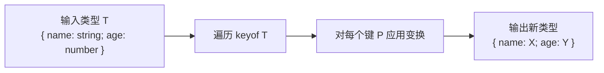
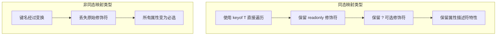

# 07 映射类型 — 内置工具、Key Remapping 与同态映射

:::tip 本章核心
映射类型（Mapped Types）是 TypeScript 对对象类型进行**批量变换**的核心机制。从内置的 `Partial<T>` 到自定义的深度映射，映射类型让类型级别的"批量操作"成为可能，是构建类型安全 API 的基石。
:::

---

## 7.1 映射类型基础语法

映射类型通过 `in` 关键字遍历联合类型的每个成员，为每个成员创建属性。

```ts
// 基础语法
type Mapped<T> = {
  [P in keyof T]: T[P];
};

// 等价于：为 T 的每个键 P 创建属性，类型与 T[P] 相同
// 这实际上就是 identity 映射，结果与 T 相同（但丢失了一些修饰符细节）
```

### 7.1.1 keyof 与 in 的配合

```ts
interface User {
  name: string;
  age: number;
}

// 遍历 User 的所有键
type UserKeys = {
  [P in keyof User]: P;
};
// ✅ { name: "name"; age: "age" } — 值变成了键名字面量

// 遍历时将值类型变为 string
type StringifiedUser = {
  [P in keyof User]: string;
};
// ✅ { name: string; age: string }

// 遍历时交换键和值（值必须是 string 字面量）
type Swapped = {
  [P in keyof User as User[P] extends string ? P : never]: P;
};
// ✅ { name: "name" } — age 的值类型是 number，被过滤
```

### 7.1.2 映射类型的本质



---

## 7.2 内置映射类型详解

TypeScript 内置了多个基于映射类型的工具类型。理解它们的实现原理，是掌握映射类型的最佳途径。

### 7.2.1 Partial&lt;T&gt; — 全部变为可选

```ts
type MyPartial<T> = {
  [P in keyof T]?: T[P];
};

interface User {
  name: string;
  age: number;
  email: string;
}

type PartialUser = MyPartial<User>;
// ✅ {
//   name?: string;
//   age?: number;
//   email?: string;
// }

const u1: PartialUser = { name: "Alice" }; // ✅ 其他属性可省略
const u2: PartialUser = {};                // ✅ 全部可省略
const u3: PartialUser = { name: "Bob", age: 25, email: "bob@example.com" }; // ✅
```

### 7.2.2 Required&lt;T&gt; — 全部变为必选

```ts
type MyRequired<T> = {
  [P in keyof T]-?: T[P]; // -? 移除可选修饰符
};

interface Config {
  host?: string;
  port?: number;
  ssl?: boolean;
}

type RequiredConfig = MyRequired<Config>;
// ✅ {
//   host: string;
//   port: number;
//   ssl: boolean;
// }

const c1: RequiredConfig = { host: "localhost" }; // ❌ 缺少 port 和 ssl
const c2: RequiredConfig = { host: "localhost", port: 3000, ssl: false }; // ✅
```

### 7.2.3 Readonly&lt;T&gt; — 全部变为只读

```ts
type MyReadonly<T> = {
  readonly [P in keyof T]: T[P];
};

interface Point {
  x: number;
  y: number;
}

type FrozenPoint = MyReadonly<Point>;

const p: FrozenPoint = { x: 1, y: 2 };
// p.x = 3; // ❌ Cannot assign to 'x' because it is a read-only property
// p.y = 4; // ❌ 同上
```

### 7.2.4 Pick&lt;T, K&gt; — 选取子集

```ts
type MyPick<T, K extends keyof T> = {
  [P in K]: T[P];
};

interface User {
  name: string;
  age: number;
  email: string;
  password: string;
}

type PublicUser = MyPick<User, "name" | "email">;
// ✅ { name: string; email: string }

// ❌ 只能选取 T 中存在的键
type Bad = MyPick<User, "phone">; // ❌ "phone" 不在 User 中
```

### 7.2.5 Omit&lt;T, K&gt; — 排除子集

```ts
// 使用 Key Remapping 实现（TS 4.1+）
type MyOmit<T, K extends keyof any> = {
  [P in keyof T as P extends K ? never : P]: T[P];
};

// 或者使用 Pick + Exclude（经典实现）
type MyOmitAlt<T, K extends keyof any> = MyPick<T, Exclude<keyof T, K>>;

type SafeUser = MyOmit<User, "password">;
// ✅ { name: string; age: number; email: string }

type UserWithoutAge = MyOmit<User, "age" | "password">;
// ✅ { name: string; email: string }
```

### 7.2.6 Record&lt;K, T&gt; — 构造字典

```ts
type MyRecord<K extends keyof any, T> = {
  [P in K]: T;
};

type PageNames = "home" | "about" | "contact";
type PageInfo = { title: string; path: string };

type Pages = MyRecord<PageNames, PageInfo>;
// ✅ {
//   home: { title: string; path: string };
//   about: { title: string; path: string };
//   contact: { title: string; path: string };
// }

const pages: Pages = {
  home: { title: "Home", path: "/" },
  about: { title: "About", path: "/about" },
  contact: { title: "Contact", path: "/contact" },
  // ❌ 不能省略任何键，也不能添加额外键
};
```

### 7.2.7 内置映射类型对比表

| 工具类型 | 作用 | 核心语法 | 结果示例 |
|----------|------|----------|----------|
| `Partial<T>` | 所有属性变为可选 | `[P in keyof T]?: T[P]` | `{ name?: string }` |
| `Required<T>` | 所有属性变为必选 | `[P in keyof T]-?: T[P]` | `{ name: string }` |
| `Readonly<T>` | 所有属性变为只读 | `readonly [P in keyof T]: T[P]` | `readonly name: string` |
| `Pick<T, K>` | 选取指定属性 | `[P in K]: T[P]` | 子集类型 |
| `Omit<T, K>` | 排除指定属性 | 使用 `as` 或 `Pick+Exclude` | 排除后的类型 |
| `Record<K, T>` | 构造同构字典 | `[P in K]: T` | 所有值同类型 |

---

## 7.3 映射类型修饰符

映射类型支持 `readonly` 和 `?` 修饰符的添加（`+`）与移除（`-`）。这是 TypeScript 类型变换的精细控制机制。

### 7.3.1 修饰符语法

```ts
// 添加 readonly（+ 可省略）
type AddReadonly<T> = {
  +readonly [P in keyof T]: T[P];
};

// 移除 readonly
type RemoveReadonly<T> = {
  -readonly [P in keyof T]: T[P];
};

// 添加可选（+ 可省略）
type AddOptional<T> = {
  +? [P in keyof T]: T[P];
};

// 移除可选（即变为必选）
type RemoveOptional<T> = {
  -? [P in keyof T]: T[P];
};
```

### 7.3.2 实际应用

```ts
interface MutableConfig {
  host: string;
  port: number;
}

// 冻结配置
type FrozenConfig = Readonly<MutableConfig>;
const frozen: FrozenConfig = { host: "localhost", port: 3000 };
// frozen.host = "other"; // ❌ 只读属性

// 解冻（移除 readonly）
type Thawed<T> = {
  -readonly [P in keyof T]: T[P];
};
type BackToMutable = Thawed<FrozenConfig>;
// ✅ { host: string; port: number }

const thawed: BackToMutable = { host: "other", port: 8080 }; // ✅
```

### 7.3.3 同时操作多个修饰符

```ts
// 同时移除 readonly 和 optional
type Normalize<T> = {
  -readonly [P in keyof T]-?: T[P];
};

interface Messy {
  readonly name?: string;
  readonly age?: number;
}

type Clean = Normalize<Messy>;
// ✅ { name: string; age: number } — 既非只读也非可选

const c: Clean = { name: "Alice", age: 30 }; // ✅
// const c2: Clean = { name: "Bob" }; // ❌ 缺少 age
```

---

## 7.4 Key Remapping via `as`

TypeScript 4.1 引入了 `as` 子句，允许在映射过程中**重映射键名**，这是映射类型能力的重大扩展。

### 7.4.1 基础键重映射

```ts
// 将所有键变为大写版本
type UppercaseKeys<T> = {
  [P in keyof T as Uppercase<string & P>]: T[P];
};

interface User {
  name: string;
  age: number;
}

type UpperUser = UppercaseKeys<User>;
// ✅ { NAME: string; AGE: number }
```

### 7.4.2 过滤属性

```ts
// 只保留 string 类型的属性
type StringProps<T> = {
  [P in keyof T as T[P] extends string ? P : never]: T[P];
};

interface Mixed {
  name: string;
  age: number;
  email: string;
  active: boolean;
}

type OnlyStrings = StringProps<Mixed>;
// ✅ { name: string; email: string }
// age 和 active 被过滤掉（键映射为 never）
```

### 7.4.3 键名变换

```ts
// 为所有属性名添加前缀
type AddPrefix<T, Prefix extends string> = {
  [P in keyof T as `${Prefix}${string & P}`]: T[P];
};

type PrefixedUser = AddPrefix<User, "user_">;
// ✅ { user_name: string; user_age: number }

// 从 getter 方法名提取属性名
type Getters<T> = {
  [P in keyof T as `get${Capitalize<string & P>}`]: () => T[P];
};

type UserGetters = Getters<User>;
// ✅ { getName: () => string; getAge: () => number }
```

### 7.4.4 复杂键重映射模式

```ts
// 从事件名映射到处理器名
type EventHandlers<T extends string> = {
  [P in T as `on${Capitalize<P>}`]: (event: P) => void;
};

type Handlers = EventHandlers<"click" | "mouseover" | "keydown">;
// ✅ {
//   onClick: (event: "click") => void;
//   onMouseover: (event: "mouseover") => void;
//   onKeydown: (event: "keydown") => void;
// }

// 双重过滤：只保留函数类型的 getter
type GetterReturns<T> = {
  [P in keyof T as P extends `get${string}`
    ? T[P] extends () => infer R
      ? P
      : never
    : never]:
  T[P] extends () => infer R ? R : never;
};
```

---

## 7.5 同态映射类型（Homomorphic Mapped Types）

当映射类型满足特定结构时，TypeScript 将其识别为**同态映射类型**，从而保留原类型的修饰符和属性特性。

### 7.5.1 同态映射的定义

满足以下条件的映射类型是同态的：

- 形式为 `{ [P in keyof T]: ... }`（直接使用 `keyof T`）
- 或者带有 `as` 子句但键仍基于 `keyof T`

```ts
// ✅ 同态映射：保留可选性和 readonly
type Homomorphic<T> = {
  [P in keyof T]: T[P];
};

interface Source {
  readonly name: string;
  age?: number;
}

type H = Homomorphic<Source>;
// ✅ { readonly name: string; age?: number } — 修饰符保留！

// ❌ 非同态映射：不保留修饰符
type NonHomomorphic<T> = {
  [P in keyof T as `_${string & P}`]: T[P];
};

type NH = NonHomomorphic<Source>;
// ✅ { _name: string; _age: number } — 注意 age 不再是可选！
```

### 7.5.2 同态映射的意义



### 7.5.3 保留修饰符的技巧

```ts
// 需要变换键名但又想保留可选性？
type PreserveOptional<T> = {
  [P in keyof T as `_${string & P}`]+?: T[P]; // 显式添加 ?
};

// 或者使用工具类型组合
type WithPrefix<T> = {
  [P in keyof T as `_${string & P}`]: T[P];
};

// 不够精确的方式：全部变为可选（会过度）
type PreserveAll<T> = Partial<WithPrefix<T>>;
```

---

## 7.6 映射类型与条件类型结合

映射类型和条件类型是 TypeScript 类型系统的两大支柱，它们的组合产生了极其强大的表达能力。

### 7.6.1 条件映射值类型

```ts
// 将所有 string 属性变为 number，其他保持不变
type StringToNumber<T> = {
  [P in keyof T]: T[P] extends string ? number : T[P];
};

interface Mixed {
  name: string;
  age: number;
  active: boolean;
}

type Converted = StringToNumber<Mixed>;
// ✅ { name: number; age: number; active: boolean }
```

### 7.6.2 过滤 + 映射组合

```ts
// 选取函数类型的属性，并将其变为它们的返回类型
type FunctionReturns<T> = {
  [P in keyof T as T[P] extends (...args: any[]) => any ? P : never]:
    T[P] extends (...args: any[]) => infer R ? R : never;
};

interface Api {
  getUser: () => { name: string };
  saveUser: (user: any) => boolean;
  endpoint: string;
  timeout: number;
}

type Returns = FunctionReturns<Api>;
// ✅ { getUser: { name: string }; saveUser: boolean }
// endpoint 和 timeout 被过滤
```

### 7.6.3 键和值同时变换

```ts
// 提取所有以 get 开头的方法的返回类型，键名去掉 get 前缀
type GetterProperties<T> = {
  [P in keyof T as P extends `get${infer Name}` ? Uncapitalize<Name> : never]:
    T[P] extends () => infer R ? R : never;
};

interface Store {
  getName: () => string;
  getAge: () => number;
  setName: (name: string) => void;
}

type G = GetterProperties<Store>;
// ✅ { name: string; age: number }
```

---

## 7.7 映射类型与模板字面量结合

映射类型与模板字面量类型的结合，使得基于命名约定的类型推导成为可能。

### 7.7.1 CSS 变量类型生成

```ts
type CSSVariable<T extends string> = {
  [P in T as `--${P}`]: string;
};

type ThemeVars = CSSVariable<"primary" | "secondary" | "background">;
// ✅ {
//   "--primary": string;
//   "--secondary": string;
//   "--background": string;
// }

const vars: ThemeVars = {
  "--primary": "#007bff",
  "--secondary": "#6c757d",
  "--background": "#ffffff",
};
```

### 7.7.2 状态派生类型

```ts
type StateMachine<T extends string> = {
  [P in T as `${P}State`]: { value: P; data?: unknown };
};

type LoadingStates = StateMachine<"idle" | "loading" | "success" | "error">;
// ✅ {
//   idleState: { value: "idle"; data?: unknown };
//   loadingState: { value: "loading"; data?: unknown };
//   successState: { value: "success"; data?: unknown };
//   errorState: { value: "error"; data?: unknown };
// }
```

### 7.7.3 API 端点类型生成

```ts
type Endpoints<T extends Record<string, string>> = {
  [K in keyof T as `get${Capitalize<string & K>}`]: () => Promise<T[K]>;
};

interface Schema {
  user: { id: number; name: string };
  posts: { id: number; title: string }[];
}

type Api = Endpoints<Schema>;
// ✅ {
//   getUser: () => Promise<{ id: number; name: string }>;
//   getPosts: () => Promise<{ id: number; title: string }[]>;
// }
```

---

## 7.8 深度映射类型

### 7.8.1 DeepPartial 与 DeepRequired

```ts
// 深度 Partial
type DeepPartial<T> = {
  [P in keyof T]?: T[P] extends object ? DeepPartial<T[P]> : T[P];
};

interface Company {
  name: string;
  address: {
    city: string;
    street: string;
    coordinates: {
      lat: number;
      lng: number;
    };
  };
  ceo: {
    name: string;
    age: number;
  };
}

type PartialCompany = DeepPartial<Company>;
// 所有层级都变为可选：
// {
//   name?: string;
//   address?: {
//     city?: string;
//     street?: string;
//     coordinates?: {
//       lat?: number;
//       lng?: number;
//     };
//   };
//   ceo?: {
//     name?: string;
//     age?: number;
//   };
// }
```

### 7.8.2 更精确的 DeepPartial

```ts
// 区分 object 和数组
type DeepPartial2<T> = T extends readonly any[]
  ? { [K in keyof T]?: DeepPartial2<T[K]> }
  : T extends object
    ? { [P in keyof T]?: DeepPartial2<T[P]> }
    : T;

interface WithArray {
  items: { name: string }[];
  config: { enabled: boolean };
}

type DP = DeepPartial2<WithArray>;
// items 和 config 内部也变为可选
```

### 7.8.3 深度 Readonly 与深度 Mutable

```ts
// 深度 Readonly
type DeepReadonly<T> = {
  readonly [P in keyof T]: T[P] extends object ? DeepReadonly<T[P]> : T[P];
};

// 深度 Required
type DeepRequired<T> = {
  [P in keyof T]-?: T[P] extends object ? DeepRequired<T[P]> : T[P];
};

// 深度 Mutable（移除所有 readonly）
type DeepMutable<T> = {
  -readonly [P in keyof T]: T[P] extends object ? DeepMutable<T[P]> : T[P];
};
```

---

## 7.9 自定义映射模式实战

### 7.9.1 扁平化嵌套对象（一层）

```ts
// 将嵌套对象扁平化一层
type FlattenOneLevel<T> = {
  [K in keyof T as K extends string ? K : never]:
    T[K] extends object
      ? { [P in keyof T[K] as `${string & K}.${string & P}`]: T[K][P] }
      : T[K];
};

// 更简洁的版本
type Flatten<T extends Record<string, any>> = {
  [K in keyof T]: T[K];
};

// 实际扁平化键名
type FlattenKeys<T, Prefix extends string = ""> = T extends object
  ? {
      [K in keyof T as K extends string
        ? `${Prefix}${K}`
        : never]:
        T[K] extends object ? FlattenKeys<T[K], `${Prefix}${K}.`> : T[K];
    }
  : T;
```

### 7.9.2 反转对象键值

```ts
// 将值类型为字面量字符串的属性反转（值变键，键变值）
type Invert<T extends Record<string, string>> = {
  [P in keyof T as T[P]]: P;
};

const statusMap = {
  success: "200",
  notFound: "404",
  error: "500",
} as const;

type StatusCodes = Invert<typeof statusMap>;
// ✅ { "200": "success"; "404": "notFound"; "500": "error" }
```

### 7.9.3 从联合类型构造枚举对象

```ts
type EnumLike<T extends string> = {
  [K in T]: K;
};

type Colors = EnumLike<"red" | "green" | "blue">;
// ✅ { red: "red"; green: "green"; blue: "blue" }

const Colors: Colors = {
  red: "red",
  green: "green",
  blue: "blue",
};
```

---

## 7.10 性能考量与最佳实践

### 7.10.1 编译性能影响

```ts
// ❌ 过度嵌套的映射类型可能导致编译缓慢
type VeryDeep<T> = {
  [P in keyof T]: T[P] extends object
    ? VeryDeep<T[P]> extends object
      ? VeryDeep<VeryDeep<T[P]>>
      : T[P]
    : T[P];
};

// ✅ 控制递归深度，避免指数级膨胀
type SafeDeep<T> = T extends object
  ? { [P in keyof T]: SafeDeep<T[P]> }
  : T;
```

### 7.10.2 类型复杂度控制

| 实践 | 说明 |
|------|------|
| 避免深层嵌套映射 | 超过 3-4 层的嵌套映射会显著影响编译性能 |
| 使用显式类型注解 | 帮助 TypeScript 减少推断负担 |
| 优先使用内置工具类型 | 内置类型经过高度优化 |
| 延迟复杂类型计算 | 通过接口而非类型别名拆分复杂结构 |
| 避免过大的联合类型 | 映射类型在联合类型上展开可能导致类型膨胀 |

### 7.10.3 常见错误

```ts
// ❌ 错误：在 as 子句中引用了不存在的类型
type Bad<T> = {
  [P in keyof T as U]: T[P]; // ❌ Cannot find name 'U'
};

// ❌ 错误：as 子句的结果不是 string | number | symbol
type Bad2<T> = {
  [P in keyof T as boolean]: T[P]; // ❌ 键类型必须是 string | number | symbol
};

// ❌ 错误：尝试映射 symbol 键时类型不匹配
type Bad3<T> = {
  [P in keyof T as `${P}`]: T[P]; // ❌ P 可能为 symbol，不能用于模板字面量
};

// ✅ 修复：过滤出 string 键
type Good<T> = {
  [P in keyof T as P extends string ? P : never]: T[P];
};
```

---

## 7.11 自我检测

### 题目 1

```ts
type R<T> = {
  [P in keyof T as T[P] extends string ? P : never]: T[P];
};

interface Test {
  a: string;
  b: number;
  c: string;
}

type Result = R<Test>;
```

`Result` 的类型是什么？

<details>
<summary>答案</summary>

`Result` 的类型是 `{ a: string; c: string }`。

键重映射的 `as` 子句中，`T[P] extends string ? P : never` 会过滤掉值类型不为 string 的属性。`b` 的值类型是 `number`，所以对应的键变为 `never`，该属性被移除。

</details>

### 题目 2

为什么以下两个类型结果不同？

```ts
type A<T> = { [P in keyof T]: T[P] };
type B<T> = { [P in keyof T as `_${string & P}`]: T[P] };

interface Source {
  readonly name?: string;
}
```

<details>
<summary>答案</summary>

- `A<Source>` 是**同态映射类型**，结果是 `{ readonly name?: string }`，保留了 `readonly` 和 `?` 修饰符。
- `B<Source>` 由于使用了 `as` 子句变换键名，**不再是同态映射类型**，结果是 `{ _name: string }`，丢失了 `readonly` 和 `?` 修饰符。

如果需要在键变换后保留修饰符，需要显式添加：

```ts
type BFixed<T> = { [P in keyof T as `_${string & P}`]+?: T[P] };
```

</details>

### 题目 3

手写一个 `DeepPick<T, Path extends string>`，从嵌套对象中按路径选取属性。

<details>
<summary>答案</summary>

```ts
type DeepPick<T, Path extends string> = Path extends `${infer K}.${infer Rest}`
  ? K extends keyof T
    ? { [P in K]: DeepPick<T[K], Rest> }
    : never
  : Path extends keyof T
    ? { [P in Path]: T[Path] }
    : never;

interface Nested {
  user: {
    profile: {
      name: string;
      age: number;
    };
  };
}

type R = DeepPick<Nested, "user.profile.name">;
// ✅ { user: { profile: { name: string } } }
```

</details>

---

## 7.12 本章小结

| 概念 | 要点 |
|------|------|
| 映射类型语法 | `[P in keyof T]: T[P]` 遍历对象键并变换 |
| Partial/Required/Readonly | 通过 `?` 和 `readonly` 修饰符批量控制属性特性 |
| Pick/Omit | 选取或排除指定属性子集 |
| Record | 构造键到同类型的映射字典 |
| 修饰符加减 | `+?` / `-?` / `+readonly` / `-readonly` |
| Key Remapping | `as` 子句重映射键名，支持过滤和变换 |
| 同态映射 | 直接使用 `keyof T` 时保留修饰符；键变换后丢失 |
| 映射 + 条件 | 值类型条件判断实现更复杂的变换逻辑 |
| 映射 + 模板字面量 | 基于命名约定生成新的键名 |
| 深度映射 | 递归映射类型实现深层变换，注意编译性能 |
| 性能最佳实践 | 控制递归深度、优先使用内置类型、避免过大联合 |

---

## 参考与延伸阅读

1. [TypeScript Handbook: Mapped Types](https://www.typescriptlang.org/docs/handbook/2/mapped-types.html)
2. [Key Remapping in Mapped Types](https://www.typescriptlang.org/docs/handbook/2/mapped-types.html#key-remapping-via-as) — TS 4.1 新特性
3. [Mapping Modifiers](https://www.typescriptlang.org/docs/handbook/2/mapped-types.html#mapping-modifiers)
4. [Homomorphic Mapped Types](https://stackoverflow.com/questions/59790582/what-are-homomorphic-mapped-types) — Stack Overflow 深度讨论
5. [TypeScript Utility Types Source](https://github.com/microsoft/TypeScript/blob/main/src/lib/es5.d.ts) — 内置类型源码
6. [Type Challenges: Mapped Types](https://github.com/type-challenges/type-challenges) — 实战练习

---

:::info 下一章
映射类型操控结构，模板字面量类型操控字符串——两者结合将解锁类型系统的终极表达力 → [08 模板字面量类型](./08-template-literal-types.md)
:::
