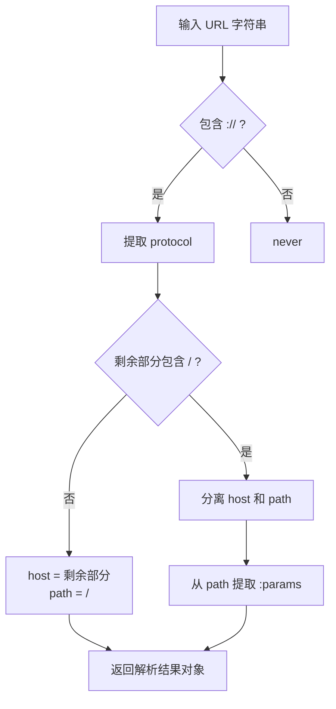

# 08 模板字面量类型 — 字符串操作、类型级解析与实战模式

:::tip 本章核心
模板字面量类型（Template Literal Types）将 TypeScript 类型系统的能力从"结构描述"扩展到"字符串解析"。借助 `${infer X}` 模式匹配，你可以在类型级别实现 URL 解析、路由参数提取、CSS 变量生成等高级模式，是类型体操中最具实战价值的能力之一。
:::

---

## 8.1 模板字面量类型基础

模板字面量类型使用反引号语法，允许将多个字符串字面量类型拼接成新的字符串字面量类型。

```ts
// 基础拼接
type Greeting = "Hello";
type Name = "World";
type Message = `${Greeting}, ${Name}!`;
// ✅ "Hello, World!"

// 联合类型的笛卡尔积展开
type Color = "red" | "blue";
type Size = "small" | "large";
type Style = `${Color}-${Size}`;
// ✅ "red-small" | "red-large" | "blue-small" | "blue-large"

// 三个联合类型的笛卡尔积
type Variant = "primary" | "secondary";
type Mode = "light" | "dark";
type FullStyle = `${Variant}-${Color}-${Mode}`;
// 2 * 2 * 2 = 8 个成员
```

### 8.1.1 与原始字符串字面量的区别

```ts
// 字符串字面量类型：固定值
type Exact = "hello";
const e: Exact = "hello"; // ✅
// const e2: Exact = "hi"; // ❌ Type '"hi"' is not assignable to type '"hello"'

// 模板字面量类型：基于模式生成
type Pattern = `data-${number}`;
const p1: Pattern = "data-42";    // ✅
const p2: Pattern = "data-100";   // ✅
// const p3: Pattern = "data-abc"; // ❌ 必须是数字

// 更复杂的模式
type HexColor = `#${string}`;
const h1: HexColor = "#ff0000"; // ✅
const h2: HexColor = "#abc";    // ✅
// const h3: HexColor = "red";   // ❌ 缺少 # 前缀
```

### 8.1.2 内置字符串操作类型

TypeScript 4.1+ 提供了四个内置的字符串操作类型：

```ts
type S1 = Uppercase<"hello">;     // ✅ "HELLO"
type S2 = Lowercase<"HELLO">;     // ✅ "hello"
type S3 = Capitalize<"hello">;    // ✅ "Hello"
type S4 = Uncapitalize<"Hello">;  // ✅ "hello"

// 联合类型上自动分配
type S5 = Capitalize<"click" | "mouse">; // ✅ "Click" | "Mouse"
type S6 = Uppercase<"yes" | "no">;       // ✅ "YES" | "NO"
```

### 8.1.3 内置字符串操作对比

| 类型 | 作用 | 示例 | 结果 |
|------|------|------|------|
| `Uppercase<T>` | 全部大写 | `"hello"` | `"HELLO"` |
| `Lowercase<T>` | 全部小写 | `"HELLO"` | `"hello"` |
| `Capitalize<T>` | 首字母大写 | `"hello"` | `"Hello"` |
| `Uncapitalize<T>` | 首字母小写 | `"Hello"` | `"hello"` |

---

## 8.2 类型级字符串拼接

模板字面量类型可以在类型级别将多个部分组合成结构化字符串。

### 8.2.1 构造命名规范

```ts
// BEM 风格 CSS 类名
type BEM<
  Block extends string,
  Element extends string | never = never,
  Modifier extends string | never = never
> = `${Block}${Element extends string ? `__${Element}` : ""}${
  Modifier extends string ? `--${Modifier}` : ""
}`;

type Button = BEM<"button">;                        // ✅ "button"
type ButtonIcon = BEM<"button", "icon">;             // ✅ "button__icon"
type ButtonPrimary = BEM<"button", never, "primary">; // ✅ "button--primary"
type ButtonIconPrimary = BEM<"button", "icon", "primary">;
// ✅ "button__icon--primary"
```

### 8.2.2 构造事件名

```ts
// 为 DOM 事件名添加前缀
type DOMEvent<T extends string> = `on${Capitalize<T>}`;

type ClickEvent = DOMEvent<"click">;         // ✅ "onClick"
type MouseMoveEvent = DOMEvent<"mouseMove">; // ✅ "onMouseMove"
type KeyDownEvent = DOMEvent<"keyDown">;     // ✅ "onKeyDown"

// 为状态变更添加后缀
type StateChange<T extends string> = `${T}Changed`;

type NameChanged = StateChange<"name">;  // ✅ "nameChanged"
type AgeChanged = StateChange<"age">;    // ✅ "ageChanged"
```

### 8.2.3 构造环境变量名

```ts
// 构造合法的环境变量名（大写 + 下划线）
type EnvVar<T extends string> = Uppercase<Replace<T, "-", "_">>;

// 辅助类型：递归替换字符
type Replace<
  S extends string,
  From extends string,
  To extends string
> = S extends `${infer L}${From}${infer R}` ? `${L}${To}${Replace<R, From, To>}` : S;

type DBHost = EnvVar<"db-host">;     // ✅ "DB_HOST"
type ApiKey = EnvVar<"api-key">;     // ✅ "API_KEY"
type AppName = EnvVar<"app-name">;   // ✅ "APP_NAME"
```

### 8.2.4 构造路由路径

```ts
// 构造 API 路径
type ApiPath<T extends string> = `/api/v1/${T}`;

type UsersPath = ApiPath<"users">;     // ✅ "/api/v1/users"
type PostsPath = ApiPath<"posts">;     // ✅ "/api/v1/posts"

// 带 ID 的路径
type ResourcePath<T extends string> = `/api/v1/${T}` | `/api/v1/${T}/${number}`;

type UserPaths = ResourcePath<"users">;
// ✅ "/api/v1/users" | "/api/v1/users/number"
```

---

## 8.3 类型级字符串解析

借助 `${infer X}` 模式匹配，模板字面量类型可以像正则表达式一样"解析"字符串结构。

### 8.3.1 提取前缀与后缀

```ts
// 提取特定前缀后的部分
type RemovePrefix<S extends string, P extends string> =
  S extends `${P}${infer R}` ? R : S;

type R1 = RemovePrefix<"user_profile", "user_">;  // ✅ "profile"
type R2 = RemovePrefix<"app_config", "user_">;    // ✅ "app_config"（不匹配）
type R3 = RemovePrefix<"data_123", "data_">;      // ✅ "123"

// 提取特定后缀前的部分
type RemoveSuffix<S extends string, E extends string> =
  S extends `${infer R}${E}` ? R : S;

type R4 = RemoveSuffix<"component.tsx", ".tsx">;  // ✅ "component"
type R5 = RemoveSuffix<"component.jsx", ".tsx">;  // ✅ "component.jsx"（不匹配）
type R6 = RemoveSuffix<"package.json", ".json">;  // ✅ "package"
```

### 8.3.2 拆分字符串

```ts
// 按分隔符拆分一次
type SplitOnce<S extends string, D extends string> =
  S extends `${infer L}${D}${infer R}` ? [L, R] : [S, ""];

type S1 = SplitOnce<"a,b,c", ",">;  // ✅ ["a", "b,c"]
type S2 = SplitOnce<"abc", ",">;    // ✅ ["abc", ""]
type S3 = SplitOnce<"key=value", "=">; // ✅ ["key", "value"]

// 拆分路径
type SplitPath<S extends string> =
  S extends `${infer L}/${infer R}` ? [L, ...SplitPath<R>] : [S];

type P1 = SplitPath<"api/v1/users">;  // ✅ ["api", "v1", "users"]
type P2 = SplitPath<"home">;          // ✅ ["home"]
type P3 = SplitPath<"a/b/c/d">;       // ✅ ["a", "b", "c", "d"]
```

### 8.3.3 字符串模式匹配

```ts
// 判断字符串是否符合特定模式
type StartsWith<S extends string, P extends string> =
  S extends `${P}${string}` ? true : false;

type SW1 = StartsWith<"user_123", "user_">; // ✅ true
type SW2 = StartsWith<"admin_123", "user_">; // ✅ false

// 判断字符串是否以特定后缀结尾
type EndsWith<S extends string, E extends string> =
  S extends `${string}${E}` ? true : false;

type EW1 = EndsWith<"component.tsx", ".tsx">; // ✅ true
type EW2 = EndsWith<"component.jsx", ".tsx">; // ✅ false

// 判断是否包含子串
type Includes<S extends string, Sub extends string> =
  S extends `${string}${Sub}${string}` ? true : false;

type I1 = Includes<"hello world", "world">; // ✅ true
type I2 = Includes<"hello world", "foo">;   // ✅ false
```

---

## 8.4 URL 解析示例

URL 解析是模板字面量类型的经典应用场景，可以在类型级别提取协议、域名、路径和查询参数。

### 8.4.1 提取 URL 组成部分

```ts
// 提取协议
type Protocol<S extends string> =
  S extends `${infer P}://${string}` ? P : never;

type P1 = Protocol<"https://example.com">;       // ✅ "https"
type P2 = Protocol<"ftp://files.example.com">;   // ✅ "ftp"
type P3 = Protocol<"http://localhost:3000">;     // ✅ "http"
type P4 = Protocol<"example.com">;                // ✅ never

// 提取域名
type Host<S extends string> =
  S extends `${string}://${infer H}/${string}` ? H :
  S extends `${string}://${infer H}` ? H :
  never;

type H1 = Host<"https://api.example.com/users">; // ✅ "api.example.com"
type H2 = Host<"https://example.com">;            // ✅ "example.com"
type H3 = Host<"http://localhost:3000/api">;      // ✅ "localhost:3000"
```

### 8.4.2 提取路径参数

```ts
// 提取动态路由参数（:param 格式）
type ExtractParams<S extends string> =
  S extends `${string}:${infer Param}/${infer Rest}`
    ? Param | ExtractParams<Rest>
    : S extends `${string}:${infer Param}`
      ? Param
      : never;

type Params1 = ExtractParams<"/users/:id">;                    // ✅ "id"
type Params2 = ExtractParams<"/users/:id/posts/:postId">;      // ✅ "id" | "postId"
type Params3 = ExtractParams<"/users/:id/posts/:postId/comments/:commentId">;
// ✅ "id" | "postId" | "commentId"
type Params4 = ExtractParams<"/api/v1/status">;                // ✅ never
```

### 8.4.3 完整的 URL 解析器

```ts
type ParseURL<S extends string> =
  S extends `${infer Protocol}://${infer Rest}`
    ? Rest extends `${infer Host}/${infer Path}`
      ? {
          protocol: Protocol;
          host: Host;
          path: `/${Path}`;
          params: ExtractParams<`/${Path}`>;
        }
      : {
          protocol: Protocol;
          host: Rest;
          path: "/";
          params: never;
        }
    : never;

type Parsed1 = ParseURL<"https://api.example.com/users/:id">;
// ✅ {
//   protocol: "https";
//   host: "api.example.com";
//   path: "/users/:id";
//   params: "id";
// }

type Parsed2 = ParseURL<"http://localhost:3000">;
// ✅ {
//   protocol: "http";
//   host: "localhost:3000";
//   path: "/";
//   params: never;
// }
```

### 8.4.4 URL 解析流程图



---

## 8.5 路径解析示例

### 8.5.1 文件路径解析

```ts
// 提取文件扩展名
type FileExtension<P extends string> =
  P extends `${string}.${infer Ext}` ? Ext : never;

type FE1 = FileExtension<"document.pdf">;    // ✅ "pdf"
type FE2 = FileExtension<"archive.tar.gz">;  // ✅ "tar.gz"
type FE3 = FileExtension<"README">;          // ✅ never

// 更精确：只提取最后一段扩展名（递归）
type LastExtension<P extends string> =
  P extends `${string}.${infer Ext}`
    ? Ext extends `${string}.${string}`
      ? LastExtension<Ext>
      : Ext
    : never;

type LE1 = LastExtension<"archive.tar.gz">;  // ✅ "gz"
type LE2 = LastExtension<"app.config.ts">;   // ✅ "ts"

// 提取文件名（不含扩展名）
type Basename<P extends string> =
  P extends `${infer Name}.${string}` ? Basename<Name> : P;

type B1 = Basename<"src/index.ts">; // ✅ "src/index"（可能需要进一步处理）
```

### 8.5.2 对象路径类型安全

```ts
// 从嵌套对象类型生成合法路径字符串
type Path<T, K extends keyof T = keyof T> =
  K extends string
    ? T[K] extends object
      ? `${K}` | `${K}.${Path<T[K]>}`
      : `${K}`
    : never;

interface Data {
  user: {
    name: string;
    address: {
      city: string;
      zip: string;
    };
  };
  config: {
    theme: string;
  };
}

type DataPath = Path<Data>;
// ✅ "user" | "user.name" | "user.address" | "user.address.city" | "user.address.zip"
//    | "config" | "config.theme"
```

### 8.5.3 路径值类型提取

```ts
// 根据路径字符串提取对应值的类型
type PathValue<T, P extends string> =
  P extends `${infer K}.${infer Rest}`
    ? K extends keyof T
      ? PathValue<T[K], Rest>
      : never
    : P extends keyof T
      ? T[P]
      : never;

type V1 = PathValue<Data, "user.name">;          // ✅ string
type V2 = PathValue<Data, "user.address.city">;  // ✅ string
type V3 = PathValue<Data, "config.theme">;       // ✅ string
type V4 = PathValue<Data, "user.nonexistent">;   // ✅ never
```

---

## 8.6 模板字面量与联合类型

模板字面量类型与联合类型结合时，会产生**笛卡尔积**展开效果。

### 8.6.1 笛卡尔积展开

```ts
type Direction = "top" | "bottom" | "left" | "right";
type Property = "margin" | "padding";

type DirectionalProperty = `${Property}-${Direction}`;
// ✅ "margin-top" | "margin-bottom" | "margin-left" | "margin-right"
//    | "padding-top" | "padding-bottom" | "padding-left" | "padding-right"

// 多级联合展开
type State = "hover" | "focus" | "active";
type Modifier = "disabled" | "loading";

type ButtonState = `${"" | `${Modifier}-`}${State}`;
// ✅ "hover" | "focus" | "active"
//    | "disabled-hover" | "disabled-focus" | "disabled-active"
//    | "loading-hover" | "loading-focus" | "loading-active"
```

### 8.6.2 控制联合展开规模

```ts
// ❌ 过大的联合类型会导致编译问题
type A = "a" | "b" | "c";
type B = "1" | "2" | "3" | "4" | "5";
type C = "x" | "y";

type Huge = `${A}-${B}-${C}`;
// 3 * 5 * 2 = 30 个成员，尚可接受
// 但如果每类有 10+ 成员，可能产生数百个联合成员

// ✅ 使用条件类型过滤，控制规模
type Filtered<A, B, C> = `${A}-${B}-${C}`;
// 实际使用时通过条件类型限制输入联合的大小
```

---

## 8.7 模板字面量与条件类型/映射类型结合

### 8.7.1 从事件名映射到处理器

```ts
// 根据事件名联合类型生成事件处理器接口
type EventHandlers<T extends string> = {
  [P in T as `on${Capitalize<P>}`]: (event: P) => void;
};

type ClickEvents = EventHandlers<"click" | "dblclick" | "contextmenu">;
// ✅ {
//   onClick: (event: "click") => void;
//   onDblclick: (event: "dblclick") => void;
//   onContextmenu: (event: "contextmenu") => void;
// }
```

### 8.7.2 CSS 类型安全

```ts
// 生成类型安全的 CSS 自定义属性
type CSSCustomProps<T extends string> = {
  [P in T as `--${P}`]: string;
};

type ThemeColors = CSSCustomProps<"primary" | "secondary" | "background" | "text">;
// ✅ {
//   "--primary": string;
//   "--secondary": string;
//   "--background": string;
//   "--text": string;
// }

const theme: ThemeColors = {
  "--primary": "#007bff",
  "--secondary": "#6c757d",
  "--background": "#ffffff",
  "--text": "#212529",
};
```

### 8.7.3 状态机类型生成

```ts
type StateMachine<S extends string, A extends string> = {
  [State in S]: {
    value: State;
    transitions: {
      [Action in A as `on${Capitalize<Action>}`]?: S;
    };
  };
};

type ToggleMachine = StateMachine<"on" | "off", "toggle" | "reset">;
// ✅ {
//   on: {
//     value: "on";
//     transitions: { onToggle?: "on" | "off"; onReset?: "on" | "off" };
//   };
//   off: {
//     value: "off";
//     transitions: { onToggle?: "on" | "off"; onReset?: "on" | "off" };
//   };
// }
```

---

## 8.8 递归模板字面量类型

递归使得模板字面量类型能够处理**任意深度**的字符串结构。

### 8.8.1 深度字符串替换

```ts
// 递归替换字符串中的所有匹配
type ReplaceAll<
  S extends string,
  From extends string,
  To extends string
> = S extends `${infer L}${From}${infer R}`
  ? `${L}${To}${ReplaceAll<R, From, To>}`
  : S;

type R1 = ReplaceAll<"foo-bar-baz", "-", "_">;  // ✅ "foo_bar_baz"
type R2 = ReplaceAll<"a.b.c", ".", "/">;        // ✅ "a/b/c"
type R3 = ReplaceAll<"hello world", " ", "_">;  // ✅ "hello_world"
```

### 8.8.2 重复字符串

```ts
// 固定次数的字符串重复
type Indent<S extends string, Level extends 1 | 2 | 3> =
  Level extends 1 ? `  ${S}` :
  Level extends 2 ? `    ${S}` :
  Level extends 3 ? `      ${S}` :
  S;

type I1 = Indent<"hello", 2>; // ✅ "    hello"
type I2 = Indent<"if (true) {", 1>; // ✅ "  if (true) {"
```

### 8.8.3 递归解析嵌套结构

```ts
// 解析嵌套对象路径（递归版本）
type Paths<T> = T extends object
  ? {
      [K in keyof T]: K extends string
        ? T[K] extends object
          ? K | `${K}.${Paths<T[K]>}`
          : K
        : never;
    }[keyof T]
  : never;

interface Nested {
  a: {
    b: {
      c: string;
    };
  };
}

type P = Paths<Nested>;
// ✅ "a" | "a.b" | "a.b.c"
```

---

## 8.9 实战：CSS 变量类型、事件名推导

### 8.9.1 完整的 CSS 类型系统

```ts
// 从主题配置生成类型
type ThemeConfig = {
  colors: {
    primary: "#007bff";
    secondary: "#6c757d";
  };
  spacing: {
    sm: "0.5rem";
    md: "1rem";
    lg: "2rem";
  };
};

// 展平嵌套主题为 CSS 变量名
type CSSVars<T, Prefix extends string = ""> = {
  [K in keyof T as K extends string
    ? T[K] extends string
      ? `${Prefix}${K}`
      : never
    : never]: string;
} & {
  [K in keyof T as K extends string
    ? T[K] extends object
      ? `${Prefix}${K}`
      : never
    : never]?: T[K] extends object ? CSSVars<T[K], `${Prefix}${K}-`> : never;
};

// 简化的实际版本
type FlatCSSVars<T extends Record<string, Record<string, string>>> = {
  [Category in keyof T]: {
    [Key in keyof T[Category] as `${string & Category}-${string & Key}`]: string;
  };
}[keyof T];
```

### 8.9.2 React 事件处理器推导

```ts
// 从 HTML 事件名推导 React 合成事件处理器名
type ReactEventHandler<E extends string> = `on${Capitalize<E>}`;

type MouseEvents = "click" | "mouseEnter" | "mouseLeave" | "mouseMove";
type KeyboardEvents = "keyDown" | "keyUp";
type FormEvents = "change" | "submit" | "reset";

type AllEvents = MouseEvents | KeyboardEvents | FormEvents;

type Handlers = {
  [P in AllEvents as ReactEventHandler<P>]?: (e: Event) => void;
};

// ✅ {
//   onClick?: (e: Event) => void;
//   onMouseEnter?: ...;
//   onMouseLeave?: ...;
//   onMouseMove?: ...;
//   onKeyDown?: ...;
//   onKeyUp?: ...;
//   onChange?: ...;
//   onSubmit?: ...;
//   onReset?: ...;
// }
```

### 8.9.3 类型安全的 HTTP 客户端

```ts
// 根据 API 定义生成类型安全的请求函数
type APIEndpoints = {
  "GET /users": { response: { id: number; name: string }[] };
  "GET /users/:id": { response: { id: number; name: string } };
  "POST /users": { body: { name: string }; response: { id: number } };
};

type ExtractMethod<E extends string> = E extends `${infer M} ${string}` ? M : never;
type ExtractPath<E extends string> = E extends `${string} ${infer P}` ? P : never;

type ApiClient<T extends Record<string, { response: any }>> = {
  [E in keyof T as Lowercase<ExtractMethod<string & E>>]:
    (path: ExtractPath<string & E>, options?: T[E] extends { body: infer B } ? { body: B } : {}) =>
      Promise<T[E]["response"]>;
};
```

---

## 8.10 常见陷阱

### 8.10.1 infer 的贪婪匹配

```ts
// 模板字面量中的 infer 是贪婪匹配的
type Ext1<S extends string> = S extends `${infer Name}.${infer Ext}` ? Ext : never;

type E1 = Ext1<"archive.tar.gz">;
// ✅ "tar.gz"（贪婪匹配，Name = "archive"）

// 如果需要只匹配最后一段，需要递归
type LastExt<S extends string> =
  S extends `${string}.${infer Ext}`
    ? Ext extends `${string}.${string}`
      ? LastExt<Ext>
      : Ext
    : never;

type E2 = LastExt<"archive.tar.gz">; // ✅ "gz"
```

### 8.10.2 空字符串匹配

```ts
// infer 可以匹配空字符串
type Test<S extends string> = S extends `${infer A}${infer B}` ? [A, B] : never;

type T1 = Test<"ab">;
// 可能结果：["a", "b"] 或 ["", "ab"] 或 ["ab", ""] ...
// TypeScript 选择第一个字符拆分：["a", "b"]

// 单字符的情况
type T2 = Test<"a">; // ✅ ["a", ""]
```

### 8.10.3 联合类型在模板中的展开顺序

```ts
// 联合类型的展开顺序不一定直观
type A = "a" | "b";
type B = "1" | "2";
type C = `${A}-${B}`;
// 结果成员顺序取决于 TS 内部实现，不应依赖顺序
// 成员为："a-1" | "a-2" | "b-1" | "b-2"
```

### 8.10.4 模板字面量不能包含任意类型

```ts
// ❌ 错误：模板字面量中只能使用 string | number | bigint | boolean | null | undefined
type Bad<T extends object> = `${T}`;
// Type 'T' is not assignable to type 'string | number | bigint | boolean | null | undefined'.

// ✅ 需要先将对象转为字符串（通常不可行于类型级别）
// 应使用条件类型提取字符串属性
```

### 8.10.5 symbol 键不能用于模板字面量

```ts
interface MixedKeys {
  name: string;
  [Symbol.iterator]: () => Iterator<any>;
}

// ❌ 不能直接将 symbol 用于模板字面量
type Bad<T> = {
  [P in keyof T as `${P}`]: T[P];
};
// Type 'P' is not assignable to type 'string | number | bigint | boolean | null | undefined'

// ✅ 过滤出 string 键
type Good<T> = {
  [P in keyof T as P extends string ? P : never]: T[P];
};
```

---

## 8.11 自我检测

### 题目 1

```ts
type ExtractQuery<S extends string> =
  S extends `${string}?${infer Query}` ? Query : never;

type Q1 = ExtractQuery<"https://example.com?page=1&limit=10">;
```

`Q1` 的类型是什么？

<details>
<summary>答案</summary>

`Q1` 的类型是 `"page=1&limit=10"`。

解析：`${string}?` 匹配到 `https://example.com?`，贪婪匹配后剩余部分由 `infer Query` 捕获。

注意：由于 `${string}` 是贪婪的，如果 URL 中有多个 `?`，它会匹配到最后一个 `?` 之前的所有内容。但对于标准 URL，这通常不是问题。

</details>

### 题目 2

手写一个 `CamelCase<S>`，将 `snake_case` 转换为 `camelCase`。

<details>
<summary>答案</summary>

```ts
type CamelCase<S extends string> =
  S extends `${infer L}_${infer R}`
    ? `${L}${Capitalize<CamelCase<R>>}`
    : S;

type C1 = CamelCase<"hello_world">;        // ✅ "helloWorld"
type C2 = CamelCase<"get_user_by_id">;     // ✅ "getUserById"
type C3 = CamelCase<"simple">;             // ✅ "simple"
type C4 = CamelCase<"__private_field">;    // ✅ 可能需要额外处理双下划线
```

关键点：

1. 递归匹配 `_` 分隔的部分
2. 每次递归对右侧部分进行 `Capitalize`
3. 终止条件是字符串中不再有 `_`

</details>

### 题目 3

```ts
type Join<T extends readonly string[], D extends string> =
  T extends readonly [infer F, ...infer R]
    ? F extends string
      ? R extends readonly string[]
        ? R extends readonly []
          ? F
          : `${F}${D}${Join<R, D>}`
        : F
      : never
    : "";

type J = Join<["a", "b", "c"], "-">;
```

`J` 的类型是什么？

<details>
<summary>答案</summary>

`J` 的类型是 `"a-b-c"`。

这是一个递归的元组 join 实现：

1. 提取元组首元素 `F` 和剩余元素 `R`
2. 如果 `R` 为空元组（`readonly []`），返回 `F`
3. 否则返回 `${F}${D}${Join<R, D>}`

递归展开：

- `Join<["a","b","c"], "-">` → `"a" + "-" + Join<["b","c"], "-">`
- `Join<["b","c"], "-">` → `"b" + "-" + Join<["c"], "-">`
- `Join<["c"], "-">` → `"c"`

最终结果：`"a-b-c"`

</details>

---

## 8.12 本章小结

| 概念 | 要点 |
|------|------|
| 模板字面量类型 | 反引号语法拼接字符串字面量类型，支持 `${T}` 插值 |
| 笛卡尔积展开 | 联合类型在模板中展开为所有组合的联合 |
| infer 模式匹配 | `${infer X}` 实现类型级字符串解析与提取 |
| 内置字符串操作 | `Uppercase` / `Lowercase` / `Capitalize` / `Uncapitalize` |
| URL 解析 | 分层提取 protocol / host / path / params |
| 路径解析 | 类型安全的对象路径字符串生成与值提取 |
| 递归模板类型 | 通过条件类型递归实现深度字符串处理 |
| 贪婪匹配 | infer 在模板中是贪婪的，需要递归获取精确结果 |
| CSS/事件类型生成 | 模板字面量 + 映射类型 = 类型安全的命名约定 |
| 联合规模控制 | 注意笛卡尔积的膨胀，避免过大联合类型 |
| 类型限制 | 模板中只能使用 string/number/bigint/boolean/null/undefined |

---

## 参考与延伸阅读

1. [TypeScript Handbook: Template Literal Types](https://www.typescriptlang.org/docs/handbook/2/template-literal-types.html)
2. [Template Literal Types: RFC](https://github.com/microsoft/TypeScript/pull/40336) — 官方 RFC
3. [Advanced TypeScript: Template Literal Types](https://www.youtube.com/watch?v=7R0W9k63PqU) — Matt Pocock
4. [Type-level string manipulation](https://2ality.com/2021/06/template-literal-types.html) — Dr. Axel Rauschmayer
5. [type-challenges: String manipulation](https://github.com/type-challenges/type-challenges) — 实战题库
6. [Parse URL at the type level](https://lihautan.com/parse-url-at-type-level/) — Tan Li Hau

---

:::info 下一章
字符串可以解析，类型同样可以推断——深入 TypeScript 类型推断算法，理解编译器如何"猜测"你的类型 → [09 类型推断算法](./09-type-inference.md)
:::
