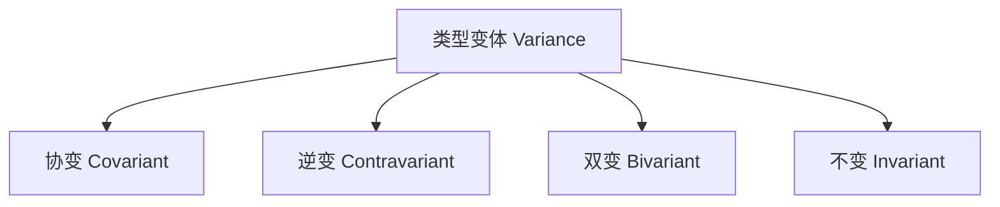
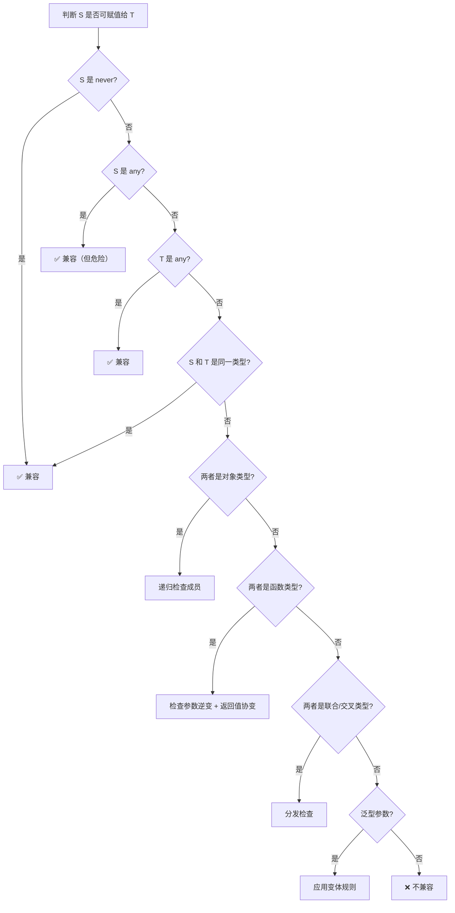

# 第10章 类型兼容性

TypeScript 的类型系统基于**结构化类型（structural typing）**，而非许多传统语言（如 Java、C#）采用的**名义类型（nominal typing）**。这一设计决策深刻影响了代码的编写方式、类型安全的边界以及重构策略。本章将系统剖析 TypeScript 的类型兼容性规则，探讨结构化类型与名义类型的差异，并介绍如何在结构化类型系统中模拟名义类型的行为。

---

## 10.1 结构化类型系统

### 10.1.1 核心原则

在结构化类型系统中，**类型的身份由成员决定**，而非由声明位置或名称决定。如果两个类型具有相同的结构（shape），则它们是兼容的。

```typescript
// ✅ 结构化兼容：Point2D 和 Point3D 在所需部分上结构一致
interface Point2D {
  x: number;
  y: number;
}

interface Point3D {
  x: number;
  y: number;
  z: number;
}

const p3d: Point3D = { x: 1, y: 2, z: 3 };
const p2d: Point2D = p3d; // ✅ 合法：Point3D 包含 Point2D 的所有成员

// ❌ 反向不兼容
const p2dOnly: Point2D = { x: 1, y: 2 };
const p3dAgain: Point3D = p2dOnly; // ❌ 错误：缺少 z
```

### 10.1.2 鸭子类型

结构化类型有时被称为"鸭子类型"（duck typing）："如果它走起来像鸭子，叫起来像鸭子，那它就是鸭子。"

```typescript
// ✅ 只要结构匹配，无需显式继承或实现
interface Duck {
  walk(): void;
  quack(): void;
}

class RobotDuck {
  walk() { console.log('rolling'); }
  quack() { console.log('beep'); }
}

const duck: Duck = new RobotDuck(); // ✅ 结构兼容，无需 implements
```

### 10.1.3 结构化类型的优势与风险

| 优势 | 风险 |
|------|------|
| 接口定义与实现解耦，降低模块间耦合 | 意外兼容：不同语义但结构相同的类型被误认为兼容 |
| 便于编写灵活的适配器和装饰器 | 重构时，修改字段名可能导致意外破坏兼容 |
| 支持渐进式类型：为现有 JS 代码添加类型 | 无法区分具有相同结构但不同含义的类型 |
| 测试替身（mock）易于创建 | 类型安全边界不如名义类型清晰 |

---

## 10.2 可赋值性规则

### 10.2.1 基本规则

可赋值性（assignability）是类型系统的核心关系：`S` 可赋值给 `T`，当且仅当 `S` 满足 `T` 的所有约束。

```typescript
type AssignabilityCheck<S, T> = S extends T ? true : false;

// 基本类型
type T1 = AssignabilityCheck<string, string>;     // ✅ true
type T2 = AssignabilityCheck<number, string>;     // ❌ false
type T3 = AssignabilityCheck<"a", string>;        // ✅ true (子类型)
type T4 = AssignabilityCheck<string, "a">;        // ❌ false
```

### 10.2.2 对象类型的可赋值性

对象类型的可赋值性遵循**深度递归的成员检查**：

```typescript
interface Animal {
  name: string;
  age: number;
}

interface Dog {
  name: string;
  age: number;
  breed: string;
}

const dog: Dog = { name: 'Rex', age: 3, breed: 'Husky' };
const animal: Animal = dog; // ✅ Dog → Animal：Dog 有所有 Animal 成员

// ❌ 反向不可赋值
const animalOnly: Animal = { name: 'Unknown', age: 0 };
const dogAgain: Dog = animalOnly; // ❌ 缺少 breed
```

### 10.2.3 函数类型的可赋值性

函数类型的可赋值性涉及**参数逆变（contravariance）**和**返回值协变（covariance）**。

```typescript
type F1 = (x: Animal) => Animal;
type F2 = (x: Dog) => Dog;

// 参数位置：需要逆变（参数更宽泛的函数可赋值给参数更具体的）
// 返回值位置：需要协变（返回值更具体的函数可赋值给返回值更宽泛的）

const f1: F1 = (x: Animal) => x;
const f2: F2 = (x: Dog) => x;

// ✅ 返回值协变：Dog → Animal
const f3: F1 = (x: Animal): Dog => ({ name: 'Rex', age: 1, breed: 'Husky' });

// ❌ 参数逆变检查（strictFunctionTypes 开启时）
// const f4: F2 = (x: Animal) => x; // ❌ 错误：Animal 不能赋值给 Dog
```

### 10.2.4 数组与元组的可赋值性

```typescript
// 数组协变
type ArrAnimal = Animal[];
type ArrDog = Dog[];

const dogs: Dog[] = [{ name: 'Rex', age: 2, breed: 'Husky' }];
const animals: Animal[] = dogs; // ✅ 协变

// ❌ 但写入时危险
// animals.push({ name: 'Cat', age: 1 }); // 运行时类型错误：Dog[] 中混入了非 Dog

// 元组长度检查
type Point = [number, number];
type Point3 = [number, number, number];

const p3: Point3 = [1, 2, 3];
// const p2: Point = p3; // ❌ 不兼容：长度不同
```

---

## 10.3 变体（Variance）

### 10.3.1 四种变体



| 变体类型 | 方向 | 含义 | TypeScript 中的典型场景 |
|----------|------|------|------------------------|
| **协变 (Covariant)** | 同向 | `S <: T` 则 `F<S> <: F<T>` | 返回值位置、只读属性、数组读取 |
| **逆变 (Contravariant)** | 反向 | `S <: T` 则 `F<T> <: F<S>` | 参数位置、回调函数参数（strictFunctionTypes） |
| **双变 (Bivariant)** | 双向 | 同时允许协变和逆变 | 方法参数（无 strictFunctionTypes 时） |
| **不变 (Invariant)** | 无 | `F<S> <: F<T>` 仅当 `S = T` | 可变数据结构、函数参数+返回值组合 |

### 10.3.2 协变详解

```typescript
// ✅ 协变：子类型关系保持方向
interface Box<T> {
  value: T;
}

type AnimalBox = Box<Animal>;
type DogBox = Box<Dog>;

const dogBox: DogBox = { value: { name: 'Rex', age: 2, breed: 'Husky' } };
const animalBox: AnimalBox = dogBox; // ✅ 协变：DogBox → AnimalBox
```

### 10.3.3 逆变详解

```typescript
// ✅ 逆变：子类型关系反转
interface Comparator<T> {
  compare(a: T, b: T): number;
}

type AnimalComparator = Comparator<Animal>;
type DogComparator = Comparator<Dog>;

// 能比较 Animal 的比较器，一定能比较 Dog
const animalComparator: AnimalComparator = {
  compare(a, b) { return a.age - b.age; }
};
const dogComparator: DogComparator = animalComparator; // ✅ 逆变

// ❌ 反向不可赋值
// const dogOnly: DogComparator = { compare(a, b) { return a.breed.localeCompare(b.breed); } };
// const animalComp: AnimalComparator = dogOnly; // 可能缺少 breed 字段
```

### 10.3.4 strictFunctionTypes 的影响

```typescript
// strictFunctionTypes = false（默认旧行为）
// 方法参数是双变的（bivariant）

interface Handler {
  handle(x: Animal): void;
}

const dogHandler: Handler = {
  handle(x: Dog) {
    console.log(x.breed); // 危险！如果传入 Animal 则运行时错误
  }
};

// strictFunctionTypes = true 时：
// ❌ 上述赋值报错，因为参数位置要求逆变
// 必须使用更宽泛的参数类型
const safeHandler: Handler = {
  handle(x: Animal) {
    if ('breed' in x) {
      console.log(x.breed);
    }
  }
};
```

---

## 10.4 名义类型与结构化类型的对比

### 10.4.1 对比表格

| 特性 | 名义类型（Nominal） | 结构化类型（Structural） |
|------|---------------------|------------------------|
| 类型标识 | 由名称/声明位置决定 | 由成员结构决定 |
| 兼容性判断 | 显式继承/实现 | 隐式结构匹配 |
| 类型安全边界 | 严格，语义清晰 | 宽松，依赖开发者约定 |
| 重构友好性 | 改名即破坏（显式错误） | 改名可能静默影响兼容类型 |
| 跨模块兼容性 | 需显式导入类型 | 结构匹配即可兼容 |
| 典型语言 | Java, C#, Swift, Rust | TypeScript, Go, OCaml |
| Mock/测试替身 | 需显式实现接口 | 只需匹配结构 |

### 10.4.2 名义类型的代码示例（Java）

```java
// Java：名义类型 — 即使结构相同，名称不同也不兼容
class UserId {
    private final int value;
    public UserId(int value) { this.value = value; }
}

class ProductId {
    private final int value;
    public ProductId(int value) { this.value = value; }
}

// UserId 和 ProductId 结构完全相同，但不兼容
```

### 10.4.3 结构化类型的潜在问题

```typescript
// ❌ 问题：UserId 和 ProductId 结构相同，意外兼容
type UserId = { value: number };
type ProductId = { value: number };

function getUser(id: UserId) {
  console.log(`User: ${id.value}`);
}

const productId: ProductId = { value: 42 };
getUser(productId); // ✅ 结构兼容，但语义错误！
```

---

## 10.5 Branded Types（品牌类型）

### 10.5.1 概念与动机

Branded Type 是在结构化类型系统中**模拟名义类型**的一种技术。通过在类型上添加一个唯一的"品牌"标记，使得结构相同但品牌不同的类型互不兼容。

```typescript
// 基础模式：使用交叉类型添加品牌
type Brand<K, T> = T & { readonly __brand: K };

// 定义两个名义上不同的 number 类型
type UserId = Brand<'UserId', number>;
type ProductId = Brand<'ProductId', number>;

// 创建构造函数（类型断言）
function UserId(value: number): UserId {
  return value as UserId;
}

function ProductId(value: number): ProductId {
  return value as ProductId;
}

// ✅ 正确使用
const uid: UserId = UserId(42);
const pid: ProductId = ProductId(42);

function getUser(id: UserId) {
  console.log(`User: ${id}`);
}

getUser(uid);       // ✅ 合法
// getUser(pid);    // ❌ 错误：ProductId 不能赋值给 UserId
// getUser(42);     // ❌ 错误：number 不能赋值给 UserId
```

### 10.5.2 更安全的品牌实现

```typescript
// 使用 symbol 属性避免属性名冲突
type Branded<T, B> = T & { readonly [Symbol.species]?: B };

// 或者更常见的 __brand 模式（配合 lint 规则禁止直接访问）
type BrandV2<K, T> = T & { readonly __brand__: K };

// 配合 unique symbol 实现更强的隔离
declare const UserIdSymbol: unique symbol;
type UserIdV2 = number & { readonly [UserIdSymbol]: true };

function UserIdV2(n: number): UserIdV2 {
  return n as UserIdV2;
}
```

### 10.5.3 Branded Types 的应用场景

```typescript
// 1. 区分不同单位的数值
type Meters = Brand<'Meters', number>;
type Seconds = Brand<'Seconds', number>;

declare function Meters(n: number): Meters;
declare function Seconds(n: number): Seconds;

function calculateSpeed(distance: Meters, time: Seconds): number {
  return distance / time;
}

// calculateSpeed(Seconds(10), Meters(100)); // ❌ 参数顺序错误会被捕获

// 2. 验证后的字符串
type ValidatedEmail = Brand<'ValidatedEmail', string>;

function validateEmail(email: string): ValidatedEmail | null {
  if (/^[^\s@]+@[^\s@]+\.[^\s@]+$/.test(email)) {
    return email as ValidatedEmail;
  }
  return null;
}

function sendEmail(to: ValidatedEmail, subject: string) {
  // 编译时保证 email 已经过验证
}
```

### 10.5.4 Branded Type 的工厂模式

```typescript
// 通用 Branded Type 工厂
interface BrandedType<T, B> {
  readonly value: T;
  readonly _brand: B;
}

function createBranded<T, B>(
  validator: (value: T) => boolean,
  brand: B
) {
  return (value: T): BrandedType<T, B> | null => {
    if (validator(value)) {
      return { value, _brand: brand };
    }
    return null;
  };
}

// 使用
const createPositive = createBranded<number, 'Positive'>(
  (n) => n > 0,
  'Positive'
);

const pos = createPositive(42); // { value: 42, _brand: 'Positive' }
```

---

## 10.6 Opaque Types（不透明类型）

### 10.6.1 Opaque Type 与 Branded Type 的区别

| 特性 | Branded Type | Opaque Type |
|------|--------------|-------------|
| 底层值访问 | 可直接访问（类型断言后） | 只能通过特定 API 访问 |
| 实现方式 | 交叉类型 + 类型断言 | 通常是包装器或模块私有类型 |
| 运行时开销 | 无 | 可能有（如包装对象） |
| 类型安全级别 | 中等（防意外混用） | 高（完全封装） |

### 10.6.2 Opaque Type 实现

```typescript
// 模块私有类型：外部无法直接构造
declare const OpaqueMarker: unique symbol;

interface Opaque<T, K> {
  readonly [OpaqueMarker]: K;
  readonly _value: T;
}

// 模块内部持有构造函数
namespace UserIdModule {
  export type UserId = Opaque<number, 'UserId'>;

  export function create(value: number): UserId {
    return { [OpaqueMarker]: 'UserId', _value: value } as unknown as UserId;
  }

  export function value(id: UserId): number {
    return (id as unknown as { _value: number })._value;
  }
}

// 外部只能使用导出的 API
const uid = UserIdModule.create(42);
console.log(UserIdModule.value(uid)); // 42
// uid._value; // ❌ 类型错误：_value 不是 UserId 的已知属性
```

---

## 10.7 高级可赋值性场景

### 10.7.1 any 的特殊性

```typescript
// ✅ any 是类型系统的"逃生舱"
let a: any = 'hello';
a = 42;
a = { whatever: true };

// ✅ 任何类型都可赋值给 any
const s: string = 'text';
const any1: any = s;

// ✅ any 可赋值给任何类型（危险！）
const str: string = any1; // 无编译错误，但运行时可能崩溃

// ✅ any 跳过所有检查
const obj: any = null;
obj.toString(); // 编译通过，运行时 TypeError
```

### 10.7.2 unknown 的安全替代

```typescript
// ✅ unknown 要求显式类型收窄后才能使用
let u: unknown = 'hello';
// u.toUpperCase(); // ❌ 错误：unknown 上不存在 toUpperCase

if (typeof u === 'string') {
  u.toUpperCase(); // ✅ 在类型守卫后可用
}

// ✅ unknown 只能赋值给 any 和 unknown
const unk: unknown = 42;
// const n: number = unk; // ❌ 错误
const any2: any = unk;   // ✅
const unk2: unknown = unk; // ✅
```

### 10.7.3 never 的底部类型

```typescript
// never 是所有类型的子类型
type IsNeverSubtypeOfString = never extends string ? true : false; // ✅ true

// 函数返回 never 可赋值给任何返回类型
function throwError(): never {
  throw new Error('fail');
}

const result: string = throwError(); // ✅ never 可赋值给 string

// 空数组的推断问题
const empty = []; // 推断为 never[]（启用 strictNullChecks 时需注意）
empty.push(1); // 若 never[] 则 ❌
```

### 10.7.4 enum 的混合行为

```typescript
// 数字 enum：名义类型 + 反向映射
enum Direction {
  Up = 1,
  Down = 2,
}

const dir: Direction = Direction.Up; // ✅
const num: number = Direction.Up;    // ✅ enum 成员是 number 的子类型
// const dir2: Direction = 3;        // ❌ 不兼容（除非使用 const 断言或 as const）

// 字符串 enum：名义类型
enum Status {
  Active = 'ACTIVE',
  Inactive = 'INACTIVE',
}

const s: Status = Status.Active; // ✅
// const str: Status = 'ACTIVE'; // ❌ 字符串 enum 是名义的

// const enum：编译时内联，无运行时对象
const enum Flags {
  A = 1,
  B = 2,
}
const flags = Flags.A | Flags.B; // 编译为 const flags = 1 | 2;
```

---

## 10.8 类型兼容性检查清单



---

## 10.9 常见陷阱与最佳实践

### 10.9.1 Excess Property Checks（多余属性检查）

```typescript
interface SquareConfig {
  color?: string;
  width?: number;
}

function createSquare(config: SquareConfig): { area: number } {
  return { area: (config.width ?? 0) ** 2 };
}

// ❌ 直接传入对象字面量时，多余属性会被检查
// createSquare({ colour: 'red', width: 10 }); // 错误：colour 不存在

// ✅ 但先赋值给变量则绕过检查
const config = { colour: 'red', width: 10 };
createSquare(config); // 不报错！因为 config 被推断为 { colour: string; width: number }

// ✅ 使用类型断言或满足索引签名
interface FlexibleConfig {
  color?: string;
  width?: number;
  [prop: string]: any;
}
```

### 10.9.2 可选属性与 undefined

```typescript
interface User {
  name: string;
  email?: string; // 等价于 email: string | undefined（strictNullChecks 开启时）
}

// ✅ 可以省略
const u1: User = { name: 'Alice' };

// ✅ 可以显式提供 undefined
const u2: User = { name: 'Bob', email: undefined };

// exactOptionalPropertyTypes 开启时：
// ❌ 上述 u2 会报错，因为 undefined 不是 "缺失"
```

### 10.9.3 泛型兼容性

```typescript
interface Container<T> {
  value: T;
}

// ✅ 泛型参数兼容时，泛型类型兼容
const numContainer: Container<number> = { value: 42 };
const unkContainer: Container<unknown> = numContainer; // ✅ 协变

// ❌ 但方法中的泛型参数可能有不同规则
interface Comparator<T> {
  compare(a: T, b: T): number;
}

const numComp: Comparator<number> = {
  compare(a, b) { return a - b; }
};

// const unkComp: Comparator<unknown> = numComp; // ❌ 逆变检查失败
```

### 10.9.4 索引签名兼容性

```typescript
interface Dictionary {
  [key: string]: number;
}

// ✅ 具有索引签名的类型兼容性更严格
interface StrictDict {
  [key: string]: number;
}

const dict: Dictionary = { a: 1, b: 2 };

// ✅ 普通对象可以赋值给索引签名类型
const obj = { a: 1, b: 2 };
const d: Dictionary = obj; // ✅

// ❌ 但如果对象字面量直接赋值，额外属性检查生效
// const d2: Dictionary = { a: 1, b: '2' }; // ❌ b 不是 number
```

### 10.9.5 严格模式下的兼容性变化

```typescript
// strictNullChecks = false 时
let s: string = null; // ✅ 兼容（危险！）

// strictNullChecks = true 时
// let s2: string = null; // ❌ 不兼容

// strictFunctionTypes = false 时（方法参数双变）
interface AnimalHandler {
  handle(x: Animal): void;
}

const dogH: AnimalHandler = {
  handle(x: Dog) { console.log(x.breed); } // ✅ 允许（但运行时危险）
};

// strictFunctionTypes = true 时
// 上述赋值 ❌ 报错
```

---

## 10.10 本章小结

- TypeScript 采用**结构化类型系统**，类型兼容性由成员结构决定，而非类型名称。
- **可赋值性**检查遵循递归的深度结构匹配规则，对象、函数、数组各有特定规范。
- **变体（variance）**描述了类型构造器如何保持或反转子类型关系：协变保持方向、逆变反转方向、双变双向允许、不变要求严格一致。
- `strictFunctionTypes` 开启后，函数参数位置采用**逆变**检查，消除方法参数双变带来的安全隐患。
- **Branded Types** 和 **Opaque Types** 是在结构化类型系统中模拟名义类型行为的关键技术，适用于区分同构异义的类型（如 UserId vs ProductId、Meters vs Seconds）。
- `any` 是类型系统的逃生舱但破坏类型安全，`unknown` 是其类型安全的替代品，`never` 是底部类型可赋值给任何类型。
- **Excess Property Checks** 只在对象字面量直接赋值时触发，赋值给中间变量会绕过此检查。
- 理解类型兼容性规则是编写健壮的 TypeScript 代码、避免隐式类型漏洞的基础。

---

## 参考资源

1. [TypeScript Handbook: Type Compatibility](https://www.typescriptlang.org/docs/handbook/type-compatibility.html)
2. [TypeScript Handbook: Structural Type System](https://www.typescriptlang.org/docs/handbook/typescript-in-5-minutes.html#structural-type-system)
3. [TypeScript Deep Dive: Type Compatibility](https://basarat.gitbook.io/typescript/type-system/type-compatibility)
4. [TypeScript FAQ: Why are function parameters bivariant?](https://github.com/Microsoft/TypeScript/wiki/FAQ#why-are-function-parameters-bivariant)
5. [Branded Types in TypeScript](https://medium.com/@KevinBGreene/surviving-the-typescript-ecosystem-branding-and-type-tagging-6cf6e516523d)
6. [Nominal Typing Techniques in TypeScript](https://github.com/microsoft/TypeScript/wiki/FAQ#can-i-make-a-type-alias-nominal)
7. [Effective TypeScript: Item 53: Know How to Use Nominal Types](https://effectivetypescript.com/)
