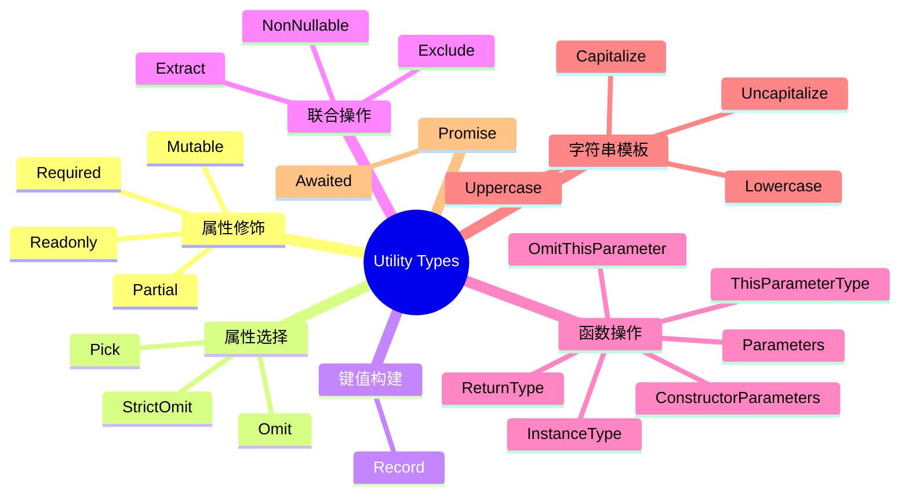

# 第11章 内置工具类型大全

TypeScript 提供了一系列内置工具类型（Utility Types），它们基于 TypeScript 的类型系统原语（映射类型、条件类型、模板字面量类型等）构建，极大地提升了类型操作的表达能力。本章将逐一剖析这些工具类型的**手写实现**、**使用场景**与**边界情况**。

---

## 11.1 属性修饰工具类型

### 11.1.1 Partial&lt;T&gt;

将类型 `T` 的所有属性变为可选。

**手写实现：**

```typescript
type MyPartial<T> = {
  [P in keyof T]?: T[P];
};
```

**使用示例：**

```typescript
interface User {
  id: number;
  name: string;
  email: string;
}

// ✅ 创建部分更新的对象
type UserUpdate = Partial<User>;
// 等价于：{ id?: number; name?: string; email?: string; }

const update: UserUpdate = { name: 'Alice' }; // ✅ 只需提供部分字段

// 实际应用：更新函数
function updateUser(id: number, changes: Partial<User>): User {
  // 合并逻辑...
  return { id, name: '', email: '', ...changes };
}
```

**深度 Partial（递归版）：**

```typescript
type DeepPartial<T> = {
  [P in keyof T]?: T[P] extends object ? DeepPartial<T[P]> : T[P];
};

interface Company {
  name: string;
  address: {
    city: string;
    street: string;
  };
}

type PartialCompany = DeepPartial<Company>;
// address 及其子属性也都变为可选
const partial: PartialCompany = { address: { city: 'Beijing' } }; // ✅
```

### 11.1.2 Required&lt;T&gt;

将类型 `T` 的所有属性变为必需（移除 `?` 修饰符）。

**手写实现：**

```typescript
type MyRequired<T> = {
  [P in keyof T]-?: T[P]; // -? 移除可选修饰符
};
```

**使用示例：**

```typescript
interface Config {
  host?: string;
  port?: number;
  ssl?: boolean;
}

// ✅ 确保所有配置项都已提供
type CompleteConfig = Required<Config>;
// 等价于：{ host: string; port: number; ssl: boolean; }

function initialize(config: CompleteConfig) {
  console.log(`${config.host}:${config.port}`);
}

initialize({ host: 'localhost', port: 3000, ssl: false }); // ✅
```

### 11.1.3 Readonly&lt;T&gt;

将类型 `T` 的所有属性变为只读。

**手写实现：**

```typescript
type MyReadonly<T> = {
  readonly [P in keyof T]: T[P];
};
```

**使用示例：**

```typescript
interface Point {
  x: number;
  y: number;
}

// ✅ 创建不可变点
type ImmutablePoint = Readonly<Point>;

const origin: ImmutablePoint = { x: 0, y: 0 };
// origin.x = 1; // ❌ 错误：只读属性不可修改

// 与 const 的区别：const 是变量绑定只读，Readonly 是属性只读
const mutablePoint = { x: 0, y: 0 };
mutablePoint.x = 1; // ✅ 变量可重新赋值属性

const readonlyPoint: Readonly<Point> = mutablePoint;
// readonlyPoint.x = 2; // ❌ 编译错误
```

**深度 Readonly（递归版）：**

```typescript
type DeepReadonly<T> = {
  readonly [P in keyof T]: T[P] extends object
    ? T[P] extends Function
      ? T[P]
      : DeepReadonly<T[P]>
    : T[P];
};

const config: DeepReadonly<{ db: { host: string; port: number } }> = {
  db: { host: 'localhost', port: 3306 }
};
// config.db.host = 'remote'; // ❌ 深层属性也是只读的
```

### 11.1.4 Mutable&lt;T&gt;（反向 Readonly）

TypeScript 未内置，但可通过映射类型移除 `readonly`：

```typescript
type Mutable<T> = {
  -readonly [P in keyof T]: T[P]; // -readonly 移除只读修饰符
};

const frozen: Readonly<Point> = { x: 0, y: 0 };
const thawed: Mutable<typeof frozen> = frozen; // ✅ 移除只读
thawed.x = 1; // ✅
```

---

## 11.2 属性选择工具类型

### 11.2.1 Pick&lt;T, K&gt;

从类型 `T` 中选取一组属性 `K` 构成新类型。

**手写实现：**

```typescript
type MyPick<T, K extends keyof T> = {
  [P in K]: T[P];
};
```

**使用示例：**

```typescript
interface User {
  id: number;
  name: string;
  email: string;
  password: string;
  createdAt: Date;
}

// ✅ 创建公开可见的用户信息（排除敏感字段）
type PublicUser = Pick<User, 'id' | 'name' | 'email'>;
// 等价于：{ id: number; name: string; email: string; }

const publicUser: PublicUser = {
  id: 1,
  name: 'Alice',
  email: 'alice@example.com'
};

// ❌ 不能选取不存在的属性
// type BadPick = Pick<User, 'nonexistent'>; // ❌ 错误
```

### 11.2.2 Omit&lt;T, K&gt;

从类型 `T` 中排除一组属性 `K` 构成新类型。

**手写实现：**

```typescript
type MyOmit<T, K extends keyof any> = Pick<T, Exclude<keyof T, K>>;
```

**使用示例：**

```typescript
// ✅ 与 Pick 互补，更方便排除少量字段
type SafeUser = Omit<User, 'password' | 'createdAt'>;
// 等价于：{ id: number; name: string; email: string; }

function serializeUser(user: User): SafeUser {
  const { password, createdAt, ...safe } = user; // 运行时解构
  return safe;
}

// ❌ 注意：Omit 的 K 使用 extends keyof any，可以传入任意字符串联合类型
// 但如果传入的属性名不存在，不会报错（只是无效果）
type T1 = Omit<User, 'notAField'>; // ✅ 不报错，等同于 User
```

### 11.2.3 Pick 与 Omit 的对比

| 场景 | Pick | Omit |
|------|------|------|
| 属性多、排除少 | 需列出大量属性 | ✅ 只需列出排除的属性 |
| 属性少、选取少 | ✅ 简洁明了 | 需排除大量属性 |
| 类型演进安全 | 新增属性不会自动包含 | 新增属性自动包含（可能不符合预期） |
| 编译时检查 | K 必须存在于 T | K 可为任意字符串 |

```typescript
// 示例：类型演进的影响
interface ApiUser {
  id: number;
  name: string;
  email: string;
}

// Pick 方式：新增字段需手动添加
type UserView = Pick<ApiUser, 'id' | 'name'>;
// ApiUser 新增 phone 后，UserView 不会自动包含

// Omit 方式：新增字段自动包含
type UserView2 = Omit<ApiUser, 'email'>;
// ApiUser 新增 phone 后，UserView2 自动包含 phone（可能暴露过多）
```

---

## 11.3 键值构建工具类型

### 11.3.1 Record&lt;K, T&gt;

构建一个对象类型，其键为 `K`，值为 `T`。

**手写实现：**

```typescript
type MyRecord<K extends keyof any, T> = {
  [P in K]: T;
};
```

**使用示例：**

```typescript
// ✅ 创建字典/映射类型
type PageNames = 'home' | 'about' | 'contact';
type PageInfo = { title: string; path: string };

type SiteMap = Record<PageNames, PageInfo>;

const siteMap: SiteMap = {
  home: { title: '首页', path: '/' },
  about: { title: '关于', path: '/about' },
  contact: { title: '联系', path: '/contact' }
};

// ❌ 不能遗漏键
// const badMap: SiteMap = { home: { title: '', path: '' } }; // 缺少 about, contact

// ✅ 与索引签名的区别：Record 要求所有键都存在
interface FlexibleMap {
  [key: string]: PageInfo; // 允许任意字符串键，不要求特定键存在
}
```

**Record 与对象字面量的对比：**

```typescript
// ✅ Record 确保所有键都存在（适合配置对象）
const httpStatus: Record<number, string> = {
  200: 'OK',
  404: 'Not Found',
  500: 'Internal Server Error'
};

// ❌ 但无法限制具体键的范围
// 若要限制为特定状态码：
type HttpStatusCode = 200 | 404 | 500;
type StatusMessages = Record<HttpStatusCode, string>;
```

### 11.3.2 使用 Record 构建枚举映射

```typescript
enum Role {
  Admin = 'ADMIN',
  User = 'USER',
  Guest = 'GUEST'
}

const rolePermissions: Record<Role, string[]> = {
  [Role.Admin]: ['read', 'write', 'delete'],
  [Role.User]: ['read', 'write'],
  [Role.Guest]: ['read']
};

// ✅ 如果新增 Role.Editor 但未添加对应权限，编译报错
```

---

## 11.4 联合类型操作工具类型

### 11.4.1 Exclude&lt;T, U&gt;

从联合类型 `T` 中排除可赋值给 `U` 的类型。

**手写实现：**

```typescript
type MyExclude<T, U> = T extends U ? never : T;
```

**使用示例：**

```typescript
type AllTypes = string | number | boolean | null;

// ✅ 排除 null 和 undefined
type NonNullableTypes = Exclude<AllTypes, null | undefined>;
// 结果：string | number | boolean

// ✅ 排除特定字面量
type Status = 'pending' | 'success' | 'error' | 'cancelled';
type TerminalStatus = Exclude<Status, 'pending'>;
// 结果：'success' | 'error' | 'cancelled'

// 原理：条件类型在泛型上的分发行为
// 'pending' extends 'pending' ? never : 'pending'   → never
// 'success' extends 'pending' ? never : 'success'   → 'success'
// ...
```

### 11.4.2 Extract&lt;T, U&gt;

从联合类型 `T` 中提取可赋值给 `U` 的类型。

**手写实现：**

```typescript
type MyExtract<T, U> = T extends U ? T : never;
```

**使用示例：**

```typescript
type Mixed = string | number | boolean | (() => void);

// ✅ 提取函数类型
type Functions = Extract<Mixed, Function>;
// 结果：() => void

// ✅ 提取特定字面量
type Colors = 'red' | 'green' | 'blue' | 'admin' | 'user';
type SystemColors = Extract<Colors, 'red' | 'green' | 'blue'>;
// 结果：'red' | 'green' | 'blue'
```

### 11.4.3 Exclude 与 Extract 对比

```typescript
// 两者互补
type All = 'a' | 'b' | 'c' | 'd';
type ToRemove = 'b' | 'd';

type Remaining = Exclude<All, ToRemove>;  // 'a' | 'c'
type Removed = Extract<All, ToRemove>;    // 'b' | 'd'

type Verify = Remaining | Removed; // 'a' | 'b' | 'c' | 'd' = All
```

---

## 11.5 空值处理工具类型

### 11.5.1 NonNullable&lt;T&gt;

从类型 `T` 中排除 `null` 和 `undefined`。

**手写实现：**

```typescript
type MyNonNullable<T> = T extends null | undefined ? never : T;
// 实际实现使用内置：Exclude<T, null | undefined>
```

**使用示例：**

```typescript
type MaybeString = string | null | undefined;
type DefiniteString = NonNullable<MaybeString>; // string

// 实用场景：过滤数组中的空值
function filterNonNullable<T>(arr: (T | null | undefined)[]): T[] {
  return arr.filter((x): x is T => x !== null && x !== undefined);
}

const values = ['a', null, 'b', undefined, 'c'];
const strings = filterNonNullable(values); // string[]
```

---

## 11.6 函数类型操作工具类型

### 11.6.1 Parameters&lt;T&gt;

提取函数类型 `T` 的参数类型作为元组。

**手写实现：**

```typescript
type MyParameters<T extends (...args: any) => any> =
  T extends (...args: infer P) => any ? P : never;
```

**使用示例：**

```typescript
type MyFn = (name: string, age: number) => boolean;

// ✅ 提取参数类型
type MyFnParams = Parameters<MyFn>;
// 结果：[name: string, age: number]

// 实用场景：包装函数时保留参数类型
function wrap<T extends (...args: any[]) => any>(
  fn: T
): (...args: Parameters<T>) => ReturnType<T> {
  return (...args) => fn(...args);
}

const greet = (name: string, greeting: string) => `${greeting}, ${name}!`;
const wrappedGreet = wrap(greet); // (name: string, greeting: string) => string
```

### 11.6.2 ReturnType&lt;T&gt;

提取函数类型 `T` 的返回类型。

**手写实现：**

```typescript
type MyReturnType<T extends (...args: any) => any> =
  T extends (...args: any) => infer R ? R : any;
```

**使用示例：**

```typescript
async function fetchUser(id: number) {
  return { id, name: 'Alice' };
}

// ✅ 提取返回类型（不包含 Promise 包装）
type FetchUserReturn = ReturnType<typeof fetchUser>;
// 结果：Promise<{ id: number; name: string; }>

// ✅ 提取 Promise 内部的类型
type UnwrapPromise<T> = T extends Promise<infer U> ? U : T;
type UserResult = UnwrapPromise<FetchUserReturn>;
// 结果：{ id: number; name: string; }

// ✅ 使用 Awaited（TypeScript 4.5+）
type AwaitedResult = Awaited<FetchUserReturn>;
// 结果：{ id: number; name: string; }
```

### 11.6.3 ConstructorParameters&lt;T&gt;

提取构造函数类型的参数类型。

**手写实现：**

```typescript
type MyConstructorParameters<T extends abstract new (...args: any) => any> =
  T extends abstract new (...args: infer P) => any ? P : never;
```

**使用示例：**

```typescript
class User {
  constructor(
    public name: string,
    public age: number,
    public email?: string
  ) {}
}

// ✅ 提取构造参数
type UserConstructorArgs = ConstructorParameters<typeof User>;
// 结果：[name: string, age: number, email?: string | undefined]

// 实用场景：工厂函数
function createUser(...args: ConstructorParameters<typeof User>): User {
  return new User(...args);
}
```

### 11.6.4 InstanceType&lt;T&gt;

提取构造函数类型的实例类型。

**手写实现：**

```typescript
type MyInstanceType<T extends abstract new (...args: any) => any> =
  T extends abstract new (...args: any) => infer R ? R : any;
```

**使用示例：**

```typescript
// ✅ 提取实例类型
type UserInstance = InstanceType<typeof User>;
// 结果：User

// 实用场景：泛型类处理
class Container<T> {
  constructor(public value: T) {}
}

type StringContainer = InstanceType<typeof Container<string>>; // Container<string>
```

### 11.6.5 ThisParameterType&lt;T&gt;

提取函数类型的 `this` 参数类型。

```typescript
function greet(this: { name: string }, greeting: string) {
  return `${greeting}, ${this.name}!`;
}

// ✅ 提取 this 类型
type GreetThis = ThisParameterType<typeof greet>;
// 结果：{ name: string }

// ✅ 移除 this 参数
type GreetWithoutThis = OmitThisParameter<typeof greet>;
// 结果：(greeting: string) => string
```

---

## 11.7 字符串模板工具类型（TypeScript 4.1+）

### 11.7.1 Uppercase&lt;T&gt; / Lowercase&lt;T&gt;

```typescript
type MyUppercase<S extends string> = intrinsic; // 内置，无法手写

// ✅ 使用示例
type Hello = 'hello';
type Shout = Uppercase<Hello>; // 'HELLO'

type Quiet = Lowercase<'WORLD'>; // 'world'
```

### 11.7.2 Capitalize&lt;T&gt; / Uncapitalize&lt;T&gt;

```typescript
type Greeting = 'hello world';
type Title = Capitalize<Greeting>;    // 'Hello world'
type Camel = Uncapitalize<'Hello'>;   // 'hello'

// 实用场景：事件名转换
type EventName<T extends string> = `on${Capitalize<T>}`;
type ClickEvent = EventName<'click'>;    // 'onClick'
type FocusEvent = EventName<'focus'>;    // 'onFocus'
```

### 11.7.3 自定义模板工具类型

```typescript
// 驼峰命名转换
type CamelCase<S extends string> =
  S extends `${infer P}_${infer Q}`
    ? `${P}${Capitalize<CamelCase<Q>>}`
    : S;

type Test1 = CamelCase<'hello_world'>;       // 'helloWorld'
type Test2 = CamelCase<'snake_case_name'>;   // 'snakeCaseName'

// 路径参数提取
type PathParams<T extends string> =
  T extends `${string}:${infer Param}/${infer Rest}`
    ? Param | PathParams<Rest>
    : T extends `${string}:${infer Param}`
      ? Param
      : never;

type ApiParams = PathParams<'/users/:id/posts/:postId'>; // 'id' | 'postId'
```

---

## 11.8 高级组合工具类型

### 11.8.1 Flatten（展平数组类型）

```typescript
type Flatten<T> = T extends (infer U)[] ? U : T;

type Nested = number[][];
type Flat = Flatten<Nested>; // number[]

type DeepNested = number[][][];
type Once = Flatten<DeepNested>; // number[][]

// 递归深度展平
type DeepFlatten<T> = T extends (infer U)[] ? DeepFlatten<U> : T;
type FullyFlat = DeepFlatten<number[][][]>; // number
```

### 11.8.2 RequiredByKeys / PartialByKeys

```typescript
// 按需设置必需/可选
type RequiredByKeys<T, K extends keyof T> =
  Omit<T, K> & Required<Pick<T, K>>;

interface User {
  id?: number;
  name?: string;
  email?: string;
}

type UserWithRequiredId = RequiredByKeys<User, 'id'>;
// 结果：{ id: number; name?: string; email?: string; }

type PartialByKeys<T, K extends keyof T> =
  Omit<T, K> & Partial<Pick<T, K>>;

type UserWithOptionalEmail = PartialByKeys<User, 'email'>;
```

### 11.8.3 Merge（合并两个对象类型）

```typescript
type Merge<F, S> = {
  [K in keyof F | keyof S]: K extends keyof S
    ? S[K]
    : K extends keyof F
      ? F[K]
      : never;
};

interface A { x: number; y: string; }
interface B { y: boolean; z: number; }

type Merged = Merge<A, B>;
// 结果：{ x: number; y: boolean; z: number; } — B 的属性覆盖 A
```

### 11.8.4 StrictOmit（严格版本的 Omit）

```typescript
// 标准 Omit 允许不存在的键，StrictOmit 会报错
type StrictOmit<T, K extends keyof T> = Pick<T, Exclude<keyof T, K>>;

interface User { name: string; age: number; }

type T1 = Omit<User, 'nonexistent'>;       // ✅ 不报错
type T2 = StrictOmit<User, 'nonexistent'>; // ❌ 错误：'nonexistent' 不是 keyof User
```

---

## 11.9 工具类型速查表



| 工具类型 | 输入 | 输出 | 核心机制 |
|----------|------|------|----------|
| `Partial<T>` | 对象类型 | 全可选属性 | 映射类型 `+?` |
| `Required<T>` | 对象类型 | 全必需属性 | 映射类型 `-?` |
| `Readonly<T>` | 对象类型 | 全只读属性 | 映射类型 `readonly` |
| `Pick<T, K>` | 对象类型 + 键联合 | 子集类型 | 映射类型 + keyof |
| `Omit<T, K>` | 对象类型 + 键联合 | 排除后类型 | Pick + Exclude |
| `Record<K, T>` | 键联合 + 值类型 | 字典类型 | 映射类型 |
| `Exclude<T, U>` | 联合类型 × 2 | 差集 | 条件类型分发 |
| `Extract<T, U>` | 联合类型 × 2 | 交集 | 条件类型分发 |
| `NonNullable<T>` | 含 null/undefined | 排除后 | Exclude |
| `Parameters<T>` | 函数类型 | 参数元组 | infer + 条件类型 |
| `ReturnType<T>` | 函数类型 | 返回类型 | infer + 条件类型 |
| `Awaited<T>` | Promise 嵌套 | 解包后类型 | 递归条件类型 |
| `ConstructorParameters<T>` | 构造类型 | 参数元组 | infer + 条件类型 |
| `InstanceType<T>` | 构造类型 | 实例类型 | infer + 条件类型 |

---

## 11.10 本章小结

- **属性修饰工具类型**（Partial/Required/Readonly）基于映射类型，通过 `?` 和 `readonly` 修饰符以及 `-?` / `-readonly` 操作实现属性的批量转换。
- **属性选择工具类型**（Pick/Omit）用于从对象类型中提取或排除特定属性，Pick 更适合白名单场景，Omit 更适合黑名单场景。
- **键值构建工具类型**（Record）用于快速构建具有固定键集合的字典类型，与索引签名的区别在于 Record 要求所有键必须存在。
- **联合类型操作工具类型**（Exclude/Extract/NonNullable）利用条件类型的**分发行为**（distributive conditional type）对联合类型进行集合运算。
- **函数类型操作工具类型**（Parameters/ReturnType/ConstructorParameters/InstanceType）使用 `infer` 关键字在条件类型中进行**类型推断**，实现对函数签名的解构。
- **字符串模板工具类型**（Uppercase/Lowercase/Capitalize/Uncapitalize）是 TypeScript 内置的模板字面量类型操作，配合自定义递归条件类型可实现强大的字符串类型变换。
- 深入理解这些工具类型的手写实现，是掌握 TypeScript 类型系统的关键一步，也是进行类型体操（Type Challenges）的基础。

---

## 参考资源

1. [TypeScript Handbook: Utility Types](https://www.typescriptlang.org/docs/handbook/utility-types.html)
2. [TypeScript Handbook: Mapped Types](https://www.typescriptlang.org/docs/handbook/2/mapped-types.html)
3. [TypeScript Handbook: Conditional Types](https://www.typescriptlang.org/docs/handbook/2/conditional-types.html)
4. [TypeScript Handbook: Template Literal Types](https://www.typescriptlang.org/docs/handbook/2/template-literal-types.html)
5. [Type Challenges](https://github.com/type-challenges/type-challenges) — 通过实践巩固工具类型知识
6. [Total TypeScript: Utility Types](https://www.totaltypescript.com/)
7. [TypeScript 4.1: Template Literal Types](https://devblogs.microsoft.com/typescript/announcing-typescript-4-1/#template-literal-types)
