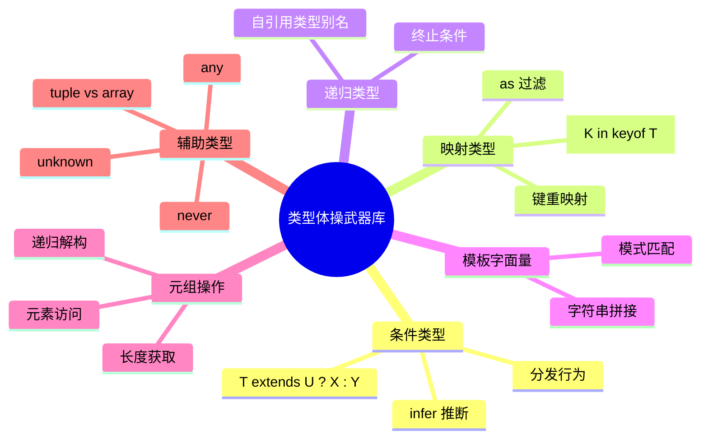

# 第12章 类型体操

"类型体操"（Type Gymnastics）是指利用 TypeScript 的类型系统实现编译时计算、逻辑判断和数据转换的编程艺术。它不仅是炫技，更是深入理解类型系统机制的绝佳途径。本章从经典挑战入手，逐步解析从 Easy 到 Hard 难度的类型编程技巧。

---

## 12.1 类型体操基础

### 12.1.1 核心武器库



### 12.1.2 分发条件类型（Distributive Conditional Types）

```typescript
// 当条件类型作用于裸类型参数时，会发生分发
type ToArray<T> = T extends any ? T[] : never;

// ✅ 分发行为：对联合类型的每个成员单独应用
type Result = ToArray<string | number>;
// 结果：string[] | number[]（不是 (string | number)[]）

// ❌ 阻止分发：将类型参数包装到元组中
type ToArrayNoDist<T> = [T] extends [any] ? T[] : never;
type Result2 = ToArrayNoDist<string | number>;
// 结果：(string | number)[]
```

### 12.1.3 infer 位置总结

| infer 位置 | 推断目标 | 典型应用 |
|-----------|---------|---------|
| 函数参数 | 参数元组 | `Parameters<T>` |
| 函数返回 | 返回类型 | `ReturnType<T>` |
| Promise 内部 | 解析类型 | `Awaited<T>` |
| 数组元素 | 元素类型 | `Flatten<T>` |
| 字符串模式 | 匹配片段 | `CamelCase<S>` |
| 类构造函数 | 构造参数/实例 | `ConstructorParameters<T>`, `InstanceType<T>` |

---

## 12.2 Easy 挑战

### 12.2.1 HelloWorld

**目标：** 实现 `HelloWorld` 类型，使其等于字符串字面量 `'Hello, World'`。

```typescript
type HelloWorld = 'Hello, World';

// 验证
type cases = [
  Expect<Equal<HelloWorld, 'Hello, World'>>,
];
```

**要点：** 熟悉类型别名的基本语法和测试框架的使用。

### 12.2.2 Pick

**目标：** 手写实现 `MyPick<T, K>`。

```typescript
type MyPick<T, K extends keyof T> = {
  [P in K]: T[P];
};

// 验证
interface Todo {
  title: string;
  description: string;
  completed: boolean;
}

type TodoPreview = MyPick<Todo, 'title' | 'completed'>;
// 结果：{ title: string; completed: boolean; }
```

### 12.2.3 Readonly

**目标：** 手写实现 `MyReadonly<T>`。

```typescript
type MyReadonly<T> = {
  readonly [P in keyof T]: T[P];
};

// 验证
interface Todo {
  title: string;
}

const todo: MyReadonly<Todo> = { title: 'Hey' };
// todo.title = 'Yo'; // ❌ 错误：只读属性
```

### 12.2.4 TupleToObject

**目标：** 将元组类型转换为对象类型，键和值都来自元组元素。

```typescript
type TupleToObject<T extends readonly (string | number | symbol)[]> = {
  [P in T[number]]: P;
};

// 解析：
// T[number] 提取元组的所有元素类型，形成联合类型
// [P in ...] 遍历该联合类型

const tuple = ['tesla', 'model 3', 'model X', 'model Y'] as const;
type Result = TupleToObject<typeof tuple>;
// 结果：{ tesla: 'tesla'; 'model 3': 'model 3'; 'model X': 'model X'; 'model Y': 'model Y'; }
```

### 12.2.5 First / Last of Array

```typescript
// 获取元组第一个元素
type First<T extends readonly unknown[]> = 
  T extends readonly [infer F, ...unknown[]] ? F : never;

// 获取元组最后一个元素
type Last<T extends readonly unknown[]> = 
  T extends readonly [...unknown[], infer L] ? L : never;

// 验证
type A = First<[1, 2, 3]>; // 1
type B = Last<[1, 2, 3]>;  // 3
type C = First<[]>;        // never
```

### 12.2.6 Length of Tuple

```typescript
type Length<T extends readonly unknown[]> = T['length'];

// 验证
type A = Length<[1, 2, 3]>; // 3
type B = Length<['a', 'b']>; // 2
type C = Length<[]>;         // 0

// 对比数组：readonly unknown[] 的 length 是 number，不是具体数值
const arr = [1, 2, 3];
type ArrLen = typeof arr['length']; // number（因为 arr 是数组，不是元组）

// ✅ 使用 as const 或显式元组类型获得具体长度
const tuple = [1, 2, 3] as const;
type TupleLen = typeof tuple['length']; // 3
```

### 12.2.7 Exclude / Awaited

```typescript
// Exclude
type MyExclude<T, U> = T extends U ? never : T;

type A = MyExclude<'a' | 'b' | 'c', 'a'>; // 'b' | 'c'

// Awaited（简化版）
type MyAwaited<T> = T extends Promise<infer U> ? MyAwaited<U> : T;

type B = MyAwaited<Promise<Promise<string>>>; // string
```

### 12.2.8 If / Concat

```typescript
// 类型级 if
type If<C extends boolean, T, F> = C extends true ? T : F;

type A = If<true, 'yes', 'no'>;  // 'yes'
type B = If<false, 'yes', 'no'>; // 'no'

// 元组拼接
type Concat<T extends readonly unknown[], U extends readonly unknown[]> = 
  [...T, ...U];

type C = Concat<[1, 2], [3, 4]>; // [1, 2, 3, 4]
```

### 12.2.9 Includes

```typescript
type Includes<T extends readonly unknown[], U> = 
  T extends readonly [infer F, ...infer R]
    ? Equal<F, U> extends true
      ? true
      : Includes<R, U>
    : false;

// 辅助：深度相等判断（简化版）
type Equal<X, Y> = 
  (<T>() => T extends X ? 1 : 2) extends 
  (<T>() => T extends Y ? 1 : 2) ? true : false;

type A = Includes<['a', 'b', 'c'], 'a'>; // true
type B = Includes<['a', 'b', 'c'], 'd'>; // false
```

### 12.2.10 Push / Unshift

```typescript
// 元组末尾添加元素
type Push<T extends readonly unknown[], E> = [...T, E];

// 元组开头添加元素
type Unshift<T extends readonly unknown[], E> = [E, ...T];

type A = Push<[1, 2], 3>;     // [1, 2, 3]
type B = Unshift<[1, 2], 0>;  // [0, 1, 2]
```

### 12.2.11 Get Return Type

```typescript
// 手写 ReturnType
type MyReturnType<T extends (...args: any[]) => any> = 
  T extends (...args: any[]) => infer R ? R : never;

const fn = (v: boolean) => v ? 1 : 2;
type A = MyReturnType<typeof fn>; // 1 | 2
```

### 12.2.12 Omit

```typescript
// 手写 Omit
type MyOmit<T, K extends keyof any> = Pick<T, Exclude<keyof T, K>>;

interface Todo {
  title: string;
  description: string;
  completed: boolean;
}

type TodoPreview = MyOmit<Todo, 'description' | 'title'>;
// 结果：{ completed: boolean; }
```

---

## 12.3 Medium 挑战

### 12.3.1 DeepReadonly

**目标：** 递归地将对象类型的所有属性设为只读。

```typescript
type DeepReadonly<T> = {
  readonly [P in keyof T]: T[P] extends object 
    ? T[P] extends Function 
      ? T[P] 
      : DeepReadonly<T[P]> 
    : T[P];
};

// 验证
interface X {
  x: { a: 1; b: 'hi' };
  y: 'hey';
}

type Expected = DeepReadonly<X>;
// 结果：{ readonly x: { readonly a: 1; readonly b: 'hi'; }; readonly y: 'hey'; }

// ❌ 不使用 Function 检查的陷阱
type BadDeepReadonly<T> = {
  readonly [P in keyof T]: T[P] extends object ? BadDeepReadonly<T[P]> : T[P];
};
// 函数也是 object，会被递归，导致函数属性变为 {}（因为函数没有可读属性）
```

### 12.3.2 TupleToUnion

```typescript
// 将元组类型转换为联合类型
type TupleToUnion<T extends readonly unknown[]> = T[number];

type A = TupleToUnion<[123, '456', true]>; // 123 | '456' | true
```

### 12.3.3 LastIndexOf

```typescript
type LastIndexOf<T extends readonly unknown[], U> = 
  T extends readonly [...infer Rest, infer Last]
    ? Equal<Last, U> extends true
      ? Rest['length']
      : LastIndexOf<Rest, U>
    : -1;

type A = LastIndexOf<[1, 2, 3, 2, 1], 2>; // 3
```

### 12.3.4 Unique

```typescript
// 从元组中移除重复元素
type Unique<T extends readonly unknown[], Acc extends readonly unknown[] = []> = 
  T extends readonly [infer F, ...infer R]
    ? Includes<Acc, F> extends true
      ? Unique<R, Acc>
      : Unique<R, [...Acc, F]>
    : Acc;

type A = Unique<[1, 1, 2, 2, 3, 3]>; // [1, 2, 3]
```

### 12.3.5 Replace / ReplaceAll

```typescript
// 替换字符串中第一个匹配
type Replace<S extends string, From extends string, To extends string> = 
  From extends ''
    ? S
    : S extends `${infer L}${From}${infer R}`
      ? `${L}${To}${R}`
      : S;

// 替换所有匹配
type ReplaceAll<S extends string, From extends string, To extends string> = 
  From extends ''
    ? S
    : S extends `${infer L}${From}${infer R}`
      ? `${L}${To}${ReplaceAll<R, From, To>}`
      : S;

type A = Replace<'foobarbar', 'bar', 'foo'>;       // 'foofoobar'
type B = ReplaceAll<'foobarbar', 'bar', 'foo'>;    // 'foofoofoo'
```

### 12.3.6 StringToUnion

```typescript
// 将字符串拆分为字符联合类型
type StringToUnion<S extends string> = 
  S extends `${infer C}${infer R}` ? C | StringToUnion<R> : never;

type A = StringToUnion<'hello'>; // 'h' | 'e' | 'l' | 'o'
```

### 12.3.7 OmitByType

```typescript
// 按值类型排除属性
type OmitByType<T, U> = {
  [K in keyof T as T[K] extends U ? never : K]: T[K];
};

interface Model {
  name: string;
  count: number;
  isReadonly: boolean;
  isEnable: boolean;
}

type A = OmitByType<Model, boolean>;
// 结果：{ name: string; count: number; }
```

### 12.3.8 ObjectEntries

```typescript
// 将对象类型转为 entries 元组联合
type ObjectEntries<T, K extends keyof T = keyof T> = 
  K extends keyof T ? [K, T[K] extends undefined ? undefined : T[K]] : never;

interface Model {
  name: string;
  age: number;
  locations: string[] | null;
}

type A = ObjectEntries<Model>;
// 结果：['name', string] | ['age', number] | ['locations', string[] | null]
```

### 12.3.9 TupleToNestedObject

```typescript
// 将元组转换为嵌套对象
type TupleToNestedObject<T extends readonly unknown[], U> = 
  T extends readonly [infer F, ...infer R]
    ? F extends string | number | symbol
      ? { [K in F]: TupleToNestedObject<R, U> }
      : never
    : U;

type A = TupleToNestedObject<['a', 'b', 'c'], string>;
// 结果：{ a: { b: { c: string; }; }; }
```

### 12.3.10 FlipArguments

```typescript
// 反转函数参数顺序
type FlipArguments<T extends (...args: any[]) => any> = 
  T extends (...args: infer A) => infer R
    ? (...args: Reverse<A>) => R
    : never;

// 辅助：反转元组
type Reverse<T extends readonly unknown[]> = 
  T extends readonly [infer F, ...infer R]
    ? [...Reverse<R>, F]
    : [];

type A = FlipArguments<(arg0: number, arg1: string) => boolean>;
// 结果：(arg0: string, arg1: number) => boolean
```

### 12.3.11 All / Any

```typescript
// 元组中所有元素都满足条件
type All<T extends readonly unknown[], U> = 
  T extends readonly [infer F, ...infer R]
    ? Equal<F, U> extends true
      ? All<R, U>
      : false
    : true;

// 元组中是否有元素满足条件
type Any<T extends readonly unknown[], U> = 
  T extends readonly [infer F, ...infer R]
    ? Equal<F, U> extends true
      ? true
      : Any<R, U>
    : false;

type A = All<[1, 1, 1], 1>;     // true
type B = Any<[1, 2, 3], 2>;     // true
type C = All<[1, 2, 1], 1>;     // false
```

---

## 12.4 Hard 挑战

### 12.4.1 UnionToTuple

**目标：** 将联合类型转换为元组类型（顺序不保证）。

```typescript
type UnionToIntersection<U> = 
  (U extends any ? (k: U) => void : never) extends (k: infer I) => void 
    ? I 
    : never;

type LastOf<T> = 
  UnionToIntersection<T extends any ? () => T : never> extends () => infer R 
    ? R 
    : never;

type UnionToTuple<T, L = LastOf<T>, N = [T] extends [never] ? true : false> = 
  true extends N 
    ? [] 
    : [...UnionToTuple<Exclude<T, L>>, L];

// 解析：
// 1. UnionToIntersection 将联合转为交叉（利用函数参数逆变）
// 2. LastOf 提取联合中的最后一个类型
// 3. 递归排除最后一个，构建元组

type A = UnionToTuple<'a' | 'b'>; // ['a', 'b'] 或 ['b', 'a']
```

### 12.4.2 CartesianProduct

```typescript
// 笛卡尔积
type CartesianProduct<T extends readonly unknown[], U extends readonly unknown[]> = 
  T extends readonly [infer F, ...infer R]
    ? [F, U[number]] | CartesianProduct<R, U>
    : never;

type A = CartesianProduct<[1, 2], ['a', 'b']>;
// 结果：[1, 'a'] | [1, 'b'] | [2, 'a'] | [2, 'b']
```

### 12.4.3 DeepMutable

```typescript
// 递归移除 readonly
type DeepMutable<T> = {
  -readonly [P in keyof T]: T[P] extends readonly unknown[]
    ? T[P] extends Function
      ? T[P]
      : DeepMutable<T[P]>
    : T[P] extends object
      ? T[P] extends Function
        ? T[P]
        : DeepMutable<T[P]>
      : T[P];
};
```

### 12.4.4 Curry

```typescript
// 柯里化函数类型
type Curry<T extends (...args: any[]) => any> = 
  T extends (...args: infer A) => infer R
    ? A extends readonly [infer F, ...infer Rest]
      ? Rest['length'] extends 0
        ? T
        : (arg: F) => Curry<(...args: Rest) => R>
      : () => R
    : never;

type F = (a: number, b: string, c: boolean) => void;
type C = Curry<F>;
// 结果：(arg: number) => (arg: string) => (arg: boolean) => void
```

### 12.4.5 ParseURLParams

```typescript
// 提取 URL 模板参数
type ParseURLParams<T extends string> = 
  T extends `${string}:${infer P}/${infer R}`
    ? P | ParseURLParams<R>
    : T extends `${string}:${infer P}`
      ? P
      : never;

type A = ParseURLParams<'/users/:id/posts/:postId'>; // 'id' | 'postId'
```

### 12.4.6 JSONParser（简化版）

```typescript
// 解析 JSON 字符串类型（简化版，仅支持对象和字符串）
type ParseJSON<T extends string> = 
  T extends `"${infer S}"` 
    ? S 
    : T extends `{${infer Body}}`
      ? ParseObject<Body>
      : never;

type ParseObject<T extends string> = 
  T extends `"${infer K}":${infer V}`
    ? { [P in K]: ParseJSON<V> }
    : {};

// 注意：这是极其简化的版本，真实 JSON 解析类型极其复杂
// 主要用于展示模板字面量类型的模式匹配能力
```

### 12.4.7 IsAny / IsNever / IsUnknown

```typescript
// 精确判断 any
type IsAny<T> = 0 extends 1 & T ? true : false;
// 原理：1 & any = any，0 extends any 为 true

// 判断 never
type IsNever<T> = [T] extends [never] ? true : false;
// 必须用 [T] 阻止分发，否则 never extends never ? true : false 分发后无结果

// 判断 unknown
type IsUnknown<T> = IsAny<T> extends true 
  ? false 
  : unknown extends T 
    ? true 
    : false;
```

### 12.4.8 PickByTypeExact

```typescript
// 精确匹配值类型的 Pick（考虑可选属性）
type PickByType<T, U> = {
  [K in keyof T as [T[K]] extends [U] ? ([U] extends [T[K]] ? K : never) : never]: T[K];
};

// 解析：使用 [T[K]] 和 [U] 阻止分发，进行精确相等判断
```

### 12.4.9 DeepPick

```typescript
// 深度 Pick，支持路径选择
type DeepPick<T, K extends string> = 
  K extends `${infer F}.${infer R}`
    ? F extends keyof T
      ? { [P in F]: DeepPick<T[F], R> }
      : never
    : K extends keyof T
      ? { [P in K]: T[K] }
      : never;

interface Obj {
  a: { b: { c: string }; d: number };
  e: boolean;
}

type A = DeepPick<Obj, 'a.b.c'>; // { a: { b: { c: string; }; }; }
type B = DeepPick<Obj, 'e'>;     // { e: boolean; }
```

---

## 12.5 类型体操设计模式

### 12.5.1 递归终止模式

```typescript
// 所有递归类型都需要终止条件
type Recursive<T> = 
  T extends SomeCondition 
    ? Recursive<ExtractedPart>  // 递归分支
    : T;                         // 终止分支

// 示例：DeepRequired
type DeepRequired<T> = T extends object
  ? { [P in keyof T]-?: DeepRequired<T[P]> }
  : T;
```

### 12.5.2 分发控制模式

```typescript
// 需要分发时：裸类型参数
type Distribute<T> = T extends Condition ? Transform<T> : never;

// 阻止分发时：包装类型参数
type NoDistribute<T> = [T] extends [Condition] ? Transform<T> : never;

// 示例：获取元组的所有前缀
type Prefixes<T extends readonly unknown[]> = 
  T extends readonly [infer F, ...infer R]
    ? [] | [F, ...Prefixes<R>]
    : [];
```

### 12.5.3 字符串解析模式

```typescript
// 模板字面量类型的模式匹配是类型体操的核心技巧
type ParsePattern<S extends string> = 
  S extends `${infer Prefix}${Delimiter}${infer Suffix}`
    ? [Prefix, Suffix]  // 成功匹配
    : [S];               // 未匹配，返回原字符串
```

---

## 12.6 常见陷阱

```typescript
// ❌ 陷阱1：忘记阻止分发
type BadIsNever<T> = T extends never ? true : false;
type A = BadIsNever<never>; // never！不是 true/false

// ✅ 正确做法
type GoodIsNever<T> = [T] extends [never] ? true : false;
type B = GoodIsNever<never>; // true

// ❌ 陷阱2：数组与元组混淆
type BadLength<T extends readonly unknown[]> = T['length'];
type C = BadLength<number[]>; // number，不是具体值

// ✅ 元组才有具体长度
type D = BadLength<[1, 2, 3]>; // 3

// ❌ 陷阱3：对象包含数组时的递归
type BadDeep<T> = { [P in keyof T]: T[P] extends object ? BadDeep<T[P]> : T[P] };
type E = BadDeep<{ arr: number[] }>;
// arr 会变成 { [n: number]: number; length: number; ... }（数组方法的完整类型）

// ✅ 需要特殊处理数组
type GoodDeep<T> = T extends Array<infer U>
  ? Array<GoodDeep<U>>
  : T extends object
    ? { [P in keyof T]: GoodDeep<T[P]> }
    : T;
```

---

## 12.7 实战建议

| 场景 | 推荐方案 |
|------|---------|
| 需要递归处理对象 | 始终添加 `Function` 和 `Array` 特殊分支 |
| 处理联合类型 | 注意分发行为，用 `[T]` 包装阻止不需要的分发 |
| 字符串模式匹配 | 从最具体的模式开始匹配，利用 `infer` 捕获片段 |
| 类型相等判断 | 使用 `<T>() => T extends X` 技巧进行严格相等 |
| 避免实例化过深 | 控制递归深度，使用尾递归优化模式 |
| 元组操作 | 优先使用 `[infer F, ...infer R]` 解构模式 |

---

## 12.8 本章小结

- **类型体操**利用 TypeScript 的类型系统实现编译时计算，核心工具包括条件类型、映射类型、`infer` 推断、模板字面量类型和递归类型。
- **分发条件类型**是处理联合类型的利器，但需注意通过 `[T]` 包装来阻止不需要的分发行为。
- **`infer` 推断**可以在条件类型中"捕获"类型片段，广泛应用于函数签名解构、Promise 解包、字符串模式匹配等场景。
- **递归类型**需要明确的终止条件，通常使用条件类型的分支判断实现；处理对象类型时需特别注意数组和函数的特殊处理。
- **模板字面量类型**支持对字符串类型进行模式匹配和重构，是实现 URL 解析、命名转换、字符串处理等类型体操的关键。
- **元组操作**利用变长元组语法（`[...T, E]`）和 `infer` 解构，可在类型层面实现数组的大多数操作。
- 类型体操不仅是智力训练，更能帮助开发者深入理解类型系统边界，在实际项目中设计出更精确、更安全的类型。

---

## 参考资源

1. [type-challenges/type-challenges](https://github.com/type-challenges/type-challenges) — 最全面的 TypeScript 类型挑战题库
2. [TypeScript 类型体操通关秘籍](https://github.com/semoal/typerex)
3. [TypeScript Handbook: Advanced Types](https://www.typescriptlang.org/docs/handbook/advanced-types.html)
4. [Effective TypeScript: Type-Level Programming](https://effectivetypescript.com/)
5. [TypeScript 类型体操详解系列](https://github.com/sl1673495/typescript-coding-challenges)
6. [Total TypeScript by Matt Pocock](https://www.totaltypescript.com/)
7. [TypeScript Template Literal Types: Practical Use-Cases](https://blog.logrocket.com/practical-use-cases-for-typescript-template-literals/)
