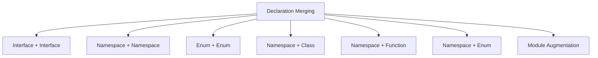
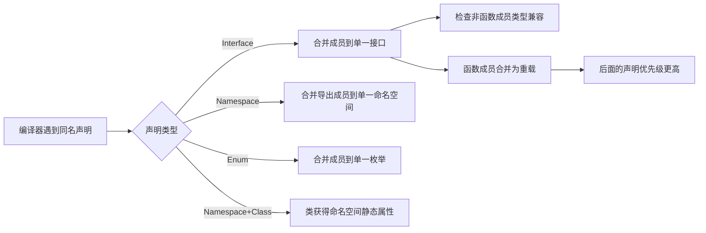
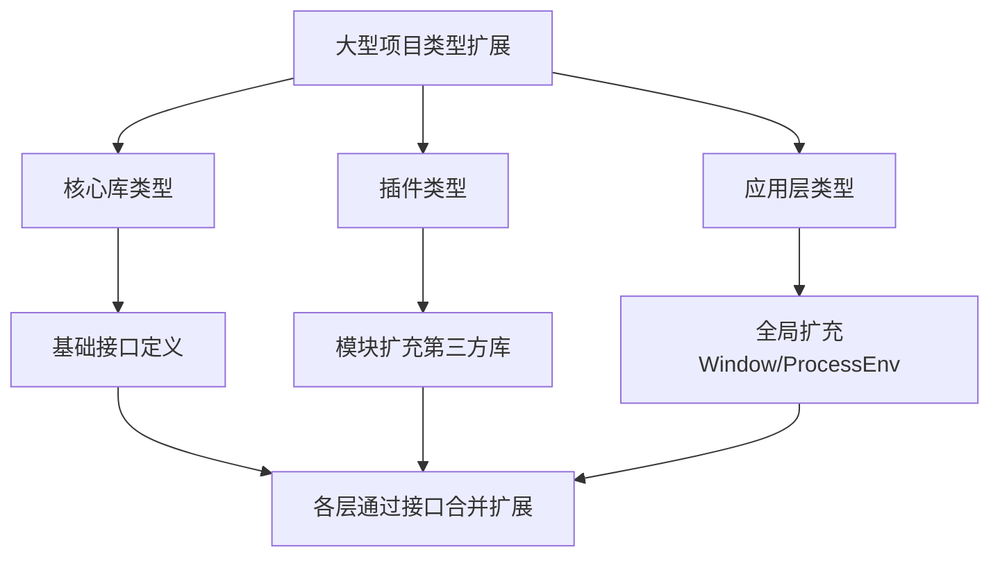
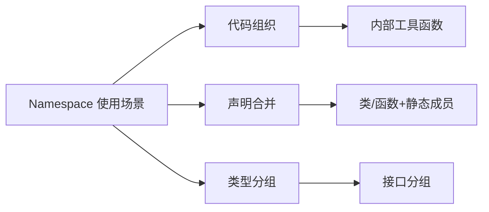

# 第14章 声明合并

声明合并（Declaration Merging）是 TypeScript 的一项独特特性，允许编译器将多个同名声明合并为一个定义。这一机制是 TypeScript 类型声明系统（尤其是 `.d.ts` 文件和第三方类型扩展）的核心支柱之一。本章将系统讲解各类声明合并的规则、应用场景以及在实际项目中的最佳实践。

---

## 14.1 声明合并概述

### 14.1.1 可合并的声明类型

| 声明类型 | 可合并对象 | 合并结果 |
|----------|-----------|---------|
| **Interface** | 同名接口 | 单一接口，成员合并 |
| **Namespace** | 同名命名空间 | 单一命名空间，导出成员合并 |
| **Enum** | 同名枚举 | 单一枚举，成员合并 |
| **Namespace + Class** | 同名命名空间与类 | 类获得命名空间的静态成员 |
| **Namespace + Function** | 同名命名空间与函数 | 函数获得命名空间的属性 |
| **Namespace + Enum** | 同名命名空间与枚举 | 枚举获得命名空间的成员 |

### 14.1.2 不可合并的声明

```typescript
// ❌ 类型别名不可合并
type User = { name: string };
// type User = { age: number }; // 错误：重复标识符

// ❌ 类与类不可合并
class Animal { name: string = ''; }
// class Animal { age: number = 0; } // 错误：重复标识符

// ❌ 变量声明不可合并
const x = 1;
// const x = 2; // 错误：重复声明
```



---

## 14.2 接口合并（Interface Merging）

### 14.2.1 基本规则

同名接口的成员会被合并到同一个接口定义中：

```typescript
interface User {
  name: string;
}

interface User {
  age: number;
}

// ✅ 合并后相当于：
// interface User {
//   name: string;
//   age: number;
// }

const user: User = { name: 'Alice', age: 30 };
```

### 14.2.2 非函数成员的唯一性

非函数成员必须唯一，类型相同则合并，类型不同则报错：

```typescript
interface Box {
  width: number;
}

interface Box {
  width: string; // ❌ 错误：width 的类型不兼容
}
```

### 14.2.3 函数成员的重载合并

函数成员会被合并为重载列表，后面的接口声明优先级更高：

```typescript
interface Logger {
  log(message: string): void;           // 重载 1
}

interface Logger {
  log(message: string, level: number): void;  // 重载 2
}

interface Logger {
  log(message: string, callback: () => void): void;  // 重载 3
}

// 合并后的 Logger.log 有三个重载
// 注意：后面的声明排在重载列表前面（优先匹配）

const logger: Logger = {
  log(message: string, arg?: number | (() => void)) {
    console.log(message, arg);
  }
};
```

### 14.2.4 接口合并的实际应用

```typescript
// 扩展第三方库的类型定义
declare module 'express' {
  interface Request {
    user?: { id: string; name: string }; // 扩展 Express Request
  }
}

// 或者扩展现有接口
interface Window {
  myLib: { version: string; init(): void };
}

// 现在可以在代码中使用 window.myLib
window.myLib.init();
```

---

## 14.3 命名空间合并（Namespace Merging）

### 14.3.1 命名空间与命名空间合并

```typescript
namespace Animals {
  export class Dog {
    bark() { return 'woof'; }
  }
}

namespace Animals {
  export class Cat {
    meow() { return 'meow'; }
  }
}

// ✅ 合并后，Animals 同时包含 Dog 和 Cat
const dog = new Animals.Dog();
const cat = new Animals.Cat();
```

### 14.3.2 命名空间与类合并

```typescript
class Album {
  constructor(public label: string) {}
}

namespace Album {
  export class ClassProperty {}
  export let defaultLabel = 'Unknown';
}

// ✅ Album 既是构造函数，也有命名空间成员
const myAlbum = new Album('Best Hits');
const prop = new Album.ClassProperty();
const label = Album.defaultLabel;
```

**典型应用：内嵌类**

```typescript
class Car {
  constructor(public model: string) {}
}

namespace Car {
  export class Engine {
    start() { return 'vroom'; }
  }
}

const car = new Car('Tesla');
const engine = new Car.Engine();
```

### 14.3.3 命名空间与函数合并

```typescript
function greet(name: string): string {
  return greet.prefix + name + greet.suffix;
}

namespace greet {
  export let prefix = 'Hello, ';
  export let suffix = '!';
}

// ✅ greet 既是函数，也有属性
greet.prefix = 'Hi, ';
console.log(greet('World')); // 'Hi, World!'
```

**典型应用：带属性的工厂函数**

```typescript
function createUser(name: string): createUser.User {
  return { name, createdAt: new Date() };
}

namespace createUser {
  export interface User {
    name: string;
    createdAt: Date;
  }

  export function validate(u: User): boolean {
    return u.name.length > 0;
  }
}

const user = createUser('Alice');
const valid = createUser.validate(user);
```

### 14.3.4 命名空间与枚举合并

```typescript
enum Color {
  Red = 1,
  Green = 2,
}

namespace Color {
  export function mix(a: Color, b: Color): Color {
    return (a + b) as Color;
  }

  export function toString(c: Color): string {
    return Color[c];
  }
}

// ✅ Color 既有枚举成员，也有静态方法
const mixed = Color.mix(Color.Red, Color.Green);
const name = Color.toString(Color.Red);
```

---

## 14.4 枚举合并（Enum Merging）

### 14.4.1 枚举合并规则

```typescript
enum Status {
  Pending = 1,
  Approved = 2,
}

enum Status {
  Rejected = 3,
  Archived = 4,
}

// ✅ 合并后 Status 包含所有四个成员
console.log(Status.Pending);   // 1
console.log(Status.Archived);  // 4
```

### 14.4.2 合并限制

```typescript
enum Direction {
  Up = 'UP',
}

// ❌ 字符串枚举与后续合并有严格限制
// enum Direction {
//   Down = 'DOWN', // ✅ 可以
// }

// ❌ 不能重复定义相同名称的成员
// enum Status {
//   Pending = 999, // 错误：Pending 已在第一个声明中定义
// }
```

---

## 14.5 模块扩充（Module Augmentation）

### 14.5.1 基本概念

模块扩充允许向现有模块添加新的声明，是扩展第三方库类型的标准方式。

```typescript
// 原始模块：lodash.d.ts (第三方库)
// declare module 'lodash' {
//   export function cloneDeep<T>(value: T): T;
// }

// 在你的项目中扩充
declare module 'lodash' {
  // ✅ 添加新函数
  export function myCustomUtil(): string;

  // ✅ 扩展现有接口
  export interface LoDashStatic {
    myMethod(): void;
  }
}

// 使用
import _ from 'lodash';
_.myCustomUtil(); // ✅ 类型正确
```

### 14.5.2 扩充实例

```typescript
// 扩展 Vue 组件实例属性
declare module '@vue/runtime-core' {
  interface ComponentCustomProperties {
    $myService: MyService;
  }
}

// 扩展 Express Request
declare module 'express-serve-static-core' {
  interface Request {
    user?: User;
    requestId: string;
  }
}

// 扩展 Axios 配置
declare module 'axios' {
  interface AxiosRequestConfig {
    retry?: number;
    retryDelay?: number;
  }
}
```

### 14.5.3 模块扩充的查找规则

```typescript
// TypeScript 按照以下顺序查找模块声明：
// 1. 同名的 .ts/.tsx/.d.ts 文件
// 2. node_modules/@types/xxx/index.d.ts
// 3. package.json 中的 types 字段
// 4. 全局声明中的 declare module 'xxx'

// ✅ 最佳实践：在项目中创建类型声明文件
// types/axios.d.ts
declare module 'axios' {
  interface AxiosInstance {
    customGet<T>(url: string): Promise<T>;
  }
}
```

### 14.5.4 全局扩充（Global Augmentation）

```typescript
// 扩充全局对象
declare global {
  interface Window {
    electronAPI?: {
      sendMessage(channel: string, data: any): void;
      onMessage(channel: string, callback: (data: any) => void): void;
    };
  }

  // 扩充 process.env 类型
  namespace NodeJS {
    interface ProcessEnv {
      readonly NODE_ENV: 'development' | 'production' | 'test';
      readonly API_URL: string;
    }
  }
}

export {}; // 使文件成为模块（必须，否则 global 不起作用）
```

### 14.5.5 环境模块声明（Ambient Modules）

```typescript
// 为没有类型定义的库声明模块
declare module 'legacy-lib' {
  export function doSomething(): void;
  export const version: string;
}

// 使用通配符声明一类模块
declare module '*.css' {
  const content: { [className: string]: string };
  export default content;
}

declare module '*.svg' {
  const content: React.FunctionComponent<React.SVGAttributes<SVGElement>>;
  export default content;
}

declare module '*.png' {
  const content: string;
  export default content;
}

declare module '*.json' {
  const content: any;
  export default content;
}
```

---

## 14.6 实际应用场景

### 14.6.1 插件架构的类型扩展

```typescript
// 核心框架类型
interface Plugin {
  name: string;
  install(): void;
}

interface App {
  use(plugin: Plugin): void;
}

// 插件 A 扩展 App 的类型
declare module './core' {
  interface App {
    $router: Router;
  }
}

// 插件 B 扩展 App 的类型
declare module './core' {
  interface App {
    $store: Store;
  }
}

// 最终 App 同时包含 $router 和 $store
```

### 14.6.2 分层类型定义

```typescript
// 基础层
declare module 'my-app' {
  interface Config {
    env: string;
  }
}

// 数据库层扩充
declare module 'my-app' {
  interface Config {
    database: { host: string; port: number };
  }
}

// 缓存层扩充
declare module 'my-app' {
  interface Config {
    cache: { ttl: number };
  }
}

// 使用
import { Config } from 'my-app';
const config: Config = {
  env: 'production',
  database: { host: 'localhost', port: 5432 },
  cache: { ttl: 3600 }
};
```

### 14.6.3 向后兼容的类型演进

```typescript
// v1 类型
interface APIResponse {
  data: unknown;
  status: number;
}

// v2 新增字段（通过声明合并，保持向后兼容）
interface APIResponse {
  pagination?: { page: number; total: number };
}

// v3 再新增
interface APIResponse {
  meta?: { requestId: string; timestamp: number };
}

// 最终 APIResponse 包含所有版本字段
```

### 14.6.4 测试中的类型扩展

```typescript
// jest.d.ts
import '@testing-library/jest-dom';

declare global {
  namespace jest {
    interface Matchers<R> {
      toBeWithinRange(floor: number, ceiling: number): R;
    }
  }
}

export {};
```

---

## 14.7 声明文件（.d.ts）最佳实践

### 14.7.1 项目结构

```
src/
├── index.ts
├── types/
│   ├── global.d.ts        # 全局类型扩充
│   ├── modules/
│   │   ├── express.d.ts   # express 模块扩充
│   │   └── lodash.d.ts    # lodash 模块扩充
│   └── assets.d.ts        # 资源文件声明
```

### 14.7.2 声明文件模板

```typescript
// types/modules/express.d.ts

declare module 'express' {
  global {
    namespace Express {
      // 扩展 Request 接口
      interface Request {
        user?: User;
      }

      // 扩展 Response 接口
      interface Response {
        sendData<T>(data: T): void;
      }
    }
  }

  // 扩展 Express 应用
  interface Application {
    context: AppContext;
  }
}

// 辅助类型（不需要导出）
interface User {
  id: string;
  email: string;
}

interface AppContext {
  db: Database;
  cache: Cache;
}
```

### 14.7.3 tsconfig.json 配置

```json
{
  "compilerOptions": {
    "typeRoots": ["./node_modules/@types", "./src/types"],
    "types": ["node", "jest"]
  }
}
```

### 14.7.4 自动生成声明文件

```typescript
// tsconfig.json 中启用声明文件生成
{
  "compilerOptions": {
    "declaration": true,
    "declarationMap": true,
    "outDir": "./dist"
  }
}

// 运行 tsc 后自动生成 .d.ts 文件
// 适合发布库时同时提供类型定义
```

---

## 14.8 常见陷阱与解决方案

### 14.8.1 模块扩充不生效

```typescript
// ❌ 错误：忘记 export {} 使文件成为模块
declare global {
  interface Window {
    myApi: any;
  }
}
// 需要：export {};

// ✅ 正确做法
export {};
declare global {
  interface Window {
    myApi: any;
  }
}
```

### 14.8.2 重复声明冲突

```typescript
// ❌ 错误：两个模块扩充声明了不兼容的成员
declare module 'my-lib' {
  interface Config { timeout: string; }  // 字符串
}

declare module 'my-lib' {
  interface Config { timeout: number; }  // 数字 — 冲突！
}

// ✅ 解决方案：确保所有扩充一致，或使用可选属性/联合类型
declare module 'my-lib' {
  interface Config { timeout: string | number; }
}
```

### 14.8.3 命名空间与 ES Module 混淆

```typescript
// ❌ 错误：在 ES Module 文件中使用 namespace 导出
namespace MyLib {
  export function foo() {}
}

// ✅ ES Module 推荐方式
export function foo() {}
export function bar() {}

// ✅ 命名空间仅在需要合并或组织内部类型时使用
namespace Internal {
  export interface Config {}
}
export type Config = Internal.Config;
```

### 14.8.4 枚举合并的值冲突

```typescript
enum Status {
  A = 1,
}

// ❌ 隐式值可能冲突
enum Status {
  B, // 隐式值为 0，与 A = 1 不冲突，但可能令人困惑
  C, // 隐式值为 1，与 A = 1 冲突！
}

// ✅ 显式指定所有值
enum Status {
  B = 2,
  C = 3,
}
```

### 14.8.5 模块路径解析问题

```typescript
// ❌ 错误：模块路径不匹配
declare module 'lodash/debounce' {
  export function debounce(): void;
}

// ✅ 需要与 import 路径完全一致
// import debounce from 'lodash/debounce';
// 对应的声明：
declare module 'lodash/debounce' {
  export default function debounce<T extends (...args: any[]) => any>(
    func: T,
    wait?: number
  ): T;
}
```

### 14.8.6 三斜线指令的使用场景

```typescript
// ✅ 在某些场景下仍需使用三斜线指令
/// <reference types="node" />
/// <reference path="./custom-types.d.ts" />

// 主要用于：
// 1. 声明文件之间的依赖关系
// 2. 引用未通过 import 引入的类型
// 3. 旧版 DefinitelyTyped 包

// ❌ 现代项目优先使用 import/export
import type { Request } from 'express';
```

---

## 14.9 声明合并的底层机制



| 合并类型 | 成员处理 | 访问修饰符 | 泛型参数 |
|---------|---------|-----------|---------|
| 接口+接口 | 同名非函数成员必须类型兼容 | 取并集 | 必须完全相同 |
| 命名空间+命名空间 | 导出成员合并 | 各自独立 | N/A |
| 命名空间+类 | 类获得命名空间导出成员 | N/A | 类泛型优先 |
| 命名空间+函数 | 函数获得命名空间导出成员 | N/A | 函数泛型优先 |
| 枚举+枚举 | 成员值不能冲突 | N/A | N/A |

---

## 14.10 大型项目中的声明合并策略



| 策略 | 适用场景 | 示例 |
|------|---------|------|
| 核心接口 + 分层合并 | monorepo 多包共享类型 | 基础包定义 `User`，各业务包合并扩展 |
| 模块扩充 | 扩展第三方库 | `declare module 'express'` |
| 全局扩充 | 全局对象属性 | `declare global { interface Window }` |
| 命名空间+类 | 工具库组织 | `class MyLib` + `namespace MyLib` |

---

## 14.11 命名空间在现代 TypeScript 中的角色



| 场景 | 推荐方案 | 原因 |
|------|---------|------|
| 新项目的代码组织 | ES Module | 标准、树摇友好 |
| 需要声明合并 | Namespace | 与类/函数/枚举合并的唯一方式 |
| 类型分组 | Namespace 或普通模块 | 看是否需要运行时对象 |
| `.d.ts` 文件 | Namespace 或 declare module | 声明文件传统上常用 |

---

## 14.12 本章小结

- **声明合并**是 TypeScript 将多个同名声明组合为单一定义的特性，支持接口、命名空间、枚举以及命名空间与类/函数/枚举的合并。
- **接口合并**是最常用的合并形式，非函数成员必须唯一且类型兼容，函数成员合并为重载列表（后面的声明优先级更高）。
- **命名空间合并**允许将同名命名空间的导出成员组合在一起，命名空间还可以与类、函数、枚举合并，为它们添加静态属性或辅助方法。
- **枚举合并**将同名枚举的成员合并，但需注意值不能冲突，且字符串枚举的合并有额外限制。
- **模块扩充（Module Augmentation）** 是扩展第三方库类型的标准方式，通过 `declare module 'xxx'` 向现有模块添加新声明。
- **全局扩充（Global Augmentation）** 通过 `declare global` 修改全局类型（如 `Window`、`NodeJS.ProcessEnv`），文件必须以 `export {}` 标记为模块。
- **环境模块声明**用于为没有内置类型定义的库（尤其是纯 JS 库或资源文件）提供类型信息。
- 合理运用声明合并，可以在不修改原始代码的情况下安全地扩展类型系统，是大型项目、插件架构和第三方库集成的关键技术。

---

## 参考资源

1. [TypeScript Handbook: Declaration Merging](https://www.typescriptlang.org/docs/handbook/declaration-merging.html)
2. [TypeScript Handbook: Declaration Files](https://www.typescriptlang.org/docs/handbook/declaration-files/introduction.html)
3. [TypeScript Handbook: Modules](https://www.typescriptlang.org/docs/handbook/modules.html)
4. [Module Augmentation in TypeScript](https://www.typescriptlang.org/docs/handbook/declaration-merging.html#module-augmentation)
5. [Creating .d.ts Files from .js Files](https://www.typescriptlang.org/docs/handbook/declaration-files/dts-from-js.html)
6. [DefinitelyTyped Contribution Guide](https://definitelytyped.org/guides/contributing.html)
7. [TypeScript: Global Modification Modules](https://www.typescriptlang.org/docs/handbook/namespaces.html#aliases)
8. [Effective TypeScript: Understand Declaration Merging](https://effectivetypescript.com/)
