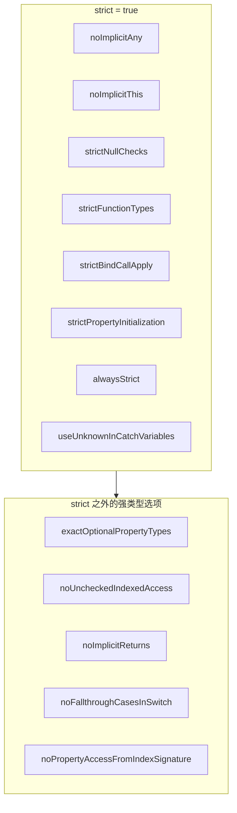
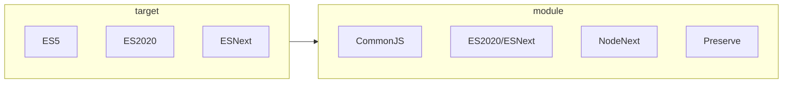
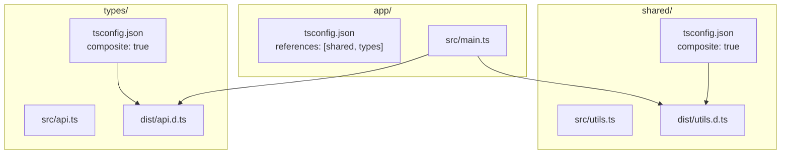

# 16 tsconfig 完整配置指南 — compilerOptions 全解析与类型系统影响

:::tip 本章核心
`tsconfig.json` 不是简单的"编译开关"，它是 TypeScript 类型系统的**运行时配置界面**。每一个 `compilerOptions` 选项都在修改类型检查器的行为——理解这些选项的类型语义，才能为你的项目选择最精确、最安全的配置。
:::

---

## 16.1 tsconfig.json 结构总览

### 16.1.1 顶层字段分类

```jsonc
{
  // ===== 编译器行为 =====
  "compilerOptions": { /* 类型系统核心配置 */ },

  // ===== 输入文件控制 =====
  "include": ["src/**/*"],
  "exclude": ["node_modules", "**/*.test.ts"],
  "files": ["src/main.ts"],        // 精确列表，优先级高于 include
  "extends": "./base.json",        // 配置继承

  // ===== 工程化功能 =====
  "references": [{ "path": "./common" }],  // Project References
  "composite": true,                          // 启用项目引用编译
  "tsBuildInfoFile": "./.tsbuildinfo",        // 增量编译缓存

  // ===== 外部工具集成 =====
  "watchOptions": { /* 文件监控配置 */ },
  "typeAcquisition": { "enable": true }       // 自动类型获取（JS 项目）
}
```

### 16.1.2 配置文件解析规则

| 规则 | 行为 |
|------|------|
| `extends` 合并 | 子配置覆盖父配置，`compilerOptions` 深度合并，数组替换而非合并 |
| 路径解析 | `extends` 支持 npm 包（如 `@tsconfig/node20`）和相对路径 |
| 空 `include` | 若 `include` 和 `files` 都未指定，默认包含目录下所有 `.ts/.tsx/.d.ts`（排除 `exclude`） |
| 配置文件查找 | `tsc` 会递归向上查找 `tsconfig.json`，`--project` 可指定路径 |
| JSON 注释 | tsconfig 允许 JSONC 格式（含注释），但某些工具可能不支持 |

### 16.1.3 推荐的基础模板

```jsonc
{
  "extends": "@tsconfig/strictest/tsconfig.json",
  "compilerOptions": {
    "target": "ES2022",
    "module": "NodeNext",
    "moduleResolution": "NodeNext",
    "lib": ["ES2022"],
    "outDir": "./dist",
    "rootDir": "./src",
    "sourceMap": true,
    "declaration": true,
    "declarationMap": true
  },
  "include": ["src/**/*"],
  "exclude": ["**/*.test.ts", "**/*.spec.ts"]
}
```

---

## 16.2 类型系统核心选项

### 16.2.1 strict 系列标志全景

启用 `"strict": true` 等价于开启以下所有标志。建议**始终启用**，然后根据需要逐个关闭：



### 16.2.2 noImplicitAny — 隐式 any 的终结者

```ts
// noImplicitAny: false（默认关闭时）
function fn1(x) {        // x: any — 无类型注解 = any
  return x + 1;
}

// noImplicitAny: true（strict 模式）
function fn2(x) {        // ❌ Parameter 'x' implicitly has an 'any' type
  return x + 1;
}

function fn3(x: number) { // ✅ 显式注解
  return x + 1;
}
```

| 场景 | `noImplicitAny: false` | `noImplicitAny: true` |
|------|----------------------|----------------------|
| 未注解参数 | `any` | 编译错误 |
| 未注解返回值 | 推断为具体类型 | 推断为具体类型（不受影响） |
| `const arr = []` | `any[]` | `never[]`（无法 push） |
| 第三方库无 `.d.ts` | 隐式 any | 需 `declare module` |

### 16.2.3 strictNullChecks — null 安全的基石

这是 TypeScript 类型系统中**影响最大的单个标志**：

```ts
// strictNullChecks: false
let name: string = null;     // ✅ 允许
function greet(name: string) {
  console.log(name.toUpperCase()); // 运行时可能崩溃
}
greet(null); // 不报错

// strictNullChecks: true
let name2: string = null;    // ❌ Type 'null' is not assignable to type 'string'
function greet2(name: string) {
  console.log(name.toUpperCase()); // ✅ 编译时保证非 null
}
greet2(null); // ❌ Error

// 必须使用联合类型显式声明可空性
function greet3(name: string | null) {
  if (name !== null) {
    console.log(name.toUpperCase()); // ✅ 收窄后安全
  }
}
```

**启用 `strictNullChecks` 的类型系统变化：**

| 类型 | 关闭时 | 开启时 |
|------|--------|--------|
| `string` | `string \| null \| undefined` | 仅 `string` |
| `number` | `number \| null \| undefined` | 仅 `number` |
| 可选参数 `x?` | `T \| undefined` | `T \| undefined` |
| 可选属性 `p?` | `T \| undefined` | `T \| undefined` |
| `null` 赋值 | 允许 | 需显式联合类型 |

### 16.2.4 strictFunctionTypes — 参数逆变检查

```ts
interface Animal { name: string; }
interface Dog extends Animal { bark(): void; }

// strictFunctionTypes: false（双变行为）
type AnimalFn = (a: Animal) => void;
type DogFn = (d: Dog) => void;

let animalFn: AnimalFn = (d: Dog) => {}; // ✅ 危险：允许
animalFn({ name: "Cat" }); // 运行时 d.bark() 不存在！

// strictFunctionTypes: true
let animalFn2: AnimalFn = (d: Dog) => {}; // ❌ Error
// Type '(d: Dog) => void' is not assignable to type '(a: Animal) => void'
```

| 变型位置 | `strictFunctionTypes: false` | `strictFunctionTypes: true` |
|---------|----------------------------|----------------------------|
| 函数参数（独立函数） | 双变（Bivariant） | **逆变（Contravariant）** |
| 方法参数（对象方法） | 双变（兼容旧代码） | 双变（兼容旧代码） |
| 返回值 | 协变 | 协变 |

> 方法参数保持双变是为了兼容大量现有的 class 继承模式（如 `Array.forEach` 的回调）。

### 16.2.5 strictPropertyInitialization — 属性初始化检查

```ts
class User {
  // strictPropertyInitialization: true
  name: string;           // ❌ Property 'name' has no initializer
  age: number = 0;        // ✅
  email!: string;         // ✅ 显式断言（确定在别处初始化）
  readonly id: string;

  constructor() {
    this.id = crypto.randomUUID(); // ✅ constructor 中初始化
  }
}
```

### 16.2.6 exactOptionalPropertyTypes — 精确的可选属性

```ts
// exactOptionalPropertyTypes: false（默认）
interface Config {
  timeout?: number;
}

const c1: Config = { timeout: undefined }; // ✅ 允许
const c2: Config = {};                      // ✅ 允许

// exactOptionalPropertyTypes: true
const c3: Config = { timeout: undefined }; // ❌ Type 'undefined' is not assignable
// 必须完全省略该属性
const c4: Config = {};                      // ✅ 唯一正确方式

// 如需显式允许 undefined：
interface Config2 {
  timeout?: number | undefined;
}
```

这个选项对于**序列化/反序列化**场景特别重要：

```ts
// 发送给 API 的数据：undefined 会被序列化为 null 或省略
// exactOptionalPropertyTypes 确保你不会误传 undefined
function sendConfig(config: Config) {
  fetch("/api/config", {
    method: "POST",
    body: JSON.stringify(config) // { timeout: undefined } → 危险
  });
}
```

---

## 16.3 模块系统配置

### 16.3.1 module 与 target 的组合矩阵



| `module` 值 | 输出格式 | 适用场景 |
|------------|---------|---------|
| `CommonJS` | `module.exports` / `require` | Node.js 传统项目 |
| `ES6` / `ES2015` / `ES2020` / `ESNext` | `import` / `export` | 现代浏览器/ESM Node |
| `Node16` / `NodeNext` | 根据 package.json `type` 自动选择 | Node.js 双模项目 |
| `Preserve` | 保留原始 ESM 语法 | 由其他工具（如 Vite）处理 |
| `UMD` / `AMD` / `System` | 历史模块格式 | 遗留系统维护 |

### 16.3.2 moduleResolution 策略详解

```ts
// moduleResolution: "classic"（已废弃，仅限 TS 1.x 兼容）
import { x } from "./module";     // 查找 ./module.ts, ./module.d.ts
import { y } from "lib";           // 查找 lib.ts, lib.d.ts（无 node_modules 查找！）

// moduleResolution: "node"（Node.js 10+ 行为）
import { y } from "lib";           // 查找 node_modules/lib/package.json["types"]

// moduleResolution: "node16" / "nodenext"（Node.js ESM 严格行为）
import { y } from "lib";           // 支持 package.json exports/imports 映射
import { z } from "./file";        // 必须显式写 .js 扩展名（ESM 模式）

// moduleResolution: "bundler"（Vite/Webpack/Rollup 行为）
import { y } from "lib";           // 支持 exports 映射，但允许无扩展名导入
```

| 策略 | `import` 扩展名 | `exports` 字段 | `require` 支持 | 推荐场景 |
|------|---------------|--------------|--------------|---------|
| `node` | 可选 `.js` | ❌ 不支持 | ✅ | 传统 CJS 项目 |
| `node16` | ESM 必须 `.js` | ✅ | ✅ | 双模 Node 库 |
| `nodenext` | ESM 必须 `.js` | ✅ | ✅ | 最新 Node 项目 |
| `bundler` | 可选 | ✅ | ❌ | 前端构建工具 |

### 16.3.3 ESM/CJS 互操作的类型问题

```ts
// tsconfig.json: { "module": "NodeNext", "moduleResolution": "NodeNext" }

// CJS 模块的默认导入需要特殊处理
import fs from "fs";              // ❌ 可能报错，取决于 esModuleInterop
import * as fs2 from "fs";        // ✅ 安全方式
import { readFileSync } from "fs"; // ✅ 命名导入

// esModuleInterop: true 启用以下行为
import fs3 from "fs";             // ✅ 允许默认导入（ helper 转换）
```

| 选项 | 作用 |
|------|------|
| `esModuleInterop` | 允许默认导入 CJS 模块，生成 `__importDefault` helper |
| `allowSyntheticDefaultImports` | 仅类型检查层面允许，不生成 helper |
| `forceConsistentCasingInFileNames` | 强制文件名大小写一致（跨平台兼容性） |

---

## 16.4 类型声明与生成

### 16.4.1 declaration 系列选项

```jsonc
{
  "compilerOptions": {
    "declaration": true,           // 生成 .d.ts 文件
    "declarationMap": true,        // 生成 .d.ts.map（源码映射到 TS）
    "emitDeclarationOnly": true,   // 只生成声明文件，不输出 .js
    "composite": true,             // 启用 Project References 必需
    "declarationDir": "./types"    // .d.ts 输出目录
  }
}
```

### 16.4.2 声明文件的类型系统影响

```ts
// 当 declaration: true 时，TS 会执行"声明发射"检查
// 某些类型无法被序列化到 .d.ts 中

export class Service {
  // ✅ 可序列化：显式类型
  data: string[] = [];

  // ❌ 可能报错：依赖未导出的类型
  process(item: PrivateHelper): void {} // PrivateHelper 未 export
}

type PrivateHelper = { id: number }; // 必须 export 才能公开使用
```

| 错误 | 原因 | 解决方案 |
|------|------|---------|
| TS4023 | 导出的变量使用了未导出的类型 | 导出该类型或使用 `ReturnType<typeof fn>` |
| TS4010 | 未导出的类型被用于公开的签名 | 添加 `export` 关键字 |
| TS4058 | 返回类型包含 `typeof` 私有变量 | 提取为显式接口类型 |

### 16.4.3 isolatedModules — 安全转译的前提

```ts
// isolatedModules: true 时，每个文件必须能独立编译

// ❌ 错误：类型导入被误认为值导入
import { SomeType } from "./types";
const x = SomeType; // 运行时 SomeType 被擦除，报错

// ✅ 正确：使用 type-only import
import type { SomeType } from "./types";
import { type SomeType } from "./types"; // TS 4.5+ inline type import
```

`isolatedModules` 强制要求：

- 不能使用未初始化的 `const enum`（值被内联，跨文件无法处理）
- `export =` 和 `import =` 语法受限
- Babel/tsc --transpileOnly 安全运行的前提

---

## 16.5 类型推断与检查精度

### 16.5.1 noImplicitThis — this 上下文检查

```ts
// noImplicitThis: false
function getName() {
  return this.name; // this: any — 危险！
}

// noImplicitThis: true
function getName2() {
  return this.name; // ❌ 'this' implicitly has type 'any'
}

// ✅ 显式 this 类型（第一个伪参数）
function getName3(this: { name: string }) {
  return this.name; // this 已显式约束
}
```

### 16.5.2 noUncheckedIndexedAccess — 索引访问的严格性

```ts
// noUncheckedIndexedAccess: false（默认）
const arr: string[] = ["a", "b"];
const x = arr[100]; // string — 过于乐观
x.toUpperCase();    // 运行时可能崩溃

// noUncheckedIndexedAccess: true
const y = arr[100]; // string | undefined — 安全
y.toUpperCase();    // ❌ Object is possibly 'undefined'

// 对象索引签名同样受影响
interface Dict {
  [key: string]: number;
}
const d: Dict = { a: 1 };
const z = d["b"]; // number | undefined
```

| 启用代价 | 说明 |
|---------|------|
| 代码量增加 | 需要频繁添加 `!` 或 `if (x !== undefined)` |
| 数组遍历 | `for...of` 不受影响，`for...i` 索引访问受影响 |
| 已知键 | 字面量键访问（`obj["knownKey"]`）在类型中存在时不受影响 |

### 16.5.3 strictBindCallApply — bind/call/apply 类型安全

```ts
// strictBindCallApply: false
function fn(a: number, b: string): boolean {
  return true;
}

fn.call(null, 1, 2);       // ✅ 不检查参数类型
fn.apply(null, [1, 2]);    // ✅ 不检查

// strictBindCallApply: true
fn.call(null, 1, "ok");    // ✅
fn.call(null, 1, 2);       // ❌ Argument of type 'number' is not assignable to 'string'
fn.apply(null, [1, "ok"]); // ✅
fn.apply(null, [1, 2]);    // ❌
```

### 16.5.4 useUnknownInCatchVariables — catch 参数的安全默认值

```ts
// useUnknownInCatchVariables: false（或 strict 未开启）
try {
  riskyOp();
} catch (e) {
  e.message; // ✅ e: any — 可以随意访问
}

// useUnknownInCatchVariables: true（strict 的一部分）
try {
  riskyOp();
} catch (e) {
  e.message; // ❌ e is of type 'unknown'

  // ✅ 必须先收窄
  if (e instanceof Error) {
    console.log(e.message);
  } else if (typeof e === "string") {
    console.log(e);
  }
}
```

---

## 16.6 工程化与性能选项

### 16.6.1 增量编译与项目引用

```jsonc
{
  "compilerOptions": {
    "incremental": true,              // 启用增量编译
    "tsBuildInfoFile": "./.tsbuildinfo",
    "composite": true,                // 项目引用必需
    "declaration": true,              // composite 强制要求
    "declarationMap": true
  },
  "references": [
    { "path": "../shared" },
    { "path": "../types" }
  ]
}
```

### 16.6.2 项目引用的类型系统影响



| 特性 | 说明 |
|------|------|
| `composite` | 强制 `declaration: true`，输出必须完整，不允许隐式包含 |
| `references` | 建立项目依赖图，`tsc --build` 按拓扑序编译 |
| `prepend` | 控制输出文件的拼接顺序（较少使用） |
| 边界检查 | 项目只能引用其他项目的**输出 `.d.ts`**，不能直接访问源码 |

### 16.6.3 skipLibCheck — 跳过声明文件检查

```jsonc
{
  "compilerOptions": {
    "skipLibCheck": true  // 不检查 node_modules 中的 .d.ts
  }
}
```

| 场景 | 建议 |
|------|------|
| 大型项目 | `true` — 显著减少编译时间（可能跳过 80% 的类型检查） |
| 库开发 | `false` — 确保你的公共 API 类型完整正确 |
| 类型冲突 | `true` — 当两个库的 `.d.ts` 冲突时快速绕过 |

> ⚠️ `skipLibCheck: true` 意味着 TypeScript 不会检查 `.d.ts` 文件的内部一致性。如果你的库导入了有问题的类型定义，问题会**传递到用户代码**中。

### 16.6.4 性能调优选项速查

| 选项 | 作用 | 性能影响 |
|------|------|---------|
| `incremental` | 缓存未变更文件的编译结果 | 大幅减少重复编译时间 |
| `skipLibCheck` | 跳过 `.d.ts` 类型检查 | 减少 30-80% 编译时间 |
| `isolatedModules` | 禁止跨文件类型推断 | 轻微减少，主要用于工具兼容 |
| `noEmitOnError` | 有类型错误时不输出文件 | 开发时可关闭以加速 |
| `preserveWatchOutput` | watch 模式不清屏 | 体验优化 |
| `assumeChangesOnlyAffectDirectDependencies` | 增量编译更保守 | 减少 watch 模式重新编译范围 |

---

## 16.7 不同项目类型的推荐配置

### 16.7.1 Node.js 后端服务

```jsonc
// tsconfig.json
{
  "extends": "@tsconfig/node20/tsconfig.json",
  "compilerOptions": {
    "module": "NodeNext",
    "moduleResolution": "NodeNext",
    "target": "ES2022",
    "strict": true,
    "exactOptionalPropertyTypes": true,
    "noUncheckedIndexedAccess": true,
    "noImplicitReturns": true,
    "noFallthroughCasesInSwitch": true,
    "esModuleInterop": true,
    "forceConsistentCasingInFileNames": true,
    "outDir": "./dist",
    "rootDir": "./src",
    "sourceMap": true,
    "declaration": false
  },
  "include": ["src/**/*"]
}
```

### 16.7.2 前端应用（Vite/Webpack）

```jsonc
{
  "compilerOptions": {
    "target": "ES2020",
    "module": "ESNext",
    "moduleResolution": "bundler",
    "lib": ["ES2020", "DOM", "DOM.Iterable"],
    "jsx": "preserve",
    "strict": true,
    "noUnusedLocals": true,
    "noUnusedParameters": true,
    "noFallthroughCasesInSwitch": true,
    "allowImportingTsExtensions": true,
    "resolveJsonModule": true,
    "isolatedModules": true,
    "noEmit": true,           // 由构建工具处理输出
    "skipLibCheck": true
  },
  "include": ["src"]
}
```

### 16.7.3 可复用库（双模 ESM/CJS）

```jsonc
{
  "compilerOptions": {
    "target": "ES2020",
    "module": "NodeNext",
    "moduleResolution": "NodeNext",
    "strict": true,
    "declaration": true,
    "declarationMap": true,
    "composite": true,
    "outDir": "./dist",
    "rootDir": "./src",
    "esModuleInterop": true,
    "forceConsistentCasingInFileNames": true,
    "skipLibCheck": false     // 库开发不跳过
  },
  "include": ["src/**/*"]
}
```

### 16.7.4 Monorepo 子项目

```jsonc
// packages/app/tsconfig.json
{
  "extends": "../../tsconfig.base.json",
  "compilerOptions": {
    "outDir": "./dist",
    "rootDir": "./src",
    "composite": true
  },
  "references": [
    { "path": "../core" },
    { "path": "../utils" }
  ],
  "include": ["src/**/*"]
}
```

---

## 16.8 高级配置技巧

### 16.8.1 条件类型与配置标志

```ts
// 在类型定义中感知 tsconfig 配置是不可能的（类型擦除）
// 但可以通过模块解析配置类型路径

// tsconfig.json
{
  "compilerOptions": {
    "paths": {
      "#env": ["./src/types/env.production.ts"]
    }
  }
}

// 在 CI 构建时切换不同的 env 文件来模拟条件类型
```

### 16.8.2 typeRoots 与 types 的精确控制

```jsonc
{
  "compilerOptions": {
    // 只包含指定目录的类型定义
    "typeRoots": ["./node_modules/@types", "./src/types"],

    // 显式白名单：只加载这些包的全局类型
    "types": ["node", "jest", "./src/types/custom"],

    // 阻止自动加载 @types 包
    "types": []  // 空数组 = 不自动包含任何全局类型
  }
}
```

### 16.8.3 lib 配置的精确选择

```jsonc
{
  "compilerOptions": {
    // 不加载默认 lib，完全手动控制
    "noLib": true,

    // 或精确选择所需的 lib
    "lib": [
      "ES2022.Promise",      // Promise.allSettled 等
      "ES2022.Array",        // Array.at 等
      "DOM",                 // window/document
      "DOM.Iterable",        // DOM 集合的迭代器
      "WebWorker"            // 如需 Web Worker 类型
    ]
  }
}
```

| lib 名称 | 包含内容 |
|---------|---------|
| `ES5` - `ESNext` | ECMAScript 各版本的运行时 API |
| `DOM` | 浏览器 DOM API |
| `DOM.Iterable` | DOM 集合的 `[Symbol.iterator]` |
| `ScriptHost` | Windows Script Host API |
| `WebWorker` / `Worker` | Web Worker 全局环境 |

---

## 16.9 配置诊断与调试

### 16.9.1 查看实际生效的配置

```bash
# 展示 tsconfig 的完整解析结果（含继承合并）
npx tsc --showConfig

# 展示编译文件的包含关系
npx tsc --listFiles

# 展示文件为何被包含
npx tsc --listEmittedFiles

# 详细追踪模块解析过程
npx tsc --traceResolution
```

### 16.9.2 常见配置错误诊断

| 错误现象 | 根因 | 解决方案 |
|---------|------|---------|
| `Cannot find module 'xxx'` | `moduleResolution` 不匹配 | 前端用 `bundler`，Node 用 `NodeNext` |
| `Cannot find name 'window'` | `lib` 未包含 `DOM` | 添加 `"lib": ["DOM"]` |
| `.js` 文件不被检查 | `allowJs` 未开启 | `"allowJs": true` |
| `import` 语句报错 | `module` 设置为 `CommonJS` | 改为 `ESNext` 或 `NodeNext` |
| 类型定义重复 | `skipLibCheck: false` + 冲突定义 | 启用 `skipLibCheck` 或 `types: []` |
| 项目引用编译失败 | `composite: true` 但 `files` 含外部文件 | 确保 `rootDir` 正确设置 |

---

## 16.10 本章小结

| 概念 | 一句话总结 |
|------|------------|
| `strict` | 一键开启 8 个核心严格标志，新建项目必选 |
| `strictNullChecks` | 将 `null/undefined` 从所有基础类型中分离 |
| `strictFunctionTypes` | 函数参数位置强制逆变检查（非方法） |
| `exactOptionalPropertyTypes` | 可选属性不能显式赋 `undefined` |
| `noUncheckedIndexedAccess` | 索引访问返回 `T \| undefined` |
| `moduleResolution` | `bundler` 前端友好，`NodeNext` Node 最精确 |
| `isolatedModules` | 单文件可独立编译，Babel 等工具必需 |
| `composite` | Project References 的基石，强制完整声明输出 |
| `skipLibCheck` | 编译加速利器，库开发建议关闭 |
| `paths` | 类型级别的模块别名，编译时替换 |

---

## 参考与延伸阅读

1. [TSConfig Reference](https://www.typescriptlang.org/tsconfig) — 官方完整选项参考，每个选项都有详细说明和示例
2. [TypeScript Handbook: Project References](https://www.typescriptlang.org/docs/handbook/project-references.html) — 大型项目拆分编译指南
3. [TSConfig Bases](https://github.com/tsconfig/bases) — 社区维护的项目类型预设配置
4. [TypeScript 5.0 Module Resolution](https://devblogs.microsoft.com/typescript/announcing-typescript-5-0/#moduleresolution-bundler) — Bundler 模式详解
5. [Strict Compiler Options in TypeScript](https://www.typescriptlang.org/docs/handbook/compiler-options-in-msbuild.html) — 严格选项的工程化影响
6. [TypeScript Performance](https://github.com/microsoft/TypeScript/wiki/Performance) — 官方性能优化指南

---

:::info 下一章
探索 TypeScript 类型系统的性能边界，学习如何诊断和优化复杂类型的编译时间 → [17 类型系统性能优化](./17-performance-optimization.md)
:::
