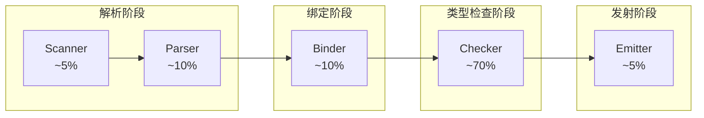
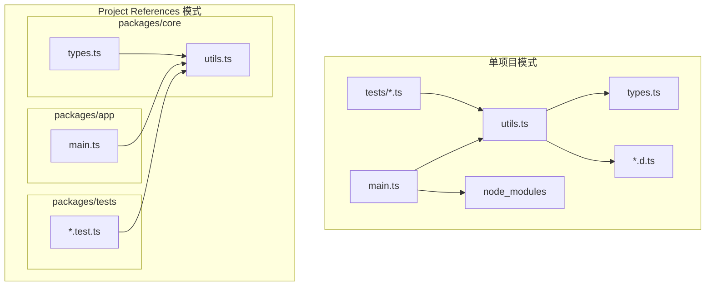
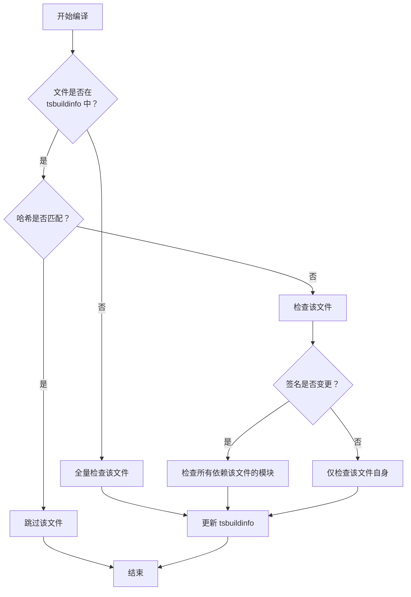

# 17 类型系统性能 — 编译优化、Project References 与增量编译

:::tip 本章核心
TypeScript 类型检查器的性能特征与运行时 JavaScript 截然不同：**递归类型展开、深度条件类型、泛型实例化爆炸**是三大性能杀手。理解类型检查器的工作机制，才能写出"编译快"的类型代码。
:::

---

## 17.1 类型检查的性能模型

### 17.1.1 编译阶段耗时分布



> **关键洞察**：类型检查（Checker）通常占编译时间的 **60-80%**。优化类型检查 = 优化整体编译速度。

### 17.1.2 类型系统的计算复杂度

| 操作 | 时间复杂度 | 触发场景 |
|------|----------|---------|
| 基础类型赋值 | O(1) | `let x: string = "a"` |
| 结构化类型比较 | O(n) | 对象字面量类型兼容性检查 |
| 联合类型分发 | O(2^n) | 条件类型在联合类型上的分配 |
| 泛型实例化 | O(m × n) | 复杂泛型参数嵌套展开 |
| 递归类型展开 | 指数级 | 深度递归的条件类型/映射类型 |
| 索引访问解析 | O(depth) | `T[A][B][C]` 多层嵌套 |

---

## 17.2 复杂类型的性能陷阱

### 17.2.1 联合类型的指数级爆炸

```ts
// ❌ 性能陷阱：条件类型在联合类型上的自动分配
type BadDeep<T> = T extends object
  ? { [K in keyof T]: BadDeep<T[K]> }
  : T;

// 当 T = A | B | C 时，TS 会分配为 BadDeep<A> | BadDeep<B> | BadDeep<C>
// 如果 A, B, C 内部还有联合类型... 指数级增长

type Example = BadDeep<
  { a: string } | { b: number } | { c: boolean }
>;
// 展开为 3 个对象类型的递归处理
```

**优化方案：用 `T extends any` 或 `[T]` 包装阻止分配**

```ts
// ✅ 优化：阻止不必要的联合类型分配
type GoodDeep<T> = [T] extends [object]
  ? { [K in keyof T]: GoodDeep<T[K]> }
  : T;

// 或使用裸类型包装
type GoodDeep2<T> = T extends any
  ? T extends object
    ? { [K in keyof T]: GoodDeep2<T[K]> }
    : T
  : never;
```

### 17.2.2 递归类型深度限制

```ts
// TypeScript 默认递归深度约 50 层
// 超过限制会报错：Type instantiation is excessively deep and possibly infinite

type Infinite<T> = { value: Infinite<T> };
// ❌ Error: Type instantiation is excessively deep

type Deep10 = Infinite<string>;
```

**优化方案：引入递归深度上限**

```ts
// ✅ 带深度限制的递归类型
type DeepPartial<T, Depth extends number = 5> = [Depth] extends [never]
  ? T
  : T extends object
  ? { [K in keyof T]?: DeepPartial<T[K], Prev[Depth]> }
  : T;

// 辅助：数字递减映射
type Prev = [never, 0, 1, 2, 3, 4, 5, 6, 7, 8, 9, 10];

// 使用：最多展开 3 层
type Result = DeepPartial<{ a: { b: { c: { d: string } } } }, 3>;
// { a?: { b?: { c?: { d: string } } } } — 第4层不再递归
```

### 17.2.3 泛型实例化缓存失效

```ts
// ❌ 性能陷阱：每次调用都创建新的类型结构
function createWrapper<T>(value: T): { data: T; meta: string } {
  return { data: value, meta: "" };
}

// 每次调用 createWrapper 都会实例化新的返回类型
const w1 = createWrapper(1);    // { data: number; meta: string }
const w2 = createWrapper("a");  // { data: string; meta: string }
const w3 = createWrapper(true); // { data: boolean; meta: string }
// 编译器缓存压力大

// ✅ 优化：提取公共结构，减少实例化
interface Wrapper<T> {
  data: T;
  meta: string;
}

function createWrapper2<T>(value: T): Wrapper<T> {
  return { data: value, meta: "" };
}
// 只实例化 Wrapper<number>, Wrapper<string>, Wrapper<boolean>
// 结构本身已缓存
```

### 17.2.4 映射类型的性能优化

```ts
// ❌ 低性能：嵌套映射 + 条件 + 模板字面量
type BadEventMap<T> = {
  [K in keyof T as `on${Capitalize<string & K>}`]: T[K] extends (...args: infer A) => any
    ? (event: { type: K; args: A }) => void
    : never;
};

// ✅ 优化：拆分类型，减少单次展开复杂度
type EventKey<K> = `on${Capitalize<string & K>}`;
type EventHandler<A> = (event: { args: A }) => void;

// 分步定义，编译器更容易缓存中间结果
type EventMap<T> = {
  [K in keyof T as EventKey<K>]: T[K] extends (...args: infer A) => any
    ? EventHandler<A>
    : never;
};
```

---

## 17.3 类型体操的性能边界

### 17.3.1 类型挑战中的常见反模式

```ts
// ❌ 反模式：元组遍历递归
type TupleToUnion<T> = T extends [infer Head, ...infer Tail]
  ? Head | TupleToUnion<Tail>
  : never;

// 对于长元组 [1,2,3,4,5,6,7,8,9,10]，递归深度 10，性能尚可
// 但对于 [1,2,3,...100]，深度 100 已接近 TS 递归上限

// ✅ 优化：利用索引访问 + 分发（更快）
type TupleToUnion2<T extends readonly any[]> = T[number];
// O(1) — 直接索引访问，无递归
```

### 17.3.2 字符串操作的类型级优化

```ts
// ❌ 低性能：逐字符递归拆分
type StringToUnion<S extends string> =
  S extends `${infer C}${infer Rest}`
    ? C | StringToUnion<Rest>
    : never;
// 时间复杂度 O(n)，每字符一次递归

// ✅ 优化：利用模板字面量的分发能力
type Split<S extends string, Sep extends string> =
  S extends `${infer A}${Sep}${infer B}`
    ? [A, ...Split<B, Sep>]
    : [S];

// 或直接使用内置机制
type Chars<S extends string> = S extends `${infer C}${infer Rest}`
  ? [C, ...Chars<Rest>]
  : [];
```

### 17.3.3 条件类型的短路优化

```ts
// ❌ 低效：最可能成立的分支放在后面
type Process<T> = T extends object
  ? T extends Array<infer I>
    ? I[]
    : T extends Promise<infer P>
    ? Promise<P>
    : { processed: true }
  : T;

// ✅ 高效：提前返回简单情况，减少嵌套展开
type Process2<T> = T extends string | number | boolean | null | undefined
  ? T                                    // 1. 原始类型直接返回
  : T extends Array<infer I>
  ? I[]                                  // 2. 数组
  : T extends Promise<infer P>
  ? Promise<P>                           // 3. Promise
  : { processed: true };                 // 4. 其他对象
```

---

## 17.4 项目引用（Project References）实战

### 17.4.1 为什么需要 Project References



| 场景 | 单项目 | Project References |
|------|--------|-------------------|
| 修改 `utils.ts` | 全量类型检查 | 仅检查 core + 依赖它的项目 |
| 测试文件变更 | 全量检查 | 仅检查 tests 项目 |
| 编译缓存 | 一个 `.tsbuildinfo` | 每个项目独立缓存 |
| IDE 内存占用 | 加载所有文件 | 按需加载项目 |

### 17.4.2 配置结构

```
monorepo/
├── tsconfig.base.json
├── packages/
│   ├── core/
│   │   ├── tsconfig.json    # composite: true
│   │   └── src/
│   ├── utils/
│   │   ├── tsconfig.json    # composite: true
│   │   └── src/
│   └── app/
│       ├── tsconfig.json    # references: [core, utils]
│       └── src/
```

```jsonc
// packages/core/tsconfig.json
{
  "extends": "../../tsconfig.base.json",
  "compilerOptions": {
    "composite": true,
    "declaration": true,
    "declarationMap": true,
    "outDir": "./dist",
    "rootDir": "./src"
  },
  "include": ["src/**/*"]
}

// packages/app/tsconfig.json
{
  "extends": "../../tsconfig.base.json",
  "compilerOptions": {
    "outDir": "./dist",
    "rootDir": "./src"
  },
  "references": [
    { "path": "../core" },
    { "path": "../utils" }
  ],
  "include": ["src/**/*"]
}
```

### 17.4.3 关键约束与类型影响

```ts
// ✅ 正确：引用其他项目的输出类型（.d.ts）
import { utils } from "../core/dist/index.js";

// ❌ 错误：不能直接引用其他项目的源码路径
import { utils } from "../core/src/index.ts"; // composite 项目不允许

// ✅ 正确：通过路径映射引用（需配合 tsconfig paths）
import { utils } from "@myapp/core"; // paths: { "@myapp/core": ["../core/dist"] }
```

### 17.4.4 增量构建命令

```bash
# 全量构建（拓扑排序，依赖优先）
npx tsc --build

# 只构建变更的项目及其依赖者
npx tsc --build --watch

# 强制全量重建（清除缓存）
npx tsc --build --force

# 仅检查不输出（快速验证）
npx tsc --build --noEmit
```

---

## 17.5 增量编译原理

### 17.5.1 .tsbuildinfo 文件结构

```jsonc
{
  "program": {
    "fileNames": [
      "./node_modules/typescript/lib/lib.d.ts",
      "./src/index.ts",
      "./src/utils.ts"
    ],
    "fileInfos": {
      "./src/index.ts": {
        "version": "-8728372108234",  // 内容哈希
        "signature": "-1234567890123"  // .d.ts 输出哈希
      }
    },
    "options": { "composite": true },
    "referencedMap": {
      "./src/index.ts": ["./src/utils.ts"] // 文件依赖图
    },
    "exportedModulesMap": {},
    "semanticDiagnosticsPerFile": []
  },
  "version": "5.4.0"
}
```

### 17.5.2 增量编译的判断逻辑



### 17.5.3 确保增量编译生效的最佳实践

```jsonc
{
  "compilerOptions": {
    // 1. 启用增量编译
    "incremental": true,
    "tsBuildInfoFile": "./.tsbuildinfo",

    // 2. 稳定输出路径
    "outDir": "./dist",
    "rootDir": "./src",

    // 3. 避免不必要的类型擦除差异
    "forceConsistentCasingInFileNames": true,

    // 4. 独立声明文件减少重新检查范围
    "declaration": true,
    "declarationMap": true
  }
}
```

---

## 17.6 性能诊断工具

### 17.6.1 生成性能追踪文件

```bash
# 生成详细的类型检查耗时 trace
npx tsc --generateTrace ./trace

# 输出目录包含：
# trace/types.json    — 所有实例化的类型
# trace/trace.json    — 事件时间线
```

### 17.6.2 分析 trace 数据

```bash
# 使用官方分析工具
npm install -g @typescript/analyze-trace

npx analyze-trace ./trace

# 典型输出：
# Hot Types:                   Count     Time
# DeepPartial<...>             15420     2340ms
# ComplexEventMap<...>          8921     1890ms
# RecursiveType<...>            4567      920ms
```

### 17.6.3 识别慢类型模式

```ts
// analyze-trace 报告以下类型为慢类型时：

// 模式 1：泛型参数传递过深
interface Container<T> {
  value: T;
  nested: Container<Container<T>>; // 指数级嵌套
}

// 模式 2：联合类型过宽
function process<T extends string | number | boolean | symbol | object>(x: T): T;
// 5 种基础类型的组合爆炸

// 模式 3：条件类型递归无界
type Flatten<T> = T extends Array<infer I>
  ? Flatten<I>        // 可能无限递归
  : T;
```

### 17.6.4 编译时间基准测试

```bash
# 测量完整编译时间
time npx tsc --noEmit

# 测量增量编译时间（修改单个文件后）
time npx tsc --noEmit --incremental

# 测量仅类型检查（不解析/绑定）
npx tsc --noEmit --skipLibCheck
```

---

## 17.7 实战优化案例

### 17.7.1 案例：Redux 风格的 Action Type 优化

```ts
// ❌ 优化前：10,000 个 action 类型导致编译时间 > 30s
interface ActionMap {
  [K: string]: { type: K; payload: any };
}

type AllActions<T extends ActionMap> = T[keyof T];
type ActionType<T extends ActionMap> = AllActions<T>["type"];

// ✅ 优化后：使用字符串字面量联合替代对象映射
const actions = ["FETCH_USER", "UPDATE_USER", "DELETE_USER"] as const;
type ActionType = (typeof actions)[number]; // O(1) 联合类型

// 配合 Record 定义 payload 映射
type ActionPayload = {
  FETCH_USER: { id: string };
  UPDATE_USER: { id: string; data: object };
  DELETE_USER: { id: string };
};

type Action<T extends ActionType> = {
  type: T;
  payload: ActionPayload[T];
};
```

### 17.7.2 案例：ORM 类型查询优化

```ts
// ❌ 优化前：每次查询都实例化复杂条件类型
type Where<T> = {
  [K in keyof T]?: T[K] extends string
    ? string | { contains: string }
    : T[K] extends number
    ? number | { gt: number; lt: number }
    : never;
};

// 使用 Where<User>, Where<Post>, Where<Comment>...
// 每个实体都触发完整的条件类型展开

// ✅ 优化后：预定义操作符类型，减少条件展开
type StringOp = string | { contains: string };
type NumberOp = number | { gt: number; lt: number };
type BooleanOp = boolean;

interface TypeOperators {
  string: StringOp;
  number: NumberOp;
  boolean: BooleanOp;
}

// 使用映射表而非嵌套条件
type Where2<T> = {
  [K in keyof T]?: T[K] extends keyof TypeOperators
    ? TypeOperators[T[K]]
    : never;
};
```

### 17.7.3 案例：大型联合类型的分片

```ts
// ❌ 优化前：所有路由定义在一个巨型联合类型中
type AllRoutes =
  | "/api/v1/users"
  | "/api/v1/users/:id"
  | "/api/v1/posts"
  | "/api/v1/posts/:id"
  | "/api/v1/comments"
  // ... 500+ 个路由
  ;

// ✅ 优化后：按领域分片，延迟组合
type UserRoutes = "/api/v1/users" | "/api/v1/users/:id";
type PostRoutes = "/api/v1/posts" | "/api/v1/posts/:id";

// 只在需要时组合
type AllRoutes = UserRoutes | PostRoutes | CommentRoutes;

// 甚至按模块导出，减少单个文件的类型数量
```

---

## 17.8 工程化性能策略

### 17.8.1 代码分割与类型隔离

```ts
// types/index.ts — 公共类型（少量变更）
export interface User { id: string; name: string; }
export interface Post { id: string; title: string; }

// types/api.ts — API 类型（频繁变更）
import type { User, Post } from "./index.js";
export type ApiResponse<T> = { data: T; status: number };

// utils/ — 工具类型（极少变更）
export type DeepReadonly<T> = { readonly [K in keyof T]: DeepReadonly<T[K]> };
```

### 17.8.2 类型测试的独立项目

```jsonc
// tsconfig.test-types.json — 仅用于类型测试
{
  "extends": "./tsconfig.json",
  "compilerOptions": {
    "noEmit": true,
    "skipLibCheck": true
  },
  "include": ["src/**/*.ts", "test-types/**/*.ts"]
}
```

```bash
# CI 中分离类型测试和常规测试
npm run test          # jest — 运行时测试
npm run test:types    # tsc --project tsconfig.test-types.json
```

### 17.8.3 类型定义与实现分离

```ts
// api.types.ts — 稳定的公共类型（影响下游项目）
export interface CreateUserRequest {
  name: string;
  email: string;
}

export interface CreateUserResponse {
  id: string;
  createdAt: Date;
}

// api.impl.ts — 频繁变更的实现（不影响 .d.ts 签名）
import type { CreateUserRequest, CreateUserResponse } from "./api.types.js";

export async function createUser(
  req: CreateUserRequest
): Promise<CreateUserResponse> {
  // 实现经常变化，但签名稳定
  const id = await db.insert(req);
  return { id, createdAt: new Date() };
}
```

---

## 17.9 编译器标志的性能影响

### 17.9.1 标志对编译时间的量化影响

以下数据基于一个包含 50,000 行 TypeScript 代码的中大型项目：

| 标志 | 关闭时间 | 开启时间 | 影响 | 建议 |
|------|---------|---------|------|------|
| `strictNullChecks` | 12s | 15s | +25% | 始终开启，安全收益远大于成本 |
| `noImplicitAny` | 12s | 13s | +8% | 始终开启 |
| `strictFunctionTypes` | 12s | 12.5s | +4% | 始终开启 |
| `noUncheckedIndexedAccess` | 12s | 18s | +50% | 大型项目谨慎开启 |
| `exactOptionalPropertyTypes` | 12s | 12.2s | +2% | 始终开启 |
| `skipLibCheck` | 45s | 12s | -73% | 应用开发开，库开发关 |
| `declaration` | 12s | 20s | +67% | 库必需，应用可关 |
| `declarationMap` | 20s | 22s | +10% | 需源码跳转时开启 |
| `isolatedModules` | 12s | 11s | -8% | 可能略微加速，主要为工具兼容 |
| `incremental` | 12s | 4s（二次） | -67% | 开发模式必需 |
| `composite` | 12s | 14s | +17% | Project References 必需 |

### 17.9.2 开发模式 vs 生产模式配置

```jsonc
// tsconfig.json — 开发模式（速度优先）
{
  "extends": "./tsconfig.base.json",
  "compilerOptions": {
    "incremental": true,
    "skipLibCheck": true,
    "noEmitOnError": false,
    "declaration": false,
    "sourceMap": true
  }
}

// tsconfig.build.json — 生产模式（质量优先）
{
  "extends": "./tsconfig.base.json",
  "compilerOptions": {
    "incremental": false,
    "skipLibCheck": false,
    "noEmitOnError": true,
    "declaration": true,
    "declarationMap": true,
    "sourceMap": false
  }
}
```

### 17.9.3 watch 模式的优化配置

```jsonc
{
  "compilerOptions": {
    // 减少 watch 模式的重新编译范围
    "assumeChangesOnlyAffectDirectDependencies": true,

    // 更快的文件系统事件响应
    "watchOptions": {
      "watchFile": "useFsEvents",
      "watchDirectory": "useFsEvents",
      "fallbackPolling": "dynamicPriority",
      "synchronousWatchDirectory": true
    }
  }
}
```

---

## 17.10 常见性能误区

### 17.10.1 误区一：类型体操越多越好

```ts
// ❌ 过度工程：为简单场景创建复杂类型
type DeepReadonly<T> = T extends (infer R)[]
  ? ReadonlyArray<DeepReadonly<R>>
  : T extends Map<infer K, infer V>
  ? ReadonlyMap<DeepReadonly<K>, DeepReadonly<V>>
  : T extends Set<infer M>
  ? ReadonlySet<DeepReadonly<M>>
  : T extends object
  ? { readonly [K in keyof T]: DeepReadonly<T[K]> }
  : T;

// ✅ 实际需求往往更简单
interface Config {
  readonly apiUrl: string;
  readonly timeout: number;
}
// 直接写 readonly，无需递归工具类型
```

### 17.10.2 误区二：一个巨型类型定义所有约束

```ts
// ❌ 单一巨型类型
type AppState = {
  user: { id: string; name: string; email: string; preferences: { theme: string; lang: string } };
  posts: Array<{ id: string; title: string; content: string; authorId: string; comments: Comment[] }>;
  ui: { sidebarOpen: boolean; modalStack: string[]; toasts: Array<{ id: string; message: string }> };
};

// ✅ 分模块定义，按需组合
// state/user.ts
export interface UserState { id: string; name: string; }

// state/posts.ts
export interface PostState { id: string; title: string; }

// state/index.ts
export interface AppState {
  user: UserState;
  posts: PostState[];
}
```

### 17.10.3 误区三：忽视 .d.ts 文件的质量

```ts
// ❌ 低质量声明文件：使用 any 逃避类型检查
// bad-library.d.ts
declare module "bad-lib" {
  export function process(data: any): any;
  export const config: any;
}

// 影响：所有使用该库的地方都失去类型安全，且 any 传播会跳过优化路径

// ✅ 精确声明：明确类型边界
// good-library.d.ts
declare module "good-lib" {
  export interface Input { id: string; value: number; }
  export interface Output { result: string; timestamp: Date; }
  export function process(data: Input): Output;
  export interface Config { timeout: number; retries: number; }
  export const config: Config;
}
```

---

## 17.9 本章小结

| 概念 | 一句话总结 |
|------|------------|
| 类型检查占比 | Checker 占编译时间的 60-80%，是优化重点 |
| 联合类型分配 | `[T] extends [X]` 包装可阻止不必要的分配 |
| 递归深度限制 | TS 默认递归深度约 50，超限报错 |
| 泛型实例化 | 提取公共接口减少缓存失效 |
| Project References | 将大项目拆分为小项目，独立缓存与编译 |
| 增量编译 | `.tsbuildinfo` 缓存文件哈希，变更时增量检查 |
| trace 分析 | `--generateTrace` + `analyze-trace` 定位慢类型 |
| 类型分片 | 巨型联合类型按领域拆分，减少单文件复杂度 |
| 稳定签名 | 将频繁变更的实现与稳定类型签名分离 |

---

## 参考与延伸阅读

1. [TypeScript Performance Wiki](https://github.com/microsoft/TypeScript/wiki/Performance) — 官方性能优化指南
2. [analyze-trace 工具](https://github.com/microsoft/typescript-analyze-trace) — 类型检查耗时分析
3. [TypeScript Project References Handbook](https://www.typescriptlang.org/docs/handbook/project-references.html) — 项目引用完整文档
4. [tsconfig.com](https://www.tsconfig.com/) — 交互式 tsconfig 配置参考
5. [Optimizing TypeScript Compile Times](https://blog.ousei.dev/2023/06/18/optimizing-typescript-compile-time/) — 社区性能优化实践
6. [TypeScript Type System Internals](https://www.youtube.com/watch?v=6oHueqJhe1w) — Anders Hejlsberg 关于类型检查器设计的演讲

---

:::info 下一章
揭开 TypeScript 编译器的黑箱，深入类型检查器的内部架构 → [18 TypeScript 编译器内部](./18-type-system-internals.md)
:::
